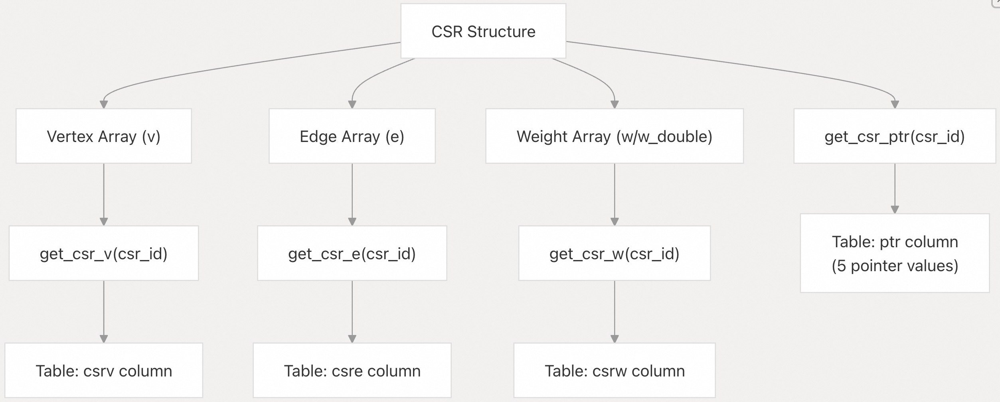
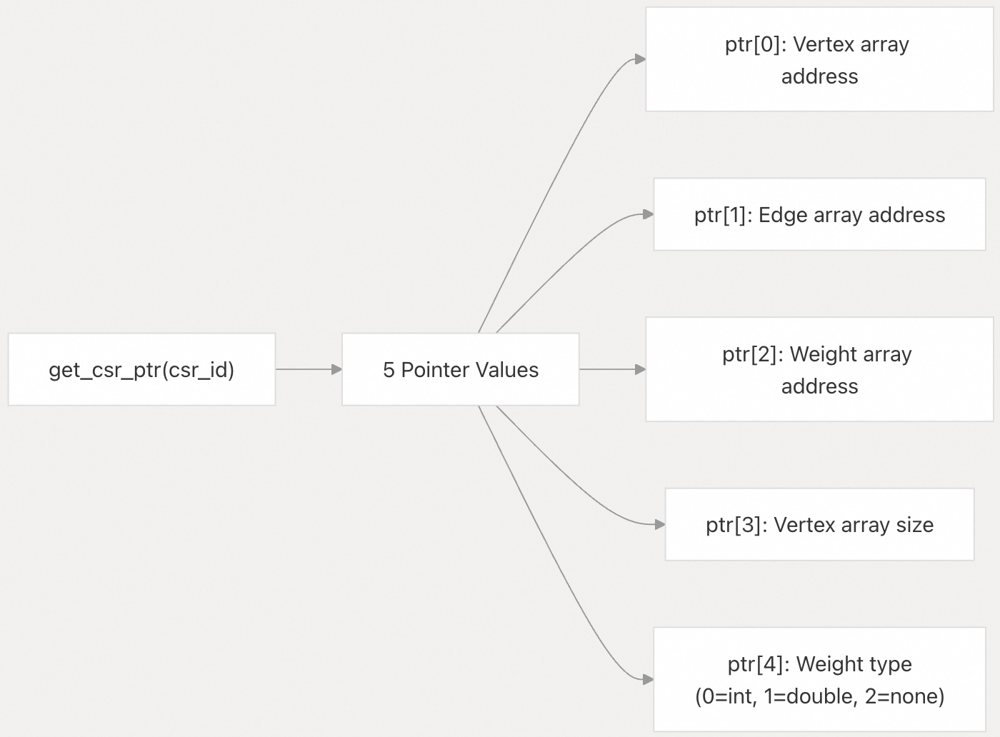
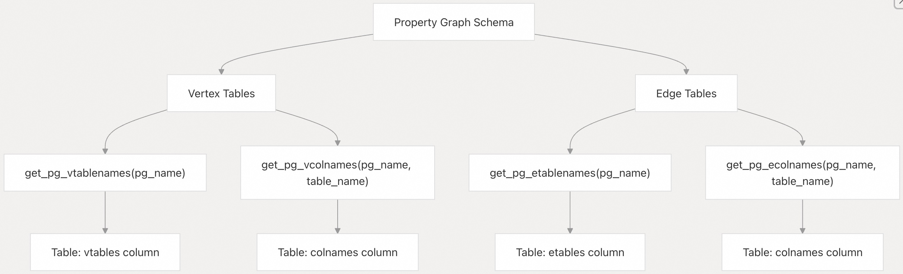
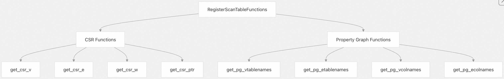
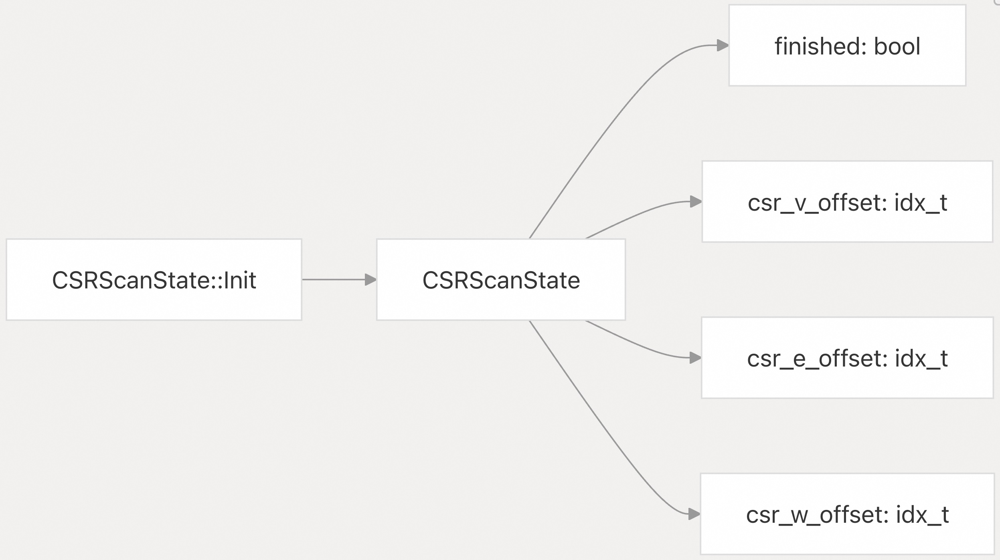

## DuckPGQ 源码学习: 4.3 表函数 (Table Functions)  
                                
### 作者                                
digoal                                                  
                                     
### 日期                                                  
2025-11-07                              
                                                  
### 标签                                                  
DuckDB , PGQ , 属性图 , DuckPGQ , 源码学习                                   
                                                  
----                             
                                                  
## 背景      
DuckPGQ 中的**表函数** (**Table Functions**) 提供了对内部**图数据结构** (**graph data structures**) 和**属性图元数据** (**property graph metadata**) 的直接访问。这些函数通过 SQL 表接口公开了底层的**压缩稀疏行** (**Compressed Sparse Row**, **CSR**) 数据和**属性图模式** (**property graph schema**) 信息，从而实现了高级的图分析和调试能力。  
  
## CSR 数据访问函数 (CSR Data Access Functions)  
  
DuckPGQ 提供了几个表函数来访问存储**图拓扑信息** (**graph topology information**) 的内部 **CSR** (**Compressed Sparse Row**, 压缩稀疏行) 数据结构。这些函数公开了**原始图数据** (**raw graph data**)，用于**调试** (**debugging**)、**分析** (**analysis**) 以及与**外部算法的集成** (**integration with external algorithms**)。  
  
### CSR 结构访问 (CSR Structure Access)  
  
**CSR** 数据访问函数提供了对 **CSR** 表示中三个主要组件的直接访问：  
  
  
  
来源:  
[`src/include/duckpgq/core/functions/table/pgq_scan.hpp` 21-111](https://github.com/cwida/duckpgq-extension/blob/29748bfe/src/include/duckpgq/core/functions/table/pgq_scan.hpp#L21-L111)  
[`src/core/functions/table/pgq_scan.cpp` 17-159](https://github.com/cwida/duckpgq-extension/blob/29748bfe/src/core/functions/table/pgq_scan.cpp#L17-L159)  
  
### CSR 函数实现 (CSR Function Implementations)  
  
**CSR** 扫描函数是使用特定的**数据结构** (**data structures**) 和**扫描操作** (**scan operations**) 实现的：  
  
| 函数 (Function) | 用途 (Purpose) | 返回类型 (Return Type) | 实现 (Implementation) |  
| :--- | :--- | :--- | :--- |  
| `get_csr_v(csr_id)` | 访问**顶点数组** (**vertex array**) | `BIGINT` | `ScanCSRVFunction` |  
| `get_csr_e(csr_id)` | 访问**边数组** (**edge array**) | `BIGINT` | `ScanCSREFunction` |  
| `get_csr_w(csr_id)` | 访问**权重数组** (**weight array**) | `BIGINT`/`DOUBLE` | `ScanCSRWFunction` |  
| `get_csr_ptr(csr_id)` | 获取 **CSR** 指针 (**pointers**) | `UBIGINT` | `ScanCSRPtrFunction` |  
  
`get_csr_ptr` 函数返回一个包含 5 个指针值的特殊表，这些指针值提供了对 **CSR** 数组的**直接内存访问** (**direct memory access**):  
  
  
  
来源:  
[`src/core/functions/table/pgq_scan.cpp` 46-86](https://github.com/cwida/duckpgq-extension/blob/29748bfe/src/core/functions/table/pgq_scan.cpp#L46-L86)  
  
## 属性图元数据函数 (Property Graph Metadata Functions)  
  
DuckPGQ 提供了表函数来访问**属性图模式** (**property graph schema**) 信息，从而实现对**图结构** (**graph structure**) 和**元数据** (**metadata**) 的**自省** (**introspection**)。  
  
### 模式访问函数 (Schema Access Functions)  
  
**属性图元数据**函数提供了对**表名** (**table names**) 和**列信息** (**column information**) 的访问：  
  
  
  
来源:  
[`src/include/duckpgq/core/functions/table/pgq_scan.hpp` 113-179](https://github.com/cwida/duckpgq-extension/blob/29748bfe/src/include/duckpgq/core/functions/table/pgq_scan.hpp#L113-L179)  
[`src/core/functions/table/pgq_scan.cpp` 161-280](https://github.com/cwida/duckpgq-extension/blob/29748bfe/src/core/functions/table/pgq_scan.cpp#L161-L280)  
  
### 元数据函数参考 (Metadata Function Reference)  
  
| 函数 (Function) | 参数 (Parameters) | 用途 (Purpose) | 返回列 (Return Column) |  
| :--- | :--- | :--- | :--- |  
| `get_pg_vtablenames` | `pg_name` | 列出**顶点表名** (**vertex table names**) | `vtables` |  
| `get_pg_etablenames` | `pg_name` | 列出**边表名** (**edge table names**) | `etables` |  
| `get_pg_vcolnames` | `pg_name`, `table_name` | 列出**顶点表列** (**vertex table columns**) | `colnames` |  
| `get_pg_ecolnames` | `pg_name`, `table_name` | 列出**边表列** (**edge table columns**) | `colnames` |  
  
## 用法示例 (Usage Examples)  
  
### 访问 CSR 数据 (Accessing CSR Data)  
  
**CSR** 表函数通常用于调试**图结构** (**graph structures**) 和访问**原始图数据** (**raw graph data**):  
  
```  
-- View CSR vertex array  
SELECT csrv FROM get_csr_v(0);  
  
-- View CSR edge array    
SELECT csre FROM get_csr_e(0);  
  
-- Export CSR data to CSV  
COPY (SELECT csrv FROM get_csr_v(0)) TO 'vertices.csv';  
COPY (SELECT csre FROM get_csr_e(0)) TO 'edges.csv';  
```  
  
来源:  
[`test/sql/csr_segfault.test` 48-70](https://github.com/cwida/duckpgq-extension/blob/29748bfe/test/sql/csr_segfault.test#L48-L70)  
[`test/sql/scalar/getpgschema.test` 86-204](https://github.com/cwida/duckpgq-extension/blob/29748bfe/test/sql/scalar/getpgschema.test#L86-L204)  
  
### 属性图模式自省 (Property Graph Schema Introspection)  
  
**属性图元数据**函数支持**动态模式发现** (**dynamic schema discovery**):  
  
```  
-- List all vertex tables in a property graph  
SELECT * FROM get_pg_vtablenames('pg');  
  
-- List all edge tables  
SELECT * FROM get_pg_etablenames('pg');  
  
-- Get column names for a specific vertex table  
SELECT * FROM get_pg_vcolnames('pg', 'Student');  
  
-- Get column names for a specific edge table  
SELECT * FROM get_pg_ecolnames('pg', 'know');  
```  
  
来源:  
[`test/sql/scalar/getpgschema.test` 110-129](https://github.com/cwida/duckpgq-extension/blob/29748bfe/test/sql/scalar/getpgschema.test#L110-L129)  
  
## 函数注册与实现 (Function Registration and Implementation)  
  
### 表函数注册 (Table Function Registration)  
  
所有表函数都在 `RegisterScanTableFunctions` 方法中注册：  
  
  
  
来源:  
[`src/core/functions/table/pgq_scan.cpp` 285-326](https://github.com/cwida/duckpgq-extension/blob/29748bfe/src/core/functions/table/pgq_scan.cpp#L285-L326)  
  
### 扫描状态管理 (Scan State Management)  
  
所有表函数都使用 `CSRScanState` 类来管理**扫描进度** (**scanning progress**):  
  
  
  
扫描状态跟踪每个数组中的当前位置，并使用以 `DEFAULT_STANDARD_VECTOR_SIZE` 为块大小的**向量化处理** (**vectorized processing**) 来高效地返回**大型数据集** (**large datasets**)。  
  
来源:  
[`src/include/duckpgq/core/functions/table/pgq_scan.hpp` 181-197](https://github.com/cwida/duckpgq-extension/blob/29748bfe/src/include/duckpgq/core/functions/table/pgq_scan.hpp#L181-L197)  
[`src/core/functions/table/pgq_scan.cpp` 30-43](https://github.com/cwida/duckpgq-extension/blob/29748bfe/src/core/functions/table/pgq_scan.cpp#L30-L43)           
        
#### [PolarDB 学习图谱](https://www.aliyun.com/database/openpolardb/activity "8642f60e04ed0c814bf9cb9677976bd4")
  
  
#### [PostgreSQL 解决方案集合](../201706/20170601_02.md "40cff096e9ed7122c512b35d8561d9c8")
  
  
#### [德哥 / digoal's Github - 公益是一辈子的事.](https://github.com/digoal/blog/blob/master/README.md "22709685feb7cab07d30f30387f0a9ae")
  
  
#### [About 德哥](https://github.com/digoal/blog/blob/master/me/readme.md "a37735981e7704886ffd590565582dd0")
  
  

  
