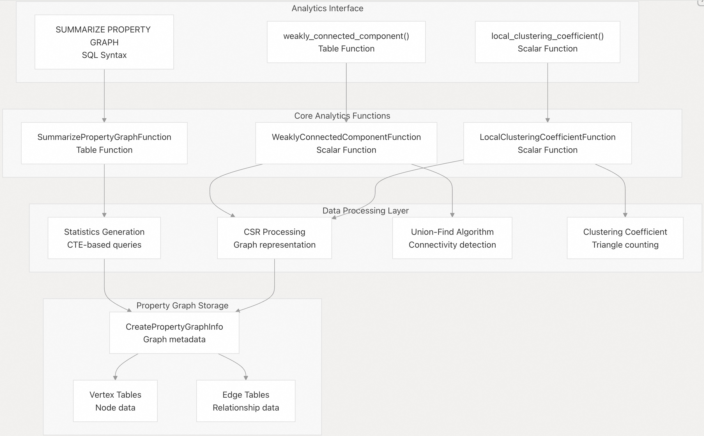
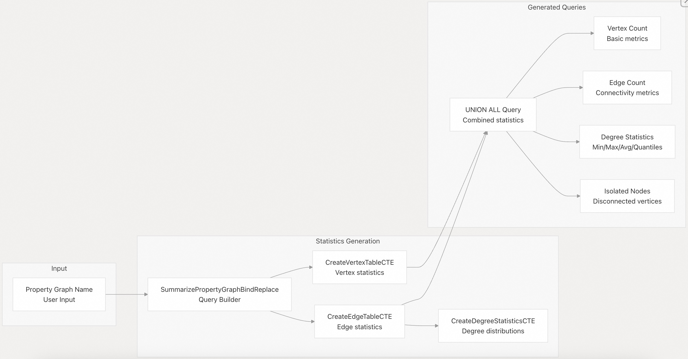
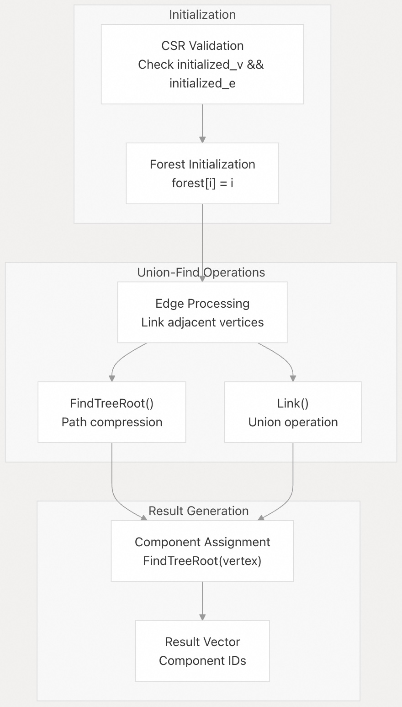
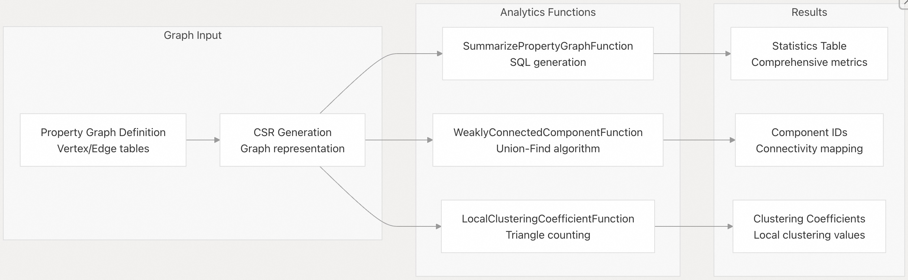

## DuckPGQ 源码学习: 5 图分析 (Graph Analytics)  
                                  
### 作者                                  
digoal                                                    
                                       
### 日期                                                    
2025-11-07                                
                                                    
### 标签                                                    
DuckDB , PGQ , 属性图 , DuckPGQ , 源码学习                                     
                                                    
----                               
                                                    
## 背景        
**DuckPGQ** 提供了一套全面的内置**图算法 (graph algorithms)** 和**统计分析 (statistical analysis)** 功能，用于分析**属性图 (property graphs)**。该系统使用户能够直接在 **SQL 查询**中计算**连通性指标 (connectivity metrics)**、**聚类系数 (clustering coefficients)** 和详细的**图统计信息 (graph statistics)**。  
  
## 分析系统架构 (Analytics System Architecture)  
  
图分析系统围绕三个主要组件构建：**图统计信息生成 (graph statistics generation)**、**连通性分析 (connectivity analysis)** 和**聚类指标计算 (clustering metrics computation)**。  
  
  
  
来源:  
[`src/include/duckpgq/core/functions/table/summarize_property_graph.hpp` 18-67](https://github.com/cwida/duckpgq-extension/blob/29748bfe/src/include/duckpgq/core/functions/table/summarize_property_graph.hpp#L18-L67)  
[`src/core/functions/scalar/weakly_connected_component.cpp` 40-112](https://github.com/cwida/duckpgq-extension/blob/29748bfe/src/core/functions/scalar/weakly_connected_component.cpp#L40-L112)  
[`src/include/duckpgq/core/functions/table.hpp` 8-34](https://github.com/cwida/duckpgq-extension/blob/29748bfe/src/include/duckpgq/core/functions/table.hpp#L8-L34)  
  
## 图统计信息生成 (Graph Statistics Generation)  
  
`SUMMARIZE PROPERTY GRAPH` 功能通过**动态生成的 SQL 查询 (dynamically generated SQL queries)** 提供对图结构的全面**统计分析 (statistical analysis)**。  
  
### 统计信息架构 (Statistics Architecture)  
  
  
  
来源:  
[`src/core/functions/table/summarize_property_graph.cpp` 366-405](https://github.com/cwida/duckpgq-extension/blob/29748bfe/src/core/functions/table/summarize_property_graph.cpp#L366-L405)  
[`src/core/functions/table/summarize_property_graph.cpp` 208-263](https://github.com/cwida/duckpgq-extension/blob/29748bfe/src/core/functions/table/summarize_property_graph.cpp#L208-L263)  
[`src/core/functions/table/summarize_property_graph.cpp` 265-322](https://github.com/cwida/duckpgq-extension/blob/29748bfe/src/core/functions/table/summarize_property_graph.cpp#L265-L322)  
  
### 计算的关键统计信息 (Key Statistics Computed)  
  
| 统计类别 (Statistic Category) | 顶点表 (Vertex Tables) | 边表 (Edge Tables) |  
| :--- | :--- | :--- |  
| **基本计数 (Basic Counts)** | 顶点计数 (Vertex count) | 边计数 (Edge count), 唯一源/目标计数 (Unique source/destination counts) |  
| **连通性 (Connectivity)** | NULL | 孤立源 (Isolated sources), 孤立目标 (Isolated destinations) |  
| **度量指标 (Degree Metrics)** | NULL | **入度 (In-degree)** 和 **出度 (out-degree)** 统计信息（平均值 `avg`、最小值 `min`、最大值 `max`、**分位数 `quantiles`**） |  
| **分布 (Distribution)** | NULL | 度分布百分位数（第 25、50、75 百分位）(Degree distribution percentiles) |  
  
系统为顶点和边统计信息生成单独的**公用表表达式 (Common Table Expressions, CTEs)**，然后使用 `UNION ALL` 操作将它们组合。对于边表，度量统计信息是使用带有**分位数函数 (quantile functions)** 的分组子查询计算的。  
  
来源:  
[`src/core/functions/table/summarize_property_graph.cpp` 161-187](https://github.com/cwida/duckpgq-extension/blob/29748bfe/src/core/functions/table/summarize_property_graph.cpp#L161-L187)  
[`src/core/functions/table/summarize_property_graph.cpp` 86-136](https://github.com/cwida/duckpgq-extension/blob/29748bfe/src/core/functions/table/summarize_property_graph.cpp#L86-L136)  
  
## 连通性分析 (Connectivity Analysis)  
  
**弱连通分量 (Weakly Connected Components, WCC)** 算法使用带有**路径压缩 (path compression)** 的 **Union-Find 数据结构**来识别**无向图 (undirected graphs)** 中的连通分量。  
  
### WCC 算法实现 (WCC Algorithm Implementation)  
  
  
  
来源:  
[`src/core/functions/scalar/weakly_connected_component.cpp` 15-38](https://github.com/cwida/duckpgq-extension/blob/29748bfe/src/core/functions/scalar/weakly_connected_component.cpp#L15-L38)  
[`src/core/functions/scalar/weakly_connected_component.cpp` 73-112](https://github.com/cwida/duckpgq-extension/blob/29748bfe/src/core/functions/scalar/weakly_connected_component.cpp#L73-L112)  
  
### 线程安全和状态管理 (Thread Safety and State Management)  
  
**WCC** 实现使用了多种**同步机制 (synchronization mechanisms)**：  
  
  * `initialize_lock`: 保护森林初始化 (**forest initialization**)  
  * `wcc_lock`: 保护算法收敛状态 (**algorithm convergence state**)  
  * `state_converged`: 跟踪算法完成情况 (**algorithm completion**)  
  * `state_initialized`: 跟踪数据结构初始化 (**data structure initialization**)  
  
该算法维护一个表示 **Union-Find 结构**的**持久 (persistent)** `forest` **向量 (vector)**，并在 `FindTreeRoot()` 中具有**路径压缩 (path compression)** 优化。  
  
来源:  
[`src/include/duckpgq/core/functions/function_data/weakly_connected_component_function_data.hpp` 15-34](https://github.com/cwida/duckpgq-extension/blob/29748bfe/src/include/duckpgq/core/functions/function_data/weakly_connected_component_function_data.hpp#L15-L34)  
[`src/core/functions/scalar/weakly_connected_component.cpp` 73-98](https://github.com/cwida/duckpgq-extension/blob/29748bfe/src/core/functions/scalar/weakly_connected_component.cpp#L73-L98)  
  
## 聚类指标 (Clustering Metrics)  
  
**局部聚类系数 (Local Clustering Coefficient)** 衡量图中**顶点 (vertices)** 聚集在一起的程度，计算为每个顶点**现有三角形 (existing triangles)** 与**可能三角形 (possible triangles)** 的比率。  
  
### 使用模式 (Usage Patterns)  
  
```  
-- Basic clustering coefficient calculation  
SELECT id, local_clustering_coefficient   
FROM local_clustering_coefficient(property_graph, vertex_table, edge_table);  
  
-- Combined with vertex attributes  
SELECT v.id, v.name, lcc.local_clustering_coefficient  
FROM local_clustering_coefficient(pg, student, know) lcc,  
     student v   
WHERE v.id = lcc.id;  
```  
  
该函数返回介于 0.0（无聚类）和 1.0（完全聚类）之间的系数，并对以下情况进行特殊处理：  
  
  * **孤立顶点 (Isolated vertices)**：系数 = 0.0  
  * 度数小于 2 的顶点：系数 = 0.0  
  * **自环 (Self-loops)**：从三角形计算中排除  
  
来源:  
[`test/sql/scalar/local_clustering_coefficient.test` 71-88](https://github.com/cwida/duckpgq-extension/blob/29748bfe/test/sql/scalar/local_clustering_coefficient.test#L71-L88)  
[`test/sql/scalar/local_clustering_coefficient.test` 199-231](https://github.com/cwida/duckpgq-extension/blob/29748bfe/test/sql/scalar/local_clustering_coefficient.test#L199-L231)  
  
## 分析数据流 (Analytics Data Flow)  
  
分析系统通过**标准化流程 (standardized pipeline)** 处理**属性图 (property graphs)**，该流程利用 **CSR (Compressed Sparse Row)** 表示形式进行高效的**图遍历 (graph traversal)**。  
  
### 处理流程 (Processing Pipeline)  
  
  
  
来源:  
[`src/core/functions/table/summarize_property_graph.cpp` 367-405](https://github.com/cwida/duckpgq-extension/blob/29748bfe/src/core/functions/table/summarize_property_graph.cpp#L367-L405)  
[`src/core/functions/scalar/weakly_connected_component.cpp` 47-61](https://github.com/cwida/duckpgq-extension/blob/29748bfe/src/core/functions/scalar/weakly_connected_component.cpp#L47-L61)  
[`test/sql/scalar/local_clustering_coefficient.test` 71-78](https://github.com/cwida/duckpgq-extension/blob/29748bfe/test/sql/scalar/local_clustering_coefficient.test#L71-L78)  
  
系统自动处理 **CSR 生命周期管理 (CSR lifecycle management)**，在**分析计算 (analytics computation)** 后将 **CSR 结构 (CSR structures)** 标记为**删除 (deletion)**，以有效地管理**内存 (memory)**。  
  
来源:  
[`src/core/functions/scalar/weakly_connected_component.cpp` 110-111](https://github.com/cwida/duckpgq-extension/blob/29748bfe/src/core/functions/scalar/weakly_connected_component.cpp#L110-L111)  
[`src/core/functions/function_data/weakly_connected_component_function_data.cpp` 26-27](https://github.com/cwida/duckpgq-extension/blob/29748bfe/src/core/functions/function_data/weakly_connected_component_function_data.cpp#L26-L27)  
  
# 附录: "图统计信息"、"连通性"和"聚类指标"的业务应用场景  
  
## 图统计信息 (Graph Statistics)  
  
`SUMMARIZE PROPERTY GRAPH` 功能提供全面的图结构统计分析。 该功能计算以下统计指标:   
  
**业务应用场景:**  
- **数据质量监控**: 通过顶点数、边数、孤立节点数量来评估图数据完整性   
- **网络健康度分析**: 度分布统计(平均度、最小/最大度、分位数)帮助识别网络中的异常节点    
- **容量规划**: 通过统计信息预估存储和计算资源需求   
  
测试示例展示了社交网络场景的统计输出:    
  
## 连通性分析 (Connectivity Analysis)  
  
弱连通分量 (WCC) 算法使用 Union-Find 数据结构识别图中的连通组件。 该算法通过 `weakly_connected_component()` 函数调用。   
  
**业务应用场景:**  
- **社区发现**: 在社交网络中识别不同的用户群体    
- **欺诈检测**: 识别可疑账户集群和关联网络   
- **网络分割分析**: 评估网络的连通性和脆弱性    
- **数据清洗**: 识别孤立或断开的数据子集   
  
## 聚类指标 (Clustering Metrics)  
  
局部聚类系数 (Local Clustering Coefficient) 衡量节点邻居之间的聚集程度,计算为实际三角形数与可能三角形数的比值。    
  
**业务应用场景:**  
- **社交网络分析**: 评估用户的社交圈紧密度    
- **推荐系统**: 基于聚类系数推荐潜在好友或内容   
- **影响力分析**: 高聚类系数的节点通常在社区中具有更强的影响力    
- **网络结构研究**: 识别小世界网络特征和社区结构   
  
实际应用示例显示在 Bluesky 社交网络中的使用:    
  
## Notes  
  
这三个功能通常结合使用以提供全面的图分析能力。 例如,在社交网络分析中,可以先用统计信息了解网络规模,再用连通性分析识别社区,最后用聚类系数评估社区内部的紧密程度。 代码库还提供了 PageRank 等其他分析功能作为补充。   
  
# 附录: PageRank 的算法及应用场景  
在 DuckPGQ 扩展中,PageRank 通过表函数和标量函数两层实现。   
  
## 算法概述  
  
PageRank 是一种迭代算法, 用于计算图中每个节点的重要性分数。 算法基于 CSR(压缩稀疏行)图表示, 通过迭代传播排名值直到收敛。    
  
## 核心参数  
  
算法使用以下关键参数:    
  
- **初始排名**: 每个节点初始化为 `1.0 / v_size`  
- **阻尼因子**: 0.85(典型值)  
- **收敛阈值**: 1e-6  
- **状态管理**: 使用 `rank` 和 `temp_rank` 向量存储当前和临时排名值  
  
## 迭代计算过程  
  
算法的核心迭代逻辑如下:    
  
1. **排名分配**: 每个节点将其排名平均分配给所有出边邻居    
2. **悬挂节点处理**: 没有出边的节点(悬挂节点)的排名被收集并重新分配   
3. **阻尼因子应用**: 使用公式 `(1-d)/N + d*(传入排名 + 悬挂节点修正)`    
4. **收敛检测**: 当最大变化小于阈值时停止迭代    
  
## 使用方式  
  
### 表函数接口  
  
通过 `pagerank()` 表函数调用:    
  
```sql  
SELECT id, pagerank FROM pagerank(pg, student, know);  
```  
  
该函数接受三个参数:属性图名称、顶点表标签和边表标签。   
  
### 实际示例  
  
测试用例展示了在学生社交网络中的应用:    
  
在这个例子中,节点 3 和节点 0 获得了最高的 PageRank 值(0.328 和 0.307),表明它们在网络中最重要。   
  
另一个测试展示了更复杂的网络:    
  
## 线程安全与状态管理  
  
算法使用互斥锁保证线程安全: 状态数据通过 `PageRankFunctionData` 类管理,包含排名向量、收敛状态和迭代计数。    
  
## 函数注册  
  
PageRank 在两个层面注册:    
- 表函数: `RegisterPageRankTableFunction`  
- 标量函数: `RegisterPageRankScalarFunction`    
  
标量函数签名为 `pagerank(INTEGER, BIGINT) -> DOUBLE`,用于在查询执行期间计算单个节点的排名值。   
  
## Notes  
  
PageRank 与其他图分析功能(如弱连通分量和聚类系数)一起使用,可以提供全面的网络分析能力。 在 Bluesky 社交网络测试中,PageRank 与聚类系数和连通性分析结合使用。 算法执行完成后,CSR 数据结构会被标记为删除以管理内存。   
  
# 附录3: DuckPGQ 扩展中 `SUMMARIZE PROPERTY GRAPH` 功能返回的四类关键图统计信息的含义  
  
`SUMMARIZE PROPERTY GRAPH` 函数为属性图生成全面的统计信息,返回结果包含以下四个关键类别:  
  
### 1. 基本计数 (Basic Counts)  
  
**顶点表返回:**  
- `vertex_count`: 顶点表中的节点总数    
  
**边表返回:**  
- `edge_count`: 边表中的边总数    
- `unique_source_count`: 不同源节点的数量(通过 `COUNT(DISTINCT source_fk)` 计算)    
- `unique_destination_count`: 不同目标节点的数量(通过 `COUNT(DISTINCT destination_fk)` 计算)   
  
**示例结果:**    
```  
Person表: vertex_count=50  
Person_knows_person表: edge_count=83, unique_source_count=28, unique_destination_count=29  
```  
  
### 2. 连通性 (Connectivity)  
  
**边表返回:**  
- `isolated_sources`: 源表中没有任何出边的孤立节点数量(通过 LEFT JOIN 查找 NULL 的外键)    
- `isolated_destinations`: 目标表中没有任何入边的孤立节点数量    
  
**计算逻辑:** 使用 LEFT JOIN 将顶点表与边表连接,然后统计外键为 NULL 的记录数    
  
**示例结果:**    
```  
Person_knows_person表: isolated_sources=22, isolated_destinations=21  
```  
  
### 3. 度量指标 (Degree Metrics)  
  
**边表返回入度和出度的统计指标:**  
- `avg_in_degree` / `avg_out_degree`: 平均入度/出度   
- `min_in_degree` / `min_out_degree`: 最小入度/出度   
- `max_in_degree` / `max_out_degree`: 最大入度/出度   
  
**计算方式:** 首先按度数分组统计每个度数的节点数量,然后在此基础上计算聚合统计    
  
**示例结果:**    
```  
Person_knows_person表:   
  avg_in_degree=2.86, min_in_degree=1, max_in_degree=10  
  avg_out_degree=2.96, min_out_degree=1, max_out_degree=13  
```  
  
### 4. 分布 (Distribution)  
  
**边表返回入度和出度的分位数:**  
- `q25_in_degree` / `q25_out_degree`: 第25百分位数(下四分位数) [   
- `q50_in_degree` / `q50_out_degree`: 第50百分位数(中位数)    
- `q75_in_degree` / `q75_out_degree`: 第75百分位数(上四分位数)    
  
**计算方式:** 使用 `approx_quantile` 函数在度数分布上计算近似分位数    
  
**示例结果:**    
```  
Person_knows_person表:  
  入度分布: q25=1, q50=2, q75=3  
  出度分布: q25=1, q50=2, q75=4  
```  
  
## Notes  
  
- 顶点表的连通性、度量指标和分布字段均为 NULL,因为这些指标仅适用于边表    
- 系统使用 CTE(公共表表达式)生成这些统计信息,对于多个表的图会使用 UNION ALL 合并结果    
- 度数统计通过两层聚合实现:先按度数分组计数,再在分组结果上计算统计量    
  
  
  
# 附录4: `SUMMARIZE PROPERTY GRAPH` 返回的统计指标在实际业务场景中的含义  
补充每个维度不同数值所代表的业务意义。   
  
## 业务意义解读  
  
### 1. 基本计数 (Basic Counts)  
  
**vertex_count (顶点数量)**    
- **高数值**: 表示图规模较大,可能需要更多计算资源  
- **业务含义**: 在社交网络中代表用户总数,在知识图谱中代表实体总数  
  
**edge_count (边数量)**    
- **高数值**: 表示关系密集,图的连接性强  
- **与顶点数比值**: 如果 edge_count >> vertex_count,说明是密集图;如果接近,说明是稀疏图  
- **业务含义**: 在社交网络中代表好友关系总数,在推荐系统中代表用户-商品交互总数  
  
**unique_source_count / unique_destination_count (唯一源/目标节点数)**    
- **与 vertex_count 对比**: 如果远小于 vertex_count,说明只有部分节点参与该类型关系  
- **业务含义**: 在电商场景中,unique_source_count 代表有购买行为的活跃用户数,而非所有注册用户  
  
### 2. 连通性 (Connectivity)  
  
**isolated_sources (孤立源节点)**    
- **高数值**: 表示大量节点没有出边,可能是"僵尸账号"或新用户  
- **业务场景**:  
  - 社交网络: 没有关注任何人的用户,可能需要推荐关注  
  - 电商: 从未购买过商品的用户,需要激活策略  
- **计算公式**: `isolated_sources = vertex_count - unique_source_count`    
  
**isolated_destinations (孤立目标节点)**    
- **高数值**: 表示大量节点没有入边,可能是"冷门内容"或新商品  
- **业务场景**:  
  - 社交网络: 没有粉丝的用户  
  - 电商: 从未被购买的商品,可能需要下架或促销  
  
### 3. 度量指标 (Degree Metrics)  
  
**avg_in_degree / avg_out_degree (平均入度/出度)**    
- **数值含义**:  
  - `avg_in_degree = edge_count / unique_destination_count`  
  - `avg_out_degree = edge_count / unique_source_count`  
- **业务解读**:  
  - 社交网络: avg_out_degree=2.96 表示平均每个活跃用户关注约3个人    
  - 电商: avg_out_degree 表示平均每个用户购买的商品数  
  
**min/max_in_degree 和 min/max_out_degree (最小/最大度数)**    
- **max_in_degree=10**: 最受欢迎的节点有10个入边,可能是"网红"或"爆款商品"    
- **max_out_degree=13**: 最活跃的节点有13个出边,可能是"超级用户"    
- **min=1**: 表示参与关系的节点至少有1条边(因为孤立节点不参与度数统计)  
  
### 4. 分布 (Distribution)  
  
**q25/q50/q75 分位数**    
  
以示例数据为例:    
```  
入度分布: q25=1, q50=2, q75=3  
出度分布: q25=1, q50=2, q75=4  
```  
  
**业务解读**:  
- **q50=2 (中位数)**: 50%的节点入度≤2,说明大多数节点的连接数较少  
- **q75=3**: 75%的节点入度≤3,只有25%的节点入度>3,说明存在"长尾效应"  
- **q25=1**: 25%的节点只有1个入边,属于"边缘节点"  
  
**分布形态判断**:  
- **均匀分布**: q25、q50、q75 差距较小,说明节点度数分布均匀  
- **幂律分布**: q75 >> q50 >> q25,说明存在少数"超级节点"和大量"普通节点",符合社交网络的典型特征  
- **示例分析**: 出度分布(1,2,4)比入度分布(1,2,3)更分散,说明用户的主动关注行为差异更大  
  
## 综合业务应用  
  
**健康图的特征**:  
- `unique_source_count` 和 `unique_destination_count` 接近 `vertex_count`,说明大部分节点都参与关系  
- `isolated_sources` 和 `isolated_destinations` 较低,说明连通性好  
- 度数分布合理,没有极端的 max 值  
  
**问题图的特征**:  
- 高 `isolated_sources/destinations` 比例(>50%),需要激活策略  
- `max_in_degree` 极高但 `avg_in_degree` 很低,说明存在严重的"马太效应"  
- `unique_source_count` << `vertex_count`,说明大量"僵尸节点"  
  
## Notes  
  
这些统计指标通过两层聚合计算得出  ,先按度数分组统计节点数量,再计算聚合统计量。 分位数使用 `approx_quantile` 函数计算近似值 ,在大规模图上性能更好。   
    
#### [PolarDB 学习图谱](https://www.aliyun.com/database/openpolardb/activity "8642f60e04ed0c814bf9cb9677976bd4")
  
  
#### [PostgreSQL 解决方案集合](../201706/20170601_02.md "40cff096e9ed7122c512b35d8561d9c8")
  
  
#### [德哥 / digoal's Github - 公益是一辈子的事.](https://github.com/digoal/blog/blob/master/README.md "22709685feb7cab07d30f30387f0a9ae")
  
  
#### [About 德哥](https://github.com/digoal/blog/blob/master/me/readme.md "a37735981e7704886ffd590565582dd0")
  
  

  
