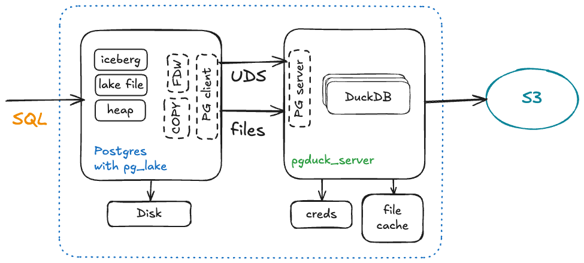

## 被snowflake收购后开源pg_lake(PG集成数据湖)系列插件, 3天揽得1K Star  
                                      
### 作者                                      
digoal                                      
                                      
### 日期                                      
2025-11-07                                     
                                      
### 标签                                      
PostgreSQL , DuckDB , parquet , Iceberg , 数据湖 , pg_lake                  
                                      
----                                      
                                      
## 背景   
CrunchyData 被 Snowflake 收购后, 感觉更开放, 更给力了!  
  
开源pg_lake系列插件, 让PG更顺畅的拥有数据湖的能力! 3天揽得1K Star.    
  
https://github.com/Snowflake-Labs/pg_lake  
  
## pg\_lake 是什么? 用于 Iceberg 和数据湖的 Postgres  
  
`pg_lake` 将 **Iceberg** 和**数据湖文件**（data lake files）集成到 **Postgres** 中。通过 `pg_lake` **扩展**（extensions），您可以将 **Postgres** 用作一个独立的**湖仓系统**（lakehouse system），该系统支持对 **Iceberg 表**（Iceberg tables）执行**事务**（transactions）和快速**查询**（queries），并且可以直接处理 **S3** 等**对象存储**（object stores）中的**原始数据文件**（raw data files）。  
  
### pg\_lake 的核心能力（At a high level）  
  
在较高层面，`pg_lake` 允许您：  
  
  * 直接通过 **PostgreSQL** **创建**（Create）和**修改**（modify） **[Iceberg](https://iceberg.apache.org/) 表**，具有完整的**事务保证**（transactional guarantees），并可从其他**引擎**（engines）进行**查询**（query）。  
  * **查询**（Query）和**导入**（import） **对象存储**（object storage）中的 **Parquet**、**CSV**、**JSON** 和 **Iceberg 格式**的**数据文件**（data files）。  
  * 使用 **COPY 命令**将**查询结果**（query results）以 **Parquet**、**CSV** 或 **JSON 格式** **导出**（Export）回**对象存储**。  
  * 读取 **GDAL** 支持的**地理空间格式**（geospatial formats），例如 **GeoJSON** 和 **Shapefiles**。  
  * 使用内置的 **[map 类型](https://github.com/Snowflake-Labs/pg_lake/pg_map/README.md)**（map type）处理**半结构化**（semi-structured）或**键值**（key–value）数据。  
  * 在相同的 **SQL 查询**（SQL queries）和**修改**（modifications）中结合**堆表**（heap）、**Iceberg** 和**外部 Parquet/CSV/JSON 文件**——所有操作都具有完整的**事务保证**，且无 **SQL 限制**（SQL limitations）。  
  * 从 **Iceberg**、**Parquet**、**JSON** 和 **CSV 文件**等**外部数据源**（external data sources）中**推断**（Infer） **表列**（table columns）和**类型**（types）。  
  * **利用**（Leverage）底层的 **DuckDB 查询引擎**（query engine）进行**快速执行**（fast execution），而无需离开 **Postgres**。  
  
来看看pg_lake的架构:    
  
## 架构（Architecture）  
一个 `pg_lake` **实例**（instance）由两个主要**组件**（components）组成：**带有 pg\_lake 扩展的 PostgreSQL** 和 **pgduck\_server**。用户连接到 **PostgreSQL** 运行 **SQL 查询**，而 `pg_lake` **扩展**通过与 **Postgres** 的**钩子**（hooks）集成，来处理**查询规划**（query planning）、**事务边界**（transaction boundaries）以及**执行**（execution）的整体**编排**（orchestration）。  
  
在**幕后**（Behind the scenes），**查询执行**的**部分**被委托给 **DuckDB**。这是通过 `pgduck_server` 实现的，`pgduck_server` 是一个**独立**的**多线程进程**（multi-threaded process），它（在本地）实现了 **PostgreSQL wire protocol 协议**。  
  
这个**进程**（process）运行 **DuckDB**，并结合我们的 `duckdb_pglake` **扩展**，该扩展添加了 **PostgreSQL 兼容**的**函数**（functions）和**行为**（behavior）。通常，用户不需要知道 `pgduck_server` 的存在；它**透明地**（transparently）运行以提高**性能**（performance）。在适当的时候，`pg_lake` 将**数据扫描**（scanning of the data）和**计算**（computation）委托给 **DuckDB** 的**高度并行**（highly parallel）、**列式**（column-oriented） **执行引擎**。  
  
这种**分离**（separation）也避免了将 **DuckDB** 直接**嵌入**（embedding）到 **Postgres 进程**（process）中可能产生的**线程**（threading）和**内存安全限制**（memory-safety limitations），因为 **Postgres 进程**是围绕**进程隔离**（process isolation）而非**多线程执行**设计的。  
  
  
  
### 组件（Components）  
  
`pg_lake` 遵循**模块化设计**（modular design），围绕**一组可互操作的组件**（set of interoperating components）构建。这些**组件**主要实现为 **PostgreSQL 扩展**，其他则为**支持服务**（supporting services）或**库**（libraries）。  
  
当前的**组件集**（set of components）包括：  
  
  * **pg\_lake\_iceberg**：一个实现了 **[Iceberg 规范](https://iceberg.apache.org/)** 的 **PostgreSQL 扩展**。  
  * **pg\_lake\_table**：一个实现了**外部数据包装器**（foreign data wrapper），用于**查询对象存储**中的**文件**的 **PostgreSQL 扩展**。  
  * **pg\_lake\_copy**：一个实现了 **COPY to/from** 您的**数据湖**（data lake）的 **PostgreSQL 扩展**。  
  * **pg\_lake\_engine**：用于不同 `pg_lake` **扩展**的**通用模块**（common module）。  
  * **pg\_extension\_base**：其他**扩展**的**基础构建块**（foundational building block）。  
  * **pg\_extension\_updater**：用于在**启动**时**更新**所有**扩展**的**扩展**。  
  * **pg\_lake\_benchmark**：对**湖表**（lake tables）执行各种**基准测试**（benchmarks）的 **PostgreSQL 扩展**。  
  * **pg\_map**：一个**通用 map 类型生成器**（generic map type generator）。  
  * **pgduck\_server**：一个**独立服务器**（stand-alone server），它将 **DuckDB** **加载**（loads）到同一**服务器机器**（server machine）上，并通过 **PostgreSQL 协议** **暴露** （exposes） **DuckDB** 。  
  * **duckdb\_pglake**：一个 **DuckDB 扩展**，它向 **DuckDB** 添加了缺失的 **PostgreSQL 函数** 。  
  
## 准备 `pg_lake`（Setting up `pg_lake`）  
  
准备 `pg_lake` 有两种方式：使用 **Docker**（用于易于运行的测试环境）或**从源代码构建**（Building from source）（用于手动设置或开发用途）。这两种方法都包括 **PostgreSQL 扩展**（extensions）、`pgduck_server` **应用**（application）以及**设置 S3 兼容存储**（S3-compatible storage）。  
  
### 使用 Docker  
  
遵循 **[Docker README](https://github.com/Snowflake-Labs/pg_lake/docker/README.md)** 以使用 **Docker** 设置和运行 `pg_lake`。  
  
### 从源代码构建（Building from source）  
  
一旦您 **[构建并安装了所需的组件](https://github.com/Snowflake-Labs/pg_lake/docs/building-from-source.md)** ，您就可以在 Postgres 内部 **初始化** （initialize）`pg_lake`。  
  
#### 创建扩展（Creating the extensions）  
  
使用 **`CASCADE`** 一次性**创建**所有必需的**扩展**：  
  
```sql  
CREATE EXTENSION pg_lake CASCADE;  
NOTICE:  installing required extension "pg_lake_table"  
NOTICE:  installing required extension "pg_lake_engine"  
NOTICE:  installing required extension "pg_extension_base"  
NOTICE:  installing required extension "pg_lake_iceberg"  
NOTICE:  installing required extension "pg_lake_copy"  
CREATE EXTENSION  
```  
  
#### 运行 `pgduck_server`（Running `pgduck_server`）  
  
`pgduck_server` 是一个**独立进程**（standalone process），它（在本地）实现了 **Postgres** 的**协议**（wire-protocol），并在底层使用 **DuckDB** 来**执行查询**。  
  
当您运行 `pgduck_server` 时，它会开始监听 **Unix 域套接字**（unix domain socket）上的端口 `5332`：  
  
```  
pgduck_server  
LOG pgduck_server is listening on unix_socket_directory: /tmp with port 5332, max_clients allowed 10000  
```  
  
由于 `pgduck_server` 实现了 **Postgres 线协议**，您可以通过 **psql** 在端口 `5332` 和主机 `/tmp` 上访问它，并通过 **DuckDB** 运行命令。  
  
例如，您可以获取 **DuckDB 版本**（DuckDB version）：  
  
```sql  
psql -p 5332 -h /tmp  
  
select version() as duckdb_version;   
duckdb_version   
----------------   
v1.3.2 (1 row)  
```  
  
您也可以在启动**服务器**（server）时提供一些额外的**设置**（settings），要查看全部设置：  
  
```  
pgduck_server --help  
```  
  
在**生产系统**（production systems）上，有一些重要的**设置**应该被调整：  
  
  * `--memory_limit`：可选地指定 `pgduck_server` 的**最大内存**（maximum memory），类似于 **DuckDB** 的 `memory_limit`，默认是**系统内存**（system memory）的 80%。  
  * `--init_file_path <path>`：在**启动**（start-up）时**执行**此文件中的所有**语句**（statements）。  
  * `--cache_dir`：指定用于**缓存**（cache） **远程文件**（remote files）（来自 **S3**）的**目录**（directory）。  
  
#### 将 `pg_lake` 连接到 S3（或兼容服务）  
  
`pgduck_server` 依赖 **DuckDB [secrets manager]** 进行**凭证**（credentials）管理，它默认遵循 **AWS** 和 **GCP** 的**凭证链**（credentials chain）。请确保您的**云凭证**（cloud credentials）配置正确，例如，通过在 `~/.aws/credentials` 中设置它们。  
  
一旦您设置了**凭证链**，您应该设置 `pg_lake_iceberg.default_location_prefix`。这是 **Iceberg 表**的**存储位置**（location）。  
  
```sql  
SET pg_lake_iceberg.default_location_prefix TO 's3://testbucketpglake';  
```  
  
您也可以在 `pgduck_server` 上设置**凭证**，用于 **[使用 minio 进行本地开发]** 。  
  
## 使用 `pg_lake`（Using pg\_lake）  
  
### 创建 Iceberg 表（Create an Iceberg table）  
  
您可以通过在 **CREATE TABLE 语句**中添加 `USING iceberg` 来**创建 Iceberg 表**。  
  
```sql  
CREATE TABLE iceberg_test USING iceberg   
      AS SELECT   
            i as key, 'val_'|| i  as val  
         FROM   
            generate_series(0,99)i;  
```  
  
然后，**查询**它：  
  
```sql  
SELECT count(*) FROM iceberg_test;  
 count   
-------  
   100  
(1 row)  
```  
  
然后您可以看到 **Iceberg 元数据位置**（metadata location）：  
  
```sql  
SELECT table_name, metadata_location FROM iceberg_tables;  
  
  
    table_name     |                                                metadata_location  
-------------------+--------------------------------------------------------------------------------------------------------------------  
 iceberg_test      | s3://testbucketpglake/postgres/public/test/435029/metadata/00001-f0c6e20a-fd1c-4645-87c9-c0c64b92992b.metadata.json  
```  
  
### COPY 导入/导出 S3（COPY to/from S3）  
  
您可以使用 **COPY 命令**直接**导入**（import）或**导出**（export） **Parquet**、**CSV** 或**换行符分隔的 JSON**（newline-delimited JSON）格式的数据。格式会从**文件扩展名**（file extension）中自动**推断**（inferred），或者您可以使用 **COPY 选项**（options）如 `WITH (format 'csv', compression 'gzip')` 来**显式指定**（specify it explicitly）。  
  
```sql  
-- 将数据从 Postgres 以 Parquet 格式复制到 S3  
-- 从任何数据源读取，包括 iceberg 表、堆表或任何查询结果  
COPY (SELECT * FROM iceberg_test) TO 's3://testbucketpglake/parquet_data/iceberg_test.parquet';  
  
-- 从 S3 复制回 Postgres 中的任何表  
-- 此示例复制到 iceberg 表中，但也可以是堆表 (heap table)  
COPY iceberg_test FROM 's3://testbucketpglake/parquet_data/iceberg_test.parquet';  
```  
  
### 为 S3 上的文件创建外部表（Create foreign table for files on s3）  
  
您可以直接从一个**文件**或一组**文件**中**创建外部表**（foreign table），而无需指定**列名**（column names）或**类型**（types）。  
  
```sql  
-- 使用该路径下的文件，可以使用 * 代表所有文件  
CREATE FOREIGN TABLE parquet_table()   
SERVER pg_lake   
OPTIONS (path 's3://testbucketpglake/parquet_data/*.parquet');  
  
-- 注意，我们从文件中推断列  
\d parquet_table  
              Foreign table "public.parquet_table"  
 Column |  Type   | Collation | Nullable | Default | FDW options   
--------+---------+-----------+----------+---------+-------------  
 key    | integer |           |          |         |   
 val    | text    |           |          |         |   
Server: pg_lake  
FDW options: (path 's3://testbucketpglake/parquet_data/*.parquet')  
  
-- 然后，查询它  
select count(*) from parquet_table;  
 count   
-------  
   100  
(1 row)  
```  
  
  
## 历史（History）  
  
`pg_lake` **开发**（development）始于 2024 年初的 **[Crunchy Data](https://www.crunchydata.com/)**，目标是将 **Iceberg** 引入 **PostgreSQL**。最初的几个月专注于构建**外部查询引擎**（external query engine）（即 **DuckDB**）的稳健**集成**（integration）。为了尽早推向市场，**查询/导入/导出**（query/import/export）功能以 **[Crunchy Bridge for Analytics]** 的名称提供给 **[Crunchy Bridge]** 客户。  
  
接下来，我们开始构建 **Iceberg (v2) 协议**的**全面实现**（comprehensive implementation），支持**事务**（transactions）和几乎所有 **PostgreSQL 特性**（features）。2024 年 11 月，我们将 **Crunchy Bridge for Analytics** 重新发布为 **Crunchy Data Warehouse**，可在 **Crunchy Bridge** 和**本地**（on-premises）使用。  
  
2025 年 6 月，**[Crunchy Data 被 Snowflake 收购]**。在**收购**（acquisition）之后，**Snowflake** 决定在 2025 年 11 月将该项目**开源**（open source）为 `pg_lake`。**初始版本**（initial version）是 **3.0**，因为它之前已经有两代产品。  
    
#### [PolarDB 学习图谱](https://www.aliyun.com/database/openpolardb/activity "8642f60e04ed0c814bf9cb9677976bd4")
  
  
#### [PostgreSQL 解决方案集合](../201706/20170601_02.md "40cff096e9ed7122c512b35d8561d9c8")
  
  
#### [德哥 / digoal's Github - 公益是一辈子的事.](https://github.com/digoal/blog/blob/master/README.md "22709685feb7cab07d30f30387f0a9ae")
  
  
#### [About 德哥](https://github.com/digoal/blog/blob/master/me/readme.md "a37735981e7704886ffd590565582dd0")
  
  

  
