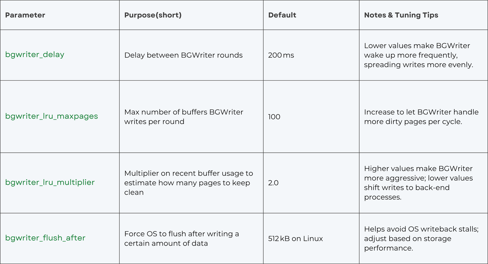
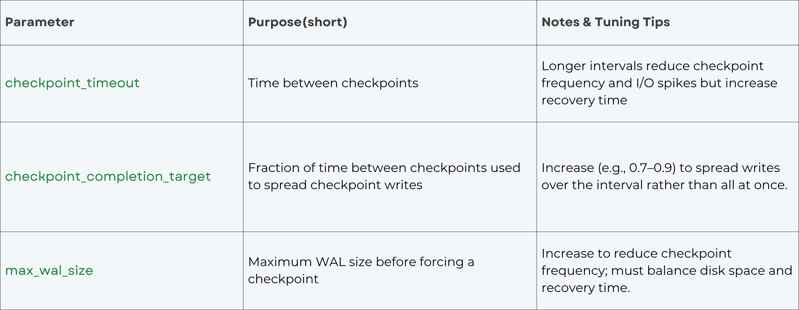

## PostgreSQL 内存参数优化/刷脏优化            
                                                        
### 作者                                                        
digoal                                                        
                                                        
### 日期                                                        
2025-11-07                                                       
                                                        
### 标签                                                        
PostgreSQL , DuckDB , dirty page , 脏页 , 检查点刷脏 , 后台刷脏 , 后端刷脏 , 操作系统刷脏 , huge page , shared buffer , 垃圾回收 , freeze                             
                                                        
----                                                        
                                                        
## 背景       
PostgreSQL的脏页是什么?    
    
什么是检查点刷脏? 什么是后台刷脏? 什么是用户后端进程刷脏?    
    
什么是double cache? 什么是操作系统刷脏?    
    
为什么要使用大页?    
    
为什么需要SSD?    
    
什么是IO调度策略? 如何配置?     
    
很多问题, 都可以从这篇文章找到答案?    
    
https://stormatics.tech/blogs/what-are-dirty-pages-in-postgresql    
    
## 翻译    
PostgreSQL 将数据存储在固定大小的块（页）中，通常为 8 KB。当客户端更新或插入数据时，PostgreSQL 并不会立即将这些更改写入磁盘。相反，它会将受影响的页加载到共享内存（shared buffers）中，在内存中进行修改，并将该页标记为“脏页”。所谓“脏页”，是指内存中的该页版本比磁盘上的副本更新。    
    
在将控制权交还给客户端之前，PostgreSQL 会将此次更改记录到预写日志（Write-Ahead Log，WAL）中，以确保即使数据库崩溃，数据依然具有持久性。然而，实际的表文件并不会被立即更新，直到检查点（checkpoint）或后台写入器（background writer）将脏页刷新到磁盘为止。脏页会在内存中不断累积，直到通过以下三种机制之一被刷新：    
    
- **后台写入器（Background Writer，BGWriter）**：一个守护进程，当干净缓冲区数量变低时，会持续将脏页写入磁盘。    
- **检查点进程（Checkpointer）**：定期在检查点时（例如 checkpoint_timeout 间隔到期，或 WAL 超过 max_wal_size）将所有脏页刷新到磁盘。    
- **后端进程（Backend processes）**：在紧急情况下（例如共享缓冲区被脏页占满），普通后端进程会自己执行脏页写入，这可能会导致用户查询停滞(翻译不准, 应该是响应变慢)。    
    
更多PG内核原理, 可参考本书:     
- https://www.interdb.jp/pg/    
    
理解和控制这些脏页的刷新方式与时机，是实现良好 PostgreSQL 性能的关键。    
    
---    
    
## 为什么脏页很重要    
    
脏页在多个方面影响性能：    
    
- **检查点期间的 I/O 尖峰**：当检查点发生时，所有脏页都必须被刷新到磁盘。如果有大量脏页，这种刷新会产生巨大的 I/O 尖峰，从而降低其他查询的性能。参数 checkpoint_timeout、checkpoint_completion_target 和 max_wal_size 控制检查点刷新脏页的频率和激进程度。    
- **后端写入**：当共享缓冲区被脏页填满，而后台写入器又无法及时处理时，后端进程(就是客户端连接到数据库时, 数据库为客户端开启的专用进程)就会开始自己刷新页面，这会导致用户查询停滞。为了尽量减少这类停滞，应调整内存和刷新参数，使后台写入器承担大部分工作。实践中，这意味着应合理设置 shared_buffers 的大小，并调整后台写入器参数，如 bgwriter_delay、bgwriter_lru_maxpages、bgwriter_lru_multiplier 和 bgwriter_flush_after，使脏页能够稳定地被写出。你还可以通过增加 checkpoint_timeout、提高 checkpoint_completion_target 和 max_wal_size 来减少由检查点引发的后端写入，从而将写入负载分散到更长的时间段内，避免突然的刷新高峰。    
- **吞吐量与崩溃恢复之间的平衡**：较少的刷新频率（例如较大的 checkpoint_timeout）可减少 I/O 开销，但会增加崩溃后需要重放的 WAL 量。更频繁的刷新可加快恢复速度，但可能损害性能。良好的调优应在你的工作负载下取得平衡。    
    
---    
    
## PostgreSQL 管理脏页的机制    
    
### 后台写入器（Background Writer，BGWriter）    
    
后台写入器是一个独立的进程，其任务是通过在后台写入脏页来保持一定数量的干净缓冲区可用。根据官方文档：    
    
- 当干净的共享缓冲区数量低于某个阈值时，BGWriter 会写入一些脏缓冲区，并将其标记为干净。    
- BGWriter 可能会增加总体 I/O，因为在一次检查点间隔内被反复修改的页面可能会被多次写入。    
    
关键的 BGWriter 参数（在 postgresql.conf 中配置）包括：    
    
    
    
**调优策略**：如果你在 pg_stat_bgwriter 中观察到后端进程(就是客户端连接到数据库时, 数据库为客户端开启的专用进程)正在写入页面，可增加 bgwriter_lru_maxpages 和 bgwriter_lru_multiplier；如果 BGWriter 造成过多 I/O，则可适当降低这些参数。通过调整 bgwriter_delay 来平衡写入频率和 CPU 使用。    
    
### 检查点进程（Checkpointer）    
    
在检查点期间，PostgreSQL 会将所有脏页刷新到磁盘，并在 WAL 中写入一条检查点记录。调优检查点参数有助于分散 I/O 负载：    
    
    
    
调优检查点参数有助于管理脏页刷新的 I/O 影响并减少尖峰。增加 checkpoint_timeout 和 checkpoint_completion_target 可以将写入分散到更长时间，而 max_wal_size 控制何时触发自动检查点。    
    
### 共享缓冲区（Shared Buffers）    
    
shared_buffers 决定了 PostgreSQL 用于缓存数据和存储脏页的内存量。该值的设置会影响页面在内存中保留的时间以及刷新频率。我们建议在专用服务器上将其设为内存总量的 25% 到 40%，并注意到更大的值可能需要增加 max_wal_size 以分散写入。过小的 shared_buffers 会导致频繁驱逐脏页，引发后端写入；过大的 shared_buffers 可能在检查点时一次性刷新大量页面，造成巨大的 I/O 峰值。合理的 shared_buffers 值配合恰当的 BGWriter 调优，可以最小化后端写入。    
    
### 自动清理（Autovacuum）与冻结清理（Vacuum Freeze）    
    
自动清理在更新可见性信息或冻结元组时也会生成脏页。应确保 autovacuum 足够频繁地运行以防止表膨胀，但也不要过于激进以免产生不必要的写入。应根据工作负载调整 autovacuum_vacuum_cost_limit 和 autovacuum_vacuum_scale_factor。在 SSD 上，更激进的 autovacuum 可能更有优势。    
    
---    
    
## 如何调优以实现最佳性能    
    
**1. 先测量**：使用 pg_stat_bgwriter 监控以下指标：    
    
- buffers_checkpoint（检查点期间写入的脏页数）。    
- buffers_clean（由 BGWriter 写入的页数）。    
- buffers_backend（由后端进程写入的页数）。    
    
目标是让 buffers_backend 接近零；该值过高说明 BGWriter 没有跟上节奏。    
    
**2. 合理设置 shared_buffers 大小**：从内存总量的 25% 开始；根据工作负载进行调整。如果你的工作集主要是读密集型，可使用更大的 shared_buffers；如果写密集型工作负载导致检查点出现巨大 I/O 尖峰，则可适当减小。    
    
**3. 调整 BGWriter 参数**：    
    
- 降低 bgwriter_delay（例如设为 100 毫秒），使 BGWriter 更频繁唤醒。    
- 在高写入负载下，增加 bgwriter_lru_maxpages（例如 200–1000）和 bgwriter_lru_multiplier（例如 3–4），使每次循环能处理更多脏页。    
- 将 bgwriter_flush_after 设置为与你的存储系统的最佳写入大小相匹配的值。对于 SSD，512 KB 到 1 MB 效果通常较好。    
    
**4. 调整检查点行为**：    
    
- 增加 checkpoint_timeout 以减少检查点频率（例如设为 15–60 分钟）。    
- 将 checkpoint_completion_target 提高到 0.7–0.9，使检查点均匀地分散写入。    
- 增加 max_wal_size，避免检查点过早被触发。    
    
**5. 避免后端写入**：如果 buffers_backend 持续上升，要么增加 shared_buffers，要么让 BGWriter 更积极。后端写入通常是查询停滞的主要原因。    
    
**6. 考虑操作系统调优**：    
    
- 确保操作系统的脏页刷新设置（如 Linux 上的 vm.dirty_background_ratio 和 vm.dirty_ratio）不要设得过高，否则内核可能会将脏页保留太久，导致突发的大规模写回。应将其设为适中值，让 PostgreSQL 自己管理刷新行为。    
- 如果服务器内存较大，可禁用透明大页（transparent huge pages），并启用静态大页（static huge pages）以获得更好的性能。    
    
**7. 定期回顾性能**：每个工作负载都不同。使用监控工具（例如 pg_stat_activity、pg_stat_bgwriter，以及 PostgreSQL 17+ 中的 pg_stat_io）观察调优对后端写入和 I/O 延迟的影响。迭代式地调整参数。    
    
---    
    
## 结论    
    
“脏页”只是内存中等待被刷新到磁盘的已修改 PostgreSQL 页面。它们允许 PostgreSQL 批量执行写入操作，并借助预写日志（WAL）保障崩溃安全性。然而，如果脏页处理机制调优不当，可能会导致 I/O 尖峰和查询延迟。通过理解 shared buffers、后台写入器、检查点和 WAL 的工作机制，并仔细调整诸如 bgwriter_delay、bgwriter_lru_maxpages、bgwriter_lru_multiplier、checkpoint_timeout 和 shared_buffers 等参数，你可以在保证数据持久性的同时，实现平稳、可预测的性能表现。    
    
既然文章提到了垃圾回收冻结、大内存机器的操作系统刷脏、SSD等, 那我就再补充一些文章, 有兴趣的小伙伴可参考:      
- [《PostgreSQL 10 CLogControlLock 等待事件分析与优化 - hint bit, freeze, autovacuum, 风暴》](../201903/20190319_02.md)      
- [《PostgreSQL Freeze 风暴预测续 - 珍藏级SQL》](../201804/20180411_01.md)      
- [《PostgreSQL freeze 风暴导致的IOPS飙升 - 事后追溯》](../201801/20180117_03.md)      
- [《PostgreSQL的"天气预报" - 如何预测Freeze IO风暴》](../201606/20160612_01.md)      
- [《PostgreSQL relcache在长连接应用中的内存霸占"坑"》](../201607/20160709_01.md)      
- [《PostgreSQL Huge Page 使用建议 - 大内存主机、实例注意》](../201803/20180325_02.md)      
- [《btrfs cfq, noop, deadline三种IO调度策略下的IO性能表现》](../201512/20151207_01.md)      
       
  
#### [PolarDB 学习图谱](https://www.aliyun.com/database/openpolardb/activity "8642f60e04ed0c814bf9cb9677976bd4")
  
  
#### [PostgreSQL 解决方案集合](../201706/20170601_02.md "40cff096e9ed7122c512b35d8561d9c8")
  
  
#### [德哥 / digoal's Github - 公益是一辈子的事.](https://github.com/digoal/blog/blob/master/README.md "22709685feb7cab07d30f30387f0a9ae")
  
  
#### [About 德哥](https://github.com/digoal/blog/blob/master/me/readme.md "a37735981e7704886ffd590565582dd0")
  
  

  
