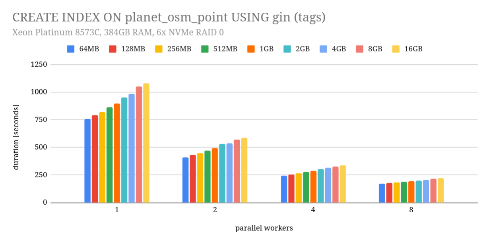

## 你没听错: 不要给 Postgres 过多的内存!          
                                                    
### 作者                                                    
digoal                                                    
                                                    
### 日期                                                    
2025-11-07                                                   
                                                    
### 标签                                                    
PostgreSQL , DuckDB , 内存 , cpu L3 cache , maintenance_work_mem , work_mem , 刷脏 , huge page , hash table                        
                                                    
----                                                    
                                                    
## 背景      
数据库服务器的内存是不是越大越好? 数据库的内存参数设置是不是越大越好?    
    
突然这么问, 你的第一反应估计是我在挖坑, 所以你的回答当然不是! 恭喜你, 成功被带到坑里了.      
    
确实有一些场景, 服务器内存很大, 但你会发现它抖得厉害, 原因可能是刷脏的调度没有配置好, 突然脏页大规模的挤出内存到磁盘导致IO打满, 数据库用户即时性的IO请求带来的性能抖动. 这种情况需要调整调度参数, 包括操作系统的内核参数, 也包括数据库的调度参数.     
    
或者内存过大, 数据库长时间连接过多, 每个连接访问了过多的内存页面, 内存哈希表码表过大, 实际可用内存偏少, 导致OOM等.  这种情况通常使用huge page可解决.    
    
还有一些更离谱的, 例如某些工作内存设置超过CPU L3 cache时, 居然也会使得数据库的处理效率变低, 这是什么原因呢?     
    
来看看这篇文章: https://vondra.me/posts/dont-give-postgres-too-much-memory/    
    
## 译文    
    
### 不要给 Postgres 过多的内存    
    
我不时会遇到一些批处理过程的问题。这些过程使用非常高的内存限制（`maintenance_work_mem` 和 `work_mem`）的情况越来越普遍。我猜一些 DBA 遵循“越多越好”的逻辑，没有意识到这可能会严重损害性能。    
    
让我用一个例子来证明这一点，这是我在测试 GIN 索引并行构建的修复程序时遇到的。这个 bug 并不是特别有趣或复杂，但它需要一个相当高的 `maintenance_work_mem` 值（最初的报告使用了 **20GB**）。    
    
为了验证修复，我针对一系列 `maintenance_work_mem` 值和不同数量的并行工作进程运行了 `CREATE INDEX`。目的是检查其中是否仍有一些会失败，但我也测量了时间。然后我得到了这张图表：    
    
    
    
这来自 Azure 上的 D96v4 实例，配备 Xeon Platinum 8573C、384GB RAM 和 6x NVMe 上的 RAID0。这使得它完全缓存且受 CPU 限制。    
    
并行性帮助很大，使用 2 个工作进程（领导者也被算作一个工作进程）时速度快了约 1.8 倍。这几乎是完美的加速比，因为构建的最后阶段仍然是串行的。随着工作进程的增加，加速比会降低（使用 8 个工作进程时仅快约 4.5 倍），但这是预期的。    
    
但图表也显示，增加 `maintenance_work_mem` **使其变慢了**！从 64MB 增加到 16GB，持续时间增加了 30%，无论使用了多少个工作进程。    
    
这是为什么发生的？    
    
可能有多个因素导致这种行为。让我解释我认为最重要的两个。    
    
1、首先是 **L3 缓存大小** 。    
    
系统中的所有 RAM 速度并不相等，有几个性能非常不同的层级。一小部分 RAM 集成在 CPU 中，因此具有非常低的延迟。大多数 CPU 只有大约 32-128MB 这种快速的片上（on-CPU）RAM，但它比主内存快大约一个数量级。    
    
在构建索引时，我们通常会将数据累积到一个缓冲区中，当缓冲区“满”时对其进行处理，然后将其合并到最终索引中。对于 GIN 索引，我们将条目添加到哈希表中，这意味着随机内存访问。当哈希表溢出 L3 时，它必须更频繁地访问主内存。而这比访问 L3 昂贵得多，两者之间的差异约为 20 个周期与 200 个周期。    
    
通常最好以较小的块处理数据，其大小应使其能够放入 L3 缓存中。当然，我们将需要更多的块，但这可能仍然是一个胜利。    
    
**注意：** Ulrich Drepper 的论文《[每个程序员都应该了解的内存知识](https://www.google.com/search?q=https://people.freebsd.org/~lstewart/articles/whateveryoneshouldknow.pdf)》（What Every Programmer Should Know About Memory）中有很多关于内存的有趣信息。它发表于 2007 年，但基本原理没有改变。    
    
2、还有其他原因可能使得以较小的块处理数据更好。较大的块可能会增加系统其他部分的压力，甚至导致停顿。    
    
**这就是我前面提到的, 刷脏! 抖动!**     
    
例如，当哈希表超过内存限制（由 `maintenance_work_mem` 设置）时，数据会被写入磁盘。这些是临时文件，没有持久性要求，因此只将数据写入**页缓存**（page cache）是可以的。    
    
然而，内核也会尝试使用两个阈值来控制**脏数据**（dirty data）的数量。在达到 `vm.dirty_background_ratio` 之后，它开始在后台写出脏数据，而用户写入仍然进入页缓存。如果脏数据量继续增长并达到 `vm.dirty_ratio`，所有写入都会被迫同步进行。    
    
理想情况下，后台写入足以控制脏数据的数量，并且永远不会达到 `vm.dirty_ratio` 阈值。这种主动刷新（proactive flushing）的工作效果如何，取决于内核有多少时间来响应。更频繁地以较小的块写入数据，为内核提供了更多时间来刷新部分数据。    
    
假设累积 8GB 数据到哈希表需要一分钟。您可以选择等待 8GB 累积完毕，然后一次性写出。大部分时间都没有写入操作，然后会有一段短暂的 8GB 写入期。或者您可以累积并写出 64MB 的块。在这种情况下，写入将更加分散在时间上，从而给内核时间进行反应。    
    
当然，在某些情况下，累积更多数据可能会更好。例如，它可能会提高压缩率。很难说。    
    
### 总结    
    
所有这一切当然也适用于 `work_mem`。唯一的区别是 `work_mem` 用于常规查询，而不是用于维护操作。但推理是完全相同的。哈希连接（hash join）构建一个哈希表，受 `work_mem` 限制。如果哈希表超过 L3，它就会变慢。哈希聚合（hash aggregate）、排序和各种其他操作也是如此。    
    
我不确定 `maintenance_work_mem` 和 `work_mem` 的“最佳”设置是什么。但这也不是这篇文章的重点。我的观点是，盲目设置一个非常高的值可能会**非常有**害。    
    
我的建议是坚持适度的值（例如 64MB），并且只有在您可以证明益处的情况下才调整该值。    
       
## 读者附       
**所有内容都要把眼界打开来看, 例如你创建向量图索引时, maintenance_work_mem就是越大越好, 因为在内存中构建图和超出内存插入是完全两套逻辑, 一旦超出内存, 就会变成插入式构图, 奇慢无比.**     
        
#### [PolarDB 学习图谱](https://www.aliyun.com/database/openpolardb/activity "8642f60e04ed0c814bf9cb9677976bd4")
  
  
#### [PostgreSQL 解决方案集合](../201706/20170601_02.md "40cff096e9ed7122c512b35d8561d9c8")
  
  
#### [德哥 / digoal's Github - 公益是一辈子的事.](https://github.com/digoal/blog/blob/master/README.md "22709685feb7cab07d30f30387f0a9ae")
  
  
#### [About 德哥](https://github.com/digoal/blog/blob/master/me/readme.md "a37735981e7704886ffd590565582dd0")
  
  

  
