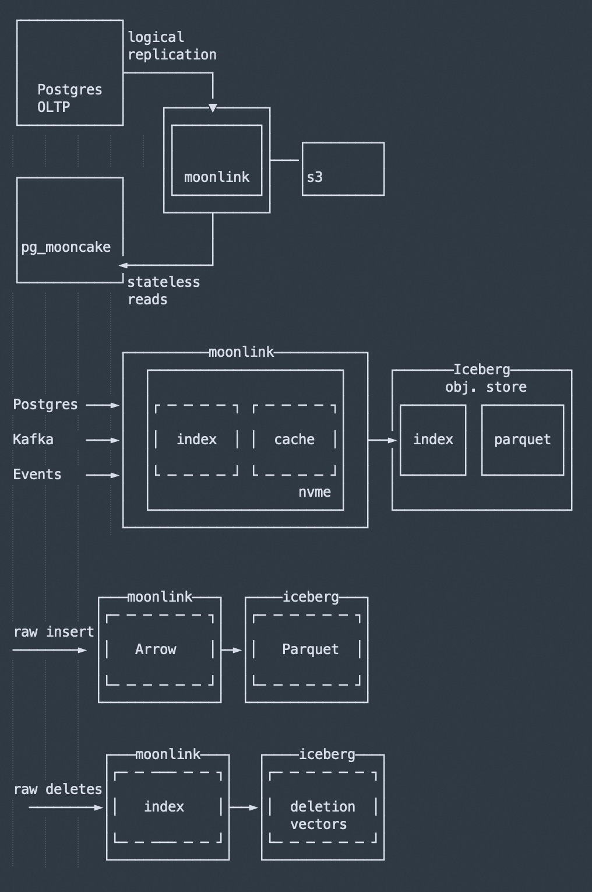

## 德说-第361期, 为了争 PostgreSQL 生态, Snowflake 和 Databricks 又打起来了    
                                                            
### 作者                                                    
digoal                                                            
                                                
### 日期                                                            
2025-11-07                                                          
                                                            
### 标签                                                            
PostgreSQL , DuckDB , Snowflake , crunchydata , Neon , Databricks , Mooncake Labs , datalake , 数据资产 , 数据来源 , 数据存储 , 数据计算 , 数据价值                                 
                                                            
----                                                            
                                                            
## 背景  
PG真的这么香吗? 为了争 PostgreSQL 生态, Snowflake 和 Databricks 又打起来了?  
  
这不对啊, 为什么国内PG没什么人用? 也不多招聘需求啊!   
   
没错, 作为一个使用了PG 20年的人, 同时也是PG中文社区发起人之一, PG分会ACED, 看到了PG在国内发展的一路“艰辛”!     
    
我敢拍胸脯说, 国内大多数人第一次听说PostgreSQL, 可能是因为国产化, 因为很多数据库套壳PG!     
    
近期可能还犹豫AI的兴起, 一部分传统关系数据库用户可能因为pgvector开始接触到PG.    
    
国外则不一样, 看DB-Engein就知道, 很多年以前, PG的发展就是一路飙升, 多年以前一直是开发者最喜爱和最想用两个维度的第一.     
    
如果你不能直接感知到PG在国外有多火, 从两家著名的数据库上市公司Snowflake和Databrick的收购行为即可窥透一切!    
    
近期, 为了争 PostgreSQL 生态, Snowflake 和 Databricks 又打起来了!    
    
故事要从收购说起,     
    
[《德说-第333期, Databricks花10亿美元买开源Neon数据库, 值得吗?》](../202505/20250506_01.md)  这篇文章说了前后脚的两起收购: Databrick 10亿美金收购PG商业发行版Neon Database, Snowflake 2.5亿美金收购PG商业发行版Crunchy Data!    
    
Neon和Crunchy都是PostgreSQL的云服务提供商, 也是PostgreSQL的核心贡献者Hikki和Tom Lane所在的2家公司.     
    
紧随其后, Databrick又干了一票: [《大新闻 | Databricks收购Mooncake, 补齐AI Agent实时数据管道短板》](../202510/20251003_01.md)      
- https://www.databricks.com/blog/mooncake-labs-joins-databricks-accelerate-vision-lakebase    
    
Mooncake和CrunchyData的功能有点类似, 都是结合了duckdb的算力, 对象存储和iceberg/parquet等存储文件, 给PG加上数据湖(实时分析)的翅膀. 可参考阅读: [《内置列存储 vs 传统 ETL: pg_mooncake 与 CrunchyData 打起来了》](../202502/20250220_03.md)      
    
Mooncake Labs被Databricks收购后, Snowflake也没闲着, 就在前几天, CrunchyData开源了pg_lake等一系列插件, 这系列插件可以让开源PG用户直接获得DuckDB的算力, 实时与Iceberg/对象存储的交互能力, 在对象存储的数据可写可读.  ( https://www.snowflake.com/en/engineering-blog/pg-lake-postgres-lakehouse-integration/ )    
    
你可以看看moonlink和crunchydata提供的架构, 简直一毛一样, 只是moonlink还多做了一点: pg逻辑订阅+实时管道入湖, 我个人认为moonlink对PG用户的意义更大.        
    
两者架构对比    
    
    
    
    
    
**Snowflake 和 Databricks 为什么这么看重PostgreSQL生态?**  很简单, PG的用户体量大(而且还在向上发展). 作为云数据库厂商, 你觉得他的核心是什么?     
- 第一步, 当然是把数据存进来,     
- 第二步, 让用户对数据进行不断的计算挖掘. 即可以赚存储的钱, 又可以赚计算的钱.     
- 第三步, 再结合AI, 还可赚深度分析的钱( 这个价值无法估量. 打个比方: 如果你问他明天那支股票会涨, 成功概率有90%, 你觉得你会花多少钱买这个消息? )   这么说起来这两家应该还会投一些做数据挖掘/模型训练的公司?  
    - 当然, 如果要跨用户访问其他用户数据, 这个事就关系到数据资产的归属, 不容易干, 否则就是偷盗用户数据了! 目前仅仅是美好想象而已   
    
数据从哪来呢? OLTP是重要的数据来源之一, 而且这个数据源很干净, 价值极高!      
    
Snowflake 和 Databricks 争夺PG生态, 目的是数据! 搞这么多动作, 都是为了让PG用户可以方便的把数据入湖, 请君入瓮! 因为 PG 真香, 国外用户真多! 只是国内绝大多数用户有眼不识好货!         
    
争夺还没有停止! 看着吧!      
    
        
#### [PolarDB 学习图谱](https://www.aliyun.com/database/openpolardb/activity "8642f60e04ed0c814bf9cb9677976bd4")
  
  
#### [PostgreSQL 解决方案集合](../201706/20170601_02.md "40cff096e9ed7122c512b35d8561d9c8")
  
  
#### [德哥 / digoal's Github - 公益是一辈子的事.](https://github.com/digoal/blog/blob/master/README.md "22709685feb7cab07d30f30387f0a9ae")
  
  
#### [About 德哥](https://github.com/digoal/blog/blob/master/me/readme.md "a37735981e7704886ffd590565582dd0")
  
  

  
