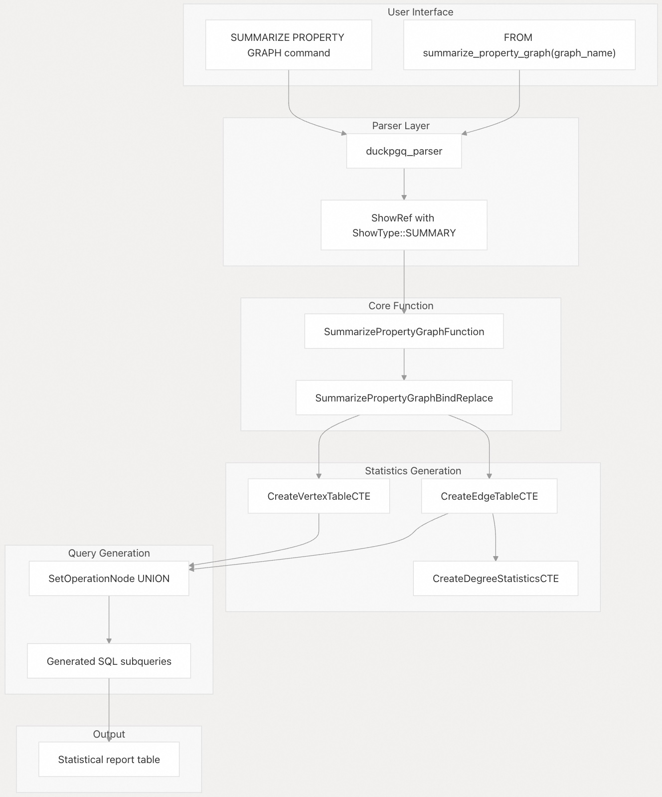
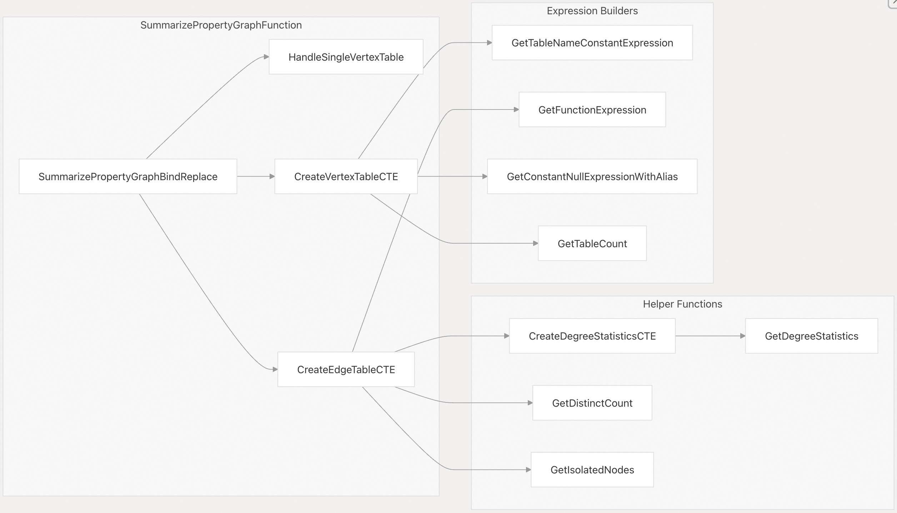
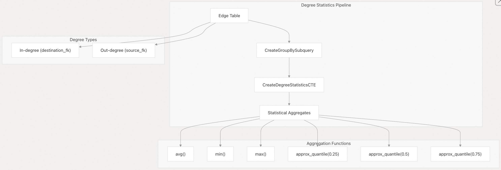
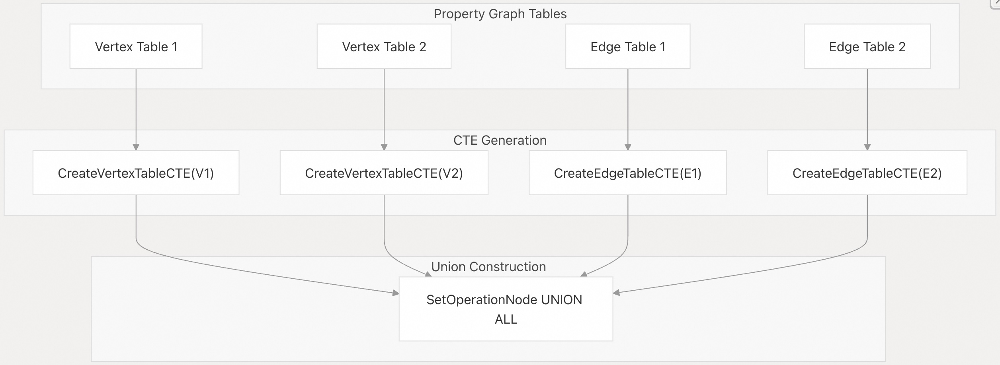
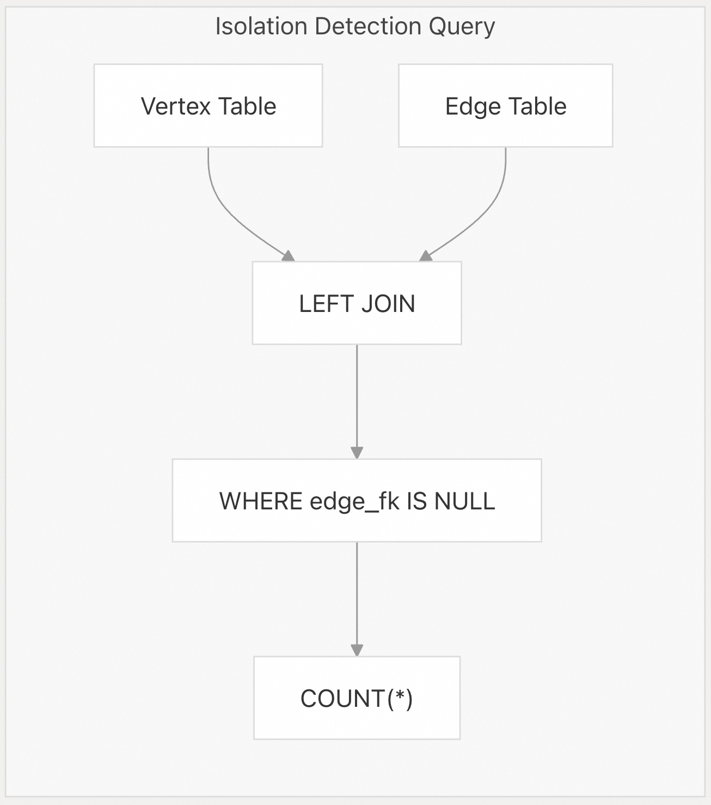
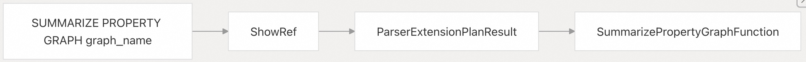

## DuckPGQ 源码学习: 5.1 图统计 (Graph Statistics)  
  
### 作者  
digoal  
  
### 日期  
2025-11-07  
  
### 标签  
DuckDB , PGQ , 属性图 , DuckPGQ , 源码学习  
  
----  
  
## 背景  
**图统计 (Graph Statistics)** 系统提供了全面的分析能力，用于检查 **DuckPGQ** 中 **属性图 (Property Graph)** 的结构属性和特征。该系统通过 **`SUMMARIZE PROPERTY GRAPH` (汇总属性图)** 命令生成关于 **顶点 (vertex)**、**边 (edge)**、**连接性模式 (connectivity patterns)** 和 **度分布 (degree distributions)** 的详细统计信息。  
  
## 概述  
  
**图统计 (Graph Statistics)** 功能被实现为一个 **表函数 (table function)**，它将 **属性图 (Property Graph)** 元数据转换为详细的统计报告。该系统分析 **顶点表 (vertex tables)** 和 **边表 (edge tables)**，以生成包括 **节点计数 (node counts)**、**度分布 (degree distributions)**、**连接性模式 (connectivity patterns)** 和 **隔离性统计 (isolation statistics)** 在内的指标。  
  
  
  
**来源:**  
[`src/core/parser/duckpgq_parser.cpp` 95-98](https://github.com/cwida/duckpgq-extension/blob/29748bfe/src/core/parser/duckpgq_parser.cpp#L95-L98) [`src/core/functions/table/summarize_property_graph.cpp` 367-405](https://github.com/cwida/duckpgq-extension/blob/29748bfe/src/core/functions/table/summarize_property_graph.cpp#L367-L405)  
  
## 函数架构  
  
**`SummarizePropertyGraphFunction`** 类通过一个复杂的 **查询重写系统 (query rewriting system)** 实现核心的统计生成逻辑，该系统将 **表函数 (table function)** 调用转换为带有 **公用表表达式 (Common Table Expressions, CTEs)** 的复杂 **SQL 查询 (queries)**。  
  
  
  
**来源:**  
[`src/include/duckpgq/core/functions/table/summarize_property_graph.hpp` 18-67](https://github.com/cwida/duckpgq-extension/blob/29748bfe/src/include/duckpgq/core/functions/table/summarize_property_graph.hpp#L18-L67) [`src/core/functions/table/summarize_property_graph.cpp` 19-60](https://github.com/cwida/duckpgq-extension/blob/29748bfe/src/core/functions/table/summarize_property_graph.cpp#L19-L60)  
  
## 统计指标  
  
该系统为 **顶点表 (vertex tables)** 和 **边表 (edge tables)** 生成全面的统计信息，这些信息被组织成不同的类别：  
  
| 统计类别 (Metric Category) | 顶点表 (Vertex Tables) | 边表 (Edge Tables) | 描述 (Description) |  
| :--- | :--- | :--- | :--- |  
| **基本计数 (Basic Counts)** | `vertex_count` (顶点计数) | `edge_count` (边计数) | 记录总数 |  
| **表信息 (Table Information)** | `table_name` (表名), `is_vertex_table` (是否为顶点表) | `table_name` (表名), `source_table` (源表), `destination_table` (目标表) | 表元数据 |  
| **连接性 (Connectivity)** | N/A | `unique_source_count` (唯一源计数), `unique_destination_count` (唯一目标计数) | 独立节点参与情况 |  
| **隔离性 (Isolation)** | N/A | `isolated_sources` (隔离的源), `isolated_destinations` (隔离的目标) | 没有连接的节点 |  
| **度统计 (Degree Statistics)** | N/A | `avg_in_degree` (平均入度), `min_in_degree` (最小入度), `max_in_degree` (最大入度) | 入度分布 |  
| **度四分位数 (Degree Quartiles)** | N/A | `q25_in_degree` (25%入度分位数), `q50_in_degree` (50%入度分位数), `q75_in_degree` (75%入度分位数) | 入度百分位数 |  
| **出度统计 (Out-degree Stats)** | N/A | `avg_out_degree` (平均出度), `min_out_degree` (最小出度), `max_out_degree` (最大出度) | 出度分布 |  
| **出度四分位数 (Out-degree Quartiles)** | N/A | `q25_out_degree` (25%出度分位数), `q50_out_degree` (50%出度分位数), `q75_out_degree` (75%出度分位数) | 出度百分位数 |  
  
**来源:**  
[`src/core/functions/table/summarize_property_graph.cpp` 209-263](https://github.com/cwida/duckpgq-extension/blob/29748bfe/src/core/functions/table/summarize_property_graph.cpp#L209-L263) [`src/core/functions/table/summarize_property_graph.cpp` 265-322](https://github.com/cwida/duckpgq-extension/blob/29748bfe/src/core/functions/table/summarize_property_graph.cpp#L265-L322)  
  
## 度统计实现  
  
该系统通过多级 **公用表表达式 (CTEs)** 实现复杂的 **度分析 (degree analysis)**，这些 **CTEs** 计算 **度分布 (degree distributions)** 上的统计聚合：  
  
  
  
**来源:**  
[`src/core/functions/table/summarize_property_graph.cpp` 138-159](https://github.com/cwida/duckpgq-extension/blob/29748bfe/src/core/functions/table/summarize_property_graph.cpp#L138-L159) [`src/core/functions/table/summarize_property_graph.cpp` 161-187](https://github.com/cwida/duckpgq-extension/blob/29748bfe/src/core/functions/table/summarize_property_graph.cpp#L161-L187)  
  
## 查询生成策略  
  
该函数根据 **图结构 (graph structure)** 采用不同的策略：  
  
### 单顶点表情况 (Single Vertex Table Case)  
  
对于仅包含 **顶点表 (vertex tables)** 而没有 **边 (edges)** 的 **属性图 (Property Graphs)**，系统使用简化的 **查询结构 (query structure)**：  
  
  
  
### 多表情况 (Multi-Table Case)  
  
对于具有多个 **顶点 (vertex)** 和 **边表 (edge tables)** 的复杂图，系统会生成一个 **`UNION` 查询 (query)**：  
  
  
  
**来源:**  
[`src/core/functions/table/summarize_property_graph.cpp` 374-378](https://github.com/cwida/duckpgq-extension/blob/29748bfe/src/core/functions/table/summarize_property_graph.cpp#L374-L378) [`src/core/functions/table/summarize_property_graph.cpp` 381-404](https://github.com/cwida/duckpgq-extension/blob/29748bfe/src/core/functions/table/summarize_property_graph.cpp#L381-L404)  
  
## 孤立节点检测 (Isolated Node Detection)  
  
该系统通过 **左连接 (`LEFT JOIN`)** 操作来识别 **孤立节点 (isolated nodes)**，这些操作检测没有相应 **边 (edges)** 的 **顶点 (vertices)**：  
  
  
  
**`GetIsolatedNodes`** 函数生成 **子查询 (subqueries)**，其作用是：  
  
1.  使用 **主/外键关系 (primary/foreign key relationships)** 将 **顶点表 (vertex tables)** 与 **边表 (edge tables)** 进行 **左连接 (`LEFT JOIN`)**  
2.  过滤掉指示没有连接的 **`NULL` 外键值 (foreign key values)**  
3.  对结果中的 **孤立顶点 (isolated vertices)** 进行计数  
  
**来源:**  
[`src/core/functions/table/summarize_property_graph.cpp` 86-136](https://github.com/cwida/duckpgq-extension/blob/29748bfe/src/core/functions/table/summarize_property_graph.cpp#L86-L136)  
  
## 使用示例 (Usage Examples)  
  
### 基本用法 (Basic Usage)  
  
```sql  
FROM summarize_property_graph('graph_name');  
```  
  
### 带排序 (With Ordering)  
  
```sql  
FROM summarize_property_graph('social_network')   
ORDER BY table_name;  
```  
  
### 与标准 SQL (Standard SQL) 集成  
  
```sql  
SELECT table_name, vertex_count, edge_count, avg_in_degree  
FROM summarize_property_graph('social_network')  
WHERE is_vertex_table = false;  
```  
  
**来源:**  
[`test/sql/summarize_property_graph.test` 19](https://github.com/cwida/duckpgq-extension/blob/29748bfe/test/sql/summarize_property_graph.test#L19-L19) [`test/sql/summarize_property_graph.test` 43](https://github.com/cwida/duckpgq-extension/blob/29748bfe/test/sql/summarize_property_graph.test#L43-L43)  
  
## 解析器集成 (Parser Integration)  
  
**解析器 (parser)** 通过带有 **`ShowType::SUMMARY`** 的 **`ShowRef` 机制 (mechanism)** 来识别 **`SUMMARIZE PROPERTY GRAPH` (汇总属性图)** 语法：  
  
  
  
**来源:**  
[`src/core/parser/duckpgq_parser.cpp` 95-98](https://github.com/cwida/duckpgq-extension/blob/29748bfe/src/core/parser/duckpgq_parser.cpp#L95-L98)  
  
## 注册与集成 (Registration and Integration)  
  
该函数通过 **注册机制 (registration mechanism)** 与 **DuckPGQ** 的 **表函数 (table function)** 系统集成：  
  
  
  
**来源:**  
[`src/include/duckpgq/core/functions/table.hpp` 16](https://github.com/cwida/duckpgq-extension/blob/29748bfe/src/include/duckpgq/core/functions/table.hpp#L16-L16) [`src/core/functions/table/summarize_property_graph.cpp` 410-413](https://github.com/cwida/duckpgq-extension/blob/29748bfe/src/core/functions/table/summarize_property_graph.cpp#L410-L413)  
  
# 附录: 如何在 DuckPGQ 中创建具有多个顶点表和多个边表的属性图, 以及如何进行源到目标的路径查询  
  
## 创建多个顶点表和边表的图  
  
使用 `CREATE PROPERTY GRAPH` 语句可以定义包含多个顶点表和边表的图。    
  
基本语法结构如下:    
  
```  
CREATE PROPERTY GRAPH pg  
VERTEX TABLES (  
    Student PROPERTIES ( id, name ) LABEL Person,  
    School as school_alias PROPERTIES ( school_id, school_name ) LABEL School IN School_kind (Hogeschool, University)  
    )  
EDGE TABLES (  
    know    SOURCE KEY ( src ) REFERENCES Student ( id )  
            DESTINATION KEY ( dst ) REFERENCES Student ( id )  
            PROPERTIES ( createDate ) LABEL Knows  
    )  
```      
  
### 关键要素  
  
1. **多个顶点表**:在 `VERTEX TABLES` 子句中列出所有顶点表,可以为每个表指定标签和属性   
  
```  
CREATE PROPERTY GRAPH snb  
VERTEX TABLES (  
    Person LABEL Person,  
    Forum LABEL Forum,  
    Organisation LABEL Organisation IN typemask(company, university),  
    Place LABEL Place,  
    Tag LABEL Tag,  
    TagClass LABEL TagClass,  
    Country LABEL Country,  
    City LABEL City,  
    Message LABEL Message  
    )  
EDGE TABLES (  
    Person_knows_person     SOURCE KEY (Person1Id) REFERENCES Person (id)  
                            DESTINATION KEY (Person2Id) REFERENCES Person (id)  
                            LABEL Knows,  
    Forum_hasMember_Person  SOURCE KEY (ForumId) REFERENCES Forum (id)  
                            DESTINATION KEY (PersonId) REFERENCES Person (id)  
                            LABEL hasMember,  
    Forum_hasTag_Tag        SOURCE KEY (ForumId) REFERENCES Forum (id)  
                            DESTINATION KEY (TagId) REFERENCES Tag (id)  
                            LABEL Forum_hasTag,  
    Person_hasInterest_Tag  SOURCE KEY (PersonId) REFERENCES Person (id)  
                            DESTINATION KEY (TagId) REFERENCES Tag (id)  
                            LABEL hasInterest,  
    person_workAt_Organisation SOURCE KEY (PersonId) REFERENCES Person (id)  
                               DESTINATION KEY (OrganisationId) REFERENCES Organisation (id)  
                               LABEL workAt_Organisation,  
    Person_likes_Message    SOURCE KEY (PersonId) REFERENCES Person (id)  
                            DESTINATION KEY (id) REFERENCES Message (id)  
                            LABEL likes_Message,  
    Message_hasTag_Tag      SOURCE KEY (id) REFERENCES Message (id)  
                            DESTINATION KEY (TagId) REFERENCES Tag (id)  
                            LABEL message_hasTag,  
    Message_hasAuthor_Person    SOURCE KEY (messageId) REFERENCES Message (id)  
                                DESTINATION KEY (PersonId) REFERENCES Person (id)  
                                LABEL hasAuthor,  
    Message_replyOf_Message SOURCE KEY (messageId) REFERENCES Message (id)  
                            DESTINATION KEY (ParentMessageId) REFERENCES Message (id)  
                            LABEL replyOf  
    );  
```  
  
2. **多个边表**:在 `EDGE TABLES` 子句中定义边表,每个边表必须指定:    
   - `SOURCE KEY` 和 `DESTINATION KEY`:指定外键列  
   - `REFERENCES`:引用顶点表的主键  
   - `LABEL`:边的标签名称  
  
  
  
3. **跨表引用**:边表可以连接不同的顶点表    
  
```  
create property graph g  
vertex tables (v, w)  
edge tables (e2 source v destination w);  
```  
  
## 源到目标路径查询  
  
使用 `GRAPH_TABLE` 函数和 `MATCH` 子句进行路径查询:   
  
```  
SELECT study.name, study.school  
FROM GRAPH_TABLE (pg  
    MATCH  
    (a:Person)-[s:StudyAt]->(b:School)  
    WHERE a.name = 'Daniel'  
    COLUMNS (a.name as name, b.name as school)  
    ) study;  
----  
Daniel	VU  
```  
  
### 路径查询类型  
  
1. **简单路径**:直接连接的顶点   
  
```  
SELECT study.a_name, study.b_name  
FROM GRAPH_TABLE (pg  
    MATCH  
    (a:Person)-[k:Knows]->(b:Person)  
    WHERE a.name = 'Daniel'  
    COLUMNS (a.name as a_name, b.name as b_name)  
    ) study;  
```  
  
2. **最短路径**:使用 `ANY SHORTEST` 关键字和路径量词 `{min,max}`   
  
```  
FROM GRAPH_TABLE (pg  
    MATCH  
    ANY SHORTEST (a:Person)-[s:StudyAt]->(b:School)  
    WHERE a.name = 'Daniel'  
    COLUMNS (a.name as name, b.name as school)  
    ) study;  
----  
Daniel	VU  
```  
  
3. **多跳路径**:指定路径长度范围  
  
```  
FROM GRAPH_TABLE (pg  
    MATCH  
    p = ANY SHORTEST (a:Person WHERE a.name = 'Daniel')-[k:knows]->{1,3}(b:Person)  
    COLUMNS (element_id(p), a.name as name, b.name as b_name)  
    ) study  
    ORDER BY name, b_name;  
----  
[0, 1, 2]	Daniel	Gabor  
[0, 2, 3]	Daniel	Peter  
[0, 0, 1]	Daniel	Tavneet  
```  
  
4. **复杂模式**:组合多个边和顶点   
  
```  
FROM GRAPH_TABLE (snb  
    MATCH o = ANY SHORTEST (p4:Person where p4.rowid = 0)-[w3:knows]->(p:Person)-[w:knows]->{1,3}(p2:Person)-[w2:knows]->(p3:Person)  
    COLUMNS (p3.id as p3_id, element_id(o), path_length(o), vertices(o), edges(o), p4.id as p4_id, p.id as p_id)  
    ) tmp  
ORDER BY p3_id, p4_id, p_id;  
----  
28587302322180	[0, 0, 13, 42, 29, 68, 33]	3	[0, 13, 29, 33]	[0, 42, 68]	14	10995116277782  
28587302322180	[0, 1, 26, 63, 32, 75, 33]	3	[0, 26, 32, 33]	[1, 63, 75]	14	24189255811081  
```  
  
### 路径函数  
  
查询结果可以使用以下函数:   
- `element_id(path)`:获取路径中的元素ID  
- `path_length(path)`:获取路径长度  
- `vertices(path)`:获取路径中的顶点  
- `edges(path)`:获取路径中的边  
  
## Notes  
  
DuckPGQ 支持跨模式(schema)创建属性图, 并且可以在单个查询中使用多个 `GRAPH_TABLE` 调用。路径查询的实现使用了压缩稀疏行(CSR)数据结构来优化性能。  
  
```  
CREATE PROPERTY GRAPH cross_schema_graph  
    VERTEX TABLES (  
      schema1.Person,  
      schema2.Company  
    )  
    EDGE TABLES (  
      schema2.WorksAt SOURCE KEY (person_id) REFERENCES schema1.Person (id)  
                      DESTINATION KEY (company_id) REFERENCES schema2.Company (id)  
                      LABEL works_at  
    );  
```  
  
```  
select a.id, b.id FROM GRAPH_TABLE(pg MATCH (a:student)) a, GRAPH_TABLE(pg MATCH (b:student)) b;  
----  
0	0  
1	0  
```  
    
#### [PolarDB 学习图谱](https://www.aliyun.com/database/openpolardb/activity "8642f60e04ed0c814bf9cb9677976bd4")
  
  
#### [PostgreSQL 解决方案集合](../201706/20170601_02.md "40cff096e9ed7122c512b35d8561d9c8")
  
  
#### [德哥 / digoal's Github - 公益是一辈子的事.](https://github.com/digoal/blog/blob/master/README.md "22709685feb7cab07d30f30387f0a9ae")
  
  
#### [About 德哥](https://github.com/digoal/blog/blob/master/me/readme.md "a37735981e7704886ffd590565582dd0")
  
  

  
