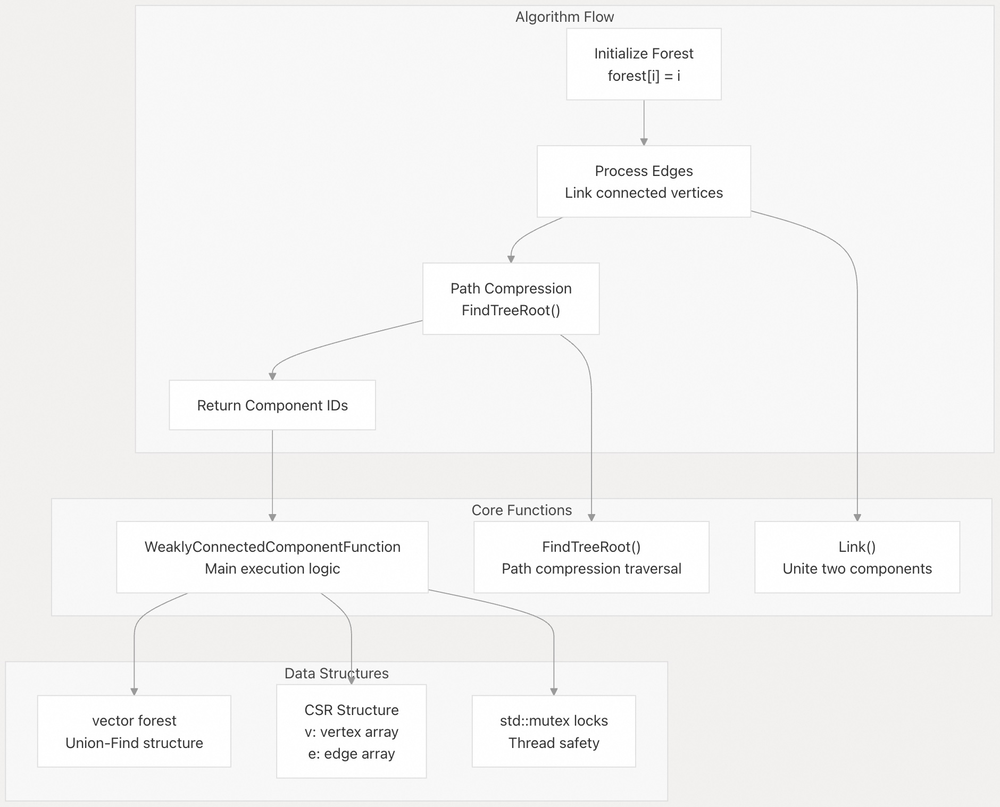
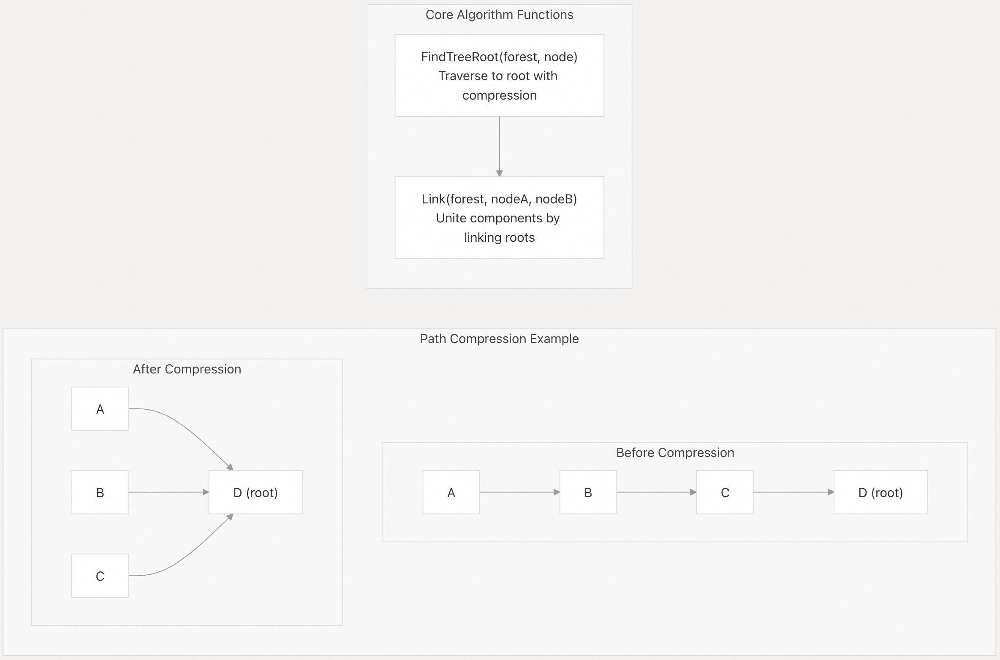
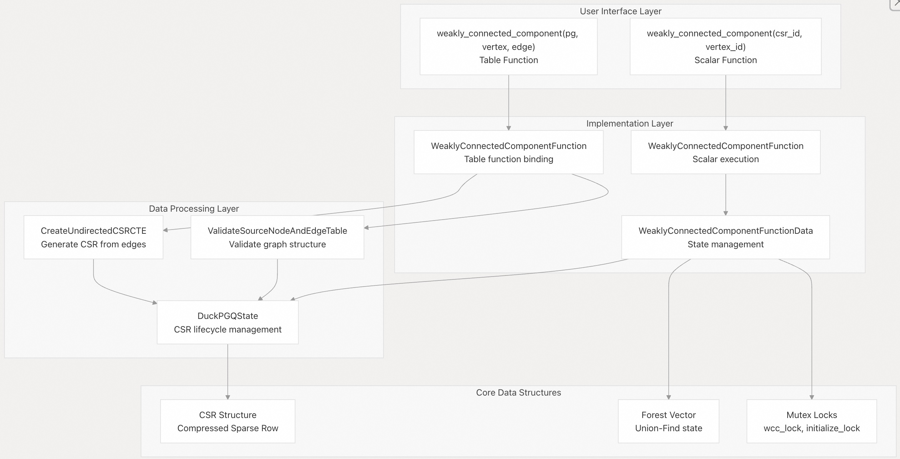
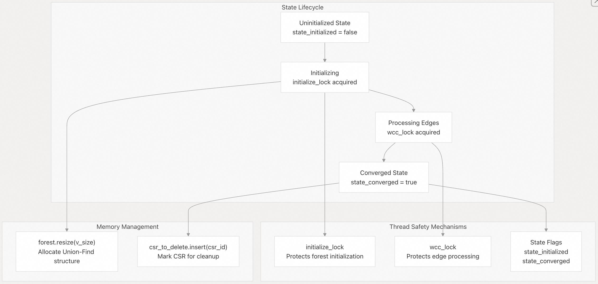
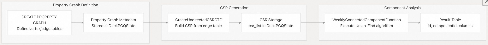

## DuckPGQ 源码学习: 5.2 连通性分析 (Connectivity Analysis)  
    
### 作者    
digoal    
    
### 日期    
2025-11-07    
    
### 标签    
DuckDB , PGQ , 属性图 , DuckPGQ , 源码学习    
    
----    
    
## 背景    
本文档介绍了 DuckPGQ 的**连通性分析**（Connectivity Analysis）功能，特别是**弱连通分量**（Weakly Connected Components）算法。连通性分析允许您识别图中通过路径相互连接的**顶点**（vertices）组，而无需考虑**边**（edge）的方向。  
  
## 概述 (Overview)  
  
**弱连通分量**（Weakly connected components）识别的是在忽略**边**（edge）方向时，每对**顶点**（vertex）之间都能相互到达的**最大顶点集合**（maximal sets of vertices）。这对理解**图结构**（graph structure）、检测**隔离子图**（isolated subgraphs）和分析**网络拓扑**（network topology）至关重要。  
  
DuckPGQ 提供了**标量函数**（scalar function）和**表函数**（table function）两种接口，用于使用带有**路径压缩**（path compression）的高效**并查集**（Union-Find）算法来计算弱连通分量。  
  
## 弱连通分量函数 (Weakly Connected Components Function)  
  
`weakly_connected_component` 函数用于识别**属性图**（property graph）中的**连通分量**（connected components），并为每个**顶点**（vertex）分配一个**分量 ID**（component ID）。  
  
### 语法 (Syntax)  
  
```  
-- Scalar function: get component ID for specific vertices  
SELECT weakly_connected_component(csr_id, vertex_id) AS component_id;  
  
-- Table function: get all vertices with their component IDs  
SELECT * FROM weakly_connected_component(graph_name, vertex_table, edge_table);  
```  
  
### 参数 (Parameters)  
  
| 参数 (Parameter) | 类型 (Type) | 描述 (Description) |  
|---|---|---|  
| `graph_name` | VARCHAR | **属性图**（property graph）的名称 |  
| `vertex_table` | VARCHAR | **顶点表**（vertex table）的标签 |  
| `edge_table` | VARCHAR | **边表**（edge table）的标签 |  
| `csr_id` | INTEGER | **CSR 结构标识符**（scalar version：标量版本） |  
| `vertex_id` | BIGINT | 特定的**顶点 ID**（scalar version：标量版本） |  
  
### 返回值 (Return Values)  
  
| 列名 (Column) | 类型 (Type) | 描述 (Description) |  
|---|---|---|  
| `id` | BIGINT | **顶点标识符**（Vertex identifier） |  
| `componentId` | BIGINT | **分量标识符**（Component identifier）（同一分量中所有顶点均相同） |  
  
## 算法实现 (Algorithm Implementation)  
  
**弱连通分量**（weakly connected components）算法使用带有**路径压缩**（path compression）的**并查集**（Union-Find, disjoint set）**数据结构**（data structure），以高效地识别**分量**（component）。  
  
    
  
**来源:**  
[`src/core/functions/scalar/weakly_connected_component.cpp` 15-38](https://github.com/cwida/duckpgq-extension/blob/29748bfe/src/core/functions/scalar/weakly_connected_component.cpp#L15-L38)  
[`src/core/functions/scalar/weakly_connected_component.cpp` 40-112](https://github.com/cwida/duckpgq-extension/blob/29748bfe/src/core/functions/scalar/weakly_connected_component.cpp#L40-L112)  
  
### 带有路径压缩的并查集 (Union-Find with Path Compression)  
  
该算法维护一个**森林**（forest），其中每个**顶点**（vertex）最初指向自身。随着**边**（edge）的处理，同一**分量**（component）中的**顶点**相互连接起来，**路径压缩**（path compression）确保了高效的**根查找**（root finding）。  
  
    
  
**来源:**  
[`src/core/functions/scalar/weakly_connected_component.cpp` 16-26](https://github.com/cwida/duckpgq-extension/blob/29748bfe/src/core/functions/scalar/weakly_connected_component.cpp#L16-L26)  
[`src/core/functions/scalar/weakly_connected_component.cpp` 30-38](https://github.com/cwida/duckpgq-extension/blob/29748bfe/src/core/functions/scalar/weakly_connected_component.cpp#L30-L38)  
  
## 函数架构 (Function Architecture)  
  
DuckPGQ 为**弱连通分量**（weakly connected components）提供了两种接口：用于完整分析的**表函数**（table function）和用于定向查询的**标量函数**（scalar function）。  
  
    
  
**来源:**  
[`src/core/functions/table/weakly_connected_component.cpp` 13-37](https://github.com/cwida/duckpgq-extension/blob/29748bfe/src/core/functions/table/weakly_connected_component.cpp#L13-L37)  
[`src/core/functions/scalar/weakly_connected_component.cpp` 40-112](https://github.com/cwida/duckpgq-extension/blob/29748bfe/src/core/functions/scalar/weakly_connected_component.cpp#L40-L112)  
[`src/core/functions/function_data/weakly_connected_component_function_data.cpp` 9-30](https://github.com/cwida/duckpgq-extension/blob/29748bfe/src/core/functions/function_data/weakly_connected_component_function_data.cpp#L9-L30)  
  
## 使用示例 (Usage Examples)  
  
### 基本连通图 (Basic Connected Graph)  
  
```  
-- Create sample data  
CREATE TABLE Student(id BIGINT, name VARCHAR);  
INSERT INTO Student VALUES (0, 'Daniel'), (1, 'Tavneet'), (2, 'Gabor'), (3, 'Peter'), (4, 'David');  
  
CREATE TABLE know(src BIGINT, dst BIGINT, createDate BIGINT);  
INSERT INTO know VALUES (0,1, 10), (0,2, 11), (0,3, 12), (3,0, 13), (1,2, 14), (1,3, 15), (2,3, 16), (4,3, 17);  
  
-- Create property graph  
CREATE PROPERTY GRAPH pg  
VERTEX TABLES (Student)  
EDGE TABLES (  
   know SOURCE KEY (src) REFERENCES Student (id)  
        DESTINATION KEY (dst) REFERENCES Student (id)  
);  
  
-- Find connected components  
SELECT id, componentId   
FROM weakly_connected_component(pg, student, know);  
```  
  
结果显示所有**顶点**（vertices）属于同一个**分量**（component）：  
  
```  
id | componentId  
---|------------  
0  | 4  
1  | 4    
2  | 4  
3  | 4  
4  | 4  
```  
  
**来源:**  
[`test/sql/scalar/weakly_connected_component.test` 7-34](https://github.com/cwida/duckpgq-extension/blob/29748bfe/test/sql/scalar/weakly_connected_component.test#L7-L34)  
  
### 多个分量 (Multiple Components)  
  
```  
-- Create disconnected graph  
CREATE TABLE Student(id BIGINT, name VARCHAR);  
INSERT INTO Student VALUES (0, 'Alice'), (1, 'Bob'), (2, 'Charlie'), (3, 'David'), (4, 'Eve');  
  
CREATE TABLE know(src BIGINT, dst BIGINT, createDate BIGINT);  
INSERT INTO know VALUES (0, 1, 10), (1, 2, 11), (3, 4, 12);  
  
CREATE PROPERTY GRAPH pg_two_components  
VERTEX TABLES (Student)  
EDGE TABLES (  
   know SOURCE KEY (src) REFERENCES Student (id)  
        DESTINATION KEY (dst) REFERENCES Student (id)  
);  
  
-- Analyze components  
SELECT id, componentId   
FROM weakly_connected_component(pg_two_components, student, know);  
```  
  
结果显示两个不同的**分量**（components）：  
  
```  
id | componentId  
---|------------  
0  | 2  
1  | 2  
2  | 2  
3  | 4  
4  | 4  
```  
  
**来源:**  
[`test/sql/scalar/weakly_connected_component.test` 93-118](https://github.com/cwida/duckpgq-extension/blob/29748bfe/test/sql/scalar/weakly_connected_component.test#L93-L118)  
  
### 分量统计 (Component Statistics)  
  
```  
-- Count number of components  
SELECT count(DISTINCT componentId) as component_count  
FROM weakly_connected_component(pg_larger_graph, student, know);  
  
-- Component size distribution  
SELECT componentId, count(*) as size  
FROM weakly_connected_component(graph_name, vertex_table, edge_table)  
GROUP BY componentId  
ORDER BY size DESC;  
```  
  
**来源:**  
[`test/sql/scalar/weakly_connected_component.test` 169-172](https://github.com/cwida/duckpgq-extension/blob/29748bfe/test/sql/scalar/weakly_connected_component.test#L169-L172)  
  
## 状态管理和线程安全 (State Management and Thread Safety)  
  
**弱连通分量**（weakly connected components）的实现包含了复杂精密的**状态管理**（state management），以确保性能和**线程安全**（thread safety）。  
  
    
  
**来源:**  
[`src/core/functions/scalar/weakly_connected_component.cpp` 73-98](https://github.com/cwida/duckpgq-extension/blob/29748bfe/src/core/functions/scalar/weakly_connected_component.cpp#L73-L98)  
[`src/include/duckpgq/core/functions/function_data/weakly_connected_component_function_data.hpp` 18-22](https://github.com/cwida/duckpgq-extension/blob/29748bfe/src/include/duckpgq/core/functions/function_data/weakly_connected_component_function_data.hpp#L18-L22)  
  
## 错误处理和验证 (Error Handling and Validation)  
  
该实现包含了针对常见**边缘情况**（edge cases）和**无效输入**（invalid inputs）的全面**错误处理**（error handling）。  
  
### 图验证错误 (Graph Validation Errors)  
  
| 错误类型 (Error Type) | 条件 (Condition) | 错误信息 (Error Message) |  
|---|---|---|  
| Missing Graph | **属性图**（Property graph）不存在 | "Property graph {name} not found" （未找到属性图 {name}） |  
| Missing CSR | **CSR 结构**未找到 | "CSR not found. Is the graph populated?" （未找到 CSR。图是否已填充？） |  
| Uninitialized CSR | **CSR** 未正确初始化 | "Need to initialize CSR before doing weakly connected components" （在执行弱连通分量计算之前需要初始化 CSR） |  
| Invalid Vertex Table | **顶点表标签**（Vertex table label）未找到 | "Label '{label}' not found. Did you mean the vertex label '{suggestion}'?" （未找到标签 '{label}'。您指的是顶点标签 '{suggestion}' 吗？） |  
| Invalid Edge Table | **边表标签**（Edge table label）未找到 | "Label '{label}' not found in the property graph for a edge table" （在属性图中未找到边表的标签 '{label}'） |  
| Label Type Mismatch | 将**边标签**用于**顶点** | "Exact label '{label}' found, but it is not a vertex table" （找到了准确的标签 '{label}'，但它不是顶点表） |  
  
**来源:**  
[`test/sql/scalar/weakly_connected_component.test` 174-290](https://github.com/cwida/duckpgq-extension/blob/29748bfe/test/sql/scalar/weakly_connected_component.test#L174-L290)  
[`src/core/functions/scalar/weakly_connected_component.cpp` 48-55](https://github.com/cwida/duckpgq-extension/blob/29748bfe/src/core/functions/scalar/weakly_connected_component.cpp#L48-L55)  
  
### 输入验证 (Input Validation)  
  
```  
-- Non-constant CSR ID (scalar function)  
SELECT weakly_connected_component(random_column, vertex_id);   
-- Error: Id must be constant.  
  
-- Invalid vertex ID range  
SELECT weakly_connected_component(csr_id, -1);  
-- Returns NULL (invalid result)  
```  
  
**来源:**  
[`src/core/functions/function_data/weakly_connected_component.cpp` 20-22](https://github.com/cwida/duckpgq-extension/blob/29748bfe/src/core/functions/function_data/weakly_connected_component_function_data.cpp#L20-L22)  
[`src/core/functions/scalar/weakly_connected_component.cpp` 102-107](https://github.com/cwida/duckpgq-extension/blob/29748bfe/src/core/functions/scalar/weakly_connected_component.cpp#L102-L107)  
  
## 与属性图系统的集成 (Integration with Property Graph System)  
  
**弱连通分量**（weakly connected components）函数与 DuckPGQ 的**属性图**（property graph）基础架构无缝集成，利用了 **CSR 数据结构**（CSR data structures）和**图元数据**（graph metadata）。  
  
    
  
**来源:**  
[`src/core/functions/table/weakly_connected_component.cpp` 20-29](https://github.com/cwida/duckpgq-extension/blob/29748bfe/src/core/functions/table/weakly_connected_component.cpp#L20-L29)  
[`src/core/functions/scalar/weakly_connected_component.cpp` 45-60](https://github.com/cwida/duckpgq-extension/blob/29748bfe/src/core/functions/scalar/weakly_connected_component.cpp#L45-L60)  
  
## 性能特征 (Performance Characteristics)  
  
**弱连通分量**（weakly connected components）算法具有以下性能特征：  
  
  * **时间复杂度**（Time Complexity）：O(E × α(V))，其中 E 是**边**（edge）的数量，V 是**顶点**（vertex）的数量，而 α 是**反阿克曼函数**（inverse Ackermann function）（实际上是常数）  
  * **空间复杂度**（Space Complexity）：O(V)，用于**并查集森林结构**（Union-Find forest structure）  
  * **并行化**（Parallelization）：具有针对共享状态的**互斥锁保护**（mutex protection）的**线程安全实现**（Thread-safe implementation）  
  * **内存管理**（Memory Management）：计算完成后自动进行 **CSR 清理**（CSR cleanup）  
  
`FindTreeRoot` 中的**路径压缩**（path compression）优化确保了**根查找**（root finding）操作接近**常数时间**（constant-time），使得该算法对于大型图而言效率极高。  
  
**来源:**  
[`src/core/functions/scalar/weakly_connected_component.cpp` 16-26](https://github.com/cwida/duckpgq-extension/blob/29748bfe/src/core/functions/scalar/weakly_connected_component.cpp#L16-L26)  
[`src/core/functions/scalar/weakly_connected_component.cpp` 74-98](https://github.com/cwida/duckpgq-extension/blob/29748bfe/src/core/functions/scalar/weakly_connected_component.cpp#L74-L98)  
[`src/core/functions/scalar/weakly_connected_component.cpp` 110-111](https://github.com/cwida/duckpgq-extension/blob/29748bfe/src/core/functions/scalar/weakly_connected_component.cpp#L110-L111)  
      
#### [PolarDB 学习图谱](https://www.aliyun.com/database/openpolardb/activity "8642f60e04ed0c814bf9cb9677976bd4")
  
  
#### [PostgreSQL 解决方案集合](../201706/20170601_02.md "40cff096e9ed7122c512b35d8561d9c8")
  
  
#### [德哥 / digoal's Github - 公益是一辈子的事.](https://github.com/digoal/blog/blob/master/README.md "22709685feb7cab07d30f30387f0a9ae")
  
  
#### [About 德哥](https://github.com/digoal/blog/blob/master/me/readme.md "a37735981e7704886ffd590565582dd0")
  
  

  
