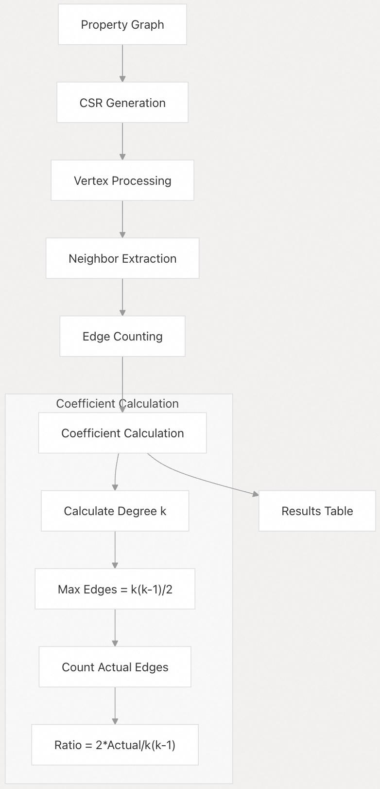
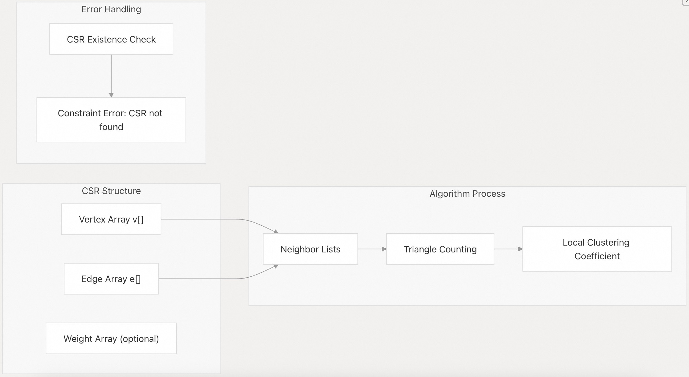

## DuckPGQ 源码学习: 5.3 聚类指标 (Clustering Metrics)  
      
### 作者      
digoal      
      
### 日期      
2025-11-07      
      
### 标签      
DuckDB , PGQ , 属性图 , DuckPGQ , 源码学习      
      
----      
      
## 背景      
本文档介绍了 DuckPGQ 中的**聚类指标** (**Clustering Metrics**) 功能，特别是**局部聚类系数** (**local clustering coefficient**) 算法。聚类指标衡量一个**顶点** (**vertex**) 的邻居彼此之间的连接紧密程度，从而深入了解图中的局部结构和社区形成。  
  
## 局部聚类系数 (Local Clustering Coefficient)  
  
**局部聚类系数** (**The local clustering coefficient**) 衡量图中**顶点** (**vertices**) 聚集在一起的程度。对于给定的顶点，它计算该顶点邻居之间现有**边** (**edges**) 的数量与这些邻居之间可能存在的最大边数之比。  
  
### 数学定义 (Mathematical Definition)  
  
对于**度** (**degree**) 为 *k* 的**顶点** *v*（其中 *k* ≥ 2），**局部聚类系数**如下：  
  
```  
C(v) = 2 * |{edges between neighbors of v}| / (k * (k-1))  
  
  
C(v) = 2 * |{顶点 v 的邻居之间的边}| / (k * (k-1))  
```  
  
其中：  
  
  * **分子** (**The numerator**) 计算邻居之间实际存在的边数  
  * **分母** (**The denominator**) 表示 *k* 个邻居之间可能存在的最大边数  
  * 该**系数** (**The coefficient**) 范围从 0.0（无聚类）到 1.0（完全聚类）  
  
## 函数语法 (Function Syntax)  
  
`local_clustering_coefficient` 函数计算**属性图** (**property graph**) 中所有**顶点** (**vertices**) 的聚类系数：  
  
```  
local_clustering_coefficient(property_graph_name, vertex_table_name, edge_table_name)  
```  
  
### 参数 (Parameters)  
  
| 参数 (Parameter) | 类型 (Type) | 描述 (Description) |  
| :--- | :--- | :--- |  
| `property_graph_name` | **标识符** (**Identifier**) | **属性图** (**property graph**) 的名称 |  
| `vertex_table_name` | **标识符** (**Identifier**) | 图中**顶点表** (**vertex table**) 的名称 |  
| `edge_table_name` | **标识符** (**Identifier**) | 图中**边表** (**edge table**) 的名称 |  
  
### 返回值 (Return Values)  
  
| 列 (Column) | 类型 (Type) | 描述 (Description) |  
| :--- | :--- | :--- |  
| `id` | **大整数** (**BIGINT**) | **顶点标识符** (**Vertex identifier**) |  
| `local_clustering_coefficient` | **双精度浮点数** (**DOUBLE**) | **聚类系数** (**Clustering coefficient**) 值 (0.0 到 1.0) |  
  
来源 (Sources): [`test/sql/scalar/local_clustering_coefficient.test` 72-78](https://github.com/cwida/duckpgq-extension/blob/29748bfe/test/sql/scalar/local_clustering_coefficient.test#L72-L78)  
  
## 算法流程 (Algorithm Flow)  
  
  
  
来源 (Sources): [`test/sql/scalar/local_clustering_coefficient.test` 1-258](https://github.com/cwida/duckpgq-extension/blob/29748bfe/test/sql/scalar/local_clustering_coefficient.test#L1-L258)  
  
## 使用示例 (Usage Examples)  
  
### 基本用法 (Basic Usage)  
  
```  
-- Create property graph  
CREATE PROPERTY GRAPH social_network  
VERTEX TABLES (Person)  
EDGE TABLES (  
    Friendship SOURCE KEY (person1_id) REFERENCES Person (id)  
               DESTINATION KEY (person2_id) REFERENCES Person (id)  
);  
  
-- Calculate clustering coefficients  
SELECT id, local_clustering_coefficient   
FROM local_clustering_coefficient(social_network, person, friendship);  
```  
  
### 与顶点数据连接 (Joining with Vertex Data)  
  
```  
-- Include vertex attributes in results  
SELECT p.id, p.name, lcc.local_clustering_coefficient  
FROM local_clustering_coefficient(social_network, person, friendship) lcc  
JOIN Person p ON p.id = lcc.id  
ORDER BY lcc.local_clustering_coefficient DESC;  
```  
  
来源 (Sources): [`test/sql/scalar/local_clustering_coefficient.test` 80-87](https://github.com/cwida/duckpgq-extension/blob/29748bfe/test/sql/scalar/local_clustering_coefficient.test#L80-L87)  
  
## CSR 集成 (CSR Integration)  
  
**聚类系数** (**clustering coefficient**) 的计算依赖于 DuckPGQ 的 **CSR**（**压缩稀疏行**，**Compressed Sparse Row**) **数据结构** (**data structures**)，以实现高效的**图遍历** (**graph traversal**):  
  
  
  
该算法需要一个已填充数据的 **CSR** 结构。如果 **CSR** 不可用，该函数将抛出**约束错误** (**constraint error**)。  
  
来源 (Sources): [`test/sql/scalar/local_clustering_coefficient.test` 24-27](https://github.com/cwida/duckpgq-extension/blob/29748bfe/test/sql/scalar/local_clustering_coefficient.test#L24-L27)  
  
## 边情况和特殊行为 (Edge Cases and Special Behaviors)  
  
### 空图 (Empty Graphs)  
  
对于没有**边** (**edges**) 的图，该函数返回一个**空结果集** (**empty result set**):  
  
```  
-- Empty graph returns no rows  
SELECT id, local_clustering_coefficient   
FROM local_clustering_coefficient(empty_pg, emptystudent, emptyknow);  
-- Result: (empty)  
```  
  
### 孤立顶点 (Isolated Vertices)  
  
**度** (**degree**) 为 0 或 1 的**顶点** (**vertices**) 的**聚类系数** (**clustering coefficient**) 为 0.0：  
  
```  
-- Vertex 4 (David) has no neighbors  
-- Result: 4, 0.0  
```  
  
### 自环 (Self-Loops)  
  
**自环** (**Self-loops**) 在**聚类系数**计算中被忽略：  
  
```  
-- Graph with only self-loops  
-- All vertices return 0.0 clustering coefficient  
```  
  
来源 (Sources): [`test/sql/scalar/local_clustering_coefficient.test` 182-204](https://github.com/cwida/duckpgq-extension/blob/29748bfe/test/sql/scalar/local_clustering_coefficient.test#L182-L204)  
  
## 错误处理 (Error Handling)  
  
### 常见错误消息 (Common Error Messages)  
  
| 错误 (Error) | 原因 (Cause) | 解决方案 (Solution) |  
| :--- | :--- | :--- |  
| `CSR not found. Is the graph populated?` (**未找到 CSR。图是否已填充数据？**) | 图存在，但 **CSR** 结构未构建 | 确保图具有数据并已生成 **CSR** |  
| `Property graph [name] not found` (**未找到属性图 [name]**) | **属性图** (**property graph**) 名称无效 | 验证图名称是否存在 |  
| `Label '[name]' not found` (**未找到标签 '[name]'**) | **顶点** (**vertex**)/**边表** (**edge table**) 名称无效 | 检查图模式 (**graph schema**) 中可用的标签 |  
| `[table] is not a edge table` (**[table] 不是边表**) | 使用**顶点表** (**vertex table**) 作为**边** (**edge**) 参数 | 使用正确的**边表** (**edge table**) 名称 |  
  
### 验证示例 (Validation Examples)  
  
```  
-- Invalid property graph name  
SELECT * FROM local_clustering_coefficient(nonexistent_pg, student, know);  
-- Error: Property graph nonexistent_pg not found  
  
-- Invalid vertex table  
SELECT * FROM local_clustering_coefficient(pg, invalid_table, know);  
-- Error: Label 'invalid_table' not found  
  
-- Using vertex table as edge parameter    
SELECT * FROM local_clustering_coefficient(pg, student, student);  
-- Error: Exact label 'student' found, but it is not a edge table  
```  
  
来源 (Sources): [`test/sql/scalar/local_clustering_coefficient.test` 89-112](https://github.com/cwida/duckpgq-extension/blob/29748bfe/test/sql/scalar/local_clustering_coefficient.test#L89-L112)  
  
## 性能考量 (Performance Considerations)  
  
### 图大小的影响 (Graph Size Impact)  
  
**聚类系数** (**clustering coefficient**) 算法具有**时间复杂度** (**time complexity**) 考量：  
  
  * **顶点处理** (**Vertex Processing**): O(V)，其中 V 是**顶点** (**vertices**) 数量  
  * **邻居分析** (**Neighbor Analysis**): 每个**顶点** (**vertex**) O(d²)，其中 d 是**顶点度** (**vertex degree**)  
  * **总体复杂度** (**Overall Complexity**): O(V \* d\_max²)，其中 d\_max 是**最大度** (**maximum degree**)  
  
### 内存使用 (Memory Usage)  
  
该算法利用 **CSR** 结构实现**内存效率高** (**memory-efficient**) 的图表示：  
  
  * **CSR** 为**稀疏图** (**sparse graphs**) 提供**压缩存储** (**compressed storage**)  
  * 在**三角形计数** (**triangle counting**) 期间高效访问邻居列表  
  * **内存使用** (**Memory usage**) 随边数而不是潜在边数而变化  
  
### 优化技巧 (Optimization Tips)  
  
1.  **预过滤图** (**Pre-filtered Graphs**): 在聚类分析之前应用 **WHERE** 子句来限制**顶点集** (**vertex set**)  
2.  **批量处理** (**Batch Processing**): 为超大型网络处理**子图** (**subgraphs**)  
3.  **索引使用** (**Index Usage**): 确保**顶点** (**vertex**) 和**边键列** (**edge key columns**) 上有正确的索引  
  
来源 (Sources): [`test/sql/scalar/local_clustering_coefficient.test` 114-180](https://github.com/cwida/duckpgq-extension/blob/29748bfe/test/sql/scalar/local_clustering_coefficient.test#L114-L180)  
      
#### [PolarDB 学习图谱](https://www.aliyun.com/database/openpolardb/activity "8642f60e04ed0c814bf9cb9677976bd4")
  
  
#### [PostgreSQL 解决方案集合](../201706/20170601_02.md "40cff096e9ed7122c512b35d8561d9c8")
  
  
#### [德哥 / digoal's Github - 公益是一辈子的事.](https://github.com/digoal/blog/blob/master/README.md "22709685feb7cab07d30f30387f0a9ae")
  
  
#### [About 德哥](https://github.com/digoal/blog/blob/master/me/readme.md "a37735981e7704886ffd590565582dd0")
  
  

  
