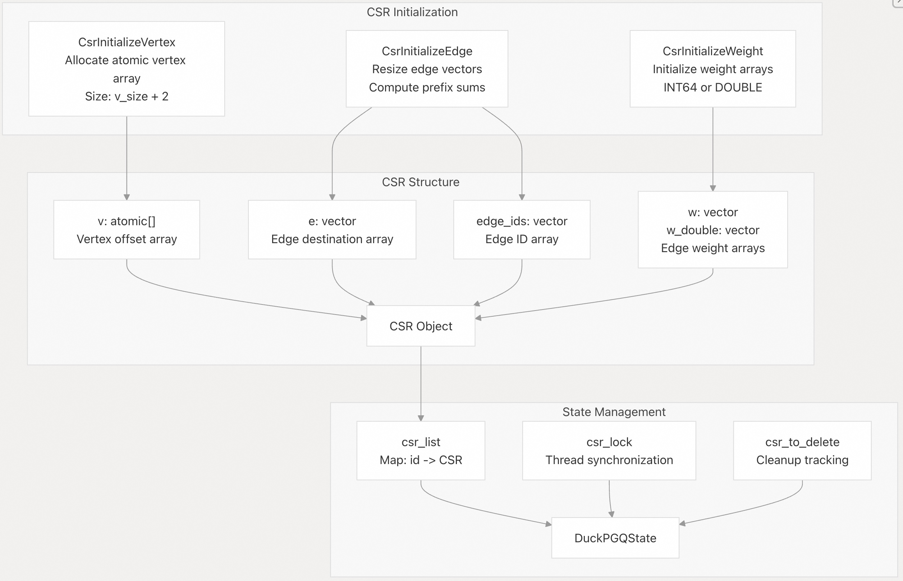
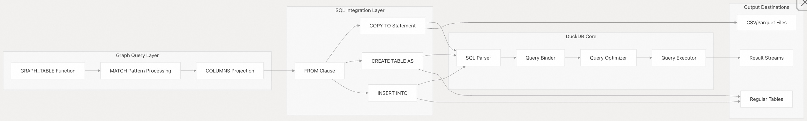
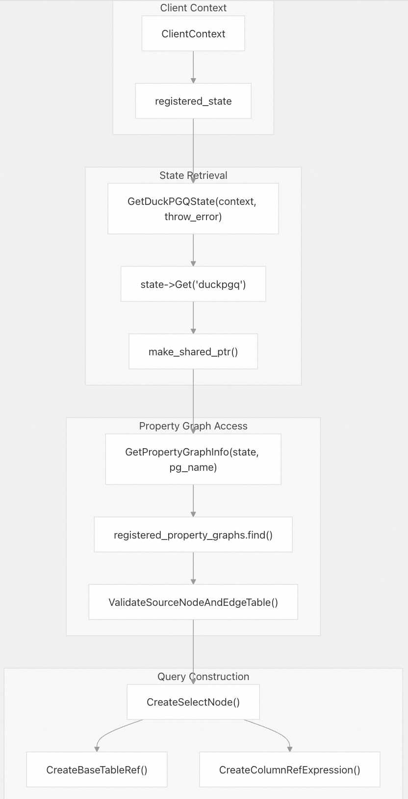
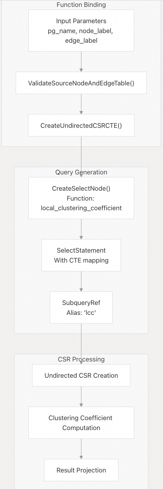
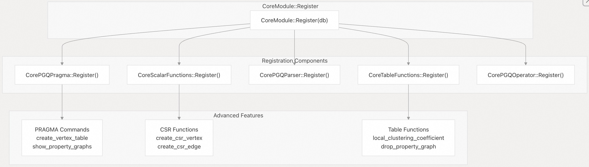

## DuckPGQ 源码学习: 6 高级功能 (Advanced Features)  
        
### 作者        
digoal        
        
### 日期        
2025-11-07        
        
### 标签        
DuckDB , PGQ , 属性图 , DuckPGQ , 源码学习        
        
----        
        
## 背景        
本文档涵盖了 DuckPGQ 中的**高级功能** (`Advanced Features`)，这些功能超越了基本的**属性图** (`property graph`) 创建和查询。这些功能包括用于图实用程序的 **PRAGMA 命令** (`PRAGMA commands`)、内部 **CSR** (Compressed Sparse Row，压缩稀疏行) 函数、**SQL 集成** (`SQL integration`) 功能和**状态管理** (`state management`) 实用程序。  
  
## PRAGMA 命令 (PRAGMA Commands)  
  
DuckPGQ 提供了几个 **PRAGMA 命令** (`PRAGMA commands`)，它们为图管理和数据准备提供实用程序功能。  
  
### PRAGMA create\_vertex\_table (创建顶点表)  
  
`create_vertex_table` **PRAGMA** 通过从源列 (`source_column`) 和目标列 (`destination_column`) 中提取唯一的顶点 ID，自动从现有的**边表** (`edge tables`) 生成**顶点表** (`vertex tables`)。  
  
**语法 (Syntax):**  
  
```sql  
PRAGMA create_vertex_table(edge_table, source_column, destination_column, vertex_table_name, id_column_name);  
```  
  
**参数 (Parameters):**  
  
  * `edge_table`：**边表** (`edge table`) 的名称  
  * `source_column`：包含源顶点 ID (`source vertex IDs`) 的列  
  * `destination_column`：包含目标顶点 ID (`destination vertex IDs`) 的列  
  * `vertex_table_name`：新**顶点表** (`vertex table`) 的名称  
  * `id_column_name`：**顶点表** (`vertex table`) 中 ID 列的名称  
  
**示例 (Example):**  
  
```sql  
PRAGMA create_vertex_table(knows, src, dst, vertices, id);  
```  
  
这会从 `knows` **边表** (`edge table`) 中创建包含所有唯一顶点 ID 的**顶点表** (`vertex table`)。  
  
#### PRAGMA create\_vertex\_table 实现 (Implementation)  
  
    
  
来源 (Sources):  
[`src/core/pragma/create_vertex_table.cpp` 9-27](https://github.com/cwida/duckpgq-extension/blob/29748bfe/src/core/pragma/create_vertex_table.cpp#L9-L27)  
[`test/sql/pragma/create_vertex_table.test` 1-68](https://github.com/cwida/duckpgq-extension/blob/29748bfe/test/sql/pragma/create_vertex_table.test#L1-L68)  
  
### PRAGMA show\_property\_graphs (显示属性图)  
  
`show_property_graphs` **PRAGMA** 列出数据库中所有当前注册的**属性图** (`property graphs`)。  
  
**语法 (Syntax):**  
  
```sql  
PRAGMA show_property_graphs;  
```  
  
它返回一个包含所有**属性图** (`property graphs`) 名称的单列。  
  
来源 (Sources):  
[`test/sql/pragma/show_property_graphs.test` 50-61](https://github.com/cwida/duckpgq-extension/blob/29748bfe/test/sql/pragma/show_property_graphs.test#L50-L61)  
[`src/include/duckpgq/core/pragma/duckpgq_pragma.hpp` 15-27](https://github.com/cwida/duckpgq-extension/blob/29748bfe/src/include/duckpgq/core/pragma/duckpgq_pragma.hpp#L15-L27)  
  
## CSR 内部函数 (CSR Internal Functions)  
  
DuckPGQ 内部使用 **CSR** (Compressed Sparse Row，压缩稀疏行) **数据结构** (`data structures`) 来实现高效的图处理。这些函数通常由系统内部使用，但可用于高级用例。  
  
### CSR 创建函数 (CSR Creation Functions)  
  
#### create\_csr\_vertex 函数 (Function)  
  
`create_csr_vertex` 函数初始化 **CSR 结构** (`CSR structure`) 的**顶点数组组件** (`vertex array component`)。  
  
**函数签名 (Function Signatures):**  
  
```  
create_csr_vertex(csr_id INTEGER, vertex_size BIGINT, source_vertex BIGINT, edge_count BIGINT) → BIGINT  
```  
  
#### create\_csr\_edge 函数 (Function)  
  
`create_csr_edge` 函数填充 **CSR 结构** (`CSR structure`) 的**边数组组件** (`edge array component`)。  
  
**函数签名 (Function Signatures):**  
  
```sql  
-- Without edge weights  
create_csr_edge(csr_id INTEGER, vertex_size BIGINT, edge_sum BIGINT, edge_count BIGINT,   
                source_rowid BIGINT, dest_rowid BIGINT, edge_rowid BIGINT) → INTEGER  
  
-- With integer weights  
create_csr_edge(..., weight BIGINT) → INTEGER  
  
-- With double weights    
create_csr_edge(..., weight DOUBLE) → INTEGER  
```  
  
#### CSR 数据结构管理 (CSR Data Structure Management)  
  
    
  
来源 (Sources):  
[`src/core/functions/scalar/csr_creation.cpp` 16-92](https://github.com/cwida/duckpgq-extension/blob/29748bfe/src/core/functions/scalar/csr_creation.cpp#L16-L92)  
[`src/core/functions/scalar/csr_creation.cpp` 183-241](https://github.com/cwida/duckpgq-extension/blob/29748bfe/src/core/functions/scalar/csr_creation.cpp#L183-L241)  
  
## 与 SQL 操作的集成 (Integration with SQL Operations)  
  
DuckPGQ 与标准 **SQL 操作** (`SQL operations`) 无缝集成，允许在传统的 **SQL 工作流** (`SQL workflows`) 中使用图查询结果。  
  
### COPY TO (复制到) 集成 (Integration)  
  
可以使用 `COPY TO` 语句导出图查询结果：  
  
```sql  
COPY (FROM GRAPH_TABLE (graph_name   
    MATCH (a:Person)   
    COLUMNS(a.name, a.age)  
) tmp) TO 'output.csv' (HEADER FALSE);  
```  
  
### CREATE TABLE AS (创建表为) 集成 (Integration)  
  
图查询结果可以**物化** (`materialized`) 为常规表：  
  
```sql  
CREATE TABLE result AS (  
    FROM GRAPH_TABLE (graph_name  
        MATCH (a:Person)-[k:knows]->(b:Person)  
        COLUMNS(a.name, b.name, k.since)  
    ) tmp  
);  
```  
  
### INSERT INTO (插入到) 集成 (Integration)  
  
图查询结果可以插入到现有表中：  
  
```sql  
INSERT INTO result (  
    FROM GRAPH_TABLE (graph_name  
        MATCH (a:Person WHERE a.age > 30)  
        COLUMNS(a.name, a.age, a.city)  
    ) tmp  
);  
```  
  
#### SQL 集成架构 (SQL Integration Architecture)  
  
    
  
来源 (Sources):  
[`test/sql/copy_to_duckpgq.test` 54-86](https://github.com/cwida/duckpgq-extension/blob/29748bfe/test/sql/copy_to_duckpgq.test#L54-L86)  
  
## 实用程序函数 (Utility Functions)  
  
DuckPGQ 提供了多个用于内部图处理和**状态管理** (`state management`) 的实用程序函数。  
  
### 状态管理函数 (State Management Functions)  
  
| 函数 (Function) | 用途 (Purpose) |  
| :--- | :--- |  
| `GetDuckPGQState` | 从 `ClientContext` 中检索或创建 DuckPGQ 状态 |  
| `GetPropertyGraphInfo` | 从状态中获取**属性图元数据** (`property graph metadata`) |  
| `ValidateSourceNodeAndEdgeTable` | 验证图**模式关系** (`schema relationships`) |  
  
### 图构造实用程序 (Graph Construction Utilities)  
  
| 函数 (Function) | 用途 (Purpose) |  
| :--- | :--- |  
| `CreateSelectNode` | 为图查询构造 **SELECT 节点** (`SELECT nodes`) |  
| `CreateBaseTableRef` | 创建**基础表引用** (`base table references`) |  
| `CreateColumnRefExpression` | 创建**列引用表达式** (`column reference expressions`) |  
  
#### 实用程序函数工作流 (Utility Function Workflow)  
  
    
  
来源 (Sources):  
[`src/core/utils/duckpgq_utils.cpp` 16-43](https://github.com/cwida/duckpgq-extension/blob/29748bfe/src/core/utils/duckpgq_utils.cpp#L16-L43)  
[`src/include/duckpgq/core/utils/duckpgq_utils.hpp` 11-25](https://github.com/cwida/duckpgq-extension/blob/29748bfe/src/include/duckpgq/core/utils/duckpgq_utils.hpp#L11-L25)  
  
## 高级表函数 (Advanced Table Functions)  
  
### Local Clustering Coefficient (局部聚类系数) 函数 (Function)  
  
**局部聚类系数** (`local clustering coefficient`) 函数通过计算顶点的**聚类指标** (`clustering metrics`) 来提供高级图分析。  
  
**用法 (Usage):**  
  
```sql  
SELECT * FROM local_clustering_coefficient('graph_name', 'vertex_label', 'edge_label');  
```  
  
该函数内部创建 **CSR 结构** (`CSR structures`) 并执行复杂的**图遍历** (`graph traversals`) 来计算**聚类系数** (`clustering coefficients`)。  
  
#### 函数架构 (Function Architecture)  
  
    
  
来源 (Sources):  
[`src/core/functions/table/local_clustering_coefficient.cpp` 18-45](https://github.com/cwida/duckpgq-extension/blob/29748bfe/src/core/functions/table/local_clustering_coefficient.cpp#L18-L45)  
  
### Drop Property Graph (移除属性图) 函数 (Function)  
  
**移除属性图** (`drop property graph`) 函数提供从系统中**程序化移除** (`programmatic removal`) 属性图的功能。  
  
该函数处理：  
  
  * **属性图存在性验证** (`Property graph existence validation`)  
  * **交叉连接状态清理** (`Cross-connection state cleanup`)  
  * 从 `__duckpgq_internal` 表中移除**持久化元数据** (`Persistent metadata removal`)  
  
来源 (Sources):  
[`src/core/functions/table/drop_property_graph.cpp` 37-67](https://github.com/cwida/duckpgq-extension/blob/29748bfe/src/core/functions/table/drop_property_graph.cpp#L37-L67)  
  
## 模块注册 (Module Registration)  
  
所有**高级功能** (`advanced features`) 均通过**核心模块系统** (`core module system`) 进行注册：  
  
    
  
来源 (Sources):  
[`src/core/module.cpp` 14-20](https://github.com/cwida/duckpgq-extension/blob/29748bfe/src/core/module.cpp#L14-L20)  
[`src/core/pragma/CMakeLists.txt` 1-6](https://github.com/cwida/duckpgq-extension/blob/29748bfe/src/core/pragma/CMakeLists.txt#L1-L6)  
    
#### [PolarDB 学习图谱](https://www.aliyun.com/database/openpolardb/activity "8642f60e04ed0c814bf9cb9677976bd4")
  
  
#### [PostgreSQL 解决方案集合](../201706/20170601_02.md "40cff096e9ed7122c512b35d8561d9c8")
  
  
#### [德哥 / digoal's Github - 公益是一辈子的事.](https://github.com/digoal/blog/blob/master/README.md "22709685feb7cab07d30f30387f0a9ae")
  
  
#### [About 德哥](https://github.com/digoal/blog/blob/master/me/readme.md "a37735981e7704886ffd590565582dd0")
  
  

  
