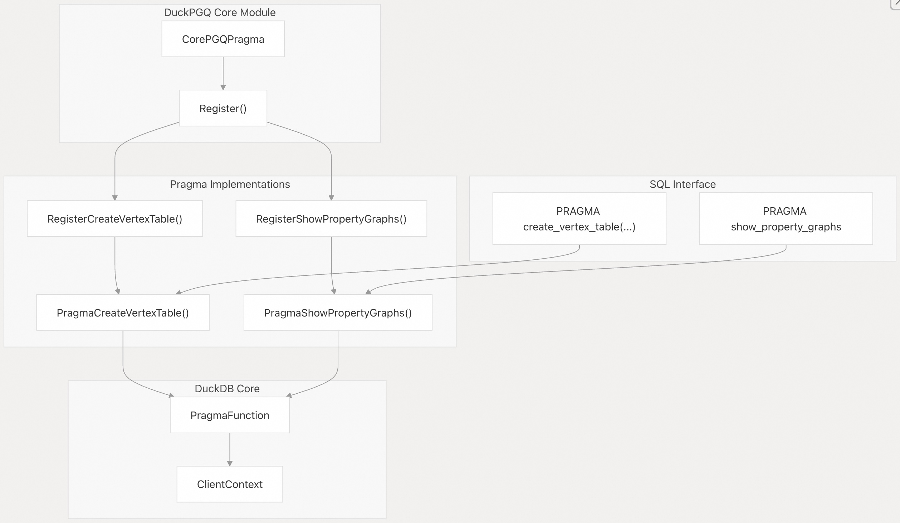
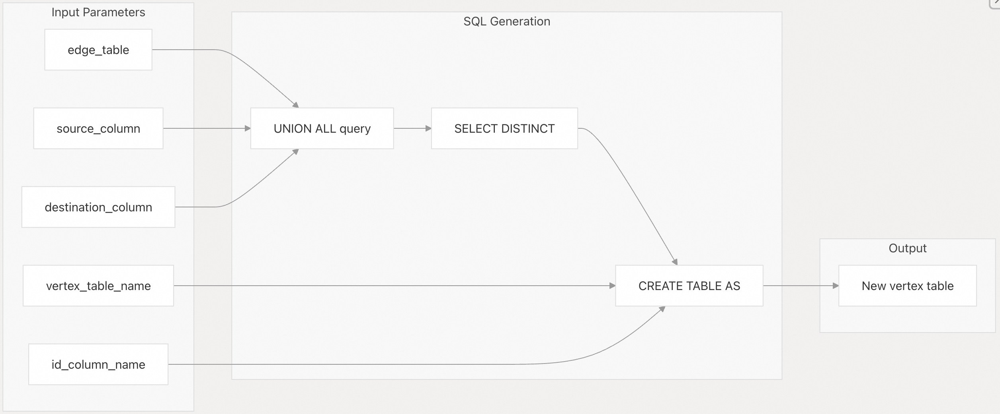
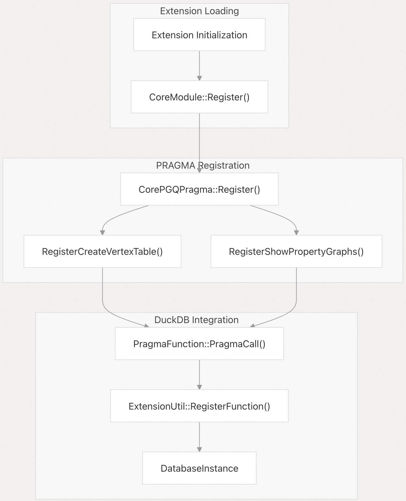
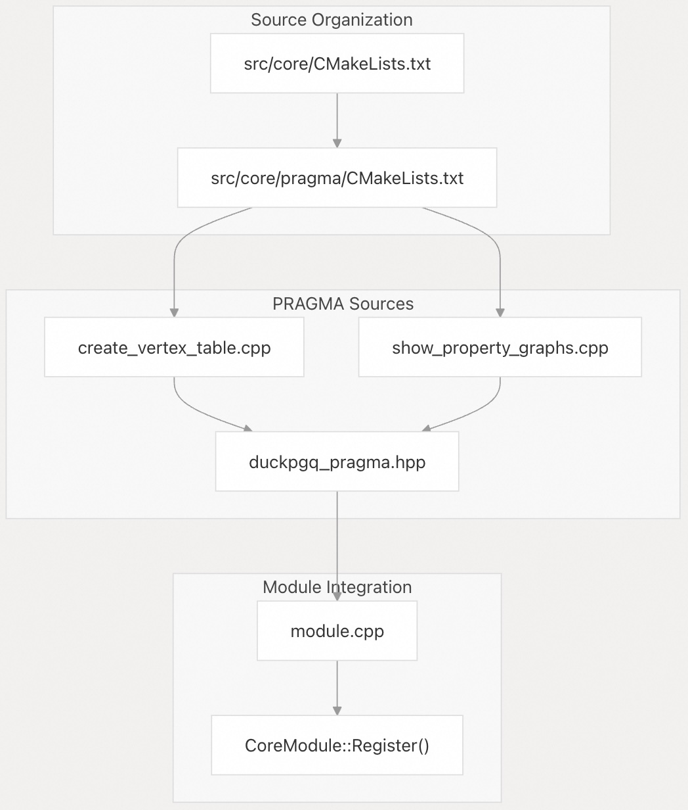

## DuckPGQ 源码学习: 6.1 PRAGMA Commands  
          
### 作者          
digoal          
          
### 日期          
2025-11-07          
          
### 标签          
DuckDB , PGQ , 属性图 , DuckPGQ , 源码学习          
          
----          
          
## 背景          
`DuckPGQ` 提供了专门的 **PRAGMA commands** (PRAGMA 命令)，用于图数据库的实用程序和操作。这些命令扩展了 **DuckDB's PRAGMA functionality** (DuckDB 的 PRAGMA 功能)，以支持图特定的操作，例如从 **edge data** (边数据) 创建 **vertex tables** (顶点表) 和显示已注册的 **property graphs** (属性图)。  
  
## Overview / 概述  
  
`DuckPGQ` 实现了两个主要的 **PRAGMA commands** (PRAGMA 命令)，它们为图数据库操作提供了实用程序功能：  
  
  * `create_vertex_table` (创建顶点表) - 自动从 **edge table data** (边表数据) 生成 **vertex tables** (顶点表)  
  * `show_property_graphs` (显示属性图) - 列出当前数据库中所有已注册的 **property graphs** (属性图)  
  
这些命令作为 **DuckDB pragma functions** (DuckDB PRAGMA 函数) 实现，并与现有的 **PRAGMA infrastructure** (PRAGMA 基础设施) 无缝集成。  
  
## PRAGMA Architecture / PRAGMA 架构  
  
  
  
来源:  
[`src/include/duckpgq/core/pragma/duckpgq_pragma.hpp` 15-27](https://github.com/cwida/duckpgq-extension/blob/29748bfe/src/include/duckpgq/core/pragma/duckpgq_pragma.hpp#L15-L27)  
[`src/core/module.cpp` 14-20](https://github.com/cwida/duckpgq-extension/blob/29748bfe/src/core/module.cpp#L14-L20)  
  
## create\_vertex\_table / 创建顶点表  
  
`create_vertex_table` (创建顶点表) **pragma** (命令) 通过从 **edge table** (边表) 的 **source** (源) 列和 **destination columns** (目标列) 中提取所有唯一的 **vertex identifiers** (顶点标识符) 来自动生成一个 **vertex table** (顶点表)。  
  
### Syntax / 语法  
  
```sql  
PRAGMA create_vertex_table(edge_table, source_column, destination_column, vertex_table_name, id_column_name);  
```  
  
### Parameters / 参数  
  
| Parameter / 参数 | Type / 类型 | Description / 描述 |  
| :--- | :--- | :--- |  
| `edge_table` | `VARCHAR` | 包含关系的 **edge table** (边表) 的名称 |  
| `source_column` | `VARCHAR` | 用于 **source vertex identifiers** (源顶点标识符) 的 **column name** (列名) |  
| `destination_column` | `VARCHAR` | 用于 **destination vertex identifiers** (目标顶点标识符) 的 **column name** (列名) |  
| `vertex_table_name` | `VARCHAR` | 要创建的新 **vertex table** (顶点表) 的名称 |  
| `id_column_name` | `VARCHAR` | 新表中 **vertex identifiers** (顶点标识符) 的 **column name** (列名) |  
  
### Generated SQL / 生成的 SQL  
  
该 **pragma** (命令) 生成一个 **SQL query** (SQL 查询)，用于创建一个包含所有唯一 **vertex identifiers** (顶点标识符) 的新表：  
  
```sql  
CREATE TABLE vertex_table_name AS   
SELECT DISTINCT id_column_name FROM (  
    SELECT source_column AS id_column_name FROM edge_table   
    UNION ALL   
    SELECT destination_column AS id_column_name FROM edge_table  
)  
```  
  
### Implementation Details / 实现细节  
  
  
  
来源:  
[`src/core/pragma/create_vertex_table.cpp` 9-27](https://github.com/cwida/duckpgq-extension/blob/29748bfe/src/core/pragma/create_vertex_table.cpp#L9-L27)  
  
### Usage Example / 使用示例  
  
```sql  
-- Create an edge table  
CREATE TABLE knows(src BIGINT, dst BIGINT, createDate BIGINT);  
INSERT INTO knows VALUES (0,1,10), (0,2,11), (0,3,12), (3,0,13), (1,2,14);  
  
-- Generate vertex table from edge relationships  
PRAGMA create_vertex_table(knows, src, dst, vertices, id);  
  
-- Query the generated vertex table  
SELECT * FROM vertices;  
-- Returns: 0, 1, 2, 3 (unique vertex IDs)  
```  
  
### Error Handling / 错误处理  
  
该 **pragma** (命令) 会验证输入 **parameters** (参数) 并提供特定的 **error messages** (错误信息)：  
  
  * **Missing parameters** (缺少参数): 必须正好需要 5 个参数  
  * **Non-existent table** (表不存在): 引用的 **edge table** (边表) 必须存在  
  * **Non-existent columns** (列不存在): **source** (源) 列和 **destination columns** (目标列) 必须存在于 **edge table** (边表) 中  
  * **Table name conflicts** (表名冲突): **Vertex table name** (顶点表名) 不能已存在  
  * **Reserved keywords** (保留关键字): 不能使用 **SQL reserved words** (SQL 保留关键字) 作为表名  
  
来源:  
[`test/sql/pragma/create_vertex_table.test` 22-50](https://github.com/cwida/duckpgq-extension/blob/29748bfe/test/sql/pragma/create_vertex_table.test#L22-L50)  
  
## show\_property\_graphs / 显示属性图  
  
`show_property_graphs` (显示属性图) **pragma** (命令) 列出数据库会话中所有当前已注册的 **property graphs** (属性图)。  
  
### Syntax / 语法  
  
```sql  
PRAGMA show_property_graphs;  
```  
  
### Return Value / 返回值  
  
返回一个包含所有已注册 **property graphs** (属性图) 名称的 **single-column result set** (单列表结果集)。  
  
### Usage Example / 使用示例  
  
```sql  
-- Create a property graph  
CREATE PROPERTY GRAPH social_network  
VERTEX TABLES (Person LABEL Person)  
EDGE TABLES (  
    Person_knows_Person SOURCE KEY (Person1Id) REFERENCES Person (id)  
                       DESTINATION KEY (Person2Id) REFERENCES Person (id)  
                       LABEL knows  
);  
  
-- List all property graphs  
PRAGMA show_property_graphs;  
-- Returns: social_network  
  
-- Drop the property graph  
DROP PROPERTY GRAPH social_network;  
  
-- Check again  
PRAGMA show_property_graphs;  
-- Returns: (empty result)  
```  
  
来源:  
[`test/sql/pragma/show_property_graphs.test` 50-61](https://github.com/cwida/duckpgq-extension/blob/29748bfe/test/sql/pragma/show_property_graphs.test#L50-L61)  
  
## Registration and Integration / 注册与集成  
  
这些 **PRAGMA commands** (PRAGMA 命令) 通过 `CorePGQPragma` 类注册，作为 **extension initialization process** (扩展初始化过程) 的一部分：  
  
  
  
来源:  
[`src/core/module.cpp` 14-20](https://github.com/cwida/duckpgq-extension/blob/29748bfe/src/core/module.cpp#L14-L20)  
[`src/include/duckpgq/core/pragma/duckpgq_pragma.hpp` 19-26](https://github.com/cwida/duckpgq-extension/blob/29748bfe/src/include/duckpgq/core/pragma/duckpgq_pragma.hpp#L19-L26)  
  
### Function Registration Process / 函数注册过程  
  
每个 **PRAGMA command** (PRAGMA 命令) 都遵循相同的 **registration pattern** (注册模式)：  
  
1.  **Parameter Definition** (参数定义): 使用 **LogicalType** (逻辑类型) 常量指定输入参数类型  
2.  **Function Creation** (函数创建): 使用 `PragmaFunction::PragmaCall()` 创建 **PragmaFunction** (Pragma 函数)  
3.  **Registration** (注册): 使用 `ExtensionUtil::RegisterFunction()` 向 **DuckDB** 注册  
  
`create_vertex_table` (创建顶点表) 命令使用五个 **VARCHAR parameters** (VARCHAR 参数) 进行注册，而 `show_property_graphs` (显示属性图) 则不需要任何 **parameters** (参数)。  
  
来源:  
[`src/core/pragma/create_vertex_table.cpp` 29-45](https://github.com/cwida/duckpgq-extension/blob/29748bfe/src/core/pragma/create_vertex_table.cpp#L29-L45)  
  
## Build Configuration / 构建配置  
  
**PRAGMA functionality** (PRAGMA 功能) 在扩展的 **build system** (构建系统) 内组织：  
  
  
  
来源:  
[`src/core/CMakeLists.txt` 1-11](https://github.com/cwida/duckpgq-extension/blob/29748bfe/src/core/CMakeLists.txt#L1-L11)  
[`src/core/pragma/CMakeLists.txt` 1-6](https://github.com/cwida/duckpgq-extension/blob/29748bfe/src/core/pragma/CMakeLists.txt#L1-L6)  
      
#### [PolarDB 学习图谱](https://www.aliyun.com/database/openpolardb/activity "8642f60e04ed0c814bf9cb9677976bd4")
  
  
#### [PostgreSQL 解决方案集合](../201706/20170601_02.md "40cff096e9ed7122c512b35d8561d9c8")
  
  
#### [德哥 / digoal's Github - 公益是一辈子的事.](https://github.com/digoal/blog/blob/master/README.md "22709685feb7cab07d30f30387f0a9ae")
  
  
#### [About 德哥](https://github.com/digoal/blog/blob/master/me/readme.md "a37735981e7704886ffd590565582dd0")
  
  

  
