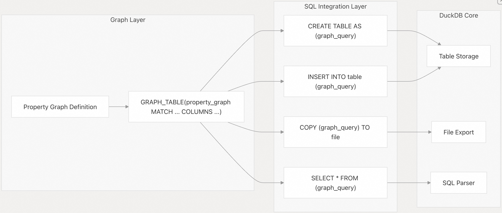
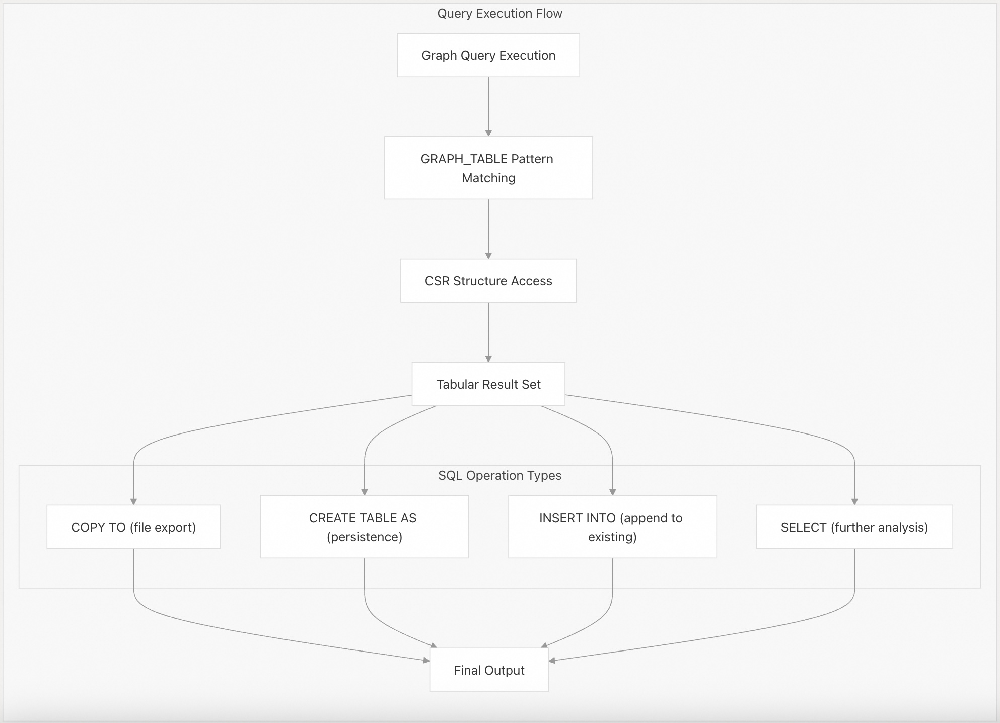

## DuckPGQ 源码学习: 6.2 与 SQL 的集成 (Integration with SQL)  
            
### 作者            
digoal            
            
### 日期            
2025-11-07            
            
### 标签            
DuckDB , PGQ , 属性图 , DuckPGQ , 源码学习            
            
----            
            
## 背景            
本页介绍 **DuckPGQ** 图查询 (graph queries) 如何与标准 **SQL** 操作集成，从而实现图处理 (graph processing) 和关系操作 (relational operations) 之间无缝的数据工作流程 (data workflows)。这涵盖了将 **GRAPH\_TABLE** 结果与 **SQL** 命令（如 **COPY TO**、**CREATE TABLE AS** 和 **INSERT INTO**）一起使用。  
  
## 概述 (Overview)  
  
**DuckPGQ** 提供了与 **DuckDB** 的 **SQL** 引擎的深度集成 (deep integration)，允许将图查询结果用作标准 **SQL** 操作的输入 (input)。**GRAPH\_TABLE** 函数生成表格结果 (tabular results)，可供任何接受表表达式 (table expressions) 的 **SQL** 操作使用。  
  
  
  
来源: [`test/sql/copy_to_duckpgq.test` 1-87](https://github.com/cwida/duckpgq-extension/blob/29748bfe/test/sql/copy_to_duckpgq.test#L1-L87)  
  
## 使用 COPY TO 导出数据 (Data Export with COPY TO)  
  
**COPY TO** 语句可以将图查询结果直接导出到文件。图查询被包裹在圆括号中，并被视为一个子查询 (subquery)。  
  
### 基本导出语法 (Basic Export Syntax)  
  
```  
COPY (FROM GRAPH_TABLE (property_graph  
    MATCH (pattern)  
    COLUMNS (column_list)  
) alias) TO 'filename.csv' (options);  
```  
  
该模式遵循以下结构：  
  
  * 将整个 **GRAPH\_TABLE** 表达式包装在 `FROM ... alias` 中  
  * 将完整的语句用圆括号括起来用于 **COPY**  
  * 指定输出文件 (output file) 和格式选项 (format options)  
  
### 导出示例 (Export Examples)  
  
从属性图 (property graph) 导出人员信息：  
  
```sql  
COPY (FROM GRAPH_TABLE (snb  
    MATCH (a is person where a.id = 17592186044461)  
    COLUMNS(a.firstName, a.lastName, a.birthday, a.locationIP, a.browserUsed, a.LocationCityId, a.gender)  
) tmp) TO 'person_data.csv' (HEADER FALSE);  
```  
  
这将匹配到的人员属性 (attributes) 导出到一个不带标题行 (headers) 的 **CSV** 文件。  
  
来源: [`test/sql/copy_to_duckpgq.test` 54-63](https://github.com/cwida/duckpgq-extension/blob/29748bfe/test/sql/copy_to_duckpgq.test#L54-L63)  
  
## 使用 CREATE TABLE AS 创建表 (Table Creation with CREATE TABLE AS)  
  
图查询结果可以使用 **CREATE TABLE AS** 具化 (materialized) 成持久化表 (persistent tables)。这对于存储中间结果 (intermediate results) 或从图分析 (graph analysis) 创建派生数据集 (derived datasets) 非常有用。  
  
### 语法模式 (Syntax Pattern)  
  
```sql  
CREATE TABLE table_name AS (FROM GRAPH_TABLE (property_graph  
    MATCH (pattern)  
    COLUMNS (column_list)  
) alias);  
```  
  
### 示例用法 (Example Usage)  
  
从人员数据创建表：  
  
```sql  
CREATE TABLE result AS (FROM GRAPH_TABLE (snb  
    MATCH (a is person where a.id = 17592186044461)  
    COLUMNS(a.firstName, a.lastName, a.birthday, a.locationIP,   
            a.browserUsed, a.LocationCityId, a.gender, a.creationDate)  
) tmp);  
```  
  
生成的表 (resulting table) 可以像任何常规 **DuckDB** 表一样查询 (queried)，从而能够在图派生数据 (graph-derived data) 上进行标准 **SQL** 操作。  
  
来源: [`test/sql/copy_to_duckpgq.test` 66-74](https://github.com/cwida/duckpgq-extension/blob/29748bfe/test/sql/copy_to_duckpgq.test#L66-L74)  
  
## 使用 INSERT INTO 插入数据 (Data Insertion with INSERT INTO)  
  
图查询结果可以使用 **INSERT INTO** 插入到现有表 (existing tables) 中。这使得增量数据加载 (incremental data loading) 和组合来自多个图查询的结果成为可能。  
  
### 语法模式 (Syntax Pattern)  
  
```sql  
INSERT INTO existing_table (FROM GRAPH_TABLE (property_graph  
    MATCH (pattern)  
    COLUMNS (column_list)  
) alias);  
```  
  
### 示例用法 (Example Usage)  
  
向现有结果表插入额外的行 (rows)：  
  
```sql  
INSERT INTO result (FROM GRAPH_TABLE (snb  
    MATCH (a is person where a.id = 17592186044461)  
    COLUMNS(a.firstName, a.lastName, a.birthday, a.locationIP,   
            a.browserUsed, a.LocationCityId, a.gender, a.creationDate)  
) tmp);  
```  
  
这将图查询结果附加 (appends) 到现有的 `people_results` 表中，如果多次运行相同的查询，可能会导致数据重复 (duplicating data)。  
  
来源: [`test/sql/copy_to_duckpgq.test` 77-86](https://github.com/cwida/duckpgq-extension/blob/29748bfe/test/sql/copy_to_duckpgq.test#L77-L86)  
  
## SQL 操作集成流程 (SQL Operations Integration Flow)  
  
图查询和 **SQL** 操作之间的集成遵循一致的模式 (consistent pattern)，其中 **GRAPH\_TABLE** 结果被视为标准表表达式 (standard table expressions)：  
  
  
  
来源: [`test/sql/copy_to_duckpgq.test` 1-87](https://github.com/cwida/duckpgq-extension/blob/29748bfe/test/sql/copy_to_duckpgq.test#L1-L87)  
  
## 混合 SQL 和图操作 (Mixed SQL and Graph Operations)  
  
图查询可以在同一语句中与标准 **SQL** 操作相结合 (combined)。**GRAPH\_TABLE** 函数与 **SQL** 的表表达式语法 (table expression syntax) 无缝集成 (integrates seamlessly)。  
  
### 子查询集成 (Subquery Integration)  
  
图结果可以在更大的 **SQL** 语句中用作子查询 (subqueries)：  
  
```sql  
SELECT person, friend  
FROM GRAPH_TABLE (pg  
    MATCH (a:Student)-[k:know]-(b:Student)  
    WHERE a.name = 'Daniel'  
    COLUMNS (a.name as person, b.name as friend)  
)  
ORDER BY person, friend;  
```  
  
### 联合操作 (Union Operations)  
  
图查询结果可以使用 **UNION** 与常规表数据相结合：  
  
```sql  
SELECT src, dst FROM know  
UNION ALL  
SELECT person_id, friend_id FROM GRAPH_TABLE (pg  
    MATCH (a:Person)-[:knows]->(b:Person)  
    COLUMNS (a.id as person_id, b.id as friend_id)  
);  
```  
  
来源: [`test/sql/pattern_matching/undirected_edges.test` 38-51](https://github.com/cwida/duckpgq-extension/blob/29748bfe/test/sql/pattern_matching/undirected_edges.test#L38-L51)  
  
## 数据类型兼容性 (Data Type Compatibility)  
  
**DuckPGQ** 保持与 **DuckDB** 类型系统 (type system) 的完全兼容性 (full compatibility)。图查询结果保留了底层表 (underlying tables) 的原始数据类型 (original data types)：  
  
| 图元素 (Graph Element) | SQL 类型保留 (SQL Type Preservation) |  
| :--- | :--- |  
| 顶点属性 (Vertex properties) | 维护原始列类型 (Original column types maintained) |  
| 边属性 (Edge properties) | 维护原始列类型 (Original column types maintained) |  
| 计算值 (Computed values) | 标准 SQL 类型推断 (Standard SQL type inference) |  
| 路径长度 (Path lengths) | `BIGINT` |  
| 聚合 (Aggregations) | 基于聚合函数 (aggregate function) 的类型 |  
  
## 最佳实践 (Best Practices)  
  
### 性能考量 (Performance Considerations)  
  
  * 对经常访问的图查询结果使用 **CREATE TABLE AS**  
  * 使用 **COPY TO** 导出大型结果集 (large result sets)，以避免内存限制 (memory constraints)  
  * 考虑为创建的表建立索引 (indexing) 以进行后续 **SQL** 查询  
  
### 数据管道集成 (Data Pipeline Integration)  
  
  * 使用 **INSERT INTO** 组合多个图查询以进行增量处理 (incremental processing)  
  * 在复杂的工作流程 (complex workflows) 中，使用临时表 (temporary tables) 存储中间结果  
  * 以适当的格式（**CSV**、**Parquet**）导出结果，供外部工具 (external tools) 使用  
  
来源: [`test/sql/copy_to_duckpgq.test` 1-87](https://github.com/cwida/duckpgq-extension/blob/29748bfe/test/sql/copy_to_duckpgq.test#L1-L87) [`test/sql/pattern_matching/undirected_edges.test` 1-69](https://github.com/cwida/duckpgq-extension/blob/29748bfe/test/sql/pattern_matching/undirected_edges.test#L1-L69)  
  
      
#### [PolarDB 学习图谱](https://www.aliyun.com/database/openpolardb/activity "8642f60e04ed0c814bf9cb9677976bd4")
  
  
#### [PostgreSQL 解决方案集合](../201706/20170601_02.md "40cff096e9ed7122c512b35d8561d9c8")
  
  
#### [德哥 / digoal's Github - 公益是一辈子的事.](https://github.com/digoal/blog/blob/master/README.md "22709685feb7cab07d30f30387f0a9ae")
  
  
#### [About 德哥](https://github.com/digoal/blog/blob/master/me/readme.md "a37735981e7704886ffd590565582dd0")
  
  

  
