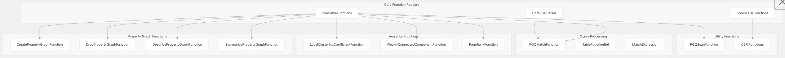
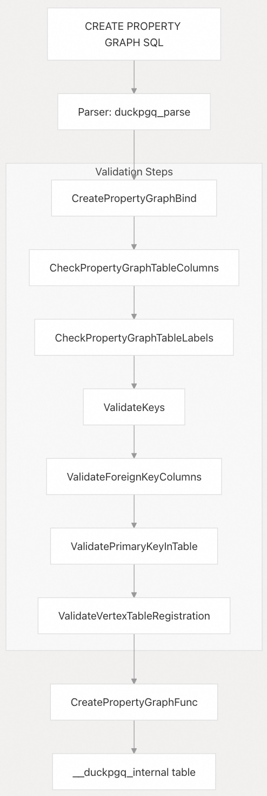
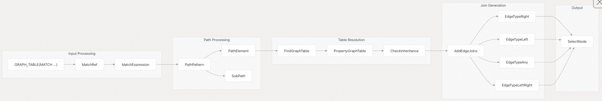
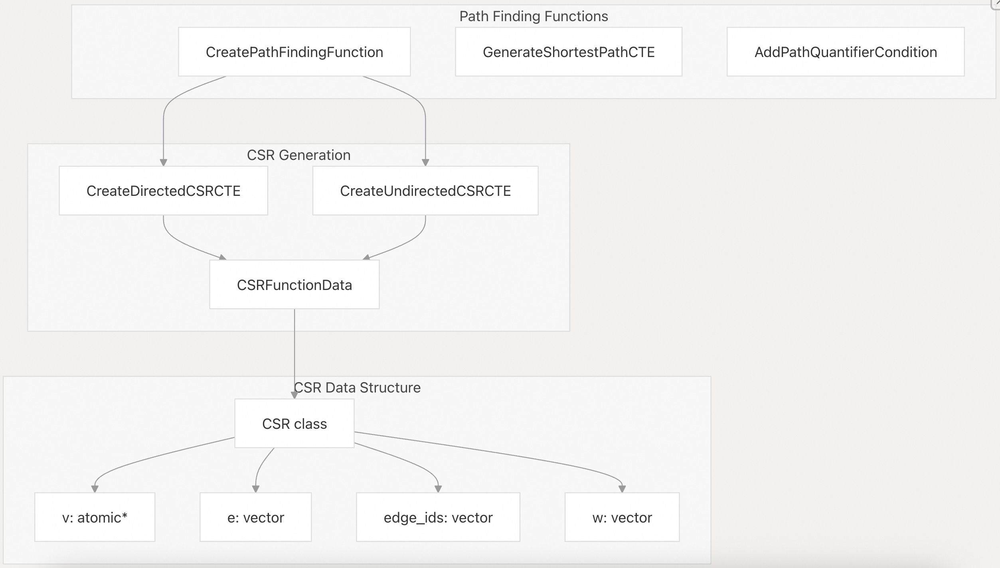
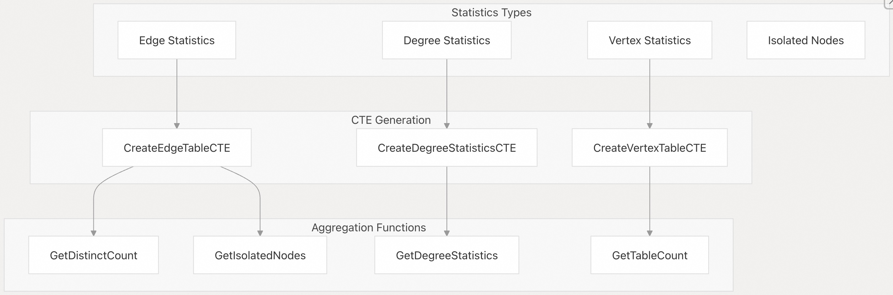
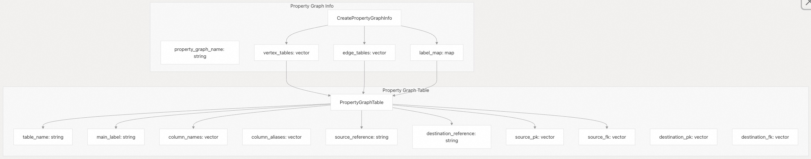
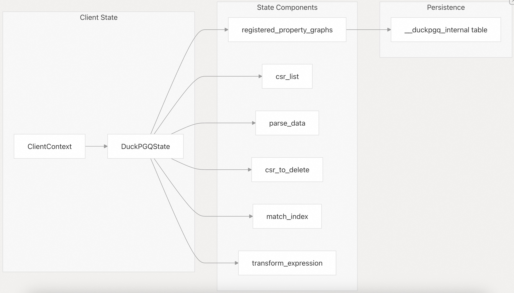
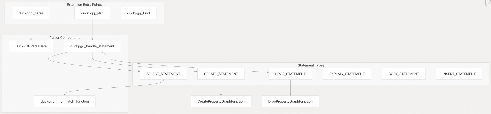
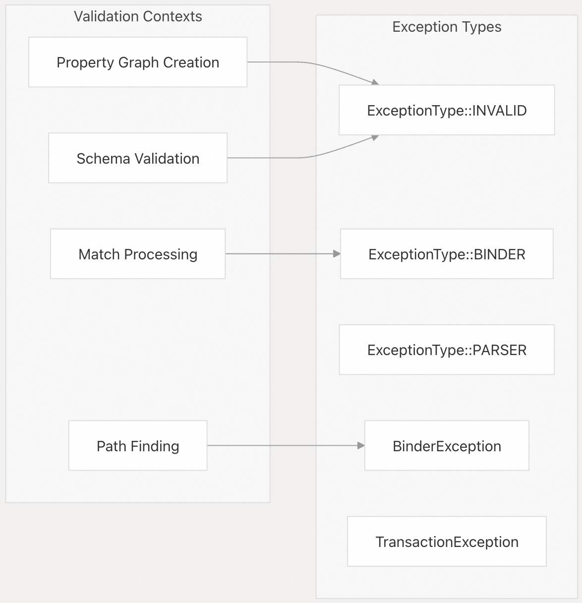

## DuckPGQ 源码学习: 8 参考 (Reference)   
              
### 作者              
digoal              
              
### 日期              
2025-11-07              
              
### 标签              
DuckDB , PGQ , 属性图 , DuckPGQ , 源码学习              
              
----              
              
## 背景              
本页提供了关于所有 **DuckPGQ** 函数 (functions)、语法 (syntax)、数据结构 (data structures) 和配置选项 (configuration options) 的完整参考文档。它为开发人员和高级用户提供了关于该扩展的公共 **API** (Public API) 和内部架构 (internal architecture) 的全面指南。  
  
## 函数注册架构 (Function Registry Architecture)  
  
**DuckPGQ** 扩展通过一个结构化的**函数注册系统** (structured function registry system) 来组织其功能，该系统将 **SQL** 操作映射到其底层的 **C++** 实现。  
  
    
  
来源: [`src/include/duckpgq/core/functions/table.hpp` 8-34](https://github.com/cwida/duckpgq-extension/blob/29748bfe/src/include/duckpgq/core/functions/table.hpp#L8-L34) [`src/core/functions/table/CMakeLists.txt` 1-13](https://github.com/cwida/duckpgq-extension/blob/29748bfe/src/core/functions/table/CMakeLists.txt#L1-L13)  
  
## 属性图管理函数 (Property Graph Management Functions)  
  
这些函数处理属性图定义 (property graph definitions) 的生命周期，包括创建 (creation)、删除 (deletion) 和自省 (introspection)。  
  
| 函数 (Function) | 目的 (Purpose) | 实现类 (Implementation Class) | 关键方法 (Key Methods) |  
| :--- | :--- | :--- | :--- |  
| `CREATE PROPERTY GRAPH` | 定义顶点 (vertex) 和边 (edge) 表 | `CreatePropertyGraphFunction` | `CreatePropertyGraphBind`, `CreatePropertyGraphFunc` |  
| `DROP PROPERTY GRAPH` | 移除属性图定义 | `DropPropertyGraphFunction` | 标准表函数模式 (Standard table function pattern) |  
| `DESCRIBE PROPERTY GRAPH` | 显示图模式信息 (graph schema information) | `DescribePropertyGraphFunction` | 模式自省 (Schema introspection) |  
| `SUMMARIZE PROPERTY GRAPH` | 生成图统计信息 (graph statistics) | `SummarizePropertyGraphFunction` | `SummarizePropertyGraphBindReplace` |  
  
### CREATE PROPERTY GRAPH 验证流程 (Validation Pipeline)  
  
    
  
来源: [`src/core/functions/table/create_property_graph.cpp` 170-290](https://github.com/cwida/duckpgq-extension/blob/29748bfe/src/core/functions/table/create_property_graph.cpp#L170-L290) [`src/core/functions/table/create_property_graph.cpp` 16-150](https://github.com/cwida/duckpgq-extension/blob/29748bfe/src/core/functions/table/create_property_graph.cpp#L16-L150)  
  
## 查询处理函数 (Query Processing Functions)  
  
核心查询处理 (core query processing) 围绕着 `PGQMatchFunction` 展开，该函数将 **MATCH** 模式 (patterns) 转换为可执行的 **SQL**。  
  
### MATCH 函数处理流程 (Processing Pipeline)  
  
    
  
来源: [`src/core/functions/table/match.cpp` 133-145](https://github.com/cwida/duckpgq-extension/blob/29748bfe/src/core/functions/table/match.cpp#L133-L145) [`src/core/functions/table/match.cpp` 686-722](https://github.com/cwida/duckpgq-extension/blob/29748bfe/src/core/functions/table/match.cpp#L686-L722) [`src/core/functions/table/match.cpp` 363-430](https://github.com/cwida/duckpgq-extension/blob/29748bfe/src/core/functions/table/match.cpp#L363-L430)  
  
### 路径查找和 CSR 集成 (Path Finding and CSR Integration)  
  
对于最短路径查询 (shortest path queries)，系统与**压缩稀疏行** (Compressed Sparse Row, **CSR**) 数据结构集成：  
  
    
  
来源: [`src/core/functions/table/match.cpp` 522-684](https://github.com/cwida/duckpgq-extension/blob/29748bfe/src/core/functions/table/match.cpp#L522-L684) [`src/core/utils/compressed_sparse_row.cpp` 477-559](https://github.com/cwida/duckpgq-extension/blob/29748bfe/src/core/utils/compressed_sparse_row.cpp#L477-L559) [`src/include/duckpgq/core/utils/compressed_sparse_row.hpp` 27-47](https://github.com/cwida/duckpgq-extension/blob/29748bfe/src/include/duckpgq/core/utils/compressed_sparse_row.hpp#L27-L47)  
  
## 分析函数 (Analytics Functions)  
  
**DuckPGQ** 提供了几种内置的图分析算法 (graph analytics algorithms)，它们以表函数 (table functions) 的形式实现：  
  
| 算法 (Algorithm) | 函数名称 (Function Name) | 实现 (Implementation) | 返回类型 (Return Type) |  
| :--- | :--- | :--- | :--- |  
| 局部聚类系数 (Local Clustering Coefficient) | `local_clustering_coefficient` | `LocalClusteringCoefficientFunction` | `(vertex_id, coefficient)` （顶点 **ID**, 系数） |  
| 弱连通分量 (Weakly Connected Components) | `weakly_connected_component` | `WeaklyConnectedComponentFunction` | `(vertex_id, component_id)` （顶点 **ID**, 分量 **ID**） |  
| **PageRank** 算法 | `pagerank` | `PageRankFunction` | `(vertex_id, rank)` （顶点 **ID**, 排名） |  
  
### SUMMARIZE PROPERTY GRAPH 统计信息生成 (Statistics Generation)  
  
    
  
来源: [`src/core/functions/table/summarize_property_graph.cpp` 161-322](https://github.com/cwida/duckpgq-extension/blob/29748bfe/src/core/functions/table/summarize_property_graph.cpp#L161-L322) [`src/core/functions/table/summarize_property_graph.cpp` 62-136](https://github.com/cwida/duckpgq-extension/blob/29748bfe/src/core/functions/table/summarize_property_graph.cpp#L62-L136)  
  
## 内部数据结构 (Internal Data Structures)  
  
### 属性图模式表示 (Property Graph Schema Representation)  
  
    
  
来源: [`src/core/functions/table/create_property_graph.cpp` 186-188](https://github.com/cwida/duckpgq-extension/blob/29748bfe/src/core/functions/table/create_property_graph.cpp#L186-L188)  
  
### DuckPGQ 状态管理 (State Management)  
  
    
  
来源: [`src/core/functions/table/create_property_graph.cpp` 304-309](https://github.com/cwida/duckpgq-extension/blob/29748bfe/src/core/functions/table/create_property_graph.cpp#L304-L309) [`src/core/parser/duckpgq_parser.cpp` 44-70](https://github.com/cwida/duckpgq-extension/blob/29748bfe/src/core/parser/duckpgq_parser.cpp#L44-L70)  
  
## 解析器和扩展集成 (Parser and Extension Integration)  
  
### 扩展注册和解析 (Extension Registration and Parsing)  
  
    
  
来源: [`src/core/parser/duckpgq_parser.cpp` 29-41](https://github.com/cwida/duckpgq-extension/blob/29748bfe/src/core/parser/duckpgq_parser.cpp#L29-L41) [`src/core/parser/duckpgq_parser.cpp` 136-187](https://github.com/cwida/duckpgq-extension/blob/29748bfe/src/core/parser/duckpgq_parser.cpp#L136-L187) [`src/core/parser/duckpgq_parser.cpp` 72-134](https://github.com/cwida/duckpgq-extension/blob/29748bfe/src/core/parser/duckpgq_parser.cpp#L72-L134)  
  
## 配置和验证 (Configuration and Validation)  
  
### 验证函数参考 (Validation Function Reference)  
  
| 验证函数 (Validation Function) | 目的 (Purpose) | 关键检查 (Key Checks) |  
| :--- | :--- | :--- |  
| `CheckPropertyGraphTableColumns` | 验证列规范 (column specifications) | 列是否存在 (Column existence)，**ALL**/**EXCEPT** 语法 |  
| `CheckPropertyGraphTableLabels` | 验证判别列 (discriminator columns) | 类型检查 (**BIGINT**/**INTEGER**) |  
| `ValidateKeys` | 验证 **PK-FK** 关系 (**PK-FK** relationships) | 约束检测 (Constraint detection)，歧义消除 (ambiguity resolution) |  
| `ValidateForeignKeyColumns` | 验证外键列 (**FK** column) 是否存在 | 边表 (edge table) 中是否存在该列 |  
| `ValidatePrimaryKeyInTable` | 验证主键列 (**PK** column) 是否存在 | 顶点表 (vertex table) 中是否存在该列 |  
| `ValidateVertexTableRegistration` | 验证顶点表引用 (vertex table references) | 顶点表中的表注册 (Table registration) |  
  
### 错误处理模式 (Error Handling Patterns)  
  
    
  
该扩展使用结构化的错误处理 (structured error handling)，并带有特定的异常类型 (exception types)：  
  
来源: [`src/core/functions/table/create_property_graph.cpp` 20-32](https://github.com/cwida/duckpgq-extension/blob/29748bfe/src/core/functions/table/create_property_graph.cpp#L20-L32) [`src/core/functions/table/create_property_graph.cpp` 77-128](https://github.com/cwida/duckpgq-extension/blob/29748bfe/src/core/functions/table/create_property_graph.cpp#L77-L128) [`src/core/functions/table/create_property_graph.cpp` 191-199](https://github.com/cwida/duckpgq-extension/blob/29748bfe/src/core/functions/table/match.cpp#L191-L199)  
  
    
#### [PolarDB 学习图谱](https://www.aliyun.com/database/openpolardb/activity "8642f60e04ed0c814bf9cb9677976bd4")
  
  
#### [PostgreSQL 解决方案集合](../201706/20170601_02.md "40cff096e9ed7122c512b35d8561d9c8")
  
  
#### [德哥 / digoal's Github - 公益是一辈子的事.](https://github.com/digoal/blog/blob/master/README.md "22709685feb7cab07d30f30387f0a9ae")
  
  
#### [About 德哥](https://github.com/digoal/blog/blob/master/me/readme.md "a37735981e7704886ffd590565582dd0")
  
  

  
