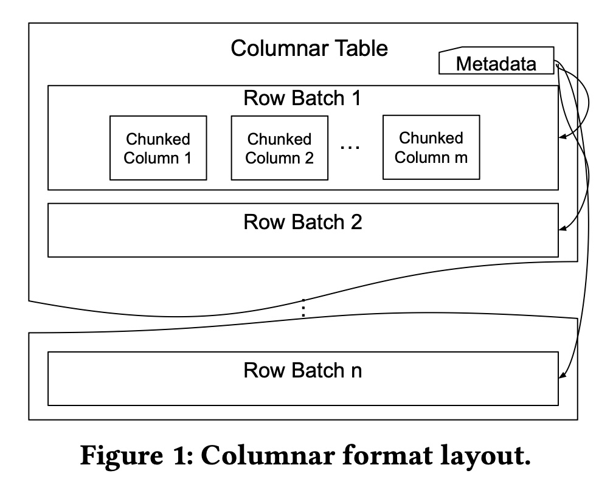
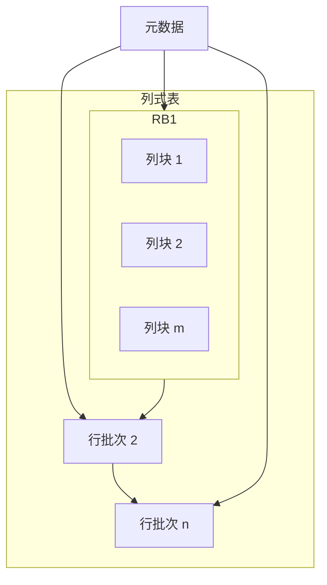
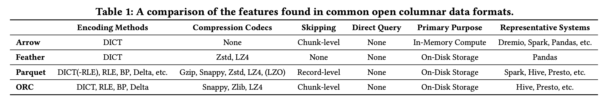
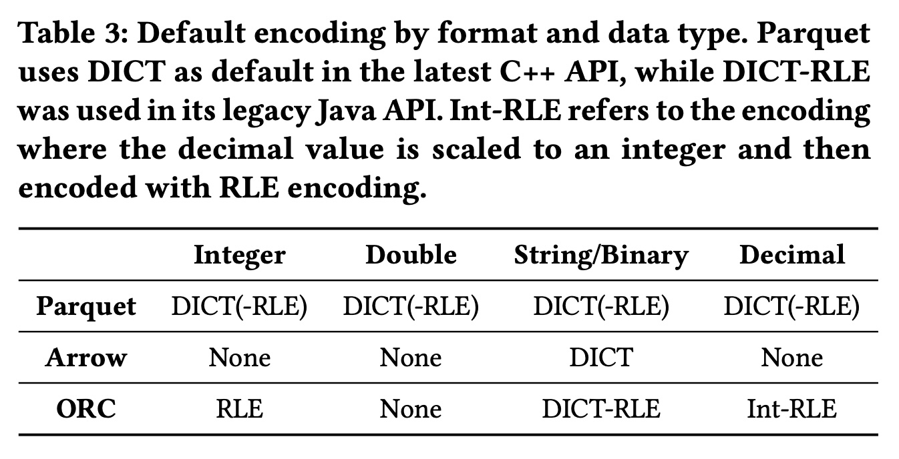
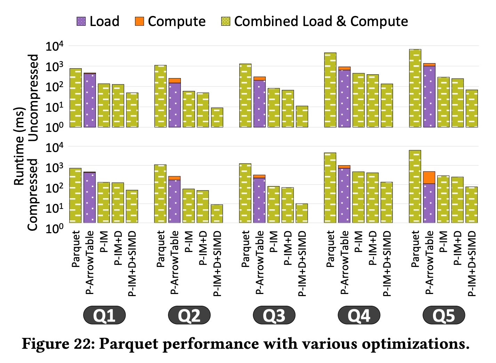
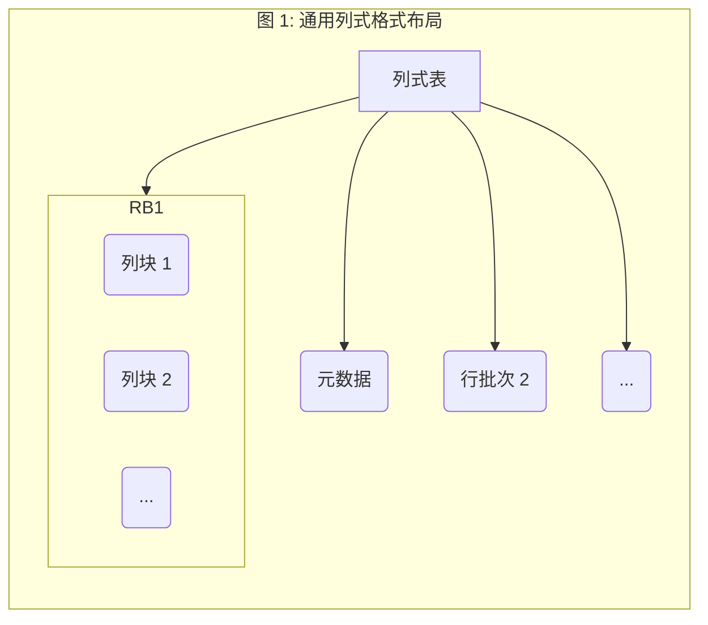
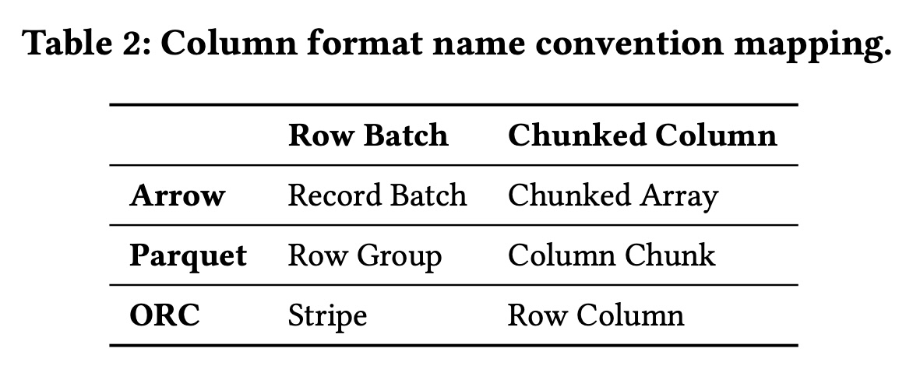

## AI论文解读 | A Deep Dive into Common Open Formats for Analytical DBMSs
        
### 作者        
digoal        
        
### 日期        
2025-11-07        
        
### 标签        
PostgreSQL , PolarDB , DuckDB , AI , 论文解读        
        
----        
        
## 背景  
      
https://github.com/lonng/db-papers/blob/main/papers/formats/a-deep-dive-into-common-open-formats-for-analytical-dbmss.pdf        
  
提示:          
```          
读懂《A Deep Dive into Common Open Formats for Analytical DBMSs》这篇论文需要提前掌握哪些基础知识, 请使用中文通熟易懂的讲解这些基础知识, 可以引用论文中的图、表或使用Markdown支持的图形(text,mermaid等)增加解释性. 
  
使用中文通熟易懂的解读《A Deep Dive into Common Open Formats for Analytical DBMSs》这篇论文, 其中的关键内容请着重讲解, 可以引用论文中的图、表或使用Markdown支持的图形(text,mermaid等)增加解释性. 
  
提取《A Deep Dive into Common Open Formats for Analytical DBMSs》这篇论文中的重要术语, 使用中文对这些术语进行通熟易懂的讲解, 可以引用论文中的图、表或使用Markdown支持的图形(text,mermaid等)增加解释性. 
```     
  
## 1 前置知识 
  
理解这篇论文确实需要一些数据库和数据系统的“内功”。这篇论文不是一篇入门读物，它更像是一场“华山论剑”，默认读者已经是了解各大门派武功（基础知识）的“高手”。

别担心，我来为你“翻译”一下看懂这场对决所需要的基础知识，让你能看懂这三位“大师”（Arrow, Parquet, ORC）到底在比什么。

-----

### 1\. 核心战场：OLAP vs. OLTP (为什么需要这些格式？)

首先，你得知道数据库分两大类：

  * **OLTP (在线事务处理):** 就像你的微信支付、淘宝下单。它关注的是“增、删、改” 。特点是：
      * 快进快出，一次只操作几行数据。
      * 传统上使用“**行式存储**” (Row-Oriented)，一行数据（比如张三的订单）的所有信息都存在一起，方便快速修改。
  * **OLAP (在线分析处理):** 就像老板看这个季度的销售报表。它关注的是“**查**” 。特点是：
      * 一次要扫描海量数据（比如几亿条销售记录）。
      * 只关心少数几列（比如“销售额”和“日期”，不关心“买家昵称”）。
      * 几乎不修改数据。

这篇论文讨论的 **Arrow, Parquet, 和 ORC**  都是为 **OLAP** 场景设计的。

### 2\. 核心武功：列式存储 (Columnar Storage)

这是理解全文的**最最最重要**的基础。

OLAP 查询只关心少数几列，如果还用“行存储”，就得把整张表（包括不需要的列）都读到内存里，太浪费了。

**列式存储 (Columnar Storage)** 彻底改变了玩法：它把同一列的数据连续存在一起 。

我用一个图来解释：

**一张表：**
| ID | 姓名 | 部门 | 薪水 |
|:---|:---|:---|:---|
| 1 | 张三 | 销售 | 8000 |
| 2 | 李四 | 研发 | 15000 |
| 3 | 王五 | 销售 | 8500 |

**行存储 (OLTP 常用)：**

> `[1, 张三, 销售, 8000] [2, 李四, 研发, 15000] [3, 王五, 销售, 8500]`

**列存储 (OLAP 常用) ：**

> `[1, 2, 3] [张三, 李四, 王五] [销售, 研发, 销售] [8000, 15000, 8500]`

**好处是什么？**

1.  **I/O 优势：** 如果你只想统计“总薪水”，系统**只需要读取“薪水”那一列**，I/O 开销大大降低。
2.  **压缩优势：** 同一列的数据类型相同，特征相似（比如“部门”列就只有“销售”和“研发”两种值），非常容易被压缩 。

这篇论文的 Figure 1  展示的就是一个通用的列式格式布局，它把数据先水平切成“行批次 (Row Batch)”，然后在批次内再垂直切成“列块 (Chunked Column)” 。    



### 3\. 内功心法：编码 (Encoding) vs. 压缩 (Compression)

这是论文的第2节 ，也是一个关键区别。两者都为了“省空间”，但手段完全不同。

  * **压缩 (Compression):** 像 Gzip, Snappy, Zstd 。
      * **原理：** 把它当成一个“黑盒”字节流 ，用通用的算法（比如哈夫曼编码）去减少冗余。
      * **缺点：** 你必须**先解压整个数据块**，才能读取里面的内容 。就像你必须解压整个 ZIP 包才能拿到里面的 Word 文档。
  * **编码 (Encoding):** 像字典, RLE, 位打包 (Bit-Packing) 。
      * **原理：** 它是“有损”的（从数据特征出发），用一种更高效的“暗号”来表示数据。
      * **优点：** 数据库“看得懂”这个暗号，**可以直接在编码（暗号）上执行查询** ，避免了解码 。

**论文中提到的几种核心编码 (Section 2.2)：**

1.  **字典编码 (DICT):**

      * **原理：** 适用于“部门”这种只有几个不同值的列（学术上叫“低基数”） 。
      * **暗号：** 建立一个字典：`{0: "销售", 1: "研发"}`。
      * **原文：** `[销售, 研发, 销售]`
      * **编码后：** `[0, 1, 0]` (用更小的整数代替了字符串) 。

2.  **游程编码 / 运行长度编码 (RLE):**

      * **原理：** 适用于有大量连续重复值的列（比如排序后的数据） 。
      * **原文：** `[A, A, A, A, A, B, B, C, C, C]`
      * **编码后：** `[(A, 5), (B, 2), (C, 3)]` (用“值+重复次数”代替) 。

3.  **位打包 (Bit-Packed):**

      * **原理：** 适用于数值。比如有一列数字，最大值是 1000。1000 用 10 个 bit 就能存下，但电脑默认会用 32 bit 或 64 bit 的整数来存它，前面全是 0，很浪费。位打包就是把这些多余的 0 去掉 。

**Table 1  和 Table 3  就对比了三大格式分别支持哪些编码和压缩。**

  

  

### 4\. 核心矛盾：On-Disk (磁盘) vs. In-Memory (内存)

这是论文引言 (Section 1) 中提出的核心冲突。

  * **On-Disk 格式 (如 Parquet, ORC):**
      * **目标：** 极致压缩，省硬盘空间，减少 I/O 。
      * **特点：** 使用了上面说的各种复杂编码 (Encoding) 。
      * **问题：** CPU 没法直接在这些“暗号”（编码）上计算 。
  * **In-Memory 格式 (如 Arrow):**
      * **目标：** 极致的计算速度 。
      * **特点：** **默认不编码** 。数据在内存里就是“所见即所得”的原始值，CPU (特别是 SIMD 向量化指令) 可以直接开足马力计算 。
      * **问题：** 因为不编码，所以它占用的内存空间非常大 。

**这就导致了当今系统的典型“分裂”：**
数据在硬盘上存为 Parquet/ORC -\> 查询时 -\> CPU 拼命 **(1) 解压** -\> CPU 拼命 **(2) 解码** -\> 转换成 Arrow 格式 -\> CPU 才开始 **(3) 真正计算**。

这个“解码和转换” (论文中叫 **Transcoding** ) 的过程，就是这篇论文想要优化的核心瓶颈。

### 5\. 评价指标：如何衡量“武功”高低？ (论文 4-8 节)

当你有了以上基础，你就能看懂论文到底在测什么了：

1.  **压缩率 (Compression Ratio) (第 5.1 节):** 谁占的硬盘最小？(剧透：Parquet 赢) 。
2.  **转码吞吐量 (Transcoding Throughput) (第 5.2 节):** 谁从“磁盘形态”变成“内存形态”最快？(剧透：Arrow Feather 赢，因为它本来就没怎么编码) 。
3.  **投影 (Projection) (第 6.1 节):** 执行 `SELECT col_A, col_B` 这种“选列”操作谁快？
4.  **谓词/过滤 (Predicate) (第 6.2 节):** 执行 `WHERE col_A > 10` 这种“过滤”操作谁快？
5.  **数据跳过 (Skipping) (第 6.2.3 节):** 能否利用元数据（比如每个数据块的 min/max 值）直接跳过（不读）无关的数据块？
6.  **高级优化 (第 8 节):**
      * **直接查询 (Direct Querying):** 能否在“编码”上直接查询，省掉解码？
      * **向量化 (Vectorized Execution / SIMD):** 能否利用 CPU 的“批处理”指令（SIMD）一次性计算多个数据？

-----

**总结一下，你需要的基础知识：**

  * **OLAP (分析) vs. OLTP (事务)**： 决定了你为什么需要列存储。
  * **列式存储 (Columnar Storage)**： 决定了数据的物理布局。
  * **编码 (Encoding) vs. 压缩 (Compression)**： 决定了数据如何被“变小”。(尤其是 RLE 和 Dictionary 编码)。
  * **磁盘 (On-Disk) vs. 内存 (In-Memory) 格式**： 决定了数据“形态”的冲突，这也是论文的核心矛盾。

有了这些知识，你就能理解论文的精髓了：它在评判 Arrow, Parquet, 和 ORC，看谁最有潜力成为一种“统一的”格式，既能在磁盘上存得小，又能在内存里算得快，从而消除昂贵的“转码”成本 。
  
## 2 解读论文 
  
这是一篇非常出色的论文，它深入比较了当今分析型数据库（OLAP）领域最核心的三种开放数据格式：**Apache Arrow、Parquet 和 ORC** 。

如果你正在构建或选择数据系统（例如数据仓库、数据湖），这篇论文的结论至关重要。我来为你用最通俗易懂的方式解读一下。

### 🚀 论文的核心：我们能用一个格式通吃“内存”和“硬盘”吗？

在现代数据分析系统中，我们通常“分裂”地使用数据格式：

1.  **磁盘存储（On-Disk）：** 为了节省空间和I/O，我们使用像 **Parquet**  或 **ORC**  这样的列式存储格式。它们压缩率高，适合长期存放在数据湖中。
2.  **内存计算（In-Memory）：** 当需要查询时，系统会把数据从 Parquet/ORC 文件中读取出来，转换（解码）成 **Arrow** 格式 。Arrow 是目前内存计算的“事实标准”，因为它无需解码、支持零拷贝读取，非常适合高速计算 。

**这篇论文的核心问题是：** 这种“读取-解码-转换”的流程太浪费了。我们能不能干脆只用一种格式？比如，直接用 Arrow 存硬盘？或者，直接在 Parquet 格式上做计算？

---

### 🎯 三大主角的核心矛盾

论文指出了这三种格式的“天生缺陷”：

* **Apache Arrow：** 它是为内存计算而生的 。它的默认设计是**不编码**的 ，以便CPU能直接访问。但“不编码”意味着如果直接把它存到硬盘上，它会**极其巨大**。
* **Apache Parquet：** 它是为磁盘存储而生的 。它有非常出色的编码和压缩（如字典编码、RLE）。但它**没有配套的内存格式** 。你必须把它解码成别的格式（比如Arrow）才能计算。
* **Apache ORC：** 它看起来两全其美。它既是高效的磁盘格式（像Parquet），**又提供了一个关联的内存表示**（`ColumnVectorBatch`）。但现实是，Arrow 和 Parquet 在开源社区的活跃度和采用率上更胜一筹 。

论文通过一系列实验，对这三者进行了全方位的“体检”。

---

### 📊 关键对决：实验核心发现

论文从压缩、读写、查询等多个维度进行了评测。

#### 1. 压缩与转码 (第5节)

**🥇 压缩率冠军：Parquet**
Parquet 拥有最强的综合压缩能力，能把数据压到原始大小的约 **13%** 。ORC 其次 (27%) 。

**🤯 关键发现：默认的 Arrow 存盘是个“灾难”**
如果使用默认设置（不开启字典编码），Arrow (Feather) 存盘后的体积竟然比原始的CSV文本文件还**大 7%** ！这是因为它为了内存对齐会进行数据填充 (padding)，并且有很多元数据开销 。

**🥇 读写速度冠军：Arrow Feather**
* **写入（压缩）速度：** Arrow Feather 最快 。因为它“偷懒”了，默认不做编码，所以写入最快。
* **读取（解压）速度：** Arrow Feather 也最快 。这符合它的设计初衷，从磁盘加载到内存几乎是“零成本反序列化” 。而 Parquet 和 ORC 慢在需要CPU进行“解码” 。

#### 2. 数据访问 (第6节)

这是最关键的对比，模拟真实查询。

**🥇 投影（`SELECT` 列）：没有全能冠军**
* **读整数：** **ORC** 最快（它默认用RLE编码，很高效）。
* **读浮点数：** **Parquet** 最快（它默认用字典编码）。
* **读字符串：** **Arrow Feather** 最快（因为它不需要解码）。

**🤯 关键发现：Arrow 的 API 是个“大坑”**
当执行 `SELECT a_column FROM table` 这样的投影查询时，Arrow Feather 的 API **必须读取并解析整个行批次（Row Batch）的所有列**，然后再丢掉不需要的列 。而 ORC 可以只读取它需要的那一列，因此在细粒度读取上远胜 Arrow 。

**🥇 过滤（`WHERE` 条件）：ORC 胜出**
* **数值过滤：** **ORC** 总体胜出 。
* **低选择率（只捞几条数据）：** **Parquet** 在极低选择率（如 <0.01%）时表现最好 ，因为它支持细粒度的“记录级数据跳过” (record level skipping) 。
* **大部分情况：** **ORC** 胜出。它在内存中有专用的数据结构，加载效率高 。

#### 3. 综合查询对决 (第7节)

论文测试了5个TPC-DS的“查询片段”（Select + Project）。

**🏆 总冠军：ORC**
在“开箱即用”的对比中，**ORC 表现最好** 。
* **核心原因 1：** 它有高效的内存映射表示 。
* **核心原因 2：** 它的数据粒度更细。例如，`catalog_sales` 表在 ORC 中被分成了 **14,064** 个批次，而在 Arrow 中只有 **228** 个 。更细的粒度意味着 ORC 在过滤时可以跳过更多不相关的数据块 。

**Arrow 再次暴露了它的短板：** 加载和解析数据的开销太大了，拖累了整体查询时间 。

---

### 🚀 终极优化：论文最有价值的探索 (第8节)

论文作者没有止步于对比，他们提出了“魔改”方案，这揭示了未来的方向。

#### 1. “魔改” Arrow
作者给 Arrow 加上了“**直接查询**” (Direct Querying) 能力，即在 Arrow 的字典编码（整数）上直接执行过滤，而不是先解码成字符串再过滤 。
* **结果：** 获得了 **2到4倍** 的性能提升 ，甚至击败了 Arrow 官方的 Gandiva 编译器 。

#### 2. “魔改” Parquet（本文最重要的结论）
Parquet 最大的问题是“只有磁盘格式，没有内存格式”。作者们为 Parquet 实现了
一个高效的“**内存中 (In-Memory) 表示**” 。

然后，他们对比了不同执行方式的性能（参见论文图22）：    
1.  **Baseline (Parquet Streaming)：** 🐢 (巨慢)
2.  **Parquet -> ArrowTable (先转成Arrow)：** 🚶 (主流用法，但很慢) 
3.  **P-IM (Parquet In-Memory)：** 🏃 (快了 10 倍以上) 。通过“惰性物化” (lazy materialization)，避免了不必要的解码开销。
4.  **P-IM + Direct Query (在编码上查询)：** 🚗 (超级快，快了 60 倍) 。
5.  **P-IM + DQ + SIMD (使用向量化指令)：** 🚀 (终极形态，快了 100 倍) 。

**这个结果极其震撼：** 它证明了，**Parquet 根本不需要 Arrow**。如果 Parquet 能有一个专门为它设计的、能理解其编码的内存格式，它的性能潜力是无穷的 。

---

### 💡 总结与启示

这篇论文的最终结论是：

1.  **没有银弹：** Arrow、Parquet、ORC 三个格式开箱即用时，各有优劣。ORC 在综合查询上表现最好 ，Parquet 压缩最强 ，Arrow 原始扫描最快 。
2.  **Arrow 的局限：** 默认的 Arrow 不适合存盘（太大），且其 IO API 设计不佳（无法按列读取）。
3.  **真正的未来：** 别再搞“内存一套、硬盘一套”了。我们需要的是一个 **“统一的内存和磁盘数据表示”** 。
4.  **最佳路径：** 这篇论文的实验（特别是对 Parquet 的魔改）指明了方向——未来的系统应该**将查询计算“下推”到编码域** ，并为磁盘格式（如 Parquet）设计一个能充分利用其编码特性的、统一的内存表示。

简单来说，不要再“读取-解码-计算”了，未来的方向是“**在压缩/编码的数据上直接计算**”。

希望这个解读对你有帮助！你是否想了解更多关于“直接查询”（Direct Querying）或“SIMD 向量化”是如何在编码数据上工作的？
   
## 3 术语 
  
好的，这篇论文技术性很强，理解这些关键术语是读懂全文的基础。我来为你提取并用通俗易懂的中文讲解，并严格按照论文内容进行标注。

-----

### 核心术语讲解

#### 1\. 列式格式 (Columnar Format)

  * **讲解：** 这是理解本文所有内容的基础。想象一下 Excel 表格，我们有两种存储方式：
      * **行存储：** 一行一行地存 `(张三, 销售部, 8000)`, `(李四, 研发部, 15000)`。
      * **列存储：** 一列一列地存 `(张三, 李四)`, `(销售部, 研发部)`, `(8000, 15000)`。
  * **为什么重要：** 分析型查询（OLAP）通常只关心少数几列（比如“总薪水”）。列式存储使数据库只需读取“薪水”这一列的数据，而不用读取“姓名”和“部门”，大大提升了效率 。同时，同一列的数据类型相同（都是数字或都是字符串），非常容易被压缩（编码） 。
  * **论文图示 (Figure 1)：** 论文中的图1就展示了一个通用的列式布局，它先把数据水平切成“行批次 (Row Batch)”，然后在批次内部再垂直切成“列块 (Chunked Column)” 。    




#### 2\. 编码 (Encoding) vs. 压缩 (Compression)

这两个词经常被混用，但这篇论文严格区分了它们，这个区别至关重要。

  * **压缩 (Compression):**

      * **讲解：** 指的是通用的、面向字节的压缩算法，例如 Gzip , Snappy , Zstd  等。它们把数据当作一串无意义的字节流来处理 。
      * **缺点：** 你必须**先把整个数据块解压**，才能访问里面的某一个值 。这对于查询很不友好。

  * **编码 (Encoding):**

      * **讲解：** 论文称之为“轻量级压缩” (lightweight compression) 。它特指那些**理解数据类型**的压缩方法 。
      * **优点：** 编码后的数据仍然保留了结构信息，因此系统可以直接在编码数据上进行查询（即“直接查询”）或跳过无关数据（即“数据跳过”），而无需完全解码 。
      * **例子：** 论文中重点讨论了字典编码 (DICT) 、游程编码 (RLE)  和位打包 (BP) 。

#### 3\. 字典编码 (Dictionary Encoding / DICT)

  * **讲解：** 一种非常核心的编码方式。如果某一列（比如“部门”）只有“销售部”、“研发部”、“市场部”这 3 个不重复的值，字典编码就会建立一个字典：`{0: "销售部", 1: "研发部", 2: "市场部"}`。
  * **如何工作：** 它用一个整数键来编码每个不同的条目 。原来存储 `["销售部", "研发部", "销售部", ...]` 的列，现在只需要存储 `[0, 1, 0, ...]` 这一串数字 。
  * **适用场景：** 当一列中不重复的值很少（即低基数），且重复次数很多时，效果最好 。

#### 4\. 游程编码 (Run-Length Encoding / RLE)

  * **讲解：** 另一种非常简单的编码。如果数据中包含**连续**的重复值，比如 `[A, A, A, A, B, B, B, C, A, A]`。
  * **如何工作：** RLE 会把连续的重复值替换为 `(值, 重复次数)` 的组合 。上面的例子会被编码为 `[(A, 4), (B, 3), (C, 1), (A, 2)]`。
  * **适用场景：** 适用于数据中包含大量**连续**重复值的场景 。

#### 5\. 转码 (Transcoding)

  * **讲解：** 这是论文的核心痛点之一。数据在硬盘上（On-Disk）是一种格式（如 Parquet），但在内存中（In-Memory）计算时又需要转换成另一种格式（如 Arrow）。
  * **定义：** 论文将这个“（反）序列化和（解）压缩数据，使其在磁盘表示和内存表示之间来回转换”的过程，称为“转码” (Transcoding) 。
  * **为什么重要：** 这个转换过程非常耗时，会占用大量 CPU 资源 。论文的第 5.2 节  专门评测了 Parquet 和 ORC 转换为内存中 Arrow 格式的开销 。

#### 6\. 核心格式的“别名” (Table 2)

论文为了方便对比，统一了术语 。理解这张表对读懂论文的图表至关重要。    

> **表 2：列格式命名约定映射**

| 论文统一术语 | **Arrow** | **Parquet** | **ORC** |
|:---|:---|:---|:---|
| **Row Batch (行批次)** | Record Batch | Row Group | Stripe |
| **Chunked Column (列块)** | Chunked Array | Column Chunk | Row Column |

  * **讲解：** 当你看到论文说“行批次 (Row Batch)”时，你要知道它在 Parquet 里叫“Row Group”，在 ORC 里叫“Stripe” 。

#### 7\. 数据跳过 (Data Skipping)

  * **讲解：** 这是一种查询优化技术。比如你查询 `WHERE age > 40`，而某个数据块（Row Batch）的元数据显示它只包含 20-30 岁的数据。
  * **如何工作：** DBMS 可以利用这些元数据（如 Parquet 的“Zone Maps”  或 ORC 的索引 ） **跳过**读取和解压这个数据块，因为它知道里面肯定没有你需要的数据 。
  * **适用格式：** Parquet 和 ORC 都支持这种技术 。

#### 8\. 直接查询 (Direct Querying)

  * **讲解：** 这是编码（Encoding）带来的最大好处。它允许数据库**直接在编码/压缩的数据上执行查询**，而不需要先花大力气把它们解码成原始值 。
  * **例子：** 论文在第 8.1.1 节  演示了一个优化：对于字典编码的字符串列，它们修改了 Arrow，使其可以直接在整数键上进行过滤（`整数比较`），而不是先解码成字符串再过滤（`字符串比较`）。

#### 9\. 向量化执行 (Vectorized Execution / SIMD)

  * **讲解：** 这是一种现代 CPU 的高级技术。CPU 可以使用一种叫 SIMD (Single Instruction, Multiple Data) 的指令，好比你用一个印章（一条指令）一次性在多张纸（多个数据）上盖章，而不是一张一张地盖。
  * **为什么重要：** 这种技术能极大提升计算速度 。论文在第 8.2.1 节  探讨了如何将这种技术应用于 Parquet 的编码数据上 ，并在第 8.2.2 节  取得了最高 100 倍的性能提升 。
  
## 参考        
         
https://github.com/lonng/db-papers/blob/main/papers/formats/a-deep-dive-into-common-open-formats-for-analytical-dbmss.pdf    
        
<b> 以上内容基于DeepSeek、Qwen、Gemini及诸多AI生成, 轻微人工调整, 感谢杭州深度求索人工智能、阿里云、Google等公司. </b>        
        
<b> AI 生成的内容请自行辨别正确性, 当然也多了些许踩坑的乐趣, 毕竟冒险是每个男人的天性.  </b>        
    
#### [PolarDB 学习图谱](https://www.aliyun.com/database/openpolardb/activity "8642f60e04ed0c814bf9cb9677976bd4")
  
  
#### [PostgreSQL 解决方案集合](../201706/20170601_02.md "40cff096e9ed7122c512b35d8561d9c8")
  
  
#### [德哥 / digoal's Github - 公益是一辈子的事.](https://github.com/digoal/blog/blob/master/README.md "22709685feb7cab07d30f30387f0a9ae")
  
  
#### [About 德哥](https://github.com/digoal/blog/blob/master/me/readme.md "a37735981e7704886ffd590565582dd0")
  
  

  
