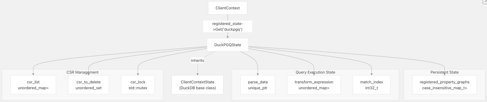
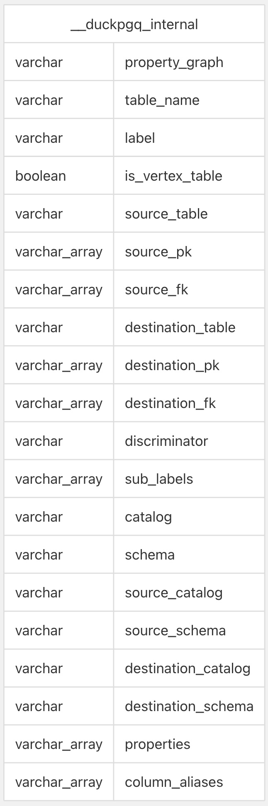
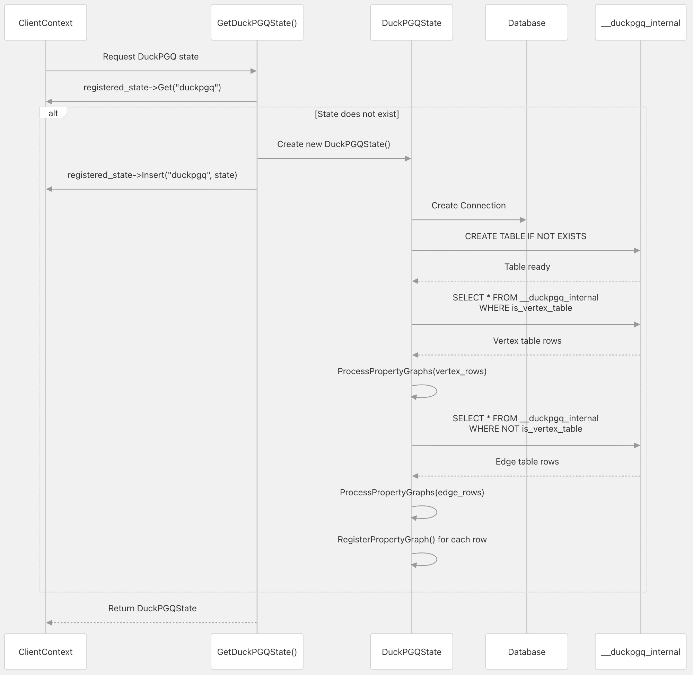
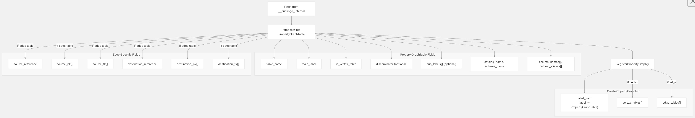
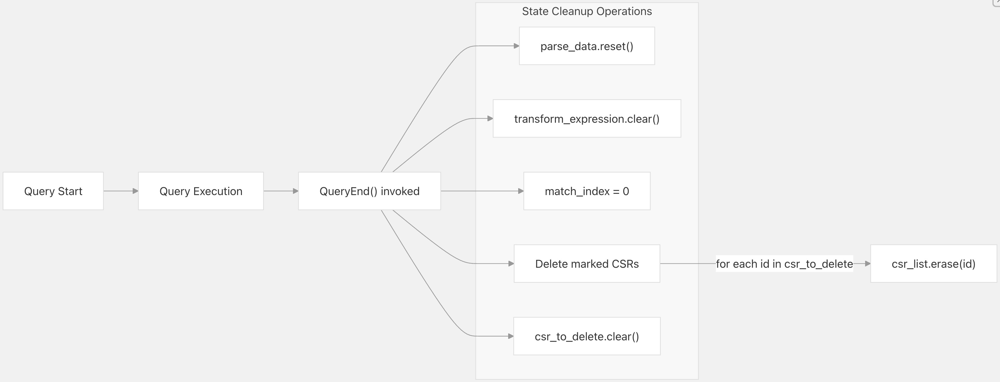
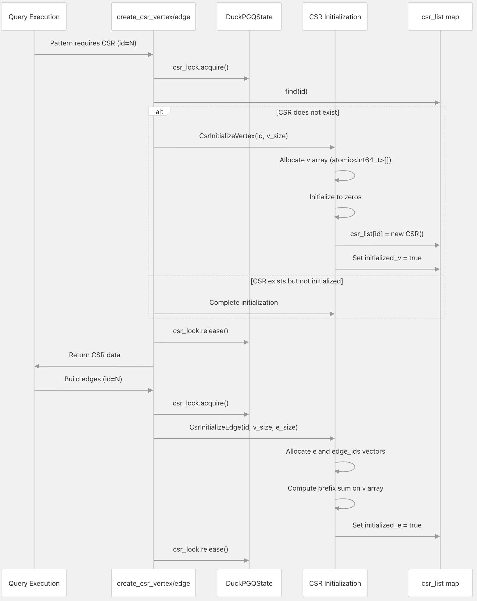
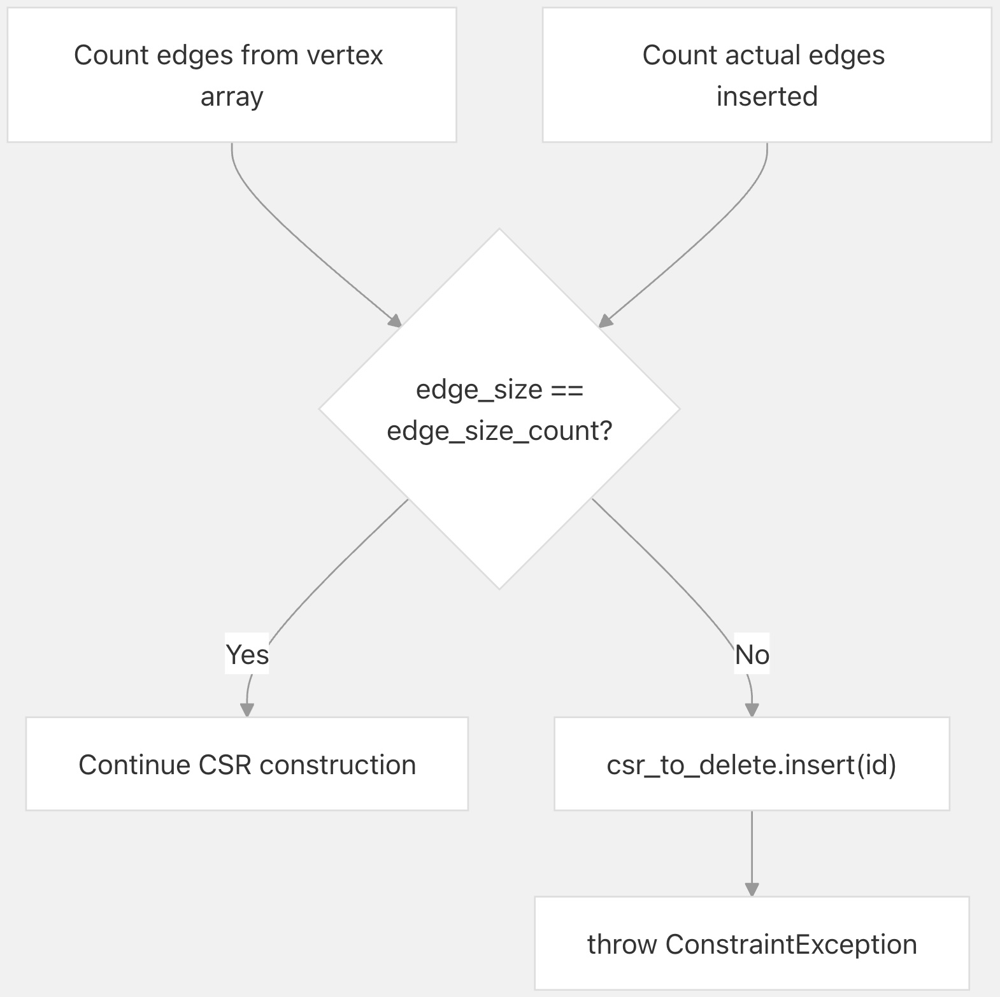
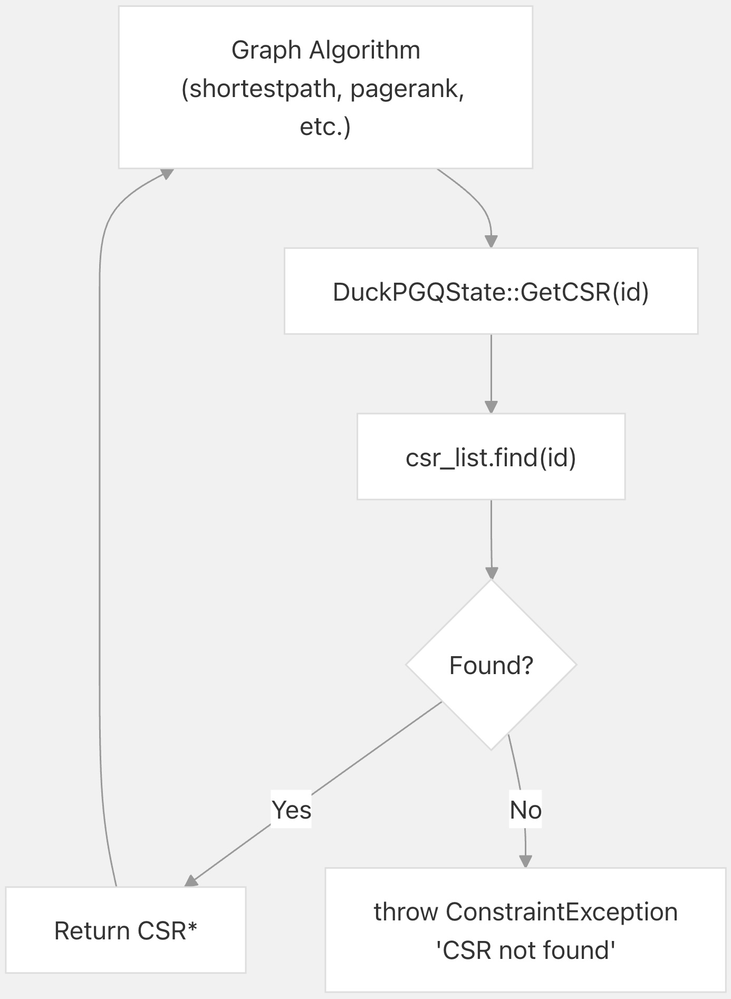
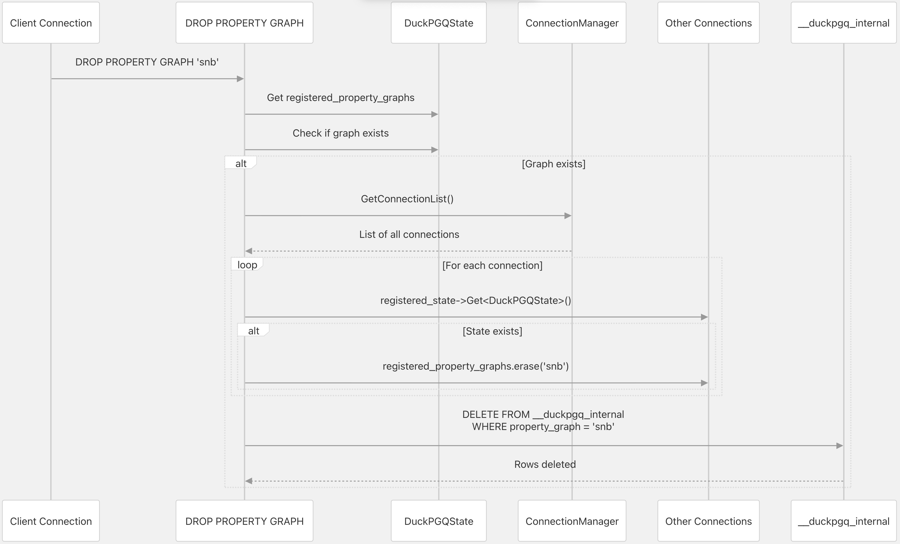

## DuckPGQ 源码学习: 2.4 状态管理 (State Management)  
                                      
### 作者                                      
digoal                                      
                                      
### 日期                                      
2025-11-08                                      
                                      
### 标签                                      
DuckDB , PGQ , 属性图 , DuckPGQ , 源码学习                                      
                                      
----                 
                                      
## 背景   
本文档解释了 **DuckPGQ** 如何通过 `DuckPGQState` 类、`__duckpgq_internal` **元数据表 (metadata table)** 以及 **CSR (Compressed Sparse Row)** **数据结构 (data structures)** 来管理其 **运行时状态 (runtime state)** 和 **持久化状态 (persistent state)**。  
  
## DuckPGQState 架构 (Architecture)  
  
`DuckPGQState` 类是 DuckPGQ 的中央**状态容器 (state container)**，用于维护 **持久的属性图定义 (persistent property graph definitions)** 和 **临时的查询执行状态 (ephemeral query execution state)**。它继承自 `ClientContextState`，确保每个数据库连接都有自己**隔离的状态实例 (isolated state instance)**。  
  
  
  
**DuckPGQState 字段 (Fields)**  
  
| 字段 (Field) | 类型 (Type) | 目的 (Purpose) |  
| :--- | :--- | :--- |  
| `registered_property_graphs` | `case_insensitive_map_t<unique_ptr<CreateInfo>>` | 存储连接的所有**属性图定义 (property graph definitions)** |  
| `parse_data` | `unique_ptr<ParserExtensionParseData>` | 在**查询处理 (query processing)** 期间保存**解析后的语句信息 (parsed statement information)** |  
| `transform_expression` | `unordered_map<int32_t, unique_ptr<ParsedExpression>>` | 将**表达式 ID (expression IDs)** 映射到**转换后的表达式 (transformed expressions)** |  
| `match_index` | `int32_t` | 用于生成**唯一模式匹配标识符 (unique pattern match identifiers)** 的计数器 |  
| `csr_list` | `unordered_map<int32_t, unique_ptr<CSR>>` | 按**唯一 ID (unique ID)** 索引的**活动 CSR 结构 (Active CSR structures)** |  
| `csr_to_delete` | `unordered_set<int32_t>` | 标记为**延迟删除 (deferred deletion)** 的 CSR ID |  
| `csr_lock` | `std::mutex` | **同步 (Synchronizes)** 并发 CSR 的创建和访问 |  
  
来源: [`src/include/duckpgq_state.hpp` 10-37](https://github.com/cwida/duckpgq-extension/blob/db304f58/src/include/duckpgq_state.hpp#L10-L37)  
  
## 持久化元数据存储 (Persistent Metadata Storage)  
  
**属性图定义 (Property graph definitions)** 通过 `__duckpgq_internal` **表 (table)** 在**数据库会话 (database sessions)** 中**持久化 (persist)**。这个**系统表 (system table)** 存储了所有已注册属性图的**完整模式 (complete schema)**，包括**顶点表 (vertex tables)**、**边表 (edge tables)**、**标签映射 (label mappings)** 和**列规范 (column specifications)**。  
  
### 内部表模式 (Internal Table Schema)  
  
当 DuckPGQ **状态 (state)** 首次**初始化 (initialized)** 时，`__duckpgq_internal` 表会自动创建。其**模式 (schema)** 捕获了**重建 (reconstruct)** 属性图定义所需的所有信息：  
  
  
  
**模式列 (Schema Columns)**  
  
| 列 (Column) | 目的 (Purpose) |  
| :--- | :--- |  
| `property_graph` | 此条目所属的**属性图 (property graph)** 名称 |  
| `table_name` | **底层关系表 (underlying relational table)** 的名称 |  
| `label` | 此顶点或**边表 (edge table)** 的**主标签 (Primary label)** |  
| `is_vertex_table` | **布尔值 (Boolean)**，用于区分**顶点表 (vertex tables)** 和**边表 (edge tables)** |  
| `source_table`, `source_pk`, `source_fk` | **边表 (Edge table)** **源顶点引用 (source vertex reference)**（**外键映射 (foreign key mapping)**） |  
| `destination_table`, `destination_pk`, `destination_fk` | **边表 (Edge table)** **目标顶点引用 (destination vertex reference)**（**外键映射 (foreign key mapping)**） |  
| `discriminator` | 用于**标签鉴别 (label discrimination)** 的列（如果存在） |  
| `sub_labels` | 使用**鉴别器 (discriminators)** 时的**附加标签数组 (Array of additional labels)** |  
| `catalog`, `schema` | **表 (table)** 所在的 **目录 (Catalog)** 和 **模式 (schema)** |  
| `source_catalog`, `source_schema` | **源顶点表 (source vertex table)** 的 **目录 (Catalog)** 和 **模式 (schema)** |  
| `destination_catalog`, `destination_schema` | **目标顶点表 (destination vertex table)** 的 **目录 (Catalog)** 和 **模式 (schema)** |  
| `properties` | 要**公开 (expose)** 的**属性列 (property columns)** 的**显式列表 (Explicit list)**（如果不是所有列） |  
| `column_aliases` | **属性列 (property columns)** 的**别名 (Alternative names)** |  
  
该表是在 `InitializeInternalTable()` 中使用此 **SQL 语句 (SQL statement)** 创建的：  
  
来源: [`src/duckpgq_state.cpp` 5-32](https://github.com/cwida/duckpgq-extension/blob/db304f58/src/duckpgq_state.cpp#L5-L32)  
  
### 状态初始化序列 (State Initialization Sequence)  
  
当一个**连接 (connection)** 首次访问 DuckPGQ **功能 (functionality)** 时，**状态初始化过程 (state initialization process)** 会创建**内部表 (internal table)** 并**加载 (loads)** 现有的**属性图定义 (property graph definitions)**：  
  
  
  
**初始化 (initialization)** 遵循以下步骤：  
  
1.  **状态查找 (State Lookup)**: `GetDuckPGQState()` 检查 `context.registered_state` 中是否已存在**状态 (state)**  
2.  **状态创建 (State Creation)**: 如果未找到，则创建新的 `DuckPGQState` **实例 (instance)** 并将其插入**上下文 (context)**  
3.  **表创建 (Table Creation)**: 调用 `InitializeInternalTable()` 以确保 `__duckpgq_internal` 存在  
4.  **图检索 (Graph Retrieval)**: 调用 `RetrievePropertyGraphs()` 以**加载 (load)** **持久化定义 (persisted definitions)**  
5.  **顶点处理 (Vertex Processing)**: **查询 (Queries)** 并**处理 (processes)** 所有**顶点表 (vertex table)** 条目  
6.  **边处理 (Edge Processing)**: **查询 (Queries)** 并**处理 (processes)** 所有**边表 (edge table)** 条目（由于**外键引用 (foreign key references)**，必须在顶点之后）  
7.  **注册 (Registration)**: 每个**表 (table)** 都使用**标签映射 (label mappings)** 注册到 `registered_property_graphs` **映射 (map)** 中  
  
来源: [`src/core/utils/duckpgq_utils.cpp` 16-30](https://github.com/cwida/duckpgq-extension/blob/db304f58/src/core/utils/duckpgq_utils.cpp#L16-L30) [`src/duckpgq_state.cpp` 34-42](https://github.com/cwida/duckpgq-extension/blob/db304f58/src/duckpgq_state.cpp#L34-L42) [`src/duckpgq_state.cpp` 44-114](https://github.com/cwida/duckpgq-extension/blob/db304f58/src/duckpgq_state.cpp#L44-L114)  
  
### 属性图注册 (Property Graph Registration)  
  
`ProcessPropertyGraphs()` **方法 (method)** **解析 (parses)** 来自 `__duckpgq_internal` 的**行 (rows)** 并**重建 (reconstructs)** `PropertyGraphTable` **对象 (objects)**：  
  
  
  
**注册过程 (The registration process)**：  
  
1.  **提取 (Extracts)** **通用字段 (common fields)**（**表名 (table name)**、**标签 (label)**、**顶点/边标志 (vertex/edge flag)**）  
2.  处理**多标签表 (multi-label tables)** 的**鉴别器 (discriminator)** 和**子标签 (sub-labels)**  
3.  **解析 (Parses)** **目录 (catalog)** 和**模式 (schema)** **限定符 (qualifiers)**（带**默认值 (defaults)**）  
4.  读取**显式属性列 (explicit property columns)** 或**默认 (defaults)** 为所有列  
5.  对于**边表 (edge tables)**，**填充 (populates)** **源/目标外键映射 (source/destination foreign key mappings)**  
6.  在 `registered_property_graphs` 中创建或**更新 (updates)** `CreatePropertyGraphInfo` **条目 (entry)**  
7.  将**主标签 (main label)** 和所有**子标签 (sub-labels)** 映射到 `label_map` 中的**表 (table)**  
8.  **追加 (Appends)** 到适当的列表（`vertex_tables` 或 `edge_tables`）  
  
来源: [`src/duckpgq_state.cpp` 56-113](https://github.com/cwida/duckpgq-extension/blob/db304f58/src/duckpgq_state.cpp#L56-L113) [`src/duckpgq_state.cpp` 116-123](https://github.com/cwida/duckpgq-extension/blob/db304f58/src/duckpgq_state.cpp#L116-L123) [`src/duckpgq_state.cpp` 133-160](https://github.com/cwida/duckpgq-extension/blob/db304f58/src/duckpgq_state.cpp#L133-L160)  
  
## 查询生命周期和状态清理 (Query Lifecycle and State Cleanup)  
  
`DuckPGQState` 类实现了 `QueryEnd()` **生命周期方法 (lifecycle method)**，DuckDB 在**每次查询执行 (query execution)** 结束时会自动调用该方法。这确保了**查询特定状态 (query-specific state)** 的**正确清理 (proper cleanup)**：  
  
  
  
**清理操作 (Cleanup Operations)**  
  
| 操作 (Operation) | 目的 (Purpose) |  
| :--- | :--- |  
| `parse_data.reset()` | **释放 (Releases)** 当前**查询 (query)** 的**解析语句数据 (parsed statement data)** |  
| `transform_expression.clear()` | **清除 (Clears)** **表达式转换缓存 (expression transformation cache)** |  
| `match_index = 0` | 为下一个**查询 (query)** **重置 (Resets)** **模式匹配计数器 (pattern match counter)** |  
| **CSR 删除循环 (CSR deletion loop)** | **移除 (Removes)** 在**查询执行 (query execution)** 期间标记的 CSR **结构 (structures)** |  
| `csr_to_delete.clear()` | **清空 (Empties)** **删除集合 (deletion set)** |  
  
**延迟删除模式 (deferred deletion pattern)** 允许 CSR **结构 (CSRs)** 在**查询执行 (query execution)** 期间保持**可访问 (accessible)**，即使它们已被标记为**清理 (cleanup)**。只有在**查询完成 (query completion)** 时，它们才会被**实际销毁 (actually destroyed)**。  
  
来源: [`src/duckpgq_state.cpp` 162-170](https://github.com/cwida/duckpgq-extension/blob/db304f58/src/duckpgq_state.cpp#L162-L170)  
  
## CSR 生命周期管理 (CSR Lifecycle Management)  
  
CSR **结构 (CSR structures)** 有一个与**查询执行 (query execution)** 相关的**托管生命周期 (managed lifecycle)**。它们在**模式匹配 (pattern matching)** 期间**按需创建 (created on-demand)**，存储在**状态 (state)** 的 `csr_list` 中，并在不再需要时标记为**延迟删除 (deferred deletion)**。  
  
### CSR 创建和存储 (CSR Creation and Storage)  
  
  
  
CSR **初始化 (initialization)** 分为**三个阶段 (three phases)**：  
  
1.  **顶点初始化 (Vertex Initialization)** (`CsrInitializeVertex`):  
      * 为**顶点偏移量 (vertex offsets)** **分配 (Allocates)** **原子整数数组 (atomic integer array)**：`v[v_size + 2]`  
      * 额外的 2 个**元素 (elements)** 为 CSR **算法 (algorithms)** 提供**填充 (padding)**  
      * 将所有**元素 (elements)** **初始化 (Initializes)** 为零  
      * 受用于**线程安全 (thread safety)** 的 `csr_lock` **互斥锁 (mutex)** **保护 (Protected)**  
      * 设置 `initialized_v` **标志 (flag)**  
2.  **边初始化 (Edge Initialization)** (`CsrInitializeEdge`):  
      * 为**边目标 (edge destinations)** **分配 (Allocates)** `e` **向量 (vector)**  
      * 为**边行 ID (edge row IDs)** **分配 (Allocates)** `edge_ids` **向量 (vector)**  
      * 对 `v` **数组 (array)** **计算 (Computes)** **前缀和 (prefix sum)**，将**计数 (counts)** 转换为**偏移量 (offsets)**  
      * 设置 `initialized_e` **标志 (flag)**  
      * **验证 (Validates)** **边计数 (edge count)** 是否与预期的**顶点引用 (vertex references)** 匹配  
3.  **权重初始化 (Weight Initialization)** (`CsrInitializeWeight`，可选):  
      * **分配 (Allocates)** `w` (`INT64`) 或 `w_double` (`DOUBLE`) **向量 (vector)**  
      * 仅在**查询 (query)** 中指定**边权重 (edge weights)** 时**执行 (performed)**  
      * 设置 `initialized_w` **标志 (flag)**  
  
来源: [`src/core/functions/scalar/csr_creation.cpp` 14-41](https://github.com/cwida/duckpgq-extension/blob/db304f58/src/core/functions/scalar/csr_creation.cpp#L14-L41) [`src/core/functions/scalar/csr_creation.cpp` 43-61](https://github.com/cwida/duckpgq-extension/blob/db304f58/src/core/functions/scalar/csr_creation.cpp#L43-L61) [`src/core/functions/scalar/csr_creation.cpp` 63-84](https://github.com/cwida/duckpgq-extension/blob/db304f58/src/core/functions/scalar/csr_creation.cpp#L63-L84)  
  
### CSR 验证和错误处理 (CSR Validation and Error Handling)  
  
在**边初始化 (edge initialization)** 期间，DuckPGQ **验证 (validates)** 所有**边引用 (edge references)** 都指向**现有 (existing)** 且**唯一 (unique)** 的**顶点 (vertices)**：  
  
  
  
如果**验证失败 (validation fails)**（表示**非唯一 (non-unique)** 或**缺失 (missing)** **顶点引用 (vertex references)**），CSR 会立即被标记为**删除 (deletion)**，并抛出 `ConstraintException` **约束异常 (ConstraintException)**，**消息 (message)** 为："Non-existent/non-unique vertices detected. Make sure all vertices referred by edge tables exist and are unique for path-finding queries."（检测到**不存在/非唯一 (Non-existent/non-unique)** 的**顶点 (vertices)**。请确保**边表 (edge tables)** 引用的所有**顶点 (vertices)** 存在且对于**路径查找查询 (path-finding queries)** 是**唯一 (unique)** 的。）  
  
来源: [`src/core/functions/scalar/csr_creation.cpp` 112-125](https://github.com/cwida/duckpgq-extension/blob/db304f58/src/core/functions/scalar/csr_creation.cpp#L112-L125) [`test/sql/path_finding/non-unique-vertices.test` 1-86](https://github.com/cwida/duckpgq-extension/blob/db304f58/test/sql/path_finding/non-unique-vertices.test#L1-L86)  
  
### CSR 访问和使用 (CSR Access and Usage)  
  
**图算法 (Graph algorithms)** 通过**状态 (state)** 的 `GetCSR()` **方法 (method)** **访问 (access)** CSR **结构 (structures)**：  
  
该**方法 (method)** 执行带有**错误检查 (error checking)** 的**简单查找 (simple lookup)**：  
  
  
  
  * 在 `csr_list` 中**搜索 (Searches)** 给定的 CSR ID  
  * 如果未找到 ID，则抛出 `ConstraintException` **约束异常 (ConstraintException)**  
  * 返回 CSR **结构 (structure)** 的**原始指针 (raw pointer)** 供**算法 (algorithm)** 使用  
  
来源: [`src/duckpgq_state.cpp` 180-186](https://github.com/cwida/duckpgq-extension/blob/db304f58/src/duckpgq_state.cpp#L180-L186)  
  
## 跨连接状态同步 (Cross-Connection State Synchronization)  
  
DuckPGQ 通过 `ConnectionManager` **连接管理器 (ConnectionManager)** **同步 (synchronizing)** **属性图修改 (property graph modifications)**，从而在**并发数据库连接 (concurrent database connections)** 之间保持**一致性 (consistency)**：  
  
  
  
**同步过程 (The synchronization process)** 确保：  
  
1.  **原子传播 (Atomic Propagation)**: 更改在**持久化 (persisting)** 到 `__duckpgq_internal` 之前传播到所有**活动连接 (active connections)**  
2.  **一致视图 (Consistent View)**: 所有**连接 (connections)** 看到相同的**属性图定义 (property graph definitions)**  
3.  **新连接初始化 (New Connection Initialization)**: 新**连接 (connections)** 从 `__duckpgq_internal` 加载**当前状态 (current state)**  
  
此**模式 (pattern)** 适用于 `CREATE PROPERTY GRAPH`（添加到所有连接）和 `DROP PROPERTY GRAPH`（从所有连接中移除）。**持久化表 (persistent table)** 作为**事实来源 (source of truth)**，供新连接在**初始化 (initialization)** 期间读取。  
  
来源: [`src/core/functions/table/drop_property_graph.cpp` 34-58](https://github.com/cwida/duckpgq-extension/blob/db304f58/src/core/functions/table/drop_property_graph.cpp#L34-L58) [`src/duckpgq_state.cpp` 34-42](https://github.com/cwida/duckpgq-extension/blob/db304f58/src/duckpgq_state.cpp#L34-L42)  
  
## 状态访问模式 (State Access Patterns)  
  
`GetDuckPGQState()` **工具函数 (utility function)** 提供了从**代码库 (codebase)** 中任何**上下文 (context)** 访问**状态 (state)** 的**标准模式 (standard pattern)**：  
  
```  
// Standard usage - creates state if it doesn't exist  
auto duckpgq_state = GetDuckPGQState(context);  
  
// Strict usage - throws error if state doesn't exist  
auto duckpgq_state = GetDuckPGQState(context, true);  
```  
  
**访问流程 (Access Flow)**  
  
1.  检查 `context.registered_state` 中是否存在现有的 "duckpgq" **条目 (entry)**  
2.  如果找到，返回指向**现有状态 (existing state)** 的**共享指针 (shared pointer)**  
3.  如果未找到:  
      * 如果 `throw_not_found_error=true`: 抛出**异常 (exception)**  
      * 如果 `throw_not_found_error=false`: 创建新**状态 (state)**，**初始化 (initializes)** **内部表 (internal table)**，**加载 (loads)** **属性图 (property graphs)**  
4.  返回**共享指针 (shared pointer)** 供使用  
  
这种**延迟初始化模式 (lazy initialization pattern)** 确保**状态 (state)** 仅在需要时创建，并在**首次访问 (first access)** 时**正确初始化 (properly initialized)**。  
  
来源: [`src/core/utils/duckpgq_utils.cpp` 16-30](https://github.com/cwida/duckpgq-extension/blob/db304f58/src/core/utils/duckpgq_utils.cpp#L16-L30) [`src/include/duckpgq/core/utils/duckpgq_utils.hpp` 10](https://github.com/cwida/duckpgq-extension/blob/db304f58/src/include/duckpgq/core/utils/duckpgq_utils.hpp#L10-L10)  
    
#### [PolarDB 学习图谱](https://www.aliyun.com/database/openpolardb/activity "8642f60e04ed0c814bf9cb9677976bd4")
  
  
#### [PostgreSQL 解决方案集合](../201706/20170601_02.md "40cff096e9ed7122c512b35d8561d9c8")
  
  
#### [德哥 / digoal's Github - 公益是一辈子的事.](https://github.com/digoal/blog/blob/master/README.md "22709685feb7cab07d30f30387f0a9ae")
  
  
#### [About 德哥](https://github.com/digoal/blog/blob/master/me/readme.md "a37735981e7704886ffd590565582dd0")
  
  

  
