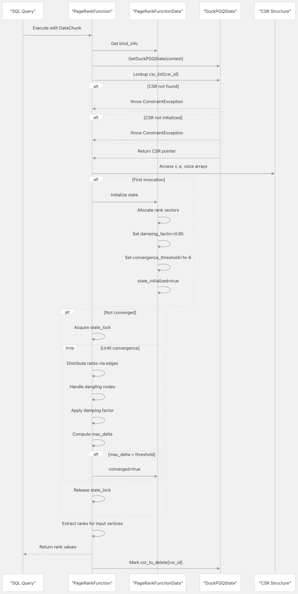
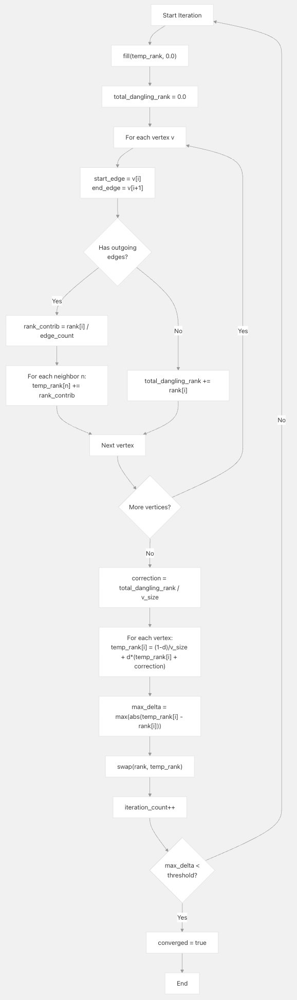

## DuckPGQ 源码学习: 5.4 中心性算法（Centrality Algorithms）   
                                        
### 作者                                        
digoal                                        
                                        
### 日期                                        
2025-11-08                                        
                                        
### 标签                                        
DuckDB , PGQ , 属性图 , DuckPGQ , 源码学习                                        
                                        
----                   
                                        
## 背景     
本文档描述了 **DuckPGQ** 中用于衡量 **属性图（property graphs）** 中 **节点重要性（node importance）** 的 **中心性分析算法（centrality analysis algorithms）**。目前，DuckPGQ 主要实现了 **PageRank 算法（PageRank Algorithm）** 作为其主要的 **中心性指标（centrality metric）**。  
  
## 概览（Overview）  
  
**中心性算法（Centrality algorithms）** 通过分析 **图拓扑（graph topology）** 来识别图中的重要或有影响力的 **顶点（vertices）**。DuckPGQ 通过 **标量函数（scalar functions）** 提供中心性分析，这些函数基于以 **CSR 格式（CSR format）** 存储的图结构计算每个顶点的 **重要性分数（importance scores）**。  
  
`pagerank` **标量函数（scalar function）** 通过边缘关系迭代地分配重要性，直到达到 **收敛（convergence）**，从而计算顶点的 **PageRank 中心性分数（PageRank centrality scores）**。  
  
**来源:** [`src/core/functions/scalar/pagerank.cpp` 1-122](https://github.com/cwida/duckpgq-extension/blob/db304f58/src/core/functions/scalar/pagerank.cpp#L1-L122)  
  
## PageRank 算法（PageRank Algorithm）  
  
### 函数签名（Function Signature）  
  
PageRank 函数被注册为一个 **标量函数（scalar function）**，其签名如下：  
  
```  
pagerank(csr_id INTEGER, vertex_id BIGINT) → DOUBLE  
```  
  
| 参数（Parameter） | 类型（Type） | 描述（Description） |  
| :--- | :--- | :--- |  
| `csr_id` | INTEGER | 内部 CSR 结构标识符（Internal CSR structure identifier） |  
| `vertex_id` | BIGINT | 要检索 PageRank 分数的顶点 ID（Vertex ID to retrieve PageRank score for） |  
| **返回** | DOUBLE | 该顶点的 PageRank 中心性分数（PageRank centrality score for the vertex） |  
  
该函数通常在 `GRAPH_TABLE` 查询中自动调用，而不是由用户直接调用。  
  
**来源:** [`src/core/functions/scalar/pagerank.cpp` 117-119](https://github.com/cwida/duckpgq-extension/blob/db304f58/src/core/functions/scalar/pagerank.cpp#L117-L119)  
  
### 算法参数（Algorithm Parameters）  
  
PageRank 使用以下在首次执行期间初始化的可配置参数：  
  
| 参数（Parameter） | 默认值（Default Value） | 目的（Purpose） |  
| :--- | :--- | :--- |  
| **阻尼系数** (`damping_factor`) | 0.85 | 遵循边 vs. 随机跳转的概率（Probability of following edges vs. random jump） |  
| **收敛阈值** (`convergence_threshold`) | 1e-6 | 视为收敛的最大排名变化（Maximum rank change to consider converged） |  
| **初始排名** (`Initial rank`) | `1.0 / v_size` | 统一的起始排名分布（Uniform starting rank distribution） |  
  
**来源:** [`src/core/functions/scalar/pagerank.cpp` 32-40](https://github.com/cwida/duckpgq-extension/blob/db304f58/src/core/functions/scalar/pagerank.cpp#L32-L40)  
  
## 实现架构（Implementation Architecture）  
  
### PageRank 函数数据（PageRank Function Data）  
  
  
  
`PageRankFunctionData` 结构在查询中的多次调用之间维护 **算法状态（algorithm state）**。**CSR 结构（CSR structure）** 使用 `csr_id` 标识符从 `DuckPGQState`（DuckPGQ 状态）访问。  
  
**来源:**  
  
  * [`src/core/functions/scalar/pagerank.cpp` 11-24](https://github.com/cwida/duckpgq-extension/blob/db304f58/src/core/functions/scalar/pagerank.cpp#L11-L24)  
  * [`duckpgq/core/functions/function_data/pagerank_function_data.hpp`](https://github.com/cwida/duckpgq-extension/blob/db304f58/duckpgq/core/functions/function_data/pagerank_function_data.hpp)  
  
### 执行流程（Execution Flow）  
  
  
  
**来源:** [`src/core/functions/scalar/pagerank.cpp` 11-111](https://github.com/cwida/duckpgq-extension/blob/db304f58/src/core/functions/scalar/pagerank.cpp#L11-L111)  
  
## PageRank 计算（PageRank Computation）  
  
### 初始化阶段（Initialization Phase）  
  
当 `PageRankFunction` 首次被调用时，它会初始化算法状态：  
  
1.  **CSR 验证（CSR Validation）**: 验证 CSR 结构存在并已正确初始化。  
2.  **状态分配（State Allocation）**: 创建大小与 **图顶点计数（graph vertex count）** 相匹配的 `rank` 和 `temp_rank` 向量。  
3.  **初始分布（Initial Distribution）**: 将每个顶点的 **初始排名（initial rank）** 设置为 `1.0 / v_size`（统一分布）。  
4.  **参数设置（Parameter Setup）**: 配置 **阻尼系数（damping factor）** 和 **收敛阈值（convergence threshold）**。  
  
**来源:** [`src/core/functions/scalar/pagerank.cpp` 16-40](https://github.com/cwida/duckpgq-extension/blob/db304f58/src/core/functions/scalar/pagerank.cpp#L16-L40)  
  
### 迭代排名（Iterative Ranking）  
  
核心 **PageRank 算法（PageRank algorithm）** 迭代执行直到 **收敛（convergence）**：  
  
  
  
**来源:** [`src/core/functions/scalar/pagerank.cpp` 43-82](https://github.com/cwida/duckpgq-extension/blob/db304f58/src/core/functions/scalar/pagerank.cpp#L43-L82)  
  
### 悬空节点处理（Dangling Node Handling）  
  
该算法通过将 **悬空节点（dangling nodes）**（没有出边的 **顶点（vertices）**）的排名均匀地重新分配给所有顶点来处理它们：  
  
1.  **检测（Detection）**: `v[i+1] == v[i]` 的顶点没有出边。  
2.  **累积（Accumulation）**: 将所有 **悬空节点排名（dangling node ranks）** 求和到 `total_dangling_rank` 中。  
3.  **再分配（Redistribution）**: 在更新阶段，将 `total_dangling_rank / v_size` 添加到每个顶点的排名中。  
  
这可以防止排名在图中丢失，保持总排名等于 1.0 的 **守恒性质（conservation property）**。  
  
**来源:** [`src/core/functions/scalar/pagerank.cpp` 50-67](https://github.com/cwida/duckpgq-extension/blob/db304f58/src/core/functions/scalar/pagerank.cpp#L50-L67)  
  
### 收敛检测（Convergence Detection）  
  
该算法通过计算所有顶点排名的最大绝对变化来监控 **收敛（convergence）**：  
  
```  
max_delta = max(|temp_rank[i] - rank[i]|) for all i  
```  
  
当 `max_delta < convergence_threshold`（1e-6）时，算法设置 `converged = true` 并终止迭代。同一查询中的后续调用将跳过迭代并直接返回 **缓存的排名值（cached rank values）**。  
  
**来源:** [`src/core/functions/scalar/pagerank.cpp` 68-80](https://github.com/cwida/duckpgq-extension/blob/db304f58/src/core/functions/scalar/pagerank.cpp#L68-L80)  
  
## 结果检索（Result Retrieval）  
  
### 顶点排名查找（Vertex Rank Lookup）  
  
**收敛（convergence）** 后，该函数会为当前 **数据块（DataChunk）** 中请求的 **顶点（vertices）** 提取 **PageRank 分数（PageRank scores）**：  
  
1.  **输入处理（Input Processing）**: 使用 **统一向量格式（UnifiedVectorFormat）** 从 `args.data[1]` 中读取 **顶点 ID（vertex IDs）**。  
2.  **有效性检查（Validity Checking）**: 验证每个 **顶点 ID（vertex ID）** 并标记无效结果。  
3.  **边界检查（Bounds Checking）**: 确保顶点 ID 在 `[0, v_size)` 范围内。  
4.  **排名分配（Rank Assignment）**: 将 `rank[node_id]` 复制到结果向量。  
  
无效或超出边界的 **顶点（vertices）** 在结果中会收到 `NULL` 值。  
  
**来源:** [`src/core/functions/scalar/pagerank.cpp` 84-108](https://github.com/cwida/duckpgq-extension/blob/db304f58/src/core/functions/scalar/pagerank.cpp#L84-L108)  
  
### CSR 清理标记（CSR Cleanup Marking）  
  
处理完结果后，该函数将 **CSR 结构（CSR structure）** 标记为 **延迟清理（deferred cleanup）**：  
  
```  
duckpgq_state->csr_to_delete.insert(info.csr_id);  
```  
  
CSR 不会立即删除，以允许其他 **并发操作（concurrent operations）** 完成。清理发生在 **查询结束生命周期事件（query end lifecycle event）** 期间。  
  
**来源:** [`src/core/functions/scalar/pagerank.cpp` 110-110](https://github.com/cwida/duckpgq-extension/blob/db304f58/src/core/functions/scalar/pagerank.cpp#L110-L110)  
  
## 线程安全（Thread Safety）  
  
PageRank 实现使用 **互斥锁（mutex lock）**（`state_lock`）在 **迭代计算阶段（iterative computation phase）** 确保 **线程安全（thread safety）**，以防多个线程同时尝试在同一图上计算 PageRank：  
  
```  
std::lock_guard<std::mutex> guard(info.state_lock);  
```  
  
一旦实现 **收敛（convergence）**（`converged = true`），后续调用将跳过锁定的迭代阶段，并直接访问 **缓存的排名值（cached rank values）**，从而提高重复查询的性能。  
  
**来源:** [`src/core/functions/scalar/pagerank.cpp` 44-44](https://github.com/cwida/duckpgq-extension/blob/db304f58/src/core/functions/scalar/pagerank.cpp#L44-L44)  
  
## 与图查询的集成（Integration with Graph Queries）  
  
**PageRank** 通常通过 **CSR 生成管道（CSR generation pipeline）** 在 **模式匹配查询（pattern matching queries）** 中调用：  
  
```  
SELECT v.id, pagerank(...) as rank  
FROM GRAPH_TABLE(my_graph   
    MATCH (v:Person)-[e:KNOWS*1..5]->(other)  
    COLUMNS (v.id)  
) ORDER BY rank DESC;  
```  
  
**查询处理器（query processor）** 自动执行以下操作：  
  
1.  为匹配的 **子图（subgraph）** 生成 **CSR 结构（CSR structure）**。  
2.  使用适当的 `csr_id` 绑定 `pagerank` 函数。  
3.  在 CSR 上执行 **PageRank**。  
4.  返回每个顶点的分数。  
  
**来源:** [`src/core/functions/scalar/pagerank.cpp` 11-119](https://github.com/cwida/duckpgq-extension/blob/db304f58/src/core/functions/scalar/pagerank.cpp#L11-L119)  
  
## 错误条件（Error Conditions）  
  
**PageRank 函数（PageRank function）** 在以下情况下引发 `ConstraintException`（约束异常）：  
  
| 错误（Error） | 条件（Condition） | 消息（Message） |  
| :--- | :--- | :--- |  
| **未找到 CSR** (`CSR Not Found`) | `csr_id` 不在 `csr_list` 中 | "CSR not found. Is the graph populated?" (未找到 CSR。图是否已填充？) |  
| **CSR 未初始化** (`CSR Not Initialized`) | `initialized_v` 或 `initialized_e` 为假 | "Need to initialize CSR before running PageRank." (在运行 PageRank 之前需要初始化 CSR。) |  
  
无效的 **顶点 ID（vertex IDs）** 会导致 `NULL` 值，而不是引发 **异常（exceptions）**。  
  
**来源:** [`src/core/functions/scalar/pagerank.cpp` 17-24](https://github.com/cwida/duckpgq-extension/blob/db304f58/src/core/functions/scalar/pagerank.cpp#L17-L24)  
  
## 性能特征（Performance Characteristics）  
  
### 计算复杂度（Computational Complexity）  
  
  * **每次迭代时间** (`Time per iteration`): O(V + E)，其中 V 是 **顶点计数（vertex count）**，E 是 **边计数（edge count）**。  
  * **空间复杂度** (`Space complexity`): O(V)，用于 **排名存储（rank storage）**。  
  * **收敛迭代次数** (`Convergence iterations`): 通常为 10-50 次迭代，具体取决于 **图结构（graph structure）** 和 **阻尼系数（damping factor）**。  
  
### 内存访问模式（Memory Access Pattern）  
  
在遍历 **CSR 结构（CSR structure）** 时，该算法表现出良好的 **缓存局部性（cache locality）**：  
  
  * 对 `v`（**顶点偏移（vertex offset）**）数组的顺序访问。  
  * 在每个顶点的边范围内对 `e`（**边（edge）**）数组的近顺序访问。  
  * 在 **排名分配（rank distribution）** 期间对 `temp_rank` 的随机写入访问。  
  
**来源:** [`src/core/functions/scalar/pagerank.cpp` 52-60](https://github.com/cwida/duckpgq-extension/blob/db304f58/src/core/functions/scalar/pagerank.cpp#L52-L60)  
      
#### [PolarDB 学习图谱](https://www.aliyun.com/database/openpolardb/activity "8642f60e04ed0c814bf9cb9677976bd4")
  
  
#### [PostgreSQL 解决方案集合](../201706/20170601_02.md "40cff096e9ed7122c512b35d8561d9c8")
  
  
#### [德哥 / digoal's Github - 公益是一辈子的事.](https://github.com/digoal/blog/blob/master/README.md "22709685feb7cab07d30f30387f0a9ae")
  
  
#### [About 德哥](https://github.com/digoal/blog/blob/master/me/readme.md "a37735981e7704886ffd590565582dd0")
  
  

  
