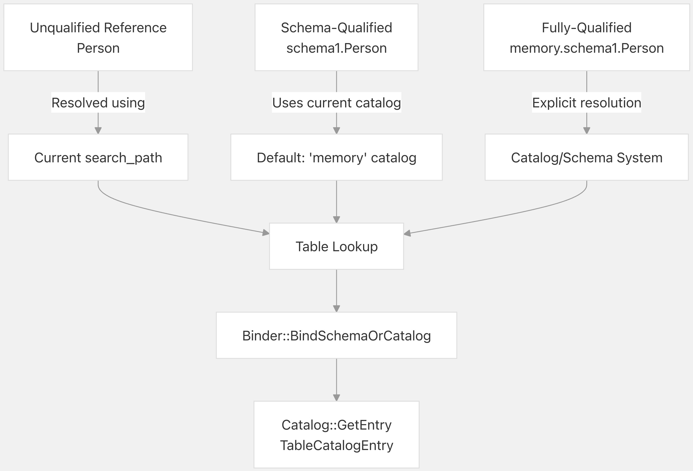
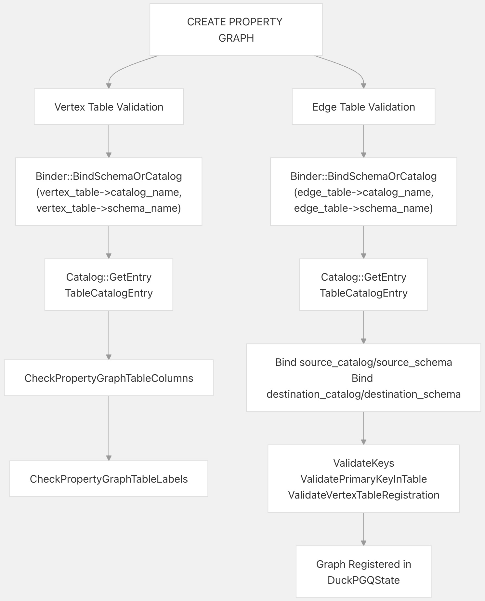
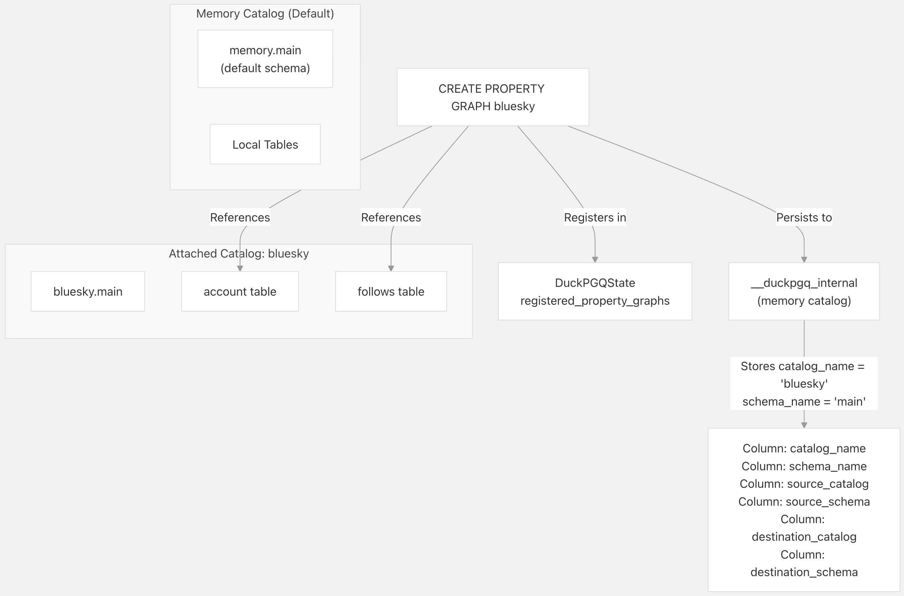
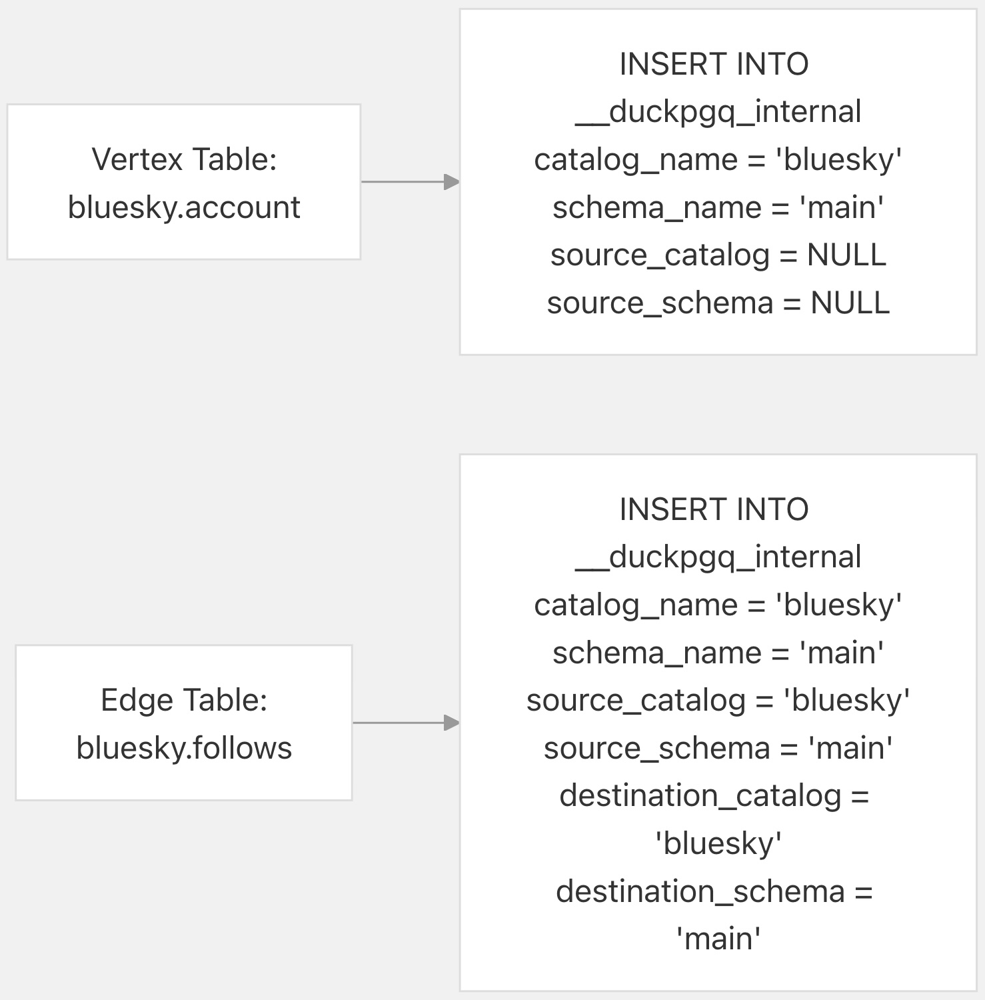
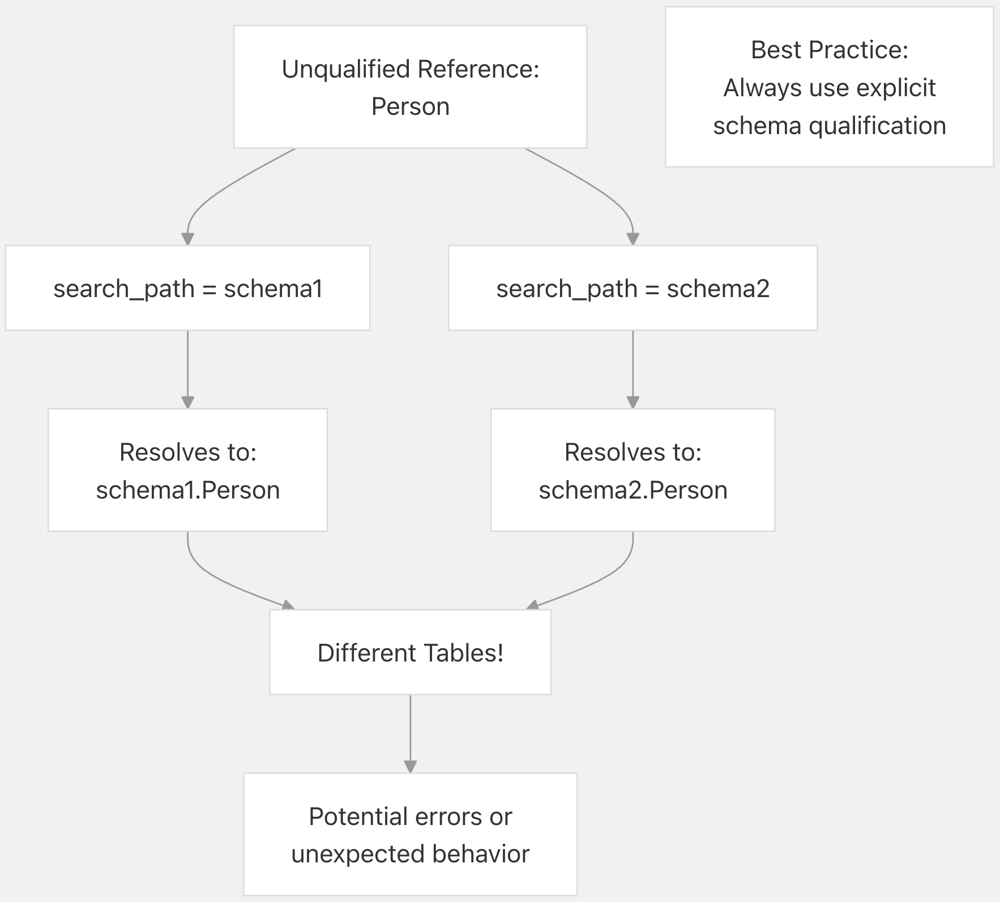
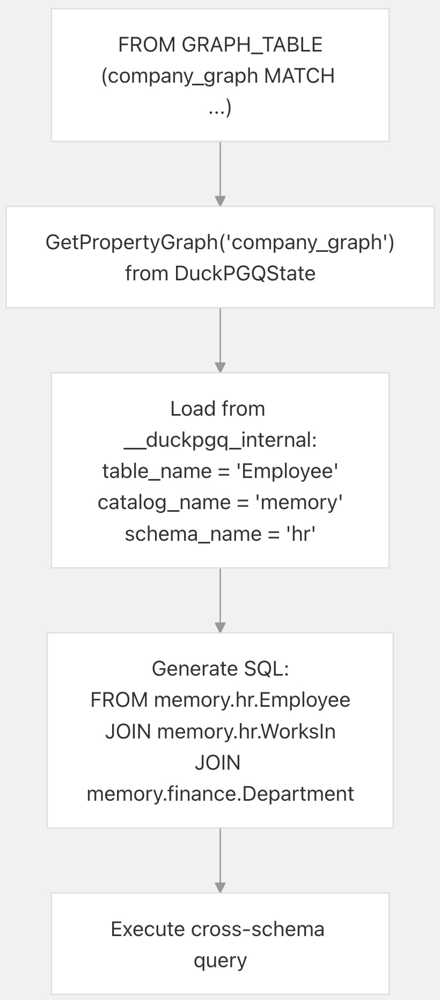

## DuckPGQ 源码学习: 6.3 跨模式 (Cross-Schema) 和跨目录 (Cross-Catalog) 图  
                                        
### 作者                                        
digoal                                        
                                        
### 日期                                        
2025-11-08                                        
                                        
### 标签                                        
DuckDB , PGQ , 属性图 , DuckPGQ , 源码学习                                        
                                        
----                   
                                        
## 背景    
本文介绍如何在 DuckPGQ 中创建跨越多个模式 (schema) 和目录 (catalog) 的属性图 (property graphs)。属性图可以引用同一目录 (catalog) 内不同模式 (schema) 中的表，或引用不同目录（附加数据库，attached databases）中的表，从而能够对分布式关系数据 (distributed relational data) 进行灵活的图建模。  
  
## 概述 (Overview)  
  
在定义属性图 (property graphs) 时，DuckPGQ 支持三种级别的表限定 (table qualification)：  
  
1.  **非限定 (Unqualified)**：`table_name` - 使用当前的搜索路径 (search path) 来解析表  
2.  **模式限定 (Schema-qualified)**：`schema.table_name` - 显式 (Explicitly) 指定模式 (schema)  
3.  **完全限定 (Fully-qualified)**：`catalog.schema.table_name` - 显式指定目录 (catalog) 和模式 (schema)  
  
这种限定系统使得属性图能够：  
  
  * 引用同一目录 (catalog) 内来自多个模式 (schema) 的表  
  * 引用来自附加数据库 (attached databases) 的表（跨目录，cross-catalog）  
  * 混合使用限定 (qualified) 和非限定 (unqualified) 的表名（但推荐使用显式限定）  
  
**来源 (Sources):** [`test/sql/211_using_other_schemas.test` 1-335](https://github.com/cwida/duckpgq-extension/blob/db304f58/test/sql/211_using_other_schemas.test#L1-L335) [`test/sql/create_pg/attach_pg.test` 1-182](https://github.com/cwida/duckpgq-extension/blob/db304f58/test/sql/create_pg/attach_pg.test#L1-L182)  
  
## 表限定语法 (Table Qualification Syntax)  
  
创建属性图 (property graph) 时，可以使用不同级别的限定 (qualification) 来引用表。该语法适用于顶点表 (vertex tables) 和边表 (edge tables)，以及它们的源 (source) 和目标 (destination) 引用。  
  
    
  
### 语法示例 (Syntax Examples)  
  
| 限定级别 (Qualification Level) | 示例 (Example) | 解析 (Resolution) |  
| :--- | :--- | :--- |  
| 非限定 (Unqualified) | `Person` | 通过 `search_path` 解析 |  
| 模式限定 (Schema-qualified) | `schema1.Person` | 使用当前目录 (catalog)（通常是 `memory`） |  
| 完全限定 (Fully-qualified) | `memory.schema1.Person` | 显式 (Explicit) 目录 (catalog) 和模式 (schema) |  
| 附加数据库 (Attached database) | `bluesky.main.account` | 引用附加目录 `bluesky` |  
  
**来源 (Sources):** [`src/core/functions/table/create_property_graph.cpp` 178-200](https://github.com/cwida/duckpgq-extension/blob/db304f58/src/core/functions/table/create_property_graph.cpp#L178-L200) [`test/sql/211_using_other_schemas.test` 62-84](https://github.com/cwida/duckpgq-extension/blob/db304f58/test/sql/211_using_other_schemas.test#L62-L84)  
  
## 跨模式属性图 (Cross-Schema Property Graphs)  
  
属性图 (Property graphs) 可以引用同一目录 (catalog) 内多个模式 (schema) 中的表。这对于对顶点 (vertices) 和边 (edges) 分布在不同模式中的图进行建模非常有用。  
  
### 创建跨模式图 (Creating Cross-Schema Graphs)  
  
```  
-- Tables in different schemas  
CREATE SCHEMA schema1;  
CREATE SCHEMA schema2;  
  
CREATE TABLE schema1.Person(id BIGINT PRIMARY KEY, name TEXT);  
CREATE TABLE schema2.Company(id BIGINT PRIMARY KEY, name TEXT);  
CREATE TABLE schema2.WorksAt(person_id BIGINT, company_id BIGINT);  
  
-- Property graph spanning both schemas  
CREATE PROPERTY GRAPH cross_schema_graph  
    VERTEX TABLES (  
        schema1.Person,  
        schema2.Company  
    )  
    EDGE TABLES (  
        schema2.WorksAt   
            SOURCE KEY (person_id) REFERENCES schema1.Person (id)  
            DESTINATION KEY (company_id) REFERENCES schema2.Company (id)  
            LABEL works_at  
    );  
```  
  
### 验证过程 (Validation Process)  
  
    
  
验证过程 (validation process) 确保：  
  
1.  所有引用的模式 (schemas) 和目录 (catalogs) 均存在 ([`src/core/functions/table/create_property_graph.cpp` 178-179](https://github.com/cwida/duckpgq-extension/blob/db304f58/src/core/functions/table/create_property_graph.cpp#L178-L179))  
2.  所有表都存在于其指定的模式中 ([`src/core/functions/table/create_property_graph.cpp` 180-185](https://github.com/cwida/duckpgq-extension/blob/db304f58/src/core/functions/table/create_property_graph.cpp#L180-L185))  
3.  源表 (Source) 和目标表 (destination tables) 已注册为顶点 (vertices) ([`src/core/functions/table/create_property_graph.cpp` 237-247](https://github.com/cwida/duckpgq-extension/blob/db304f58/src/core/functions/table/create_property_graph.cpp#L237-L247))  
4.  主键-外键 (Primary key-foreign key, PK-FK) 关系有效 ([`src/core/functions/table/create_property_graph.cpp` 224-235](https://github.com/cwida/duckpgq-extension/blob/db304f58/src/core/functions/table/create_property_graph.cpp#L224-L235))  
  
**来源 (Sources):** [`src/core/functions/table/create_property_graph.cpp` 152-262](https://github.com/cwida/duckpgq-extension/blob/db304f58/src/core/functions/table/create_property_graph.cpp#L152-L262) [`test/sql/211_using_other_schemas.test` 98-189](https://github.com/cwida/duckpgq-extension/blob/db304f58/test/sql/211_using_other_schemas.test#L98-L189)  
  
## 跨目录图（附加数据库）(Cross-Catalog Graphs (Attached Databases))  
  
DuckPGQ 支持对附加数据库 (attached databases) 中的表创建属性图 (property graphs)。这使得可以在不将数据复制到主目录 (main catalog) 的情况下，对外部数据源进行图查询 (graph queries)。  
  
### 附加数据库 (Attaching Databases)  
  
```  
-- Attach an external database  
ATTACH 'duckdb/data/bluesky/bluesky.duckdb';  
  
-- Verify tables are accessible  
SELECT count(*) FROM bluesky.account;  -- Access using catalog.table syntax  
```  
  
### 在附加数据库上创建图 (Creating Graphs on Attached Databases)  
  
```  
CREATE PROPERTY GRAPH bluesky  
    VERTEX TABLES (bluesky.account LABEL account)  
    EDGE TABLES (  
        bluesky.follows   
            SOURCE KEY (source) REFERENCES bluesky.account (did)  
            DESTINATION KEY (destination) REFERENCES bluesky.account (did)  
            LABEL follows  
    );  
  
-- Query the graph  
FROM GRAPH_TABLE (bluesky MATCH (a:account)-[f:follows]->(b:account));  
```  
  
### 跨目录架构 (Cross-Catalog Architecture)  
  
    
  
当查询跨目录图 (cross-catalog graph) 时，DuckPGQ：  
  
1.  从内存目录 (memory catalog) 中的 `__duckpgq_internal` 检索图定义 (graph definition)  
2.  读取每个表的目录 (catalog) 和模式 (schema) 名称 ([`src/core/functions/table/create_property_graph.cpp` 326-331](https://github.com/cwida/duckpgq-extension/blob/db304f58/src/core/functions/table/create_property_graph.cpp#L326-L331) [385-390](https://github.com/cwida/duckpgq-extension/blob/db304f58/385-390))  
3.  生成使用完全限定名称 (fully-qualified names) 引用表的查询  
4.  透明地 (transparently) 跨目录边界执行查询  
  
**来源 (Sources):** [`test/sql/create_pg/attach_pg.test` 1-182](https://github.com/cwida/duckpgq-extension/blob/db304f58/test/sql/create_pg/attach_pg.test#L1-L182) [`src/core/functions/table/create_property_graph.cpp` 303-407](https://github.com/cwida/duckpgq-extension/blob/db304f58/src/core/functions/table/create_property_graph.cpp#L303-L407)  
  
## 元数据存储 (Metadata Storage)  
  
`__duckpgq_internal` 表存储了每个属性图 (property graph) 表的目录 (catalog) 和模式 (schema) 信息，从而使跨目录 (cross-catalog) 和跨模式 (cross-schema) 的图定义能够在会话 (sessions) 之间持久化 (persisted) 和恢复 (restored)。  
  
### 元数据模式 (Metadata Schema)  
  
| 列 (Column) | 类型 (Type) | 描述 (Description) |  
| :--- | :--- | :--- |  
| `property_graph` | TEXT | 属性图的名称 |  
| `table_name` | TEXT | 非限定 (Unqualified) 表名 |  
| `catalog_name` | TEXT | 包含该表的目录 (Catalog) |  
| `schema_name` | TEXT | 包含该表的模式 (Schema) |  
| `source_catalog` | TEXT | 源顶点 (source vertex) 的目录（仅限边表，edge tables only） |  
| `source_schema` | TEXT | 源顶点的模式（仅限边表） |  
| `destination_catalog` | TEXT | 目标顶点 (destination vertex) 的目录（仅限边表） |  
| `destination_schema` | TEXT | 目标顶点的模式（仅限边表） |  
  
### 存储过程 (Storage Process)  
  
    
  
元数据 (metadata) 插入发生在 [`src/core/functions/table/create_property_graph.cpp` 303-407](https://github.com/cwida/duckpgq-extension/blob/db304f58/src/core/functions/table/create_property_graph.cpp#L303-L407) 中，其中显式 (explicitly) 存储了每个顶点 (vertex) 和边表 (edge table) 的目录 (catalog) 和模式 (schema) 信息。  
  
**来源 (Sources):** [`src/core/functions/table/create_property_graph.cpp` 303-407](https://github.com/cwida/duckpgq-extension/blob/db304f58/src/core/functions/table/create_property_graph.cpp#L303-L407)  
  
## 搜索路径考量 (Search Path Considerations)  
  
`search_path` 设置决定了非限定 (unqualified) 表名的解析方式。创建属性图 (property graphs) 时，建议使用显式 (explicit) 的模式 (schema) 或目录 (catalog) 限定，以避免歧义 (ambiguity)。  
  
### 搜索路径解析 (Search Path Resolution)  
  
```  
-- Set search path  
SET search_path = schema1;  
  
-- This will look for Person in schema1  
CREATE PROPERTY GRAPH graph1  
    VERTEX TABLES (Person);  
  
-- Explicit qualification overrides search path  
CREATE PROPERTY GRAPH graph2  
    VERTEX TABLES (schema2.Person);  -- Uses schema2, not schema1  
```  
  
### 潜在问题 (Potential Issues)  
  
    
  
如果在图创建 (graph creation) 和查询执行 (query execution) 之间搜索路径 (search path) 发生变化，非限定 (unqualified) 引用可能会被不同地解析，从而导致错误。[`src/core/functions/table/create_property_graph.cpp` 178-200](https://github.com/cwida/duckpgq-extension/blob/db304f58/src/core/functions/table/create_property_graph.cpp#L178-L200) 中的验证 (validation) 发生在创建时，但存储的元数据 (metadata) 使用的是指定时的表名。  
  
**来源 (Sources):** [`test/sql/211_using_other_schemas.test` 7-96](https://github.com/cwida/duckpgq-extension/blob/db304f58/test/sql/211_using_other_schemas.test#L7-L96)  
  
## 限制与约束 (Limitations and Constraints)  
  
### 跨模式外键约束 (Foreign Key Constraints Across Schemas)  
  
DuckDB 不支持跨不同模式 (schemas) 或目录 (catalogs) 创建外键约束 (foreign key constraints)。当依赖隐式 (implicit) 的主键-外键 (PK-FK) 关系时，此限制会影响属性图 (property graph) 的创建。  
  
```  
-- This fails in DuckDB  
CREATE TABLE schema1.e (  
    id BIGINT PRIMARY KEY,  
    src BIGINT REFERENCES schema2.v(id),  -- Cross-schema FK not allowed  
    dst BIGINT REFERENCES schema2.v(id)  
);  
-- Error: Creating foreign keys across different schemas or catalogs is not supported  
```  
  
**解决方法 (Workaround)**：在属性图定义中显式 (Explicitly) 指定主键 (primary key) 和外键 (foreign key) 列：  
  
```  
CREATE PROPERTY GRAPH cross_schema  
    VERTEX TABLES (schema1.Person, schema2.Company)  
    EDGE TABLES (  
        schema2.WorksAt  
            SOURCE KEY (person_id) REFERENCES schema1.Person (id)  
            DESTINATION KEY (company_id) REFERENCES schema2.Company (id)  
    );  
```  
  
这种显式指定绕过了对数据库级外键约束的需求，并允许 DuckPGQ 在图创建期间验证这些关系。  
  
**来源 (Sources):** [`test/sql/211_using_other_schemas.test` 241-249](https://github.com/cwida/duckpgq-extension/blob/db304f58/test/sql/211_using_other_schemas.test#L241-L249)  
  
### 视图限制 (View Restrictions)  
  
属性图 (Property graphs) 不能在视图 (views) 上创建，无论它们是否位于相同或不同的模式 (schemas) 中。  
  
```  
CREATE VIEW v AS SELECT * FROM vdata;  
  
-- This fails  
CREATE PROPERTY GRAPH g1  
    VERTEX TABLES (v)  
    EDGE TABLES (...);  
-- Error: Found a view with name v. Creating property graph tables over views   
-- is currently not supported.  
```  
  
对于顶点表 (vertex tables)，验证发生在 [`src/core/functions/table/create_property_graph.cpp` 188-196](https://github.com/cwida/duckpgq-extension/blob/db304f58/src/core/functions/table/create_property_graph.cpp#L188-L196)；对于边表 (edge tables)，发生在 [248-256](https://github.com/cwida/duckpgq-extension/blob/db304f58/248-256)。  
  
**来源 (Sources):** [`test/sql/create_pg/create_pg_on_view.test` 1-42](https://github.com/cwida/duckpgq-extension/blob/db304f58/test/sql/create_pg/create_pg_on_view.test#L1-L42) [`src/core/functions/table/create_property_graph.cpp` 188-196](https://github.com/cwida/duckpgq-extension/blob/db304f58/src/core/functions/table/create_property_graph.cpp#L188-L196)  
  
### 跨模式标签唯一性 (Label Uniqueness Across Schemas)  
  
即使表来自不同的模式 (schemas)，它们的标签 (labels) 在一个属性图 (property graph) 内也必须是唯一的 (unique)。  
  
```  
-- This fails  
CREATE PROPERTY GRAPH conflicting  
    VERTEX TABLES (  
        schema1.Person,  
        schema2.Person  -- Different schema, same table name  
    )  
    EDGE TABLES (...);  
-- Error: Label person is not unique, make sure all labels are unique  
```  
  
为解决此问题，请使用显式 (explicit) 的标签别名 (label aliases)：  
  
```  
CREATE PROPERTY GRAPH resolved  
    VERTEX TABLES (  
        schema1.Person LABEL person_s1,  
        schema2.Person LABEL person_s2  
    )  
    EDGE TABLES (...);  
```  
  
**来源 (Sources):** [`test/sql/211_using_other_schemas.test` 203-216](https://github.com/cwida/duckpgq-extension/blob/db304f58/test/sql/211_using_other_schemas.test#L203-L216)  
  
## 完整示例：多模式图 (Complete Example: Multi-Schema Graph)  
  
本例展示了一个使用显式限定 (explicit qualification) 跨越多个模式 (schemas) 的属性图 (property graph)。  
  
```  
-- Setup schemas and tables  
CREATE SCHEMA hr;  
CREATE SCHEMA finance;  
  
CREATE TABLE hr.Employee(  
    id BIGINT PRIMARY KEY,   
    name TEXT,   
    department TEXT  
);  
  
CREATE TABLE finance.Department(  
    id BIGINT PRIMARY KEY,   
    name TEXT,   
    budget DECIMAL  
);  
  
CREATE TABLE hr.WorksIn(  
    employee_id BIGINT,  
    department_id BIGINT  
);  
  
-- Create cross-schema property graph  
CREATE PROPERTY GRAPH company_graph  
    VERTEX TABLES (  
        hr.Employee LABEL employee,  
        finance.Department LABEL department  
    )  
    EDGE TABLES (  
        hr.WorksIn   
            SOURCE KEY (employee_id) REFERENCES hr.Employee (id)  
            DESTINATION KEY (department_id) REFERENCES finance.Department (id)  
            LABEL works_in  
    );  
  
-- Query across schemas  
FROM GRAPH_TABLE (  
    company_graph   
    MATCH (e:employee)-[w:works_in]->(d:department)  
    WHERE d.budget > 1000000  
    COLUMNS (e.name, d.name AS dept_name)  
);  
```  
  
### 执行流程 (Execution Flow)  
  
    
  
查询引擎 (query engine) 使用存储的目录 (catalog) 和模式 (schema) 信息生成完全限定 (fully-qualified) 的表引用，确保跨模式边界的正确解析 (resolution)。  
  
**来源 (Sources):** [`test/sql/211_using_other_schemas.test` 98-160](https://github.com/cwida/duckpgq-extension/blob/db304f58/test/sql/211_using_other_schemas.test#L98-L160)  
      
#### [PolarDB 学习图谱](https://www.aliyun.com/database/openpolardb/activity "8642f60e04ed0c814bf9cb9677976bd4")
  
  
#### [PostgreSQL 解决方案集合](../201706/20170601_02.md "40cff096e9ed7122c512b35d8561d9c8")
  
  
#### [德哥 / digoal's Github - 公益是一辈子的事.](https://github.com/digoal/blog/blob/master/README.md "22709685feb7cab07d30f30387f0a9ae")
  
  
#### [About 德哥](https://github.com/digoal/blog/blob/master/me/readme.md "a37735981e7704886ffd590565582dd0")
  
  

  
