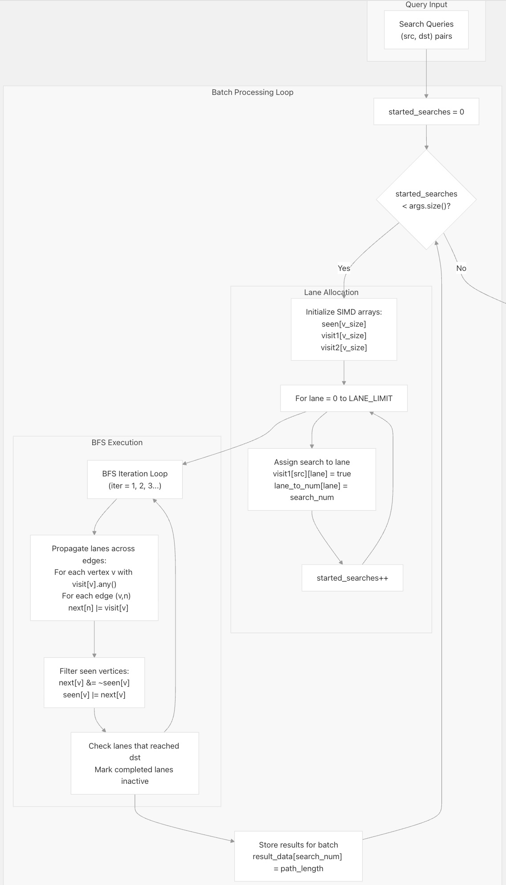
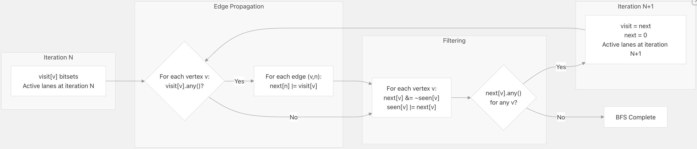
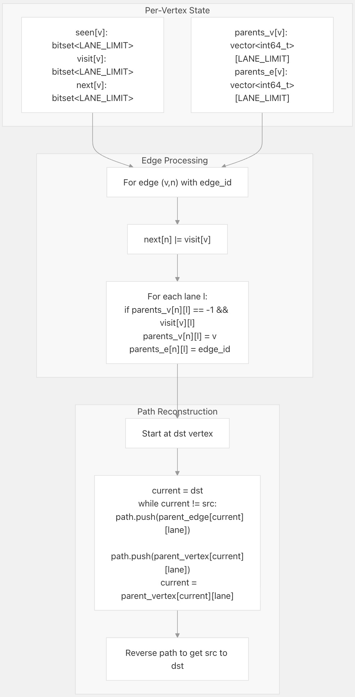
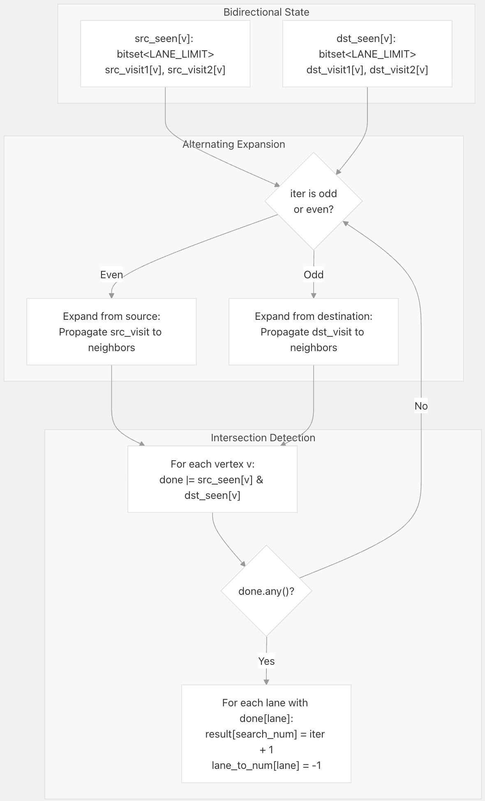
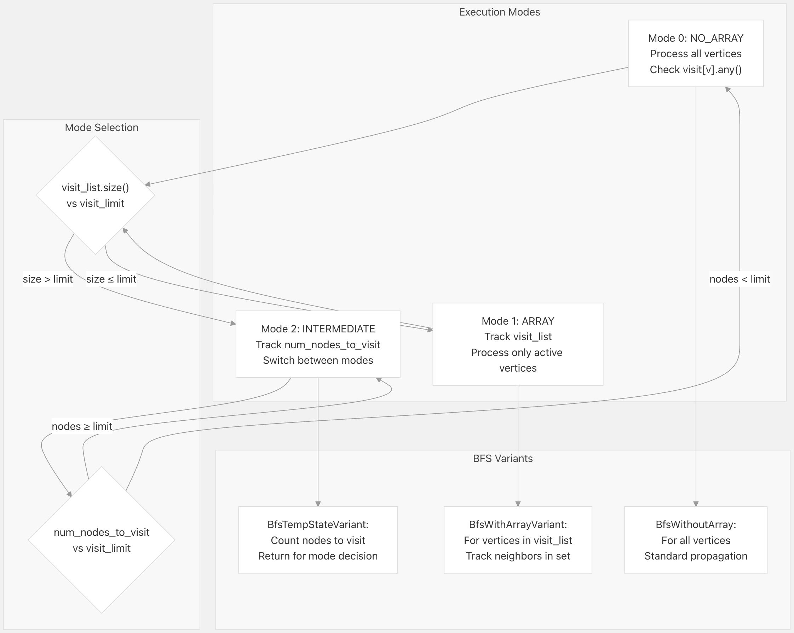
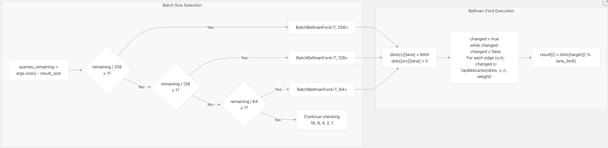
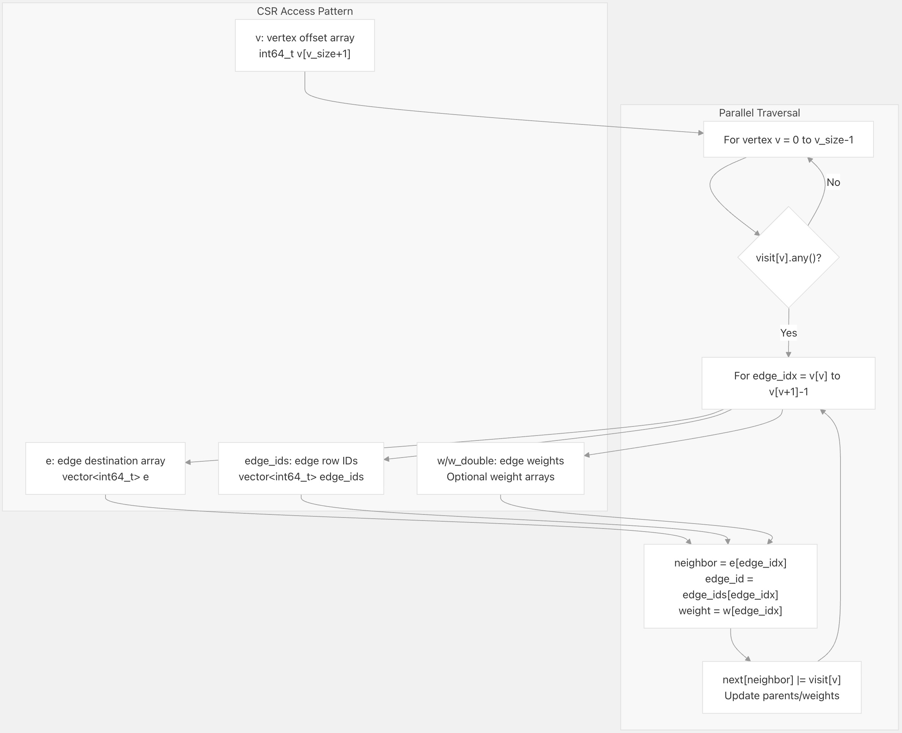

## DuckPGQ 源码学习: 6.4 并行查询处理（Parallel Query Processing）  
                                          
### 作者                                          
digoal                                          
                                          
### 日期                                          
2025-11-08                                          
                                          
### 标签                                          
DuckDB , PGQ , 属性图 , DuckPGQ , 源码学习                                          
                                          
----                     
                                          
## 背景     
本文介绍 **DuckPGQ** 如何通过 **SIMD**（单指令多数据）风格的**位集处理**（bitset processing）在图算法中实现**并行化**（parallelism）。该扩展使用一个由 `LANE_LIMIT`（通道限制）常量控制的**固定宽度并行执行模型**（fixed-width parallel execution model），并发地处理多个路径搜索。  
  
  
  
## 概述（Overview）  
  
**DuckPGQ** 为图算法实现了一种独特的并行形式，其中多个**独立搜索**（independent searches）在**共享图数据**（shared graph data）上同时执行。该系统没有使用传统的基于线程的**并行化**（parallelism），而是使用了 **SIMD 风格的位集操作**（SIMD-style bitset operations），其中每个位位置（称为一个 "**通道**" 或 **lane**）代表一个独立、同步执行的搜索。这种方法无需复杂的同步机制，即可高效并行执行**广度优先搜索**（Breadth-First Search，**BFS**）、**最短路径**（shortest path）和**可达性**（reachability）查询。  
  
关键创新在于所有搜索以相同的顺序处理相同的图顶点，但每个**通道**（lane）通过**位集**（bitsets）维护其独立状态。当访问一个顶点时，系统会检查哪些**通道**（lanes）将其包含在其**前沿**（frontier）中，并将这些**通道**（lanes）传播到该顶点的邻居。  
  
  
  
## 核心概念（Core Concepts）  
  
### LANE\_LIMIT 配置（LANE\_LIMIT Configuration）  
  
`LANE_LIMIT`（通道限制）常量定义了可以**并行**（in parallel）执行的并发搜索的最大数量。此值确定了整个系统中所有**位集操作**（bitset operations）的宽度。  
  
| 配置（Configuration） | 影响（Impact） |  
| :--- | :--- |  
| **位集宽度**（Bitset Width） | 所有 `std::bitset<LANE_LIMIT>` 数组的大小都由此宽度决定 |  
| **批次大小**（Batch Size） | 每个批次迭代处理的最大搜索数量 |  
| **内存占用**（Memory Footprint） | 每个顶点需要 `LANE_LIMIT` 位用于**访问/当前访问追踪**（seen/visit tracking） |  
| **并行度**（Parallelism Degree） | 较高的值会增加**吞吐量**（throughput），但也会增加内存使用量 |  
  
该常量贯穿于**路径查找**（pathfinding）算法中，用于确定跟踪**每通道状态**（per-lane state）的数据结构维度。  
  
来源: [`src/core/functions/scalar/iterativelength.cpp` 12-31](https://github.com/cwida/duckpgq-extension/blob/db304f58/src/core/functions/scalar/iterativelength.cpp#L12-L31) [`src/core/functions/scalar/shortest_path.cpp` 11-40](https://github.com/cwida/duckpgq-extension/blob/db304f58/src/core/functions/scalar/shortest_path.cpp#L11-L40)  
  
### 基于位集的状态追踪（Bitset-Based State Tracking）  
  
图中的每个顶点都维护多个**位集**（bitsets）来追踪哪些**通道**（lanes）（搜索）与它进行了交互：  
  
```  
Vertex State per Algorithm:  
├── seen[vertex]:  bitset<LANE_LIMIT>     # 哪些通道访问过此顶点  
├── visit[vertex]: bitset<LANE_LIMIT>     # 哪些通道在当前迭代中正在访问  
└── next[vertex]:  bitset<LANE_LIMIT>     # 哪些通道将在下一次迭代中访问  
```  
  
对这些**位集**（bitsets）的操作使用标准的 C++ **位集操作**：  
  
  * **传播**（Propagation）：`next[neighbor] |= visit[vertex]` - **OR**（或）操作以传播通道  
  * **过滤**（Filtering）：`next[vertex] &= ~seen[vertex]` - **AND-NOT**（与非）操作以过滤已访问的节点  
  * **检测**（Detection）：`visit[vertex].any()` - 检查是否有任何**通道**（lane）正在访问此顶点  
  
来源: [`src/core/functions/scalar/iterativelength.cpp` 72-75](https://github.com/cwida/duckpgq-extension/blob/db304f58/src/core/functions/scalar/iterativelength.cpp#L72-L75) [`src/core/functions/scalar/iterativelength2.cpp` 60-64](https://github.com/cwida/duckpgq-extension/blob/db304f58/src/core/functions/scalar/iterativelength2.cpp#L60-L64)  
  
  
  
## 并行处理架构（Parallel Processing Architecture）  
  
### 通道分配与批处理（Lane Assignment and Batching）  
  
  
  
**通道分配流程：**  
  
系统以**批次**（batches）为单位处理查询，每个批次最多包含 `LANE_LIMIT` 个并发搜索：  
  
1.  **批处理初始化**（Batch Initialization）：对于每个新批次，清除所有顶点的所有 **SIMD** 数组（`seen`, `visit`, `next`）  
2.  **通道分配**（Lane Allocation）：迭代**通道** 0 到 `LANE_LIMIT-1`，将待处理的搜索分配给每个**通道**  
3.  **通道映射**（Lane Mapping）：维护 `lane_to_num[lane]` 数组，将每个**通道**映射到其搜索索引  
4.  **执行**（Execution）：运行 **BFS** 迭代，所有**通道**同步推进  
5.  **完成**（Completion）：当**通道**（lanes）完成时，将其标记为非活动状态；当所有**通道**完成时，开始下一个批次  
  
来源: [`src/core/functions/scalar/iterativelength.cpp` 83-142](https://github.com/cwida/duckpgq-extension/blob/db304f58/src/core/functions/scalar/iterativelength.cpp#L83-L142) [`src/core/functions/scalar/iterativelength2.cpp` 72-129](https://github.com/cwida/duckpgq-extension/blob/db304f58/src/core/functions/scalar/iterativelength2.cpp#L72-L129)  
  
### SIMD 风格的 BFS 迭代（SIMD-Style BFS Iteration）  
  
核心的并行 **BFS** 迭代同时处理所有**通道**（lanes）：  
  
  
  
**关键操作：**  
  
  * **传播**（Propagation）：`next[neighbor] = next[neighbor] | visit[vertex]` - 组合来自所有入边的**通道**  
  * **过滤**（Filtering）：`next[v] = next[v] & ~seen[v]` - 移除已访问顶点 `v` 的**通道**  
  * **更新**（Update）：`seen[v] = seen[v] | next[v]` - 标记顶点 `v` 新访问的**通道**  
  * **终止**（Termination）：当对任何顶点 `v` 满足 `change |= next[v].any()` 时，继续迭代  
  
这种方法允许所有搜索共享相同的图遍历顺序，从而最大限度地提高**缓存效率**（cache efficiency），同时保持**独立的搜索状态**（independent search state）。  
  
来源: [`src/core/functions/scalar/iterativelength.cpp` 12-31](https://github.com/cwida/duckpgq-extension/blob/db304f58/src/core/functions/scalar/iterativelength.cpp#L12-L31) [`src/core/functions/scalar/iterativelength2.cpp` 13-31](https://github.com/cwida/duckpgq-extension/blob/db304f58/src/core/functions/scalar/iterativelength2.cpp#L13-L31)  
  
  
  
## 算法实现（Algorithm Implementations）  
  
### 带路径重构的最短路径（Shortest Path with Path Reconstruction）  
  
`shortestpath` 函数通过**父节点追踪**（parent tracking）来扩展基本的**迭代长度算法**（iterative length algorithm），以**重构路径**（reconstruct paths）：  
  
  
  
**父节点追踪**（parent tracking）只增加了极小的开销，同时实现了完整的**路径重构**。每个**通道**（lane）维护自己的**父指针**（parent pointers），这些指针密集存储在向量中，按顶点和通道进行索引。  
  
**实现细节：**  
  
  * 初始化所有顶点和**通道**（lanes）的 `parents_v[vertex][lane] = -1`  
  * 将源顶点标记为 `parents_v[src][lane] = src` 和 `parents_e[src][lane] = -2`  
  * 在**边传播**（edge propagation）期间，仅在首次访问时设置**父指针**：`if parents_v[n][l] == -1 && visit[v][l]`  
  * 通过沿**父指针**从目标回溯到源点来**重构路径**  
  
来源: [`src/core/functions/scalar/shortest_path.cpp` 11-40](https://github.com/cwida/duckpgq-extension/blob/db304f58/src/core/functions/scalar/shortest_path.cpp#L11-L40) [`src/core/functions/scalar/shortest_path.cpp` 78-82](https://github.com/cwida/duckpgq-extension/blob/db304f58/src/core/functions/scalar/shortest_path.cpp#L78-L82) [`src/core/functions/scalar/shortest_path.cpp` 149-204](https://github.com/cwida/duckpgq-extension/blob/db304f58/src/core/functions/scalar/shortest_path.cpp#L149-L204)  
  
### 双向搜索（Bidirectional Search）  
  
`iterativelengthbidirectional` 函数同时运行**前向**（forward）和**后向**（backward）搜索，以减少搜索深度：  
  
  
  
**双向搜索**（bidirectional approach）交替扩展**前向前沿**（forward frontier，从源点开始）和**后向前沿**（backward frontier，从目标开始）。当前沿在任何顶点相遇时，该**通道**（lane）的搜索即完成。  
  
**交替模式：**  
  
  * **偶数迭代**（0, 2, 4...）：使用 `src_visit` 从源点向前扩展  
  * **奇数迭代**（1, 3, 5...）：使用 `dst_visit` 从目标向后扩展  
  * **前沿切换**（Frontier switching）：使用 `iter & 1` 和 `iter & 2` 来选择正确的访问数组  
  * **交集检查**（Intersection check）：对于所有顶点 `v`，检查 `result = src_seen[v] & dst_seen[v]`  
  
来源: [`src/core/functions/scalar/iterativelength_bidirectional.cpp` 12-41](https://github.com/cwida/duckpgq-extension/blob/db304f58/src/core/functions/scalar/iterativelength_bidirectional.cpp#L12-L41) [`src/core/functions/scalar/iterativelength_bidirectional.cpp` 70-76](https://github.com/cwida/duckpgq-extension/blob/db304f58/src/core/functions/scalar/iterativelength_bidirectional.cpp#L70-L76) [`src/core/functions/scalar/iterativelength_bidirectional.cpp` 119-142](https://github.com/cwida/duckpgq-extension/blob/db304f58/src/core/functions/scalar/iterativelength_bidirectional.cpp#L119-L142)  
  
### 具有自适应执行的可达性（Reachability with Adaptive Execution）  
  
`reachability` 函数根据**前沿大小**（frontier size）实现复杂的**模式切换**（mode switching）：  
  
  
  
**模式切换逻辑：**  
  
  * **开始**：以 **Mode 0** (`NO_ARRAY`) 开始，`visit_list` 为空  
  * **Mode 0 → Mode 1**：当 `visit_list.size() > 0` 时，切换到**基于数组的追踪**（array-based tracking）  
  * **Mode 1 → Mode 2**：当 `visit_list.size() > visit_limit` 时，切换到**中间模式**（intermediate mode）  
  * **Mode 2 → Mode 0**：当 `num_nodes_to_visit < visit_limit` 时，返回到无数组模式  
  * `visit_limit`：计算为 `input_size / VISIT_SIZE_DIVISOR`，以适应图的大小  
  
这种**自适应方法**（adaptive approach）对**稀疏前沿**（sparse frontiers，活动顶点少）和**密集前沿**（dense frontiers，活动顶点多）进行优化，在执行过程中动态切换策略。  
  
来源: [`src/core/functions/scalar/reachability.cpp` 13-39](https://github.com/cwida/duckpgq-extension/blob/db304f58/src/core/functions/scalar/reachability.cpp#L13-L39) [`src/core/functions/scalar/reachability.cpp` 41-152](https://github.com/cwida/duckpgq-extension/blob/db304f58/src/core/functions/scalar/reachability.cpp#L41-L152) [`src/core/functions/scalar/reachability.cpp` 154-163](https://github.com/cwida/duckpgq-extension/blob/db304f58/src/core/functions/scalar/reachability.cpp#L154-L163) [`src/core/functions/scalar/reachability.cpp` 204-234](https://github.com/cwida/duckpgq-extension/blob/db304f58/src/core/functions/scalar/reachability.cpp#L204-L234)  
  
### 具有动态通道大小的最短路径（Cheapest Path with Dynamic Lane Sizing）  
  
`cheapest_path_length` 函数使用**基于模板的动态批处理**（template-based dynamic batching）来优化**通道利用率**（lane utilization）：  
  
  
  
**动态批处理策略**（Dynamic Batching Strategy）：  
  
该函数以**可变大小的批次**（variable-sized batches）处理查询，选择适合剩余查询的最大批次大小：  
  
  * **大批次**（256, 128, 64）：当剩余大量查询时使用，最大限度地提高**并行度**  
  * **中批次**（16, 8, 4）：用于中等查询计数  
  * **小批次**（2, 1）：用于最后的查询，以避免浪费**通道**  
  
这种方法确保了在整个执行过程中保持较高的**通道利用率**（lane utilization），这对于昂贵的 **Bellman-Ford 算法**尤其重要。  
  
**模板实例化：**  
  
```  
TemplatedBatchBellmanFord<T, lane_limit>(...) where:  
  T = int64_t or double (weight type)  
  lane_limit = 256, 128, 64, 16, 8, 4, 2, or 1  
```  
  
每个**模板实例化**（template instantiation）都会为该特定的通道计数生成专门的代码，从而允许**编译时优化**（compile-time optimizations）。  
  
来源: [`src/core/functions/scalar/cheapest_path_length.cpp` 12-27](https://github.com/cwida/duckpgq-extension/blob/db304f58/src/core/functions/scalar/cheapest_path_length.cpp#L12-L27) [`src/core/functions/scalar/cheapest_path_length.cpp` 52-89](https://github.com/cwida/duckpgq-extension/blob/db304f58/src/core/functions/scalar/cheapest_path_length.cpp#L52-L89) [`src/core/functions/scalar/cheapest_path_length.cpp` 91-136](https://github.com/cwida/duckpgq-extension/blob/db304f58/src/core/functions/scalar/cheapest_path_length.cpp#L91-L136)  
  
  
  
## 性能特性（Performance Characteristics）  
  
### 内存布局与缓存效率（Memory Layout and Cache Efficiency）  
  
**SIMD** 风格的方法提供了出色的**缓存行为**（cache behavior）：  
  
| 方面（Aspect） | 优势（Benefit） |  
| :--- | :--- |  
| **顺序访问**（Sequential Access） | 所有**通道**（lanes）以相同的顺序遍历顶点，最大限度地提高**缓存命中**（cache hits） |  
| **共享图数据**（Shared Graph Data） | **CSR** 数组（v, e, edge\_ids）加载一次并由所有**通道**共享 |  
| **紧凑状态**（Compact State） | **位集**（Bitsets）每个**通道**使用 1 位，允许单个缓存行容纳多个**通道** |  
| **结构数组**（Array of Structs） | 每个顶点的**位集**（bitsets）连续存储，而不是按**通道**分散存储 |  
  
**每算法内存占用：**  
  
  * **基本 BFS**：3 个位集数组 × `v_size` × (`LANE_LIMIT` / 8) 字节 = 3v·L/8  
  * **带父节点**：增加 2 个 `int64` 数组 × `v_size` × `LANE_LIMIT` = +16v·L 字节  
  * **双向**：6 个位集数组 = 6v·L/8 字节  
  
对于 `LANE_LIMIT=64` 和 1M 顶点：  
  
  * 基本 BFS：约 24 MB  
  * 带父节点：约 1.024 GB  
  * 双向：约 48 MB  
  
来源: [`src/core/functions/scalar/iterativelength.cpp` 72-75](https://github.com/cwida/duckpgq-extension/blob/db304f58/src/core/functions/scalar/iterativelength.cpp#L72-L75) [`src/core/functions/scalar/shortest_path.cpp` 78-82](https://github.com/cwida/duckpgq-extension/blob/db304f58/src/core/functions/scalar/shortest_path.cpp#L78-L82)  
  
### 工作负载平衡（Workload Balancing）  
  
**固定宽度 SIMD**（fixed-width SIMD）方法自然地平衡了**通道**（lanes）之间**的工作负载**（workload）：  
  
**优势：**  
  
  * 所有**通道**（lanes）同步推进，没有**通道**会落后  
  * 已完成的搜索只需停止参与（**通道**被标记为非活动状态）  
  * 无需复杂的工作窃取或**负载均衡**（load balancing）  
  * **确定性执行**（Deterministic execution）以实现可重现的结果  
  
**局限性：**  
  
  * 如果一个**通道**（lane）耗时比其他**通道**长得多，则其他**通道**将闲置  
  * 批次必须等待最慢的搜索完成才能开始下一个批次  
  * 固定的 `LANE_LIMIT` 可能会在具有更多内核的机器上浪费潜在的**并行度**  
  
**批处理方法**（batching approach）通过确保每个批次处理具有相似特征（相同的源顶点、相似的图区域）的查询来减轻**落后者**（stragglers）带来的减速。  
  
来源: [`src/core/functions/scalar/iterativelength.cpp` 83-142](https://github.com/cwida/duckpgq-extension/blob/db304f58/src/core/functions/scalar/iterativelength.cpp#L83-L142) [`src/core/functions/scalar/reachability.cpp` 15-39](https://github.com/cwida/duckpgq-extension/blob/db304f58/src/core/functions/scalar/reachability.cpp#L15-L39)  
  
### 与传统并行化的比较（Comparison to Traditional Parallelism）  
  
| 方法（Approach） | DuckPGQ SIMD 风格（DuckPGQ SIMD-Style） | 传统线程池（Traditional Thread Pool） |  
| :--- | :--- | :--- |  
| **同步**（Synchronization） | 无（同步执行 lockstep execution） | 锁/原子操作（Locks/atomics）用于共享状态 |  
| **缓存行为**（Cache Behavior） | 优秀（共享遍历 shared traversal） | 较差（每个线程独立顺序） |  
| **负载均衡**（Load Balancing） | 固定批次（Fixed batches） | 动态工作窃取（Dynamic work stealing） |  
| **实现**（Implementation） | 简单的**位集操作** | 复杂的**线程管理** |  
| **可扩展性**（Scalability） | 受 `LANE_LIMIT` 限制 | 随 **CPU 核心数**扩展 |  
| **可预测性**（Predictability） | **确定性**（Deterministic） | **非确定性**（Non-deterministic） |  
  
**SIMD** 风格的方法牺牲了最大的可扩展性，以换取**简单性**和**缓存效率**，使其成为**内存带宽**（memory bandwidth）通常是瓶颈的图算法的理想选择。  
  
  
  
## 与 CSR 数据结构的集成（Integration with CSR Data Structures）  
  
**并行处理系统**与 **CSR**（压缩稀疏行）结构紧密集成：  
  
  
  
**访问模式：**  
  
1.  **顺序顶点扫描**（Sequential Vertex Scan）：按顺序迭代顶点 0 到 `v_size-1`  
2.  **邻接检查**（Adjacency Check）：对于每个顶点 `v`，检查是否有任何**通道**（lane）正在访问：`visit[v].any()`  
3.  **边遍历**（Edge Traversal）：如果处于活动状态，遍历从 `v[v]` 到 `v[v+1]-1` 的边  
4.  **邻居更新**（Neighbor Update）：对于每条边，使用 **OR** 操作将**通道**（lanes）传播到邻居  
5.  **可选数据**（Optional Data）：访问 `edge_ids` 用于**路径重构**，访问 `weights` 用于**最短路径**  
  
此模式确保所有 **CSR** 数组都被顺序访问，最大限度地提高了**缓存行利用率**（cache line utilization）并最大限度地减少了**随机访问惩罚**（random access penalties）。  
  
来源: [`src/core/functions/scalar/iterativelength.cpp` 18-24](https://github.com/cwida/duckpgq-extension/blob/db304f58/src/core/functions/scalar/iterativelength.cpp#L18-L24) [`src/core/functions/scalar/shortest_path.cpp` 20-30](https://github.com/cwida/duckpgq-extension/blob/db304f58/src/core/functions/scalar/shortest_path.cpp#L20-L30) [`src/core/functions/scalar/reachability.cpp` 44-67](https://github.com/cwida/duckpgq-extension/blob/db304f58/src/core/functions/scalar/reachability.cpp#L44-L67)  
  
  
  
## 配置和调优（Configuration and Tuning）  
  
### LANE\_LIMIT 选择（LANE\_LIMIT Selection）  
  
尽管 `LANE_LIMIT` 通常是一个**编译时常量**（compile-time constant），但选择合适的值涉及权衡：  
  
**需要考虑的因素：**  
  
  * **查询批次大小**（Query Batch Size）：较大的 `LANE_LIMIT` 减少所需的批次数  
  * **内存可用性**（Memory Availability）：较高的值会按比例增加**内存占用**  
  * **缓存大小**（Cache Size）：**位集**数组应适合 **L2/L3 缓存**以获得最佳性能  
  * **典型工作负载**（Typical Workload）：许多并发的小查询受益于较大的 `LANE_LIMIT`  
  
**推荐值：**  
  
  * **小图**（\< 100K 顶点）：`LANE_LIMIT` = 128 或 256  
  * **大图**（\> 1M 顶点）：`LANE_LIMIT` = 64 以减少**内存压力**  
  * **内存受限**：`LANE_LIMIT` = 32 甚至 16  
  
### 算法特定优化（Algorithm-Specific Optimizations）  
  
不同的算法受益于不同的配置：  
  
| 算法（Algorithm） | 优化（Optimization） | 影响（Impact） |  
| :--- | :--- | :--- |  
| **iterativelength** | 对大图使用较小的 `LANE_LIMIT` | 减少内存 50-75% |  
| **shortestpath** | 尽管有父节点数组，仍使用较大的 `LANE_LIMIT` | **平摊**（Amortizes）**重构开销**（reconstruction overhead） |  
| **reachability** | **自适应模式切换**（Adaptive mode switching） | 在**无标度图**（scale-free graphs）上提速 2-10 倍 |  
| **cheapest\_path\_length** | **动态批处理大小**（Dynamic batch sizing） | 保持 90% 以上的**通道利用率**（lane utilization） |  
  
### 未来增强（Future Enhancements）  
  
**并行处理系统**的潜在改进：  
  
1.  **自适应 LANE\_LIMIT**（Adaptive LANE\_LIMIT）：根据可用内存和查询计数调整**通道计数**  
2.  **异构批处理**（Heterogeneous Batching）：在同一批次中混合不同路径长度的查询  
3.  **SIMD 指令集**（SIMD Instructions）：对**位集操作**使用实际的 **SIMD CPU 指令** (AVX-512)  
4.  **GPU 卸载**（GPU Offloading）：将 **SIMD** 风格的方法移植到 **GPU** 以实现大规模并行  
5.  **工作窃取**（Work Stealing）：允许提前完成的**通道**（lanes）帮助处理额外的查询  
  
       
#### [PolarDB 学习图谱](https://www.aliyun.com/database/openpolardb/activity "8642f60e04ed0c814bf9cb9677976bd4")
  
  
#### [PostgreSQL 解决方案集合](../201706/20170601_02.md "40cff096e9ed7122c512b35d8561d9c8")
  
  
#### [德哥 / digoal's Github - 公益是一辈子的事.](https://github.com/digoal/blog/blob/master/README.md "22709685feb7cab07d30f30387f0a9ae")
  
  
#### [About 德哥](https://github.com/digoal/blog/blob/master/me/readme.md "a37735981e7704886ffd590565582dd0")
  
  

  
