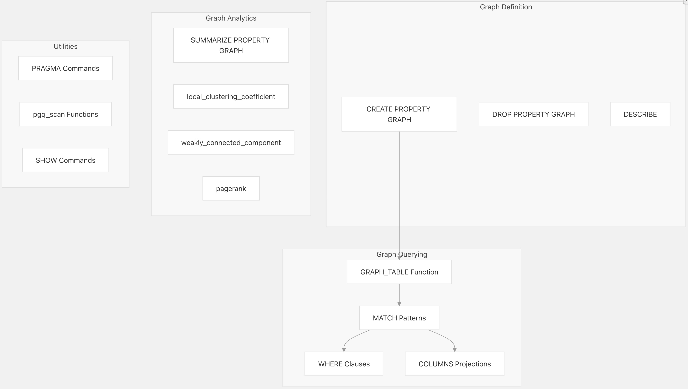
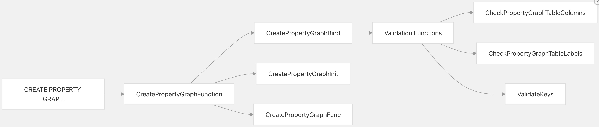
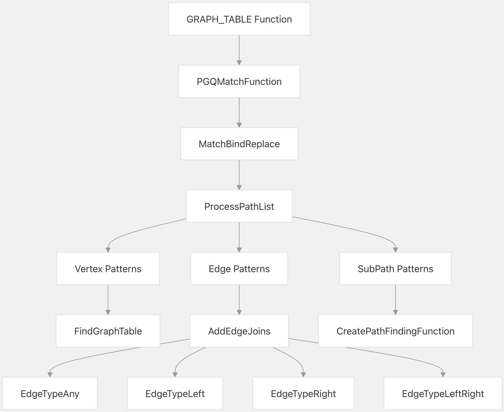
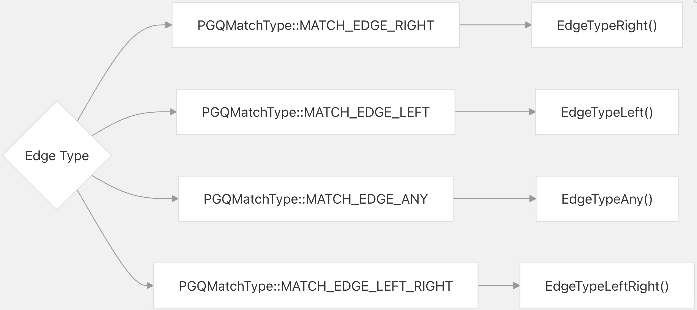
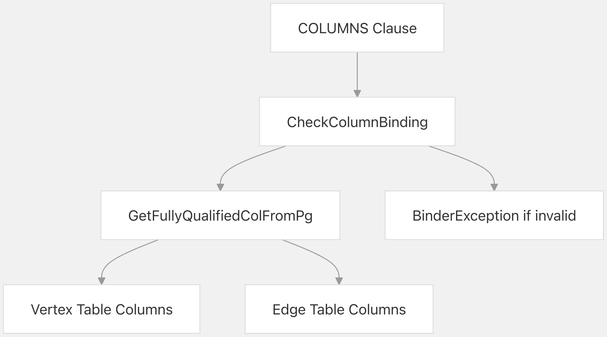
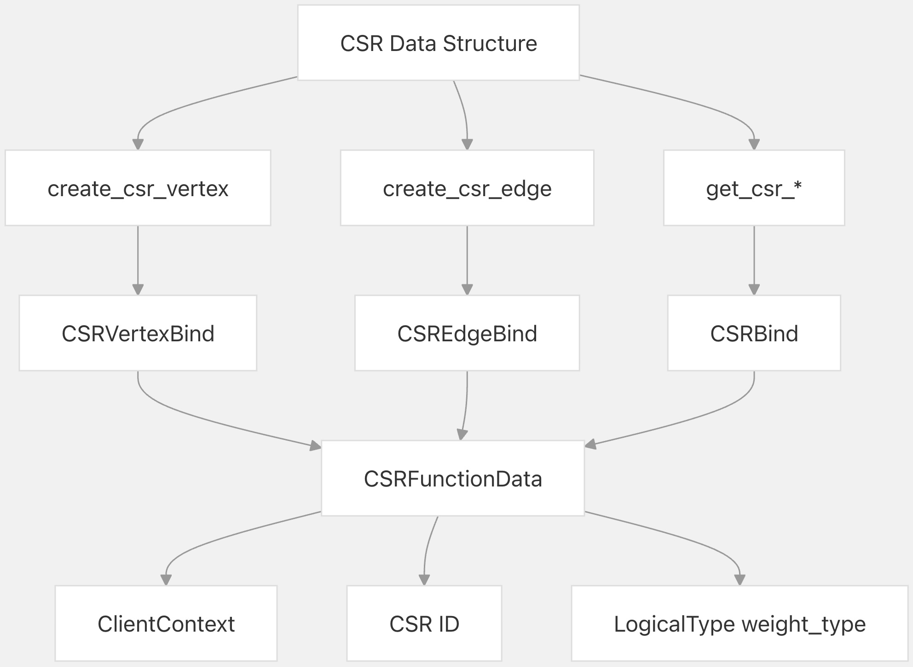

## DuckPGQ 源码学习: 8.1 SQL 语法参考 (`SQL Syntax Reference`)  
                                            
### 作者                                            
digoal                                            
                                            
### 日期                                            
2025-11-08                                            
                                            
### 标签                                            
DuckDB , PGQ , 属性图 , DuckPGQ , 源码学习                                            
                                            
----                       
                                            
## 背景       
本文介绍 `DuckPGQ` 扩展 (`extension`) 提供的所有 `SQL` 语法扩展和功能的完整参考。涵盖了属性图 (`property graph`) 定义、模式匹配 (`pattern matching`) 查询、图分析 (`graph analytics`) 功能和实用工具命令 (`utility commands`)。  
  
## Overview  
  
## 概述 (`Overview`)  
  
`DuckPGQ` 扩展了 `DuckDB` 的 `SQL` 语法，增加了图 (`graph`) 特定的结构，主要分为以下几类：  
  
  
  
来源: [`src/core/functions/table/create_property_graph.cpp` 1-462](https://github.com/cwida/duckpgq-extension/blob/db304f58/src/core/functions/table/create_property_graph.cpp#L1-L462) [`src/core/functions/table/match.cpp` 1-100](https://github.com/cwida/duckpgq-extension/blob/db304f58/src/core/functions/table/match.cpp#L1-L100) [`src/core/functions/table/summarize_property_graph.cpp` 1-418](https://github.com/cwida/duckpgq-extension/blob/db304f58/src/core/functions/table/summarize_property_graph.cpp#L1-L418)  
  
## CREATE PROPERTY GRAPH（创建属性图）  
  
### 基本语法 (`Basic Syntax`)  
  
```  
CREATE [OR REPLACE] PROPERTY GRAPH graph_name  
VERTEX TABLES (  
    table_specification [, ...]  
)  
[EDGE TABLES (  
    edge_specification [, ...]  
)]  
```  
  
### 函数映射 (`Function Mapping`)  
  
  
  
来源: [`src/core/functions/table/create_property_graph.cpp` 170-289](https://github.com/cwida/duckpgq-extension/blob/db304f58/src/core/functions/table/create_property_graph.cpp#L170-L289) [`src/include/duckpgq/core/functions/table/create_property_graph.hpp` 19-82](https://github.com/cwida/duckpgq-extension/blob/db304f58/src/include/duckpgq/core/functions/table/create_property_graph.hpp#L19-L82)  
  
### 顶点表 (`Vertex Table`) 规范  
  
| 语法组件 (`Syntax Component`) | 描述 (`Description`) | 示例 (`Example`) |  
| :--- | :--- | :--- |  
| `table_name` | 基础表名 (`Base table name`) | `Person` |  
| `LABEL label_name` | 顶点标签 (`Vertex label`) (默认: 表名) | `LABEL Person` |  
| `PROPERTIES (column_list)` | 要包含的特定列 (`Specific columns`) | `PROPERTIES (id, name)` |  
| `PROPERTIES (*)` | 包含所有列 (`Include all columns`) | `PROPERTIES (*)` |  
| `PROPERTIES (* EXCEPT (column_list))` | 除指定列外的所有列 (`All columns except specified`) | `PROPERTIES (* EXCEPT (internal_id))` |  
  
#### 完整的顶点表 (`Vertex Table`) 语法  
  
```  
[catalog.]schema.table_name   
[AS alias]  
[LABEL label_name]  
[PROPERTIES (property_specification)]  
```  
  
其中 `property_specification`（属性规范）是以下之一：  
  
  * `column_name [AS alias] [, ...]` （列名 `column_name` [`AS` 别名 `alias`] [, ...]）  
  * `*` （所有列）  
  * `* EXCEPT (column_name [, ...])` （除指定列外的所有列）  
  
来源: [`src/core/functions/table/create_property_graph.cpp` 35-70](https://github.com/cwida/duckpgq-extension/blob/db304f58/src/core/functions/table/create_property_graph.cpp#L35-L70) [`test/sql/create_pg/attach_pg.test` 47-51](https://github.com/cwida/duckpgq-extension/blob/db304f58/test/sql/create_pg/attach_pg.test#L47-L51)  
  
### 边表 (`Edge Table`) 规范  
  
```  
[catalog.]schema.table_name  
[AS alias]  
SOURCE KEY (column_list) REFERENCES vertex_table (column_list)  
DESTINATION KEY (column_list) REFERENCES vertex_table (column_list)  
[PROPERTIES (property_specification)]  
[LABEL label_name]  
```  
  
#### 键关系 (`Key Relationship`) 验证  
  
该扩展会自动检测主键-外键 (`primary key-foreign key`) 关系，或者需要显式 (`explicit`) 指定：  
  
| 场景 (`Scenario`) | 所需语法 (`Syntax Required`) |  
| :--- | :--- |  
| 单个外键 (`FK`) 关系 | `SOURCE vertex_table DESTINATION vertex_table` |  
| 多个外键 (`FK`) 关系 | 必须显式指定 (`explicit`) `SOURCE KEY ... REFERENCES ...` |  
| 没有外键 (`FK`) 约束 (`constraints`) | 必须显式指定 (`explicit`) `SOURCE KEY ... REFERENCES ...` |  
  
来源: [`src/core/functions/table/create_property_graph.cpp` 72-128](https://github.com/cwida/duckpgq-extension/blob/db304f58/src/core/functions/table/create_property_graph.cpp#L72-L128) [`test/sql/create_pg/create_pg_with_pk_fk.test` 23-28](https://github.com/cwida/duckpgq-extension/blob/db304f58/test/sql/create_pg/create_pg_with_pk_fk.test#L23-L28)  
  
### 模式 (`Schema`) 和目录 (`Catalog`) 支持  
  
`DuckPGQ` 支持跨模式 (`schemas`) 和目录 (`catalogs`) 的完全限定表名 (`fully qualified table names`)：  
  
```  
-- Cross-schema example  
CREATE PROPERTY GRAPH cross_schema_graph  
VERTEX TABLES (  
    schema1.Person,  
    schema2.Company    
)  
EDGE TABLES (  
    schema2.WorksAt SOURCE KEY (person_id) REFERENCES schema1.Person (id)  
                    DESTINATION KEY (company_id) REFERENCES schema2.Company (id)  
);  
  
-- Attached database example    
CREATE PROPERTY GRAPH external_graph  
VERTEX TABLES (  
    attached_db.schema.Person  
)  
EDGE TABLES (  
    attached_db.schema.Follows SOURCE KEY (follower) REFERENCES attached_db.schema.Person (id)  
                               DESTINATION KEY (followed) REFERENCES attached_db.schema.Person (id)  
);  
```  
  
来源: [`test/sql/211_using_other_schemas.test` 120-129](https://github.com/cwida/duckpgq-extension/blob/db304f58/test/sql/211_using_other_schemas.test#L120-L129) [`test/sql/create_pg/attach_pg.test` 47-51](https://github.com/cwida/duckpgq-extension/blob/db304f58/test/sql/create_pg/attach_pg.test#L47-L51)  
  
## GRAPH\_TABLE 函数  
  
### 基本语法 (`Basic Syntax`)  
  
```  
FROM GRAPH_TABLE (  
    graph_name   
    MATCH path_pattern [, path_pattern ...]  
    [WHERE condition]  
    [COLUMNS (column_specification [, ...])]  
)  
```  
  
### 模式匹配 (`Pattern Matching`) 架构  
  
  
  
来源: [`src/core/functions/table/match.cpp` 133-145](https://github.com/cwida/duckpgq-extension/blob/db304f58/src/core/functions/table/match.cpp#L133-L145) [`src/include/duckpgq/core/functions/table/match.hpp` 27-183](https://github.com/cwida/duckpgq-extension/blob/db304f58/src/include/duckpgq/core/functions/table/match.hpp#L27-L183)  
  
### 顶点模式 (`Vertex Patterns`)  
  
| 模式 (`Pattern`) | 语法 (`Syntax`) | 描述 (`Description`) |  
| :--- | :--- | :--- |  
| 匿名顶点 (`Anonymous vertex`) | `()` | 匹配任何顶点 (`vertex`) |  
| 带标签的顶点 (`Labeled vertex`) | `(alias:label)` | 匹配具有特定标签 (`label`) 的顶点 |  
| 变量绑定 (`Variable binding`) | `(v)` | 将顶点绑定到变量 `v` |  
| 组合 (`Combined`) | `(v:Person)` | 带标签的顶点 (`Labeled vertex`) 和变量绑定 (`variable binding`) |  
  
#### 带条件的顶点模式 (`Vertex Pattern with Conditions`)  
  
```  
-- Vertex with WHERE condition  
FROM GRAPH_TABLE (  
    social_graph   
    MATCH (p:Person WHERE p.age > 25)  
    COLUMNS (p.name, p.age)  
)  
```  
  
来源: [`src/core/functions/table/match.cpp` 432-450](https://github.com/cwida/duckpgq-extension/blob/db304f58/src/core/functions/table/match.cpp#L432-L450) [`test/sql/create_pg/attach_pg.test` 89-101](https://github.com/cwida/duckpgq-extension/blob/db304f58/test/sql/create_pg/attach_pg.test#L89-L101)  
  
### 边模式 (`Edge Patterns`)  
  
| 方向 (`Direction`) | 语法 (`Syntax`) | 描述 (`Description`) |  
| :--- | :--- | :--- |  
| 右向 (`Right`) | `-[e:label]->` | 从左到右的有向边 (`Directed edge`) |  
| 左向 (`Left`) | `<-[e:label]-` | 从右到左的有向边 (`Directed edge`) |  
| 无向 (`Undirected`) | `-[e:label]-` | 无向边 (`Undirected edge`) |  
| 任意方向 (`Any direction`) | `-[e:label]<->` | 双向边 (`Bidirectional edge`) |  
  
#### 边模式 (`Edge Pattern`) 处理  
  
系统将边方向类型 (`edge direction types`) 映射到特定的处理函数 (`processing functions`)：  
  
  
  
来源: [`src/core/functions/table/match.cpp` 686-722](https://github.com/cwida/duckpgq-extension/blob/db304f58/src/core/functions/table/match.cpp#L686-L722) [`src/core/functions/table/match.cpp` 291-430](https://github.com/cwida/duckpgq-extension/blob/db304f58/src/core/functions/table/match.cpp#L291-L430)  
  
### 路径量词 (`Path Quantifiers`)  
  
| 量词 (`Quantifier`) | 语法 (`Syntax`) | 描述 (`Description`) |  
| :--- | :--- | :--- |  
| 固定长度 (`Fixed length`) | `-[e:label]{n}->` | 恰好 `n` 跳 (`hops`) |  
| 范围 (`Range`) | `-[e:label]{n,m}->` | 介于 `n` 和 `m` 跳之间 |  
| 无限制 (`Unlimited`) | `-[e:label]*->` | 零或多跳 |  
| 至少一跳 (`At least one`) | `-[e:label]+->` | 一或多跳 |  
  
#### 最短路径模式 (`Shortest Path Patterns`)  
  
```  
-- Any shortest path  
FROM GRAPH_TABLE (  
    graph_name  
    MATCH p = ANY SHORTEST (a:Person)-[e:Knows]*->(b:Person)  
    COLUMNS (element_id(p) as path, a.name, b.name)  
)  
  
-- Path length constraints    
FROM GRAPH_TABLE (  
    graph_name  
    MATCH (a:Person)-[e:Knows]{1,3}->(b:Person)  
    COLUMNS (a.name, b.name)  
)  
```  
  
来源: [`src/core/functions/table/match.cpp` 724-758](https://github.com/cwida/duckpgq-extension/blob/db304f58/src/core/functions/table/match.cpp#L724-L758) [`test/sql/create_pg/attach_pg.test` 103-118](https://github.com/cwida/duckpgq-extension/blob/db304f58/test/sql/create_pg/attach_pg.test#L103-L118)  
  
### COLUMNS 子句 (`Clause`)  
  
`COLUMNS` 子句指定从匹配的模式 (`pattern`) 中返回哪些属性 (`properties`)：  
  
| 语法 (`Syntax`) | 描述 (`Description`) | 示例 (`Example`) |  
| :--- | :--- | :--- |  
| `alias.property` | 顶点/边属性 (`Vertex/edge property`) | `p.name` |  
| `alias.*` | 元素 (`element`) 的所有属性 | `p.*` |  
| `expression AS alias` | 计算表达式 (`Computed expression`) | `p.age + 1 AS next_age` |  
| `function(alias)` | 元素上的函数 (`Function on element`) | `element_id(path)` |  
  
#### 列验证 (`Column Validation`)  
  
系统验证所有引用的列 (`columns`) 在属性图 (`property graph`) 中都可用 (`available`)：  
  
  
  
来源: [`src/core/functions/table/match.cpp` 67-83](https://github.com/cwida/duckpgq-extension/blob/db304f58/src/core/functions/table/match.cpp#L67-L83) [`test/sql/create_pg/attach_pg.test` 167-176](https://github.com/cwida/duckpgq-extension/blob/db304f58/test/sql/create_pg/attach_pg.test#L167-L176)  
  
## 图分析函数 (`Graph Analytics Functions`)  
  
### SUMMARIZE PROPERTY GRAPH（汇总属性图）  
  
生成关于属性图 (`property graph`) 结构的综合统计数据 (`comprehensive statistics`)：  
  
```  
FROM summarize_property_graph('graph_name')  
```  
  
#### 输出模式 (`Output Schema`)  
  
| 列 (`Column`) | 类型 (`Type`) | 描述 (`Description`) |  
| :--- | :--- | :--- |  
| `table_name` | VARCHAR | 顶点/边表 (`vertex/edge table`) 的名称 |  
| `is_vertex_table` | BOOLEAN | 是否为顶点表 (`vertex table`) |  
| `source_table` | VARCHAR | 边的源表 (`Source table`) (顶点为 `NULL`) |  
| `destination_table` | VARCHAR | 边的目标表 (`Destination table`) (顶点为 `NULL`) |  
| `vertex_count` | BIGINT | 顶点数量 (`Number of vertices`) (边为 `NULL`) |  
| `edge_count` | BIGINT | 边数量 (`Number of edges`) (顶点为 `NULL`) |  
| `unique_source_count` | BIGINT | 不同的源顶点 (`Distinct source vertices`) |  
| `unique_destination_count` | BIGINT | 不同的目标顶点 (`Distinct destination vertices`) |  
| `isolated_sources` | BIGINT | 没有出边 (`outgoing edges`) 的源顶点 (`Source vertices`) |  
| `isolated_destinations` | BIGINT | 没有入边 (`incoming edges`) 的目标顶点 (`Destination vertices`) |  
| 度数统计 (`Degree statistics`) | DOUBLE | 入/出度 (`in/out degrees`) 的平均值/最小值/最大值/25分位数/中位数/75分位数 (`avg/min/max/q25/q50/q75`) |  
  
来源: [`src/core/functions/table/summarize_property_graph.cpp` 161-322](https://github.com/cwida/duckpgq-extension/blob/db304f58/src/core/functions/table/summarize_property_graph.cpp#L161-L322) [`test/sql/summarize_property_graph.test` 18-50](https://github.com/cwida/duckpgq-extension/blob/db304f58/test/sql/summarize_property_graph.test#L18-L50)  
  
### 图算法函数 (`Graph Algorithm Functions`)  
  
#### 局部聚类系数 (`Local Clustering Coefficient`)  
  
```  
FROM local_clustering_coefficient(graph_name, vertex_table, edge_table)  
```  
  
返回每个顶点 (`vertex`) 的局部聚类系数 (`local clustering coefficient`)，衡量一个顶点的邻居 (`neighbors`) 彼此之间的连接程度。  
  
#### 弱连通分量 (`Weakly Connected Components`)  
  
```  
FROM weakly_connected_component(graph_name, vertex_table, edge_table)  
```  
  
识别图中的连通分量 (`connected components`)，为每个顶点分配一个分量 `ID`。  
  
#### PageRank（网页排名）  
  
```  
FROM pagerank(graph_name, vertex_table, edge_table)  
```  
  
计算图中所有顶点 (`vertices`) 的 PageRank 分数 (`scores`)。  
  
来源: [`src/core/functions/table/CMakeLists.txt` 5-10](https://github.com/cwida/duckpgq-extension/blob/db304f58/src/core/functions/table/CMakeLists.txt#L5-L10) [`test/sql/create_pg/attach_pg.test` 121-152](https://github.com/cwida/duckpgq-extension/blob/db304f58/test/sql/create_pg/attach_pg.test#L121-L152)  
  
## 实用工具函数和命令 (`Utility Functions and Commands`)  
  
### PRAGMA 命令  
  
`DuckPGQ` 提供了用于图实用工具的 `PRAGMA` 函数：  
  
| 命令 (`Command`) | 描述 (`Description`) |  
| :--- | :--- |  
| `PRAGMA create_vertex_table(...)` | 从现有数据创建顶点表 (`vertex table`) |  
| `PRAGMA show_property_graphs()` | 列出所有已注册的属性图 (`property graphs`) |  
  
### 表函数 (`Table Functions`)  
  
#### pgq\_scan 函数  
  
这些函数提供对内部图数据结构 (`internal graph data structures`) 的访问：  
  
```  
-- Scan CSR (Compressed Sparse Row) data  
SELECT * FROM pgq_scan(csr_id, scan_type, ...);  
```  
  
`pgq_scan` 函数允许直接访问用于高效图遍历 (`graph traversal`) 的内部 `CSR` (`Compressed Sparse Row`) 表示。  
  
来源: [`src/core/functions/table/CMakeLists.txt` 8-8](https://github.com/cwida/duckpgq-extension/blob/db304f58/src/core/functions/table/CMakeLists.txt#L8-L8) [`src/include/duckpgq/core/functions/table.hpp` 14-16](https://github.com/cwida/duckpgq-extension/blob/db304f58/src/include/duckpgq/core/functions/table.hpp#L14-L16)  
  
### DESCRIBE 和 SHOW 命令  
  
```  
-- Describe property graph structure  
DESCRIBE property_graph_name;  
  
-- Show summary statistics  
SUMMARIZE property_graph_name;  
```  
  
这些命令提供有关已注册属性图 (`property graphs`) 的元数据 (`metadata`) 和统计信息。  
  
来源: [`src/core/parser/duckpgq_parser.cpp` 89-105](https://github.com/cwida/duckpgq-extension/blob/db304f58/src/core/parser/duckpgq_parser.cpp#L89-L105) [`src/include/duckpgq/core/functions/table/summarize_property_graph.hpp` 18-67](https://github.com/cwida/duckpgq-extension/blob/db304f58/src/include/duckpgq/core/functions/table/summarize_property_graph.hpp#L18-L67)  
  
## CSR 数据结构集成 (`Data Structure Integration`)  
  
### CSR 函数映射 (`Function Mapping`)  
  
  
  
**CSR**（压缩稀疏行，`Compressed Sparse Row`）数据结构是用于高效图操作 (`graph operations`) 的内部表示。这些函数在 `SQL` 和内部图算法 (`internal graph algorithms`) 之间架起了桥梁。  
  
来源: [`src/core/utils/compressed_sparse_row.cpp` 73-117](https://github.com/cwida/duckpgq-extension/blob/db304f58/src/core/utils/compressed_sparse_row.cpp#L73-L117) [`src/include/duckpgq/core/utils/compressed_sparse_row.hpp` 49-66](https://github.com/cwida/duckpgq-extension/blob/db304f58/src/include/duckpgq/core/utils/compressed_sparse_row.hpp#L49-L66)  
  
### 路径查找函数 (`Path Finding Functions`)  
  
`DuckPGQ` 提供了与 `CSR` 表示集成 (`integrate`) 的专门路径查找函数：  
  
| 函数 (`Function`) | 目的 (`Purpose`) |  
| :--- | :--- |  
| `shortestpath` | 查找顶点之间的最短路径 (`shortest path`) |  
| `iterativelength` | 迭代计算路径长度 (`path length iteratively`) |  
| `create_csr_vertex` | 初始化 `CSR` 顶点数据 (`vertex data`) |  
| `create_csr_edge` | 初始化 `CSR` 边数据 (`edge data`) |  
  
这些函数是自动生成的，并由 `MATCH` 模式处理器 (`pattern processor`) 在内部用于复杂的路径查询。  
  
来源: [`src/core/functions/table/match.cpp` 454-520](https://github.com/cwida/duckpgq-extension/blob/db304f58/src/core/functions/table/match.cpp#L454-L520) [`src/core/utils/compressed_sparse_row.cpp` 418-603](https://github.com/cwida/duckpgq-extension/blob/db304f58/src/core/utils/compressed_sparse_row.cpp#L418-L603)  
      
#### [PolarDB 学习图谱](https://www.aliyun.com/database/openpolardb/activity "8642f60e04ed0c814bf9cb9677976bd4")
  
  
#### [PostgreSQL 解决方案集合](../201706/20170601_02.md "40cff096e9ed7122c512b35d8561d9c8")
  
  
#### [德哥 / digoal's Github - 公益是一辈子的事.](https://github.com/digoal/blog/blob/master/README.md "22709685feb7cab07d30f30387f0a9ae")
  
  
#### [About 德哥](https://github.com/digoal/blog/blob/master/me/readme.md "a37735981e7704886ffd590565582dd0")
  
  

  
