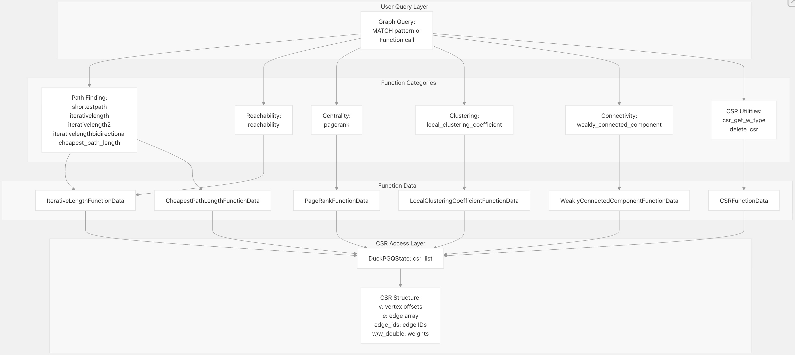
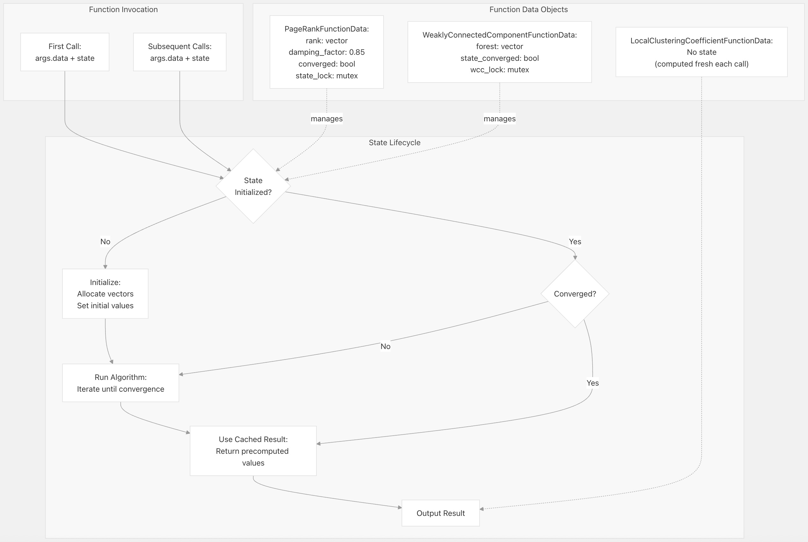
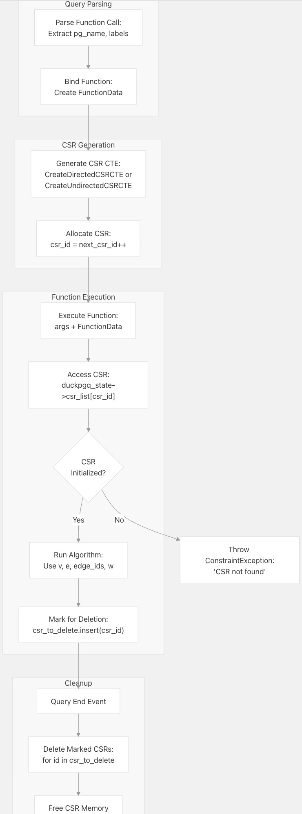
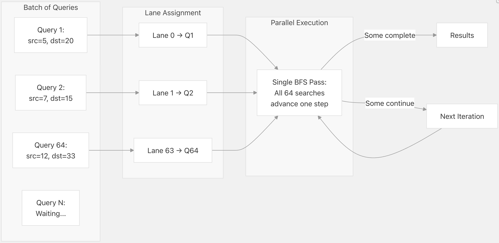
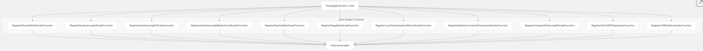

## DuckPGQ 源码学习: 8.2 函数参考 (Function Reference)  
                                              
### 作者                                              
digoal                                              
                                              
### 日期                                              
2025-11-08                                              
                                              
### 标签                                              
DuckDB , PGQ , 属性图 , DuckPGQ , 源码学习                                              
                                              
----                         
                                              
## 背景     
本文分享 DuckPGQ 中所有标量函数 (scalar functions) 和表函数 (table functions) 的全面参考文档。这些函数作用于属性图 (property graphs) 和 `CSR` (Compressed Sparse Row，压缩稀疏行) 结构，以执行图分析 (graph analytics)、路径查找 (path finding) 和连通性分析 (connectivity analysis)。  
  
-----  
  
## 函数分类 (Function Categories)  
  
DuckPGQ 提供了以下类别的函数：  
  
| 类别 (Category) | 函数 (Functions) | 目的 (Purpose) |  
| :--- | :--- | :--- |  
| **路径查找 (Path Finding)** | `shortestpath`, `iterativelength`, `iterativelength2`, `iterativelengthbidirectional`, `cheapest_path_length` | 查找顶点之间的路径并计算路径长度 (path lengths) |  
| **可达性 (Reachability)** | `reachability` | 测试一个顶点是否可以到达另一个顶点 |  
| **中心性 (Centrality)** | `pagerank` | 计算顶点重要性指标 (vertex importance metrics) |  
| **聚类 (Clustering)** | `local_clustering_coefficient` (标量和表) | 衡量局部图聚类 (local graph clustering) |  
| **连通性 (Connectivity)** | `weakly_connected_component` (标量和表) | 识别连通分量 (connected components) |  
| **CSR 工具函数 (CSR Utilities)** | `csr_get_w_type`, `delete_csr` | 管理 `CSR` 结构 |  
  
-----  
  
## 函数概览架构 (Function Overview Architecture)  
  
    
  
来源: [`src/core/functions/scalar/shortest_path.cpp` 1-219](https://github.com/cwida/duckpgq-extension/blob/db304f58/src/core/functions/scalar/shortest_path.cpp#L1-L219) [`src/core/functions/scalar/pagerank.cpp` 1-122](https://github.com/cwida/duckpgq-extension/blob/db304f58/src/core/functions/scalar/pagerank.cpp#L1-L122) [`src/core/functions/scalar/local_clustering_coefficient.cpp` 1-84](https://github.com/cwida/duckpgq-extension/blob/db304f58/src/core/functions/scalar/local_clustering_coefficient.cpp#L1-L84) [`src/core/functions/scalar/weakly_connected_component.cpp` 1-116](https://github.com/cwida/duckpgq-extension/blob/db304f58/src/core/functions/scalar/weakly_connected_component.cpp#L1-L116)  
  
-----  
  
## 路径查找函数 (Path Finding Functions)  
  
### shortestpath  
  
**签名 (Signature):**  
  
```sql  
shortestpath(csr_id INTEGER, v_size BIGINT, src BIGINT, dst BIGINT) → LIST(BIGINT)  
```  
  
**目的 (Purpose):**  
计算源顶点 (`source vertex`) 和目标顶点 (`destination vertex`) 之间的最短路径 (`shortest path`)，将完整的路径作为交替出现的顶点 (`vertex`) 和边 (`edge`) `ID` 列表返回。  
  
**参数 (Parameters):**  
  
  * `csr_id`: `CSR` 结构标识符  
  * `v_size`: 图中顶点的数量  
  * `src`: 源顶点 `ID`  
  * `dst`: 目标顶点 `ID`  
  
**返回值 (Return Value):**  
包含路径的列表，格式为 `[src_vertex, edge_1, vertex_1, edge_2, ..., dst_vertex]`。如果路径不存在或源无效，则返回 `NULL`。  
  
**算法 (Algorithm):**  
执行广度优先搜索 (`breadth-first search`, **BFS**)，使用位集 (`bitsets`) 进行 `SIMD` 风格的并行化 (`SIMD-style parallelization`)。最多处理 `LANE_LIMIT` (64) 个并发搜索 (`concurrent searches`)。跟踪父顶点 (`parent vertices`) 和边 (`edges`) 以重建路径 (`reconstruct paths`)。  
  
**实现细节 (Implementation Details):**  
  
  * 使用三个位集数组 (`bitset arrays`)：`seen`、`visit1`、`visit2` 进行高效的 `BFS` 遍历 (`traversal`)  
  * 维护 `parents_v` 和 `parents_e` 数组，以存储父顶点和父边，用于路径重建 (`path reconstruction`)  
  * 当搜索到达其目标时，通过反向跟踪父指针 (`parent pointers`) 来重建路径  
  * 特殊情况：如果 `src == dst`，返回一个包含源顶点的单元素列表  
  
**示例 (Example):**  
  
```sql  
SELECT shortestpath(csr_id, 1000, 5, 20) AS path;  
-- Returns: [5, 12, 7, 45, 20] (vertex 5 → edge 12 → vertex 7 → edge 45 → vertex 20)  
```  
  
来源: [`src/core/functions/scalar/shortest_path.cpp` 11-207](https://github.com/cwida/duckpgq-extension/blob/db304f58/src/core/functions/scalar/shortest_path.cpp#L11-L207)  
  
-----  
  
### iterativelength  
  
**签名 (Signature):**  
  
```sql  
iterativelength(csr_id INTEGER, v_size BIGINT, src BIGINT, dst BIGINT) → BIGINT  
```  
  
**目的 (Purpose):**  
计算源顶点和目标顶点之间的最短路径长度 (`length of the shortest path`)，而无需构建完整的路径 (`constructing the full path`)。  
  
**参数 (Parameters):**  
  
  * `csr_id`: `CSR` 结构标识符  
  * `v_size`: 图中顶点的数量  
  * `src`: 源顶点 `ID`  
  * `dst`: 目标顶点 `ID`  
  
**返回值 (Return Value):**  
路径长度（整数）。如果 `src == dst`，返回 `0`；如果路径不存在或源无效，返回 `NULL`。  
  
**算法 (Algorithm):**  
执行 `BFS`，使用 `SIMD` 风格的位集并行化 (`SIMD-style bitset parallelization`)。当仅需要路径长度时，比 `shortestpath` 更高效（没有父跟踪开销 `no parent tracking overhead`）。  
  
**实现细节 (Implementation Details):**  
  
  * 并发处理最多 `LANE_LIMIT` 个搜索，使用位集  
  * 在奇数/偶数迭代中，在 `visit1` 和 `visit2` 数组之间交替  
  * 当目标顶点在 `seen` 数组中被到达时，检测完成  
  * 对于 `src == dst` 的情况（长度为 0）进行提前终止  
  
**示例 (Example):**  
  
```sql  
SELECT iterativelength(csr_id, 1000, 5, 20) AS length;  
-- Returns: 2 (two hops from vertex 5 to vertex 20)  
```  
  
来源: [`src/core/functions/scalar/iterativelength.cpp` 12-144](https://github.com/cwida/duckpgq-extension/blob/db304f58/src/core/functions/scalar/iterativelength.cpp#L12-L144)  
  
-----  
  
### iterativelength2  
  
**签名 (Signature):**  
  
```sql  
iterativelength2(csr_id INTEGER, v_size BIGINT, src BIGINT, dst BIGINT) → BIGINT  
```  
  
**目的 (Purpose):**  
`iterativelength` 的变体，具有优化的内存访问模式 (`optimized memory access patterns`)。计算最短路径长度。  
  
**参数 (Parameters):**  
与 `iterativelength` 相同  
  
**返回值 (Return Value):**  
与 `iterativelength` 相同  
  
**算法 (Algorithm):**  
与 `iterativelength` 类似的 `BFS`，但采用不同的访问更新策略 (`visitation update strategy`)，在某些图结构上可能表现更好。  
  
**与 iterativelength 的主要区别 (Key Differences from iterativelength):**  
  
  * 更新 `seen` 数组的方式不同：在每次迭代开始时 `seen[v] |= visit[v]`  
  * 由于访问模式的差异，可能具有不同的缓存行为 (`cache behavior`)  
  
**示例 (Example):**  
  
```sql  
SELECT iterativelength2(csr_id, 1000, 5, 20) AS length;  
```  
  
来源: [`src/core/functions/scalar/iterativelength2.cpp` 13-131](https://github.com/cwida/duckpgq-extension/blob/db304f58/src/core/functions/scalar/iterativelength2.cpp#L13-L131)  
  
-----  
  
### iterativelengthbidirectional  
  
**签名 (Signature):**  
  
```sql  
iterativelengthbidirectional(csr_id INTEGER, v_size BIGINT, src BIGINT, dst BIGINT) → BIGINT  
```  
  
**目的 (Purpose):**  
使用双向 `BFS` (`bidirectional BFS`) 计算最短路径长度，通过同时从两个端点搜索，对于长路径可以更快。  
  
**参数 (Parameters):**  
与 `iterativelength` 相同  
  
**返回值 (Return Value):**  
与 `iterativelength` 相同  
  
**算法 (Algorithm):**  
同时从源点和目标点执行 `BFS`。当两个搜索前沿 (`search frontiers`) 相交时停止。  
  
**实现细节 (Implementation Details):**  
  
  * 为前向搜索维护单独的 `src_seen`、`src_visit1`、`src_visit2` 数组  
  * 为后向搜索维护单独的 `dst_seen`、`dst_visit1`、`dst_visit2` 数组  
  * 使用 `InterSectFronteers()` 检测前沿何时相遇  
  * 交替进行前向和后向扩展步骤  
  * 路径长度在相交发生时确定  
  
**使用时机 (When to Use):**  
对于查找源点和目标点相距较远的大型图中的路径最为有效。  
  
**示例 (Example):**  
  
```sql  
SELECT iterativelengthbidirectional(csr_id, 1000, 5, 20) AS length;  
```  
  
来源: [`src/core/functions/scalar/iterativelength_bidirectional.cpp` 12-154](https://github.com/cwida/duckpgq-extension/blob/db304f58/src/core/functions/scalar/iterativelength_bidirectional.cpp#L12-L154)  
  
-----  
  
### cheapest\_path\_length  
  
**签名 (Signature):**  
  
```sql  
cheapest_path_length(csr_id INTEGER, v_size BIGINT, src BIGINT, dst BIGINT) → INTEGER | DOUBLE  
```  
  
**目的 (Purpose):**  
使用 **Bellman-Ford** 算法计算源点和目标点之间路径的最小总权重 (`minimum total weight`)。处理正 (`positive`) 和负 (`negative`) 边权重。  
  
**参数 (Parameters):**  
与 `iterativelength` 相同  
  
**返回值 (Return Value):**  
最小路径权重。如果 `CSR` 具有整数权重，返回类型为 `INTEGER`；如果 `CSR` 具有双精度权重，返回类型为 `DOUBLE`。如果路径不存在，返回 `NULL`。  
  
**算法 (Algorithm):**  
Bellman-Ford 单源最短路径算法 (`Bellman-Ford single-source shortest path algorithm`)，带有针对多个查询的批量处理 (`batched processing`)。  
  
**实现细节 (Implementation Details):**  
  
  * 模板函数 (`Template function`) 支持 `int64_t` 和 `double` 两种权重类型  
  * 将距离向量初始化为 `std::numeric_limits<T>::max() / 2`  
  * 重复松弛 (`Relaxes`) 所有边，直到不能再进行改进  
  * 分批次处理多个搜索（批次大小：256、128、64、16、8、4、2、1）  
  * 使用 `CSR` 权重数组：`csr->w` 用于整数权重，`csr->w_double` 用于双精度权重  
  
**复杂度 (Complexity):**  
$O(V \cdot E)$ ，其中 $V$ 是顶点数， $E$ 是边数  
  
**示例 (Example):**  
  
```sql  
-- Integer weights  
SELECT cheapest_path_length(csr_id, 1000, 5, 20) AS cost;  
-- Returns: 47 (total weight of cheapest path)  
  
-- Double weights  
SELECT cheapest_path_length(csr_id, 1000, 5, 20) AS cost;  
-- Returns: 47.5 (total weight of cheapest path)  
```  
  
来源: [`src/core/functions/scalar/cheapest_path_length.cpp` 12-163](https://github.com/cwida/duckpgq-extension/blob/db304f58/src/core/functions/scalar/cheapest_path_length.cpp#L12-L163)  
  
-----  
  
## 路径查找的并行处理架构 (Parallel Processing Architecture for Path Finding)  
  
    
  
来源: [`src/core/functions/scalar/shortest_path.cpp` 11-40](https://github.com/cwida/duckpgq-extension/blob/db304f58/src/core/functions/scalar/shortest_path.cpp#L11-L40) [`src/core/functions/scalar/iterativelength.cpp` 12-32](https://github.com/cwida/duckpgq-extension/blob/db304f58/src/core/functions/scalar/iterativelength.cpp#L12-L32) [`src/core/functions/scalar/iterativelength2.cpp` 13-31](https://github.com/cwida/duckpgq-extension/blob/db304f58/src/core/functions/scalar/iterativelength2.cpp#L13-L31)  
  
-----  
  
## 可达性函数 (Reachability Functions)  
  
### reachability (可达性)  
  
**签名 (Signature):**  
  
```sql  
reachability(csr_id INTEGER, is_variant BOOLEAN, v_size BIGINT, src BIGINT, dst BIGINT) → BOOLEAN  
```  
  
**用途 (Purpose):**  
测试目标顶点 **(destination vertices)** 是否可从源顶点 **(source vertices)** 到达。当仅需要连通性信息 **(connectivity information)** 而不需要路径查找 **(path-finding)** 函数时，该函数效率更高。  
  
**参数 (Parameters):**  
  
  * `csr_id`: **CSR** 结构 **(CSR structure)** 标识符。  
  * `is_variant`: 如果为 `true`，则使用自适应算法选择 **(adaptive algorithm selection)**；如果为 `false`，则使用标准 **BFS** (广度优先搜索)。  
  * `v_size`: 图中顶点 **(vertices)** 的数量。  
  * `src`: 源顶点 **ID** (**Source vertex ID**)。  
  * `dst`: 目标顶点 **ID** (**Destination vertex ID**)。  
  
**返回值 (Return Value):**  
如果 `dst` 可从 `src` 到达，则为 `true`，否则为 `false`。  
  
**算法 (Algorithm):**  
具有自适应策略选择 **(adaptive strategy selection)** 的多模式 **BFS** (**Multi-mode BFS**)，该策略基于边界大小 **(frontier size)** 进行选择。  
  
以下是您请求的翻译内容，已根据您的要求保留了关键术语的原文和译文：  
  
**自适应模式 (Adaptive Modes)（当 `is_variant=true` 时）:**  
  
| 模式 (Mode) | 名称 (Name) | 使用时机 (When Used) | 描述 (Description) |  
| :--- | :--- | :--- | :--- |  
| 0 | `NO_ARRAY` | **小前沿**（Small frontiers） | 不带访问列表跟踪的 **标准广度优先搜索**（Standard BFS） |  
| 1 | `ARRAY` | **中等前沿**（Medium frontiers） | 在 **数组**（array）中跟踪已访问的顶点，以实现更快的 **迭代**（iteration） |  
| 2 | `INTERMEDIATE` | **大前沿**（Large frontiers） | 计算 **前沿大小**（frontier size）时不进行 **数组分配**（array allocation） |  
  
**模式选择逻辑 (Mode Selection Logic):**  
  
* 从模式 0 (`NO_ARRAY`) 开始。  
* 当 `visit_list.size() > 0` 时，切换到模式 1 (`ARRAY`)。  
* 当 `visit_list.size() > v_size / VISIT_SIZE_DIVISOR` 时，切换到模式 2 (`INTERMEDIATE`)。  
* 当 `num_nodes_to_visit < visit_limit` 时，切换回模式 0。  
  
**实现细节 (Implementation Details):**  
  
* 使用 **通道**（lanes）批量处理多个 **可达性查询**（reachability queries）（最多 `LANE_LIMIT` 个并发）。  
* 使用 `lane_map` 来跟踪哪些 **索引**（indices）对应于每个 **源顶点**（source vertex）。  
* 当所有搜索都到达其 **目标**（targets）时，**提前终止**（Early termination）。  
* 对于具有 **高聚类**（high clustering）或 **小世界特性**（small-world properties）的图是高效的。  
  
**示例 (Example):**  
  
```sql  
-- Standard BFS  
SELECT reachability(csr_id, false, 1000, 5, 20) AS is_reachable;  
-- Returns: true  
  
-- Adaptive variant  
SELECT reachability(csr_id, true, 1000, 5, 20) AS is_reachable;  
-- Returns: true (may be faster on certain graph structures)  
```  
  
**来源 (Sources):**  
[`src/core/functions/scalar/reachability.cpp` 15-254](https://github.com/cwida/duckpgq-extension/blob/db304f58/src/core/functions/scalar/reachability.cpp#L15-L254)  
  
-----  
  
## 中心性函数 (Centrality Functions)  
  
### pagerank  
  
**签名 (Signature):**  
  
```sql  
pagerank(csr_id INTEGER, vertex_id BIGINT) → DOUBLE  
```  
  
**目的 (Purpose):** 计算图中每个顶点 (**vertex**) 的 **PageRank** 分数 (**score**)，根据链接结构衡量其在图中的重要性 (**importance**)。  
  
**参数 (Parameters):**  
  
* `csr_id`: **CSR** (Compressed Sparse Row) 结构标识符。  
* `vertex_id`: 要获取 **PageRank** 分数的顶点 **ID**。  
  
**返回值 (Return Value):** **PageRank** 分数，类型为双精度浮点数 (**double-precision float**)。如果顶点 **ID** 无效，则返回 `NULL`。  
  
**算法 (Algorithm):** 用于 **PageRank** 计算的迭代幂法 (**Iterative power method**)，使用以下参数：  
  
* **阻尼系数 (Damping factor):** $0.85$  
* **收敛阈值 (Convergence threshold):** $1e-6$  
* **初始排名 (Initial rank):** 对所有顶点 (**vertices**) 而言，初始排名为 $1.0 / v\_size$。  
  
**实现细节 (Implementation Details):**  
  
* 维护两个排名向量 (**rank vectors**): `rank` 和 `temp_rank`，分别用于当前和下一次迭代。  
* 处理悬挂节点 (**dangling nodes**，即没有出边/outgoing edges 的顶点) 时，通过均匀地重新分配它们的排名 (**rank**) 来处理。  
* 使用 `std::mutex` 进行线程安全初始化 (**thread-safe initialization**)，以支持并发查询执行 (**concurrent query execution**)。  
* 迭代 (**Iterates**) 直到最大排名变化量 (**maximum rank change**) 小于收敛阈值 (**convergence threshold**)。  
* 状态在多次调用之间保持持久 (**State persists across multiple calls**，即针对每个 **CSR** 只计算一次)。  
  
**PageRank 公式 (PageRank Formula):**  
  
$$PR(v) = \frac{(1 - d)}{N} + d \times \sum_{u} \frac{PR(u)}{out\_degree(u)}$$  
  
其中:  
  
* $d$ = 阻尼系数 (**damping factor**) ($\mathbf{0.85}$)  
* $N$ = 顶点总数 (**total number of vertices**)  
* $u$ 范围涵盖所有指向 $v$ 的顶点  
* $out\_degree(u)$ = 顶点 $u$ 的出边数量 (**number of outgoing edges from $u$**)  
  
**示例 (Example):**  
  
```sql  
-- Get PageRank for specific vertices  
SELECT id, pagerank(csr_id, id) AS rank  
FROM vertices  
ORDER BY rank DESC  
LIMIT 10;  
  
-- Find most important nodes  
SELECT vertex_id, pagerank(csr_id, vertex_id) AS importance  
FROM graph_table(my_graph MATCH (v))  
WHERE importance > 0.01;  
```  
  
来源 (Sources):  
[`src/core/functions/scalar/pagerank.cpp` 1-122](https://github.com/cwida/duckpgq-extension/blob/db304f58/src/core/functions/scalar/pagerank.cpp#L11-L111)  
  
-----  
  
## 聚类函数 (Clustering Functions)  
  
### local\_clustering\_coefficient (标量函数/Scalar Function)  
  
**签名 (Signature):**  
  
```sql  
local_clustering_coefficient(csr_id INTEGER, vertex_id BIGINT) → FLOAT  
```  
  
**目的 (Purpose):** 计算单个顶点 (**single vertex**) 的**局部聚类系数 (local clustering coefficient)**，衡量其邻居 (**neighbors**) 之间形成完整子图 (**complete subgraph**，即 **clique**) 的紧密程度。  
  
**参数 (Parameters):**  
  
  * `csr_id`: **CSR** (Compressed Sparse Row) 结构标识符。  
  * `vertex_id`: 要计算系数的顶点 **ID**。  
  
**返回值 (Return Value):** 聚类系数，范围在 $0.0$ 到 $1.0$ 之间。如果顶点 **ID** 无效，则返回 `NULL`。  
  
**公式 (Formula):**  
  
$$C(v) = \frac{(2 \times \text{triangles})}{(\text{degree} \times (\text{degree} - 1))}$$  
    
其中:  
  
  * $\text{triangles}$ = 顶点 $v$ 的邻居之间的边数 (**number of edges between neighbors of $v$**)  
  * $\text{degree}$ = 顶点 $v$ 的邻居数量 (**number of neighbors of $v$**)  
  
**实现细节 (Implementation Details):**  
  
  * 使用 `DuckPGQBitmap` 进行高效的邻居查找 (**neighbor lookup**)。  
  * 对于邻居数量少于 2 个的顶点 (**vertices with fewer than 2 neighbors**)（无法形成三角形），返回 $0.0$。  
  * 通过检查每个邻居的邻居是否在原始邻居集合中，来计算邻居之间的连接数。  
  * 使用高效的位操作 (**bit operations**) 进行成员测试 (**membership testing**)。  
  
**示例 (Example):**  
  
```sql  
-- Get clustering coefficient for a vertex  
SELECT local_clustering_coefficient(csr_id, 42) AS coefficient;  
-- Returns: 0.67 (vertex 42's neighbors form 67% of possible edges)  
```  
  
来源 (Sources):  
[`src/core/functions/scalar/local_clustering_coefficient.cpp` 11-72](https://github.com/cwida/duckpgq-extension/blob/db304f58/src/core/functions/scalar/local_clustering_coefficient.cpp#L11-L72)  
  
### local\_clustering\_coefficient (表函数/Table Function)  
  
**签名 (Signature):**  
  
```sql  
local_clustering_coefficient(pg VARCHAR, vertex_label VARCHAR, edge_label VARCHAR)  
  → TABLE(id BIGINT, local_clustering_coefficient FLOAT)  
```  
  
**目的 (Purpose):** 计算属性图 (**property graph**) 中**所有**顶点 (**vertices**) 的**局部聚类系数 (local clustering coefficients)**，并返回一个包含顶点 **ID** 及其系数的表格 (**table**)。  
  
**参数 (Parameters):**  
  
  * `pg`: 属性图名称 (**Property graph name**)。  
  * `vertex_label`: 顶点表标签 (**Vertex table label**)。  
  * `edge_label`: 边表标签 (**Edge table label**)。  
  
**返回值 (Return Value):** 包含以下列的表格 (**Table**):  
  
  * `id`: 顶点 **ID**。  
  * `local_clustering_coefficient`: 聚类系数 ($0.0$ 到 $1.0$)。  
  
**示例 (Example):**  
  
```sql  
-- Get clustering coefficients for all students  
SELECT id, local_clustering_coefficient  
FROM local_clustering_coefficient(social_network, student, friendship)  
ORDER BY local_clustering_coefficient DESC;  
  
-- Join with vertex properties  
SELECT s.name, lcc.local_clustering_coefficient  
FROM local_clustering_coefficient(social_network, student, friendship) lcc  
JOIN student s ON s.id = lcc.id  
WHERE lcc.local_clustering_coefficient > 0.5;  
```  
  
来源 (Sources):  
[`src/core/functions/scalar/local_clustering_coefficient.cpp` 71-87](https://github.com/cwida/duckpgq-extension/blob/db304f58/test/sql/scalar/local_clustering_coefficient.test#L71-L87)  
  
-----  
  
## 连通性函数 (Connectivity Functions)  
  
### weakly\_connected\_component (Scalar) (弱连通分量 (标量函数))  
  
**签名 (Signature):**  
  
```sql  
weakly_connected_component(csr_id INTEGER, vertex_id BIGINT) → BIGINT  
```  
  
**用途 (Purpose):**  
根据弱连通性 **(weak connectivity)**（将所有边 **(edges)** 视为无向 **(undirected)**）为每个顶点分配一个分量 **ID** (**component ID**)。同一分量中的顶点可以相互到达。  
  
**参数 (Parameters):**  
  
  * `csr_id`: **CSR** 结构标识符。  
  * `vertex_id`: 要获取分量信息的顶点 **ID**。  
  
**返回值 (Return Value):**  
分量 **ID**（一个代表分量根 **(component root)** 的顶点 **ID**）。如果顶点 **ID** 无效，则返回 `NULL`。  
  
**算法 (Algorithm):**  
带有路径压缩 **(path compression)** 的 **Union-Find** (并查集)：  
  
1.  初始化每个顶点为其自身的父节点 **(parent)**（`forest[i] = i`）。  
2.  对于每条边 `(u, v)`，链接包含 `u` 和 `v` 的分量。  
3.  在查找根时应用路径压缩以扁平化树结构。  
  
**实现细节 (Implementation Details):**  
  
  * 使用 `forest` 数组，其中 `forest[i]` 存储顶点 `i` 的父节点。  
  * `FindTreeRoot()` 遵循父指针并进行路径压缩。  
  * `Link()` 通过更新根指针来合并两个分量。  
  * 状态在首次调用时收敛 **(converges)**，然后缓存供后续查询使用。  
  * 在收敛期间，通过 `std::mutex` 保护实现线程安全 **(Thread-safe)**。  
  
**示例 (Example):**  
  
```sql  
-- Find which component each vertex belongs to  
SELECT id, weakly_connected_component(csr_id, id) AS component  
FROM vertices;  
  
-- Count vertices per component  
SELECT weakly_connected_component(csr_id, id) AS component, COUNT(*) AS size  
FROM vertices  
GROUP BY component  
ORDER BY size DESC;  
```  
  
**来源 (Sources):**  
[`src/core/functions/scalar/weakly_connected_component.cpp` 15-104](https://github.com/cwida/duckpgq-extension/blob/db304f58/src/core/functions/scalar/weakly_connected_component.cpp#L15-L104)  
  
-----  
  
### weakly\_connected\_component (Table Function) (弱连通分量 (表函数))  
  
**签名 (Signature):**  
  
```sql  
weakly_connected_component(pg VARCHAR, vertex_label VARCHAR, edge_label VARCHAR)  
  → TABLE(id BIGINT, component_id BIGINT)  
```  
  
**用途 (Purpose):**  
返回一个包含所有顶点及其分量 **ID** 的表。  
  
**参数 (Parameters):**  
  
  * `pg`: 属性图 **(Property graph)** 名称。  
  * `vertex_label`: 顶点表 **(Vertex table)** 标签。  
  * `edge_label`: 边表 **(Edge table)** 标签。  
  
**返回值 (Return Value):**  
具有以下列的表：  
  
  * `id`: 顶点 **ID**  
  * `component_id`: 分量 **ID**（分量的根顶点）  
  
**示例 (Example):**  
  
```sql  
-- Get all components  
SELECT *  
FROM weakly_connected_component(social_network, person, knows);  
  
-- Find largest component  
SELECT component_id, COUNT(*) AS size  
FROM weakly_connected_component(social_network, person, knows)  
GROUP BY component_id  
ORDER BY size DESC  
LIMIT 1;  
```  
  
**来源 (Sources):**  
[`src/core/functions/scalar/weakly_connected_component.cpp` 1-116](https://github.com/cwida/duckpgq-extension/blob/db304f58/src/core/functions/scalar/weakly_connected_component.cpp#L1-L116)  
  
-----  
  
## 算法状态管理 (Algorithm State Management)  
  
    
  
**状态收敛细节 (State Convergence Details):**  
  
| 函数 (Function) | 收敛策略 (Convergence Strategy) | 状态持久性 (State Persistence) |  
| :--- | :--- | :--- |  
| `pagerank` | 最大排名变化 **(Max rank change)** `< 1e-6` | 持续到 **CSR** 被删除 |  
| `weakly_connected_component` (弱连通分量) | 单次遍历（确定性） **(Single pass (deterministic))** | 持续到 **CSR** 被删除 |  
| `local_clustering_coefficient` (局部聚类系数) | 无收敛（单次遍历） **(No convergence (single pass))** | 无状态持久性 **(No state persistence)** |  
  
**来源 (Sources):**  
[`src/core/functions/scalar/pagerank.cpp` 31-82](https://github.com/cwida/duckpgq-extension/blob/db304f58/src/core/functions/scalar/pagerank.cpp#L31-L82) [`src/core/functions/scalar/weakly_connected_component.cpp` 66-91](https://github.com/cwida/duckpgq-extension/blob/db304f58/src/core/functions/scalar/weakly_connected_component.cpp#L66-L91) [`src/core/functions/scalar/local_clustering_coefficient.cpp` 11-72](https://github.com/cwida/duckpgq-extension/blob/db304f58/src/core/functions/scalar/local_clustering_coefficient.cpp#L11-L72)  
  
-----  
  
## **CSR Utility Functions** (CSR 实用函数)  
  
### **csr\_get\_w\_type**  
  
**Signature** (签名):  
`csr_get_w_type(csr_id INTEGER) → INTEGER`  
  
**Purpose** (目的):  
返回一个 **CSR 结构**（CSR structure）的权重类型（weight type）。  
  
**Parameters** (参数):  
  
  * `csr_id`: **CSR 结构标识符**（CSR structure identifier）  
  
**Return Value** (返回值):  
表示权重类型（weight type）的整数标志：  
  
  * `0` (**UNWEIGHTED**)：未初始化权重（weights）  
  * `1` (**INTWEIGHT**)：整数权重（Integer weights）（`csr->w` 已填充）  
  * `2` (**DOUBLEWEIGHT**)：双精度浮点数权重（Double weights）（`csr->w_double` 已填充）  
  
**Use Cases** (用例):  
  
  * 确定在自定义算法（custom algorithms）中使用哪个权重数组（weight array）  
  * 在进行加权路径计算（weighted path computations）之前验证 **CSR 状态**（CSR state）  
  * 调试 **CSR 初始化**（CSR initialization）  
  
**Example** (示例):  
  
```  
SELECT csr_get_w_type(csr_id) AS weight_type;  
-- Returns: 0 (unweighted), 1 (int), or 2 (double)  
  
SELECT CASE csr_get_w_type(csr_id)  
    WHEN 0 THEN 'unweighted'  
    WHEN 1 THEN 'integer weights'  
    WHEN 2 THEN 'double weights'  
END AS weight_info;  
```  
  
**来源**:  
[`src/core/functions/scalar/csr_get_w_type.cpp` 9-36](https://github.com/cwida/duckpgq-extension/blob/db304f58/src/core/functions/scalar/csr_get_w_type.cpp#L9-L36)  
  
-----  
  
### **delete\_csr**  
  
**Signature** (签名):  
`delete_csr(csr_id INTEGER) → BOOLEAN`  
  
**Purpose** (目的):  
手动从内存中删除一个 **CSR 结构**（CSR structure）。通常，**CSR** 会在查询完成后自动标记为删除，但此函数允许进行显式清理（explicit cleanup）。  
  
**Parameters** (参数):  
  
  * `csr_id`: **CSR 结构标识符**（CSR structure identifier）  
  
**Return Value** (返回值):  
如果 **CSR** 被删除则返回 `true`，如果未找到 **CSR ID** 则返回 `false`  
  
**Warning** (警告):  
删除正在被活动查询（active queries）使用的 **CSR** 将导致错误。仅在确定不再需要该 **CSR** 时才使用此函数。  
  
**Example** (示例):  
  
```  
-- Explicit CSR cleanup  
SELECT delete_csr(csr_id) AS deleted;  
-- Returns: true (if CSR existed and was deleted)  
```  
  
**来源**:  
[`src/core/functions/scalar/csr_deletion.cpp` 10-20](https://github.com/cwida/duckpgq-extension/blob/db304f58/src/core/functions/scalar/csr_deletion.cpp#L10-L20)  
  
-----  
  
## **Function Binding and CSR Lifecycle** (函数绑定和 CSR 生命周期)  
  
    
  
**CSR Lifecycle States** (CSR 生命周期状态):  
  
| State (状态) | Description (描述) | Function Behavior (函数行为) |  
| :--- | :--- | :--- |  
| **Not Allocated** (未分配) | **CSR ID** 不存在 | 函数抛出 "CSR not found" 错误 |  
| **Allocated, Not Initialized** (已分配，未初始化) | **CSR** 存在但 `initialized_v` 或 `initialized_e` 为 `false` | 函数抛出 "Need to initialize CSR" 错误 |  
| **Initialized** (已初始化) | **CSR** 完全填充了 **v**, **e 数组**（v, e arrays） | 函数正常执行 |  
| **Marked for Deletion** (标记为删除) | `csr_id` 在 `csr_to_delete` 集合中 | 函数继续工作直到 **查询结束**（QueryEnd） |  
| **Deleted** (已删除) | **CSR** 从 `csr_list` 中移除 | 函数抛出 "CSR not found" 错误 |  
  
**来源**:  
[`src/core/functions/scalar/shortest_path.cpp` 42-56](https://github.com/cwida/duckpgq-extension/blob/db304f58/src/core/functions/scalar/shortest_path.cpp#L42-L56) [`src/core/functions/scalar/pagerank.cpp` 16-24](https://github.com/cwida/duckpgq-extension/blob/db304f58/src/core/functions/scalar/pagerank.cpp#L16-L24) [`src/core/functions/scalar/local_clustering_coefficient.cpp` 16-23](https://github.com/cwida/duckpgq-extension/blob/db304f58/src/core/functions/scalar/local_clustering_coefficient.cpp#L16-L23)  
  
-----  
  
## **Common Error Handling** (常见错误处理)  
  
所有函数都会执行验证并抛出特定的错误：  
  
### **CSR Not Found** (未找到 CSR)  
  
```  
ConstraintException: "CSR not found. Is the graph populated?"  
```  
  
**Cause** (原因):  
给定 ID 的 **CSR** 不存在于 `csr_list` 中  
  
**Solution** (解决方案):  
确保图模式（graph pattern）生成了 **CSR**，或者 **CSR** 没有被过早删除  
  
### **CSR Not Initialized** (CSR 未初始化)  
  
```  
ConstraintException: "Need to initialize CSR before doing [operation]"  
```  
  
**Cause** (原因):  
**CSR** 存在但 `initialized_v` 或 `initialized_e` 为 `false`  
  
**Solution** (解决方案):  
确保 **CSR** 生成成功完成；检查 **CSR** 创建 **CTE**（Common Table Expressions，通用表表达式）中是否存在错误  
  
### **Invalid Vertex ID** (无效的顶点 ID)  
  
**Behavior** (行为):  
函数为特定行返回 `NULL`  
  
**Cause** (原因):  
**顶点 ID**（Vertex ID）超出范围（\< 0 或 \>= v\_size）  
  
**Solution** (解决方案):  
根据图的顶点计数（vertex count）验证 **顶点 ID**  
  
**来源**:  
[`src/core/functions/scalar/pagerank.cpp` 17-24](https://github.com/cwida/duckpgq-extension/blob/db304f58/src/core/functions/scalar/pagerank.cpp#L17-L24) [`src/core/functions/scalar/shortest_path.cpp` 49-56](https://github.com/cwida/duckpgq-extension/blob/db304f58/src/core/functions/scalar/shortest_path.cpp#L49-L56) [`src/core/functions/scalar/local_clustering_coefficient.cpp` 17-23](https://github.com/cwida/duckpgq-extension/blob/db304f58/src/core/functions/scalar/local_clustering_coefficient.cpp#L17-L23)  
  
-----  
  
## 性能考量 (Performance Considerations)  
  
### SIMD风格并行化 (SIMD-Style Parallelization)  
  
路径查找函数 (**Path-finding functions**) 使用 `LANE_LIMIT = 64` 来进行并发搜索处理 (**concurrent search processing**):  
  
    
  
**性能特征 (Performance Characteristics):**  
  
* **最佳情况 (Best case):** 所有 64 个搜索在相似的迭代次数 (**iterations**) 内完成。  
* **最差情况 (Worst case):** 一个耗时的长路径搜索 (**long search**) 阻塞了剩余的查询 (**queries**)。  
* **典型情况 (Typical):** 混合了短路径和长路径，并伴有**掉队者检测 (straggler detection)** 机制。  
  
### 算法选择指南 (Algorithm Selection Guidelines)  
  
选择正确的函数来完成任务对于实现最佳性能至关重要，因为不同的算法针对特定的图属性和查询类型进行了优化。  
  
| 场景 (Scenario) | 推荐函数 (Recommended Function) | 理由 (Rationale) |  
| :--- | :--- | :--- |  
| 需要完整路径 | `shortestpath` | 唯一返回完整路径的函数 |  
| 仅需长度，无权重 | `iterativelength` | 比 `shortestpath` 更快（无需父节点跟踪） |  
| 仅需长度，稀疏图 | `iterativelength2` | 可能具有更好的 **缓存行为**（cache behavior） |  
| 仅需长度，长路径 | `iterativelengthbidirectional` | **双向搜索**（Bidirectional search）减少了搜索空间 |  
| 有权重的最短路径 | `cheapest_path_length` | **贝尔曼-福特**（Bellman-Ford）算法处理任意权重 |  
| 仅需可达性 | `reachability` | 提前终止，**自适应模式选择**（adaptive mode selection） |  
| 节点重要性 | `pagerank` | 在收敛后跨查询进行 **缓存**（Cached） |  
| 聚类分析 | `local_clustering_coefficient` | 高效的基于 **位图**（bitmap）的三角形计数 |  
| 组件成员关系 | `weakly_connected_component` | **缓存的并查集**（union-find）结构 |  
  
来源:  
[`src/core/functions/scalar/shortest_path.cpp` 11-207](https://github.com/cwida/duckpgq-extension/blob/db304f58/src/core/functions/scalar/shortest_path.cpp#L11-L207)  
[`src/core/functions/scalar/iterativelength.cpp` 12-144](https://github.com/cwida/duckpgq-extension/blob/db304f58/src/core/functions/scalar/iterativelength.cpp#L12-L144)  
[`src/core/functions/scalar/reachability.cpp` 15-254](https://github.com/cwida/duckpgq-extension/blob/db304f58/src/core/functions/scalar/reachability.cpp#L15-L254)  
  
-----  
  
## 函数注册 (Function Registration)  
  
所有函数都在扩展加载器 **初始化**（initialization）期间进行注册：  
  
    
  
每个注册调用都会创建一个 `ScalarFunction` 或 `TableFunction` **对象**（object），用于指定：  
  
  * 函数名称（SQL 标识符）  
  * 参数类型  
  * 返回类型  
  * 实现函数指针  
  * 用于参数验证和状态初始化的 **绑定函数**（Bind function）  
  
来源:  
[`src/core/functions/scalar/shortest_path.cpp` 212-217](https://github.com/cwida/duckpgq-extension/blob/db304f58/src/core/functions/scalar/shortest_path.cpp#L212-L217)  
[`src/core/functions/scalar/pagerank.cpp` 116-119](https://github.com/cwida/duckpgq-extension/blob/db304f58/src/core/functions/scalar/pagerank.cpp#L116-L119)  
[`src/core/functions/scalar/local_clustering_coefficient.cpp` 77-81](https://github.com/cwida/duckpgq-extension/blob/db304f58/src/core/functions/scalar/local_clustering_coefficient.cpp#L77-L81)  
      
#### [PolarDB 学习图谱](https://www.aliyun.com/database/openpolardb/activity "8642f60e04ed0c814bf9cb9677976bd4")
  
  
#### [PostgreSQL 解决方案集合](../201706/20170601_02.md "40cff096e9ed7122c512b35d8561d9c8")
  
  
#### [德哥 / digoal's Github - 公益是一辈子的事.](https://github.com/digoal/blog/blob/master/README.md "22709685feb7cab07d30f30387f0a9ae")
  
  
#### [About 德哥](https://github.com/digoal/blog/blob/master/me/readme.md "a37735981e7704886ffd590565582dd0")
  
  

  
