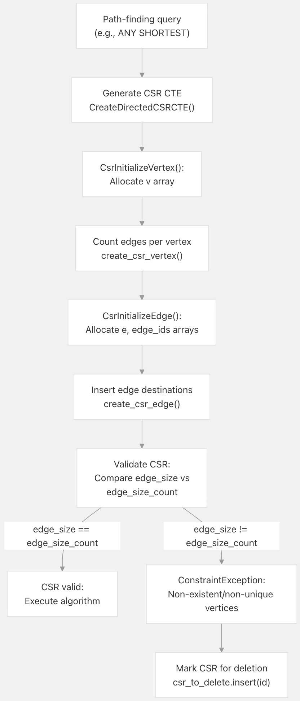
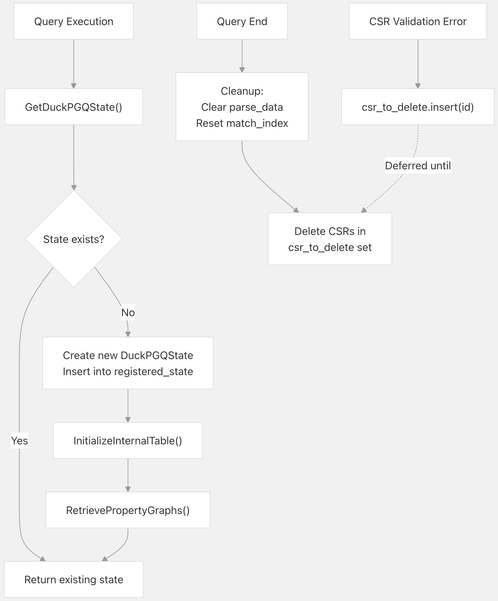

## DuckPGQ 源码学习: 8.3 错误消息与故障排除 (Error Messages and Troubleshooting)  
                                                
### 作者                                                
digoal                                                
                                                
### 日期                                                
2025-11-08                                                
                                                
### 标签                                                
DuckDB , PGQ , 属性图 , DuckPGQ , 源码学习                                                
                                                
----                           
                                                
## 背景     
本文介绍使用 DuckPGQ 时遇到的一般错误消息、其原因和解决方案。涵盖了在**属性图创建 (property graph creation)**、**查询执行 (query execution)** 和**图算法操作 (graph algorithm operations)** 期间发生的错误。  
  
## 错误处理概述 (Overview of Error Handling)  
  
DuckPGQ 在多个阶段执行**验证 (validation)**：  
  
1.  **图定义阶段 (Graph Definition Time)**：验证表是否存在、列引用以及主键/外键关系。  
2.  **查询执行阶段 (Query Execution Time)**：验证图是否存在、标签引用以及属性访问。  
3.  **CSR 创建阶段 (CSR Creation Time)**：验证顶点唯一性以及图结构完整性。  
4.  **算法执行阶段 (Algorithm Execution Time)**：验证 **CSR (Compressed Sparse Row)** 是否可用和数据一致性。  
  
该扩展使用 DuckDB 的异常系统，其中用户错误使用 `ExceptionType::INVALID`，数据完整性违规使用 `ExceptionType::CONSTRAINT`，系统错误使用 `ExceptionType::INTERNAL`。  
  
## 属性图创建错误 (Property Graph Creation Errors)  
  
### 表和列验证错误 (Table and Column Validation Errors)  
  
#### 错误: "Table with name X does not exist" （名称为 X 的表不存在）  
  
**消息模式 (Message Pattern)**：  
  
```  
Invalid Error: Table with name [table_name] does not exist  
```  
  
**原因 (Cause)**：在指定的**目录 (catalog)** 和**模式 (schema)** 中找不到引用的表。  
  
**示例 (Example)**：  
  
```sql  
CREATE PROPERTY GRAPH g   
VERTEX TABLES (nonexistent_table);  
-- Error: Table with name nonexistent_table does not exist  
```  
  
**解决方案 (Solutions)**：  
  
  * 验证表是否存在：`SELECT * FROM [table_name]`  
  * 检查是否需要指定模式：`schema_name.table_name`  
  * 对于附加的数据库，使用完整限定名：`catalog.schema.table_name`  
  
**来源 (Sources)**：[`src/core/functions/table/create_property_graph.cpp` 182-185](https://github.com/cwida/duckpgq-extension/blob/db304f58/src/core/functions/table/create_property_graph.cpp#L182-L185) [`test/sql/create_pg/attach_pg.test` 42-44](https://github.com/cwida/duckpgq-extension/blob/db304f58/test/sql/create_pg/attach_pg.test#L42-L44)  
  
-----  
  
#### 错误: "Column X not found in table Y" （在表 Y 中找不到列 X）  
  
**消息模式 (Message Pattern)**：  
  
```  
Invalid Error: Column [column_name] not found in table [table_name]  
```  
  
**原因 (Cause)**：指定的列（**属性 (property)**、**鉴别符 (discriminator)** 或**键 (key)**）在表中不存在。  
  
**示例 (Example)**：  
  
```sql  
CREATE PROPERTY GRAPH g   
VERTEX TABLES (Person PROPERTIES (nonexistent_column));  
-- Error: Column nonexistent_column not found in table Person  
```  
  
**解决方案 (Solutions)**：  
  
  * 列出可用列：`DESCRIBE [table_name]`  
  * 使用 `PROPERTIES ALL` 来包含所有列。  
  * 使用 `PROPERTIES ALL EXCEPT (col1, col2)` 来排除特定列。  
  
**来源 (Sources)**：[`src/core/functions/table/create_property_graph.cpp` 56-60](https://github.com/cwida/duckpgq-extension/blob/db304f58/src/core/functions/table/create_property_graph.cpp#L56-L60)  
  
-----  
  
#### 错误: "Found a view with name X" （找到名称为 X 的视图）  
  
**消息模式 (Message Pattern)**：  
  
```  
Invalid Error: Found a view with name [view_name]. Creating property graph tables over views is currently not supported.  
```  
  
**原因 (Cause)**：DuckPGQ 不支持在**视图 (views)** 上创建属性图，**仅支持基础表 (base tables)**。  
  
**示例 (Example)**：  
  
```sql  
CREATE VIEW v_view AS SELECT * FROM v_table;  
CREATE PROPERTY GRAPH g VERTEX TABLES (v_view);  
-- Error: Found a view with name v_view. Creating property graph tables over views is currently not supported.  
```  
  
**解决方案 (Solutions)**：  
  
  * 在底层的基础表上创建属性图。  
  * 先将视图**物化 (materialize)** 为一个表。  
  
**来源 (Sources)**：[`src/core/functions/table/create_property_graph.cpp` 192-196](https://github.com/cwida/duckpgq-extension/blob/db304f58/src/core/functions/table/create_property_graph.cpp#L192-L196) [`test/sql/create_pg/create_pg_on_view.test` 21-30](https://github.com/cwida/duckpgq-extension/blob/db304f58/test/sql/create_pg/create_pg_on_view.test#L21-L30)  
  
-----  
  
### 主键和外键错误 (Primary Key and Foreign Key Errors)  
  
以下图表说明了主键 (Primary Key, PK) 和外键 (Foreign Key, FK) 关系的验证流程：  
  
jpg  
  
**来源 (Sources)**：[`src/core/functions/table/create_property_graph.cpp` 64-112](https://github.com/cwida/duckpgq-extension/blob/db304f58/src/core/functions/table/create_property_graph.cpp#L64-L112)  
  
-----  
  
#### 错误: "No primary key - foreign key relationship found" （找不到主键-外键关系）  
  
**消息模式 (Message Pattern)**：  
  
```  
Invalid Error: No primary key - foreign key relationship found in [edge_table] with SOURCE/DESTINATION table [vertex_table]  
```  
  
**原因 (Cause)**：**边表 (edge table)** 和**顶点表 (vertex table)** 之间不存在**外键约束 (foreign key constraint)**，并且未显式指定键。  
  
**示例 (Example)**：  
  
```sql  
CREATE TABLE a (id BIGINT, name VARCHAR);  
CREATE TABLE b (src BIGINT, dst BIGINT);  
CREATE PROPERTY GRAPH g   
VERTEX TABLES (a)   
EDGE TABLES (b SOURCE a DESTINATION a);  
-- Error: No primary key - foreign key relationship found in b with SOURCE table a  
```  
  
**解决方案 (Solutions)**：  
  
  * 向顶点表添加**主键 (primary key)**，向边表添加**外键 (foreign key)**。  
    ```sql  
    ALTER TABLE a ADD PRIMARY KEY (id);  
    ALTER TABLE b ADD FOREIGN KEY (src) REFERENCES a(id);  
    ```  
  * 在属性图定义中显式指定键。  
    ```sql  
    CREATE PROPERTY GRAPH g   
    VERTEX TABLES (a)   
    EDGE TABLES (b   
      SOURCE KEY (src) REFERENCES a (id)  
      DESTINATION KEY (dst) REFERENCES a (id)  
    );  
    ```  
  
**来源 (Sources)**：[`src/core/functions/table/create_property_graph.cpp` 69-111](https://github.com/cwida/duckpgq-extension/blob/db304f58/src/core/functions/table/create_property_graph.cpp#L69-L111) [`test/sql/create_pg/create_pg_with_pk_fk.test` 88-91](https://github.com/cwida/duckpgq-extension/blob/db304f58/test/sql/create_pg/create_pg_with_pk_fk.test#L88-L91)  
  
-----  
  
#### 错误: "Multiple primary key - foreign key relationships detected" （检测到多个主键-外键关系）  
  
**消息模式 (Message Pattern)**：  
  
```  
Invalid Error: Multiple primary key - foreign key relationships detected between [edge_table] and [vertex_table]. Please explicitly define the primary key and foreign key columns using `SOURCE KEY <primary key> REFERENCES [vertex_table] <foreign key>`  
```  
  
**原因 (Cause)**：边表具有多个引用同一顶点表的外键约束，从而产生了**歧义 (ambiguity)**。  
  
**示例 (Example)**：  
  
```sql  
CREATE TABLE x (id BIGINT PRIMARY KEY);  
CREATE TABLE y (  
    id BIGINT PRIMARY KEY,  
    src BIGINT REFERENCES x(id),  
    dst BIGINT REFERENCES x(id)  
);  
CREATE PROPERTY GRAPH g   
VERTEX TABLES (x)   
EDGE TABLES (y SOURCE x DESTINATION x);  
-- Error: Multiple primary key - foreign key relationships detected  
```  
  
**解决方案 (Solution)**：显式指定哪些列是**源 (source)** 和**目标 (destination)**：  
  
```sql  
CREATE PROPERTY GRAPH g   
VERTEX TABLES (x)   
EDGE TABLES (y   
    SOURCE KEY (src) REFERENCES x (id)  
    DESTINATION KEY (dst) REFERENCES x (id)  
);  
```  
  
**来源 (Sources)**：[`src/core/functions/table/create_property_graph.cpp` 84-94](https://github.com/cwida/duckpgq-extension/blob/db304f58/src/core/functions/table/create_property_graph.cpp#L84-L94) [`test/sql/create_pg/create_pg_with_pk_fk.test` 122-128](https://github.com/cwida/duckpgq-extension/blob/db304f58/test/sql/create_pg/create_pg_with_pk_fk.test#L122-L128)  
  
-----  
  
#### 错误: "Primary key X does not exist in table Y" （主键 X 在表 Y 中不存在）  
  
**消息模式 (Message Pattern)**：  
  
```  
Invalid Error: Primary key [pk_column] does not exist in table [table_name]  
```  
  
**原因 (Cause)**：`REFERENCES` 子句中指定的**主键列 (primary key column)** 在顶点表中不存在。  
  
**解决方案 (Solutions)**：  
  
  * 检查顶点表模式：`DESCRIBE [table_name]`  
  * 确保列名完全匹配（DuckDB 默认**不区分大小写 (case-insensitive)**）。  
  * 验证您引用的是正确的表。  
  
**来源 (Sources)**：[`src/core/functions/table/create_property_graph.cpp` 144-149](https://github.com/cwida/duckpgq-extension/blob/db304f58/src/core/functions/table/create_property_graph.cpp#L144-L149)  
  
-----  
  
#### 错误: "Foreign key X does not exist in table Y" （外键 X 在表 Y 中不存在）  
  
**消息模式 (Message Pattern)**：  
  
```  
Invalid Error: Foreign key [fk_column] does not exist in table [edge_table]  
```  
  
**原因 (Cause)**：`SOURCE KEY` 或 `DESTINATION KEY` 子句中指定的**外键列 (foreign key column)** 在边表中不存在。  
  
**解决方案 (Solutions)**：  
  
  * 验证边表是否具有指定的列。  
  * 检查列名是否有拼写错误。  
  
**来源 (Sources)**：[`src/core/functions/table/create_property_graph.cpp` 117-122](https://github.com/cwida/duckpgq-extension/blob/db304f58/src/core/functions/table/create_property_graph.cpp#L117-L122)  
  
-----  
  
### 模式和目录错误 (Schema and Catalog Errors)  
  
#### 错误: "Referenced vertex table X is not registered" （引用的顶点表 X 未注册）  
  
**消息模式 (Message Pattern)**：  
  
```  
Invalid Error: Referenced vertex table [table_name] is not registered in the vertex tables.  
```  
  
**原因 (Cause)**：某个边表引用了一个未包含在 `VERTEX TABLES` 子句中的顶点表。  
  
**示例 (Example)**：  
  
```sql  
CREATE TABLE v (id BIGINT PRIMARY KEY);  
CREATE TABLE w (id BIGINT PRIMARY KEY);  
CREATE TABLE e (src BIGINT REFERENCES v(id), dst BIGINT REFERENCES w(id));  
  
CREATE PROPERTY GRAPH g   
VERTEX TABLES (v)   
EDGE TABLES (e SOURCE v DESTINATION w);  
-- Error: Table 'w' not found in the property graph g.  
```  
  
**解决方案 (Solution)**：包含所有引用的顶点表：  
  
```sql  
CREATE PROPERTY GRAPH g   
VERTEX TABLES (v, w)   
EDGE TABLES (e SOURCE v DESTINATION w);  
```  
  
**来源 (Sources)**：[`src/core/functions/table/create_property_graph.cpp` 126-132](https://github.com/cwida/duckpgq-extension/blob/db304f58/src/core/functions/table/create_property_graph.cpp#L126-L132) [`test/sql/create_pg/create_pg_with_pk_fk.test` 49-54](https://github.com/cwida/duckpgq-extension/blob/db304f58/test/sql/create_pg/create_pg_with_pk_fk.test#L49-L54)  
  
-----  
  
#### 错误: "Catalog 'X' does not exist" （目录 'X' 不存在）  
  
**消息模式 (Message Pattern)**：  
  
```  
Invalid Error: Catalog '[catalog_name]' does not exist!  
```  
  
**原因 (Cause)**：引用了一个不存在的**目录 (catalog)**（**附加数据库 (attached database)**）。  
  
**示例 (Example)**：  
  
```sql  
CREATE PROPERTY GRAPH g   
VERTEX TABLES (nonexistent_catalog.schema.table);  
-- Error: Catalog 'nonexistent_catalog' does not exist!  
```  
  
**解决方案 (Solutions)**：  
  
  * 列出附加的数据库：`SHOW DATABASES`  
  * 首先附加数据库：`ATTACH 'path/to/db.duckdb' AS catalog_name`  
  
**来源 (Sources)**：[`src/core/functions/table/create_property_graph.cpp` 198-200](https://github.com/cwida/duckpgq-extension/blob/db304f58/src/core/functions/table/create_property_graph.cpp#L198-L200) [`test/sql/create_pg/attach_pg.test` 40-44](https://github.com/cwida/duckpgq-extension/blob/db304f58/test/sql/create_pg/attach_pg.test#L40-L44)  
  
-----  
  
#### 错误: "Table 'X' not found in the property graph Y" （表 'X' 在属性图 Y 中找不到）  
  
**消息模式 (Message Pattern)**：  
  
```  
Invalid Error: Table '[qualified_table_name]' not found in the property graph [pg_name].  
```  
  
**原因 (Cause)**：当边表引用具有不正确**模式/目录限定 (schema/catalog qualifications)** 的顶点表时发生此错误。  
  
**示例 (Example)**：  
  
```sql  
CREATE PROPERTY GRAPH g   
VERTEX TABLES (schema1.Person)   
EDGE TABLES (schema2.WorksAt   
    SOURCE KEY (src) REFERENCES wrong_schema.Person (id)  
    DESTINATION KEY (dst) REFERENCES schema2.Company (id)  
);  
-- Error: Table 'wrong_schema.Person' not found in the property graph g.  
```  
  
**解决方案 (Solutions)**：  
  
  * 确保顶点表引用与 `VERTEX TABLES` 中的限定名称匹配。  
  * 在整个过程中使用一致的模式/目录限定。  
  
**来源 (Sources)**：[`test/sql/create_pg/attach_pg.test` 34-39](https://github.com/cwida/duckpgq-extension/blob/db304f58/test/sql/create_pg/attach_pg.test#L34-L39) [`test/sql/211_using_other_schemas.test` 217-228](https://github.com/cwida/duckpgq-extension/blob/db304f58/test/sql/211_using_other_schemas.test#L217-L228)  
  
-----  
  
### 鉴别符验证错误 (Discriminator Validation Errors)  
  
#### 错误: "The discriminator column X should be of type BIGINT or INTEGER" (判别列 X 应当是 BIGINT 或 INTEGER 类型)  
  
**消息模式** (`Message Pattern`):  
  
```  
Invalid Error: The discriminator column [discriminator_column] of table [table_name] should be of type BIGINT or INTEGER  
```  
  
**原因** (`Cause`): 指定了**判别列** (`discriminator column`)，但其类型不兼容。  
  
**解决方案** (`Solution`): 确保**判别列** (`discriminator column`) 是 `BIGINT` 或 `INTEGER` 类型:  
  
```sql  
-- Correct  
CREATE TABLE vertex (  
    id BIGINT PRIMARY KEY,  
    label BIGINT  -- discriminator column  
);  
  
CREATE PROPERTY GRAPH g   
VERTEX TABLES (vertex   
    LABEL person IN vertex   
    DISCRIMINATOR (label = 1)  
);  
```  
  
**来源 (Sources)**：[`src/core/functions/table/create_property_graph.cpp` 22-27](https://github.com/cwida/duckpgq-extension/blob/db304f58/src/core/functions/table/create_property_graph.cpp#L22-L27)  
  
-----  
  
## 查询执行错误 (`Query Execution Errors`)  
  
### 图和标签解析错误 (`Graph and Label Resolution Errors`)  
  
#### 错误: "Property graph X not found" (属性图 X 未找到)  
  
**消息模式** (`Message Pattern`):  
  
```  
Invalid Error: Property graph [pg_name] not found  
```  
  
**原因** (`Cause`): 指定的**属性图** (`property graph`) 尚未创建或已被删除。  
  
**示例** (`Example`):  
  
```sql  
FROM GRAPH_TABLE (nonexistent_graph MATCH (a));  
-- Error: Property graph nonexistent_graph not found  
```  
  
**解决方案** (`Solutions`):  
  
  * 列出可用的**属性图** (`property graph`): `SELECT DISTINCT property_graph FROM __duckpgq_internal`  
  * 首先创建**属性图** (`property graph`)  
  * 检查图名称是否有拼写错误  
  
**来源** (`Sources`): [`src/core/utils/duckpgq_utils.cpp` 33-38](https://github.com/cwida/duckpgq-extension/blob/db304f58/src/core/utils/duckpgq_utils.cpp#L33-L38)  
  
-----  
  
#### 错误: "Label 'X' not found" (标签 'X' 未找到)  
  
**消息模式** (`Message Pattern`):  
  
```  
Invalid Error: Label '[label_name]' not found. Did you mean the vertex/edge label '[suggested_label]'?  
```  
  
**原因** (`Cause`): 引用了**属性图** (`property graph`) 中不存在的**标签** (`label`)，或使用了不正确的限定。  
  
**示例** (`Example`):  
  
```sql  
-- Incorrect: using qualified table name as label  
FROM pagerank(bluesky, bluesky.account, follows);  
-- Error: Label 'bluesky.account' not found. Did you mean the vertex label 'account'?  
```  
  
**解决方案** (`Solution`): 使用**标签名** (`label name`)，而不是**表名** (`table name`):  
  
```sql  
FROM pagerank(bluesky, account, follows);  
```  
  
**来源** (`Sources`): [`test/sql/create_pg/attach_pg.test` 158-161](https://github.com/cwida/duckpgq-extension/blob/db304f58/test/sql/create_pg/attach_pg.test#L158-L161)  
  
-----  
  
#### 错误: "Property X is never registered" (属性 X 从未注册)  
  
**消息模式** (`Message Pattern`):  
  
```  
Binder Error: Property [property_name] is never registered!  
```  
  
**原因** (`Cause`): 尝试访问未包含在**属性图定义** (`property graph definition`) 中的**属性** (`property`) (列)。  
  
**示例** (`Example`):  
  
```sql  
CREATE PROPERTY GRAPH pg   
VERTEX TABLES (account PROPERTIES (displayName));  
  
SELECT * FROM GRAPH_TABLE (pg   
    MATCH (acc:account)   
    COLUMNS (acc.handle)  -- handle not registered  
);  
-- Error: Property acc.handle is never registered!  
```  
  
**解决方案** (`Solutions`):  
  
  * 将**属性** (`property`) 包含在**图定义** (`graph definition`) 中:  
    ```sql  
    VERTEX TABLES (account PROPERTIES (displayName, handle))  
    ```  
  * 使用 `PROPERTIES ALL` 来包含所有列  
  * 不要用目录/模式(catalog/schema)名称来限定**属性** (`properties`)  
  
**来源** (`Sources`): [`test/sql/create_pg/attach_pg.test` 166-170](https://github.com/cwida/duckpgq-extension/blob/db304f58/test/sql/create_pg/attach_pg.test#L166-L170)  
  
-----  
  
## 路径查找和 CSR 错误 (`Path Finding and CSR Errors`)  
  
### CSR 验证流程 (`CSR Validation Flow`)  
  
以下图表展示了在**路径查找查询** (`path-finding queries`) 期间如何验证 **CSR** (**Compressed Sparse Row**，压缩稀疏行) 结构:  
  
    
  
**来源** (`Sources`): [`src/core/functions/scalar/csr_creation.cpp` 112-168](https://github.com/cwida/duckpgq-extension/blob/db304f58/src/core/functions/scalar/csr_creation.cpp#L112-L168)  
  
-----  
  
#### 错误: "Non-existent/non-unique vertices detected" (检测到不存在/非唯一顶点)  
  
**消息模式** (`Message Pattern`):  
  
```  
Constraint Error: Non-existent/non-unique vertices detected. Make sure all vertices referred by edge tables exist and are unique for path-finding queries.  
```  
  
**原因** (`Cause`): 发生此严重错误的情况包括:  
  
1.  **边表** (`Edge tables`) 引用了不存在的**顶点行** (`vertex rows`) (即**悬空引用** (`dangling references`))  
2.  **顶点表** (`Vertex tables`) 中用作**主键** (`primary keys`) 的列包含重复值  
3.  在初始化期间，**CSR 边计数验证** (`CSR edge count validation`) 失败  
  
**示例场景** (`Example Scenarios`):  
  
**场景 1: 重复顶点** (`Duplicate vertices`)  
  
```sql  
CREATE TABLE v (x VARCHAR);  
INSERT INTO v VALUES ('a'), ('b'), ('b');  -- duplicate 'b'  
  
CREATE TABLE e (x1 VARCHAR, x2 VARCHAR);  
INSERT INTO e VALUES ('a', 'b');  
  
CREATE PROPERTY GRAPH g   
VERTEX TABLES (v)   
EDGE TABLES (e   
    SOURCE KEY (x1) REFERENCES v (x)  
    DESTINATION KEY (x2) REFERENCES v (x)  
);  
  
-- This works:  
FROM GRAPH_TABLE(g MATCH (v1:v)-[e:e]->(v2:v));  
  
-- This fails:  
FROM GRAPH_TABLE(g MATCH p = ANY SHORTEST (v1:v)-[e:e]->+(v2:v));  
-- Error: Non-existent/non-unique vertices detected  
```  
  
**场景 2: 缺失顶点** (`Missing vertices`)  
  
```sql  
CREATE TABLE v (id BIGINT);  
INSERT INTO v VALUES (1), (2);  
  
CREATE TABLE e (src BIGINT, dst BIGINT);  
INSERT INTO e VALUES (1, 3);  -- vertex 3 doesn't exist  
  
CREATE PROPERTY GRAPH g ...  
  
FROM GRAPH_TABLE(g MATCH p = ANY SHORTEST (v1:v)-[e:e]->+(v2:v));  
-- Error: Non-existent/non-unique vertices detected  
```  
  
**解决方案** (`Solutions`):  
  
1.  **确保顶点唯一性** (`Ensure vertex uniqueness`): 添加**主键约束** (`primary key constraint`)  
```sql  
CREATE TABLE v (x VARCHAR PRIMARY KEY);  
```  
2.  **移除重复项** (`Remove duplicates`): 清理**顶点表** (`vertex table`)  
```sql  
DELETE FROM v WHERE rowid NOT IN (  
    SELECT MIN(rowid) FROM v GROUP BY x  
);  
```  
3.  **修复悬空引用** (`Fix dangling references`): 确保**参照完整性** (`referential integrity`)  
```sql  
-- Find dangling references  
SELECT e.* FROM e   
WHERE e.dst NOT IN (SELECT v.id FROM v);  
  
-- Remove or fix them  
DELETE FROM e WHERE dst NOT IN (SELECT v.id FROM v);  
```  
4.  **使用适当的约束** (`Use proper constraints`): 让 DuckDB 强制执行完整性  
```sql  
CREATE TABLE v (id BIGINT PRIMARY KEY);  
CREATE TABLE e (  
    src BIGINT REFERENCES v(id),  
    dst BIGINT REFERENCES v(id)  
);  
```  
  
**技术细节** (`Technical Details`): 在 `CreateCsrEdgeFunction()` 中，当 `edge_size != edge_size_count` 时会检测到此错误。`edge_size` 代表基于**顶点偏移量** (`vertex offsets`) 的预期边数，而 `edge_size_count` 是实际插入的边数。不匹配表明某些**顶点** (`vertices`) 重复或缺失，导致 **CSR 结构** (`CSR structure`) 不一致。  
  
**来源** (`Sources`): [`src/core/functions/scalar/csr_creation.cpp` 121-125](https://github.com/cwida/duckpgq-extension/blob/db304f58/src/core/functions/scalar/csr_creation.cpp#L121-L125) [`test/sql/path_finding/non-unique-vertices.test` 40-55](https://github.com/cwida/duckpgq-extension/blob/db304f58/test/sql/path_finding/non-unique-vertices.test#L40-L55)  
  
-----  
  
#### 错误: "Unable to initialize vector of size for csr vertex/edge table representation" (无法为 **CSR 顶点/边表表示** 初始化指定大小的向量)  
  
**消息模式** (`Message Pattern`):  
  
```  
Internal Error: Unable to initialize vector of size [vector_size] for csr vertex/edge table representation  
```  
  
**原因** (`Cause`): 在创建 **CSR 结构** (`CSR structure`) 时，**内存分配** (`Memory allocation`) 失败。这通常发生在以下情况:  
  
  * 图规模**极其庞大**，超出了可用内存 (`available memory`)  
  * **大小计算** (`size calculations`) 出现错误  
  * 系统**内存限制** (`System memory constraints`)  
  
**解决方案** (`Solutions`):  
  
  * 通过过滤**顶点** (`vertices`)/**边** (`edges`) 来**减小图的规模** (`Reduce the graph size`)  
  * **增加**可用的系统内存 (`Increase available system memory`)  
  * 以**较小的块** (`smaller chunks`) 处理图  
  
**来源** (`Sources`):  
[`src/core/functions/scalar/csr_creation.cpp` 37-40](https://github.com/cwida/duckpgq-extension/blob/db304f58/src/core/functions/scalar/csr_creation.cpp#L37-L40)  
[`src/core/functions/scalar/csr_creation.cpp` 53-56](https://github.com/cwida/duckpgq-extension/blob/db304f58/src/core/functions/scalar/csr_creation.cpp#L53-L56)  
  
-----  
  
## 常见错误解决模式 (`Common Error Resolution Patterns`)  
  
**错误检测和解决矩阵** (`Error Detection and Resolution Matrix`)  
  
| 错误类别 (`Error Category`) | 阶段 (`Stage`) | 原因 (`Cause`) | 解决方案 (`Solution`) |  
| :--- | :--- | :--- | :--- |  
| **表未找到** (`Table Not Found`) | 图创建 (`Graph Creation`) | 拼写错误、错误的模式/目录 | 检查限定，验证表是否存在 |  
| **无 FK/PK 关系** (`No FK/PK relationship`) | 图创建 (`Graph Creation`) | 缺失或不明确的键 | 添加约束或显式指定键 |  
| **属性图未找到** (`Property Graph Not Found`) | 查询执行 (`Query Execution`) | 拼写错误、未创建或已删除 | 检查名称，重新创建图 |  
| **标签未找到** (`Label Not Found`) | 查询执行 (`Query Execution`) | 错误的**标签名** (`label name`) 或限定 | 使用**标签名** (`label name`)，而不是**表名** (`table name`) |  
| **属性未注册** (`Property Not Registered`) | 查询执行 (`Query Execution`) | 列不在 `PROPERTIES` 子句中 | 添加到 `PROPERTIES` 或使用 `PROPERTIES ALL` |  
| **非唯一顶点** (`Non-unique Vertices`) | **CSR 创建** (`CSR Creation`) | **顶点** (`vertices`) 重复或缺失 | 添加 `PRIMARY KEY`，移除重复项 |  
| **内存分配** (`Memory Allocation`) | **CSR 创建** (`CSR Creation`) | 图的内存不足 | 缩小图的大小或增加内存 |  
  
### 诊断查询 (`Diagnostic Queries`)  
  
使用这些查询来诊断常见问题:  
  
```sql  
-- List all property graphs  
SELECT DISTINCT property_graph FROM __duckpgq_internal;  
  
-- Show all tables in a property graph  
SELECT table_name, label, is_vertex_table   
FROM __duckpgq_internal   
WHERE property_graph = 'your_graph_name';  
  
-- Check for duplicate vertices  
SELECT x, COUNT(*) as count   
FROM vertex_table   
GROUP BY x   
HAVING COUNT(*) > 1;  
  
-- Find dangling edge references  
SELECT e.*   
FROM edge_table e   
LEFT JOIN vertex_table v ON e.src = v.id   
WHERE v.id IS NULL;  
  
-- List table columns  
DESCRIBE table_name;  
  
-- Show foreign key constraints  
SELECT * FROM duckdb_constraints()   
WHERE table_name = 'your_table';  
```  
  
-----  
  
## 状态管理和清理 (`State Management and Cleanup`)  
  
### DuckPGQState 错误处理 (`DuckPGQState Error Handling`)  
  
    
  
**来源** (`Sources`): [`src/core/utils/duckpgq_utils.cpp` 16-30](https://github.com/cwida/duckpgq-extension/blob/db304f58/src/core/utils/duckpgq_utils.cpp#L16-L30) [`src/core/functions/scalar/csr_creation.cpp` 122](https://github.com/cwida/duckpgq-extension/blob/db304f58/src/core/functions/scalar/csr_creation.cpp#L122-L122)  
  
当 **CSR 验证** (`CSR validation`) 失败时，**CSR** (`CSR`) 通过将其 **ID** (`ID`) 插入 `csr_to_delete` 中来标记删除。实际的清理工作在查询结束时发生，以避免干扰正在进行的操作。这种**延迟清理模式** (`deferred cleanup pattern`) 确保了即使发生错误，系统也能保持稳定。  
       
#### [PolarDB 学习图谱](https://www.aliyun.com/database/openpolardb/activity "8642f60e04ed0c814bf9cb9677976bd4")
  
  
#### [PostgreSQL 解决方案集合](../201706/20170601_02.md "40cff096e9ed7122c512b35d8561d9c8")
  
  
#### [德哥 / digoal's Github - 公益是一辈子的事.](https://github.com/digoal/blog/blob/master/README.md "22709685feb7cab07d30f30387f0a9ae")
  
  
#### [About 德哥](https://github.com/digoal/blog/blob/master/me/readme.md "a37735981e7704886ffd590565582dd0")
  
  

  
