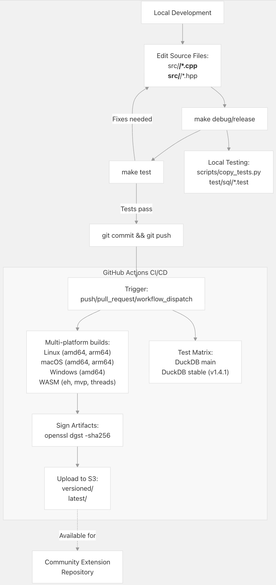
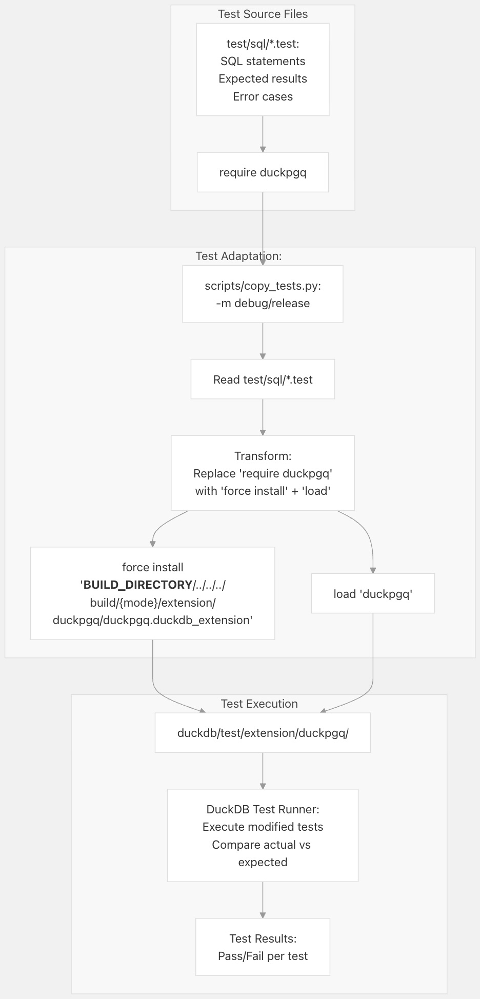
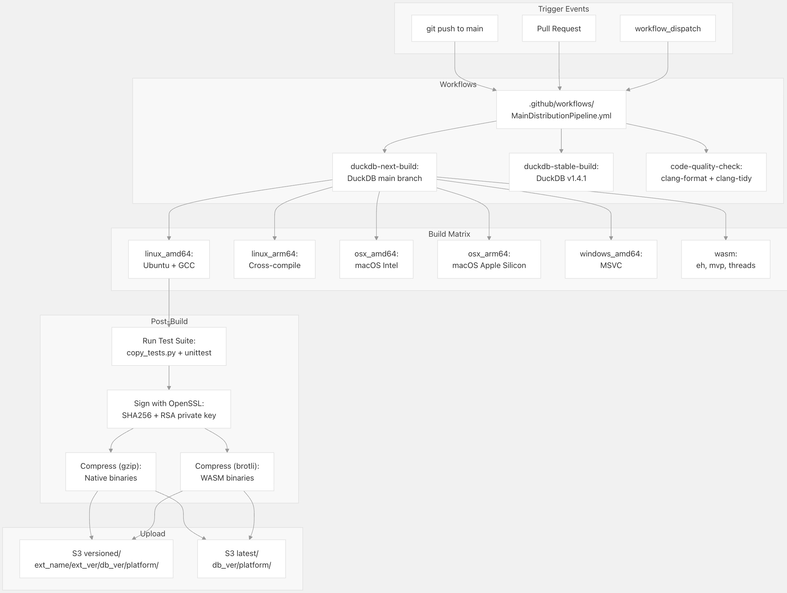
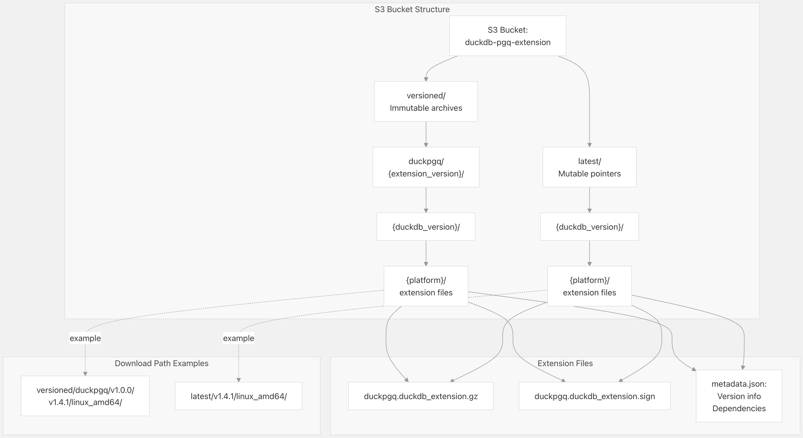

## DuckPGQ 源码学习: 7 开发指南 (Development Guide)  
                                                  
### 作者                                                  
digoal                                                  
                                                  
### 日期                                                  
2025-11-08                                                  
                                                  
### 标签                                                  
DuckDB , PGQ , 属性图 , DuckPGQ , 源码学习                                                  
                                                  
----                             
                                                  
## 背景       
本文为希望从源代码 (source) 构建 (build) DuckPGQ、运行测试 (tests)、了解持续集成/持续部署 (CI/CD) 流程或对扩展 (extension) 做出贡献的开发人员提供了全面的指导。它涵盖了构建系统 (build system)、测试框架 (testing framework)、持续集成 (continuous integration) 工作流程和分发机制 (distribution mechanisms)。  
  
## 开发工作流程概述 (Development Workflow Overview)  
  
DuckPGQ 的开发过程遵循标准的扩展 (extension) 开发模式，并配有自动化持续集成/持续部署 (CI/CD) 流程，用于在多个平台 (platforms) 上构建 (building)、测试 (testing) 和分发二进制文件 (binaries)。  
  
  
  
**开发工作流程 (Development Workflow)**：开发人员编辑源代码 (source code)，使用 `make` 在本地构建 (build)，运行测试 (tests)，并提交更改。推送到 GitHub 后，持续集成/持续部署 (CI/CD) 流程会自动为所有支持的平台构建扩展，针对多个 DuckDB 版本运行测试套件 (test suite)，对工件 (artifacts) 进行签名 (signs)，并将它们上传到 S3 进行分发 (distribution)。  
  
来源: [`Makefile` 1-9](https://github.com/cwida/duckpgq-extension/blob/db304f58/Makefile#L1-L9) 高级图表 (high-level diagrams)  
  
## 构建系统架构 (Build System Architecture)  
  
DuckPGQ 使用多层构建系统 (build system)，该系统由 **GNU Make**、**CMake** 和用于依赖项管理 (dependency management) 的 **vcpkg** 组成。该构建系统通过 `extension-ci-tools` 框架进行标准化。  
  
  
  
**构建系统 (Build System)**：`Makefile` 定义了扩展名 (extension name) 和配置文件，然后包含来自 `extension-ci-tools` 的标准化 `duckdb_extension.Makefile`。**CMake** 处理 `extension_config.cmake` 以生成构建文件 (build files)，**vcpkg** 管理依赖项 (dependencies)，并且编译 (compilation) 会在调试 (`debug`) 或发布 (`release`) 配置中生成 `.duckdb_extension` 二进制文件 (binary)。  
  
来源: [`Makefile` 1-9](https://github.com/cwida/duckpgq-extension/blob/db304f58/Makefile#L1-L9)  
  
### Makefile 目标 (Targets)  
  
根 [`Makefile` 1-9](https://github.com/cwida/duckpgq-extension/blob/db304f58/Makefile#L1-L9) 为底层构建系统提供了一个简单的接口 (interface)：  
  
| 目标 (Target) | 描述 (Description) | 输出位置 (Output Location) |  
| :--- | :--- | :--- |  
| `debug` | 使用调试符号 (debug symbols) 构建，不进行优化 (optimization) | `build/debug/extension/duckpgq/` |  
| `release` | 构建经过优化 (optimized) 且剥离了符号 (symbols stripped) 的二进制文件 | `build/release/extension/duckpgq/` |  
| `test` | 使用 DuckDB 测试运行器 (test runner) 运行测试套件 (test suite) | 测试结果输出到标准输出 (stdout) |  
| `clean` | 移除所有构建工件 (build artifacts) | - |  
| `format` | 使用 `clang-format` 格式化代码 | 修改后的源文件 (source files) |  
  
[`Makefile` 4](https://github.com/cwida/duckpgq-extension/blob/db304f58/Makefile#L4-L4) 设置了 `EXT_NAME=duckpgq`，[`Makefile` 5](https://github.com/cwida/duckpgq-extension/blob/db304f58/Makefile#L5-L5) 引用了 `extension_config.cmake`，其中包含详细的构建配置 (build configuration)，包括源文件 (source files)、编译器标志 (compiler flags) 和依赖项 (dependencies)。  
  
### 从源代码 (Source) 构建  
  
要在本地 (locally) 构建 DuckPGQ：  
  
```bash  
# Clone repository with submodules  
git clone --recurse-submodules https://github.com/cwida/duckpgq-extension  
cd duckpgq-extension  
  
# Build debug version  
make debug  
  
# Build release version  
make release  
```  
  
扩展二进制文件 (extension binary) 输出到 `build/{debug|release}/extension/duckpgq/duckpgq.duckdb_extension`。  
  
来源: [`Makefile` 1-9](https://github.com/cwida/duckpgq-extension/blob/db304f58/Makefile#L1-L9)  
  
## 测试框架 (Testing Framework)  
  
DuckPGQ 使用 DuckDB 的基于 **SQL** 的测试框架 (`SQL-based testing framework`)。测试以 `.test` 文件的形式编写，其中包含 **SQL** 语句 (`SQL statements`) 和预期结果 (`expected results`)。一个专用脚本会为构建环境 (`build environment`) 调整 (`adapts`) 这些测试。  
  
  
  
**测试流程 (Test Pipeline)**：`scripts/copy_tests.py` 脚本 [`scripts/copy\_tests.py` 1-54](https://github.com/cwida/duckpgq-extension/blob/db304f58/scripts/copy_tests.py#L1-L54) 读取 `test/sql/` 中的测试文件，用指向构建目录 (`build directory`) 的显式 (`explicit`) `force install` 和 `load` 命令替换 `require duckpgq` 语句，并将修改后的测试写入 `duckdb/test/extension/duckpgq/`。然后，DuckDB 测试运行器 (`test runner`) 执行这些经过调整的测试。  
  
来源: [`scripts/copy\_tests.py` 1-54](https://github.com/cwida/duckpgq-extension/blob/db304f58/scripts/copy_tests.py#L1-L54)  
  
### 测试文件结构 (Test File Structure)  
  
`test/sql/` 中的测试文件遵循 DuckDB 测试格式：  
  
```sql  
# require duckpgq  
  
# Test case description  
statement ok  
CREATE TABLE vertices(id INTEGER PRIMARY KEY, name VARCHAR);  
  
statement ok  
INSERT INTO vertices VALUES (1, 'Alice'), (2, 'Bob');  
  
query I  
SELECT COUNT(*) FROM vertices;  
----  
2  
```  
  
在测试复制过程中，`require duckpgq` 指令 [`scripts/copy\_tests.py` 40-45](https://github.com/cwida/duckpgq-extension/blob/db304f58/scripts/copy_tests.py#L40-L45) 被替换为：  
  
```sql  
statement ok  
force install '__BUILD_DIRECTORY__/../../../build/{mode}/extension/duckpgq/duckpgq.duckdb_extension';  
  
statement ok  
load 'duckpgq';  
```  
  
这确保了测试是针对本地构建的扩展 (`locally built extension`) 运行的，而不是预安装 (`pre-installed`) 版本。  
  
### 运行测试 (Running Tests)  
  
```bash  
# Copy tests for debug build  
python3 scripts/copy_tests.py -m debug  
  
# Run all tests  
make test  
  
# Or run tests manually with DuckDB  
./duckdb/build/release/test/unittest "test/extension/duckpgq/*"  
```  
  
`scripts/copy_tests.py` 脚本 [`scripts/copy\_tests.py` 11-23](https://github.com/cwida/duckpgq-extension/blob/db304f58/scripts/copy_tests.py#L11-L23) 需要 `-m` 参数 (`parameter`) 来指定调试 (`debug`) 或发布 (`release`) 模式，这决定了 `force install` 语句中扩展二进制文件 (`extension binary`) 的路径。  
  
来源: [`scripts/copy\_tests.py` 11-53](https://github.com/cwida/duckpgq-extension/blob/db304f58/scripts/copy_tests.py#L11-L53)  
  
### 测试调整 (Test Adaptation) 详情  
  
由 `scripts/copy_tests.py` 脚本 [`scripts/copy\_tests.py` 40-45](https://github.com/cwida/duckpgq-extension/blob/db304f58/scripts/copy_tests.py#L40-L45) 执行的转换对于本地测试至关重要 (`critical`)：  
  
| 原文 (Original) | 转换后 (Transformed) |  
| :--- | :--- |  
| `require duckpgq` | `force install '<path-to-local-build>'` + `load 'duckpgq'` |  
  
`force install` 命令绕过了 DuckDB 的扩展仓库 (`extension repository`)，直接从构建目录 (`build directory`) 加载二进制文件 (`binary`)。路径 [`scripts/copy\_tests.py` 42](https://github.com/cwida/duckpgq-extension/blob/db304f58/scripts/copy_tests.py#L42-L42) 使用 `__BUILD_DIRECTORY__` 作为占位符 (`placeholder`)，DuckDB 的测试运行器 (`test runner`) 会在运行时 (`runtime`) 解析 (`resolves`) 它。  
  
该脚本在复制之前执行文件操作 [`scripts/copy\_tests.py` 31-35](https://github.com/cwida/duckpgq-extension/blob/db304f58/scripts/copy_tests.py#L31-L35) 以清除并重新创建目标目录 (`target directory`)，从而确保一个干净的测试环境 (`test environment`)。  
  
来源: [`scripts/copy\_tests.py` 26-49](https://github.com/cwida/duckpgq-extension/blob/db304f58/scripts/copy_tests.py#L26-L49)  
  
## 持续集成/持续部署 (CI/CD) 流程  
  
DuckPGQ 使用 **GitHub Actions** 进行持续集成 (`continuous integration`) 和交付 (`delivery`)。该流程为多个平台 (`platforms`) 和 DuckDB 版本构建扩展 (`extension`)，运行测试 (`tests`)，对工件 (`artifacts`) 进行签名 (`signs`)，并将其发布到 **S3**。  
  
  
  
**持续集成/持续部署 (CI/CD) 架构 (Architecture)**：`MainDistributionPipeline.yml` 工作流程 (`workflow`) 协调针对 DuckDB `main` 和稳定 (`stable`) 分支的构建。每个构建都会生成适用于多个平台 (`platforms`) 的工件 (`artifacts`)，这些工件随后经过测试、签名、压缩 (`compressed`)，并上传到 **S3** 的版本化 (`versioned`)（不可变，`immutable`）和最新 (`latest`)（可变，`mutable`）位置。  
  
### 工作流程结构 (Workflow Structure)  
  
主要工作流程文件是 `.github/workflows/MainDistributionPipeline.yml`，它定义了：  
  
1.  **触发条件 (Trigger conditions)**：推送到 `main` 分支、拉取请求 (`pull requests`)、手动调度 (`manual dispatch`)  
2.  **构建任务 (Build jobs)**：针对每个平台和 DuckDB 版本的独立任务  
3.  **测试任务 (Test jobs)**：成功构建后运行测试套件 (`test suite`)  
4.  **部署任务 (Deploy jobs)**：对工件 (`artifacts`) 进行签名、压缩和上传  
  
### 构建矩阵 (Build Matrix)  
  
| 平台 (Platform) | 架构 (Architecture) | 编译器 (Compiler) | DuckDB 版本 (Versions) |  
| :--- | :--- | :--- | :--- |  
| Linux | amd64 | GCC | main, v1.4.1 |  
| Linux | arm64 | GCC (cross-compiled，交叉编译) | main, v1.4.1 |  
| macOS | amd64 | Clang | main, v1.4.1 |  
| macOS | arm64 | Clang | main, v1.4.1 |  
| Windows | amd64 | MSVC | main, v1.4.1 |  
| WASM | - | emscripten | main, v1.4.1 |  
  
构建矩阵 (`build matrix`) 中的每个条目都会生成一个单独的 `.duckdb_extension` 二进制文件 (`binary`)。  
  
### 工件 (Artifact) 签名 (Signing)  
  
工件 (`Artifacts`) 使用 **OpenSSL** 进行签名 (`signed`)，私钥 (`private key`) 存储在 **GitHub Secrets** 中：  
  
```bash  
openssl dgst -sha256 -sign private_key \  
  -out extension.duckdb_extension.sign \  
  extension.duckdb_extension  
```  
  
签名 (`signature`) 是一个 256 字节 (`byte`) 的二进制文件，它伴随着扩展二进制文件 (`extension binary`)。  
  
### 压缩 (Compression)  
  
原生二进制文件 (`Native binaries`)（Linux、macOS、Windows）使用 **gzip** 压缩：  
  
```bash  
gzip < extension.duckdb_extension > extension.duckdb_extension.gz  
```  
  
**WASM** (`WebAssembly`) 二进制文件使用 **brotli** 压缩，以获得更好的压缩比 (`compression ratios`)：  
  
```bash  
brotli -o extension.duckdb_extension.br extension.duckdb_extension  
```  
  
## 扩展分发 (Extension Distribution)  
  
构建 (`built`) 和签名 (`signed`) 的扩展被上传到 **S3**，具有支持版本控制 (`versioning`) 和平台标识 (`platform identification`) 的特定目录结构 (`directory structure`)。  
  
  
  
**S3 分发结构 (S3 Distribution Structure)**：扩展被上传到两个位置：`versioned/` 用于按扩展版本索引的不可变 (`immutable`) 档案 (`archives`)，以及 `latest/` 用于指向最新兼容版本 (`compatible version`) 的可变 (`mutable`) 指针 (`pointers`)。这种双重结构允许用户安装特定版本 (`specific versions`) 或始终获取最新的兼容构建。  
  
来源: 高级图表 (Diagram 5)  
  
### 目录结构 (Directory Structure)  
  
**版本化路径 (Versioned Path)**（不可变，`immutable`）：  
  
```  
s3://duckdb-pgq-extension/versioned/duckpgq/{ext_version}/{db_version}/{platform}/  
```  
  
**最新路径 (Latest Path)**（可变，`mutable`；在每次构建时覆盖）：  
  
```  
s3://duckdb-pgq-extension/latest/{db_version}/{platform}/  
```  
  
### 平台标识符 (Platform Identifiers)  
  
| 平台 (Platform) | 标识符 (Identifier) | 注释 (Notes) |  
| :--- | :--- | :--- |  
| Linux x86\_64 | `linux_amd64` | 在 Ubuntu 上构建 (`Built`) |  
| Linux ARM64 | `linux_arm64` | 交叉编译 (`Cross-compiled`) |  
| macOS Intel | `osx_amd64` | 在 macOS 11+ 上构建 |  
| macOS Apple Silicon | `osx_arm64` | 原生 ARM 构建 (`Native ARM build`) |  
| Windows x86\_64 | `windows_amd64` | MSVC 构建 |  
| WASM Exception Handling | `wasm_eh` | Brotli 压缩 |  
| WASM MVP | `wasm_mvp` | Brotli 压缩 |  
| WASM Threads | `wasm_threads` | Brotli 压缩 |  
  
### 版本兼容性 (Version Compatibility)  
  
路径中的 `{db_version}` 组件标识了 DuckDB 的兼容性 (`compatibility`)：  
  
  * `v1.4.1` - 稳定 (`Stable`) 的 DuckDB 版本 (`release`) v1.4.1  
  * `v1.5.0` - 下一个稳定版本  
  * `main` - DuckDB 开发分支 (`development branch`)（不稳定，`unstable`）  
  
针对不同 DuckDB 版本构建的扩展是不兼容的 (`incompatible`)，并且必须与运行时版本 (`runtime version`) 匹配。  
  
### 可用性文档 (Availability Documentation)  
  
`scripts/s3_availability.py` 脚本查询 (`queries`) **S3** 存储桶 (`bucket`) 以生成文档 (`documentation`) 的可用性表 (`availability tables`)。它生成 **Markdown** 表格，显示哪些平台和版本具有可用的二进制文件 (`binaries`)，这些表格会自动插入到 `README.md` 中。  
  
来源: 高级图表 (Diagram 5)  
  
## 最佳开发实践 (Development Best Practices)  
  
### 代码质量 (Code Quality)  
  
在提交 (`committing`) 之前运行代码格式化程序 (`code formatters`)：  
  
```bash  
make format  
```  
  
这会根据项目的样式指南 (`style guide`) 将 `clang-format` 应用于所有 C++ 源文件 (`source files`)。  
  
### 测试要求 (Testing Requirements)  
  
所有新功能 (`new features`) 和错误修复 (`bug fixes`) 都应在 `test/sql/` 中包含测试 (`tests`)：  
  
1.  创建一个新的 `.test` 文件或扩展现有文件  
2.  包含针对成功路径 (`success paths`)、边缘情况 (`edge cases`) 和错误条件 (`error conditions`) 的测试用例 (`test cases`)  
3.  使用描述性注释 (`descriptive comments`) 来解释测试意图 (`test intent`)  
4.  在运行 `make test` 之前运行 `python3 scripts/copy_tests.py -m debug`  
  
### 拉取请求 (Pull Request) 清单 (Checklist)  
  
在提交拉取请求 (`pull request`) 之前：  
  
  * 代码在调试 (`debug`) 和发布 (`release`) 模式下编译 (`compiles`) 时没有警告 (`warnings`)  
  * 所有现有测试 (`tests`) 通过  
  * 为修改后的功能 (`functionality`) 添加了新的测试  
  * 代码已使用 `make format` 格式化  
  * 持续集成 (`CI`) 流程在所有平台 (`platforms`) 上通过  
  * 如果添加新功能，文档 (`Documentation`) 已更新  
  
### 针对不同 DuckDB 版本的本地测试 (Local Testing)  
  
要针对特定的 DuckDB 版本进行测试：  
  
```bash  
# Checkout specific DuckDB version in submodule  
cd duckdb  
git checkout v1.4.1  
cd ..  
  
# Rebuild extension  
make clean  
make debug  
```  
  
这确保了与该 DuckDB 版本的兼容性 (`compatibility`)。  
  
来源: [`Makefile` 1-9](https://github.com/cwida/duckpgq-extension/blob/db304f58/Makefile#L1-L9) [`scripts/copy\_tests.py` 1-54](https://github.com/cwida/duckpgq-extension/blob/db304f58/scripts/copy_tests.py#L1-L54)  
      
#### [PolarDB 学习图谱](https://www.aliyun.com/database/openpolardb/activity "8642f60e04ed0c814bf9cb9677976bd4")
  
  
#### [PostgreSQL 解决方案集合](../201706/20170601_02.md "40cff096e9ed7122c512b35d8561d9c8")
  
  
#### [德哥 / digoal's Github - 公益是一辈子的事.](https://github.com/digoal/blog/blob/master/README.md "22709685feb7cab07d30f30387f0a9ae")
  
  
#### [About 德哥](https://github.com/digoal/blog/blob/master/me/readme.md "a37735981e7704886ffd590565582dd0")
  
  

  
