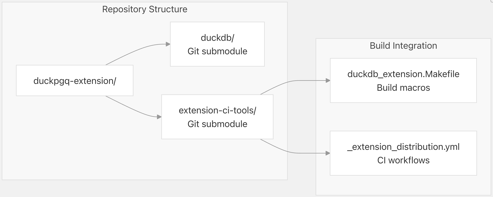
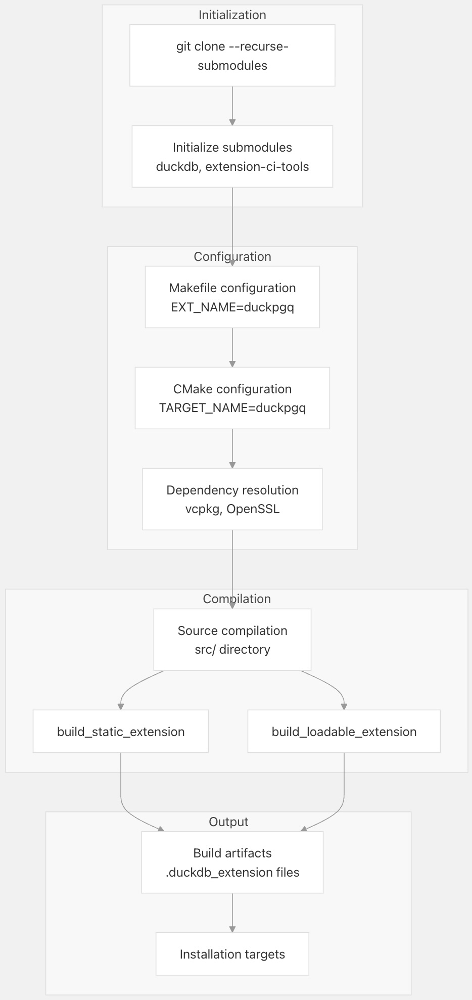
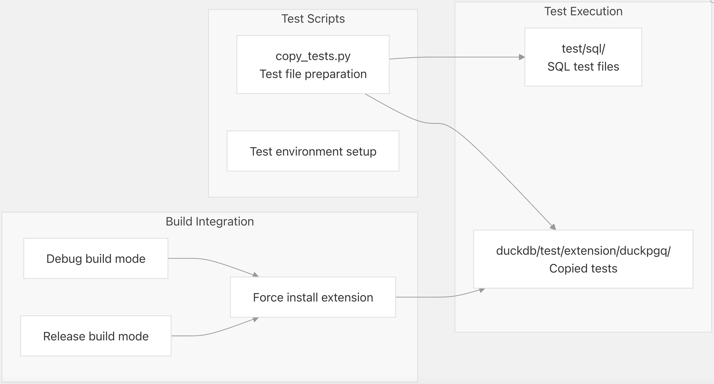
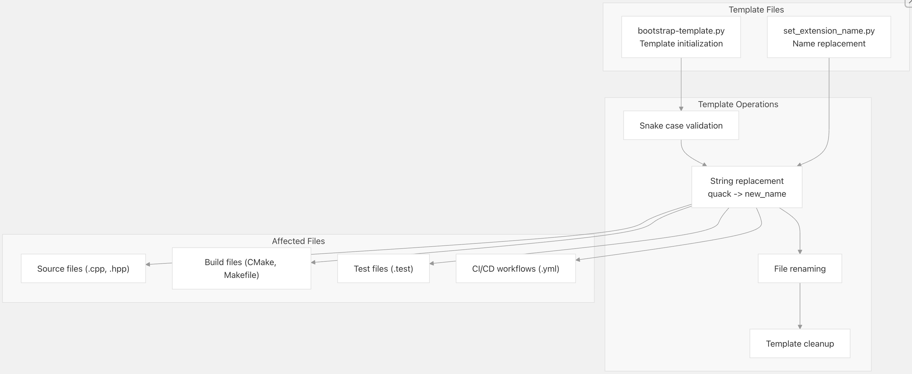

## DuckPGQ 源码学习: 7.1 从源代码构建 (Building from Source)  
                                                    
### 作者                                                    
digoal                                                    
                                                    
### 日期                                                    
2025-11-08                                                    
                                                    
### 标签                                                    
DuckDB , PGQ , 属性图 , DuckPGQ , 源码学习                                                    
                                                    
----                               
                                                    
## 背景    
本文介绍从源代码构建 DuckPGQ 扩展 (extension) 的过程，包括先决条件 (prerequisites)、依赖项 (dependencies)、构建配置 (build configuration) 和编译步骤 (compilation steps)。提供有关构建系统架构 (build system architecture) 以及构建过程中使用的各种工具和脚本的详细信息。  
  
## 构建系统概述 (Build System Overview)  
  
DuckPGQ 使用结合了 **Make** 和 **CMake** 的双重构建系统 (dual build system) 来处理构建过程的不同方面。该构建系统与 DuckDB 的扩展基础设施 (extension infrastructure) 集成，并使用外部工具来实现跨平台兼容性 (cross-platform compatibility)。  
  
### 构建系统架构 (Build System Architecture)  
  
    
  
来源:  
[`Makefile` 1-9](https://github.com/cwida/duckpgq-extension/blob/db304f58/Makefile#L1-L9)  
[`CMakeLists.txt` 1-32](https://github.com/cwida/duckpgq-extension/blob/db304f58/CMakeLists.txt#L1-L32)  
[`extension_config.cmake` 1-11](https://github.com/cwida/duckpgq-extension/blob/db304f58/extension_config.cmake#L1-L11)  
  
### 关键构建组件 (Key Build Components)  
  
构建系统由几个关键组件组成：  
  
| 组件 (Component) | 目的 (Purpose) | 配置 (Configuration) |  
| :--- | :--- | :--- |  
| `Makefile` | 主要构建接口 (Primary build interface) | 包含 extension-ci-tools makefile |  
| `CMakeLists.txt` | CMake 构建配置 (build configuration) | 定义目标 (targets) 和依赖项 (dependencies) |  
| `extension_config.cmake` | 扩展注册 (Extension registration) | 在 DuckDB 构建系统 (build system) 中注册 |  
| `extension-ci-tools` | DuckDB 扩展实用程序 (utilities) | 提供构建宏 (build macros) 和 CI 支持 |  
  
来源:  
[`Makefile` 4-8](https://github.com/cwida/duckpgq-extension/blob/db304f58/Makefile#L4-L8)  
[`CMakeLists.txt` 3-15](https://github.com/cwida/duckpgq-extension/blob/db304f58/CMakeLists.txt#L3-L15)  
[`extension_config.cmake` 4-7](https://github.com/cwida/duckpgq-extension/blob/db304f58/extension_config.cmake#L4-L7)  
  
## 先决条件 (Prerequisites)  
  
### 必需软件 (Required Software)  
  
在从源代码构建 DuckPGQ 之前，请确保已安装以下先决条件：  
  
  * **C++ 编译器 (Compiler)**: GCC 7+ 或 Clang 10+，支持 C++11  
  * **CMake**: 版本 3.5 或更高  
  * **Make**: GNU Make 或兼容版本  
  * **Git**: 用于克隆子模块 (submodules)  
  * **Python 3**: 用于构建脚本 (build scripts) 和测试  
  
### DuckDB 集成 (DuckDB Integration)  
  
DuckPGQ 需要与 DuckDB 的构建系统集成：  
  
    
  
来源:  
[`Makefile` 8](https://github.com/cwida/duckpgq-extension/blob/db304f58/Makefile#L8-L8)  
[`docs/UPDATING.md` 6-13](https://github.com/cwida/duckpgq-extension/blob/db304f58/docs/UPDATING.md#L6-L13)  
  
## 依赖项 (Dependencies)  
  
### 核心依赖项 (Core Dependencies)  
  
DuckPGQ 有几个在构建期间必须可用的核心依赖项：  
  
#### OpenSSL  
  
加密操作 (cryptographic operations) 和安全连接所需：  
  
```  
find_package(OpenSSL REQUIRED)  
target_link_libraries(${EXTENSION_NAME} OpenSSL::SSL OpenSSL::Crypto)  
target_link_libraries(${LOADABLE_EXTENSION_NAME} OpenSSL::SSL OpenSSL::Crypto)  
```  
  
来源:  
[`CMakeLists.txt` 10](https://github.com/cwida/duckpgq-extension/blob/db304f58/CMakeLists.txt#L10-L10)  
[`CMakeLists.txt` 24-25](https://github.com/cwida/duckpgq-extension/blob/db304f58/CMakeLists.txt#L24-L25)  
  
#### libpg\_query  
  
用于 SQL 解析功能 (SQL parsing capabilities)：  
  
```  
include_directories(../duckdb/third_party/libpg_query/include)  
```  
  
来源:  
[`CMakeLists.txt` 18](https://github.com/cwida/duckpgq-extension/blob/db304f58/CMakeLists.txt#L18-L18)  
  
### 依赖项管理 (Dependency Management)  
  
该扩展使用 **vcpkg** 进行依赖项管理 (dependency management)，允许在构建过程中自动解析和安装所需包。  
  
来源:  
[`CMakeLists.txt` 6-9](https://github.com/cwida/duckpgq-extension/blob/db304f58/CMakeLists.txt#L6-L9)  
  
## 构建过程 (Build Process)  
  
### 标准构建 (Standard Build)  
  
标准构建过程使用提供的 `Makefile`，它与 DuckDB 的扩展构建系统集成：  
  
```bash  
# Clone the repository with submodules  
git clone --recurse-submodules https://github.com/cwida/duckpgq-extension.git  
cd duckpgq-extension  
  
# Build the extension  
make  
  
# Alternative: build with specific configuration  
make debug  
make release  
```  
  
### 构建流程 (Build Flow)  
  
    
  
来源:  
[`Makefile` 1-9](https://github.com/cwida/duckpgq-extension/blob/db304f58/Makefile#L1-L9)  
[`CMakeLists.txt` 20-21](https://github.com/cwida/duckpgq-extension/blob/db304f58/CMakeLists.txt#L20-L21)  
[`CMakeLists.txt` 27-31](https://github.com/cwida/duckpgq-extension/blob/db304f58/CMakeLists.txt#L27-L31)  
  
### 构建目标 (Build Targets)  
  
**CMake** 配置定义了两个主要构建目标 (targets)：  
  
| 目标 (Target) | 目的 (Purpose) | 输出 (Output) |  
| :--- | :--- | :--- |  
| `duckpgq_extension` | 用于嵌入的静态库 (Static library for embedding) | `.a` 或 `.lib` 文件 |  
| `duckpgq_loadable_extension` | 可加载扩展 (Loadable extension) | `.duckdb_extension` 文件 |  
  
这两个目标都与 **OpenSSL** 库链接，并包含相同的源文件。  
  
来源:  
[`CMakeLists.txt` 20-25](https://github.com/cwida/duckpgq-extension/blob/db304f58/CMakeLists.txt#L20-L25)  
  
## 测试集成 (Testing Integration)  
  
### 测试配置 (Test Configuration)  
  
构建系统通过 Python 脚本集成到测试框架 (testing framework) 中：  
  
    
  
`copy_tests.py` 脚本修改测试文件以使用本地构建的扩展：  
  
```python  
content = content.replace("require duckpgq\n",  
                         dedent("statement ok\n"  
                                "force install '__BUILD_DIRECTORY__/../../../build/"+mode+"/extension/duckpgq/duckpgq.duckdb_extension';\n"  
                                "\n"  
                                "statement ok\n"  
                                "load 'duckpgq';\n"))  
```  
  
来源:  
[`scripts/copy_tests.py` 40-45](https://github.com/cwida/duckpgq-extension/blob/db304f58/scripts/copy_tests.py#L40-L45)  
  
## 扩展模板系统 (Extension Template System)  
  
### 模板引导 (Template Bootstrap)  
  
DuckPGQ 包含一个模板系统，用于基于其结构创建新的扩展：  
  
    
  
引导 (bootstrap) 脚本对多种文件类型执行全面的字符串替换 (string replacement)，并确保正确的命名约定 (naming conventions)。  
  
来源:  
[`scripts/bootstrap-template.py` 45-94](https://github.com/cwida/duckpgq-extension/blob/db304f58/scripts/bootstrap-template.py#L45-L94)  
[`scripts/set_extension_name.py` 6-44](https://github.com/cwida/duckpgq-extension/blob/db304f58/scripts/set_extension_name.py#L6-L44)  
  
## 构建定制 (Build Customization)  
  
### 自定义工具链 (Custom Toolchain)  
  
构建系统通过 `setup-custom-toolchain.sh` 脚本支持自定义工具链设置 (toolchain setup)：  
  
```bash  
# Enable custom toolchain in CI workflow  
custom_toolchain_script: true  
```  
  
该脚本可以定制以安装额外的依赖项 (dependencies) 或为不同平台配置特定的构建环境 (build environments)。  
  
来源:  
[`scripts/setup-custom-toolchain.sh` 1-12](https://github.com/cwida/duckpgq-extension/blob/db304f58/scripts/setup-custom-toolchain.sh#L1-L12)  
  
### 平台特定构建 (Platform-Specific Builds)  
  
该扩展支持通过 CI 系统为多个平台进行构建，可通过 `$DUCKDB_PLATFORM` 等环境变量进行平台特定的定制。  
  
来源:  
[`scripts/setup-custom-toolchain.sh` 9-10](https://github.com/cwida/duckpgq-extension/blob/db304f58/scripts/setup-custom-toolchain.sh#L9-L10)  
      
#### [PolarDB 学习图谱](https://www.aliyun.com/database/openpolardb/activity "8642f60e04ed0c814bf9cb9677976bd4")
  
  
#### [PostgreSQL 解决方案集合](../201706/20170601_02.md "40cff096e9ed7122c512b35d8561d9c8")
  
  
#### [德哥 / digoal's Github - 公益是一辈子的事.](https://github.com/digoal/blog/blob/master/README.md "22709685feb7cab07d30f30387f0a9ae")
  
  
#### [About 德哥](https://github.com/digoal/blog/blob/master/me/readme.md "a37735981e7704886ffd590565582dd0")
  
  

  
