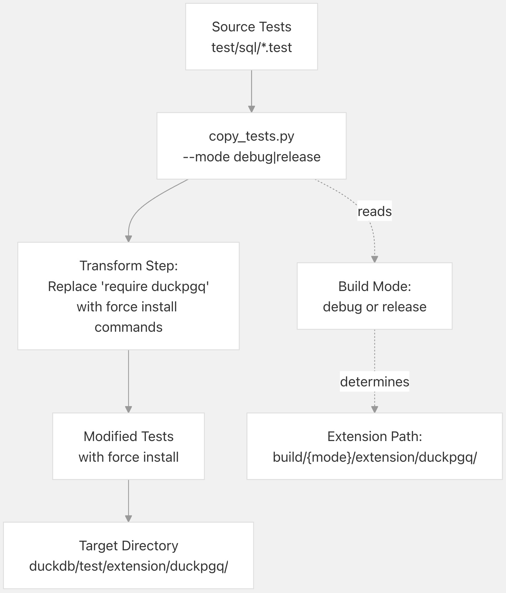
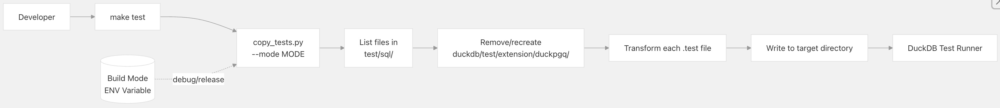
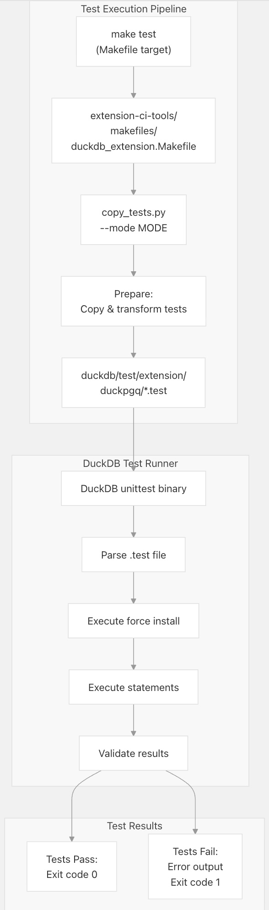
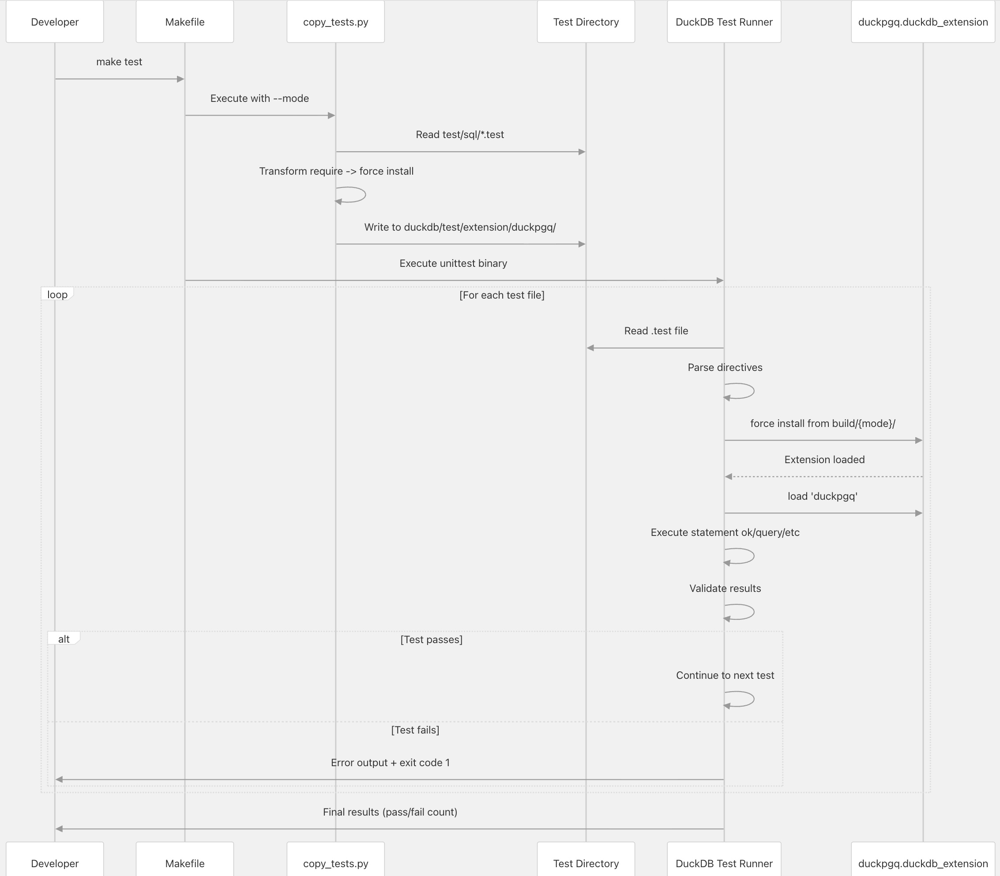

## DuckPGQ 源码学习: 7.2 测试框架 (`Testing Framework`)  
                                                      
### 作者                                                      
digoal                                                      
                                                      
### 日期                                                      
2025-11-08                                                      
                                                      
### 标签                                                      
DuckDB , PGQ , 属性图 , DuckPGQ , 源码学习                                                      
                                                      
----                                 
                                                      
## 背景      
本文解释 DuckPGQ 基于 **SQL** 的测试框架 (`SQL-based testing framework`)，包括测试文件结构 (`test file structure`)、测试准备脚本 (`test preparation script`) 和测试执行机制 (`test execution mechanisms`)。该测试框架确保所有图查询功能、模式匹配 (`pattern matching`) 和图算法 (`graph algorithms`) 能够在不同的平台和 **DuckDB** 版本中正常工作。  
  
## 测试结构 (`Test Structure`)  
  
DuckPGQ 使用 **DuckDB** 的基于 **SQL** 的测试框架，该框架允许将测试编写为 `.test` 文件，其中包含 **SQL** 语句和预期的输出。测试文件组织在 `test/sql/` 目录中。  
  
### 测试文件位置 (`Test File Location`)  
  
所有测试文件存储在：  
  
  * **源位置 (`Source location`)**：`test/sql/` 目录  
  * **执行位置 (`Execution location`)**：`duckdb/test/extension/duckpgq/`（在测试准备期间被复制和修改）  
  
该测试套件 (`test suite`) 涵盖：  
  
  * 属性图创建 (`Property graph creation`) 和模式验证 (`schema validation`)  
  * 模式匹配 (`Pattern matching`) 和路径查找 (`path finding`)  
  * 图算法 (`Graph algorithms`) (**PageRank**, 最短路径, 聚类 `clustering`)  
  * 边界情况 (`Edge cases`) 和错误处理 (`error handling`)  
  * 与 **SQL** 功能的集成 (`Integration with SQL features`)  
  
**来源:** [`scripts/copy_tests.py` 26-27](https://github.com/cwida/duckpgq-extension/blob/db304f58/scripts/copy_tests.py#L26-L27)  
  
### 测试文件格式 (`Test File Format`)  
  
测试文件使用 **DuckDB** 的测试格式，并包含以下 **指令** (`directives`)：  
  
| 指令 (`Directive`) | 目的 (`Purpose`) | 示例 (`Example`) |  
| :--- | :--- | :--- |  
| `require duckpgq` | 加载 **DuckPGQ** 扩展 | `require duckpgq` |  
| `statement ok` | 执行应该成功的 **SQL** | `statement ok`<br>`CREATE TABLE Person (...);` |  
| `statement error` | 执行应该以特定错误失败的 **SQL** | `statement error`<br>`CREATE PROPERTY GRAPH invalid ...` |  
| `query I` | 执行预期整数结果的查询 | `query I`<br>`SELECT count(*) FROM Person;` |  
| `query II` | 执行预期两个整数列的查询 | `query II`<br>`SELECT id, age FROM Person;` |  
  
结果类型包括：`I` (整数 `integer`)、`R` (实数/浮点数 `real/float`)、`T` (文本 `text`)、`L` (列表 `list`)，并且可以组合用于多列结果。  
  
## 测试准备: `copy_tests.py`  
  
`copy_tests.py` 脚本是一个关键组件，用于调整 **DuckPGQ** 的测试文件，使其能在 **DuckDB** 的测试运行器 (`test runner`) 中执行。该脚本执行转换，用一个**强制安装指令** (`force install directive`) 替换标准的扩展加载机制。  
  
### 脚本操作 (`Script Operation`)  
  
  
  
**图表: 测试准备流程 (`Test Preparation Flow`)**  
  
**来源:** [`scripts/copy_tests.py` 1-54](https://github.com/cwida/duckpgq-extension/blob/db304f58/scripts/copy_tests.py#L1-L54)  
  
### 转换逻辑 (`Transformation Logic`)  
  
该脚本对每个测试文件执行以下转换：  
  
**原始测试文件内容 (`Original test file content`)：**  
  
```  
require duckpgq  
  
statement ok  
CREATE TABLE Person ...  
```  
  
**转换后的测试文件内容 (`Transformed test file content`)：**  
  
```sql  
statement ok  
force install '__BUILD_DIRECTORY__/../../../build/{mode}/extension/duckpgq/duckpgq.duckdb_extension';  
  
statement ok  
load 'duckpgq';  
  
statement ok  
CREATE TABLE Person ...  
```  
  
此转换：  
  
1.  用明确的**强制安装**命令替换 `require duckpgq`  
2.  使用 **DuckDB** 的测试运行器解析的占位符 `__BUILD_DIRECTORY__`  
3.  根据模式指向 `build/debug/` 或 `build/release/` 中的已构建扩展  
4.  在安装后显式加载扩展  
  
**来源:** [`scripts/copy_tests.py` 40-45](https://github.com/cwida/duckpgq-extension/blob/db304f58/scripts/copy_tests.py#L40-L45)  
  
### 脚本调用 (`Script Invocation`)  
  
  
  
**图表: `copy_tests.py` 调用流程 (`copy_tests.py Invocation Flow`)**  
  
该脚本接受一个模式参数：  
  
```bash  
python scripts/copy_tests.py --mode release  # For release builds  
python scripts/copy_tests.py --mode debug    # For debug builds  
```  
  
| 参数 | 描述 |  
| :--- | :--- |  
| `--mode release` | 针对 `build/release/` 目录运行 |  
| `--mode debug` | 针对 `build/debug/` 目录运行 |  
  
无效模式会导致脚本抛出异常：`"Invalid parameter, --mode should be release or debug"`  
  
**来源:** [`scripts/copy_tests.py` 11-22](https://github.com/cwida/duckpgq-extension/blob/db304f58/scripts/copy_tests.py#L11-L22)  
  
### 目录管理 (`Directory Management`)  
  
该脚本管理目标目录的生命周期：  
  
1.  **检查存在性**：验证 `duckdb/test/extension/duckpgq/` 是否存在  
2.  **清理**：如果存在，移除整个目录树  
3.  **新建**：创建新的空目录  
4.  **填充**：复制和转换所有测试文件  
  
这确保每次测试运行都从一组干净、一致的测试文件开始。  
  
**来源:** [`scripts/copy_tests.py` 31-35](https://github.com/cwida/duckpgq-extension/blob/db304f58/scripts/copy_tests.py#L31-L35)  
  
## 测试执行 (`Test Execution`)  
  
  
  
**图表: 测试执行流水线 (`Test Execution Pipeline`)**  
  
**来源:** [`Makefile` 1-9](https://github.com/cwida/duckpgq-extension/blob/db304f58/Makefile#L1-L9) [`scripts/copy_tests.py` 1-54](https://github.com/cwida/duckpgq-extension/blob/db304f58/scripts/copy_tests.py#L1-L54)  
  
### 使用 `make test`  
  
运行测试的标准方法是通过 `make test` 目标 (`target`)：  
  
```bash  
make test          # Run tests with default configuration  
make test_release  # Run tests with release build  
make test_debug    # Run tests with debug build  
```  
  
| 命令 | 描述 |  
| :--- | :--- |  
| `make test_release` | 以 `release` 模式运行测试 |  
| `make test_debug` | 以 `debug` 模式运行测试 |  
  
**Makefile** 委托给 `extension-ci-tools/makefiles/duckdb_extension.Makefile`，它执行以下操作：  
  
1.  以适当的模式调用 `copy_tests.py`  
2.  在准备好的测试上调用 **DuckDB** 的测试运行器  
3.  报告结果  
  
**来源:** [`Makefile` 1-9](https://github.com/cwida/duckpgq-extension/blob/db304f58/Makefile#L1-L9)  
  
### 直接测试执行 (`Direct Test Execution`)  
  
测试也可以使用 **DuckDB** 的 `unittest` 二进制文件直接运行：  
  
**在 Linux/macOS 上：**  
  
```bash  
build/release/test/unittest  
build/debug/test/unittest  
```  
  
**在 Windows 上：**  
  
```bash  
build/release/test/Release/unittest.exe  
build/debug/test/Debug/unittest.exe  
```  
  
`unittest` 二进制文件会发现并运行 `duckdb/test/extension/duckpgq/` 中的所有 `.test` 文件。  
  
**来源:** [`.github/workflows/ExtensionTemplate.yml` 162](https://github.com/cwida/duckpgq-extension/blob/db304f58/.github/workflows/ExtensionTemplate.yml#L162-L162)  
  
## 测试生命周期 (`Test Lifecycle`)  
  
  
  
**图表: 测试生命周期序列 (`Test Lifecycle Sequence`)**  
  
**来源:** [`scripts/copy_tests.py` 1-54](https://github.com/cwida/duckpgq-extension/blob/db304f58/scripts/copy_tests.py#L1-L54) [`Makefile` 1-9](https://github.com/cwida/duckpgq-extension/blob/db304f58/Makefile#L1-L9)  
  
## 编写新测试 (`Writing New Tests`)  
  
要向 **DuckPGQ** 添加新测试：  
  
### 步骤 1: 创建测试文件 (`Step 1: Create Test File`)  
  
在 `test/sql/` 中创建一个新的 `.test` 文件：  
  
```  
test/sql/my_new_feature.test  
```  
  
### 步骤 2: 编写测试内容 (`Step 2: Write Test Content`)  
  
```sql  
# Load extension  
require duckpgq  
  
# Setup: Create tables and property graph  
statement ok  
CREATE TABLE Person (id BIGINT PRIMARY KEY, name VARCHAR);  
  
statement ok  
INSERT INTO Person VALUES (1, 'Alice'), (2, 'Bob');  
  
statement ok  
CREATE TABLE knows (src BIGINT, dst BIGINT,   
                    PRIMARY KEY(src, dst),  
                    FOREIGN KEY (src) REFERENCES Person(id),  
                    FOREIGN KEY (dst) REFERENCES Person(id));  
  
statement ok  
CREATE PROPERTY GRAPH friendships  
VERTEX TABLES (Person)  
EDGE TABLES (knows SOURCE KEY(src) REFERENCES Person(id)  
                    DESTINATION KEY(dst) REFERENCES Person(id));  
  
# Test: Query the graph  
query II  
SELECT a.name, b.name   
FROM GRAPH_TABLE(friendships MATCH (a:Person)-[k:knows]->(b:Person))  
ORDER BY a.name, b.name;  
----  
(expected results here)  
  
# Cleanup  
statement ok  
DROP PROPERTY GRAPH friendships;  
  
statement ok  
DROP TABLE knows;  
  
statement ok  
DROP TABLE Person;  
```  
  
### 步骤 3: 测试文件结构指南 (`Step 3: Test File Structure Guidelines`)  
  
**测试组织：**  
  
  * **设置部分 (`Setup section`)**：创建表、插入数据、创建属性图 (`property graphs`)  
  * **测试部分 (`Test section`)**：执行带有预期结果的查询  
  * **清理部分 (`Cleanup section`)**：删除属性图和表  
  
**最佳实践 (`Best practices`)：**  
  
  * 使用描述性的测试文件名  
  * 每个文件测试一个功能或场景  
  * 包括正向（应该成功）和反向（应该失败）的案例  
  * 使用 `statement error` 来测试带有预期错误消息的错误处理  
  * 最后清理所有创建的对象  
  
### 步骤 4: 运行您的测试 (`Step 4: Run Your Test`)  
  
```bash  
# Build and run all tests including your new one  
make test  
  
# Or run specific test file (after copy_tests.py)  
build/release/test/unittest "test/sql/my_new_feature.test"  
```  
  
**来源:** [`scripts/copy_tests.py` 1-54](https://github.com/cwida/duckpgq-extension/blob/db304f58/scripts/copy_tests.py#L1-L54)  
  
## CI 集成 (`CI Integration`)  
  
测试框架与 **CI/CD** 工作流集成，以确保测试在所有支持的平台上运行。  
  
### CI 测试执行 (`CI Test Execution`)  
  
  
  
**图表: CI 测试集成 (`CI Testing Integration`)**  
  
**来源:** [`.github/workflows/ExtensionTemplate.yml` 1-163](https://github.com/cwida/duckpgq-extension/blob/db304f58/.github/workflows/ExtensionTemplate.yml#L1-L163)  
  
### ExtensionTemplate 工作流 (`ExtensionTemplate Workflow`)  
  
`ExtensionTemplate.yml` 工作流演示了测试过程：  
  
**任务结构 (`Job structure`)：**  
  
1.  **设置 (`Setup`)**：安装依赖项 (**Ninja**, **Python**, **vcpkg**)  
2.  **检出 (`Checkout`)**：克隆带有子模块的存储库  
3.  **DuckDB 版本 (`DuckDB version`)**：可选地检出特定的 **DuckDB** 版本  
4.  **构建 (`Build`)**：运行 `make` 来构建扩展  
5.  **测试 (`Test`)**：运行 `make test` (**Linux/macOS**) 或 `unittest.exe` (**Windows**)  
  
工作流针对矩阵中定义的特定 **DuckDB** 版本进行测试：  
  
```  
matrix:  
  duckdb_version: [ 'v1.4.1' ]  
```  
  
| OS | DuckDB Version |  
| :--- | :--- |  
| ubuntu-latest | master |  
| windows-latest | master |  
| macos-latest | master |  
  
**来源:** [`.github/workflows/ExtensionTemplate.yml` 11-163](https://github.com/cwida/duckpgq-extension/blob/db304f58/.github/workflows/ExtensionTemplate.yml#L11-L163)  
  
### 平台特定的测试执行 (`Platform-Specific Test Execution`)  
  
| 平台 (`Platform`) | 测试命令 (`Test Command`) | `Unittest` 路径 (`Unittest Path`) |  
| :--- | :--- | :--- |  
| Linux | `make test` | `build/release/test/unittest` |  
| macOS | `make test` | `build/release/test/unittest` |  
| Windows | 直接执行 (`Direct execution`) | `build/release/test/Release/unittest.exe` |  
  
**来源:** [`.github/workflows/ExtensionTemplate.yml` 58-162](https://github.com/cwida/duckpgq-extension/blob/db304f58/.github/workflows/ExtensionTemplate.yml#L58-L162)  
  
## 测试类别 (`Test Categories`)  
  
**DuckPGQ** 的测试套件按功能组织：  
  
| 类别 (`Category`) | 目的 (`Purpose`) | 示例测试 (`Example Tests`) |  
| :--- | :--- | :--- |  
| 属性图创建 (`Property Graph Creation`) | 模式定义、验证 | 表关系、鉴别器 (`discriminators`)、标签 (`labels`) |  
| 模式匹配 (`Pattern Matching`) | `MATCH` 子句功能 | 顶点模式、边模式、方向性 |  
| 路径查找 (`Path Finding`) | 可变长度路径、最短路径 | 量词 (`Quantifiers`)、命名子路径、路径函数 |  
| 图算法 (`Graph Algorithms`) | 算法正确性 | **PageRank**、聚类系数 (`clustering coefficient`)、**WCC** |  
| 错误处理 (`Error Handling`) | 无效输入处理 | 缺失标签、无效 **CSR**、模式错误 |  
| **SQL** 集成 (`SQL Integration`) | 将图查询与关系查询结合 | `JOINs`、`CTEs`、带有 `GRAPH_TABLE` 的子查询 |  
  
每个类别在 `test/sql/` 中都有多个测试文件，涵盖各种场景和边界情况。  
  
## 总结 (`Summary`)  
  
**DuckPGQ** 测试框架提供：  
  
1.  **基于 SQL 的测试**：使用 **DuckDB** 测试格式的人类可读测试文件  
2.  **自动化准备**：`copy_tests.py` 脚本调整测试以适应 **DuckDB** 的测试运行器  
3.  **简单执行**：`make test` 运行整个测试套件  
4.  **CI 集成**：每次提交都会在所有平台上自动运行测试  
5.  **可扩展结构**：通过创建 `.test` 文件可轻松添加新测试  
  
该框架确保 **DuckPGQ** 在跨平台和 **DuckDB** 版本中保持高质量和兼容性。  
  
**来源:** [`scripts/copy_tests.py` 1-54](https://github.com/cwida/duckpgq-extension/blob/db304f58/scripts/copy_tests.py#L1-L54) [`Makefile` 1-9](https://github.com/cwida/duckpgq-extension/blob/db304f58/Makefile#L1-L9) [`.github/workflows/ExtensionTemplate.yml` 1-163](https://github.com/cwida/duckpgq-extension/blob/db304f58/.github/workflows/ExtensionTemplate.yml#L1-L163)  
      
#### [PolarDB 学习图谱](https://www.aliyun.com/database/openpolardb/activity "8642f60e04ed0c814bf9cb9677976bd4")
  
  
#### [PostgreSQL 解决方案集合](../201706/20170601_02.md "40cff096e9ed7122c512b35d8561d9c8")
  
  
#### [德哥 / digoal's Github - 公益是一辈子的事.](https://github.com/digoal/blog/blob/master/README.md "22709685feb7cab07d30f30387f0a9ae")
  
  
#### [About 德哥](https://github.com/digoal/blog/blob/master/me/readme.md "a37735981e7704886ffd590565582dd0")
  
  

  
