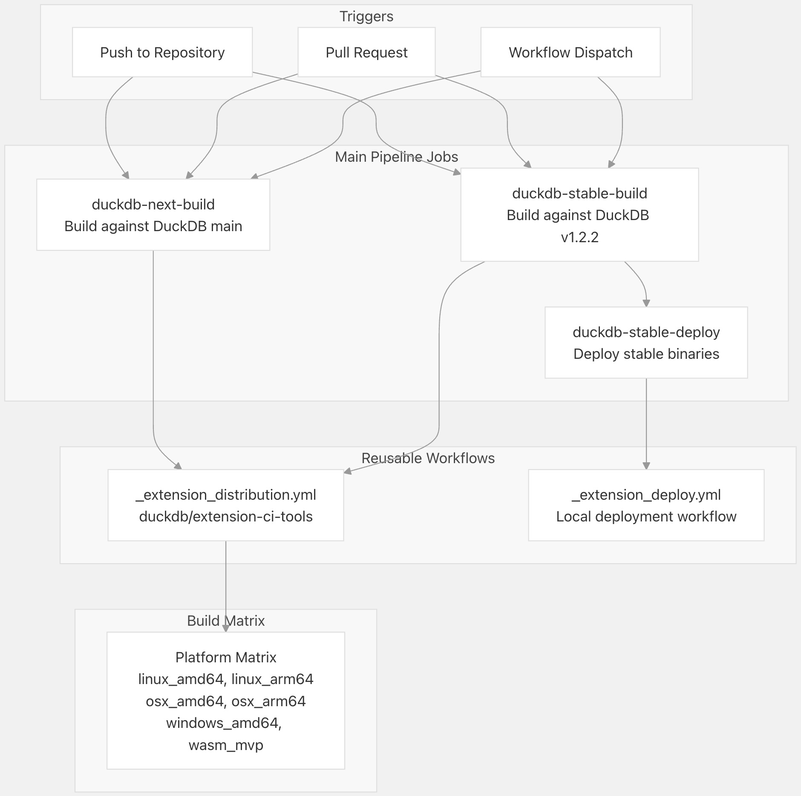
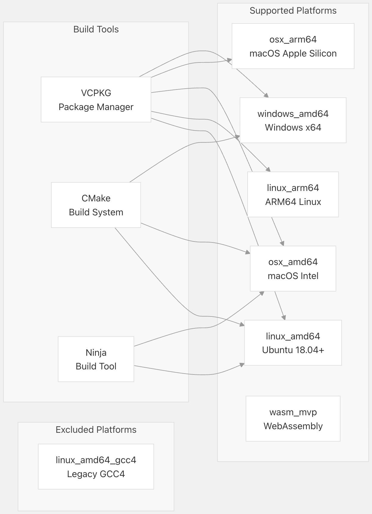
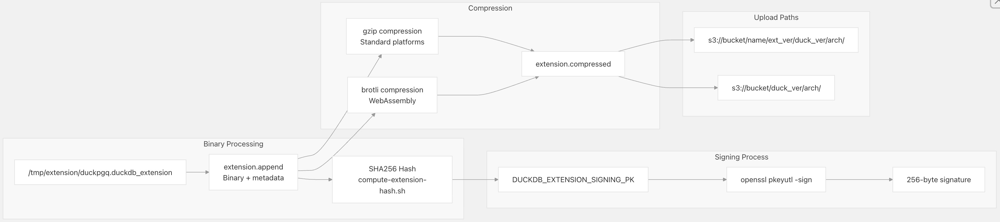
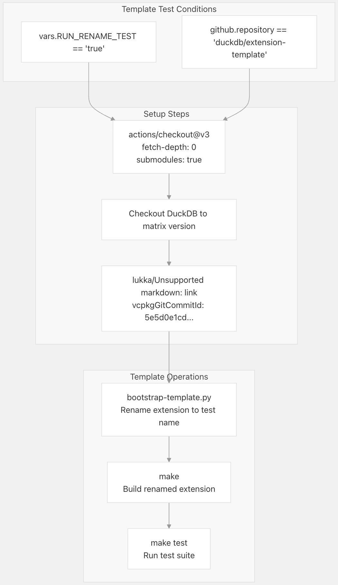
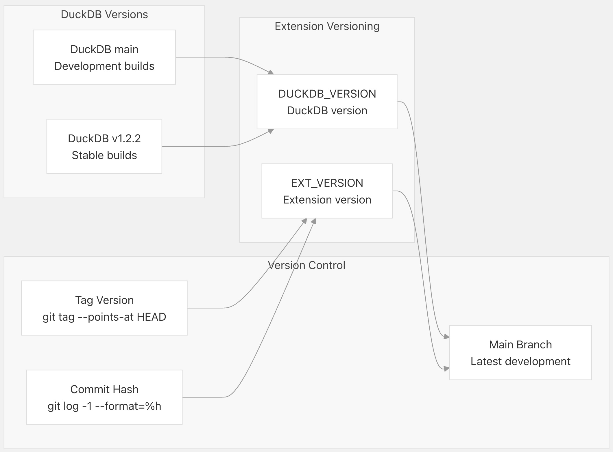

## DuckPGQ 源码学习: 7.3 CI/CD 流水线 (Pipeline)  
                                                        
### 作者                                                        
digoal                                                        
                                                        
### 日期                                                        
2025-11-08                                                        
                                                        
### 标签                                                        
DuckDB , PGQ , 属性图 , DuckPGQ , 源码学习                                                        
                                                        
----                                   
                                                        
## 背景    
本文介绍 DuckPGQ 扩展 (`extension`) 的持续集成与持续部署（**CI/CD**）流水线。该流水线负责在多个平台和 **DuckDB** 版本上进行扩展二进制文件 (`extension binaries`) 的构建（`building`）、测试（`testing`）、签名（`signing`）和分发（`distributing`）。  
  
## 概述 (Overview)  
  
**DuckPGQ CI/CD** 流水线基于 **GitHub Actions** 构建，并利用 **DuckDB** 的集中式扩展构建基础架构。该流水线会自动为多个平台构建扩展二进制文件，对其进行测试、出于安全目的进行签名，并部署到 **Amazon S3** 进行分发。  
  
### 流水线工作流架构 (Pipeline Workflow Architecture)  
  
  
  
来源: [`.github/workflows/MainDistributionPipeline.yml` 1-40](https://github.com/cwida/duckpgq-extension/blob/db304f58/.github/workflows/MainDistributionPipeline.yml#L1-L40)  
  
## 构建过程 (Build Process)  
  
构建过程包括两个并行的作业（`jobs`），它们针对不同的 **DuckDB** 版本：  
  
### DuckDB 版本矩阵 (DuckDB Version Matrix)  
  
| 作业名称 (Job Name) | DuckDB 版本 (Version) | CI 工具版本 (CI Tools Version) | 目的 (Purpose) |  
| :--- | :--- | :--- | :--- |  
| `duckdb-next-build` | `main` | `main` | 针对最新的 **DuckDB** 开发版本（`development`）进行构建 |  
| `duckdb-stable-build` | `v1.2.2` | `v1.2.1` | 针对稳定的 **DuckDB** 发布版本（`stable release`）进行构建 |  
  
### 构建配置 (Build Configuration)  
  
构建过程使用来自 `duckdb/extension-ci-tools` 的集中式 `_extension_distribution.yml` 工作流，并带有以下参数：  
  
```yml  
# For stable builds  
uses: duckdb/extension-ci-tools/.github/workflows/_extension_distribution.yml@v1.2.1  
with:  
  duckdb_version: v1.2.2  
  ci_tools_version: v1.2.1  
  extension_name: duckpgq  
```  
  
来源: [`.github/workflows/MainDistributionPipeline.yml` 23-29](https://github.com/cwida/duckpgq-extension/blob/db304f58/.github/workflows/MainDistributionPipeline.yml#L23-L29)  
  
### 平台支持矩阵 (Platform Support Matrix)  
  
  
  
来源: [`.github/workflows/_extension_deploy.yml` 25](https://github.com/cwida/duckpgq-extension/blob/db304f58/.github/workflows/_extension_deploy.yml#L25-L25) [`.github/workflows/ExtensionTemplate.yml` 22-24](https://github.com/cwida/duckpgq-extension/blob/db304f58/.github/workflows/ExtensionTemplate.yml#L22-L24)  
  
## 部署过程 (Deployment Process)  
  
部署过程仅针对稳定版本构建触发，并处理制品（`artifact`）到 **Amazon S3** 的分发。  
  
### 部署工作流 (Deployment Workflow)  
  
  
  
来源: [`.github/workflows/_extension_deploy.yml` 52-122](https://github.com/cwida/duckpgq-extension/blob/db304f58/.github/workflows/_extension_deploy.yml#L52-L122)  
  
### 扩展上传脚本 (Extension Upload Script)  
  
`extension-upload.sh` 脚本通过以下关键函数处理最终的上传过程：  
  
```bash  
# Script signature  
./extension-upload.sh <name> <extension_version> <duckdb_version> <architecture> <s3_bucket> <copy_to_latest> <copy_to_versioned>  
```  
  
#### 扩展处理流水线 (Extension Processing Pipeline)  
  
  
  
来源: [`scripts/extension-upload.sh` 14-88](https://github.com/cwida/duckpgq-extension/blob/db304f58/scripts/extension-upload.sh#L14-L88)  
  
## 扩展模板测试 (Extension Template Testing)  
  
流水线包括一个单独的工作流，用于测试允许基于 **DuckPGQ** 创建新 **DuckDB** 扩展的扩展模板系统。  
  
### 模板测试矩阵 (Template Test Matrix)  
  
| 平台 (Platform) | 容器 (Container) | DuckDB 版本 (Version) | 测试命令 (Test Command) |  
| :--- | :--- | :--- | :--- |  
| **Linux** | `ubuntu:18.04` | `v1.2.2` | `python3 scripts/bootstrap-template.py ext_1_a_123b_b11` |  
| **macOS** | `macos-latest` | `v1.2.2` | `python scripts/bootstrap-template.py ext_1_a_123b_b11` |  
| **Windows** | `windows-latest` | `1.2.1` | `python scripts/bootstrap-template.py ext_1_a_123b_b11` |  
  
### 模板工作流流程 (Template Workflow Process)  
  
  
  
来源: [`.github/workflows/ExtensionTemplate.yml` 6-178](https://github.com/cwida/duckpgq-extension/blob/db304f58/.github/workflows/ExtensionTemplate.yml#L6-L178)  
  
## 子模块管理 (Submodule Management)  
  
**CI/CD** 流水线依赖于两个关键子模块（`submodules`）进行操作：  
  
### 子模块配置 (Submodule Configuration)  
  
| 子模块 (Submodule) | 仓库 (Repository) | 分支 (Branch) | 目的 (Purpose) |  
| :--- | :--- | :--- | :--- |  
| `duckdb` | `git@github.com:cwida/duckdb-pgq.git` | `main` | 带有 **PGQ** 支持的自定义 **DuckDB fork** |  
| `extension-ci-tools` | `git@github.com:duckdb/extension-ci-tools.git` | `main` | 共享 **CI/CD** 工作流和工具 |  
  
### 版本同步 (Version Synchronization)  
  
  
  
来源: [`.gitmodules` 1-8](https://github.com/cwida/duckpgq-extension/blob/db304f58/.gitmodules#L1-L8) [`.github/workflows/_extension_deploy.yml` 114-121](https://github.com/cwida/duckpgq-extension/blob/db304f58/.github/workflows/_extension_deploy.yml#L114-L121)  
  
## 安全和签名 (Security and Signing)  
  
流水线实现了扩展签名（`extension signing`）以进行安全验证：  
  
### 签名过程 (Signing Process)  
  
1.  **私钥** (`Private Key`)：使用 `DUCKDB_EXTENSION_SIGNING_PK` **密钥**（`secret`）  
2.  **哈希计算** (`Hash Calculation`)：使用 `compute-extension-hash.sh` 计算 **SHA256** 哈希值  
3.  **数字签名** (`Digital Signature`)：使用 **OpenSSL PKCS\#1** 和 **SHA256** 摘要进行签名  
4.  **签名填充** (`Signature Padding`)：确保 256 字节的签名长度  
  
### WebAssembly 处理 (WebAssembly Handling)  
  
**WebAssembly** 扩展会受到特殊处理：  
  
```bash  
# Custom section header for WASM signatures  
echo -n -e '\x00' >> $ext.append          # Section type: custom  
echo -n -e '\x93\x02' >> $ext.append      # Section length: 275 bytes  
echo -n -e '\x10' >> $ext.append          # Name length: 16 bytes    
echo -n -e 'duckdb_signature' >> $ext.append  # Section name  
echo -n -e '\x80\x02' >> $ext.append      # Payload length: 256 bytes  
```  
  
来源: [`scripts/extension-upload.sh` 29-44](https://github.com/cwida/duckpgq-extension/blob/db304f58/scripts/extension-upload.sh#L29-L44) [`scripts/extension-upload.sh` 46-51](https://github.com/cwida/duckpgq-extension/blob/db304f58/scripts/extension-upload.sh#L46-L51)  
  
## 分发架构 (Distribution Architecture)  
  
最终分发系统使用具有公共读取权限的 **Amazon S3**：  
  
### S3 存储桶结构 (S3 Bucket Structure)  
  
```  
s3://duckpgq.s3.eu-north-1.amazonaws.com/  
├── latest/  
│   ├── v1.2.2/  
│   │   ├── linux_amd64/  
│   │   │   └── duckpgq.duckdb_extension.gz  
│   │   ├── osx_arm64/  
│   │   │   └── duckpgq.duckdb_extension.gz  
│   │   └── wasm_mvp/  
│   │       └── duckpgq.duckdb_extension.wasm  
│   └── ...  
└── versioned/  
    └── duckpgq/  
        └── <extension_version>/  
            └── <duckdb_version>/  
                └── <architecture>/  
                    └── duckpgq.duckdb_extension.gz  
  
```  
  
来源: [`scripts/extension-upload.sh` 71-87](https://github.com/cwida/duckpgq-extension/blob/db304f58/scripts/extension-upload.sh#L71-L87)  
    
#### [PolarDB 学习图谱](https://www.aliyun.com/database/openpolardb/activity "8642f60e04ed0c814bf9cb9677976bd4")
  
  
#### [PostgreSQL 解决方案集合](../201706/20170601_02.md "40cff096e9ed7122c512b35d8561d9c8")
  
  
#### [德哥 / digoal's Github - 公益是一辈子的事.](https://github.com/digoal/blog/blob/master/README.md "22709685feb7cab07d30f30387f0a9ae")
  
  
#### [About 德哥](https://github.com/digoal/blog/blob/master/me/readme.md "a37735981e7704886ffd590565582dd0")
  
  

  
