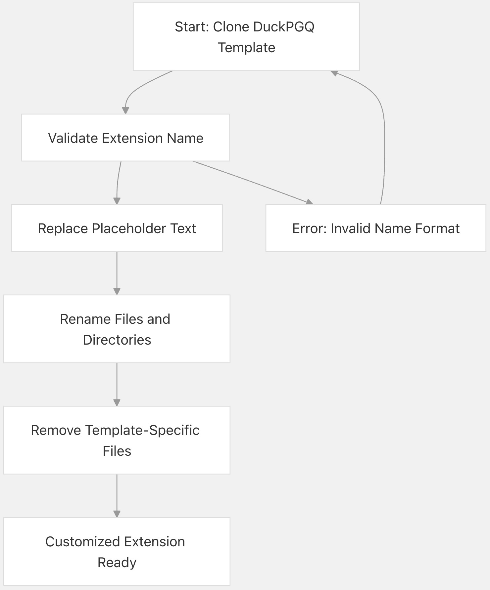
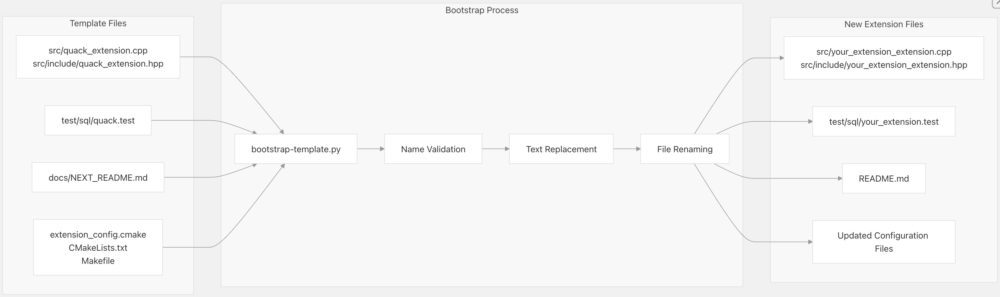
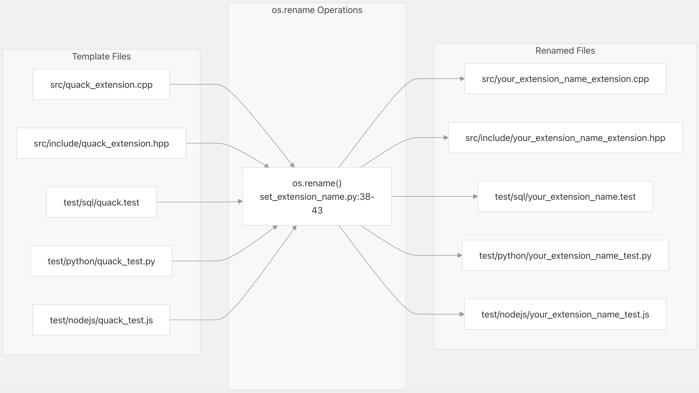
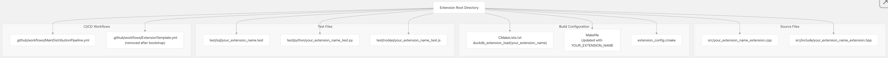

## DuckPGQ 源码学习: 7.4 扩展模板 (Extension Template)  
                                                          
### 作者                                                          
digoal                                                          
                                                          
### 日期                                                          
2025-11-08                                                          
                                                          
### 标签                                                          
DuckDB , PGQ , 属性图 , DuckPGQ , 源码学习                                                          
                                                          
----                                     
                                                          
## 背景      
本文介绍如何使用 `DuckPGQ` 存储库作为创建新的 **DuckDB 扩展**（`DuckDB extensions`）的模板。该模板系统提供了一个完整的基础，包括**构建配置**（`build configuration`）、**持续集成/持续部署**（`CI/CD pipelines`）、**测试框架**（`testing framework`）以及可为新扩展定制的示例代码。  
  
## 模板概述 (`Template Overview`)  
  
`DuckPGQ` 存储库可作为创建 **DuckDB 扩展**（`DuckDB extensions`）的模板。它提供了**构建系统**（`build systems`）、**自动化测试**（`automated testing`）、**跨平台持续集成/持续部署**（`cross-platform CI/CD pipelines`）以及**部署基础设施**（`deployment infrastructure`）。  
  
### 模板组件 (`Template Components`)  
  
该模板包含以下组件：  
  
| Component (组件) | Description (描述) | Key Files (关键文件) |  
| :--- | :--- | :--- |  
| **引导脚本**（`Bootstrap Scripts`） | 自动化设置和定制（Automated setup and customization） | `scripts/bootstrap-template.py`, `scripts/set_extension_name.py` |  
| **构建配置**（`Build Configuration`） | `CMake` 和 `Makefile` 设置（CMake and Makefile setup） | `CMakeLists.txt`, `Makefile`, `extension_config.cmake` |  
| **持续集成/持续部署**（`CI/CD Pipeline`） | `GitHub Actions` 工作流（GitHub Actions workflows） | `.github/workflows/MainDistributionPipeline.yml`, `.github/workflows/ExtensionTemplate.yml` |  
| **测试框架**（`Testing Framework`） | `SQL` 和集成测试（SQL and integration tests） | `test/sql/`, `test/python/`, `test/nodejs/` |  
| **示例代码**（`Example Code`） | 示例扩展实现（Sample extension implementation） | `src/` |  
| **文档**（`Documentation`） | `README` 和设置指南（README and setup guides） | `docs/` |  
  
**来源:**  
[`./github/workflows/ExtensionTemplate.yml` 1-163](https://github.com/cwida/duckpgq-extension/blob/db304f58/.github/workflows/ExtensionTemplate.yml#L1-L163)  
[`scripts/set_extension_name.py` 1-44](https://github.com/cwida/duckpgq-extension/blob/db304f58/scripts/set_extension_name.py#L1-L44)  
  
### 使用引导脚本 (`Bootstrap Script`)  
  
从模板创建新扩展的主要方法是使用 `bootstrap-template.py` 脚本：  
  
```bash  
python3 scripts/bootstrap-template.py your_extension_name  
```  
  
该脚本执行**验证**（`validation`）和**转换**（`transformation`）步骤。  
  
**名称验证**（`Name Validation`）：  
  
  * 确保名称不以数字开头（Ensures the name doesn't start with a digit）  
  * 使用**正则表达式**（`regex`）模式 `^[a-z0-9]+(_[a-z0-9]+)*$` 验证**蛇形命名法**（`snake_case`）格式  
  * 将名称转换为适当的大小写格式（**驼峰式命名法** `camelCase`、**大写命名法** `UPPER_CASE`）  
  
**文件内容替换**（`File Content Replacement`）：  
`set_extension_name.py` 脚本（内部调用）会替换占位符字符串：  
  
  * `"quack"` → `your_extension_name` (您的扩展名称)  
  * `"Quack"` → `YourExtensionName` (您的扩展名称，首字母大写)  
  * `"QUACK"` → `YOUR_EXTENSION_NAME` (您的扩展名称，全部大写)  
  
**File Operations (文件操作):**  
  * **Renames source files (重命名源文件):** `quack_extension.cpp` → `your_extension_name_extension.cpp`  
  * **Renames header files (重命名头文件):** `quack_extension.hpp` → `your_extension_name_extension.hpp`  
  * **Renames test files (重命名测试文件):** `quack.test` → `your_extension_name.test`  
  * **Updates documentation (更新文档):** replaces `NEXT_README.md` with `README.md` (用 `README.md` 替换 `NEXT_README.md`)  
  
来源:  
[`scripts/bootstrap-template.py` 7-94](https://github.com/cwida/duckpgq-extension/blob/db304f58/scripts/bootstrap-template.py#L7-L94)  
  
### **Using the Bootstrap Script (使用引导脚本)**  
  
从模板创建新扩展的主要方法是使用 `bootstrap-template.py` 脚本：  
  
```python  
python3 scripts/bootstrap-template.py your_extension_name  
```  
  
该脚本执行验证（`validation`）和转换（`transformation`）步骤。  
  
#### **Name Validation (名称验证):**  
  
  * 确保名称不以数字开头。  
  * 使用正则表达式（`regex`）模式 `^[a-z0-9]+(_[a-z0-9]+)*$` 验证 **snake\_case** 格式（下划线命名法）。  
  * 将名称转换为适当的命名约定格式（**case formats**），如 **camelCase** (驼峰命名法) 和 **UPPER\_CASE** (大写命名法)。  
  
#### **File Content Replacement (文件内容替换):**  
  
`set_extension_name.py` 脚本（在内部调用）会替换以下占位符字符串：  
  
  * `"quack"` → `your_extension_name`  
  * `"Quack"` → `YourExtensionName` (**capitalized**, 首字母大写)  
  * `"QUACK"` → `YOUR_EXTENSION_NAME` (**uppercase**, 全部大写)  
  
该脚本会在以下文件类型中进行查找和替换：  
  
  * **GitHub workflows (工作流):** `.github/**/*.yml`  
    [`scripts/set_extension_name.py` 20](https://github.com/cwida/duckpgq-extension/blob/db304f58/scripts/set_extension_name.py#L20-L20)  
  * **Python tests (测试):** `test/**/*.py`  
    [`scripts/set_extension_name.py` 21](https://github.com/cwida/duckpgq-extension/blob/db304f58/scripts/set_extension_name.py#L21-L21)  
  * **SQL tests (测试):** `test/**/*.test`  
    [`scripts/set_extension_name.py` 22](https://github.com/cwida/duckpgq-extension/blob/db304f58/scripts/set_extension_name.py#L22-L22)  
  * **Node.js tests (测试):** `test/**/*.js`  
    [`scripts/set_extension_name.py` 23](https://github.com/cwida/duckpgq-extension/blob/db304f58/scripts/set_extension_name.py#L23-L23)  
  * **C++ headers (头文件):** `src/**/*.hpp`  
    [`scripts/set_extension_name.py` 24](https://github.com/cwida/duckpgq-extension/blob/db304f58/scripts/set_extension_name.py#L24-L24)  
  * **C++ sources (源文件):** `src/**/*.cpp`  
    [`scripts/set_extension_name.py` 25](https://github.com/cwida/duckpgq-extension/blob/db304f58/scripts/set_extension_name.py#L25-L25)  
  * **Build files (构建文件):** `CMakeLists.txt`, `Makefile`  
    [`scripts/set_extension_name.py` 32-35](https://github.com/cwida/duckpgq-extension/blob/db304f58/scripts/set_extension_name.py#L32-L35)  
  
#### **File Renaming Operations (文件重命名操作)**  
  
[`scripts/set_extension_name.py` 38-43](https://github.com/cwida/duckpgq-extension/blob/db304f58/scripts/set_extension_name.py#L38-L43):  
  
  * `test/python/quack_test.py` → `test/python/your_extension_name_test.py`  
  * `test/sql/quack.test` → `test/sql/your_extension_name.test`  
  * `src/quack_extension.cpp` → `src/your_extension_name_extension.cpp`  
  * `src/include/quack_extension.hpp` → `src/include/your_extension_name_extension.hpp`  
  * `test/nodejs/quack_test.js` → `test/nodejs/your_extension_name_test.js`  
  
来源:  
[`scripts/set_extension_name.py` 1-44](https://github.com/cwida/duckpgq-extension/blob/db304f58/scripts/set_extension_name.py#L1-L44)  
  
## **Bootstrap Process (引导过程)**  
  
### **Template Bootstrapping Flow (模板引导流程)**  
  
  
  
### **Using the Bootstrap Script (使用引导脚本)**  
  
创建新扩展的主要方法是使用 `bootstrap-template.py` 脚本：  
  
```bash  
python3 scripts/bootstrap-template.py your_extension_name  
```  
  
该脚本执行以下验证（`validation`）和转换（`transformation`）步骤：  
  
**Name Validation (名称验证)**:  
  
  * 确保名称不以数字开头。  
  * 使用正则表达式（`regex`）模式 `^[a-z0-9]+(_[a-z0-9]+)*$` 验证 **snake\_case** 格式（下划线命名法）。  
  * 将名称转换为适当的命名约定格式，如 **camelCase** (驼峰命名法) 和 **UPPER\_CASE** (大写命名法)。  
  
**File Content Replacement (文件内容替换)**:  
该脚本会替换整个代码库中的占位符字符串：  
  
  * `"quack"` → `your_extension_name`  
  * `"Quack"` → `YourExtensionName` (**camelCase**)  
  * `"<extension_name>"` → `your_extension_name`  
  
**File Operations (文件操作)**:  
  
  * 重命名源文件：`quack_extension.cpp` → `your_extension_name_extension.cpp`  
  * 重命名头文件：`quack_extension.hpp` → `your_extension_name_extension.hpp`  
  * 重命名测试文件：`quack.test` → `your_extension_name.test`  
  * 更新文档：将 `NEXT_README.md` 替换为 `README.md`  
  
来源:  
[`scripts/bootstrap-template.py` 7-94](https://github.com/cwida/duckpgq-extension/blob/db304f58/scripts/bootstrap-template.py#L7-L94)  
  
### **File Transformation Process (文件转换过程)**  
  
  
  
来源:  
[`scripts/bootstrap-template.py` 66-89](https://github.com/cwida/duckpgq-extension/blob/db304f58/scripts/bootstrap-template.py#L66-L89)  
  
## **Extension Configuration (扩展配置)**  
  
### **Build System Integration (构建系统集成)**  
  
该模板通过 `extension_config.cmake` 提供了与 **DuckDB** 扩展加载系统（`extension loading system`）的集成：  
  
```cmake  
duckdb_extension_load(duckpgq  
    LOAD_TESTS  
    SOURCE_DIR ${CMAKE_CURRENT_LIST_DIR}  
)  
```  
  
在引导（`bootstrapping`）之后，它会变为：  
  
```cmake  
duckdb_extension_load(your_extension_name  
    LOAD_TESTS  
    SOURCE_DIR ${CMAKE_CURRENT_LIST_DIR}  
)  
```  
  
`LOAD_TESTS` 标志（`flag`）启用自动测试发现和执行，作为构建过程的一部分。  
  
来源:  
[`extension_config.cmake` 3-7](https://github.com/cwida/duckpgq-extension/blob/db304f58/extension_config.cmake#L3-L7)  
  
### **Custom Toolchain Setup (自定义工具链设置)**  
  
该模板支持通过 `setup-custom-toolchain.sh` 来满足自定义工具链（`toolchain`）要求。可以自定义此脚本来安装额外的依赖项（`dependencies`）或配置构建环境（`build environments`）：  
  
```bash  
# Example customization for different platforms  
echo "Custom toolchain script running for architecture '$DUCKDB_PLATFORM'"  
```  
  
当工作流配置（`workflow configuration`）中启用了 `custom_toolchain_script` 时，该脚本会在 **CI/CD** 流水线中条件性地执行。  
  
来源:  
[`scripts/setup-custom-toolchain.sh` 1-12](https://github.com/cwida/duckpgq-extension/blob/db304f58/scripts/setup-custom-toolchain.sh#L1-L12)  
  
## **Template Customization (模板定制)**  
  
### **Search and Replace Implementation (查找和替换实现)**  
  
`set_extension_name.py` 脚本实现了查找和替换逻辑（`search and replace logic`）。它使用 Python 的 `Path.rglob()` 来递归查找匹配特定模式的文件。 [`scripts/set_extension_name.py` 19-29](https://github.com/cwida/duckpgq-extension/blob/db304f58/scripts/set_extension_name.py#L19-L29)  
  
**Replace Function (替换函数)**  
  
```python  
def replace(file_name, to_find, to_replace):  
    with open(file_name, 'r', encoding="utf8") as file:  
        filedata = file.read()  
    filedata = filedata.replace(to_find, to_replace)  
    with open(file_name, 'w', encoding="utf8") as file:  
        file.write(filedata)  
```  
  
来源:  
[`scripts/set_extension_name.py` 12-17](https://github.com/cwida/duckpgq-extension/blob/db304f58/scripts/set_extension_name.py#L12-L17)  
  
**File Type Patterns (文件类型模式)**  
  
  * `Path('./.github').rglob('./**/*.yml')` - **GitHub** 工作流（`workflows`）  
  * `Path('./test').rglob('./**/*.py')` - Python 测试  
  * `Path('./test').rglob('./**/*.test')` - SQL 测试  
  * `Path('./test').rglob('./**/*.js')` - Node.js 测试  
  * `Path('./src').rglob('./**/*.hpp')` - C++ 头文件（`headers`）  
  * `Path('./src').rglob('./**/*.cpp')` - C++ 源文件（`sources`）  
  * `Path('./src').rglob('./**/*.txt')` - 文本文件  
  * `Path('./src').rglob('./**/*.md')` - Markdown 文件  
  
来源:  
[`scripts/set_extension_name.py` 19-29](https://github.com/cwida/duckpgq-extension/blob/db304f58/scripts/set_extension_name.py#L19-L29)  
  
**Case Transformations (大小写转换)**  
  
  * 基础替换：`quack` → `your_extension_name`  
  * 首字母大写：`Quack` → `YourExtensionName` (使用 `.capitalize()`)  
  * 全部大写：`QUACK` → `YOUR_EXTENSION_NAME` (使用 `.upper()`)  
  
来源:  
[`scripts/set_extension_name.py` 29-35](https://github.com/cwida/duckpgq-extension/blob/db304f58/scripts/set_extension_name.py#L29-L35)  
[`scripts/set_extension_name.py` 12-35](https://github.com/cwida/duckpgq-extension/blob/db304f58/scripts/set_extension_name.py#L12-L35)  
  
### **Extension Structure After Bootstrap (引导后的扩展结构)**  
  
#### **File Transformation Mapping (文件转换映射)**  
  
  
  
| 原始文件路径 | 目标文件路径 |  
| :--- | :--- |  
| `test/python/quack_test.py` | `test/python/your_extension_name_test.py` |  
| `test/sql/quack.test` | `test/sql/your_extension_name.test` |  
| `src/quack_extension.cpp` | `src/your_extension_name_extension.cpp` |  
| `src/include/quack_extension.hpp` | `src/include/your_extension_name_extension.hpp` |  
| `test/nodejs/quack_test.js` | `test/nodejs/your_extension_name_test.js` |  
  
来源:  
[`scripts/set_extension_name.py` 38-43](https://github.com/cwida/duckpgq-extension/blob/db304f58/scripts/set_extension_name.py#L38-L43)  
  
#### **Extension Directory Structure (扩展目录结构)**  
  
  
  
来源:  
[`scripts/set_extension_name.py` 32-43](https://github.com/cwida/duckpgq-extension/blob/db304f58/scripts/set_extension_name.py#L32-L43) [`./github/workflows/ExtensionTemplate.yml` 14](https://github.com/cwida/duckpgq-extension/blob/db304f58/.github/workflows/ExtensionTemplate.yml#L14-L14)  
  
## **Extension Maintenance (扩展维护)**  
  
### **Version Updates (版本更新)**  
  
该模板包含有关随着 **DuckDB** 发展而维护扩展的文档。关键的更新过程包括：  
  
**Submodule Updates (子模块更新)**:  
  
  * 将 `./duckdb` 更新到最新的标签（`tagged`）发布版本。  
  * 将 `./extension-ci-tools` 更新到相应的分支（`branch`）。  
  * 同步 `.github/workflows/` 中的工作流版本（`workflow versions`）。  
  
**API Compatibility (API 兼容性)**:  
**DuckDB** 的内部 C++ **API** 可能会在不同版本之间发生变化，需要更新扩展代码。该模板提供了使用 **DuckDB** 的发布说明（`release notes`）和核心扩展补丁（`core extension patches`）来处理 **API** 更改的指导。  
  
来源:  
[`docs/UPDATING.md` 1-23](https://github.com/cwida/duckpgq-extension/blob/db304f58/docs/UPDATING.md#L1-L23)  
  
### **Cleanup Operations (清理操作)**  
  
引导过程（`bootstrap process`）会自动删除模板特定的工件（`artifacts`）：  
  
**Files Removed (已移除的文件)**:  
  
  * `.github/workflows/ExtensionTemplate.yml` - 模板验证工作流（`Template validation workflow`）  
  * `docs/NEXT_README.md` - 模板 **README**  
  * `docs/README.md` - 模板文档  
  * `scripts/bootstrap-template.py` - 引导脚本（自删除）  
  
**Files Preserved (已保留的文件)**:  
  
  * 构建配置文件（`CMakeLists.txt`、`Makefile`、`extension_config.cmake`）  
  * `.github/workflows/MainDistributionPipeline.yml` - 主要 **CI/CD** 工作流  
  * 测试框架结构（`test/sql/`、`test/python/`、`test/nodejs/`）  
  * 源代码模板（已重命名为新的扩展名称）  
  
`ExtensionTemplate.yml` 工作流会专门检查仓库以确定它是否应该运行，从而防止在模板引导到新扩展后继续执行。  
  
来源:  
[`./github/workflows/ExtensionTemplate.yml` 14](https://github.com/cwida/duckpgq-extension/blob/db304f58/.github/workflows/ExtensionTemplate.yml#L14-L14)  
  
## **Integration with DuckDB Extension System (与 DuckDB 扩展系统的集成)**  
  
该模板提供了与 **DuckDB** 扩展加载和分发系统（`extension loading and distribution system`）的完全集成，使新扩展能够利用 **DuckPGQ** 用于跨多个平台进行构建、测试和部署的相同基础设施。  
  
      
#### [PolarDB 学习图谱](https://www.aliyun.com/database/openpolardb/activity "8642f60e04ed0c814bf9cb9677976bd4")
  
  
#### [PostgreSQL 解决方案集合](../201706/20170601_02.md "40cff096e9ed7122c512b35d8561d9c8")
  
  
#### [德哥 / digoal's Github - 公益是一辈子的事.](https://github.com/digoal/blog/blob/master/README.md "22709685feb7cab07d30f30387f0a9ae")
  
  
#### [About 德哥](https://github.com/digoal/blog/blob/master/me/readme.md "a37735981e7704886ffd590565582dd0")
  
  

  
