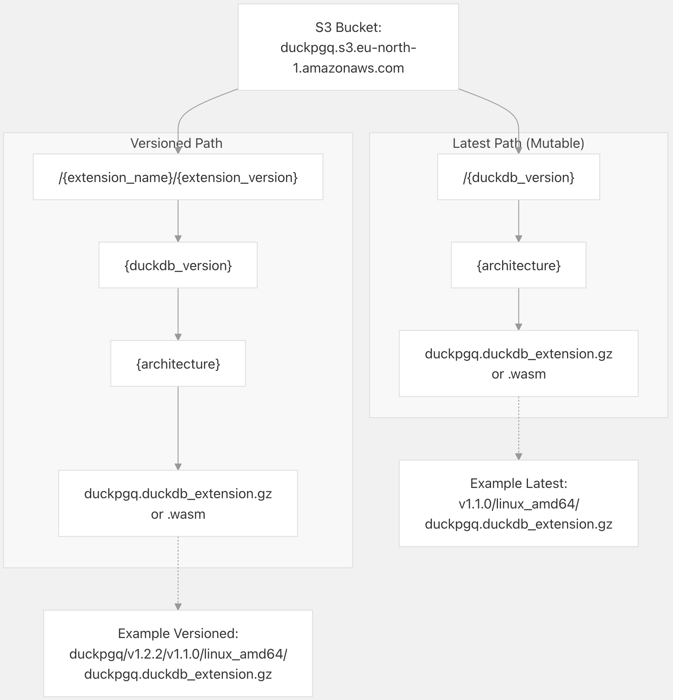
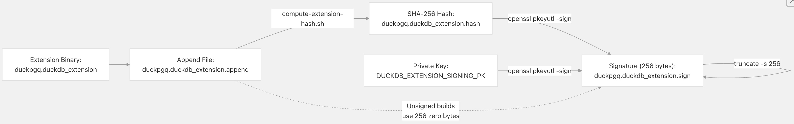
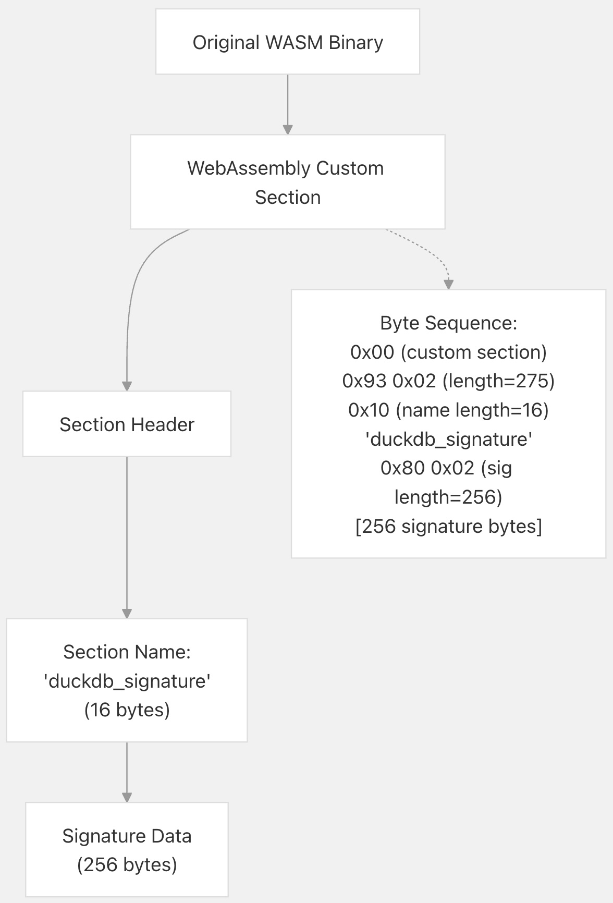
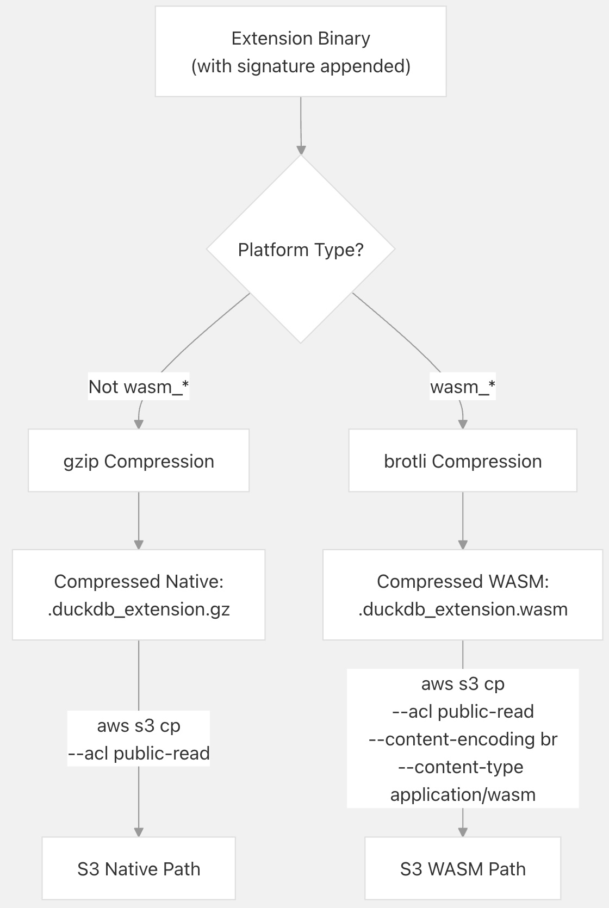
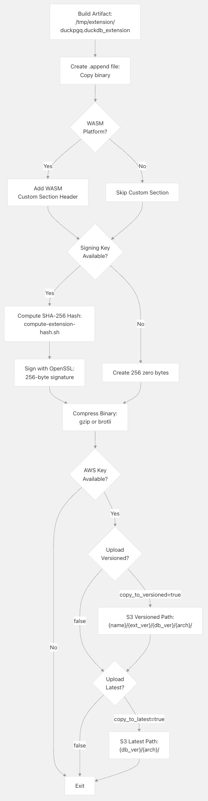
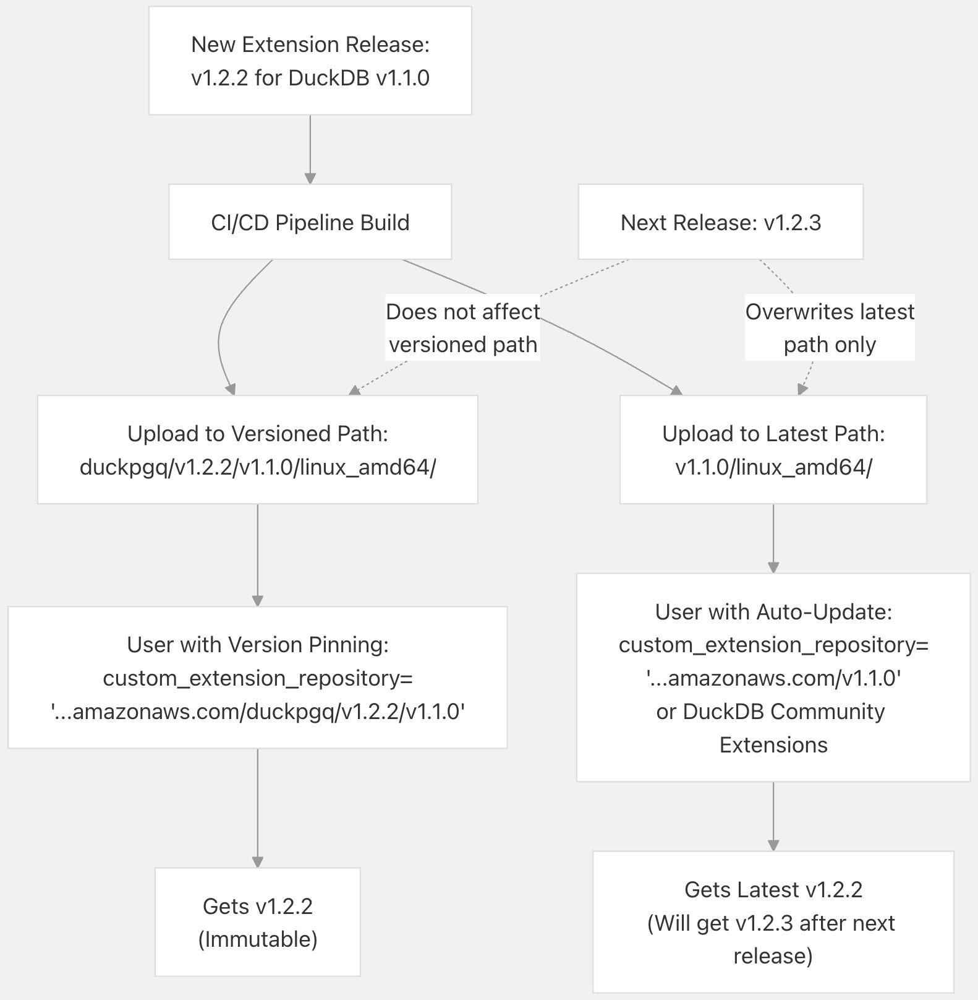

## DuckPGQ 源码学习: 7.5 扩展分发 (Extension Distribution)  
                                                            
### 作者                                                            
digoal                                                            
                                                            
### 日期                                                            
2025-11-08                                                            
                                                            
### 标签                                                            
DuckDB , PGQ , 属性图 , DuckPGQ , 源码学习                                                            
                                                            
----                                       
                                                            
## 背景     
本文介绍 **DuckPGQ 扩展二进制文件 (Extension Binaries)** 的分发流程 (**distribution process**)。扩展通过 **持续集成/持续部署 (CI/CD Pipeline)**（请参阅 [CI/CD Pipeline](/cwida/duckpgq-extension/7.3-cicd-pipeline)）构建完成后，必须进行打包 (**packaged**)、安全签名 (**signed**)、根据平台进行适当压缩 (**compressed**)，并上传到 **S3 存储 (S3 storage)** 供用户访问。  
  
涵盖了上传脚本、S3 存储桶结构 (**S3 bucket structure**)、签名机制 (**signing mechanism**)、压缩策略 (**compression strategies**) 和自动化的可用性文档。  
  
-----   
  
### S3 存储桶结构 (S3 Bucket Structure)  
  
DuckPGQ 扩展的二进制文件存储在 `duckpgq.s3.eu-north-1.amazonaws.com` 的 S3 存储桶 (**S3 bucket**) 中。该存储桶维护着两个并行目录结构 (**parallel directory structures**)，以支持特定版本 (**version-specific**) 和最新版本 (**latest-version**) 的安装。  
  
#### 目录组织 (Directory Organization)  
  
    
  
**来源:** [`scripts/extension-upload.sh` 71-86](https://github.com/cwida/duckpgq-extension/blob/db304f58/scripts/extension-upload.sh#L71-L86) [`README.md` 27-29](https://github.com/cwida/duckpgq-extension/blob/db304f58/README.md#L27-L29)  
  
#### 路径组成部分 (Path Components)  
  
| 组成部分 (Component) | 描述 (Description) | 示例值 (Example Values) |  
| :--- | :--- | :--- |  
| `{extension_name}` | 扩展名称 (Extension Name) | `duckpgq` |  
| `{extension_version}` | 扩展版本标签 (Extension Version Tag) | `v1.2.2`, `v1.1.3` |  
| `{duckdb_version}` | 兼容的 DuckDB 版本 (Compatible DuckDB Version) | `v1.1.0`, `v1.2.0` |  
| `{architecture}` | 目标平台和架构 (Target Platform and Architecture) | `linux_amd64`, `osx_arm64`, `windows_amd64`, `wasm_eh` |  
  
#### 版本化路径 vs. 最新路径 (Versioned vs Latest Paths)  
  
**版本化路径 (Versioned Path)** (`/{name}/{ext_ver}/{db_ver}/{arch}/`):  
  
  * 上传后**不可变 (Immutable)**。  
  * 保留历史版本。  
  * 完整路径包含扩展版本，用于精确的**版本控制 (version control)**。  
  * 用于可复现构建 (**reproducible builds**) 和**版本锁定 (version pinning)**。  
  
**最新路径 (Latest Path)** (`/{db_ver}/{arch}/`):  
  
  * **可变 (Mutable)**，随每次发布更新。  
  * 路径中省略了扩展版本。  
  * 允许用户在不知道版本号的情况下安装最新兼容版本。  
  * 默认在 DuckDB 的**扩展自动安装 (extension auto-installation)** 中使用。  
  
**来源:** [`scripts/extension-upload.sh` 71-86](https://github.com/cwida/duckpgq-extension/blob/db304f58/scripts/extension-upload.sh#L71-L86) [`README.md` 20-29](https://github.com/cwida/duckpgq-extension/blob/db304f58/README.md#L20-L29)  
  
-----  
  
### 二进制文件签名流程 (Binary Signing Process)  
  
扩展二进制文件经过**密码学签名 (cryptographically signed)**，以确保**真实性 (authenticity)** 和**防止篡改 (prevent tampering)**。签名流程使用 OpenSSL、SHA-256 哈希 (**hashing**) 和 RSA 私钥加密 (**private key encryption**)。  
  
    
  
**来源:** [`scripts/extension-upload.sh` 26-54](https://github.com/cwida/duckpgq-extension/blob/db304f58/scripts/extension-upload.sh#L26-L54)  
  
#### 签名步骤 (Signing Steps)  
  
签名流程遵循 [`scripts/extension-upload.sh` 26-54](https://github.com/cwida/duckpgq-extension/blob/db304f58/scripts/extension-upload.sh#L26-L54) 中的以下步骤：  
  
1.  **准备二进制文件**: 将原始扩展二进制文件复制到 `.append` 文件。  
2.  **计算哈希值**: 使用 `compute-extension-hash.sh` 生成二进制文件的 SHA-256 哈希值。  
3.  **签署哈希值**: 如果设置了 `DUCKDB_EXTENSION_SIGNING_PK`，则使用 OpenSSL 签署哈希值。  
    ```bash  
    openssl pkeyutl -sign -in $ext.hash -inkey private.pem \  
      -pkeyopt digest:sha256 -out $ext.sign  
    ```  
4.  **填充签名**: 使用 `truncate -s 256` 确保签名恰好为 256 字节。  
5.  **默认未签名处理**: 如果未提供签名密钥，则创建 256 个零字节作为**占位符 (placeholder)**。  
  
#### WebAssembly 签名嵌入 (WebAssembly Signature Embedding)  
  
对于 **WebAssembly (WASM)** 构建，签名作为**自定义段 (custom section)** 嵌入到 WASM 二进制文件中 [`scripts/extension-upload.sh` 29-43](https://github.com/cwida/duckpgq-extension/blob/db304f58/scripts/extension-upload.sh#L29-L43)：  
  
    
  
**来源:** [`scripts/extension-upload.sh` 29-43](https://github.com/cwida/duckpgq-extension/blob/db304f58/scripts/extension-upload.sh#L29-L43)  
  
自定义段结构如下：  
  
  * **段类型 (Section Type)**: `0x00` (自定义段标记)  
  * **段长度 (Section Length)**: `0x93 0x02` (总共 275 字节的 **LEB128 编码 (LEB128 Encoding)**)  
  * **名称长度 (Name Length)**: `0x10` (16 字节)  
  * **名称 (Name)**: `duckdb_signature` (16 个 ASCII 字符)  
  * **签名长度 (Signature Length)**: `0x80 0x02` (256 字节的 LEB128 编码)  
  * **签名 (Signature)**: 256 字节的签名数据  
  
-----  
  
### 压缩策略 (Compression Strategy)  
  
扩展二进制文件根据其目标平台以不同方式压缩，以优化大小和兼容性。  
  
#### 压缩方法 (Compression Methods)  
  
| 平台类型 (Platform Type) | 压缩方式 (Compression) | 内容编码 (Content-Encoding) | 内容类型 (Content-Type) | S3 元数据 (Metadata) |  
| :--- | :--- | :--- | :--- | :--- |  
| 原生 (Native) (Linux, macOS, Windows) | gzip | Default | `application/octet-stream` | `.gz` 扩展名 |  
| WebAssembly | brotli | `br` | `application/wasm` | `.wasm` 无 gz |  
  
**来源:** [`scripts/extension-upload.sh` 56-61](https://github.com/cwida/duckpgq-extension/blob/db304f58/scripts/extension-upload.sh#L56-L61) [`scripts/extension-upload.sh` 74-86](https://github.com/cwida/duckpgq-extension/blob/db304f58/scripts/extension-upload.sh#L74-L86)  
  
    
  
#### 压缩实现 (Compression Implementation)  
  
[`scripts/extension-upload.sh` 56-61](https://github.com/cwida/duckpgq-extension/blob/db304f58/scripts/extension-upload.sh#L56-L61) 中的压缩逻辑：  
  
```  
if [[ $4 == wasm_* ]]; then  
  brotli < $ext.append > "$ext.compressed"  
else  
  gzip < $ext.append > "$ext.compressed"  
fi  
```  
  
**原生平台压缩 (gzip)**:  
  
  * 使用标准的 **gzip 压缩**。  
  * 生成 `.gz` 文件。  
  * 与所有 HTTP 客户端和浏览器兼容。  
  * 由 DuckDB 的扩展加载器**自动解压缩 (automatically decompressed)**。  
  
**WebAssembly 压缩 (brotli)**:  
  
  * 使用 **brotli 压缩**以获得**更好的压缩率 (better compression ratios)**。  
  * 对于 WASM 至关重要，因为大小会影响**下载时间 (download time)**。  
  * 在 S3 元数据中设置为 `--content-encoding br`。  
  * 浏览器会自动解压缩 brotli 编码的响应。  
  
**来源:** [`scripts/extension-upload.sh` 56-86](https://github.com/cwida/duckpgq-extension/blob/db304f58/scripts/extension-upload.sh#L56-L86)  
  
-----  
  
### 上传工作流 (Upload Workflow)  
  
`extension-upload.sh` 脚本协调了从**构建产物 (build artifact)** 到 S3 分发的完整上传流程。  
  
    
  
**来源:** [`scripts/extension-upload.sh` 1-88](https://github.com/cwida/duckpgq-extension/blob/db304f58/scripts/extension-upload.sh#L1-L88)  
  
#### 脚本参数 (Script Parameters)  
  
`extension-upload.sh` 脚本使用七个参数调用 [`scripts/extension-upload.sh` 5-12](https://github.com/cwida/duckpgq-extension/blob/db304f58/scripts/extension-upload.sh#L5-L12)：  
  
| 参数 (Parameter) | 描述 (Description) | 示例 (Example) |  
| :--- | :--- | :--- |  
| `<name>` | 扩展名称 (Extension Name) | `duckpgq` |  
| `<extension_version>` | 扩展版本标签 | `v1.2.2` |  
| `<duckdb_version>` | DuckDB 版本标签 | `v1.1.0` |  
| `<architecture>` | 平台架构 | `linux_amd64`, `wasm_eh` |  
| `<s3_bucket>` | S3 存储桶名称 | `duckpgq.s3.eu-north-1.amazonaws.com` |  
| `<copy_to_latest>` | 上传到最新路径 | `true` 或 `false` |  
| `<copy_to_versioned>` | 上传到版本化路径 | `true` 或 `false` |  
  
#### 环境变量 (Environment Variables)  
  
| 变量 (Variable) | 目的 (Purpose) | 必需 (Required) |  
| :--- | :--- | :--- |  
| `DUCKDB_EXTENSION_SIGNING_PK` | 用于签名的私钥 | 可选（如果缺失则未签名） |  
| `AWS_ACCESS_KEY_ID` | 用于 S3 上传的 AWS 凭证 (Credentials) | 上传必需 |  
| `AWS_SECRET_ACCESS_KEY` | 用于 S3 上传的 AWS 凭证 | 上传必需 |  
  
**来源:** [`scripts/extension-upload.sh` 46-68](https://github.com/cwida/duckpgq-extension/blob/db304f58/scripts/extension-upload.sh#L46-L68)  
  
#### S3 上传命令 (S3 Upload Commands)  
  
上传使用 **AWS 命令行界面 (AWS CLI)**，并为每个平台使用特定的标志 [`scripts/extension-upload.sh` 71-86](https://github.com/cwida/duckpgq-extension/blob/db304f58/scripts/extension-upload.sh#L71-L86)：  
  
**版本化上传 (Versioned Upload)** (当 `copy_to_versioned=true` 时):  
  
```bash  
# Native platforms  
aws s3 cp $ext.compressed \  
  s3://$5/$1/$2/$3/$4/$1.duckdb_extension.gz \  
  --acl public-read  
  
# WASM platforms  
aws s3 cp $ext.compressed \  
  s3://$5/$1/$2/$3/$4/$1.duckdb_extension.wasm \  
  --acl public-read \  
  --content-encoding br \  
  --content-type="application/wasm"  
```  
  
**最新上传 (Latest Upload)** (当 `copy_to_latest=true` 时):  
  
```bash  
# Native platforms  
aws s3 cp $ext.compressed \  
  s3://$5/$3/$4/$1.duckdb_extension.gz \  
  --acl public-read  
  
# WASM platforms  
aws s3 cp $ext.compressed \  
  s3://$5/$3/$4/$1.duckdb_extension.wasm \  
  --acl public-read \  
  --content-encoding br \  
  --content-type="application/wasm"  
```  
  
-----  
  
### 版本管理策略 (Version Management Strategy)  
  
DuckPGQ 使用**双路径版本控制策略 (dual-path versioning strategy)** 来平衡**不可变性 (immutability)** 和**易用性 (ease of use)**。  
  
    
  
**来源:** [`scripts/extension-upload.sh` 71-86](https://github.com/cwida/duckpgq-extension/blob/db304f58/scripts/extension-upload.sh#L71-L86) [`README.md` 27-29](https://github.com/cwida/duckpgq-extension/blob/db304f58/README.md#L27-L29)  
  
#### 每种路径的使用场景 (When Each Path is Used)  
  
**版本化路径使用场景 (Versioned Path Use Cases)**:  
  
  * 需要特定扩展版本的**可复现构建 (Reproducible Builds)**。  
  * 针对已知扩展版本进行测试。  
  * 归档和历史参考。  
  * 调试特定版本问题。  
  
**最新路径使用场景 (Latest Path Use Cases)**:  
  
  * 最终用户的**默认安装 (Default installation)**。  
  * 自动更新到最新的兼容版本。  
  * **DuckDB 社区扩展仓库 (Repository)**。  
  * 使用最新功能进行开发。  
  
#### CI/CD 中的配置 (Configuration in CI/CD)  
  
在发布期间，两个路径都会被上传，这由 GitHub Actions 工作流 (Workflow) 中的参数控制 [`scripts/extension-upload.sh` 5-12](https://github.com/cwida/duckpgq-extension/blob/db304f58/scripts/extension-upload.sh#L5-L12)：  
  
  * 生产版本: `copy_to_latest=true` 且 `copy_to_versioned=true`  
  * 开发构建: `copy_to_latest=false` 且 `copy_to_versioned=false`  
  * **候选版本 (Release Candidates)**: 可使用 `copy_to_versioned=true` 但 `copy_to_latest=false`  
  
-----  
  
### 可用性文档 (Availability Documentation)  
  
扩展的可用性通过一个 **Python 脚本** 自动记录在 `README` 中，该脚本**查询 S3 存储桶**并**生成 Markdown 表格**。  
  
    
  
**来源:** [`scripts/s3_availability.py` 1-54](https://github.com/cwida/duckpgq-extension/blob/db304f58/scripts/s3_availability.py#L1-L54)  
  
#### 脚本实现 (Script Implementation)  
  
`s3_availability.py` 脚本执行以下操作 [`scripts/s3_availability.py` 1-54](https://github.com/cwida/duckpgq-extension/blob/db304f58/scripts/s3_availability.py#L1-L54)：  
  
1.  **连接到 S3**: 使用 `boto3` **客户端 (Client)** 访问 `duckpgq` 存储桶。  
2.  **列出对象**: 查询所有带有前缀 `v`（版本目录）的对象。  
3.  **解析路径**: 从格式为 `v{version}/{os}_{arch}/...` 的**对象键 (Object Keys)** 中提取版本、操作系统和架构。  
4.  **构建 URL**: 构造公共 **HTTPS URL**: `https://duckpgq.s3.eu-north-1.amazonaws.com/{key}`。  
5.  **分组数据**: 按版本 → 操作系统 → (架构, URL) 元组列表进行组织。  
6.  **生成 Markdown**: 为每个版本创建可折叠的 `<details>` 部分，其中包含按操作系统划分的表格。  
  
#### 生成的表格结构 (Generated Table Structure)  
  
该脚本生成具有此结构的 Markdown [`scripts/s3_availability.py` 32-47](https://github.com/cwida/duckpgq-extension/blob/db304f58/scripts/s3_availability.py#L32-L47)：  
  
```python  
<details>  
<summary>Version v1.2.2</summary>  
  
### Linux  
| Architecture | Download Link |  
|--------------|---------------|  
| amd64        | <FileRef file-url="https://github.com/cwida/duckpgq-extension/blob/db304f58/linux_amd64" undefined  file-path="linux_amd64">Hii</FileRef> |  
| arm64        | <FileRef file-url="https://github.com/cwida/duckpgq-extension/blob/db304f58/linux_arm64" undefined  file-path="linux_arm64">Hii</FileRef> |  
  
### Osx  
| Architecture | Download Link |  
|--------------|---------------|  
| amd64        | <FileRef file-url="https://github.com/cwida/duckpgq-extension/blob/db304f58/osx_amd64" undefined  file-path="osx_amd64">Hii</FileRef> |  
| arm64        | <FileRef file-url="https://github.com/cwida/duckpgq-extension/blob/db304f58/osx_arm64" undefined  file-path="osx_arm64">Hii</FileRef> |  
  
...  
</details>  
```  
  
#### 路径解析逻辑 (Path Parsing Logic)  
  
该脚本解析 S3 **对象键**以提取组成部分 [`scripts/s3_availability.py` 11-28](https://github.com/cwida/duckpgq-extension/blob/db304f58/scripts/s3_availability.py#L11-L28)：  
  
```python  
path_parts = obj['Key'].split('/')  # e.g., ['v1.2.2', 'linux_amd64', 'duckpgq.duckdb_extension.gz']  
version = path_parts[0]              # 'v1.2.2'  
os_arch = path_parts[1]              # 'linux_amd64'  
  
# Handle multi-part architectures like 'amd64_musl'  
parts = os_arch.split('_')  
if len(parts) > 2:  
    os = parts[0]                    # 'linux'  
    arch = '_'.join(parts[1:])       # 'amd64_musl'  
else:  
    os, arch = parts                 # 'linux', 'amd64'  
```  
  
这种解析处理了各种**架构命名约定 (Architecture naming conventions)**：  
  
  * 简单: `linux_amd64` → OS=`linux`, Arch=`amd64`  
  * 复杂: `linux_amd64_musl` → OS=`linux`, Arch=`amd64_musl`  
  * WASM: `wasm_eh` → OS=`wasm`, Arch=`eh`  
  
#### 示例输出 (Example Output)  
  
[`README.md` 49-324](https://github.com/cwida/duckpgq-extension/blob/db304f58/README.md#L49-L324) 中的结果 Markdown 为用户提供了：  
  
  * 按版本组织的可折叠部分（最新版本在前）。  
  * 每个操作系统（Linux、Osx、Wasm、Windows）的单独表格。  
  * 每个平台/架构组合到 S3 的**直接下载链接 (Direct download links)**。  
  * 清晰标记的**架构变体 (Architecture variants)**（例如，`amd64_musl`、`amd64_mingw`）。  
  
**来源:** [`README.md` 49-324](https://github.com/cwida/duckpgq-extension/blob/db304f58/README.md#L49-L324) [`scripts/s3_availability.py` 1-54](https://github.com/cwida/duckpgq-extension/blob/db304f58/scripts/s3_availability.py#L1-L54)  
    
#### [PolarDB 学习图谱](https://www.aliyun.com/database/openpolardb/activity "8642f60e04ed0c814bf9cb9677976bd4")
  
  
#### [PostgreSQL 解决方案集合](../201706/20170601_02.md "40cff096e9ed7122c512b35d8561d9c8")
  
  
#### [德哥 / digoal's Github - 公益是一辈子的事.](https://github.com/digoal/blog/blob/master/README.md "22709685feb7cab07d30f30387f0a9ae")
  
  
#### [About 德哥](https://github.com/digoal/blog/blob/master/me/readme.md "a37735981e7704886ffd590565582dd0")
  
  

  
