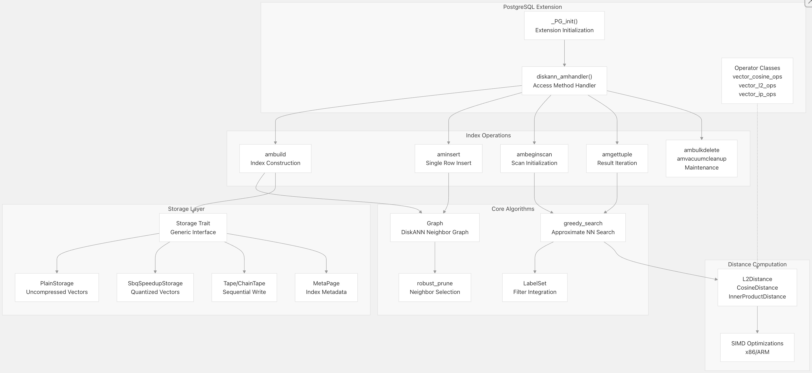
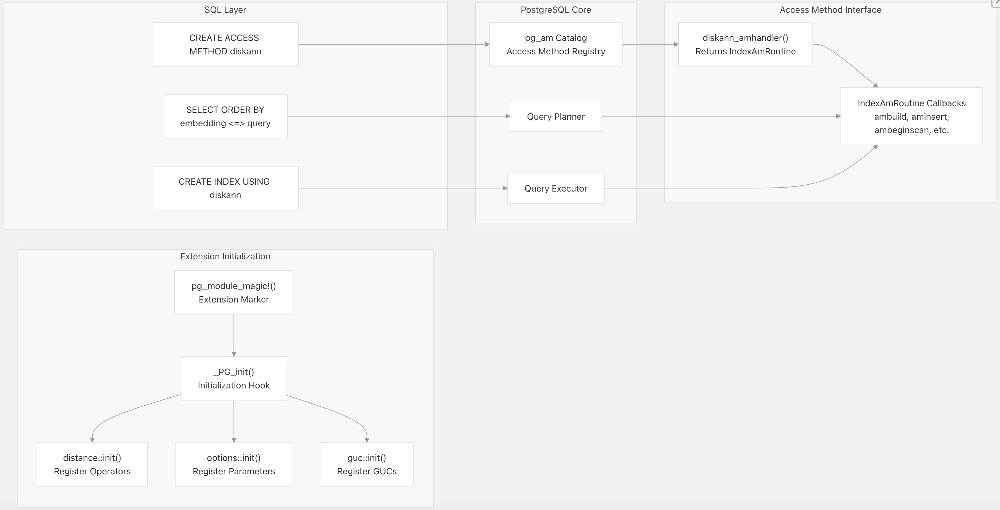
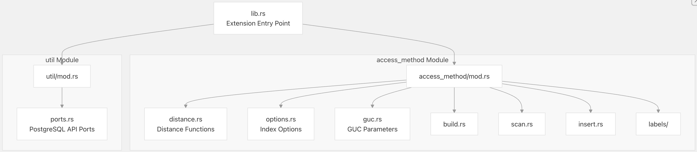
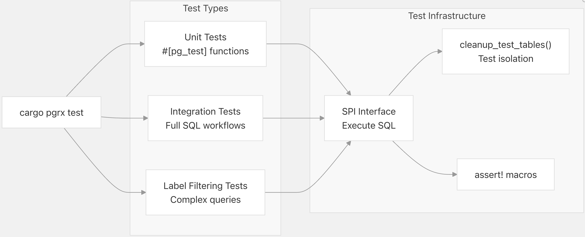
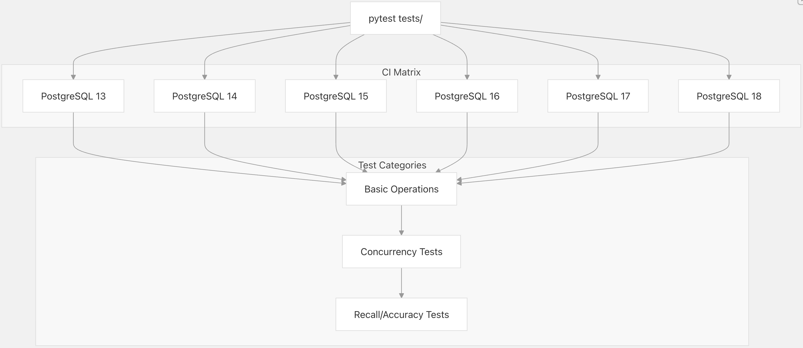
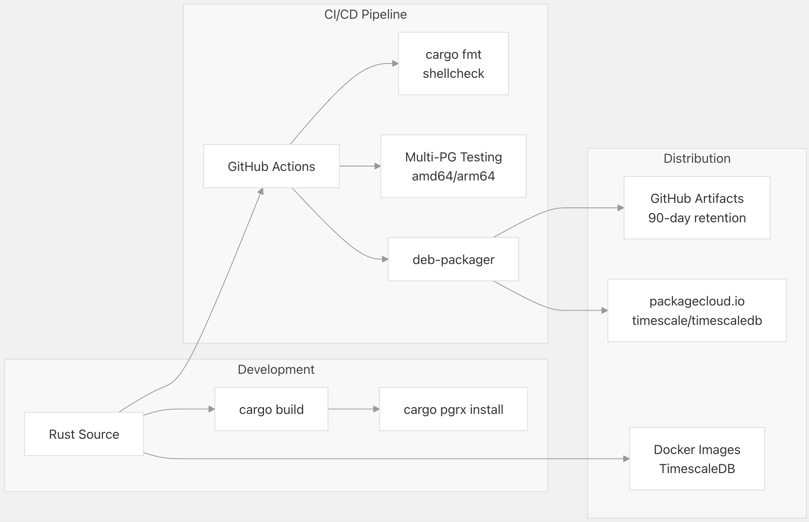

## pgvectorscale 源码学习: 1   
                                                              
### 作者                                                              
digoal                                                              
                                                              
### 日期                                                              
2025-11-09                                                              
                                                              
### 标签                                                              
pgvectorscale , 向量数据库 , DiskANN , StreamingDiskANN , 源码学习                                                              
                                                              
----                                         
                                                              
## 背景    
本文档旨在对 **pgvectorscale** 进行高层次的介绍，解释它是什么、其关键特性，以及它如何与 **PostgreSQL** 集成。  
  
## 什么是 pgvectorscale (*What is pgvectorscale*)  
  
**pgvectorscale** 是一个 **PostgreSQL 扩展** (*PostgreSQL extension*)，它基于 [pgvector](https://github.com/timescale/pgvectorscale/blob/36271fa5/pgvector) 构建，旨在为 **AI 应用** (*AI applications*) 提供更高性能的**向量相似度搜索** (*vector similarity search*) 和内存高效的存储。  
  
虽然 **pgvector** 提供了基础的向量数据类型和基本的索引功能，但 **pgvectorscale** 增加了针对大规模生产工作负载优化的**高级索引算法** (*advanced indexing algorithms*) 和**压缩技术** (*compression techniques*)。  
  
该扩展使用 [PGRX 框架 (*PGRX framework*)](https://github.com/timescale/pgvectorscale/blob/36271fa5/PGRX%20framework) (version 0.16.1) 以 **Rust** 编写，提供了**内存安全** (*memory safety*) 和高性能，同时与 **PostgreSQL** 的**扩展 API** (*extension API*) 无缝集成。  
  
**来源:**  
[`README.md` 1-33](https://github.com/timescale/pgvectorscale/blob/36271fa5/README.md#L1-L33)  
[`pgvectorscale/src/lib.rs` 1-37](https://github.com/timescale/pgvectorscale/blob/36271fa5/pgvectorscale/src/lib.rs#L1-L37)  
  
-----  
  
## 主要创新点 (*Key Innovations*)  
  
**pgvectorscale** 引入了三个主要功能，使其区别于普通的 **pgvector**：  
  
### StreamingDiskANN 索引 (*StreamingDiskANN Index*)  
  
一种基于图的**近似最近邻 (ANN)** (*approximate nearest neighbor*) 索引，其灵感来源于微软的 [DiskANN 算法 (*DiskANN algorithm*) ](https://github.com/timescale/pgvectorscale/blob/36271fa5/DiskANN%20algorithm)。该索引使用 `diskann` **访问方法** (*access method*)，与 **pgvector** 的 **IVFFLAT** 和 **HNSW** 索引相比，它提供了显著更优的查询性能和可扩展性，尤其适用于拥有数百万向量的大型数据集。  
  
该索引可以使用标准的 **PostgreSQL DDL** (数据定义语言) 创建：  
  
```sql  
CREATE INDEX document_embedding_idx ON document_embedding  
USING diskann (embedding vector_cosine_ops);  
```  
  
**来源:**  
[`README.md` 13-14](https://github.com/timescale/pgvectorscale/blob/36271fa5/README.md#L13-L14)  
[`README.md` 166-170](https://github.com/timescale/pgvectorscale/blob/36271fa5/README.md#L166-L170)  
  
### 统计二值量化 (SBQ) (*Statistical Binary Quantization (SBQ)*)  
  
一种由 **Timescale** 研究人员开发的压缩方法，它改进了标准的**二值量化** (*binary quantization*)。**SBQ** 通过对**高维向量** (*high-dimensional vectors*) 进行量化来减少内存使用，同时保持高**召回率** (*recall*)。这对于具有数百或数千维度的**嵌入** (*embeddings*) 尤其有价值。  
  
当使用 `storage_layout = 'memory_optimized'`（默认值）创建索引时，系统会自动训练并应用 **SBQ 压缩** (*SBQ compression*)。  
  
**来源:**  
[`README.md` 14](https://github.com/timescale/pgvectorscale/blob/36271fa5/README.md#L14-L14)  
[`README.md` 327](https://github.com/timescale/pgvectorscale/blob/36271fa5/README.md#L327-L327)  
  
### 基于标签的过滤搜索 (*Label-Based Filtered Search*)  
  
微软 **Filtered DiskANN** 研究的实现，它能够将高效的向量相似度搜索与**元数据过滤** (*metadata filtering*) 相结合。**标签** (*Labels*) 以 `SMALLINT[]` 数组的形式存储，并直接集成到**图遍历算法** (*graph traversal algorithm*) 中，从而避免了**后置过滤** (*post-filtering*) 带来的性能损失。  
  
```sql  
CREATE INDEX ON documents USING diskann (embedding vector_cosine_ops, labels);  
  
SELECT * FROM documents  
WHERE labels && ARRAY[1, 3]  
ORDER BY embedding <=> '[...]'  
LIMIT 10;  
```  
  
**来源:**  
[`README.md` 15-16](https://github.com/timescale/pgvectorscale/blob/36271fa5/README.md#L15-L16)  
[`README.md` 183-231](https://github.com/timescale/pgvectorscale/blob/36271fa5/README.md#L183-L231)  
  
-----  
  
## 系统架构 (*System Architecture*)  
  
下图展示了 **pgvectorscale** 的主要组件及其关系：  
  
  
  
**PostgreSQL 扩展集成** (*PostgreSQL Extension Integration*)  
  
此图展示了 **pgvectorscale** 如何通过**访问方法接口** (*access method interface*) 与 **PostgreSQL** 集成：  
  
  
  
**来源:**  
[`pgvectorscale/src/lib.rs` 1-37](https://github.com/timescale/pgvectorscale/blob/36271fa5/pgvectorscale/src/lib.rs#L1-L37)  
[`pgvectorscale/src/access_method/`](https://github.com/timescale/pgvectorscale/blob/36271fa5/pgvectorscale/src/access_method/)  
  
-----  
  
## 扩展结构 (*Extension Structure*)  
  
**pgvectorscale** 遵循标准的 **PostgreSQL 扩展结构** (*PostgreSQL extension structure*)，包含以下关键组件：  
  
### 模块组织 (*Module Organization*)  
  
  
  
扩展的入口点是 `_PG_init()` 函数，**PostgreSQL** 在加载扩展时会调用此函数。该函数初始化三个子系统：  
  
1.  **距离函数** (*Distance functions*) (`access_method::distance::init()`)：注册 **L2**、**cosine** 和**内积度量** (*inner product metrics*) 的距离运算符和函数。  
2.  **索引选项** (*Index options*) (`access_method::options::init()`)：注册索引构建时参数，如 `num_neighbors`、`search_list_size` 和 `storage_layout`。  
3.  **GUC 参数** (*GUC parameters*) (`access_method::guc::init()`)：注册查询时参数，如 `diskann.query_search_list_size` 和 `diskann.query_rescore`。  
  
**来源:**  
[`pgvectorscale/src/lib.rs` 9-21](https://github.com/timescale/pgvectorscale/blob/36271fa5/pgvectorscale/src/lib.rs#L9-L21)  
  
### PostgreSQL API 集成 (*PostgreSQL API Integration*)  
  
**pgvectorscale** 使用 **PGRX** 来桥接 **Rust** 和 **PostgreSQL 的 C API**。`util::ports` 模块为 **PGRX** 未暴露的 **PostgreSQL** 内部函数提供了安全封装：  
  
| 函数 (*Function*) | 目的 (*Purpose*) | 位置 (*Location*) |  
| :--- | :--- | :--- |  
| `PageGetSpecialPointer()` | 访问自定义页元数据 (*Access custom page metadata*) | [`pgvectorscale/src/util/ports.rs` 22-29](https://github.com/timescale/pgvectorscale/blob/36271fa5/pgvectorscale/src/util/ports.rs#L22-L29) |  
| `PageGetItem()` | 从页中检索项目 (*Retrieve item from page*) | [`pgvectorscale/src/util/ports.rs` 54-64](https://github.com/timescale/pgvectorscale/blob/36271fa5/pgvectorscale/src/util/ports.rs#L54-L64) |  
| `slot_getattr()` | 从元组中提取属性 (*Extract attribute from tuple*) | [`pgvectorscale/src/util/ports.rs` 94-125](https://github.com/timescale/pgvectorscale/blob/36271fa5/pgvectorscale/src/util/ports.rs#L94-L125) |  
| `pgstat_count_index_scan()` | 更新统计信息 (*Update statistics*) | [`pgvectorscale/src/util/ports.rs` 128-155](https://github.com/timescale/pgvectorscale/blob/36271fa5/pgvectorscale/src/util/ports.rs#L128-L155) |  
| `acquire_index_lock()` | 序列化索引操作 (*Serialize index operations*) | [`pgvectorscale/src/util/ports.rs` 160-171](https://github.com/timescale/pgvectorscale/blob/36271fa5/pgvectorscale/src/util/ports.rs#L160-L171)  
  
这些低级函数支持直接操作 **PostgreSQL** 的**缓冲区管理器** (*buffer manager*)、**页结构** (*page structures*) 和**元组格式** (*tuple formats*)，这对于实现**自定义索引访问方法** (*custom index access method*) 是必需的。  
  
**来源:**  
[`pgvectorscale/src/util/ports.rs` 1-172](https://github.com/timescale/pgvectorscale/blob/36271fa5/pgvectorscale/src/util/ports.rs#L1-L172)  
  
-----  
  
## 测试基础架构 (*Testing Infrastructure*)  
  
**pgvectorscale** 采用了多层次的综合测试策略：  
  
### Rust 单元测试 (*Rust Unit Tests*)  
  
**PGRX** 提供了 `#[pg_test]` **宏** (*macro*)，允许针对实时 **PostgreSQL** 实例运行 **Rust** 测试。这些测试可以直接执行 **SQL 命令** (*SQL commands*) 并验证结果：  
  
  
  
```rust  
#[pg_test]  
fn test_filtering_with_null_and_empty() {  
    // ... test logic ...  
}  
```  
  
位于 [`pgvectorscale/src/access_method/labels/filtering_tests.rs` 1-1027](https://github.com/timescale/pgvectorscale/blob/36271fa5/pgvectorscale/src/access_method/labels/filtering_tests.rs#L1-L1027) 的测试套件展示了对标签过滤功能的全面测试，包括 **NULL** 值、空数组和复杂查询模式等边缘情况。  
  
**来源:**  
[`pgvectorscale/src/access_method/labels/filtering_tests.rs` 1-1027](https://github.com/timescale/pgvectorscale/blob/36271fa5/pgvectorscale/src/access_method/labels/filtering_tests.rs#L1-L1027)  
  
### Python 集成测试 (*Python Integration Tests*)  
  
**CI/CD 流水线** (*CI/CD pipeline*) 包括基于 **Python** 的**集成测试** (*integration tests*)，用于验证该扩展在 **PostgreSQL 13-18 版本**中都能正常工作：  
  
  
  
```yaml  
jobs:  
  python_tests:  
    runs-on: ubuntu-latest  
    strategy:  
      matrix:  
        pg_version: [13, 14, 15, 16, 17, 18]  
    steps:  
      # ... setup and run tests  
```  
  
**Python** 测试工作流程定义在 [`.github/workflows/python_tests.yml` 1-126](https://github.com/timescale/pgvectorscale/blob/36271fa5/.github/workflows/python_tests.yml#L1-L126) 中，并在每次 **push**、**pull request** 和手动工作流调度时运行。每个测试都会创建一个全新的 **PostgreSQL** 实例，安装扩展，并使用 **psycopg2/asyncpg 驱动程序**运行全面的测试。  
  
**来源:**  
[`.github/workflows/python_tests.yml` 1-126](https://github.com/timescale/pgvectorscale/blob/36271fa5/.github/workflows/python_tests.yml#L1-L126)  
  
-----  
  
## 性能特点 (*Performance Characteristics*)  
  
**pgvectorscale** 相比普通的 **pgvector** 和专有的**向量数据库** (*proprietary vector databases*)，实现了显著的性能提升：  
  
| 指标 (*Metric*) | pgvectorscale 对比 Pinecone (s1) |  
| :--- | :--- |  
| **p95 延迟** (*p95 Latency*) | **低 28 倍** (*28x lower*) |  
| **查询吞吐量** (*Query Throughput*) | **高 16 倍** (*16x higher*) |  
| **成本** (*Cost*) (AWS EC2) | **低 75%** (*75% lower*) |  
| **召回率** (*Recall*) | 99% |  
  
这些**基准测试** (*benchmarks*) 是针对包含 5000 万个 **Cohere 嵌入** (*Cohere embeddings*) 的数据集进行的，每个嵌入具有 768 维度，代表了**语义搜索** (*semantic search*) 应用的真实生产工作负载。  
  
性能提升来源于：  
  
1.  **基于图的搜索** (*Graph-based search*)，它比**穷举式方法** (*exhaustive approaches*) 探索更少的候选者。  
2.  **SBQ 压缩** (*SBQ compression*)，减少了**内存带宽** (*memory bandwidth*) 需求。  
3.  针对 **x86** 和 **ARM 架构** (*ARM architectures*) 的距离计算的 **SIMD 优化** (*SIMD optimizations*)。  
4.  高效的**缓冲区管理** (*buffer management*)，最大限度地减少了 **I/O 操作** (*I/O operations*)。  
  
**来源:**  
[`README.md` 17-29](https://github.com/timescale/pgvectorscale/blob/36271fa5/README.md#L17-L29)  
  
-----  
  
## 开发与分发 (*Development and Distribution*)  
  
**pgvectorscale** 采用现代化的开发工作流程和**自动化 CI/CD** (*automated CI/CD*)：  
  
  
  
该扩展可以通过以下方式安装：  
  
  * **Docker**：预构建的 **TimescaleDB 镜像** (*TimescaleDB images*) 中包含 **pgvectorscale**。  
  * **软件包管理器** (*Package managers*)：通过 **apt-get** 获取 **Debian/Ubuntu 软件包**。  
  * **源码编译** (*Source compilation*)：使用 **cargo** 和 **pgrx** 进行自定义构建。  
  * **Timescale Cloud**：作为**托管服务** (*managed service*) 提供。  
  
**来源:**  
[`README.md` 42-123](https://github.com/timescale/pgvectorscale/blob/36271fa5/README.md#L42-L123)  
[`.github/workflows/python_tests.yml` 1-126](https://github.com/timescale/pgvectorscale/blob/36271fa5/.github/workflows/python_tests.yml#L1-L126)  
  
    
#### [PolarDB 学习图谱](https://www.aliyun.com/database/openpolardb/activity "8642f60e04ed0c814bf9cb9677976bd4")
  
  
#### [PostgreSQL 解决方案集合](../201706/20170601_02.md "40cff096e9ed7122c512b35d8561d9c8")
  
  
#### [德哥 / digoal's Github - 公益是一辈子的事.](https://github.com/digoal/blog/blob/master/README.md "22709685feb7cab07d30f30387f0a9ae")
  
  
#### [About 德哥](https://github.com/digoal/blog/blob/master/me/readme.md "a37735981e7704886ffd590565582dd0")
  
  

  
