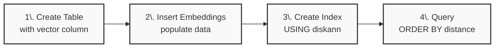
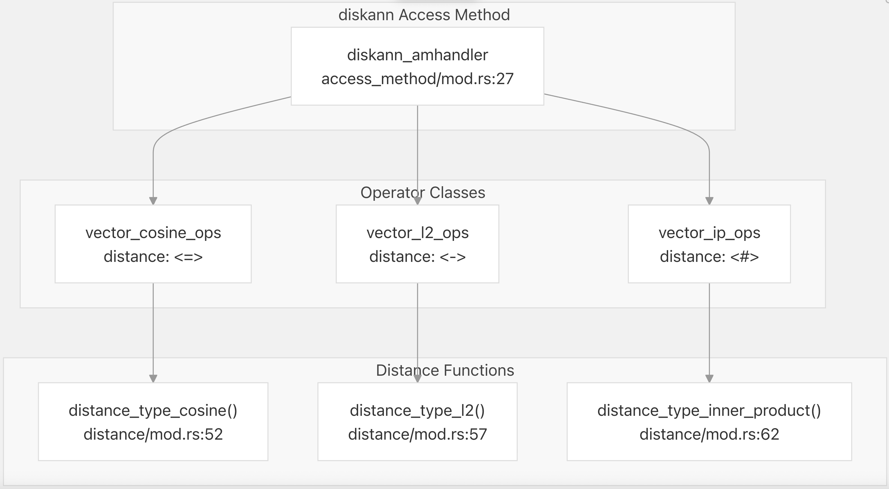
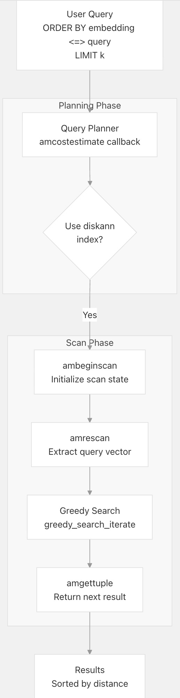
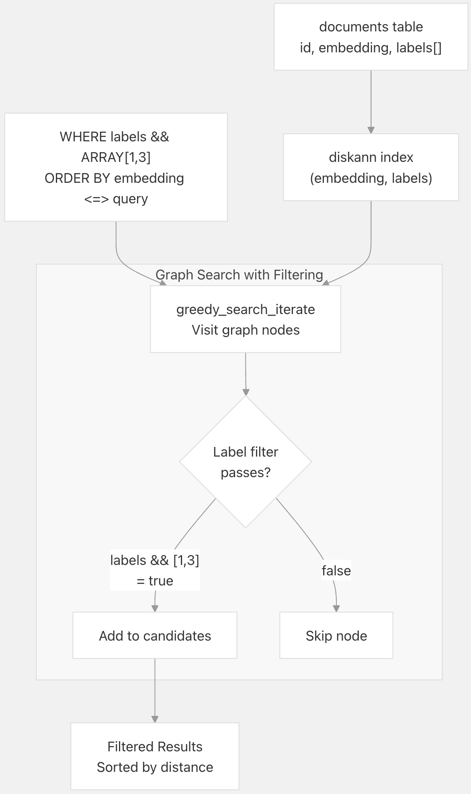

## pgvectorscale 源码学习: 1.2 快速入门指南（Quick Start Guide）  
    
### 作者    
digoal    
    
### 日期    
2025-11-09    
    
### 标签    
pgvectorscale , 向量数据库 , DiskANN , StreamingDiskANN , 源码学习    
    
----    
    
## 背景    
本指南提供了使用 `pgvectorscale` 在 **PostgreSQL** 中执行高性能**向量相似性搜索**（vector similarity search）的实用教程。内容涵盖创建**索引**（index）、插入**数据**（data）、使用不同的**距离运算符**（distance operator）运行**查询**（query），以及使用**基于标签的过滤**（label-based filtering）。  
  
**先决条件（Prerequisites）：** 您必须已安装 `pgvectorscale`，并使用以下命令在数据库中创建**扩展**（extension）：`CREATE EXTENSION IF NOT EXISTS vectorscale CASCADE;`  
  
## 基本向量搜索工作流程（Basic Vector Search Workflow）  
  
使用 `pgvectorscale` 进行**向量相似性搜索**的典型**工作流程**（workflow）涉及四个步骤：  
  

  
1.  创建一个包含**向量列**（vector column）的表。  
2.  插入**向量数据**（vector data，即**嵌入** embeddings）。  
3.  创建一个 `pgvectorscale` **索引**（StreamingDiskANN）。  
4.  运行**相似性搜索**（similarity searches）。  
  
来源:  
[`README.md` 149-178](https://github.com/timescale/pgvectorscale/blob/36271fa5/README.md#L149-L178)  
  
## 创建包含嵌入（Embeddings）的表  
  
创建一个带有 `vector` **列**（column）的表来存储**嵌入**。**向量维度**（vector dimension）必须在创建表时指定：  
  
```sql  
CREATE TABLE document_embedding (  
    id BIGINT PRIMARY KEY GENERATED BY DEFAULT AS IDENTITY,  
    metadata JSONB,  
    contents TEXT,  
    embedding VECTOR(1536)  
);  
```  
  
`VECTOR(1536)` **类型**（type）来自 `pgvector` **扩展**（extension）（通过 `CASCADE` 自动安装）。常见的**嵌入维度**（dimensions）包括：  
  
  * 384 **维度**：例如 MiniLM 等小型**模型**（models）  
  * 768 **维度**：BERT-base、Cohere **嵌入**  
  * 1536 **维度**：OpenAI text-embedding-ada-002  
  * 3072 **维度**：OpenAI text-embedding-3-large  
  
来源:  
[`README.md` 152-161](https://github.com/timescale/pgvectorscale/blob/36271fa5/README.md#L152-L161)  
  
## 插入向量数据（Inserting Vector Data）  
  
将**嵌入**插入到您的表中。`pgvectorscale` 使用标准的 `pgvector` **向量类型**（VECTOR types）：  
  
```sql  
INSERT INTO document_embedding (contents, embedding) VALUES  
    ('First document', '[0.1, 0.2, 0.3, ...]'),  
    ('Second document', '[0.4, 0.5, 0.6, ...]');  
```  
  
在**生产环境**（production use）中，**嵌入**通常由您的**应用**（application）使用**嵌入模型**（embedding models）生成，并使用 **PostgreSQL** **客户端库**（client libraries）插入。请参阅 `pgvector` **文档**（ [documentation](https://github.com/timescale/pgvectorscale/blob/36271fa5/pgvector%20documentation) ）获取特定语言的示例。  
  
**空值处理（Null Handling）：** **空向量**（Null vectors）不会被**索引**（indexed）。如果一行包含一个**空嵌入**（null embedding），它将在**索引创建**（index creation）和**搜索**（searches）过程中被跳过。  
  
来源:  
[`README.2md` 163-165](https://github.com/timescale/pgvectorscale/blob/36271fa5/README.md#L163-L165)  
[`README.md` 374-378](https://github.com/timescale/pgvectorscale/blob/36271fa5/README.md#L374-L378)  
  
## 创建 StreamingDiskANN 索引  
  
### 基本索引创建（Basic Index Creation）  
  
使用 `diskann` **存取方法**（access method）和一个**距离运算符类**（distance operator class）创建一个基本索引：  
  
```sql  
-- Cosine distance (most common)  
CREATE INDEX document_embedding_idx ON document_embedding  
USING diskann (embedding vector_cosine_ops);  
  
-- L2 (Euclidean) distance  
CREATE INDEX document_embedding_idx ON document_embedding  
USING diskann (embedding vector_l2_ops);  
  
-- Inner product distance  
CREATE INDEX document_embedding_idx ON document_embedding  
USING diskann (embedding vector_ip_ops);  
```  
  
**运算符类**（operator class）决定了**索引**将为哪个**距离度量**（distance metric）进行优化。您必须在**查询**（queries）中使用相应的**距离运算符**（distance operator）。  
  
来源:  
[`README.md` 166-181](https://github.com/timescale/pgvectorscale/blob/36271fa5/README.md#L166-L181)  
[`pgvectorscale/sql/vectorscale--0.0.2--0.8.0.sql` 119-145](https://github.com/timescale/pgvectorscale/blob/36271fa5/pgvectorscale/sql/vectorscale--0.0.2--0.8.0.sql#L119-L145)  
  
### 访问方法与运算符类映射（Access Method and Operator Class Mapping）  
  
  
  
| 距离度量（Distance Metric） | 运算符类（Operator Class） | 运算符（Operator） | 描述（Description） |  
| :--- | :--- | :--- | :--- |  
| L2 **距离**（L2 Distance） | `vector_l2_ops` | `<->` | **欧几里得距离**（Euclidean distance）（L2 范数） |  
| **内积**（Inner Product） | `vector_ip_ops` | `<#>` | **负内积**（Negative inner product）（用于最大相似性） |  
| **余弦距离**（Cosine Distance） | `vector_cosine_ops` | `<=>` | **余弦距离**（1 - **余弦相似性** Cosine Similarity） |  
  
来源:  
[`pgvectorscale/sql/vectorscale--0.0.2--0.8.0.sql` 10-28](https://github.com/timescale/pgvectorscale/blob/36271fa5/pgvectorscale/sql/vectorscale--0.0.2--0.8.0.sql#L10-L28)  
[`pgvectorscale/sql/vectorscale--0.0.2--0.8.0.sql` 32-56](https://github.com/timescale/pgvectorscale/blob/36271fa5/pgvectorscale/sql/vectorscale--0.0.2--0.8.0.sql#L32-L56)  
[`pgvectorscale/sql/vectorscale--0.0.2--0.8.0.sql` 80-177](https://github.com/timescale/pgvectorscale/blob/36271fa5/pgvectorscale/sql/vectorscale--0.0.2--0.8.0.sql#L80-L177)  
  
### 索引构建参数（Index Build Parameters）  
  
可以选择指定**构建时参数**（build-time parameters）来控制**索引特征**（index characteristics）：  
  
```sql  
CREATE INDEX document_embedding_idx ON document_embedding  
USING diskann (embedding vector_cosine_ops)  
WITH (  
    storage_layout = 'memory_optimized',  -- or 'plain'  
    num_neighbors = 50,                    -- max neighbors per node  
    search_list_size = 100,                -- construction search parameter  
    max_alpha = 1.2,                       -- pruning parameter  
    num_dimensions = 768                   -- index subset of dimensions  
);  
```  
  
| 参数（Parameter） | 描述（Description） | 默认值（Default） | **调优指南**（Tuning Guidance） |  
| :--- | :--- | :--- | :--- |  
| `storage_layout` | `memory_optimized` 使用 **SBQ 压缩**（SBQ compression）；`plain` 存储**未压缩**（uncompressed）数据 | `memory_optimized` | 对于**高维向量**（\>500D）使用 `memory_optimized` |  
| `num_neighbors` | 每个**图节点**（graph node）的最大**边数**（edges） | 50 | 值越高可提高**准确性**（accuracy），但会减慢**遍历**（traversal）速度 |  
| `search_list_size` | **构建**（construction）期间的**候选列表大小**（Candidate list size） | 100 | 值越高可提高**图质量**（graph quality），但会减慢**构建**速度 |  
| `max_alpha` | **剪枝激进程度**（Pruning aggressiveness）（alpha 参数） | 1.2 | 值越高可提高**图质量**，但会减慢**构建**速度 |  
| `num_dimensions` | 要**索引**的**维度**（Dimensions）（针对 **Matryoshka 嵌入**） | 0（全部） | 设置此值以使用**截断嵌入**（truncated embeddings） |  
| `num_bits_per_dimension` | **SBQ 量化位数**（SBQ quantization bits） | 2 (\<900D)，1 (≥900D) | 更多**位数** = 更高**准确性**，更多**内存**（memory） |  
  
**内存要求（Memory Requirements）：** **索引构建**可能是**内存密集型**（memory-intensive）的。对于大型**数据集**（datasets），请增加 `maintenance_work_mem`：  
  
```sql  
SET maintenance_work_mem = '2GB';  
```  
  
来源:  
[`README.md` 305-339](https://github.com/timescale/pgvectorscale/blob/36271fa5/README.md#L305-L339)  
  
## 运行相似性搜索（Running Similarity Searches）  
  
### 基本查询（Basic Queries）  
  
使用 `ORDER BY` **子句**（clause）和适当的**距离运算符**查找 k 个**最近邻**（k nearest neighbors）：  
  
```sql  
-- Cosine distance (use with vector_cosine_ops index)  
SELECT id, contents, embedding <=> '[0.1, 0.2, ...]' AS distance  
FROM document_embedding  
ORDER BY embedding <=> '[0.1, 0.2, ...]'  
LIMIT 10;  
  
-- L2 distance (use with vector_l2_ops index)  
SELECT id, contents, embedding <-> '[0.1, 0.2, ...]' AS distance  
FROM document_embedding  
ORDER BY embedding <-> '[0.1, 0.2, ...]'  
LIMIT 10;  
  
-- Inner product distance (use with vector_ip_ops index)  
SELECT id, contents, embedding <#> '[0.1, 0.2, ...]' AS distance  
FROM document_embedding  
ORDER BY embedding <#> '[0.1, 0.2, ...]'  
LIMIT 10;  
```  
  
**运算符匹配（Operator Matching）：** **查询**中的**距离运算符**必须与**创建索引**时使用的**运算符类**（operator class）匹配，否则**索引**将不会被使用。  
  
来源:  
[`README.md` 171-181](https://github.com/timescale/pgvectorscale/blob/36271fa5/README.md#L171-L181)  
  
### 查询执行流程（Query Execution Flow）  
  
  
  
**查询**使用了在 [`pgvectorscale/src/access_method/mod.rs` 27](https://github.com/timescale/pgvectorscale/blob/36271fa5/pgvectorscale/src/access_method/mod.rs#L27-L27) 中定义的**索引扫描回调**（index scan callbacks）（`diskann_amhandler`）。**扫描生命周期**（scan lifecycle）包括**初始化**（initialization）（`ambeginscan`）、**查询设置**（query setup）（`amrescan`）、**迭代结果检索**（iterative result retrieval）（`amgettuple`）和**清理**（cleanup）（`amendscan`）。  
  
来源:  
[`README.md` 171-178](https://github.com/timescale/pgvectorscale/blob/36271fa5/README.md#L171-L178)  
  
## 基于标签的过滤（Label-Based Filtering）  
  
`pgvectorscale` 支持使用**标签数组**（label arrays）进行高效的**过滤向量搜索**（filtered vector search）。它实现了 **Filtered DiskANN** **算法**（algorithm）以实现高性能过滤。  
  
### 创建带有标签的表（Creating a Table with Labels）  
  
添加一个 `SMALLINT[]` **列**来存储**整数标签**（integer labels）：  
  
```sql  
CREATE TABLE documents (  
    id SERIAL PRIMARY KEY,  
    embedding VECTOR(1536),  
    labels SMALLINT[],  -- Array of category labels  
    status TEXT,  
    created_at TIMESTAMPTZ  
);  
```  
  
**标签约束（Label Constraints）：** **标签**必须是 `smallint` **值**（-32768 到 32767）。`SMALLINT[]` **类型**确保 **PostgreSQL** 的**类型系统**（type system）自动强制执行这些**边界**（bounds）。  
  
来源:  
[`README.md` 198-208](https://github.com/timescale/pgvectorscale/blob/36271fa5/README.md#L198-L208)  
[`README.md` 216-218](https://github.com/timescale/pgvectorscale/blob/36271fa5/README.md#L216-L218)  
  
### 创建带有标签过滤的索引（Creating an Index with Label Filtering）  
  
在**创建索引**时包含**标签列**（labels column）：  
  
```sql  
CREATE INDEX ON documents   
USING diskann (embedding vector_cosine_ops, labels);  
```  
  
这创建了一个**多列索引**（multi-column index），支持在**图遍历**（graph traversal）过程中进行高效的**标签过滤**。  
  
来源:  
[`README.md` 210-214](https://github.com/timescale/pgvectorscale/blob/36271fa5/README.md#L210-L214)  
[`README.md` 342-346](https://github.com/timescale/pgvectorscale/blob/36271fa5/README.md#L342-L346)  
  
### 使用标签过滤器进行查询（Querying with Label Filters）  
  
使用 `&&` (**重叠** overlap) **运算符**进行**标签过滤**：  
  
```sql  
-- Find documents with label 1 OR label 3  
SELECT * FROM documents  
WHERE labels && ARRAY[1, 3]  
ORDER BY embedding <=> '[...]'  
LIMIT 10;  
  
-- Single label filter  
SELECT * FROM documents  
WHERE labels && ARRAY[1]  
ORDER BY embedding <=> '[...]'  
LIMIT 10;  
```  
  
`&&` **运算符**检查**数组重叠**（array overlap）：**查询**返回**文档**（document）的**标签数组**与**过滤器数组**（filter array）重叠的行（**OR 语义**）。  
  
**实现（Implementation）：** `pgvectorscale` 在 [`pgvectorscale/src/access_method/mod.rs` 279](https://github.com/timescale/pgvectorscale/blob/36271fa5/pgvectorscale/src/access_method/mod.rs#L279-L279) 处提供了一个自定义的 `&&` **运算符实现**（`smallint_array_overlap` **函数**），该实现已注册到 `vector_smallint_label_ops` **运算符类**。  
  
来源:  
[`README.md` 220-228](https://github.com/timescale/pgvectorscale/blob/36271fa5/README.md#L220-L228)  
[`pgvectorscale/sql/vectorscale--0.0.2--0.8.0.sql` 61-68](https://github.com/timescale/pgvectorscale/blob/36271fa5/pgvectorscale/sql/vectorscale--0.0.2--0.8.0.sql#L61-L68)  
[`pgvectorscale/sql/vectorscale--0.0.2--0.8.0.sql` 148-169](https://github.com/timescale/pgvectorscale/blob/36271fa5/pgvectorscale/sql/vectorscale--0.0.2--0.8.0.sql#L148-L169)  
  
### 基于标签的过滤工作流程（Label-Based Filtering Workflow）  
  
  
  
在**图遍历**过程中，**搜索算法**（search algorithm）会在每个**节点**（node）评估**标签过滤器**，并且只将通过**过滤器**的**节点**视为**候选节点**（candidates）。这比**后过滤**（post-filtering）效率高得多。  
  
来源:  
[`README.md` 183-193](https://github.com/timescale/pgvectorscale/blob/36271fa5/README.md#L183-L193)  
  
### 带有查找表（Lookup Tables）的语义标签（Semantic Labels）  
  
虽然**标签**必须存储为**整数**，但您可以将它们映射到**语义含义**（semantic meanings）：  
  
```sql  
-- Create a labels definition table  
CREATE TABLE label_definitions (  
    id INTEGER PRIMARY KEY,  
    name TEXT,  
    description TEXT  
);  
  
INSERT INTO label_definitions (id, name, description) VALUES  
    (1, 'science', 'Scientific content'),  
    (2, 'technology', 'Technology-related content'),  
    (3, 'business', 'Business content');  
  
-- Insert documents with label IDs  
INSERT INTO documents (embedding, labels)  
VALUES ('[...]', ARRAY[1, 2]);  
  
-- Query using label names with a subquery  
SELECT d.*  
FROM documents d  
WHERE d.labels && (  
    SELECT array_agg(id::smallint)  
    FROM label_definitions  
    WHERE name IN ('science', 'business')  
)  
ORDER BY d.embedding <=> '[...]'  
LIMIT 10;  
  
-- Join to get label names in results  
SELECT d.*, array_agg(l.name) as label_names  
FROM documents d  
JOIN label_definitions l ON l.id = ANY(d.labels)  
WHERE d.labels && ARRAY[1]  
GROUP BY d.id  
ORDER BY d.embedding <=> '[...]'  
LIMIT 10;  
```  
  
这允许**应用程序**使用有意义的**名称**（names），而 `pgvectorscale` 则使用高效的**整数 ID**。  
  
来源:  
[`README.md` 232-289](https://github.com/timescale/pgvectorscale/blob/36271fa5/README.md#L232-L289)  
[`pgvectorscale/src/access_method/labels/filtering_tests.rs` 513-589](https://github.com/timescale/pgvectorscale/blob/36271fa5/pgvectorscale/src/access_method/labels/filtering_tests.rs#L513-L589)  
  
### 空标签处理（Null Label Handling）  
  
  * **空向量（Null vectors）：** 不会被**索引**，在**搜索**过程中被跳过  
  * **空标签数组（Null label arrays）：** 被视为**空数组** `{}`  
  * **数组中的空元素（Null elements in arrays）：** 被忽略（例如，`{1, NULL, 3}` 被视为 `{1, 3}`）  
  
来源:  
[`README.md` 374-378](https://github.com/timescale/pgvectorscale/blob/36271fa5/README.md#L374-L378)  
  
## 将标签过滤与 WHERE 子句结合（Combining Label Filtering with WHERE Clauses）  
  
您可以将**基于标签的过滤**（经过优化）与任意 `WHERE` **子句条件**（**后过滤** post-filtered）结合：  
  
```sql  
-- Label-based filter (fast, index-optimized)  
-- + arbitrary WHERE conditions (slower, post-filtered)  
SELECT * FROM documents  
WHERE labels && ARRAY[1, 3]          -- Optimized label filter  
  AND status = 'active'               -- Post-filtered  
  AND created_at > '2024-01-01'       -- Post-filtered  
ORDER BY embedding <=> '[...]'  
LIMIT 10;  
```  
  
使用 `&&` 的**标签过滤器**在**图遍历**（graph traversal）期间应用（**高效**）。其他 `WHERE` **条件**在**候选检索**（candidate retrieval）之后应用（效率较低，但仍是**流式** streaming）。  
  
来源:  
[`README.md` 291-303](https://github.com/timescale/pgvectorscale/blob/36271fa5/README.md#L291-L303)  
  
## 查询时调优参数（Query-Time Tuning Parameters）  
  
使用 **GUC 参数**在**查询时**微调**准确性**（accuracy）与**性能**（performance）之间的**权衡**（tradeoff）：  
  
```sql  
-- Increase search quality for a single query  
SET LOCAL diskann.query_search_list_size = 200;  
SET LOCAL diskann.query_rescore = 100;  
  
SELECT * FROM document_embedding  
ORDER BY embedding <=> '[...]'  
LIMIT 10;  
```  
  
| 参数（Parameter） | 描述（Description） | 默认值（Default） | **影响**（Impact） |  
| :--- | :--- | :--- | :--- |  
| `diskann.query_search_list_size` | 在**图搜索**期间探索的**额外候选节点数**（additional candidates） | 100 | 值越高 = 更好的**召回率**（recall），更慢的**查询** |  
| `diskann.query_rescore` | 使用**精确距离**（exact distances）重新**评分**（re-scored）的**顶部结果数**（top results） | 50 | 值越高 = 更好的**准确性**，更慢的**查询** |  
  
**范围（Scope）：** 使用 `SET` 进行**会话范围**（session-wide）的更改，或在**事务**（transaction）内使用 `SET LOCAL` 进行**查询特定**（query-specific）的调优。  
  
```sql  
-- Session-wide setting  
SET diskann.query_rescore = 400;  
  
-- Transaction-local setting (resets after commit/rollback)  
BEGIN;  
SET LOCAL diskann.query_search_list_size = 10;  
SELECT * FROM document_embedding ORDER BY embedding <=> $1 LIMIT 10;  
COMMIT;  
```  
  
`query_rescore` **参数**允许从 **heap** 读取完整的**向量**，对 **top-k** **近似结果**（approximate results）重新计算**精确距离**，以**额外 I/O**（additional I/O）为代价显着提高了**准确性**。  
  
来源:  
[`README.md` 348-372](https://github.com/timescale/pgvectorscale/blob/36271fa5/README.md#L348-L372)  
  
## 完整示例（Complete Example）  
  
这是一个完整的**端到端**（end-to-end）示例：  
  
```sql  
-- 1. Create table  
CREATE TABLE products (  
    id SERIAL PRIMARY KEY,  
    name TEXT,  
    description TEXT,  
    category_labels SMALLINT[],  
    embedding VECTOR(768)  
);  
  
-- 2. Insert sample data  
INSERT INTO products (name, description, category_labels, embedding) VALUES  
    ('Laptop', 'Powerful computing device', ARRAY[1, 2], '[0.1, 0.2, ...]'),  
    ('Desk', 'Office furniture', ARRAY[3], '[0.3, 0.4, ...]'),  
    ('Monitor', 'Display screen', ARRAY[1, 2], '[0.5, 0.6, ...]');  
  
-- 3. Create index with label support  
CREATE INDEX products_embedding_idx ON products  
USING diskann (embedding vector_cosine_ops, category_labels)  
WITH (num_neighbors = 50);  
  
-- 4. Query similar products in specific categories  
SET diskann.query_rescore = 100;  
  
SELECT name, description, embedding <=> '[0.15, 0.25, ...]' AS distance  
FROM products  
WHERE category_labels && ARRAY[1, 2]  -- Electronics  
ORDER BY embedding <=> '[0.15, 0.25, ...]'  
LIMIT 5;  
```  
  
## 重要注意事项（Important Notes）  
  
### 排序保证（Ordering Guarantees）  
  
`pgvectorscale` 使用**宽松排序**（relaxed ordering），这意味着**结果**可能在**距离**上略微**失序**（out of order）。对于**严格排序**（strict ordering），请使用**物化 CTE**（materialized CTE）：  
  
```sql  
WITH relaxed_results AS MATERIALIZED (  
    SELECT id, embedding <=> '[1,2,3]' AS distance  
    FROM items  
    ORDER BY distance  
    LIMIT 5  
)  
SELECT * FROM relaxed_results ORDER BY distance;  
```  
  
来源:  
[`README.md` 380-397](https://github.com/timescale/pgvectorscale/blob/36271fa5/README.md#L380-L397)  
  
### 不支持的功能（Unsupported Features）  
  
  * **UNLOGGED 表（UNLOGGED tables）：** 目前不支持在 `UNLOGGED` **表**上创建**索引**，并将返回**错误**（error）  
  * **带有 plain 存储的内积（Inner product with plain storage）：** `vector_ip_ops` **运算符类**要求使用 `memory_optimized` **存储布局**（storage layout）  
  
来源:  
[`README.md` 399-406](https://github.com/timescale/pgvectorscale/blob/36271fa5/README.md#L399-L406)  
[`README.md` 180-181](https://github.com/timescale/pgvectorscale/blob/36271fa5/README.md#L180-L181)  
      
#### [PolarDB 学习图谱](https://www.aliyun.com/database/openpolardb/activity "8642f60e04ed0c814bf9cb9677976bd4")
  
  
#### [PostgreSQL 解决方案集合](../201706/20170601_02.md "40cff096e9ed7122c512b35d8561d9c8")
  
  
#### [德哥 / digoal's Github - 公益是一辈子的事.](https://github.com/digoal/blog/blob/master/README.md "22709685feb7cab07d30f30387f0a9ae")
  
  
#### [About 德哥](https://github.com/digoal/blog/blob/master/me/readme.md "a37735981e7704886ffd590565582dd0")
  
  

  
