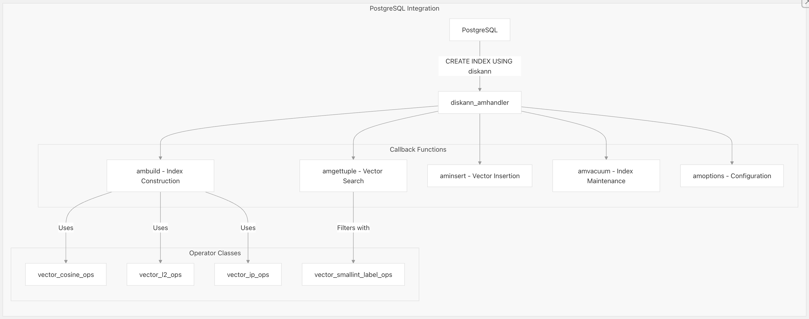
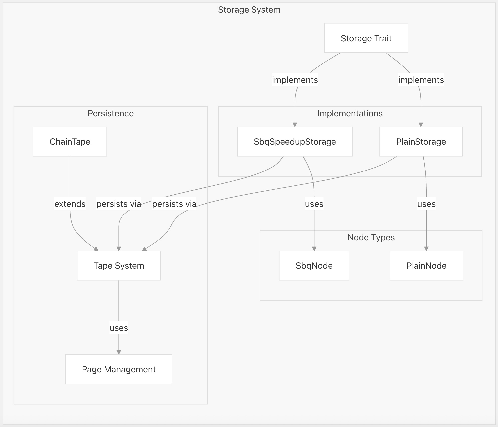
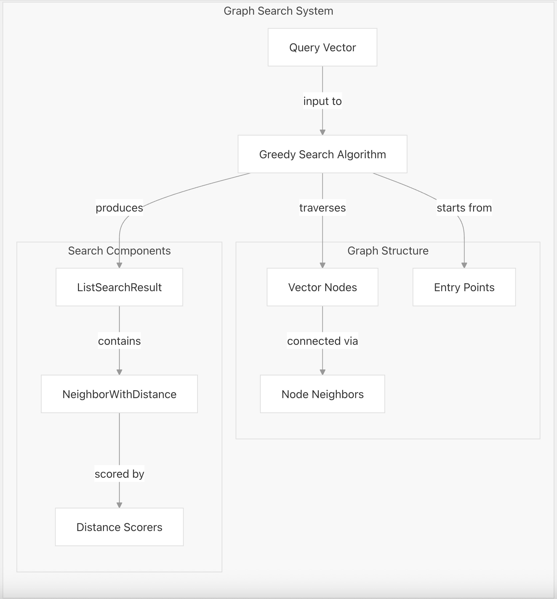
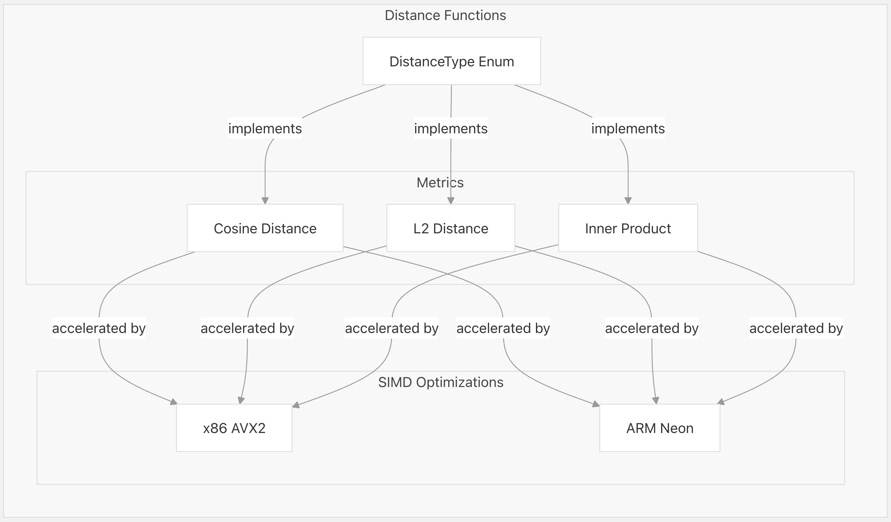
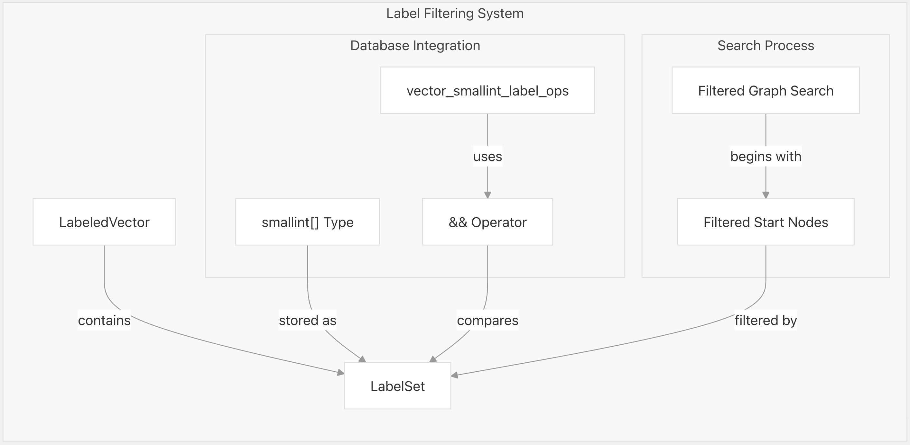
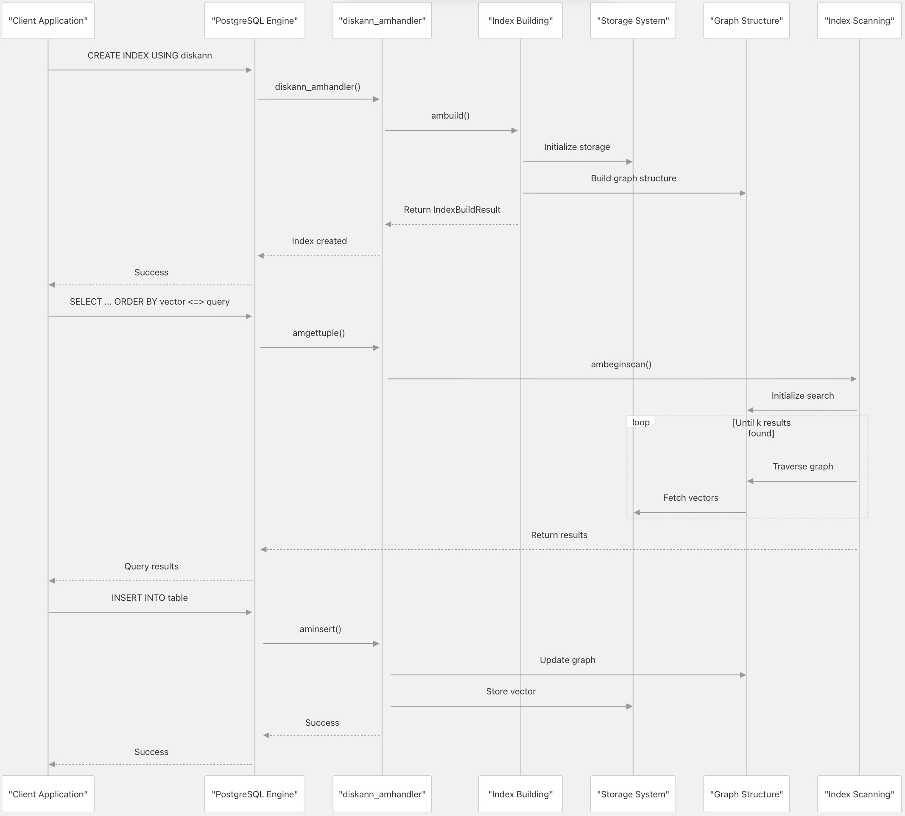

## pgvectorscale 源码学习: 2 系统架构 (System Architecture)  
      
### 作者      
digoal      
      
### 日期      
2025-11-09      
      
### 标签      
pgvectorscale , 向量数据库 , DiskANN , StreamingDiskANN , 源码学习      
      
----      
      
## 背景     
本文档提供了 `pgvectorscale` **系统架构**（system architecture）的技术概述，解释了该**扩展**（extension）如何与 **PostgreSQL** 集成并实现高性能的**向量相似度搜索**（vector similarity search）。描述了核心组件、它们之间的交互，以及实现高效的**近似最近邻**（Approximate Nearest Neighbor, **ANN**）搜索和压缩存储的关键架构决策。  
  
## 架构概述 (Architecture Overview)  
  
`pgvectorscale` 是作为 **PostgreSQL** **访问方法**（access method）实现的，它扩展了 `pgvector` 的功能。该扩展使用 **Rust** 语言和 **PGRX 框架**构建，在 **PostgreSQL** 中提供了现代、安全的**向量相似度搜索**（vector similarity search）能力的实现。  
  
  
  
**来源:**  
[`README.md` 12-16](https://github.com/timescale/pgvectorscale/blob/36271fa5/README.md#L12-L16) [`pgvectorscale/src/access_method/mod.rs` 36-98](https://github.com/timescale/pgvectorscale/blob/36271fa5/pgvectorscale/src/access_method/mod.rs#L36-L98)  
  
## PostgreSQL 集成 (PostgreSQL Integration)  
  
`pgvectorscale` 通过**访问方法接口**（access method interface）与 **PostgreSQL** 集成，该接口允许扩展实现自定义的索引类型。入口点是 `diskann_amhandler` 函数，它注册了用于各种索引操作的**回调函数**（callback functions）。  
  
  
  
该**访问方法处理器**（access method handler）实现了以下关键回调：  
  
  * `ambuild`: 创建一个新的 **StreamingDiskANN** 索引  
  * `aminsert`: 向现有索引添加新向量  
  * `amgettuple`: 执行向量相似度搜索  
  * `ambulkdelete` 和 `amvacuumcleanup`: 处理删除和维护操作  
  
`pgvectorscale` 还定义了几个**操作符类**（operator classes），将 **PostgreSQL** 操作符映射到距离函数：  
  
  * `vector_cosine_ops`: 用于**余弦距离**（cosine distance）(`<=>`)  
  * `vector_l2_ops`: 用于 **L2 距离**（L2 distance）(`<->`)  
  * `vector_ip_ops`: 用于**内积距离**（inner product distance）(`<#>`)  
  * `vector_smallint_label_ops`: 用于使用 `&&` 操作符进行**标签过滤**（label filtering）  
  
**来源:**  
[`pgvectorscale/src/access_method/mod.rs` 38-98](https://github.com/timescale/pgvectorscale/blob/36271fa5/pgvectorscale/src/access_method/mod.rs#L38-L98) [`pgvectorscale/src/access_method/mod.rs` 172-281](https://github.com/timescale/pgvectorscale/blob/36271fa5/pgvectorscale/src/access_method/mod.rs#L172-L281)  
  
## 存储系统 (Storage System)  
  
**存储子系统**（storage subsystem）负责高效地存储向量数据，并在搜索操作期间提供快速访问。`pgvectorscale` 实现了两种主要的存储策略：  
  
1.  **Plain Storage**（普通存储）: 存储未压缩的向量，以实现最大准确性  
2.  **SBQ**（Statistical Binary Quantization，**统计二值量化**）**存储**（SBQ Storage）: 使用一种压缩技术来减少内存使用  
  
  
  
该存储系统被设计为**可插拔的**（pluggable），允许根据索引配置选择不同的实现。默认是 **SBQ 存储**（`memory_optimized`），它在保持最小准确性影响的同时，提供了显著的**空间节省**（space savings）。  
  
**来源:**  
[`README.md` 307-339](https://github.com/timescale/pgvectorscale/blob/36271fa5/README.md#L307-L339) [`pgvectorscale/src/access_method/mod.rs` 17-20](https://github.com/timescale/pgvectorscale/blob/36271fa5/pgvectorscale/src/access_method/mod.rs#L17-L20)  
  
## 基于图的搜索 (Graph-Based Search)  
  
`pgvectorscale` 的核心是**基于图的近似最近邻搜索**（graph-based approximate nearest neighbor search）方法，其灵感来源于微软的 **DiskANN** 算法。图结构将向量表示为节点，并连接到它们的**最近邻居**（nearest neighbors）。  
  
  
  
搜索算法工作原理如下：  
  
1.  从**入口节点**（entry point nodes）开始  
2.  **贪婪地遍历**（Greedily traverse）到更接近查询向量的邻居  
3.  追踪遍历过程中遇到的最接近的节点  
4.  返回前 **K** 个最接近的向量作为搜索结果  
  
这种方法实现了在**高维空间**（high-dimensional spaces）中的高效搜索，而无需检查数据库中的所有向量。  
  
**来源:**  
[`README.md` 12-13](https://github.com/timescale/pgvectorscale/blob/36271fa5/README.md#L12-L13) [`pgvectorscale/src/access_method/mod.rs` 8-14](https://github.com/timescale/pgvectorscale/blob/36271fa5/pgvectorscale/src/access_method/mod.rs#L8-L14)  
  
## 距离函数 (Distance Functions)  
  
`pgvectorscale` 支持用于向量相似度计算的多种**距离指标**（distance metrics），并针对不同的 **CPU 架构**进行了优化：  
  
  
  
距离计算对于性能至关重要，因为它们在搜索过程中会重复执行。该扩展在可用时使用 **SIMD**（Single Instruction, Multiple Data，**单指令多数据**）**指令**来并行化距离计算：  
  
  * 在 **x86/x86\_64** 上：**AVX2** 指令  
  * 在 **ARM/AArch64** 上：**Neon** 指令  
  
该架构使得 `pgvectorscale` 能够高效地在各种硬件平台上计算不同指标的距离。  
  
**来源:**  
[`pgvectorscale/src/access_method/mod.rs` 29-33](https://github.com/timescale/pgvectorscale/blob/36271fa5/pgvectorscale/src/access_method/mod.rs#L29-L33) [`README.md` 180-182](https://github.com/timescale/pgvectorscale/blob/36271fa5/README.md#L180-L182)  
  
## 标签过滤 (Label Filtering)  
  
`pgvectorscale` 的一个独特功能是支持**基于标签的过滤**（label-based filtering），它允许将**向量相似度搜索**与**元数据过滤**（metadata filtering）结合起来。这是通过整合了标签信息的特殊图结构来实现的。  
  
  
  
标签过滤的实现方式：  
  
1.  将标签作为 `smallint[]` 数组与每个向量一起存储  
2.  实现 `&&`（重叠）操作符以进行高效的标签比较  
3.  使用一种专业的索引结构，可以根据标签匹配来**修剪搜索路径**（prune search paths）  
4.  支持高效的**组合查询**（combined queries），可以同时通过向量相似度和元数据属性进行过滤  
  
这种方法基于微软的 **Filtered DiskANN** 研究，在常见的过滤场景中，其性能明显优于**后过滤**（post-filtering）解决方案。  
  
**来源:**  
[`README.md` 183-287](https://github.com/timescale/pgvectorscale/blob/36271fa5/README.md#L183-L287) [`pgvectorscale/src/access_method/mod.rs` 183-203](https://github.com/timescale/pgvectorscale/blob/36271fa5/pgvectorscale/src/access_method/mod.rs#L183-L203) [`pgvectorscale/src/access_method/mod.rs` 288-323](https://github.com/timescale/pgvectorscale/blob/36271fa5/pgvectorscale/src/access_method/mod.rs#L288-L323)  
  
## 索引生命周期 (Index Lifecycle)  
  
一个 **StreamingDiskANN** 索引的完整生命周期涉及从创建到查询执行的多个阶段：  
  
  
  
**索引构建**（Index building）涉及：  
  
1.  根据配置选择**存储实现**（storage implementation）  
2.  构建具有适当**修剪**（pruning）的最近邻图（nearest neighbor graph）  
3.  存储**维度**（dimensions）和**距离类型**（distance type）等**元数据**（metadata）  
  
**向量搜索**（Vector search）涉及：  
  
1.  初始化搜索状态  
2.  遍历图以查找近似最近邻（approximate nearest neighbors）  
3.  可选地应用标签过滤  
4.  返回前 **K** 个结果  
  
该架构通过**增量图修改**（incremental graph modifications）支持高效的更新，允许将向量添加到现有索引中。  
  
**来源:**  
[`pgvectorscale/src/access_method/mod.rs` 82-93](https://github.com/timescale/pgvectorscale/blob/36271fa5/pgvectorscale/src/access_method/mod.rs#L82-L93) [`README.md` 149-178](https://github.com/timescale/pgvectorscale/blob/36271fa5/README.md#L149-L178)  
  
## 配置与调优 (Configuration and Tuning)  
  
`pgvectorscale` 在**索引创建时**（index creation time）和**查询时**（query time）都提供了配置选项，允许用户权衡**准确性**（accuracy）与**性能**（performance）：  
  
| 参数类型 (Parameter Type) | 关键参数 (Key Parameters) | 目的 (Purpose) |  
| :--- | :--- | :--- |  
| **索引构建时 (Index Build-time)** | `storage_layout` | 选择 `memory_optimized` (**SBQ**) 或 `plain` 存储 |  
| | `num_neighbors` | 每个节点的**最大邻居数**（max neighbors per node）（越高 = 越准确，越慢） |  
| | `search_list_size` | 图构建期间的**候选列表大小**（size of candidate list） |  
| | `max_alpha` | 控制构建期间的**图质量**（graph quality） |  
| | `num_dimensions` | 要索引的**维度**（dimensions）（用于 Matryoshka 嵌入） |  
| | `num_bits_per_dimension` | 用于 **SBQ 压缩**的位数 |  
| **查询时 (Query-time)** | `diskann.query_search_list_size` | 搜索期间考虑的**候选数量** |  
| | `diskann.query_rescore` | 要**重新评分**（rescore）的元素（越高 = 越准确） |  
  
这些参数允许用户根据其特定的工作负载对系统进行**微调**（fine-tune），以平衡搜索准确性、查询性能和存储效率。  
  
**来源:**  
[`README.md` 307-339](https://github.com/timescale/pgvectorscale/blob/36271fa5/README.md#L307-L339) [`README.md` 343-365](https://github.com/timescale/pgvectorscale/blob/36271fa5/README.md#L343-L365)  
  
## 总结 (Summary)  
  
`pgvectorscale` 的架构围绕以下几个关键原则设计：  
  
1.  **与 PostgreSQL 的集成**（Integration with PostgreSQL）：作为一种正式的 **PostgreSQL 访问方法**（access method），它与数据库的**查询规划器**（query planner）和**执行引擎**（execution engine）无缝集成。  
2.  **高效存储**（Efficient Storage）：**SBQ 压缩技术**（SBQ compression technique）允许以最小的**内存占用**（memory footprint）存储高维向量。  
3.  **快速近似搜索**（Fast Approximate Search）：**基于图的最近邻搜索算法**（graph-based nearest neighbor search algorithm）为相似度查询提供了**亚线性复杂度**（sub-linear complexity）。  
4.  **向量化计算**（Vectorized Computation）：**SIMD 优化**（SIMD-optimized）的距离函数在 **x86** 和 **ARM** 架构上加速了核心计算。  
5.  **丰富的过滤**（Rich Filtering）：**基于标签的过滤**（label-based filtering）实现允许进行高效的组合查询，同时具备向量相似度和属性过滤功能。  
  
该架构使 `pgvectorscale` 能够在 **PostgreSQL** 中提供高性能的**向量相似度搜索**，使其适用于广泛的**人工智能**（AI）和**机器学习**（machine learning）应用。  
  
**来源:**  
[`README.md` 12-21](https://github.com/timescale/pgvectorscale/blob/36271fa5/README.md#L12-L21) [`pgvectorscale/Cargo.toml` 1-25](https://github.com/timescale/pgvectorscale/blob/36271fa5/pgvectorscale/Cargo.toml#L1-L25)   
    
# 附录1: 设置 `diskann.query_rescore` 参数后的处理逻辑  
### 参数定义  
  
`diskann.query_rescore` 是一个 PostgreSQL GUC (Grand Unified Configuration) 参数,定义在 `pgvectorscale/src/access_method/guc.rs` 中:    
  
```rust  
    GucRegistry::define_int_guc(  
        unsafe { std::ffi::CStr::from_ptr("diskann.query_rescore".as_pg_cstr()) },  
        unsafe {  
            std::ffi::CStr::from_ptr(  
                "The number of elements rescored (0 to disable rescoring)".as_pg_cstr(),  
            )  
        },  
        unsafe {  
            std::ffi::CStr::from_ptr("Rescoring takes the query_rescore number of elements that have the smallest approximate distance, rescores them with the exact distance, returning the closest ones with the exact distance.".as_pg_cstr())  
        },  
        &TSV_RESORT_SIZE,  
        0,  
        1000,  
        GucContext::Userset,  
        GucFlags::default(),  
    );  
```  
  
该参数控制需要重新评分的元素数量,默认值为 50,范围是 0-1000。当设置为 0 时,禁用重新评分功能。    
  
### 处理逻辑  
  
当执行查询时, 该参数的值被读取并用于初始化 `TSVResponseIterator` 结构.     
  
重新评分的核心逻辑在 `next_with_resort` 方法中实现, 具体流程如下:  
  
1. **检查是否启用重新评分**: 如果 `resort_buffer.capacity() == 0` (即 `diskann.query_rescore = 0`),直接调用普通的 `next()` 方法,跳过重新评分。    
  
2. **填充重新评分缓冲区**: 系统会持续调用 `next()` 获取候选结果,直到缓冲区达到 `resort_size` 大小。    
  
3. **计算精确距离**: 对每个候选结果,调用 `storage.get_full_distance_for_resort()` 从堆表中读取完整向量并计算精确距离。    
  
4. **返回最近的结果**: 使用 `BinaryHeap` (最大堆) 维护候选结果,每次调用时弹出距离最大的元素(即返回距离最小的)。    
  
### 不同存储类型的实现  
  
重新评分的具体实现因存储类型而异:  
  
- **SBQ 压缩存储**: 从堆表读取完整向量,使用原始距离函数重新计算。    
  
- **Plain 存储**: 仅在索引维度少于向量总维度时需要重新评分(Matryoshka embeddings 场景)。    
  
### 测试验证  
  
代码库中包含测试用例验证重新评分功能:    
  
该测试创建一个索引,在 SBQ 无法区分向量的情况下,验证禁用重新评分 (`diskann.query_rescore = 0`) 会返回错误结果,而启用重新评分 (`diskann.query_rescore = 2`) 会返回正确结果。    
  
## Notes  
  
重新评分是一个重要的准确性优化机制,特别是在使用 SBQ 压缩或 Matryoshka embeddings 时。它通过用精确距离重新排序近似搜索的 top-N 结果来提高召回率,代价是额外的堆表访问。参数值越大,准确性越高,但查询速度越慢。   
  
# 附录2: 可以理解为从索引中获得的 TOP-N(query_rescore) 回堆表获取原始向量进行 reorder?  
是的, 您的理解基本正确。让我更精确地解释这个过程:  
  
### 重新评分的工作流程  
  
1. **从索引获取 TOP-N 候选**: 系统首先使用近似距离(对于 SBQ 是量化后的距离,对于 Matryoshka embeddings 是低维距离)从索引中获取 `query_rescore` 个候选结果。    
  
2. **回堆表获取完整向量**: 对于每个候选结果,通过 `heap_pointer` 回到堆表读取原始的完整精度向量。    
  
3. **计算精确距离**: 使用完整向量重新计算与查询向量的精确距离。    
  
4. **重新排序并返回**: 将这些候选结果按精确距离重新排序,然后逐个返回距离最小的结果。    
  
### 关键实现细节  
  
系统使用 `BinaryHeap` 作为最小堆来维护这 N 个候选结果: 每次调用 `next_with_resort()` 时,会先填满缓冲区,然后弹出距离最小的元素返回。    
  
### 适用场景  
  
这个机制主要用于两种情况:  
- **SBQ 压缩存储**: 索引中存储的是量化后的近似向量,需要用完整向量重新计算精确距离。   
- **Matryoshka embeddings**: 索引只使用了部分维度,需要用全部维度重新计算距离。    
  
## Notes  
  
需要注意的是, 这个过程会产生额外的堆表访问开销, 因此 `query_rescore` 值越大, 查询速度越慢, 但准确性越高。在测试用例中可以看到, 禁用重新评分可能导致错误结果, 而启用后能返回正确结果。    
  
    
#### [PolarDB 学习图谱](https://www.aliyun.com/database/openpolardb/activity "8642f60e04ed0c814bf9cb9677976bd4")
  
  
#### [PostgreSQL 解决方案集合](../201706/20170601_02.md "40cff096e9ed7122c512b35d8561d9c8")
  
  
#### [德哥 / digoal's Github - 公益是一辈子的事.](https://github.com/digoal/blog/blob/master/README.md "22709685feb7cab07d30f30387f0a9ae")
  
  
#### [About 德哥](https://github.com/digoal/blog/blob/master/me/readme.md "a37735981e7704886ffd590565582dd0")
  
  

  
