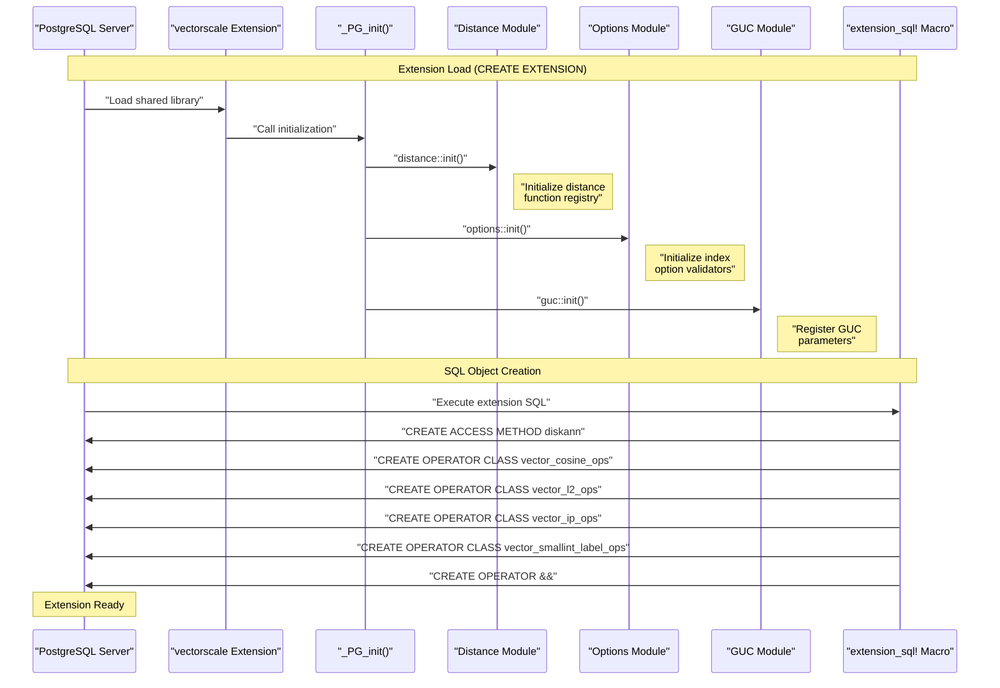
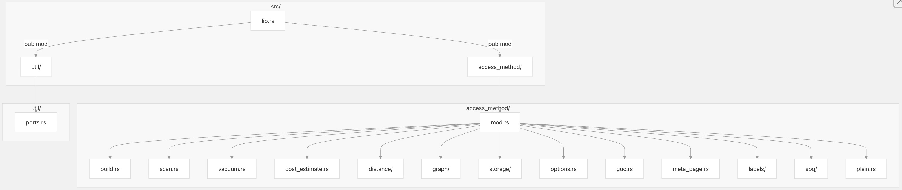
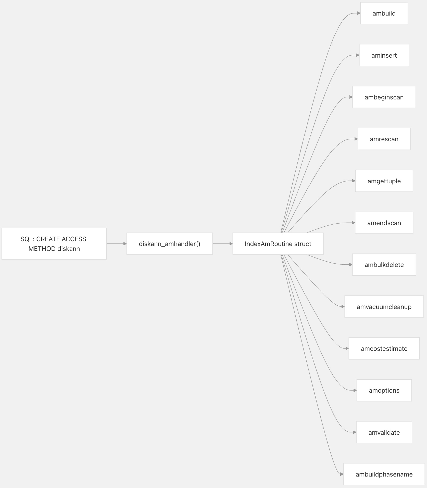
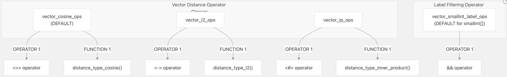
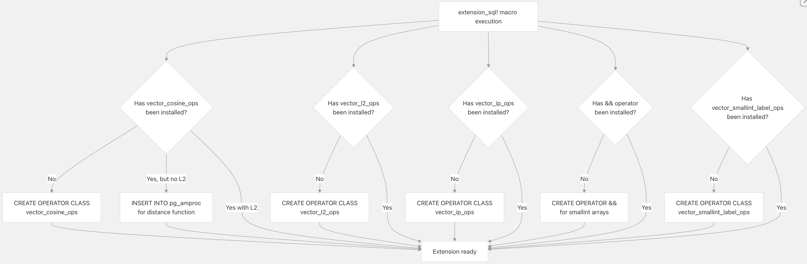
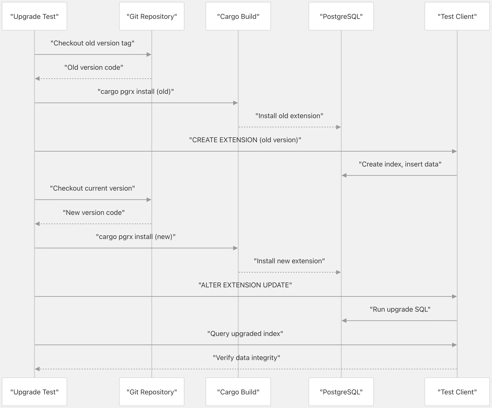
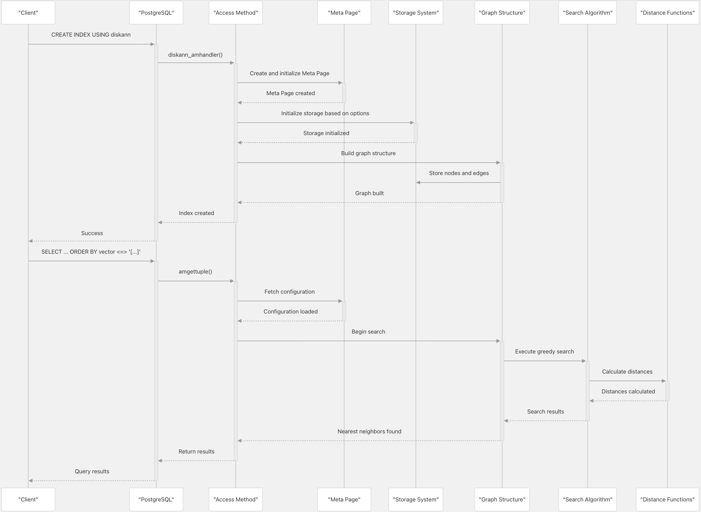

## pgvectorscale 源码学习: 2.1 扩展结构与初始化 (Extension Structure and Initialization)  
        
### 作者        
digoal        
        
### 日期        
2025-11-09        
        
### 标签        
pgvectorscale , 向量数据库 , DiskANN , StreamingDiskANN , 源码学习        
        
----        
        
## 背景       
该页面详细介绍了 `pgvectorscale` 如何将自身初始化为一个 **PostgreSQL 扩展** (`PostgreSQL extension`)，包括**扩展生命周期** (`extension lifecycle`)、**模块组织** (`module organization`) 和**注册机制** (`registration mechanisms`)。  
  
## 扩展框架 (Extension Framework)  
  
`pgvectorscale` 是使用 **PGRX 框架** (`PGRX framework`) (v0.16.1) 构建的，该框架为 **PostgreSQL 扩展** (`PostgreSQL extension`) 开发提供了 **Rust 绑定** (`Rust bindings`)。`PGRX` 负责处理 `Rust` 代码与 **PostgreSQL 的 C API** 之间的接口复杂性。  
  
**扩展生命周期概览 (Extension Lifecycle Overview)**  
  

  
来源: [`pgvectorscale/src/lib.rs` 9-21](https://github.com/timescale/pgvectorscale/blob/36271fa5/pgvectorscale/src/lib.rs#L9-L21) [`pgvectorscale/src/access_method/mod.rs` 161-270](https://github.com/timescale/pgvectorscale/blob/36271fa5/pgvectorscale/src/access_method/mod.rs#L161-L270)  
  
## 模块组织 (Module Organization)  
  
该扩展被组织成 `src` 目录下的模块化结构：  
  
**顶层模块结构 (Top-Level Module Structure)**  
  
    
  
来源: [`pgvectorscale/src/lib.rs` 1-8](https://github.com/timescale/pgvectorscale/blob/36271fa5/pgvectorscale/src/lib.rs#L1-L8) [`pgvectorscale/src/access_method/mod.rs` 1-23](https://github.com/timescale/pgvectorscale/blob/36271fa5/pgvectorscale/src/access_method/mod.rs#L1-L23)  
  
| 模块 (Module) | 目的 (Purpose) |  
| :--- | :--- |  
| `lib.rs` | **扩展入口点** (`Extension entry point`)、**生命周期函数** (`lifecycle functions`) |  
| `access_method/` | 核心**索引实现** (`index implementation`) |  
| `access_method/build.rs` | **索引构建** (`Index building`) (`ambuild`、`aminsert`) |  
| `access_method/scan.rs` | **索引扫描** (`Index scanning`) (`ambeginscan`、`amgettuple`) |  
| `access_method/vacuum.rs` | **垃圾回收操作** (`Vacuum operations`) |  
| `access_method/distance/` | **距离度量实现** (`Distance metric implementations`) |  
| `access_method/graph/` | **DiskANN 图结构** (`DiskANN graph structure`) |  
| `access_method/storage/` | **存储抽象** (`Storage abstractions`) |  
| `access_method/options.rs` | **索引选项解析** (`Index option parsing`) |  
| `access_method/guc.rs` | **GUC 参数定义** (`GUC parameter definitions`) |  
| `access_method/meta_page.rs` | **元数据存储** (`Metadata storage`) |  
| `access_method/labels/` | **标签过滤** (`Label filtering`) |  
| `access_method/sbq/` | **SBQ 压缩** (`SBQ compression`) |  
| `util/` | **PostgreSQL API 端口和实用程序** (`PostgreSQL API ports and utilities`) |  
  
来源: [`pgvectorscale/src/access_method/mod.rs` 1-23](https://github.com/timescale/pgvectorscale/blob/36271fa5/pgvectorscale/src/access_method/mod.rs#L1-L23)  
  
## 扩展初始化: `_PG_init` (Extension Initialization: `_PG_init`)  
  
`_PG_init` 函数是扩展的**入口点** (`entry point`)，在 **PostgreSQL** 加载扩展的**共享库** (`shared library`) 时调用。这发生在 `CREATE EXTENSION vectorscale` 期间。  
  
**初始化函数 (Initialization Function)**  
  
```rust  
#[pg_guard]  
pub unsafe extern "C-unwind" fn _PG_init() {  
    access_method::distance::init();  
    access_method::options::init();  
    access_method::guc::init();  
}  
```  
  
来源: [`pgvectorscale/src/lib.rs` 11-15](https://github.com/timescale/pgvectorscale/blob/36271fa5/pgvectorscale/src/lib.rs#L11-L15)  
  
**初始化步骤 (Initialization Steps)**  
  
| 步骤 (Step) | 模块 (Module) | 目的 (Purpose) |  
| :--- | :--- | :--- |  
| 1 | `distance::init()` | 注册用于 `L2`、**余弦** (`cosine`) 和**内积** (`inner product`) 的**距离函数工厂** (`distance function factories`) |  
| 2 | `options::init()` | 初始化**索引选项验证器和默认值** (`index option validators and defaults`) |  
| 3 | `guc::init()` | 注册 **GUC 参数** (`GUC parameters`) (`diskann.query_search_list_size`、`diskann.query_rescore`) |  
  
`_PG_fini` 函数也被定义，但由于清理工作由 **PostgreSQL** 和 **Rust** 的 `drop` 机制自动处理，因此不执行任何操作。  
  
来源: [`pgvectorscale/src/lib.rs` 18-21](https://github.com/timescale/pgvectorscale/blob/36271fa5/pgvectorscale/src/lib.rs#L18-L21)  
  
## PGRX Magic 和模块声明 (PGRX Magic and Module Declaration)  
  
`PGRX` 需要 `pg_module_magic!()` 宏来生成 **PostgreSQL** 验证和加载扩展所需的**元数据** (`metadata`)：  
  
```rust  
pgrx::pg_module_magic!();  
```  
  
该宏生成：  
  
  * **PostgreSQL 版本兼容性检查** (`PostgreSQL version compatibility checks`)  
  * **魔数验证** (`Magic number validation`)  
  * **ABI 版本信息** (`ABI version information`)  
  
来源: [`pgvectorscale/src/lib.rs` 4](https://github.com/timescale/pgvectorscale/blob/36271fa5/pgvectorscale/src/lib.rs#L4-L4)  
  
## 访问方法注册 (Access Method Registration)  
  
`diskann` **访问方法** (`access method`) 通过 `diskann_amhandler` 函数进行注册，**PostgreSQL** 调用该函数以获取**访问方法**的**回调结构** (`callback structure`)。  
  
**访问方法处理程序注册 (Access Method Handler Registration)**  
  
    
  
来源: [`pgvectorscale/src/access_method/mod.rs` 27-87](https://github.com/timescale/pgvectorscale/blob/36271fa5/pgvectorscale/src/access_method/mod.rs#L27-L87)  
  
处理程序函数创建并使用**回调函数指针** (`callback function pointers`) 填充一个 `pg_sys::IndexAmRoutine` **结构体** (`structure`)：  
  
| 回调 (Callback) | 函数 (Function) | 目的 (Purpose) |  
| :--- | :--- | :--- |  
| `ambuild` | `build::ambuild` | 从**堆表** (`heap table`) 创建新索引 |  
| `ambuildempty` | `build::ambuildempty` | 创建空的**索引结构** (`index structure`) |  
| `aminsert` | `build::aminsert` | 将单个**元组** (`tuple`) 插入到索引中 |  
| `ambulkdelete` | `vacuum::ambulkdelete` | 标记要删除的**元组** |  
| `amvacuumcleanup` | `vacuum::amvacuumcleanup` | 完成**垃圾回收操作** (`vacuum operation`) |  
| `amcostestimate` | `cost_estimate::amcostestimate` | 估计**查询成本** (`query cost`) |  
| `amoptions` | `options::amoptions` | 解析**索引选项** (`index options`) |  
| `ambeginscan` | `scan::ambeginscan` | 初始化**扫描状态** (`scan state`) |  
| `amrescan` | `scan::amrescan` | 用新**键** (`keys`) 重启扫描 |  
| `amgettuple` | `scan::amgettuple` | 返回下一个匹配的**元组** |  
| `amendscan` | `scan::amendscan` | 清理**扫描状态** |  
| `amvalidate` | `amvalidate` | 验证**操作符类** (`operator class`) |  
| `ambuildphasename` | `build::ambuildphasename` | 报告**构建阶段名称** (`build phase name`) |  
  
来源: [`pgvectorscale/src/access_method/mod.rs` 45-87](https://github.com/timescale/pgvectorscale/blob/36271fa5/pgvectorscale/src/access_method/mod.rs#L45-L87)  
  
**索引能力标志 (Index Capability Flags)**  
  
`IndexAmRoutine` 也指定了**访问方法**的**能力** (`capabilities`)：  
  
```c  
amroutine.amcanorder = false;  
amroutine.amcanorderbyop = true;  // Supports ORDER BY operator  
amroutine.amcanbackward = false;  
amroutine.amcanunique = false;  
amroutine.amcanmulticol = true;   // Supports multi-column indexes (vector + labels)  
amroutine.amoptionalkey = true;  
amroutine.amsearcharray = false;  
amroutine.amsearchnulls = false;  
```  
  
来源: [`pgvectorscale/src/access_method/mod.rs` 49-68](https://github.com/timescale/pgvectorscale/blob/36271fa5/pgvectorscale/src/access_method/mod.rs#L49-L68)  
  
## 操作符类注册 (Operator Class Registration)  
  
**操作符类** (`Operator classes`) 定义了哪些**操作符** (`operators`) 可以与 `diskann` **访问方法** (`access method`) 一起使用。该扩展通过 `extension_sql!` **宏** (`macro`) 注册了多个**操作符类**，该宏生成在 `CREATE EXTENSION` 期间运行的**幂等 SQL** (`idempotent SQL`)。  
  
**操作符类结构 (Operator Class Structure)**  
  
    
  
来源: [`pgvectorscale/src/access_method/mod.rs` 161-270](https://github.com/timescale/pgvectorscale/blob/36271fa5/pgvectorscale/src/access_method/mod.rs#L161-L270)  
  
**已注册的操作符类 (Operator Classes Registered)**  
  
| 操作符类 (Operator Class) | 类型 (Type) | 操作符 (Operator) | 支持函数 (Support Function) | 默认 (Default) |  
| :--- | :--- | :--- | :--- | :--- |  
| `vector_cosine_ops` | `vector` | `<=>` | `distance_type_cosine()` | 是 (Yes) |  
| `vector_l2_ops` | `vector` | `<->` | `distance_type_l2()` | 否 (No) |  
| `vector_ip_ops` | `vector` | `<#>` | `distance_type_inner_product()` | 否 (No) |  
| `vector_smallint_label_ops` | `smallint[]` | `&&` | 无 (None) | 是 (Yes) |  
  
来源: [`pgvectorscale/src/access_method/mod.rs` 202-258](https://github.com/timescale/pgvectorscale/blob/36271fa5/pgvectorscale/src/access_method/mod.rs#L202-L258)  
  
### 标签重叠操作符 (Label Overlap Operator)  
  
该扩展为 `smallint[]` **数组** (`arrays`) 定义了一个自定义的 `&&` **操作符** (`operator`)，以支持**标签过滤** (`label filtering`)：  
  
```sql  
CREATE OPERATOR && (  
    LEFTARG = smallint[],  
    RIGHTARG = smallint[],  
    PROCEDURE = smallint_array_overlap,  
    COMMUTATOR = &&  
);  
```  
  
`smallint_array_overlap` 函数在 `Rust` 中实现并通过 **PGRX** 导出：  
  
```rust  
#[pg_extern(immutable, parallel_safe, create_or_replace)]  
pub fn smallint_array_overlap(left: Array<i16>, right: Array<i16>) -> bool  
```  
  
来源: [`pgvectorscale/src/access_method/mod.rs` 230-252](https://github.com/timescale/pgvectorscale/blob/36271fa5/pgvectorscale/src/access_method/mod.rs#L230-L252) [`pgvectorscale/src/access_method/mod.rs` 279-312](https://github.com/timescale/pgvectorscale/blob/36271fa5/pgvectorscale/src/access_method/mod.rs#L279-L312)  
  
## 扩展 SQL 生成 (Extension SQL Generation)  
  
`extension_sql!` **宏** (`macro`) 生成在扩展创建或升级时执行的 `SQL` 代码。此 **SQL** 是**幂等** (`idempotent`) 的，允许同一脚本用于初始安装和从先前版本的升级。  
  
**幂等注册逻辑 (Idempotent Registration Logic)**  
  
    
  
来源: [`pgvectorscale/src/access_method/mod.rs` 161-270](https://github.com/timescale/pgvectorscale/blob/36271fa5/pgvectorscale/src/access_method/mod.rs#L161-L270)  
  
`SQL` 生成包括：  
  
1.  **操作符类创建** (`Operator Class Creation`): 定义**向量** (`vector`) 和**标签类型** (`label types`) 如何与 `diskann` **访问方法**一起工作  
2.  **操作符注册** (`Operator Registration`): 如果 `&&` **操作符**不存在则创建它  
3.  **支持函数注册** (`Support Function Registration`): 将**距离类型函数** (`distance type functions`) 链接到**操作符类**  
4.  **升级兼容性** (`Upgrade Compatibility`): 处理从不包括所有**操作符类**的版本的迁移  
  
来源: [`pgvectorscale/src/access_method/mod.rs` 89-159](https://github.com/timescale/pgvectorscale/blob/36271fa5/pgvectorscale/src/access_method/mod.rs#L89-L159) [`pgvectorscale/src/access_method/mod.rs` 161-270](https://github.com/timescale/pgvectorscale/blob/36271fa5/pgvectorscale/src/access_method/mod.rs#L161-L270)  
  
## 包配置 (Package Configuration)  
  
该扩展通过 `Cargo.toml` 配置为基于 **PGRX** 的 **PostgreSQL 扩展**：  
  
**关键包设置 (Key Package Settings)**  
  
```toml  
[package]  
name = "vectorscale"  
version = "0.8.0"  
edition = "2021"  
  
[lib]  
crate-type = ["cdylib", "rlib"]  
```  
  
`cdylib` **crate 类型** (`crate type`) 生成一个 **PostgreSQL** 可以加载的**共享库** (`shared library`)，而 `rlib` 允许该扩展被其他 **Rust** 代码用作**库** (`library`)。  
  
来源: [`pgvectorscale/Cargo.toml` 1-7](https://github.com/timescale/pgvectorscale/blob/36271fa5/pgvectorscale/Cargo.toml#L1-L7)  
  
**功能标志 (Feature Flags)**  
  
该扩展通过**功能标志** (`feature flags`) 支持多个 **PostgreSQL** 版本：  
  
| 功能 (Feature) | PostgreSQL 版本 (PostgreSQL Version) |  
| :--- | :--- |  
| `pg13` | PostgreSQL 13 |  
| `pg14` | PostgreSQL 14 |  
| `pg15` | PostgreSQL 15 |  
| `pg16` | PostgreSQL 16 |  
| `pg17` | PostgreSQL 17 |  
| `pg18` | PostgreSQL 18 (默认 `default`) |  
  
来源: [`pgvectorscale/Cargo.toml` 13-21](https://github.com/timescale/pgvectorscale/blob/36271fa5/pgvectorscale/Cargo.toml#L13-L21)  
  
**PGRX 依赖 (PGRX Dependency)**  
  
该扩展使用 `PGRX 0.16.1` 进行 **PostgreSQL 集成** (`PostgreSQL integration`)：  
  
```toml  
[dependencies]  
pgrx = "=0.16.1"  
```  
  
这个特定版本确保了与预期的 **PostgreSQL API** 的 **ABI 兼容性** (`ABI compatibility`)。  
  
来源: [`pgvectorscale/Cargo.toml` 29-31](https://github.com/timescale/pgvectorscale/blob/36271fa5/pgvectorscale/Cargo.toml#L29-L31)  
  
## 扩展升级机制 (Extension Upgrade Mechanism)  
  
`pgvectorscale` 包含一个全面的**升级测试框架** (`upgrade testing framework`)，以确保从旧版本到新版本的平滑迁移。  
  
**升级测试流程 (Upgrade Test Flow)**  
  
    
  
来源: [`pgvectorscale/src/access_method/upgrade_test.rs` 25-260](https://github.com/timescale/pgvectorscale/blob/36271fa5/pgvectorscale/src/access_method/upgrade_test.rs#L25-L260)  
  
**已测试的升级路径 (Tested Upgrade Paths)**  
  
该扩展包括针对从以下版本升级的测试：  
  
| 来源版本 (From Version) | PGRX 版本 (PGRX Version) | 备注 (Notes) |  
| :--- | :--- | :--- |  
| 0.0.2 | 0.11.1 | 原始名称 `timescale_vector` |  
| 0.2.0 | 0.11.4 | 重命名为 `vectorscale` |  
| 0.3.0 | 0.11.4 | |  
| 0.4.0 | 0.12.5 | 首个支持 `PG17` 的版本 |  
| 0.5.0 | 0.12.5 | 添加了 `L2` **距离支持** (`distance support`) |  
| 0.5.1 | 0.12.5 | |  
| 0.6.0 | 0.12.5 | |  
| 0.7.0 | 0.12.9 | |  
| 0.7.1 | 0.12.9 | 最新测试的升级 |  
  
来源: [`pgvectorscale/src/access_method/upgrade_test.rs` 265-329](https://github.com/timescale/pgvectorscale/blob/36271fa5/pgvectorscale/src/access_method/upgrade_test.rs#L265-L329)  
  
升级测试验证了：  
  
1.  旧索引在升级后仍可**查询** (`queryable`)  
2.  可以使用更新后的功能创建新索引  
3.  **系统目录** (`System catalogs`) 已正确迁移  
4.  **数据完整性** (`Data integrity`) 得到维护  
  
来源: [`pgvectorscale/src/access_method/upgrade_test.rs` 25-260](https://github.com/timescale/pgvectorscale/blob/36271fa5/pgvectorscale/src/access_method/upgrade_test.rs#L25-L260)  
  
## 测试框架集成 (Test Framework Integration)  
  
该扩展使用 **PGRX 的测试框架** (`PGRX's testing framework`) 进行**单元测试** (`unit tests`) 和**集成测试** (`integration tests`)。  
  
**测试配置 (Test Configuration)**  
  
```rust  
#[cfg(test)]  
pub mod pg_test {  
    pub fn setup(_options: Vec<&str>) {  
        // One-off initialization when pg_test framework starts  
    }  
  
    pub fn postgresql_conf_options() -> Vec<&'static str> {  
        // PostgreSQL configuration for tests  
        vec![]  
    }  
}  
```  
  
来源: [`pgvectorscale/src/lib.rs` 23-37](https://github.com/timescale/pgvectorscale/blob/36271fa5/pgvectorscale/src/lib.rs#L23-L37)  
  
测试使用 `#[pg_test]` **属性** (`attribute`) 标记，并在 **PostgreSQL 实例** (`PostgreSQL instance`) 中运行：  
  
```rust  
#[pg_test]  
fn test_example() -> spi::Result<()> {  
    // Test code using PostgreSQL's SPI interface  
}  
```  
  
测试套件包括：  
  
  * **单元测试**，用于各个组件  
  * **集成测试**，用于索引操作  
  * **升级兼容性测试**  
  * **并发** (`Concurrency`) 和**竞态条件测试** (`race condition tests`)  
  * **标签过滤测试**  
  
来源: [`pgvectorscale/src/access_method/upgrade_test.rs` 1-6](https://github.com/timescale/pgvectorscale/blob/36271fa5/pgvectorscale/src/access_method/upgrade_test.rs#L1-L6) [`pgvectorscale/src/access_method/labels/filtering_tests.rs` 1-27](https://github.com/timescale/pgvectorscale/blob/36271fa5/pgvectorscale/src/access_method/labels/filtering_tests.rs#L1-L27)  
  
## 集成流程 (Integration Flow)  
  
以下**序列图** (`sequence diagram`) 说明了这些组件在关键操作期间如何相互作用：  
  
    
  
来源: [`src/access_method/mod.rs` 56-98](https://github.com/timescale/pgvectorscale/blob/36271fa5/src/access_method/mod.rs#L56-L98) [`README.md` 166-181](https://github.com/timescale/pgvectorscale/blob/36271fa5/README.md#L166-L181)  
    
#### [PolarDB 学习图谱](https://www.aliyun.com/database/openpolardb/activity "8642f60e04ed0c814bf9cb9677976bd4")
  
  
#### [PostgreSQL 解决方案集合](../201706/20170601_02.md "40cff096e9ed7122c512b35d8561d9c8")
  
  
#### [德哥 / digoal's Github - 公益是一辈子的事.](https://github.com/digoal/blog/blob/master/README.md "22709685feb7cab07d30f30387f0a9ae")
  
  
#### [About 德哥](https://github.com/digoal/blog/blob/master/me/readme.md "a37735981e7704886ffd590565582dd0")
  
  

  
