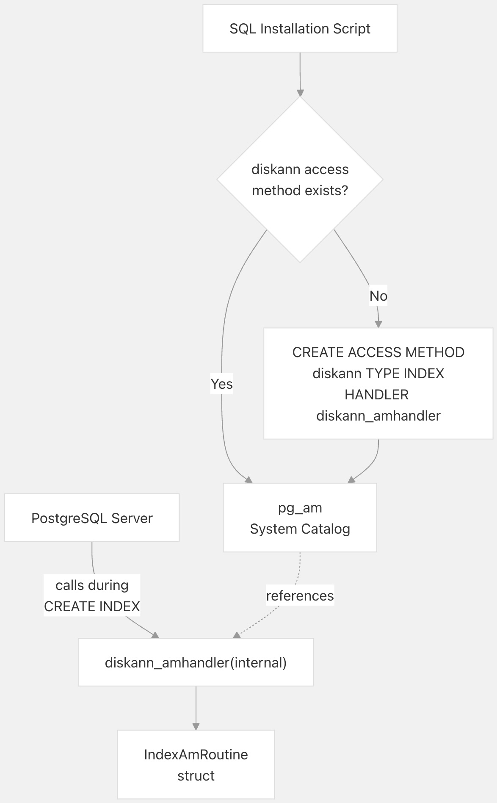
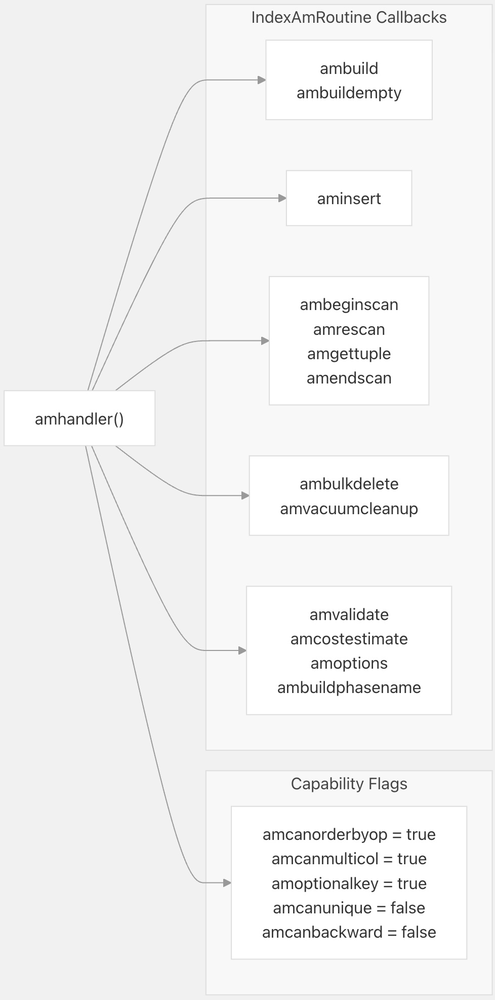
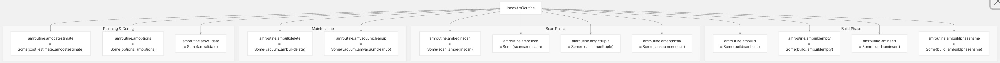
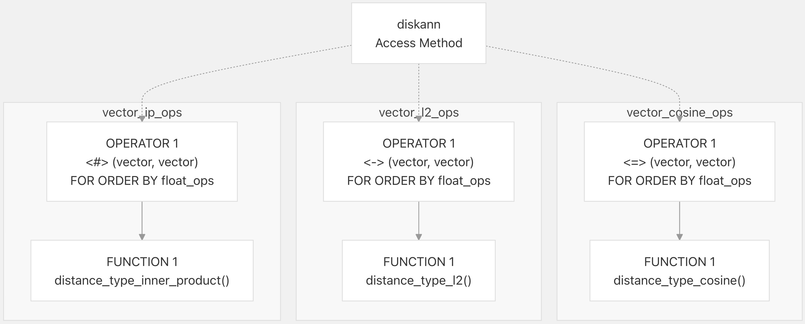
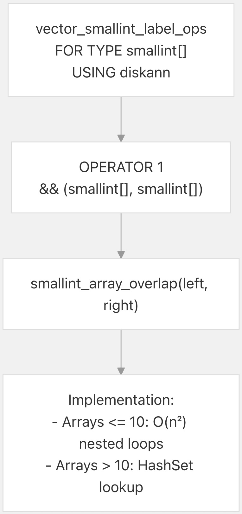
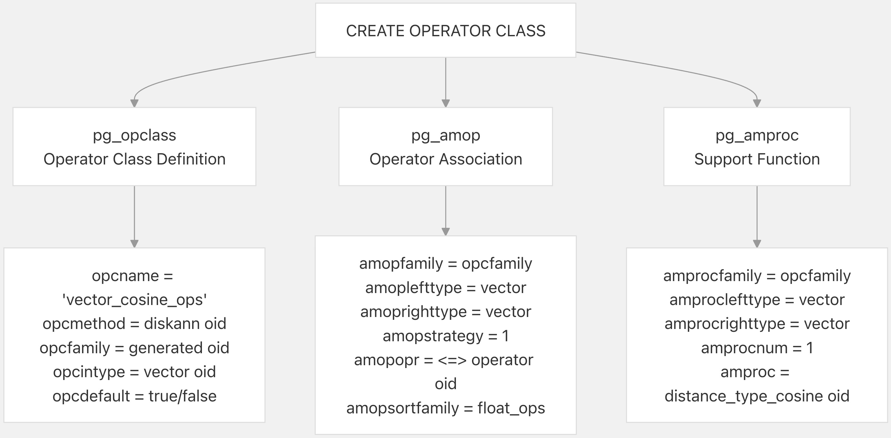
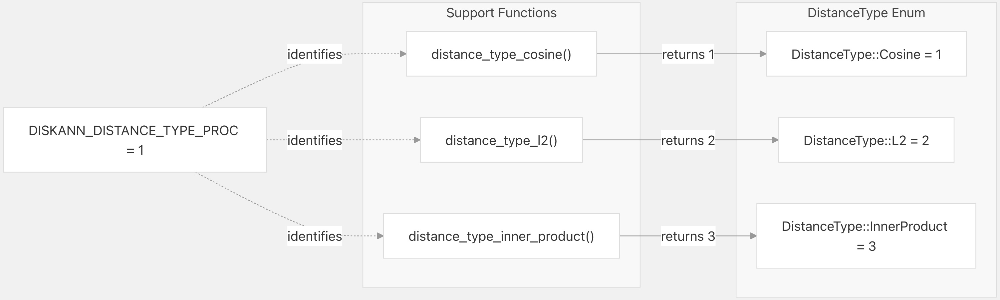
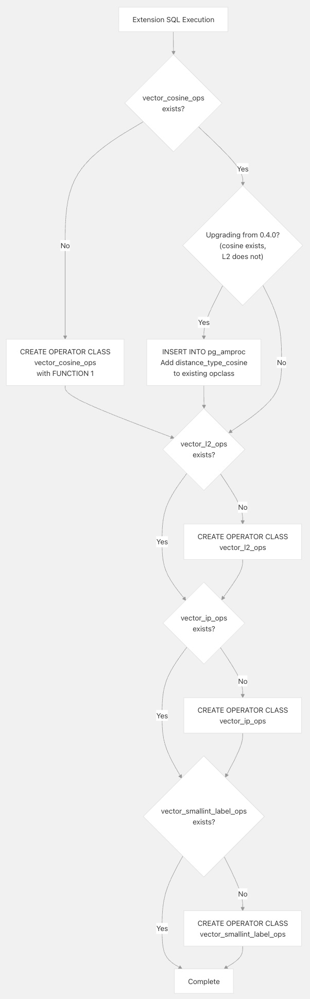
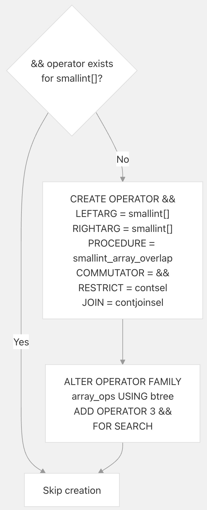

## pgvectorscale 源码学习: 2.2 PostgreSQL 访问方法集成 (`Access Method Integration`)  
          
### 作者          
digoal          
          
### 日期          
2025-11-09          
          
### 标签          
pgvectorscale , 向量数据库 , DiskANN , StreamingDiskANN , 源码学习          
          
----          
          
## 背景       
本文介绍 `pgvectorscale` 如何与 **PostgreSQL** 的 **访问方法基础设施** (`access method infrastructure`) 集成，以提供 `diskann` **索引类型** (`index type`)。它涵盖了 **访问方法处理程序注册** (`access method handler registration`)、`IndexAmRoutine` **回调结构** (`callback structure`)，以及针对不同 **距离度量** (`distance metrics`) 和 **标签过滤** (`label filtering`) 的 **操作符类注册** (`operator class registration`)。  
  
## 访问方法处理程序注册 (`Access Method Handler Registration`)  
  
**PostgreSQL** 的 **访问方法 API** (`access method API`) 要求注册一个 **处理程序函数** (`handler function`)，该函数返回一个使用 **回调函数指针** (`callback function pointers`) 填充的 `IndexAmRoutine` 结构体。`diskann_amhandler` 函数承担此角色。  
  
### 处理程序函数和访问方法创建 (`Handler Function and Access Method Creation`)  
  
该处理程序函数在 [`pgvectorscale/src/access_method/mod.rs` 27-44](https://github.com/timescale/pgvectorscale/blob/36271fa5/pgvectorscale/src/access_method/mod.rs#L27-L44) 中定义，使用了 `#[pg_extern]` **属性宏** (`attribute macro`)，该宏会同时生成 C **封装器** (`wrapper`) 和 SQL **安装脚本** (`installation script`)。  
  
  
  
**图表: 访问方法注册流程**  
  
注册使用 **DO 代码块模式** (`DO block pattern`) 使安装具有 **幂等性** (`idempotent`)——在尝试创建之前检查访问方法是否已存在。这使得相同的 SQL 既可用于初次安装，也可用于 **升级** (`upgrades`)。  
  
来源: [`pgvectorscale/src/access_method/mod.rs` 27-87](https://github.com/timescale/pgvectorscale/blob/36271fa5/pgvectorscale/src/access_method/mod.rs#L27-L87)  
  
### IndexAmRoutine 结构体填充 (`IndexAmRoutine Structure Population`)  
  
`amhandler` 函数分配并填充一个 `IndexAmRoutine` 结构体，其中包含 **能力标志** (`capability flags`) 和 **回调指针** (`callback pointers`)。  
  
  
  
**图表: IndexAmRoutine 结构体内容**  
  
该结构体指定 `diskann` 支持:  
  
  * **排序操作符** (`Order-by operators`) (`amcanorderbyop = true`): 对于带有 `ORDER BY distance` 的 **相似性搜索** (`similarity search`) 至关重要  
  * **多列索引** (`Multi-column indexes`) (`amcanmulticol = true`): 允许使用向量 (`vector`) + 标签 (`label`) 列  
  * **可选键** (`Optional key`) (`amoptionalkey = true`): 允许在没有 **搜索谓词** (`search predicates`) 的情况下进行扫描 (`scans`)  
  * **无唯一性** (`No uniqueness`) (`amcanunique = false`): 向量不是 **唯一标识符** (`unique identifiers`)  
  * **无向后扫描** (`No backward scans`) (`amcanbackward = false`): **图遍历** (`Graph traversal`) 是 **单向的** (`unidirectional`)  
  
来源: [`pgvectorscale/src/access_method/mod.rs` 45-87](https://github.com/timescale/pgvectorscale/blob/36271fa5/pgvectorscale/src/access_method/mod.rs#L45-L87)  
  
## IndexAmRoutine 回调 (`IndexAmRoutine Callbacks`)  
  
这些 **回调函数** (`callback functions`) 实现了 **索引访问方法生命周期** (`index access method lifecycle`)。每个回调函数在 **索引操作** (`index operations`) 期间的特定时间点被 **PostgreSQL** 调用。  
  
| Callback | 目的 (`Purpose`) | 实现文件 (`Implementation File`) |  
| :--- | :--- | :--- |  
| `amvalidate` | 验证操作符类配置 (`operator class configuration`) | [`mod.rs` 273-275](https://github.com/timescale/pgvectorscale/blob/36271fa5/mod.rs#L273-L275) |  
| `ambuild` | 从堆表构建索引 (`Build index from heap table`) | [`build.rs`](https://github.com/timescale/pgvectorscale/blob/36271fa5/build.rs) |  
| `ambuildempty` | 为未记录日志的表创建空索引 (`Create empty index for unlogged tables`) | [`build.rs`](https://github.com/timescale/pgvectorscale/blob/36271fa5/build.rs) |  
| `aminsert` | 将单个元组插入到现有索引 (`Insert single tuple into existing index`) | [`build.rs`](https://github.com/timescale/pgvectorscale/blob/36271fa5/build.rs) |  
| `ambeginscan` | 初始化索引扫描状态 (`Initialize index scan state`) | [`scan.rs`](https://github.com/timescale/pgvectorscale/blob/36271fa5/scan.rs) |  
| `amrescan` | 使用新的查询参数重置扫描 (`Reset scan with new query parameters`) | [`scan.rs`](https://github.com/timescale/pgvectorscale/blob/36271fa5/scan.rs) |  
| `amgettuple` | 从扫描中检索下一个元组 (`Retrieve next tuple from scan`) | [`scan.rs`](https://github.com/timescale/pgvectorscale/blob/36271fa5/scan.rs) |  
| `amendscan` | 清理扫描状态 (`Clean up scan state`) | [`scan.rs`](https://github.com/timescale/pgvectorscale/blob/36271fa5/scan.rs) |  
| `ambulkdelete` | 在 VACUUM 期间标记已删除的元组 (`Mark deleted tuples during VACUUM`) | [`vacuum.rs`](https://github.com/timescale/pgvectorscale/blob/36271fa5/vacuum.rs) |  
| `amvacuumcleanup`| 完成 VACUUM 操作 (`Finalize VACUUM operations`) | [`vacuum.rs`](https://github.com/timescale/pgvectorscale/blob/36271fa5/vacuum.rs) |  
| `amcostestimate` | 为规划器估计查询成本 (`Estimate query cost for planner`) | [`cost_estimate.rs`](https://github.com/timescale/pgvectorscale/blob/36271fa5/cost_estimate.rs) |  
| `amoptions` | 解析索引创建选项 (`Parse index creation options`) | [`options.rs`](https://github.com/timescale/pgvectorscale/blob/36271fa5/options.rs) |  
| `ambuildphasename`| 报告构建进度阶段 (`Report build progress phases`) | [`build.rs`](https://github.com/timescale/pgvectorscale/blob/36271fa5/build.rs) |  
  
### 回调分配 (`Callback Assignment`)  
  
**处理程序函数** (`handler function`) 使用 **函数指针** (`function pointers`) 分配 **回调实现** (`callback implementations`):  
  
  
  
**图表: IndexAmRoutine 中的回调函数分配**  
  
请注意，`amgetbitmap` 被设置为 `None`，因为不支持 **位图扫描** (`bitmap scans`)。系统还将 `amcanparallel` 设置为 `false`，将 `amcaninclude` 设置为 `false`，表明 **并行扫描** (`parallel scans`) 和 **包含列** (`included columns`) 尚未实现。  
  
来源: [`pgvectorscale/src/access_method/mod.rs` 70-85](https://github.com/timescale/pgvectorscale/blob/36271fa5/pgvectorscale/src/access_method/mod.rs#L70-L85)  
  
## 操作符类注册 (`Operator Class Registration`)  
  
**操作符类** (`Operator classes`) 将 **SQL 操作符** (`SQL operators`) 连接到 **访问方法** (`access method`)，并定义索引支持哪些 **距离度量** (`distance metrics`)。该扩展使用 `extension_sql!` **宏** (`macro`) 注册了四个 **操作符类** (`operator classes`)。  
  
### 距离度量操作符类 (`Distance Metric Operator Classes`)  
  
三个 **操作符类** (`operator classes`) 对应于 `pgvector` 支持的 **距离度量** (`distance metrics`):  
  
  
  
**图表: 距离度量操作符类**  
  
每个 **操作符类** (`operator class`) 指定:  
  
  * **操作符 1** (`Operator 1`): **距离操作符** (`distance operator`) (`<=>`、`<->` 或 `<#>`)  
  * **FOR ORDER BY float\_ops**: 结果可以按 **浮点距离** (`float distance`) 排序  
  * **函数 1** (`FUNCTION 1`): 返回 **距离类型常量** (`distance type constant`) 的 **支持函数** (`Support function`)  
  
`vector_cosine_ops` 类被标记为 `DEFAULT`，使其在未指定显式 **操作符类** (`operator class`) 时成为 **默认操作符类** (`default operator class`)。  
  
来源: [`pgvectorscale/src/access_method/mod.rs` 202-228](https://github.com/timescale/pgvectorscale/blob/36271fa5/pgvectorscale/src/access_method/mod.rs#L202-L228)  
  
### 标签过滤操作符类 (`Label Filtering Operator Class`)  
  
`vector_smallint_label_ops` **操作符类** (`operator class`) 能够在 **索引扫描** (`index scans`) 期间启用 **基于标签的过滤** (`label-based filtering`):  
  
  
  
**图表: 标签过滤操作符类**  
  
`&&` **操作符** (`operator`) 检查 **数组重叠** (`array overlap`)。该实现根据 **数组大小** (`array size`) 使用两种策略:  
  
  * **小型数组** (`Small arrays`) (≤10 个元素): **简单嵌套循环比较** (`Simple nested loop comparison`)  
  * **大型数组** (`Large arrays`) (\>10 个元素): 用于 O(n) **性能** (`performance`) 的 **基于 HashSet 的查找** (`HashSet-based lookup`)  
  
来源: [`pgvectorscale/src/access_method/mod.rs` 254-312](https://github.com/timescale/pgvectorscale/blob/36271fa5/pgvectorscale/src/access_method/mod.rs#L254-L312)  
  
### 系统目录中的操作符注册 (`Operator Registration in System Catalogs`)  
  
**操作符类注册** (`Operator class registration`) 在三个 **PostgreSQL 系统目录** (`PostgreSQL system catalogs`) 中创建条目:  
  
  
  
**图表: 操作符类的系统目录条目**  
  
每个 `CREATE OPERATOR CLASS` **语句** (`statement`) 都会生成:  
  
1.  **pg\_opclass 条目** (`entry`): 定义了 **操作符类名称** (`operator class name`)、关联的 **访问方法** (`access method`) 和 **类型** (`type`)  
2.  **pg\_amop 条目** (`entry`): 将 **距离操作符** (`distance operator`) 与 **操作符类** (`operator class`) 和 **排序族** (`sort family`) 关联起来  
3.  **pg\_amproc 条目** (`entry`): 注册返回 **距离类型** (`distance type`) 的 **支持函数** (`support function`)  
  
来源: [`pgvectorscale/src/access_method/mod.rs` 89-159](https://github.com/timescale/pgvectorscale/blob/36271fa5/pgvectorscale/src/access_method/mod.rs#L89-L159)  
  
## 距离类型支持函数 (`Distance Type Support Functions`)  
  
每个 **操作符类** (`operator class`) 都包含一个返回 **距离类型常量** (`distance type constant`) 的 **支持函数** (`support function`)。这些函数使索引能够在 **运行时** (`runtime`) 确定要使用哪个 **距离度量** (`distance metric`)。  
  
  
  
**图表: 距离类型支持函数映射**  
  
定义在 [`pgvectorscale/src/access_method/mod.rs` 25](https://github.com/timescale/pgvectorscale/blob/36271fa5/pgvectorscale/src/access_method/mod.rs#L25-L25) 中的 **常量** (`constant`) `DISKANN_DISTANCE_TYPE_PROC = 1` 在 **操作符类** (`operator class`) 中标识这些 **支持函数** (`support functions`)。在 **索引操作** (`index operations`) 期间，系统通过 `pg_amproc` **查找** (`lookup`) 调用适当的 **支持函数**，以确定使用哪个 **距离计算** (`distance calculation`)。  
  
来源: [`pgvectorscale/src/access_method/distance/mod.rs` 52-62](https://github.com/timescale/pgvectorscale/blob/36271fa5/pgvectorscale/src/access_method/distance/mod.rs#L52-L62) [`pgvectorscale/src/access_method/mod.rs` 25](https://github.com/timescale/pgvectorscale/blob/36271fa5/pgvectorscale/src/access_method/mod.rs#L25-L25)  
  
## 幂等安装和升级 (`Idempotent Installation and Upgrade`)  
  
**操作符类注册 SQL** (`operator class registration SQL`) 使用复杂的 **DO 代码块模式** (`DO block pattern`) 来处理 **初次安装** (`initial installation`) 和从以前版本进行的 **升级** (`upgrades`)。这确保了相同的 **SQL 脚本** (`SQL script`) 可以安全地执行多次。  
  
### 升级兼容性逻辑 (`Upgrade Compatibility Logic`)  
  
  
  
**图表: 幂等操作符类注册流程**  
  
该 **逻辑** (`logic`) 处理了以下几个 **升级场景** (`upgrade scenarios`):  
  
  * **版本 0.4.0 到 0.5.0 升级**: 版本 0.4.0 包含了 `vector_cosine_ops`，但没有 **函数 1** (`FUNCTION 1`) **支持函数条目** (`support function entry`)。脚本通过检查 `vector_cosine_ops` 是否存在但 `vector_l2_ops` 不存在来检测这一点，然后手动插入到 `pg_amproc` 中 [`pgvectorscale/src/access_method/mod.rs` 207-214](https://github.com/timescale/pgvectorscale/blob/36271fa5/pgvectorscale/src/access_method/mod.rs#L207-L214)  
  * **版本 0.5.0+ 升级**: 较新的版本包含所有具有正确 **支持函数** (`support functions`) 的 **操作符类** (`operator classes`)，因此脚本只需检查 **存在性** (`existence`) 并创建 **缺失条目** (`missing entries`)。  
  * **全新安装** (`Fresh Installation`): 当不存在 **操作符类** (`operator classes`) 时，所有四个操作符类将按照顺序使用其 **完整定义** (`complete definitions`) 创建。  
  
来源: [`pgvectorscale/src/access_method/mod.rs` 161-270](https://github.com/timescale/pgvectorscale/blob/36271fa5/pgvectorscale/src/access_method/mod.rs#L161-L270)  
  
## Smallint 数组重叠操作符 (`Smallint Array Overlap Operator`)  
  
**标签过滤** (`label filtering`) 功能需要一个用于 `smallint[]` 数组的自定义 `&&` **重叠操作符** (`overlap operator`)。该 **操作符** (`operator`) 在 `vector_smallint_label_ops` **操作符类** (`operator class`) 之前创建。  
  
### 操作符创建 (`Operator Creation`)  
  
该 **SQL** 首先检查 `&&` **操作符** (`operator`) 是否已存在于 `smallint[]` 类型，以保持 **幂等性** (`idempotency`):  
  
  
  
**图表: Smallint 数组重叠操作符注册**  
  
**操作符注册** (`operator registration`) 包括:  
  
  * **COMMUTATOR = &&**: 该 **操作符** (`operator`) 是其自身的 **对易子** (`commutator`) (对称的)  
  * **RESTRICT = contsel**: 使用 **包含选择性估计** (`containment selectivity estimation`)  
  * **JOIN = contjoinsel**: 使用 **包含连接选择性** (`containment join selectivity`)  
  * **Added to array\_ops**: 为正确的 **查询规划** (`query planning`)，注册到 **btree 数组操作符族** (`btree array operator family`)  
  
来源: [`pgvectorscale/src/access_method/mod.rs` 230-252](https://github.com/timescale/pgvectorscale/blob/36271fa5/pgvectorscale/src/access_method/mod.rs#L230-L252)  
  
### 实现策略 (`Implementation Strategy`)  
  
`smallint_array_overlap` **函数实现** (`function implementation`) 使用 **双重策略** (`dual strategy`):  
  
| 数组大小 (`Array Size`) | 策略 (`Strategy`) | 时间复杂度 (`Time Complexity`) | 原因 (`Reason`) |  
| :--- | :--- | :--- | :--- |  
| Both ≤ 10 elements | **嵌套循环比较** (`Nested loop comparison`) | O(n²) | **简单** (`Simple`)，对 **小型数组** (`small arrays`) **缓存友好** (`cache-friendly`) |  
| Either \> 10 elements | **HashSet 查找** (`HashSet lookup`) | O(n + m) | 对 **大型数组** (`larger arrays`) **高效** (`Efficient`) |  
  
该实现 [`pgvectorscale/src/access_method/mod.rs` 280-312](https://github.com/timescale/pgvectorscale/blob/36271fa5/pgvectorscale/src/access_method/mod.rs#L280-L312) 包含了针对 **空数组** (`empty arrays`) 和 **NULL 值处理** (`NULL value handling`) 的 **提前返回** (`early returns`)。  
  
来源: [`pgvectorscale/src/access_method/mod.rs` 279-312](https://github.com/timescale/pgvectorscale/blob/36271fa5/pgvectorscale/src/access_method/mod.rs#L279-L312)  
  
## 测试与验证 (`Testing and Validation`)  
  
该 **扩展** (`extension`) 包含 **全面的升级测试** (`comprehensive upgrade tests`)，以验证 **操作符类** (`operator classes`) 和 **访问方法** (`access methods`) 在不同 **版本** (`versions`) 之间正确迁移。  
  
### 升级测试框架 (`Upgrade Test Framework`)  
  
[`pgvectorscale/src/access_method/upgrade_test.rs`](https://github.com/timescale/pgvectorscale/blob/36271fa5/pgvectorscale/src/access_method/upgrade_test.rs) 中的 **测试框架** (`test framework`) 验证了:  
  
1.  **版本检出** (`Version Checkout`): 测试从 **Git 标签** (`git tags`) 中检出 **历史版本** (`historical versions`)  
2.  **PGRX 版本匹配** (`PGRX Version Matching`): 为每个 **历史版本** (`historical version`) 安装正确的 `cargo-pgrx` **版本** (`version`)  
3.  **索引创建** (`Index Creation`): 使用 **旧版本** (`old version`) 创建 **索引** (`indexes`)  
4.  **扩展升级** (`Extension Upgrade`): 运行 `ALTER EXTENSION vectorscale UPDATE`  
5.  **升级后验证** (`Post-Upgrade Validation`): 验证 **索引** (`indexes`) 仍然 **功能正常** (`function correctly`)  
6.  **新操作符类创建** (`New Operator Class Creation`): 测试在 **升级** (`upgrade`) 后可以创建 **新操作符类** (`new operator classes`)  
  
**已测试的升级路径** (`Tested upgrade paths`) 包括从 **版本** (`versions`) 0.0.2、0.2.0、0.3.0、0.4.0、0.5.0、0.5.1、0.6.0、0.7.0 和 0.7.1 进行的 **迁移** (`migrations`)。  
  
来源: [`pgvectorscale/src/access_method/upgrade_test.rs` 25-330](https://github.com/timescale/pgvectorscale/blob/36271fa5/pgvectorscale/src/access_method/upgrade_test.rs#L25-L330)  
      
#### [PolarDB 学习图谱](https://www.aliyun.com/database/openpolardb/activity "8642f60e04ed0c814bf9cb9677976bd4")
  
  
#### [PostgreSQL 解决方案集合](../201706/20170601_02.md "40cff096e9ed7122c512b35d8561d9c8")
  
  
#### [德哥 / digoal's Github - 公益是一辈子的事.](https://github.com/digoal/blog/blob/master/README.md "22709685feb7cab07d30f30387f0a9ae")
  
  
#### [About 德哥](https://github.com/digoal/blog/blob/master/me/readme.md "a37735981e7704886ffd590565582dd0")
  
  

  
