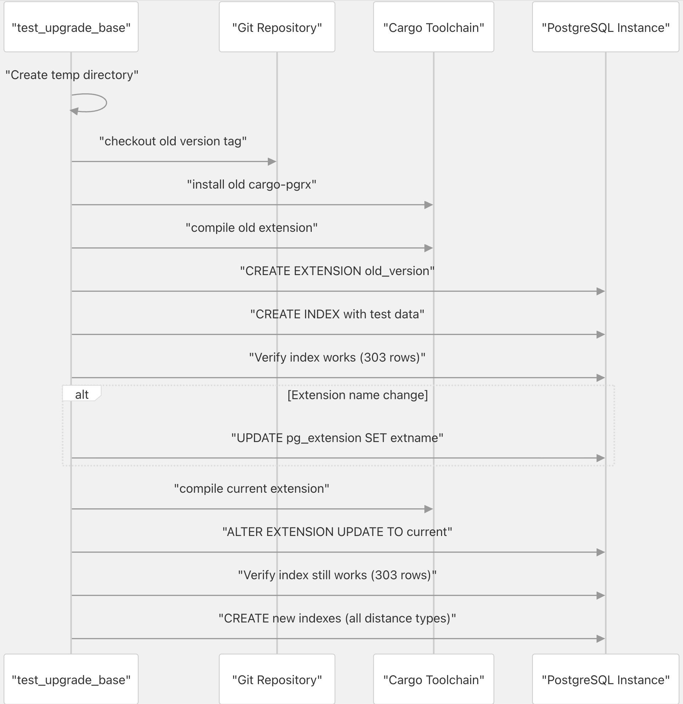
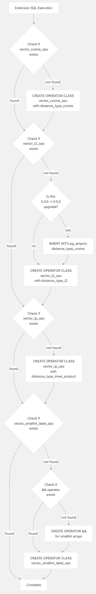

## pgvectorscale 源码学习: 2.3 扩展升级机制 (Extension Upgrade Mechanism)  
            
### 作者            
digoal            
            
### 日期            
2025-11-09            
            
### 标签            
pgvectorscale , 向量数据库 , DiskANN , StreamingDiskANN , 源码学习            
            
----            
            
## 背景       
本文介绍 `pgvectorscale` 中的**扩展升级机制**（Extension Upgrade Mechanism），包括用于验证版本之间升级的**测试框架**（testing framework）、用于**操作符类**（operator class）注册的**幂等 SQL**（idempotent SQL），以及具体的**迁移路径**（migration paths）。  
  
## PostgreSQL 扩展升级概述 (PostgreSQL Extension Upgrade Overview)  
  
**PostgreSQL 扩展**（PostgreSQL extensions）通过 `ALTER EXTENSION ... UPDATE TO` 命令支持**版本控制**（versioning）。升级扩展时，PostgreSQL 会执行**升级脚本**（upgrade scripts），将**系统目录状态**（system catalog state）和**用户数据**（user data）从一个版本迁移到另一个版本。  
  
`pgvectorscale` 必须处理以下内容：  
  
  * **系统目录**（System catalog）更改（**操作符类** (operator classes)、**访问方法** (access methods)、**支持函数** (support functions)）  
  * **索引元数据**（Index metadata）格式更改  
  * 存储索引数据的**二进制格式**（Binary format）更改  
  * 与现有索引的**向后兼容性**（Backward compatibility）  
  
当前版本在 [`pgvectorscale/Cargo.toml` 3](https://github.com/timescale/pgvectorscale/blob/36271fa5/pgvectorscale/Cargo.toml#L3-L3) 中跟踪。PostgreSQL 根据已安装的版本和目标版本来确定要运行哪些**升级脚本**（upgrade scripts）。  
  
**来源:**  
[`pgvectorscale/Cargo.toml` 1-6](https://github.com/timescale/pgvectorscale/blob/36271fa5/pgvectorscale/Cargo.toml#L1-L6)  
  
## 升级测试框架 (Upgrade Testing Framework)  
  
该扩展包含一个用于验证从先前版本升级的**综合测试框架**（comprehensive testing framework）。核心测试逻辑在 `test_upgrade_base` 函数中实现，它模拟一个完整的升级周期。  
  
### 测试过程流程 (Test Process Flow)  
  
    
  
**来源:**  
[`pgvectorscale/src/access_method/upgrade_test.rs` 25-260](https://github.com/timescale/pgvectorscale/blob/36271fa5/pgvectorscale/src/access_method/upgrade_test.rs#L25-L260)  
  
### 核心测试函数 (Core Test Function)  
  
`test_upgrade_base` 函数接受五个参数，用于定义升级场景：  
  
| 参数 (Parameter) | 目的 (Purpose) | 示例值 (Example Value) |  
| :--- | :--- | :--- |  
| `version` | 要测试的旧版本的 **Git 标签**（Git tag） | `"0.7.1"` |  
| `pgrx_version` | 旧代码的 **PGRX 框架版本**（PGRX framework version） | `"0.12.9"` |  
| `subdirname` | 旧版本中的目录名称 | `"pgvectorscale"` |  
| `extname` | 旧版本中的扩展名称 (Extension name) | `"vectorscale"` |  
| `amname` | 旧版本中的 **访问方法名称**（Access method name） | `"diskann"` |  
  
该函数执行以下步骤：  
  
1.  **版本检查**（Version Check）：对于 PostgreSQL 17+ 跳过早期版本（0.4.0 之前），由于缺乏发布，完全跳过 PostgreSQL 18 的测试。 [`pgvectorscale/src/access_method/upgrade_test.rs` 32-43](https://github.com/timescale/pgvectorscale/blob/36271fa5/pgvectorscale/src/access_method/upgrade_test.rs#L32-L43)  
2.  **环境设置**（Environment Setup）：创建一个临时目录并复制整个仓库。 [`pgvectorscale/src/access_method/upgrade_test.rs` 73-76](https://github.com/timescale/pgvectorscale/blob/36271fa5/pgvectorscale/src/access_method/upgrade_test.rs#L73-L76)  
3.  **旧版本安装**（Old Version Installation）：  
      * 检出指定的 **Git 标签**（git tag）。 [`pgvectorscale/src/access_method/upgrade_test.rs` 82-95](https://github.com/timescale/pgvectorscale/blob/36271fa5/pgvectorscale/src/access_method/upgrade_test.rs#L82-L95)  
      * 安装相应的 `cargo-pgrx` 版本。 [`pgvectorscale/src/access_method/upgrade_test.rs` 97-118](https://github.com/timescale/pgvectorscale/blob/36271fa5/pgvectorscale/src/access_method/upgrade_test.rs#L97-L118)  
      * 编译并安装具有适当**目标特性**（target features）的旧扩展。 [`pgvectorscale/src/access_method/upgrade_test.rs` 120-155](https://github.com/timescale/pgvectorscale/blob/36271fa5/pgvectorscale/src/access_method/upgrade_test.rs#L120-L155)  
4.  **数据填充**（Data Population）：创建包含 303 个**向量**（vectors）的测试表并构建**索引**（index）。 [`pgvectorscale/src/access_method/upgrade_test.rs` 169-193](https://github.com/timescale/pgvectorscale/blob/36271fa5/pgvectorscale/src/access_method/upgrade_test.rs#L169-L193)  
5.  **升级前验证**（Pre-Upgrade Validation）：执行查询以验证索引返回所有 303 行。 [`pgvectorscale/src/access_method/upgrade_test.rs` 195-197](https://github.com/timescale/pgvectorscale/blob/36271fa5/pgvectorscale/src/access_method/upgrade_test.rs#L195-L197)  
6.  **扩展名称迁移**（Extension Name Migration）：对于非常旧的版本，将扩展名称从 `timescale_vector` 更新为 `vectorscale`。 [`pgvectorscale/src/access_method/upgrade_test.rs` 199-206](https://github.com/timescale/pgvectorscale/blob/36271fa5/pgvectorscale/src/access_method/upgrade_test.rs#L199-L206)  
7.  **执行升级**（Upgrade Execution）：重新安装当前版本并运行 `ALTER EXTENSION`。 [`pgvectorscale/src/access_method/upgrade_test.rs` 208-232](https://github.com/timescale/pgvectorscale/blob/36271fa5/pgvectorscale/src/access_method/upgrade_test.rs#L208-L232)  
8.  **升级后验证**（Post-Upgrade Validation）：重新执行查询并使用所有**距离类型**（distance types）创建新索引。 [`pgvectorscale/src/access_method/upgrade_test.rs` 234-259](https://github.com/timescale/pgvectorscale/blob/36271fa5/pgvectorscale/src/access_method/upgrade_test.rs#L234-L259)  
  
**来源:**  
[`pgvectorscale/src/access_method/upgrade_test.rs` 25-260](https://github.com/timescale/pgvectorscale/blob/36271fa5/pgvectorscale/src/access_method/upgrade_test.rs#L25-L260)  
  
## 版本兼容性矩阵 (Version Compatibility Matrix)  
  
测试套件验证从以下版本进行的升级：  
  
| 测试函数 (Test Function) | 来源版本 (From Version) | PGRX 版本 (PGRX Version) | 扩展名称 (Extension Name) | 访问方法 (Access Method) | 备注 (Notes) |  
| :--- | :--- | :--- | :--- | :--- | :--- |  
| `test_upgrade_from_0_0_2` | 0.0.2 | 0.11.1 | timescale\_vector | tsv | 原始命名 (Original naming) |  
| `test_upgrade_from_0_2_0` | 0.2.0 | 0.11.4 | vectorscale | diskann | 扩展重命名 (Renamed extension) |  
| `test_upgrade_from_0_3_0` | 0.3.0 | 0.11.4 | vectorscale | diskann | - |  
| `test_upgrade_from_0_4_0` | 0.4.0 | 0.12.5 | vectorscale | diskann | 首次支持 PG17 (First PG17 support) |  
| `test_upgrade_from_0_5_0` | 0.5.0 | 0.12.5 | vectorscale | diskann | 添加了距离函数 (Added distance functions) |  
| `test_upgrade_from_0_5_1` | 0.5.1 | 0.12.5 | vectorscale | diskann | - |  
| `test_upgrade_from_0_6_0` | 0.6.0 | 0.12.5 | vectorscale | diskann | - |  
| `test_upgrade_from_0_7_0` | 0.7.0 | 0.12.9 | vectorscale | diskann | - |  
| `test_upgrade_from_0_7_1` | 0.7.1 | 0.12.9 | vectorscale | diskann | - |  
  
所有测试都标有 `#[ignore]` 和 `#[serial]`，这意味着它们必须**显式运行**（run explicitly）且不能**并行运行**（run in parallel）。  
[`pgvectorscale/src/access_method/upgrade_test.rs` 262-329](https://github.com/timescale/pgvectorscale/blob/36271fa5/pgvectorscale/src/access_method/upgrade_test.rs#L262-L329)  
  
**来源:**  
[`pgvectorscale/src/access_method/upgrade_test.rs` 262-329](https://github.com/timescale/pgvectorscale/blob/36271fa5/pgvectorscale/src/access_method/upgrade_test.rs#L262-L329)  
  
## 幂等操作符类注册 (Idempotent Operator Class Registration)  
  
该扩展使用**幂等 SQL**（idempotent SQL）来确保**操作符类**（operator classes）可以在**初始安装**（initial installation）和**升级**（upgrades）期间安全地注册。此 SQL 是使用 `extension_sql!` **宏**（macro）生成的。  
  
### 操作符类注册逻辑 (Operator Class Registration Logic)  
  
    
  
**来源:**  
[`pgvectorscale/src/access_method/mod.rs` 161-270](https://github.com/timescale/pgvectorscale/blob/36271fa5/pgvectorscale/src/access_method/mod.rs#L161-L270)  
  
### PostgreSQL 系统目录状态 (PostgreSQL System Catalog State)  
  
创建**操作符类**（operator class）时，PostgreSQL 会在三个**系统目录表**（system catalog tables）中创建条目：  
  
1.  **`pg_opclass`**：使用其**访问方法**（access method）注册**操作符类**。  
  
    ```  
    oid   | opcmethod | opcname           | opcintype | opcdefault  
    17722 | 17718     | vector_cosine_ops | 17389     | t  
    ```  
  
    `opcmethod` 字段引用 `diskann` **访问方法**的 `oid`（**对象标识符**），`opcdefault` 表示这是否是**向量类型**（vector type）的**默认操作符类**（default operator class）。  
    [`pgvectorscale/src/access_method/mod.rs` 101-108](https://github.com/timescale/pgvectorscale/blob/36271fa5/pgvectorscale/src/access_method/mod.rs#L101-L108)  
  
2.  **`pg_amop`**：将**操作符**（operator）注册到**操作符族**（operator family）。  
  
    ```  
    oid   | amopfamily | amoplefttype | amoprighttype | amopopr  
    17723 | 17721      | 17389        | 17389         | 17438  
    ```  
  
    这会将 `<=>` **操作符**（operator）链接到**操作符类**（operator class）。  
    [`pgvectorscale/src/access_method/mod.rs` 110-114](https://github.com/timescale/pgvectorscale/blob/36271fa5/pgvectorscale/src/access_method/mod.rs#L110-L114)  
  
3.  **`pg_amproc`**：注册**支持函数**（support functions）。  
  
    ```  
    oid   | amprocfamily | amprocnum | amproc  
    17724 | 17721        | 1         | distance_type_cosine  
    ```  
  
    `amprocnum` 值为 `1` 对应于 `DISKANN_DISTANCE_TYPE_PROC`。  
    [`pgvectorscale/src/access_method/mod.rs` 115-120](https://github.com/timescale/pgvectorscale/blob/36271fa5/pgvectorscale/src/access_method/mod.rs#L115-L120)  
  
**来源:**  
[`pgvectorscale/src/access_method/mod.rs` 89-158](https://github.com/timescale/pgvectorscale/blob/36271fa5/pgvectorscale/src/access_method/mod.rs#L89-L158)  
  
### 幂等逻辑 (Idempotency Logic)  
  
SQL 通过对 `pg_opclass` 执行查询来检查现有**操作符类**（operator classes）：  
  
```sql  
SELECT count(*)  
FROM pg_catalog.pg_opclass c  
WHERE c.opcname = 'vector_cosine_ops'  
AND c.opcmethod = (SELECT oid FROM pg_catalog.pg_am am WHERE am.amname = 'diskann')  
AND c.opcnamespace = (SELECT oid FROM pg_catalog.pg_namespace where nspname='@extschema@')  
```  
  
根据这些计数，SQL 仅在必要时才**有条件地执行**（conditionally executes） `CREATE OPERATOR CLASS` 语句。  
[`pgvectorscale/src/access_method/mod.rs` 170-201](https://github.com/timescale/pgvectorscale/blob/36271fa5/pgvectorscale/src/access_method/mod.rs#L170-L201)  
  
**来源:**  
[`pgvectorscale/src/access_method/mod.rs` 161-270](https://github.com/timescale/pgvectorscale/blob/36271fa5/pgvectorscale/src/access_method/mod.rs#L161-L270)  
  
## 特殊迁移案例 (Special Migration Cases)  
  
### 版本 0.4.0 到 0.5.0：距离类型函数 (Distance Type Functions)  
  
版本 0.4.0 注册**操作符类**（operator classes）时没有 `FUNCTION 1` 子句，这意味着**访问方法**（access method）无法从**操作符类**确定**距离类型**（distance type）。版本 0.5.0 引入了**距离类型函数**（distance type functions）。  
  
升级路径通过以下方式处理：  
  
1.  **检测升级场景**（Detecting the upgrade scenario）：如果 `vector_cosine_ops` 存在但 `vector_l2_ops` 不存在，则表示安装的是 0.4.0 版本。  
    [`pgvectorscale/src/access_method/mod.rs` 207-214](https://github.com/timescale/pgvectorscale/blob/36271fa5/pgvectorscale/src/access_method/mod.rs#L207-L214)  
  
2.  **手动插入**（Manually inserting）**余弦距离类型**（cosine distance type）的 `pg_amproc` 条目：  
  
    ```sql  
    INSERT INTO pg_amproc (oid, amprocfamily, amproclefttype, amprocrighttype, amprocnum, amproc)  
    SELECT (select (max(oid)::int + 1)::oid from pg_amproc),   
           c.opcfamily, c.opcintype, c.opcintype, 1,   
           '@extschema@.distance_type_l2'::regproc  
    FROM pg_opclass c, pg_am a  
    WHERE a.oid = c.opcmethod AND c.opcname = 'vector_cosine_ops' AND a.amname = 'diskann'  
    ```  
  
    这会更新现有**操作符类**（operator class）而不会重新创建它。  
    [`pgvectorscale/src/access_method/mod.rs` 210-213](https://github.com/timescale/pgvectorscale/blob/36271fa5/pgvectorscale/src/access_method/mod.rs#L210-L213)  
  
**来源:**  
[`pgvectorscale/src/access_method/mod.rs` 121-158](https://github.com/timescale/pgvectorscale/blob/36271fa5/pgvectorscale/src/access_method/mod.rs#L121-L158)  
[`pgvectorscale/src/access_method/mod.rs` 207-214](https://github.com/timescale/pgvectorscale/blob/36271fa5/pgvectorscale/src/access_method/mod.rs#L207-L214)  
  
### 扩展名称变更：`timescale_vector` 到 `vectorscale` (Extension Name Change: timescale\_vector to vectorscale)  
  
版本 0.0.2 作为 `timescale_vector` 发布，带有 `tsv` **访问方法**（access method）。升级测试通过直接更新**系统目录**（system catalog）来处理此问题：  
  
```sql  
UPDATE pg_extension SET extname='vectorscale' WHERE extname = 'timescale_vector';  
```  
  
这发生在重新安装当前版本之前，确保**升级脚本**（upgrade script）可以找到正确的**扩展条目**（extension entry）。  
[`pgvectorscale/src/access_method/upgrade_test.rs` 199-206](https://github.com/timescale/pgvectorscale/blob/36271fa5/pgvectorscale/src/access_method/upgrade_test.rs#L199-L206)  
  
**来源:**  
[`pgvectorscale/src/access_method/upgrade_test.rs` 199-206](https://github.com/timescale/pgvectorscale/blob/36271fa5/pgvectorscale/src/access_method/upgrade_test.rs#L199-L206)  
[`pgvectorscale/src/access_method/upgrade_test.rs` 266-272](https://github.com/timescale/pgvectorscale/blob/36271fa5/pgvectorscale/src/access_method/upgrade_test.rs#L266-L272)  
  
### 标签过滤支持 (Label Filtering Support)  
  
**标签过滤**（label filtering）的**操作符类**（`vector_smallint_label_ops`）是在更高版本中添加的。**幂等 SQL**（idempotent SQL）执行以下操作：  
  
1.  检查 `smallint[]` 类型是否存在 `&&` **操作符**（operator）。  
2.  如果需要，创建**操作符**，并将其注册到 `array_ops` **操作符族**（operator family）。  
3.  仅在**操作符类**（operator class）尚不存在时才创建它。  
    [`pgvectorscale/src/access_method/mod.rs` 230-258](https://github.com/timescale/pgvectorscale/blob/36271fa5/pgvectorscale/src/access_method/mod.rs#L230-L258)  
  
**来源:**  
[`pgvectorscale/src/access_method/mod.rs` 194-258](https://github.com/timescale/pgvectorscale/blob/36271fa5/pgvectorscale/src/access_method/mod.rs#L194-L258)  
  
## 模块组织 (Module Organization)  
  
**升级测试框架**（The upgrade testing framework）组织在**访问方法子系统**（access method subsystem）内的一个**专用模块**（dedicated module）中：  
  
    
  
```rust  
// pgvectorscale/src/access_method/mod.rs  
pub mod upgrade_test;  
```  
  
**升级测试模块**（The upgrade test module）仅在运行测试时**有条件地编译**（conditionally compiled），并使用 `#[pg_schema]` **属性**（attribute）隔离在自己的**模式**（schema）中。  
[`pgvectorscale/src/access_method/upgrade_test.rs` 1-3](https://github.com/timescale/pgvectorscale/blob/36271fa5/pgvectorscale/src/access_method/upgrade_test.rs#L1-L3)  
  
**来源:**  
[`pgvectorscale/src/access_method/mod.rs` 1-21](https://github.com/timescale/pgvectorscale/blob/36271fa5/pgvectorscale/src/access_method/mod.rs#L1-L21)  
[`pgvectorscale/src/access_method/upgrade_test.rs` 1-7](https://github.com/timescale/pgvectorscale/blob/36271fa5/pgvectorscale/src/access_method/upgrade_test.rs#L1-L7)  
  
## 运行升级测试 (Running Upgrade Tests)  
  
**升级测试**（Upgrade tests）标有 `#[ignore]`，必须**显式运行**（explicitly run）：  
  
```bash  
# Run a specific upgrade test  
cargo pgrx test --features pg16 -- --ignored test_upgrade_from_0_7_1  
  
# Run all upgrade tests  
cargo pgrx test --features pg16 -- --ignored upgrade  
```  
  
这些测试使用 `serial_test` **crate** 来确保它们**按顺序运行**（run sequentially），因为它们会修改共享的 PostgreSQL 状态。  
[`pgvectorscale/Cargo.toml` 37](https://github.com/timescale/pgvectorscale/blob/36271fa5/pgvectorscale/Cargo.toml#L37-L37)  
[`pgvectorscale/src/access_method/upgrade_test.rs` 5](https://github.com/timescale/pgvectorscale/blob/36271fa5/pgvectorscale/src/access_method/upgrade_test.rs#L5-L5)  
  
**来源:**  
[`pgvectorscale/src/access_method/upgrade_test.rs` 262-329](https://github.com/timescale/pgvectorscale/blob/36271fa5/pgvectorscale/src/access_method/upgrade_test.rs#L262-L329)  
[`pgvectorscale/Cargo.toml` 36-38](https://github.com/timescale/pgvectorscale/blob/36271fa5/pgvectorscale/Cargo.toml#L36-L38)  
  
      
#### [PolarDB 学习图谱](https://www.aliyun.com/database/openpolardb/activity "8642f60e04ed0c814bf9cb9677976bd4")
  
  
#### [PostgreSQL 解决方案集合](../201706/20170601_02.md "40cff096e9ed7122c512b35d8561d9c8")
  
  
#### [德哥 / digoal's Github - 公益是一辈子的事.](https://github.com/digoal/blog/blob/master/README.md "22709685feb7cab07d30f30387f0a9ae")
  
  
#### [About 德哥](https://github.com/digoal/blog/blob/master/me/readme.md "a37735981e7704886ffd590565582dd0")
  
  

  
