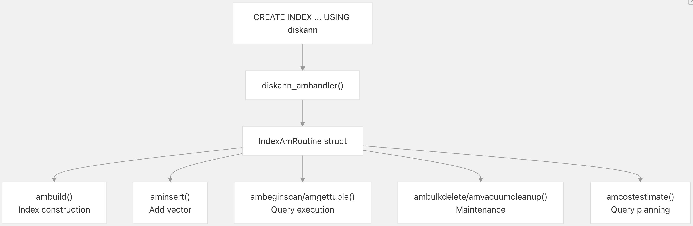
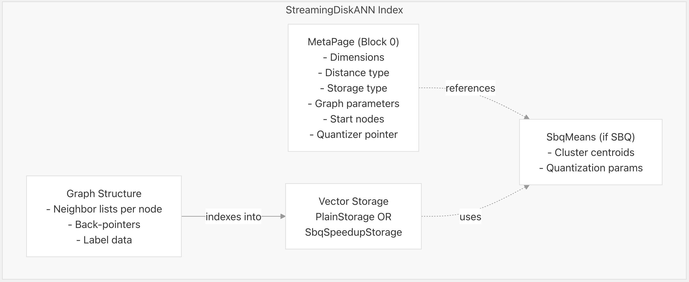
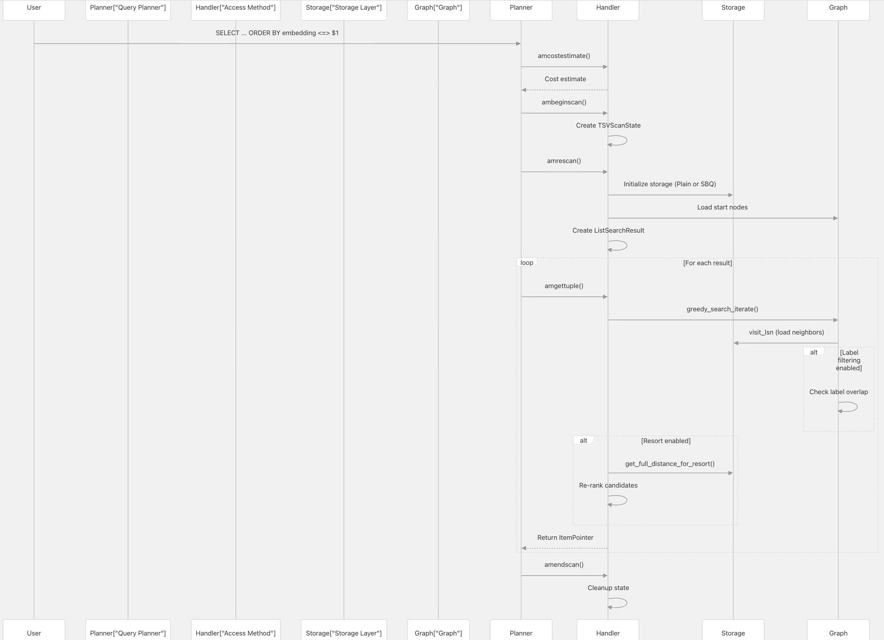

## pgvectorscale 源码学习: 3 StreamingDiskANN 索引  
              
### 作者              
digoal              
              
### 日期              
2025-11-09              
              
### 标签              
pgvectorscale , 向量数据库 , DiskANN , StreamingDiskANN , 源码学习              
              
----              
              
## 背景         
本文介绍 **StreamingDiskANN 索引访问方法**（index access method），它是 **pgvectorscale** 执行**向量嵌入**（vector embeddings）的**近似最近邻**（approximate nearest neighbor, **ANN**）**搜索**的主要机制。**StreamingDiskANN** 实现了一种受 Microsoft 的 **DiskANN** 研究启发的**基于图的搜索算法**（graph-based search algorithm），并针对 **PostgreSQL** 的存储和查询处理模型进行了优化。  
  
本文涵盖了该索引的概念概述、**PostgreSQL** 集成和关键特性。  
  
## 什么是 StreamingDiskANN？  
  
**StreamingDiskANN** 是一种自定义的 **PostgreSQL 索引访问方法**（index access method），为**向量嵌入**（vector embeddings）提供高性能的**近似最近邻搜索**（approximate nearest neighbor search）。与传统数据库索引（**B-trees**，**哈希索引** hash indexes）不同，**StreamingDiskANN** 构建了一个**可导航图**（navigable graph），其中**节点**（nodes）代表向量，**边**（edges）连接相似的向量。这种**图结构**（graph structure）通过从**入口点**（entry point）向**查询向量**（query vector）遍历，实现了高效的**相似性搜索**（similarity search）。  
  
该索引之所以被称为 “Streaming”（流式），是因为它支持**增量更新**（incremental updates）——新向量可以**插入**（inserted）到现有索引中，而无需重建整个结构。这与一些需要**批量构建**（batch construction）的 **ANN 算法**（ANN algorithms）形成了对比。  
  
**关键特性：**  
  
| 特性（Feature） | 描述（Description） |  
| :--- | :--- |  
| 算法（Algorithm） | 基于图的**贪婪搜索**（greedy search），具有强大的**剪枝**（pruning）功能 |  
| 维度（Dimensionality） | 最高 16,000 维（不压缩时最高 2,000 维） |  
| 距离度量（Distance Metrics） | **余弦距离**（Cosine distance）、**L2**/**欧几里得距离**（L2 (Euclidean) distance）、**内积**（Inner product） |  
| 压缩（Compression） | 可选的 **SBQ (Statistical Binary Quantization)**，用于提高内存效率 |  
| 标签过滤（Label Filtering） | 内置支持基于 Microsoft **Filtered DiskANN** 的**过滤搜索**（filtered search） |  
| 插入模型（Insertion Model） | 流式——支持初始构建后的**增量插入**（incremental inserts） |  
  
**来源:**  
[`README.md` 12-16](https://github.com/timescale/pgvectorscale/blob/36271fa5/README.md#L12-L16)  
[`pgvectorscale/src/access_method/build.rs` 67-73](https://github.com/timescale/pgvectorscale/blob/36271fa5/pgvectorscale/src/access_method/build.rs#L67-L73)  
  
## PostgreSQL 访问方法集成  
  
**StreamingDiskANN** 通过**索引访问方法 API**（index access method API）与 **PostgreSQL** 集成。当用户使用 `USING diskann` 创建索引时，**PostgreSQL** 会调用一个**处理函数**（handler function），该函数返回一个用于索引操作的**回调函数**（callback functions）结构体。  
  
### 访问方法处理函数（Access Method Handler）  
  
Figure 1: PostgreSQL Access Method Integration  

  
  
| 回调函数（Callback） | 何时调用（When Invoked） | 目的（Purpose） |  
| :--- | :--- | :--- |  
| `ambuild` | `CREATE INDEX` | 扫描 **堆表**（heap table）并构建初始图 |  
| `aminsert` | `INSERT`, `UPDATE` | 将新向量添加到现有索引 |  
| `ambeginscan` | 查询开始 | 初始化**扫描状态**（scan state） |  
| `amrescan` | 每次扫描前 | 提取**查询向量**（query vector）和**参数**（parameters） |  
| `amgettuple` | 结果检索 | 返回下一个最近的向量 |  
| `amendscan` | 查询结束 | 清理**扫描状态**（scan state） |  
| `ambulkdelete` | `DELETE`, `UPDATE` | 标记**已删除的元组**（deleted tuples） |  
| `amvacuumcleanup` | `VACUUM` | 回收**已删除元组**（deleted tuples）的空间 |  
| `amcostestimate` | 查询规划 | 为**查询规划器**（query planner）估算成本 |  
  
**来源:**  
[`pgvectorscale/src/access_method/build.rs` 76-147](https://github.com/timescale/pgvectorscale/blob/36271fa5/pgvectorscale/src/access_method/build.rs#L76-L147)  
[`pgvectorscale/src/access_method/build.rs` 158-243](https://github.com/timescale/pgvectorscale/blob/36271fa5/pgvectorscale/src/access_method/build.rs#L158-L243)  
[`pgvectorscale/src/access_method/scan.rs` 309-333](https://github.com/timescale/pgvectorscale/blob/36271fa5/pgvectorscale/src/access_method/scan.rs#L309-L333)  
  
### 操作符类（Operator Classes）  
  
**StreamingDiskANN** 支持三种**操作符类**（operator classes），它们定义了哪些**距离度量**（distance metrics）适用于该索引：  
  
```sql  
-- Cosine distance (1 - cosine similarity)  
CREATE INDEX ON documents USING diskann (embedding vector_cosine_ops);  
  
-- L2 (Euclidean) distance    
CREATE INDEX ON documents USING diskann (embedding vector_l2_ops);  
  
-- Inner product (negative for max-IP search)  
CREATE INDEX ON documents USING diskann (embedding vector_ip_ops);  
```  
  
| 操作符类（Operator Class） | 距离度量（Distance Metric） | PostgreSQL 操作符（Operator） |  
| :--- | :--- | :--- |  
| `vector_l2_ops` | L2 (Euclidean) distance (L2 距离) | `<->` (Distance) |  
| `vector_cosine_ops` | Cosine distance (余弦距离) | `<=>` (Max similarity: 1.0 - Cosine) |  
| `vector_ip_ops` | Inner product (内积) | `<#>` (Max similarity: Inner product) |  
  
每个**操作符类**将一个 **PostgreSQL 操作符**（PostgreSQL operator）（`<=>`、`<->`、`<#>`）与相应的**距离函数实现**（distance function implementation）相关联。**距离类型**（distance type）存储在**索引元数据**（index metadata）中，并在整个**查询执行**（query execution）过程中使用。  
  
**来源:**  
[`README.md` 180-181](https://github.com/timescale/pgvectorscale/blob/36271fa5/README.md#L180-L181)  
[`pgvectorscale/src/access_method/build.rs` 95-102](https://github.com/timescale/pgvectorscale/blob/36271fa5/pgvectorscale/src/access_method/build.rs#L95-L102)  
  
## 索引结构概述  
  
一个 **StreamingDiskANN 索引**由存储在 **PostgreSQL 页**（pages）中的三个主要组件组成：  
  
Figure 2: Index Structure Components  
  
  
  
### MetaPage（0 号 block）  
  
每个索引的第一页包含描述索引配置的**元数据**（metadata）：  
  
  * 向量**维度**（dimensionality）（完整和已索引的维度）  
  * **距离度量类型**（Distance metric type）  
  * **存储布局类型**（Storage layout type）（`Plain` 或 `SbqCompression`）  
  * **图构建参数**（Graph construction parameters）（`num_neighbors`、`search_list_size`、`max_alpha`）  
  * **起始节点指针**（Start node pointers）（搜索的**入口点** entry points）  
  * **量化器元数据指针**（Quantizer metadata pointer）（用于 **SBQ 压缩索引** SBQ-compressed indexes）  
  
在大多数索引操作开始时会读取 `MetaPage` 结构体，以确定如何解释存储的数据。  
  
**来源:**  
[`pgvectorscale/src/access_method/build.rs` 108-109](https://github.com/timescale/pgvectorscale/blob/36271fa5/pgvectorscale/src/access_method/build.rs#L108-L109)  
  
### 图结构（Graph Structure）  
  
该**图**（graph）由**节点**（nodes）（每个索引向量一个）组成，通过**有向边**（directed edges）连接到它们的**最近邻**（nearest neighbors）。每个**节点**存储：  
  
  * 指向其 K 个**最近邻**（K = `num_neighbors` 参数）的**指针**（Pointers）  
  * 可选的来自邻居的**反向指针**（back-pointers），用于**双向遍历**（bidirectional traversal）  
  * 可选的**标签数据**（label data），用于**过滤搜索**（filtered search）  
  
在构建过程中，图是通过一次插入一个**节点**的方式**增量式**（incrementally）构建的。对于每个新**节点**，会执行**贪婪搜索**（greedy search）以找到**近似最近邻**（approximate nearest neighbors），并在应用**剪枝算法**（pruning algorithm）后添加**边**（edges），以保持**图质量**（graph quality）。  
  
**来源:**  
[`pgvectorscale/src/access_method/build.rs` 519-554](https://github.com/timescale/pgvectorscale/blob/36271fa5/pgvectorscale/src/access_method/build.rs#L519-L554)  
  
### 向量存储（Vector Storage）  
  
**向量数据**（Vector data）使用 `Storage` **特性**（trait）的两种实现之一进行存储：  
  
  * **PlainStorage**：存储**全精度向量**（full-precision vectors），不进行**压缩**（compression）。适用于最高 2,000 维。每个节点包含完整的 **浮点数组**（float array）加上**邻居指针**（neighbor pointers）。  
  * **SbqSpeedupStorage**：使用**统计二值量化**（Statistical Binary Quantization）将**向量压缩**（compress vectors）到每维度 1-2 位。2,000 维以上的向量需要使用此方法。包括：  
      * **量化向量代码**（Quantized vector codes）（**紧凑位数组** compact bit arrays）  
      * 对包含**聚类均值**（cluster means）的共享 `SbqQuantizer` 的引用  
      * 用于频繁访问的**量化向量**（quantized vectors）的 **LRU 缓存**（LRU cache）  
  
**存储实现**（storage implementation）在索引创建时通过 `storage_layout` 参数选择。  
  
**来源:**  
[`pgvectorscale/src/access_method/build.rs` 104-130](https://github.com/timescale/pgvectorscale/blob/36271fa5/pgvectorscale/src/access_method/build.rs#L104-L130)  
[`pgvectorscale/src/access_method/build.rs` 345-398](https://github.com/timescale/pgvectorscale/blob/36271fa5/pgvectorscale/src/access_method/build.rs#L345-L398)  
  
## 关键特性  
  
### 流式插入（Streaming Insertion）  
  
与**面向批处理的 ANN 索引**（batch-oriented ANN indexes）不同，**StreamingDiskANN** 支持在初始构建后添加向量。`aminsert` **回调函数**（callback）：  
  
1.  使用 `Tape::resume` 为新**节点**（node）分配空间  
2.  执行**贪婪搜索**（greedy search）以找到**近似邻居**（approximate neighbors）  
3.  **双向更新邻居列表**（Updates neighbor lists bidirectionally）  
4.  将**节点**（node）及其**边**（edges）写入磁盘  
  
这使得新**嵌入**（embeddings）持续到达的**实时应用**（real-time applications）成为可能。  
  
**来源:**  
[`pgvectorscale/src/access_method/build.rs` 185-243](https://github.com/timescale/pgvectorscale/blob/36271fa5/pgvectorscale/src/access_method/build.rs#L185-L243)  
[`pgvectorscale/src/access_method/build.rs` 245-266](https://github.com/timescale/pgvectorscale/blob/36271fa5/pgvectorscale/src/access_method/build.rs#L245-L266)  
  
### SBQ 压缩（SBQ Compression）  
  
对于**高维向量**（high-dimensional vectors），**StreamingDiskANN** 使用**统计二值量化**（Statistical Binary Quantization, **SBQ**）来减少**内存使用**（memory usage）：  
  
  * **训练阶段**（Training Phase）（在 `CREATE INDEX` 期间）：  
    1.  从 **堆表**（heap table）中抽取向量样本  
    2.  **聚类样本**（Cluster samples）以找到**代表性质心**（representative centroids）  
    3.  将**质心**（centroids）存储在 `SbqMeans` 结构体中  
    4.  在 `MetaPage` 中记录**指针**（pointer）  
  * **查询阶段**（Query Phase）：  
    1.  使用存储的**质心**（centroids）**量化查询向量**（Quantize query vector）  
    2.  使用**位操作**（bit operations）计算**近似距离**（approximate distances）  
    3.  可选地，使用**全精度向量**（full-precision vectors）**重新评分顶部候选者**（rescore top candidates）  
  
**SBQ** 在保持**高召回率**（high recall）的同时，实现了 8-16 倍的**压缩**（compression）。  
  
**来源:**  
[`pgvectorscale/src/access_method/build.rs` 282-322](https://github.com/timescale/pgvectorscale/blob/36271fa5/pgvectorscale/src/access_method/build.rs#L282-L322)  
  
### 基于标签的过滤（Label-Based Filtering）  
  
**StreamingDiskANN** 实现了 Microsoft 的 **Filtered DiskANN** 算法，以支持高效的**过滤搜索**（filtered search）。用户可以在创建索引时指定一个 `SMALLINT[]` **标签列**（label column）：  
  
```sql  
CREATE INDEX ON documents   
USING diskann (embedding vector_cosine_ops, labels);  
```  
  
在搜索过程中，该算法在遍历**图**（graph）时应用**标签过滤器**（label filters），仅考虑其**标签**（labels）与**查询标签**（query labels）重叠的**节点**（nodes）（使用 `&&` 操作符）。这比**后过滤**（post-filtering）要快得多，因为它**提前剪枝了搜索空间**（prunes the search space early）。  
  
**来源:**  
[`README.md` 184-232](https://github.com/timescale/pgvectorscale/blob/36271fa5/README.md#L184-L232)  
[`pgvectorscale/src/access_method/labels/filtering_tests.rs` 22-109](https://github.com/timescale/pgvectorscale/blob/36271fa5/pgvectorscale/src/access_method/labels/filtering_tests.rs#L22-L109)  
  
### 查询时重新评分（Query-Time Rescoring）  
  
当使用 **SBQ 压缩**（SBQ compression）或 **Matryoshka 嵌入**（indexing fewer dimensions than the vector contains）时，索引可以选择性地使用**全精度距离**（full-precision distances）**重新评分顶部候选者**（rescore top candidates）：  
  
1.  使用**近似距离**（approximate distances）执行**图搜索**（graph search）  
2.  **缓冲顶部 N 个候选者**（Buffer top N candidates）（N = `diskann.query_rescore`）  
3.  从**堆表**（heap table）读取**完整向量**（full vectors）  
4.  重新计算**精确距离**（exact distances）  
5.  **重新排序结果**（Re-rank results）  
  
这以额外的**堆访问**（heap accesses）为代价提高了**准确性**（accuracy）。  
  
**来源:**  
[`pgvectorscale/src/access_method/scan.rs` 244-305](https://github.com/timescale/pgvectorscale/blob/36271fa5/pgvectorscale/src/access_method/scan.rs#L244-L305)  
[`pgvectorscale/src/access_method/build.rs` 822-875](https://github.com/timescale/pgvectorscale/blob/36271fa5/pgvectorscale/src/access_method/build.rs#L822-L875)  
  
## 查询执行流程  
  
Figure 3: Query Execution Sequence  
  
  
  
### 搜索算法（Search Algorithm）  
  
**核心搜索算法**（core search algorithm）是对**图**（graph）执行的**贪婪最佳优先搜索**（greedy best-first search）：  
  
1.  **初始化**（Initialization）：从一个或多个**入口节点**（entry nodes）（存储在 `MetaPage` 中）开始  
2.  **迭代**（Iteration）：  
      * 从候选者中选择**最近的未访问节点**（closest unvisited node）  
      * 从存储中加载其**邻居**（neighbors）  
      * 如果指定，应用**标签过滤器**（label filters）  
      * 将合格的**邻居**添加到**候选集**（candidate set）  
      * 将当前**节点**（node）标记为**已访问**（visited）  
3.  **终止**（Termination）：当**搜索列表**（search list）耗尽或找到足够的结果时停止  
4.  **重排序**（Resort）（可选）：重新计算**顶部候选者**（top candidates）的**精确距离**（exact distances）  
  
`ListSearchResult` 结构体维护：按**距离**（distance）排序的**候选节点**（Candidate nodes），**已访问节点的集合**（Set of visited nodes），**统计信息**（Statistics）（**距离比较次数** distance comparisons，**访问的节点数** nodes visited）。  
  
**来源:**  
[`pgvectorscale/src/access_method/scan.rs` 176-206](https://github.com/timescale/pgvectorscale/blob/36271fa5/pgvectorscale/src/access_method/scan.rs#L176-L206)  
[`pgvectorscale/src/access_method/scan.rs` 209-242](https://github.com/timescale/pgvectorscale/blob/36271fa5/pgvectorscale/src/access_method/scan.rs#L209-L242)  
  
## 性能特征  
  
### 时间复杂度（Time Complexity）  
  
| 操作（Operation） | 复杂度（Complexity） | 说明（Notes） |  
| :--- | :--- | :--- |  
| 索引构建（Index Build） | O(N × K × log N) | N = 向量数（vectors），K = 邻居数（neighbors） |  
| 插入（Insert） | O(K × log N) | 图遍历（Graph traversal） + 更新（updates） |  
| 搜索（Search） | O(L × K) | L = 搜索列表大小（search list size） |  
| 重排序（Resort） | O(R) | R = 重排序次数（resort count），堆访问（heap access） |  
  
### 空间复杂度（Space Complexity）  
  
| 存储类型（Storage Type） | 内存使用（Memory Usage） | 支持的维度（Dimensions Supported） |  
| :--- | :--- | :--- |  
| Plain（普通） | 每维度约 4N 字节（\~4N bytes per dimension） | ≤ 2,000 |  
| SBQ (2 bits) | 每维度约 0.25N 字节（\~0.25N bytes per dimension） | ≤ 16,000 |  
| SBQ (1 bit) | 每维度约 0.125N 字节（\~0.125N bytes per dimension） | ≤ 16,000 |  
  
### 准确性与性能的权衡（Accuracy vs Performance Tradeoffs）  
  
用户可以通过**参数**（parameters）调整**准确性/性能的权衡**（accuracy/performance tradeoff）：  
  
  * **构建时参数**（Build-time parameters）（在 `CREATE INDEX` 中设置）：  
      * `num_neighbors`：值越高可提高**召回率**（recall），但会增加**搜索时间**（search time）  
      * `search_list_size`：列表越大可提高**图质量**（graph quality），但会减慢**构建速度**（construction）  
      * `storage_layout`：`Plain` 用于**准确性**（accuracy），`SBQ` 用于**内存效率**（memory efficiency）  
  * **查询时参数**（Query-time parameters）（通过 **GUCs** 设置）：  
      * `diskann.query_search_list_size`：列表越大可提高**召回率**（recall），但会减慢**查询速度**（queries）  
      * `diskann.query_rescore`：计数越高可通过**精确距离检查**（exact distance checks）提高**准确性**（accuracy）  
  
**来源:**  
[`README.md` 306-373](https://github.com/timescale/pgvectorscale/blob/36271fa5/README.md#L306-L373)  
  
## 使用示例  
  
### 创建索引（Creating an Index）  
  
```sql  
-- Basic index with default parameters  
CREATE INDEX ON documents   
USING diskann (embedding vector_cosine_ops);  
  
-- Index with custom parameters  
CREATE INDEX ON documents   
USING diskann (embedding vector_l2_ops)   
WITH (  
    num_neighbors = 75,  
    search_list_size = 150,  
    max_alpha = 1.2,  
    storage_layout = 'memory_optimized'  
);  
  
-- Index with label filtering  
CREATE INDEX ON documents   
USING diskann (embedding vector_cosine_ops, labels);  
```  
  
### 查询索引（Querying an Index）  
  
```sql  
-- Basic nearest neighbor search  
SELECT id, content, embedding <=> '[0.1, 0.2, ...]' AS distance  
FROM documents  
ORDER BY distance  
LIMIT 10;  
  
-- Filtered search with labels  
SELECT id, content  
FROM documents  
WHERE labels && ARRAY[1, 3, 5]  
ORDER BY embedding <=> '[0.1, 0.2, ...]'  
LIMIT 10;  
  
-- Adjust query parameters for better accuracy  
SET diskann.query_rescore = 100;  
SELECT * FROM documents   
ORDER BY embedding <=> '[0.1, 0.2, ...]'   
LIMIT 10;  
```  
  
**来源:**  
[`README.md` 166-178](https://github.com/timescale/pgvectorscale/blob/36271fa5/README.md#L166-L178)  
[`README.md` 222-228](https://github.com/timescale/pgvectorscale/blob/36271fa5/README.md#L222-L228)  
[`README.md` 358-372](https://github.com/timescale/pgvectorscale/blob/36271fa5/README.md#L358-L372)  
  
## 实现参考  
  
**StreamingDiskANN 索引实现**（index implementation）跨越多个**模块**（modules）：  
  
| 模块（Module） | 主要文件（Primary Files） | 目的（Purpose） |  
| :--- | :--- | :--- |  
| **访问方法**（Access Method） | `access_method/build.rs` | **索引构建**（Index construction）和**插入**（insertion） |  
| | `access_method/scan.rs` | **查询执行**（Query execution） |  
| | `access_method/options.rs` | **参数处理**（Parameter handling） |  
| **图**（Graph） | `access_method/graph/*.rs` | **图结构**（Graph structure）和**搜索**（search） |  
| **存储**（Storage） | `access_method/plain/storage.rs` | **未压缩存储**（Uncompressed storage） |  
| | `access_method/sbq/storage.rs` | **SBQ 压缩存储**（SBQ compressed storage） |  
| **元数据**（Metadata） | `access_method/meta_page/*.rs` | **配置持久化**（Configuration persistence） |  
| **标签**（Labels） | `access_method/labels/*.rs` | **过滤搜索支持**（Filtered search support） |  
  
**来源:**  
[`pgvectorscale/src/lib.rs` 1-22](https://github.com/timescale/pgvectorscale/blob/36271fa5/pgvectorscale/src/lib.rs#L1-L22)  
    
#### [PolarDB 学习图谱](https://www.aliyun.com/database/openpolardb/activity "8642f60e04ed0c814bf9cb9677976bd4")
  
  
#### [PostgreSQL 解决方案集合](../201706/20170601_02.md "40cff096e9ed7122c512b35d8561d9c8")
  
  
#### [德哥 / digoal's Github - 公益是一辈子的事.](https://github.com/digoal/blog/blob/master/README.md "22709685feb7cab07d30f30387f0a9ae")
  
  
#### [About 德哥](https://github.com/digoal/blog/blob/master/me/readme.md "a37735981e7704886ffd590565582dd0")
  
  

  
