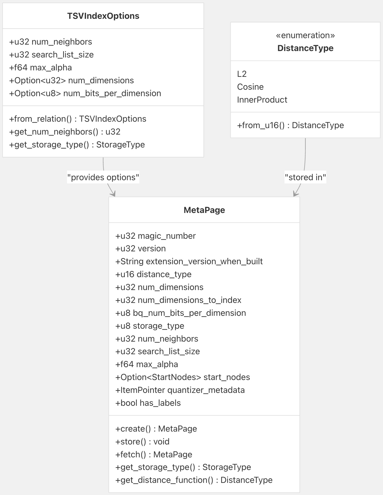
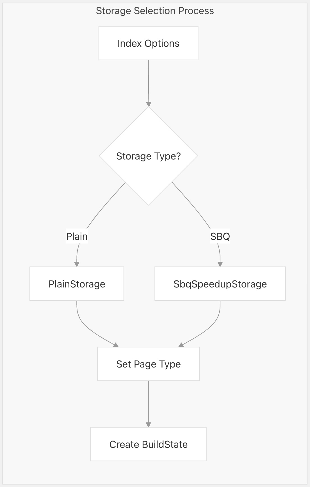
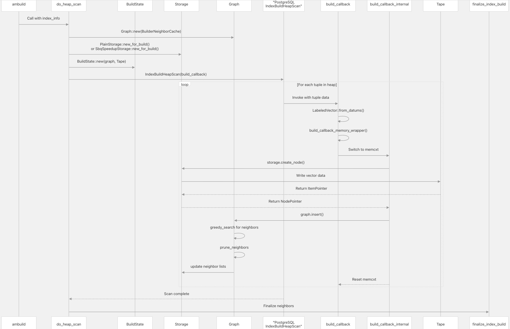
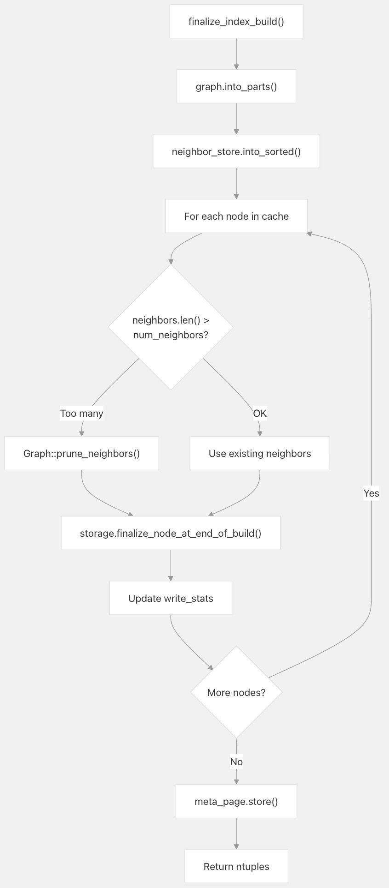

## pgvectorscale 源码学习: 3.1 索引构建 (Index Building)  
                
### 作者                
digoal                
                
### 日期                
2025-11-09                
                
### 标签                
pgvectorscale , 向量数据库 , DiskANN , StreamingDiskANN , 源码学习                
                
----                
                
## 背景    
本文介绍 **pgvectorscale** 中的索引构建过程，解释了向量相似性索引 (vector similarity index) 是如何构建的、涉及的算法，以及可用的不同存储类型。  
  
## 概览 (Overview)  
  
**pgvectorscale** 扩展构建了一个基于图的**近似最近邻 (ANN) 索引**，其灵感来源于 **DiskANN** 算法。当您使用 `CREATE INDEX` 命令并包含 `USING diskann` 子句创建索引时，PostgreSQL 会调用 **`ambuild`** 回调函数（位于 [`pgvectorscale/src/access_method/build.rs` 76-147](https://github.com/timescale/pgvectorscale/blob/36271fa5/pgvectorscale/src/access_method/build.rs#L76-L147)），该函数负责协调整个索引构建过程。  
  
**`ambuild`** 函数执行以下操作：  
  
1.  从 `TSVIndexOptions` 中提取索引选项。  
2.  通过调用距离类型过程确定**距离类型 (distance type)**。  
3.  使用索引配置创建**元页面 (MetaPage)**。  
4.  验证维度限制和存储兼容性。  
5.  可选择性地通过调用 `maybe_train_quantizer` 训练 **SBQ 量化器 (SBQ quantizer)**。  
6.  通过调用 **`do_heap_scan`** 构建图结构。  
7.  向 PostgreSQL 返回 **`IndexBuildResult`**。  
  
**索引构建流程（代码层面）**  
  
  
  
来源: [`pgvectorscale/src/access_method/build.rs` 76-147](https://github.com/timescale/pgvectorscale/blob/36271fa5/pgvectorscale/src/access_method/build.rs#L76-L147) [`pgvectorscale/src/access_method/build.rs` 282-322](https://github.com/timescale/pgvectorscale/blob/36271fa5/pgvectorscale/src/access_method/build.rs#L282-L322) [`pgvectorscale/src/access_method/build.rs` 324-399](https://github.com/timescale/pgvectorscale/blob/36271fa5/pgvectorscale/src/access_method/build.rs#L324-L399)  
  
## 元页面创建 (Meta Page Creation)  
  
**`ambuild`** 函数首先通过调用 `MetaPage::create()` 来创建**元页面 (MetaPage)**（位于 [`pgvectorscale/src/access_method/build.rs` 108-109](https://github.com/timescale/pgvectorscale/blob/36271fa5/pgvectorscale/src/access_method/build.rs#L108-L109)）。此元页面存储索引配置，并写入到索引关系 (index relation) 的块 **0** 中。  
  
**MetaPage 结构 (MetaPage Structure)**  
  
  
  
通过调用 `index_getprocinfo()` 来检索操作符类 (operator class) 注册的距离函数（位于 [`pgvectorscale/src/access_method/build.rs` 95-102](https://github.com/timescale/pgvectorscale/blob/36271fa5/pgvectorscale/src/access_method/build.rs#L95-L102)），从而确定距离类型。  
  
**验证规则 (Validation Rules)**  
  
创建元页面后，**`ambuild`** 还会验证几项约束：  
  
| 约束 (Constraint) | 验证 (Validation) | 错误信息 (Error Message) |  
| :--- | :--- | :--- |  
| 维度 \> 0 (Dimensions \> 0) | `meta_page.get_num_dimensions_to_index() == 0` | "No dimensions to index" (没有要建立索引的维度) |  
| 最大维度 (Max dimensions) | `> MAX_DIMENSION` (16000) | "Too many dimensions to index" (要建立索引的维度过多) |  
| 普通存储限制 (Plain storage limit) | `> MAX_DIMENSION_NO_SBQ` (2000) 且使用 **Plain** 存储 | "Too many dimensions...Use storage\_layout=memory\_optimized" (维度过多...请使用 `storage_layout=memory_optimized`) |  
| 内积与普通存储 (Inner product with Plain) | **`InnerProduct`** 且 **`Plain`** | "Inner product distance type is not supported with plain storage" (普通存储不支持内积距离类型) |  
| 标签与普通存储 (Labels with Plain) | `has_labels()` 且 **`Plain`** | "Labeled filtering is not supported with plain storage" (普通存储不支持标签过滤) |  
  
来源: [`pgvectorscale/src/access_method/build.rs` 108-130](https://github.com/timescale/pgvectorscale/blob/36271fa5/pgvectorscale/src/access_method/build.rs#L108-L130) [`pgvectorscale/src/access_method/build.rs` 69-73](https://github.com/timescale/pgvectorscale/blob/36271fa5/pgvectorscale/src/access_method/build.rs#L69-L73)  
  
## 存储类型 (Storage Types)  
  
**pgvectorscale** 支持两种存储实现：  
  
1.  **普通存储 (Plain Storage)**：未压缩的存储，以原始格式保存向量。它更简单，但占用更多空间。  
2.  **SBQ（统计二值量化）存储 (SBQ (Statistical Binary Quantization) Storage)**：一种压缩技术，可减少内存使用，对于高维向量尤其有益。  
  
存储类型的选择在创建索引时确定，并使用 **`storage_layout`** 参数指定：  
  
```sql  
CREATE INDEX ON my_table USING diskann(vector_column)  
WITH (storage_layout='memory_optimized');  -- Uses SBQ  
```  
  
  
  
来源: [`pgvectorscale/src/access_method/build.rs` 271-356](https://github.com/timescale/pgvectorscale/blob/36271fa5/pgvectorscale/src/access_method/build.rs#L271-L356)  
  
### 维度限制 (Dimension Limits)  
  
存储类型会影响支持的最大维度数：  
  
  * **普通存储 (Plain Storage)**：支持最多 **2,000** 个维度 (`MAX_DIMENSION_NO_SBQ`)  
  * **SBQ 存储 (SBQ Storage)**：支持最多 **16,000** 个维度 (`MAX_DIMENSION`)  
  
对于高维向量，需要使用 **SBQ 存储**：  
  
```rust  
if meta_page.get_num_dimensions_to_index() > MAX_DIMENSION_NO_SBQ  
    && meta_page.get_storage_type() == StorageType::Plain  
{  
    error!(  
        "Too many dimensions to index with plain storage (max is {}).  Use storage_layout=memory_optimized instead.",  
        MAX_DIMENSION_NO_SBQ  
    );  
}  
```  
  
来源: [`pgvectorscale/src/access_method/build.rs` 60-65](https://github.com/timescale/pgvectorscale/blob/36271fa5/pgvectorscale/src/access_method/build.rs#L60-L65) [`pgvectorscale/src/access_method/build.rs` 110-118](https://github.com/timescale/pgvectorscale/blob/36271fa5/pgvectorscale/src/access_method/build.rs#L110-L118)  
  
## SBQ 训练阶段 (SBQ Training Phase)  
  
当使用 **SBQ 存储**（即 `storage_layout='memory_optimized'`）时，**`ambuild`** 会在构建图之前调用 **`maybe_train_quantizer()`**（位于 [`pgvectorscale/src/access_method/build.rs` 133](https://github.com/timescale/pgvectorscale/blob/36271fa5/pgvectorscale/src/access_method/build.rs#L133-L133)）。此函数执行单独的**堆扫描 (heap scan)** 来收集训练样本。  
  
**训练过程 (Training Process)**  
  
  
  
训练阶段执行以下操作：  
  
1.  创建一个新的 **`SbqQuantizer`**（位于 [`pgvectorscale/src/access_method/build.rs` 296](https://github.com/timescale/pgvectorscale/blob/36271fa5/pgvectorscale/src/access_method/build.rs#L296-L296)）。  
2.  调用 `start_training()` 初始化采样。  
3.  使用 PostgreSQL 的 **`IndexBuildHeapScan()`** 执行完整的堆扫描（位于 [`pgvectorscale/src/access_method/build.rs` 305-311](https://github.com/timescale/pgvectorscale/blob/36271fa5/pgvectorscale/src/access_method/build.rs#L305-L311)）。  
4.  对于每个元组 (tuple)，**`build_callback_bq_train()`**（位于 [`pgvectorscale/src/access_method/build.rs` 459-472](https://github.com/timescale/pgvectorscale/blob/36271fa5/pgvectorscale/src/access_method/build.rs#L459-L472)）提取向量并将其添加为样本。  
5.  调用 `finish_training()` 计算量化器参数。  
6.  如果使用了均值 (means)，则通过 `SbqMeans::store()` 存储它们，并更新元页面的指针（位于 [`pgvectorscale/src/access_method/build.rs` 315-318](https://github.com/timescale/pgvectorscale/blob/36271fa5/pgvectorscale/src/access_method/build.rs#L315-L318)）。  
  
**进度报告 (Progress Reporting)**  
  
构建过程使用定义在 [`pgvectorscale/src/access_method/build.rs` 556-558](https://github.com/timescale/pgvectorscale/blob/36271fa5/pgvectorscale/src/access_method/build.rs#L556-L558) 的三个阶段向 PostgreSQL 报告进度：  
  
```rust  
const BUILD_PHASE_TRAINING: i64 = 0;          // "training quantizer"  
const BUILD_PHASE_BUILDING_GRAPH: i64 = 1;   // "building graph"  
const BUILD_PHASE_FINALIZING_GRAPH: i64 = 2; // "finalizing graph"  
```  
  
| 阶段值 (Phase Value) | 阶段名称 (Phase Name) | 描述 (Description) |  
| :--- | :--- | :--- |  
| **0** | **Training quantizer** | 正在收集样本并计算量化器参数 (SBQ only) |  
| **1** | **Building graph** | 正在插入向量并构建图结构 |  
| **2** | **Finalizing graph** | 正在将内存中的邻居列表写入磁盘 |  
  
这些信息通过 **`pgstat_progress_update_param()`** 报告，并由 **`ambuildphasename()`** 显示（位于 [`pgvectorscale/src/access_method/build.rs` 561-568](https://github.com/timescale/pgvectorscale/blob/36271fa5/pgvectorscale/src/access_method/build.rs#L561-L568)）。  
  
来源: [`pgvectorscale/src/access_method/build.rs` 282-322](https://github.com/timescale/pgvectorscale/blob/36271fa5/pgvectorscale/src/access_method/build.rs#L282-L322) [`pgvectorscale/src/access_method/build.rs` 459-472](https://github.com/timescale/pgvectorscale/blob/36271fa5/pgvectorscale/src/access_method/build.rs#L459-L472) [`pgvectorscale/src/access_method/build.rs` 556-568](https://github.com/timescale/pgvectorscale/blob/36271fa5/pgvectorscale/src/access_method/build.rs#L556-L568)  
  
## 图构建过程 (Graph Building Process)  
  
在可选的量化器训练之后，**`ambuild`** 调用 **`do_heap_scan()`**（位于 [`pgvectorscale/src/access_method/build.rs` 134-140](https://github.com/timescale/pgvectorscale/blob/36271fa5/pgvectorscale/src/access_method/build.rs#L134-L140)）来构建图结构。此函数创建存储实现，初始化一个 **`BuildState`**（构建状态），并执行堆扫描。  
  
**BuildState 结构 (BuildState Structure)**  
  
**`BuildState`**（位于 [`pgvectorscale/src/access_method/build.rs` 43-65](https://github.com/timescale/pgvectorscale/blob/36271fa5/pgvectorscale/src/access_method/build.rs#L43-L65)）在索引构建过程中维护状态：  
  
```rust  
struct BuildState<'a> {  
    memcxt: PgMemoryContexts,      // Memory context for temporary allocations  
    ntuples: usize,                 // Number of tuples processed  
    tape: Tape<'a>,                 // Sequential write abstraction over pages  
    graph: Graph<'a>,               // Graph structure with BuilderNeighborCache  
    started: Instant,               // Start time for performance tracking  
    stats: InsertStats,             // Distance comparisons, pruning stats  
}  
```  
  
| 字段 (Field) | 类型 (Type) | 描述 (Description) |  
| :--- | :--- | :--- |  
| `storage` | `StorageBuildState` | 存储实现（Plain 或 SBQ） |  
| `graph` | `GraphBuildState` | 内存中的图结构和邻居缓存 |  
| `stats` | `InsertStats` | 跟踪距离比较和操作的统计信息 |  
| `tupcount` | `u64` | 处理的元组总数 |  
| `mem_context` | `PgMemoryContext` | 用于每个元组处理的专用内存上下文 |  
  
**图构建流程 (Graph Building Flow)**  
  
  
  
**每个元组的处理 (Per-Tuple Processing)**  
  
对于每个元组，**`build_callback()`**（位于 [`pgvectorscale/src/access_method/build.rs` 475-500](https://github.com/timescale/pgvectorscale/blob/36271fa5/pgvectorscale/src/access_method/build.rs#L475-L500)）执行以下操作：  
  
1.  提取代表元组在堆中位置的 **`ItemPointer`** (**`ctid`**)。  
2.  通过 **`LabeledVector::from_datums()`** 将 **`datums`** 转换为 **`LabeledVector`**（位于 [`pgvectorscale/src/access_method/build.rs` 488-489](https://github.com/timescale/pgvectorscale/blob/36271fa5/pgvectorscale/src/access_method/build.rs#L488-L489)）。  
3.  调用 **`build_callback_memory_wrapper()`**，该函数切换到专用的**内存上下文 (memory context)**。  
4.  在 **`build_callback_internal()`** 中（位于 [`pgvectorscale/src/access_method/build.rs` 519-554](https://github.com/timescale/pgvectorscale/blob/36271fa5/pgvectorscale/src/access_method/build.rs#L519-L554)）：  
      * 创建存储节点：`storage.create_node()` 将向量写入 **`Tape`** 抽象，并返回一个指向索引节点 (index node) 的 **`ItemPointer`**。  
      * 插入到图 (Graph) 中：`graph.insert()` 执行贪婪搜索 (greedy search) 以查找邻居，修剪邻居列表，并更新**双向边 (bidirectional edges)**。  
      * 更新统计信息并每 1000 个元组记录一次进度。  
  
**内存上下文管理 (Memory Context Management)**  
  
每个元组都在一个专用的内存上下文（位于 [`pgvectorscale/src/access_method/build.rs` 503-516](https://github.com/timescale/pgvectorscale/blob/36271fa5/pgvectorscale/src/access_method/build.rs#L503-L516)）中处理：  
  
```rust  
unsafe fn build_callback_memory_wrapper<S: Storage>(...) {  
    let mut old_context = state.memcxt.set_as_current();  
    build_callback_internal(index, heap_pointer, vector, state, storage);  
    old_context.set_as_current();  
    state.memcxt.reset();  // Frees temporary allocations  
}  
```  
  
这可以防止在潜在的长时间运行的索引构建过程中发生**内存泄漏 (memory leaks)**。  
  
来源: [`pgvectorscale/src/access_method/build.rs` 324-399](https://github.com/timescale/pgvectorscale/blob/36271fa5/pgvectorscale/src/access_method/build.rs#L324-L399) [`pgvectorscale/src/access_method/build.rs` 43-65](https://github.com/timescale/pgvectorscale/blob/36271fa5/pgvectorscale/src/access_method/build.rs#L43-L65) [`pgvectorscale/src/access_method/build.rs` 475-554](https://github.com/timescale/pgvectorscale/blob/36271fa5/pgvectorscale/src/access_method/build.rs#L475-L554)  
  
### 特定存储的构建路径 (Storage-Specific Build Paths)  
  
**`do_heap_scan()`** 函数根据元页面的存储类型创建不同的存储实现：  
  
**普通存储路径 (Plain Storage Path)** (lines 346-363):  
  
```rust  
StorageType::Plain => {  
    let mut plain = PlainStorage::new_for_build(index_relation, heap_relation, meta_page);  
    let page_type = PlainStorage::page_type();  // Returns PLAIN_NODE  
    let mut bs = BuildState::new(index_relation, graph, page_type);  
    let mut state = StorageBuildState::Plain(&mut plain, &mut bs);  
      
    unsafe {  
        pg_sys::IndexBuildHeapScan(  
            heap_relation.as_ptr(),  
            index_relation.as_ptr(),  
            index_info,  
            Some(build_callback),  // C callback function pointer  
            &mut state,  
        );  
    }  
      
    finalize_index_build(&mut plain, bs, index_relation, write_stats)  
}  
```  
  
**SBQ 存储路径 (SBQ Storage Path)** (lines 365-397):  
  
```rust  
StorageType::SbqCompression => {  
    let mut bq = unsafe {  
        SbqSpeedupStorage::new_for_build(index_relation, heap_relation, meta_page, &mut write_stats)  
    };  
    let page_type = SbqSpeedupStorage::page_type();  // Returns SBQ_NODE  
    let mut bs = BuildState::new(index_relation, graph, page_type);  
    let mut state = StorageBuildState::SbqSpeedup(&mut bq, &mut bs);  
      
    unsafe {  
        pg_sys::IndexBuildHeapScan(...);  
    }  
      
    unsafe {  
        pgstat_progress_update_param(PROGRESS_CREATE_IDX_SUBPHASE, BUILD_PHASE_FINALIZING_GRAPH);  
    }  
      
    finalize_index_build(&mut bq, bs, index_relation, write_stats)  
}  
```  
  
**`StorageBuildState`** **枚举 (enum)**（位于 [`pgvectorscale/src/access_method/build.rs` 38-41](https://github.com/timescale/pgvectorscale/blob/36271fa5/pgvectorscale/src/access_method/build.rs#L38-L41)）封装了存储和构建状态，以便传递给回调函数：  
  
```rust  
enum StorageBuildState<'a, 'b, 'c, 'd> {  
    SbqSpeedup(&'a mut SbqSpeedupStorage<'b>, &'c mut BuildState<'d>),  
    Plain(&'a mut PlainStorage<'b>, &'c mut BuildState<'d>),  
}  
```  
  
来源: [`pgvectorscale/src/access_method/build.rs` 346-397](https://github.com/timescale/pgvectorscale/blob/36271fa5/pgvectorscale/src/access_method/build.rs#L346-L397) [`pgvectorscale/src/access_method/build.rs` 38-41](https://github.com/timescale/pgvectorscale/blob/36271fa5/pgvectorscale/src/access_method/build.rs#L38-L41)  
  
## 图终结 (Graph Finalization)  
  
堆扫描完成后，**`do_heap_scan()`** 调用 **`finalize_index_build()`**（位于 [`pgvectorscale/src/access_method/build.rs` 401-456](https://github.com/timescale/pgvectorscale/blob/36271fa5/pgvectorscale/src/access_method/build.rs#L401-L456)）将最终的邻居列表写入磁盘。  
  
**终结过程 (Finalization Process)**  
  
  
  
在构建阶段，邻居存储在一个 **`BuilderNeighborCache`**（构建器邻居缓存）中，这是一个临时保存邻居列表的内存缓存。终结过程执行以下操作：  
  
1.  **提取缓存条目 (Extract Cache Entries)**：`graph.into_parts()` 返回 **`GraphNeighborStore`**，然后 `into_sorted()` 将缓存转换为 **`(IndexPointer, CacheEntry)`** 对的排序向量（位于 [`pgvectorscale/src/access_method/build.rs` 407-409](https://github.com/timescale/pgvectorscale/blob/36271fa5/pgvectorscale/src/access_method/build.rs#L407-L409)）。  
2.  **必要时修剪 (Prune if Necessary)**：对于每个节点，如果邻居数量超过 **`num_neighbors`**，则调用 **`Graph::prune_neighbors()`**（位于 [`pgvectorscale/src/access_method/build.rs` 415-423](https://github.com/timescale/pgvectorscale/blob/36271fa5/pgvectorscale/src/access_method/build.rs#L415-L423)）。  
    ```rust  
    if entry.neighbors.len() > meta_page.get_num_neighbors() as _ {  
        prune_neighbors = Graph::prune_neighbors(  
            meta_page.get_max_alpha(),  
            meta_page.get_num_neighbors() as _,  
            entry.labels.as_ref(),  
            entry.neighbors,  
            storage,  
            &mut write_stats.prune_stats,  
        );  
        prune_neighbors  
    }  
    ```  
3.  **写入存储 (Write to Storage)**：调用 **`storage.finalize_node_at_end_of_build()`**（位于 [`pgvectorscale/src/access_method/build.rs` 429-433](https://github.com/timescale/pgvectorscale/blob/36271fa5/pgvectorscale/src/access_method/build.rs#L429-L433)）将邻居列表写入节点的页面 (page)。  
4.  **更新元页面 (Update Meta Page)**：存储更新后的元页面（包括**起始节点 (start nodes)**）（位于 [`pgvectorscale/src/access_method/build.rs` 435-437](https://github.com/timescale/pgvectorscale/blob/36271fa5/pgvectorscale/src/access_method/build.rs#L435-L437)）。  
  
**统计信息报告 (Statistics Reporting)**  
  
该函数在 [`pgvectorscale/src/access_method/build.rs` 441-452](https://github.com/timescale/pgvectorscale/blob/36271fa5/pgvectorscale/src/access_method/build.rs#L441-L452) 跟踪并报告统计信息：  
  
```rust  
let writing_took = Instant::now().duration_since(write_stats.started).as_secs_f64();  
if write_stats.num_nodes > 0 {  
    debug1!(  
        "Writing took {}s or {}s/tuple.  Avg neighbors: {}",  
        writing_took,  
        writing_took / write_stats.num_nodes as f64,  
        write_stats.num_neighbors / write_stats.num_nodes  
    );  
}  
notice!("Indexed {} tuples", ntuples);  
```  
  
来源: [`pgvectorscale/src/access_method/build.rs` 401-456](https://github.com/timescale/pgvectorscale/blob/36271fa5/pgvectorscale/src/access_method/build.rs#L401-L456)  
  
## 内存管理与统计 (Memory Management and Statistics)  
  
**内存上下文隔离 (Memory Context Isolation)**  
  
**pgvectorscale** 使用专用的内存上下文来构建索引，该上下文是在 **`BuildState::new()`** 中创建的（位于 [`pgvectorscale/src/access_method/build.rs` 57](https://github.com/timescale/pgvectorscale/blob/36271fa5/pgvectorscale/src/access_method/build.rs#L57-L57)）：  
  
```rust  
BuildState {  
    memcxt: PgMemoryContexts::new("diskann build context"),  
    ...  
}  
```  
  
此上下文在每个元组的处理过程中被激活和重置（位于 [`pgvectorscale/src/access_method/build.rs` 510-515](https://github.com/timescale/pgvectorscale/blob/36271fa5/pgvectorscale/src/access_method/build.rs#L510-L515)）：  
  
```rust  
let mut old_context = state.memcxt.set_as_current();  
build_callback_internal(index, heap_pointer, vector, state, storage);  
old_context.set_as_current();  
state.memcxt.reset();  // Frees all temporary allocations  
```  
  
这通过确保临时分配（例如，搜索过程中的邻居列表）在处理完每个元组后被释放，从而防止在潜在的长时间运行的索引构建过程中发生内存泄漏。  
  
**进度日志记录 (Progress Logging)**  
  
每隔 1000 个元组，系统会记录详细的**统计信息 (statistics)**（位于 [`pgvectorscale/src/access_method/build.rs` 530-540](https://github.com/timescale/pgvectorscale/blob/36271fa5/pgvectorscale/src/access_method/build.rs#L530-L540)）：  
  
```rust  
if state.ntuples % 1000 == 0 {  
    debug1!(  
        "Processed {} tuples in {}s which is {}s/tuple. Dist/tuple: Prune: {} search: {}. Stats: {:?}",  
        state.ntuples,  
        Instant::now().duration_since(state.started).as_secs_f64(),  
        (Instant::now().duration_since(state.started) / state.ntuples as u32).as_secs_f64(),  
        state.stats.prune_neighbor_stats.distance_comparisons / state.ntuples,  
        state.stats.greedy_search_stats.get_total_distance_comparisons() / state.ntuples,  
        state.stats,  
    );  
}  
```  
  
**InsertStats 结构 (InsertStats Structure)**  
  
**`InsertStats`** 结构（位于 [`pgvectorscale/src/access_method/build.rs` 49](https://github.com/timescale/pgvectorscale/blob/36271fa5/pgvectorscale/src/access_method/build.rs#L49-L49)）跟踪以下内容：  
  
| 统计项 (Statistic) | 描述 (Description) |  
| :--- | :--- |  
| `prune_neighbor_stats.distance_comparisons` | 邻居修剪期间的**距离比较 (Distance comparisons)** |  
| `greedy_search_stats` | 邻居搜索期间的距离比较 |  
| `quantizer_stats` | 量化器操作的节点读/写次数 |  
  
这些统计信息有助于识别性能瓶颈，并验证索引构建是否高效进行。  
  
来源: [`pgvectorscale/src/access_method/build.rs` 43-65](https://github.com/timescale/pgvectorscale/blob/36271fa5/pgvectorscale/src/access_method/build.rs#L43-L65) [`pgvectorscale/src/access_method/build.rs` 510-515](https://github.com/timescale/pgvectorscale/blob/36271fa5/pgvectorscale/src/access_method/build.rs#L510-L515) [`pgvectorscale/src/access_method/build.rs` 530-540](https://github.com/timescale/pgvectorscale/blob/36271fa5/pgvectorscale/src/access_method/build.rs#L530-L540)  
  
## 性能考虑 (Performance Considerations)  
  
**内存配置 (Memory Configuration)**  
  
索引构建使用 PostgreSQL 的 **`maintenance_work_mem`** 设置来控制内存使用。该设置在 [`pgvectorscale/src/access_method/build.rs` 278-280](https://github.com/timescale/pgvectorscale/blob/36271fa5/pgvectorscale/src/access_method/build.rs#L278-L280) 被访问：  
  
```rust  
pub fn maintenance_work_mem_bytes() -> usize {  
    unsafe { pg_sys::maintenance_work_mem as usize * 1024 }  
}  
```  
  
该内存分配给：  
  
  * **BuilderNeighborCache（构建器邻居缓存）**：**80%** (`BUILDER_NEIGHBOR_CACHE_SIZE = 0.8`)，用于在构建过程中缓存邻居列表。  
  * **QuantizedVectorCache（量化向量缓存）**：**20%** (`QUANTIZED_VECTOR_CACHE_SIZE = 0.2`)，用于 **SBQ 存储**以缓存量化向量。  
  
这些常量定义在 [`pgvectorscale/src/access_method/build.rs` 275-276](https://github.com/timescale/pgvectorscale/blob/36271fa5/pgvectorscale/src/access_method/build.rs#L275-L276)。  
  
**构建性能特征 (Build Performance Characteristics)**  
  
| 方面 (Aspect) | 详情 (Details) |  
| :--- | :--- |  
| **堆扫描 (Heap Scans)** | 一次用于训练（仅限 SBQ），一次用于构建 |  
| **距离比较 (Distance Comparisons)** | 与 `search_list_size` × 向量数量成比例 |  
| **每个向量的内存 (Memory per Vector)** | 取决于维度和存储类型 |  
| **磁盘写入 (Disk Writes)** | 通过 **`Tape`** 抽象进行顺序写入 |  
| **邻居缓存 (Neighbor Cache)** | 终结前在内存中，然后刷新到磁盘 |  
  
**构建时间复杂度 (Build Time Complexity)**  
  
对于具有维度 **D** 的 **N** 个向量：  
  
  * **训练阶段 (Training phase)**（仅限 SBQ）：采样和计算量化器参数的复杂度为 **O(N × D)**。  
  * **图构建 (Graph construction)**：邻居搜索的复杂度为 **O(N × search\_list\_size × D)**。  
  * **终结 (Finalization)**：写入邻居列表的复杂度为 **O(N × num\_neighbors)**。  
  
**优化策略 (Optimization Strategies)**  
  
1.  **增加 `maintenance_work_mem`**：允许更大的邻居缓存，减少构建期间的磁盘 I/O。  
2.  **减小 `search_list_size`**：构建速度更快，但**召回率 (recall)** 可能更低。  
3.  **高维使用 SBQ**：减少内存占用并支持 \>2000 个维度。  
4.  **批量插入 (Batch inserts)**：在批量加载数据后构建索引，而不是在单独的 **`INSERT`** 操作期间构建。  
  
**进度可见性 (Progress Visibility)**  
  
使用 **`pg_stat_progress_create_index`** 监控构建进度：  
  
```sql  
SELECT phase, blocks_done, blocks_total   
FROM pg_stat_progress_create_index   
WHERE relid = 'my_index'::regclass;  
```  
  
`phase` 列根据 [`pgvectorscale/src/access_method/build.rs` 556-558](https://github.com/timescale/pgvectorscale/blob/36271fa5/pgvectorscale/src/access_method/build.rs#L556-L558) 的常量，显示 "**training quantizer**"（正在训练量化器）、"**building graph**"（正在构建图）或 "**finalizing graph**"（正在终结图）。  
  
来源: [`pgvectorscale/src/access_method/build.rs` 275-280](https://github.com/timescale/pgvectorscale/blob/36271fa5/pgvectorscale/src/access_method/build.rs#L275-L280) [`pgvectorscale/src/access_method/build.rs` 556-568](https://github.com/timescale/pgvectorscale/blob/36271fa5/pgvectorscale/src/access_method/build.rs#L556-L568)  
  
## 总结 (Summary)  
  
**pgvectorscale** 中的索引构建过程创建了一个基于图的**近似最近邻 (ANN) 索引**，它平衡了搜索精度和性能。该过程包括：  
  
1.  创建带有索引配置的**元页面 (MetaPage)**。  
2.  选择并初始化适当的**存储实现 (storage implementation)**。  
3.  对于 **SBQ 存储**，训练**量化器 (quantizer)**。  
4.  通过处理每个向量来构建图。  
5.  通过修剪邻居来优化结构，从而**终结图 (finalize the graph)**。  
  
生成的索引能够使用索引扫描 (Index Scanning)章节中描述的算法进行高效的向量相似性搜索。  
  
# 附录1: 如果进行binary量化, sbq训练量化是不是类似于找出所有tuple每个维度上的中位数, 根据中位数来判断是量化为0还是1?  
  
您询问的是关于 SBQ (Statistical Binary Quantization) 训练过程中的量化方法,具体是否类似于找出每个维度的中位数来决定量化为 0 或 1。   
  
## 回答  
  
**不是简单的中位数方法**。SBQ 的训练过程更复杂,它使用聚类(clustering)来找到代表性的质心(centroids),而不是简单地计算每个维度的中位数。  
  
### SBQ 训练流程  
  
在索引构建期间,SBQ 量化器的训练通过以下步骤进行:   
  
1. **采样阶段**: 系统会扫描堆表并收集向量样本   
  
2. **训练量化器**: 使用 `SbqQuantizer` 对采样的向量进行训练   
  
3. **存储质心**: 训练完成后,如果使用均值(means),会将 `SbqMeans` 存储到索引中   
  
### 量化过程  
  
在实际量化新向量时,系统使用训练好的量化器:   
  
这个 `vector_for_new_node` 方法会根据训练得到的聚类质心来量化向量,而不是简单地与中位数比较。  
  
### 配置参数  
  
SBQ 支持每个维度使用 1 或 2 位进行编码:   
  
- 对于少于 900 维的向量,默认使用 2 位  
- 否则使用 1 位  
  
这意味着量化不仅仅是二进制的 0/1,在 2 位模式下可以有 4 个不同的量化级别。  
  
## Notes  
  
SBQ (Statistical Binary Quantization) 是 Timescale 研究人员开发的一种改进的二进制量化方法, 它通过聚类和质心来实现更精确的量化, 而不是简单的中位数阈值方法。 这种方法在保持高召回率的同时实现了 8-16 倍的压缩率。   
  
# 附录2: 在 SBQ 量化中, 如果每个维度只有一个值(即单个标量), 如何将其映射到更小的精度范围。  
  
在 SBQ 量化中, 即使每个维度只有一个值, 量化过程仍然依赖于**训练阶段学到的聚类质心(centroids)**来进行映射。   
  
### 量化映射过程  
  
当使用 SBQ 对向量进行量化时,系统调用 `vector_for_new_node` 方法:   
  
这个方法使用训练好的 `SbqQuantizer` 来执行量化。量化器会将每个维度的浮点值与预先计算的质心进行比较,然后根据最近的质心将其编码为 1 位或 2 位的整数值。   
  
### 位数配置  
  
根据配置,每个维度可以使用不同的位数:    
  
- **1 位编码**: 将浮点值映射到 {0, 1} 两个级别  
- **2 位编码**: 将浮点值映射到 {0, 1, 2, 3} 四个级别  
  
这个位数存储在 `bq_num_bits_per_dimension` 字段中。   
  
### 训练阶段的质心学习  
  
在索引构建时,量化器通过采样向量进行训练:    
  
训练过程中,`SbqQuantizer` 会对每个维度进行聚类,找出代表性的质心值。 这些质心随后被存储在 `SbqMeans` 结构中,用于后续的量化操作。   
  
### 实际映射逻辑  
  
对于单个维度值,映射过程如下:  
1. 将该维度的浮点值与该维度的所有质心进行比较  
2. 找到最近的质心  
3. 将质心的索引(0, 1 或 0, 1, 2, 3)作为量化后的值  
  
这样,原始的 32 位浮点数就被压缩为 1-2 位的整数,实现了显著的空间节省。   
  
## Notes  
  
SBQ 的核心思想是通过聚类学习每个维度的最优分割点,而不是使用固定的阈值(如中位数)。 这种方法能够更好地适应数据分布,在压缩率和准确性之间取得更好的平衡。量化后的向量存储在 `SbqNode` 中,占用的空间远小于原始向量。   
  
# 附录3: 量化例子  
  
您想要一个具体的 SBQ 量化例子。让我用实际的代码和数值来说明这个过程。  
  
## 1 位量化示例  
  
假设我们有一个 3 维向量需要量化:  
  
**原始向量**: `[0.75, -0.21, 0.35]`  
  
### 训练阶段  
  
在训练阶段,系统通过 `build_callback_bq_train` 收集样本向量。假设训练后,`SbqQuantizer` 为每个维度计算出的均值(means)为:  
  
- 维度 0 的均值: `0.2`  
- 维度 1 的均值: `-0.3`    
- 维度 2 的均值: `0.1`  
  
这些均值存储在 `SbqMeans` 中。  
  
### 量化过程  
  
当量化新向量时,`vector_for_new_node` 方法会将每个维度的值与其均值比较:  
  
- **维度 0**: `0.75 > 0.2` → 量化为 `1`  
- **维度 1**: `-0.21 > -0.3` → 量化为 `1`    
- **维度 2**: `0.35 > 0.1` → 量化为 `1`  
  
**量化结果**: `[1, 1, 1]` (二进制表示)  
  
### 存储  
  
这 3 位被打包存储在 `u64` 数组中,作为 `bq_vector` 字段。对于 3 维向量,只需要 3 位,远小于原始的 96 位(3 × 32 位浮点数)。  
  
## 2 位量化示例  
  
对于少于 900 维的向量,默认使用 2 位编码。  
  
假设同样的向量 `[0.75, -0.21, 0.35]`,训练后每个维度有 4 个质心:  
  
**维度 0 的质心**: `[-0.5, 0.0, 0.5, 1.0]`  
  
对于值 `0.75`:  
- 距离 `-0.5`: `1.25`  
- 距离 `0.0`: `0.75`  
- 距离 `0.5`: `0.25` ← **最近**  
- 距离 `1.0`: `0.25` ← **最近**  
  
选择索引 2,量化为 `10` (二进制)  
  
这样,2 位编码提供了 4 个量化级别 `{00, 01, 10, 11}`,比 1 位编码更精确,但仍然实现了 16:1 的压缩比。  
  
## 距离计算  
  
量化后,距离计算使用 XOR 操作。例如,比较两个量化向量 `[1,1,1]` 和 `[1,0,1]`:  
  
```  
1 XOR 1 = 0  
1 XOR 0 = 1    
1 XOR 1 = 0  
```  
  
汉明距离 = 1(只有 1 位不同)   
  
## Notes  
  
实际的量化逻辑在 `SbqQuantizer` 中实现,具体的聚类算法和质心计算细节在量化器的训练方法中。这个例子展示了 SBQ 如何通过学习数据分布的统计特性(均值或多个质心)来实现高效压缩,而不是使用简单的全局阈值。  
  
# 附录4: 量化算法总结  
  
量化为 N 位时,每个维度需要 **2^N 个质心**。   
  
### 质心数量与位数的关系  
  
根据代码中的配置 ,SBQ 支持两种位数配置:  
  
- **1 位编码**: 每个维度有 **2^1 = 2 个质心** (对应量化值 0 和 1)  
- **2 位编码**: 每个维度有 **2^2 = 4 个质心** (对应量化值 0, 1, 2, 3)  
  
### 为什么是 2^N 个质心?  
  
因为 N 位可以表示 2^N 种不同的状态。量化过程是将连续的浮点值映射到这 2^N 个离散的质心之一。  
  
### 实际配置  
  
在 `MetaPage` 中,`bq_num_bits_per_dimension` 字段 存储每个维度使用的位数。  
  
索引选项中也定义了这个参数,并且可以通过 `num_bits_per_dimension` 参数在创建索引时配置。  
  
### 示例  
  
- 如果设置 `num_bits_per_dimension = 1`,每个维度训练 **2 个质心**  
- 如果设置 `num_bits_per_dimension = 2`,每个维度训练 **4 个质心**    
- 如果设置 `num_bits_per_dimension = 3`,每个维度训练 **8 个质心**  
  
## Notes  
  
当前实现中,`num_bits_per_dimension` 的有效值主要是 1 和 2 。虽然参数定义允许最多 32 位 ,但实际使用中主要是 1 位和 2 位编码,因为更高的位数会降低压缩效果。  
  
# 附录5: 这种量化不适合什么类型的向量距离搜索. 例如原始值发生变化后, 向量距离的计算结果将发生巨大变化, 且影响以向量距离为排序的结果  
SBQ 量化不适合哪些类型的向量距离搜索场景? 特别是当原始值变化会导致距离计算发生巨大变化的情况。   
  
SBQ 量化**不适合对距离精确度要求极高的场景**, 特别是以下几种情况:   
  
### 1. 内积距离 (Inner Product) 与 Plain Storage 的组合  
  
代码明确禁止了这种组合。内积距离对量化误差特别敏感, 因为它不像余弦距离那样有归一化, 原始值的微小变化会被放大。  
  
### 2. 高维向量 (>2000 维) 必须使用 SBQ  
  
对于超过 2000 维的向量, 系统强制要求使用 SBQ 压缩。这意味着如果您的应用对距离精度要求极高且向量维度很高, 可能会遇到问题。  
  
### 3. 需要精确排序的场景  
  
SBQ 使用 XOR 操作计算汉明距离。这种近似距离可能导致:  
  
- **排序不稳定**: 两个在原始空间中距离相近的向量,量化后可能产生较大的汉明距离差异  
- **距离反转**: 原本距离为 d1 < d2 的两对向量,量化后可能变成 d1' > d2'  
  
### 4. 缓解措施: Rescore 机制  
  
系统提供了 `query_rescore` 参数来缓解这个问题。  
  
Rescore 的工作原理:  
1. 使用 SBQ 近似距离快速找到候选结果  
2. 从堆表读取完整的原始向量    
3. 用精确距离重新计算和排序  
  
这样可以在保持查询速度的同时提高结果准确性。   
  
### 5. 配置建议  
  
如果您的场景对距离精度敏感,可以:  
  
**选项 1**: 使用 Plain Storage (≤2000 维)  
```sql  
CREATE INDEX idx ON table USING diskann (embedding)  
WITH (storage_layout = 'plain');  
```  
  
**选项 2**: 增加 rescore 数量  
```sql  
SET diskann.query_rescore = 100;  -- 默认是 50  
```  
  
**选项 3**: 使用 2 位量化而非 1 位  
```sql  
CREATE INDEX idx ON table USING diskann (embedding)  
WITH (num_bits_per_dimension = 2);  
```  
  
2 位量化提供 4 个级别,比 1 位的 2 个级别更精确  。   
  
## Notes  
  
SBQ 的设计目标是在**召回率 (recall)** 和**性能**之间取得平衡,而不是追求完美的距离精度。 根据 README 的基准测试,在 99% 召回率下,pgvectorscale 仍能提供 28 倍的延迟改进 。 这意味着虽然个别结果的排序可能略有偏差,但整体的 top-k 结果集质量是有保证的。  
  
如果您的应用需要**绝对精确的距离排序**(例如金融风控、医疗诊断等关键场景),建议使用 Plain Storage 或者将 SBQ 仅用于初筛,然后用精确距离进行最终排序。  
  
  
  
  
  
    
#### [PolarDB 学习图谱](https://www.aliyun.com/database/openpolardb/activity "8642f60e04ed0c814bf9cb9677976bd4")
  
  
#### [PostgreSQL 解决方案集合](../201706/20170601_02.md "40cff096e9ed7122c512b35d8561d9c8")
  
  
#### [德哥 / digoal's Github - 公益是一辈子的事.](https://github.com/digoal/blog/blob/master/README.md "22709685feb7cab07d30f30387f0a9ae")
  
  
#### [About 德哥](https://github.com/digoal/blog/blob/master/me/readme.md "a37735981e7704886ffd590565582dd0")
  
  

  
