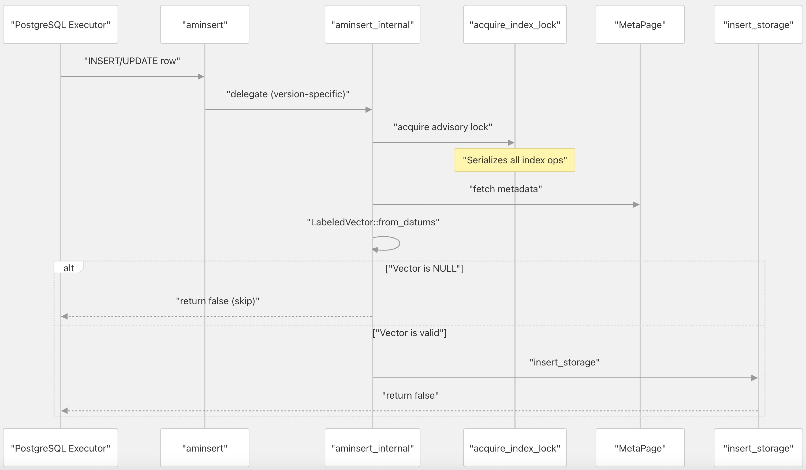
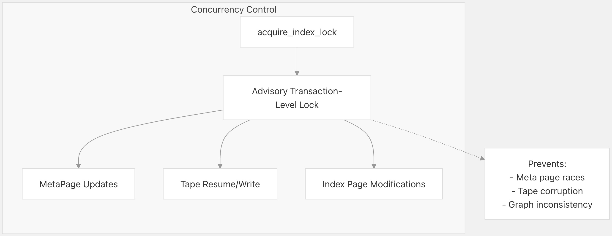
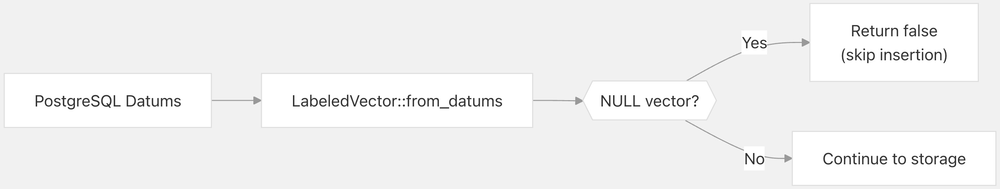
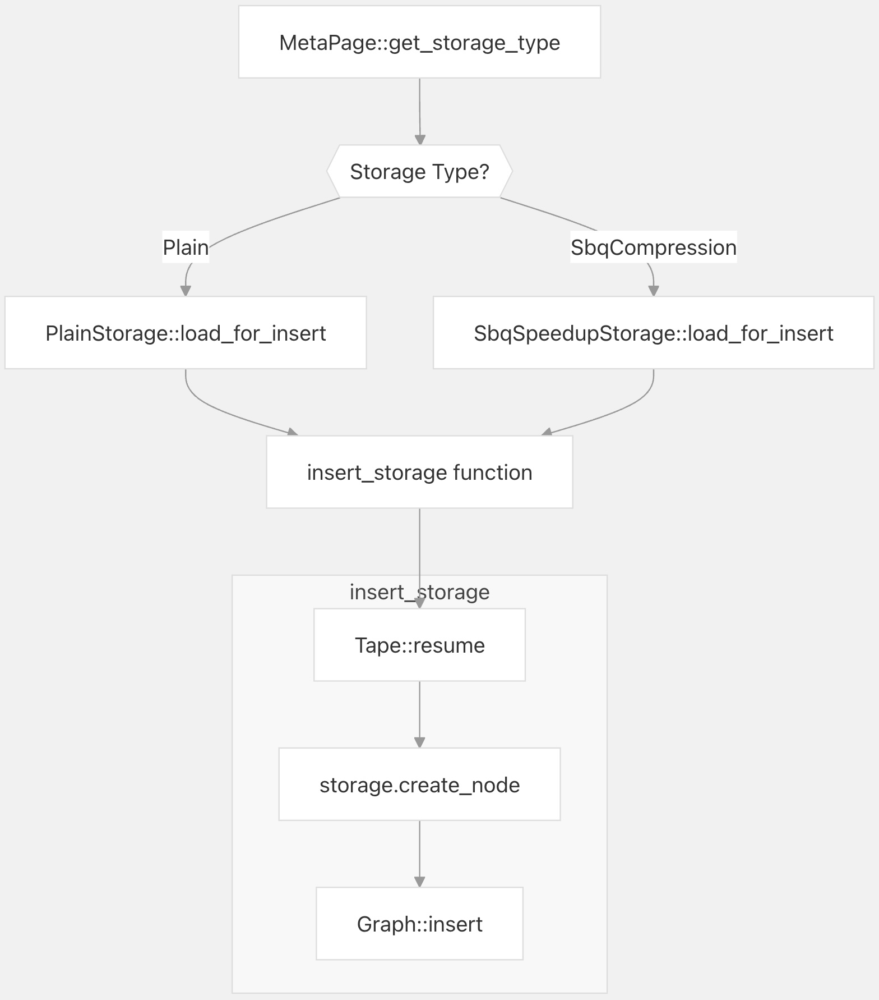
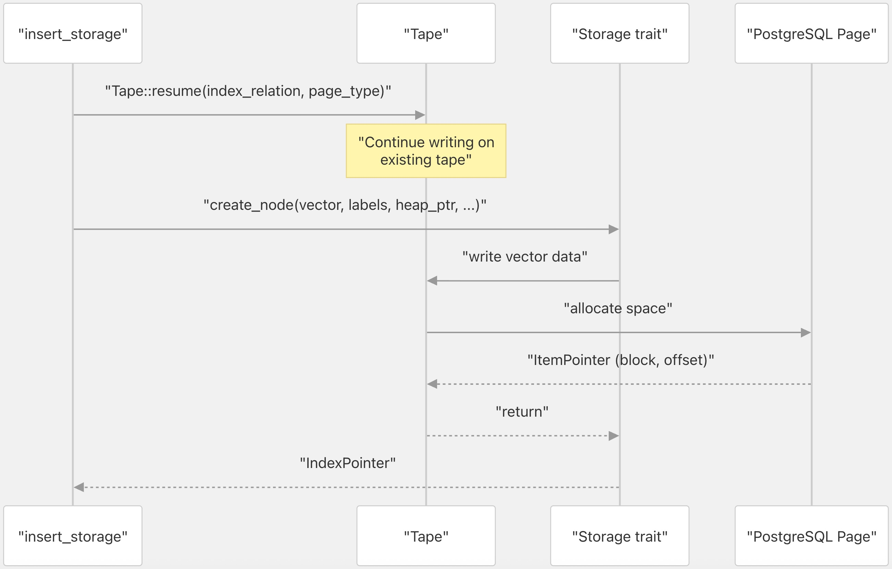
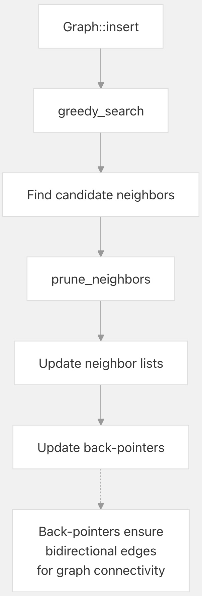
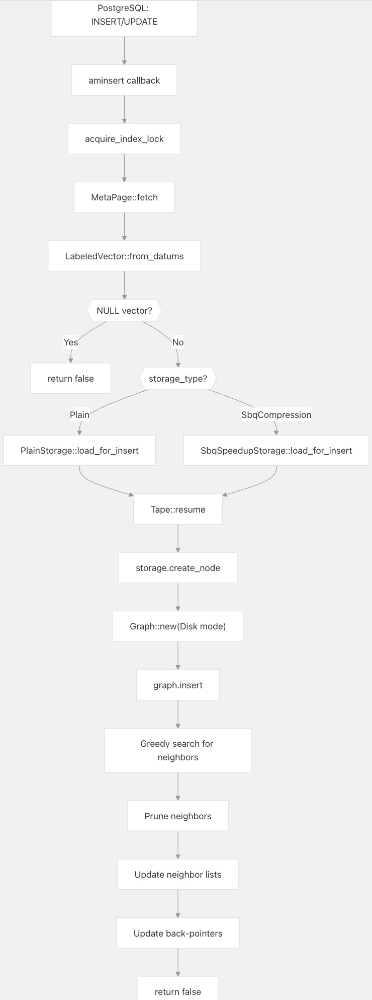

## pgvectorscale 源码学习: 3.2 索引插入 (Index Insertion)  
                  
### 作者                  
digoal                  
                  
### 日期                  
2025-11-09                  
                  
### 标签                  
pgvectorscale , 向量数据库 , DiskANN , StreamingDiskANN , 源码学习                  
                  
----                  
                  
## 背景     
本文介绍了 `pgvectorscale` 如何通过 `aminsert` **访问方法回调 (access method callback)** 将新**向量 (vectors)** 插入到现有的 **StreamingDiskANN 索引 (StreamingDiskANN index)** 中。当用户对带有 **DiskANN 索引 (DiskANN indexes)** 的表执行 `INSERT` 或 `UPDATE` 语句时，就会发生此过程。  
  
## **概述 (Overview)**  
  
索引插入通过以下步骤将新向量添加到现有索引中：  
  
1.  获取**咨询锁 (advisory lock)** 以**串行化 (serialize)** 所有索引操作。  
2.  加载**索引元数据 (index metadata)** 并确定**存储类型 (storage type)**。  
3.  为新向量创建**存储节点 (storage node)**。  
4.  将节点插入到 **DiskANN 图结构 (DiskANN graph structure)** 中。  
5.  更新**双向边 (bidirectional edges)**（**反向指针** 或 **back-pointers**）以维护图的**连通性 (connectivity)**。  
  
与批量处理所有向量并按顺序写入数据的**索引构建 (index building)** 不同，插入必须使用现有索引并恢复在现有**磁带结构 (tape structures)** 上的写入。  
  
**来源:** [`pgvectorscale/src/access_method/build.rs` 156-266](https://github.com/timescale/pgvectorscale/blob/36271fa5/pgvectorscale/src/access_method/build.rs#L156-L266)  
  
## **入口点: `aminsert` 回调 (Callback)**  
  
  
  
`aminsert` 函数充当 PostgreSQL 的**访问方法回调 (access method callback)**，用于索引插入。由于 PostgreSQL **API (Application Programming Interface)** 的差异，存在两个版本：  
  
  * **PG13**: [`pgvectorscale/src/access_method/build.rs` 171-183](https://github.com/timescale/pgvectorscale/blob/36271fa5/pgvectorscale/src/access_method/build.rs#L171-L183)  
  * **PG14+**: [`pgvectorscale/src/access_method/build.rs` 156-169](https://github.com/timescale/pgvectorscale/blob/36271fa5/pgvectorscale/src/access_method/build.rs#L156-L169)  
  
这两个版本都委托给 `aminsert_internal`，其中包含核心插入逻辑。  
  
**来源:** [`pgvectorscale/src/access_method/build.rs` 156-243](https://github.com/timescale/pgvectorscale/blob/36271fa5/pgvectorscale/src/access_method/build.rs#L156-L243)  
  
## **锁定策略 (Locking Strategy)**  
  
  
  
插入过程对索引获取**咨询事务级锁 (advisory transaction-level lock)**，以**串行化 (serialize)** 所有索引操作：  
  
```  
// From aminsert_internal  
acquire_index_lock(&index_relation);  
```  
  
此锁可防止并发执行的：  
  
  * **元页面 (Meta page)** 更新  
  * **磁带位置 (Tape position)** 冲突  
  * **图结构 (Graph structure)** 修改  
  * **快照隔离 (Snapshot isolation)** 异常  
  
代码中的注释指出：“TODO: 允许更高的**并发性 (concurrency)**。” 目前，为确保**正确性 (correctness)**，所有插入都被**串行化 (serialized)**。  
  
**来源:** [`pgvectorscale/src/access_method/build.rs` 196-198](https://github.com/timescale/pgvectorscale/blob/36271fa5/pgvectorscale/src/access_method/build.rs#L196-L198) [`pgvectorscale/src/util/ports.rs`](https://github.com/timescale/pgvectorscale/blob/36271fa5/pgvectorscale/src/util/ports.rs)  
  
## **向量验证与准备 (Vector Validation and Preparation)**  
  
  
  
在插入之前，**向量数据 (vector data)** 会从 PostgreSQL 的内部表示中提取：  
  
```  
let vec = LabeledVector::from_datums(values, isnull, &meta_page);  
if vec.is_none() {  
    //todo handle NULLs?  
    return false;  
}  
```  
  
该函数执行以下操作：  
  
1.  将 PostgreSQL 的 `Datum` 值转换为 `LabeledVector`。  
2.  提取**向量嵌入 (vector embedding)** 和可选的**标签 (labels)**。  
3.  如果向量是 `NULL`，则提前返回（不进行插入）。  
  
`LabeledVector` 结构封装了**向量数据 (vector data)** 和任何**标签过滤 (label filtering)** 信息。  
  
**来源:** [`pgvectorscale/src/access_method/build.rs` 201-207](https://github.com/timescale/pgvectorscale/blob/36271fa5/pgvectorscale/src/access_method/build.rs#L201-L207) [`pgvectorscale/src/access_method/labels.rs`](https://github.com/timescale/pgvectorscale/blob/36271fa5/pgvectorscale/src/access_method/labels.rs)  
  
## **特定存储的插入 (Storage-Specific Insertion)**  
  
  
  
插入过程根据索引**元数据 (metadata)** 中配置的**存储类型 (storage type)** 进行分支：  
  
**PlainStorage 路径** [`pgvectorscale/src/access_method/build.rs` 213-223](https://github.com/timescale/pgvectorscale/blob/36271fa5/pgvectorscale/src/access_method/build.rs#L213-L223)：  
  
```  
StorageType::Plain => {  
    let plain = PlainStorage::load_for_insert(&index_relation, &heap_relation, &meta_page);  
    assert!(vec.labels().is_none());  
    insert_storage(&plain, &index_relation, vec, heap_pointer, &mut meta_page, &mut stats);  
}  
```  
  
**SbqSpeedupStorage 路径** [`pgvectorscale/src/access_method/build.rs` 225-240](https://github.com/timescale/pgvectorscale/blob/36271fa5/pgvectorscale/src/access_method/build.rs#L225-L240)：  
  
```  
StorageType::SbqCompression => {  
    let bq = SbqSpeedupStorage::load_for_insert(  
        &heap_relation,  
        &index_relation,  
        &meta_page,  
        &mut stats.quantizer_stats,  
    );  
    insert_storage(&bq, &index_relation, vec, heap_pointer, &mut meta_page, &mut stats);  
}  
```  
  
主要区别：  
  
  * `PlainStorage` **断言 (asserts)** 不存在**标签 (labels)**（标签不受支持）。  
  * `SbqSpeedupStorage` 加载**量化器 (quantizer)** 进行**向量压缩 (vector compression)**。  
  * 两者都使用相同的 `insert_storage` 函数，但具有不同的**存储实现 (storage implementations)**。  
  
**来源:** [`pgvectorscale/src/access_method/build.rs` 212-242](https://github.com/timescale/pgvectorscale/blob/36271fa5/pgvectorscale/src/access_method/build.rs#L212-L242)  
  
## **磁带恢复与节点创建 (Tape Resumption and Node Creation)**  
  
  
  
`insert_storage` 函数处理常见的插入逻辑 [`pgvectorscale/src/access_method/build.rs` 245-266](https://github.com/timescale/pgvectorscale/blob/36271fa5/pgvectorscale/src/access_method/build.rs#L245-L266)：  
  
```  
unsafe fn insert_storage<S: Storage>(  
    storage: &S,  
    index_relation: &PgRelation,  
    vector: LabeledVector,  
    heap_pointer: ItemPointer,  
    meta_page: &mut MetaPage,  
    stats: &mut InsertStats,  
) {  
    let mut tape = Tape::resume(index_relation, S::page_type());  
  
    let index_pointer = storage.create_node(  
        vector.vec().to_index_slice(),  
        vector.labels().cloned(),  
        heap_pointer,  
        meta_page,  
        &mut tape,  
        stats,  
    );  
  
    let mut graph = Graph::new(GraphNeighborStore::Disk, meta_page);  
    graph.insert(index_relation, index_pointer, vector, storage, stats);  
}  
```  
  
**关键操作 (Key Operations)：**  
  
1.  **磁带恢复 (Tape Resumption)**：`Tape::resume` 在现有**磁带结构 (tape structure)** 的末尾继续写入，这与**索引构建 (index building)** 中使用的 `Tape::new` 不同。  
2.  **节点创建 (Node Creation)**：`storage.create_node` 写入向量数据并返回一个指示数据位置的 `IndexPointer`。  
3.  **图插入 (Graph Insertion)**：更新 **DiskANN 图结构 (DiskANN graph structure)** 以包含新节点。  
  
**来源:** [`pgvectorscale/src/access_method/build.rs` 245-266](https://github.com/timescale/pgvectorscale/blob/36271fa5/pgvectorscale/src/access_method/build.rs#L245-L266) [`pgvectorscale/src/util/tape.rs`](https://github.com/timescale/pgvectorscale/blob/36271fa5/pgvectorscale/src/util/tape.rs)  
  
## **图更新与反向指针 (Graph Update and Back-Pointers)**  
  
  
  
创建**存储节点 (storage node)** 后，新向量被插入到 **DiskANN 图结构 (DiskANN graph structure)** 中：  
  
```  
let mut graph = Graph::new(GraphNeighborStore::Disk, meta_page);  
graph.insert(index_relation, index_pointer, vector, storage, stats);  
```  
  
`Graph::insert` 操作：  
  
1.  **贪婪搜索 (Greedy Search)**：使用现有图结构为新节点查找**候选邻居 (candidate neighbors)**。  
2.  **邻居选择 (Neighbor Selection)**：使用**鲁棒修剪算法 (robust prune algorithm)**（由 `max_alpha` 控制）修剪候选者。  
3.  **前向边 (Forward Edges)**：更新新节点的**邻居列表 (neighbor list)**。  
4.  **反向指针 (Back-Pointers)**：更新现有节点以指回新节点，从而维护**双向连通性 (bidirectional connectivity)**。  
  
这与**索引构建 (index building)** 不同，在索引构建中，邻居关系是在所有节点创建后**批量 (in batch)** 确定的。在插入期间，图必须保持**可搜索 (searchable)** 状态，因此**反向指针 (back-pointers)** 会立即更新。  
  
**来源:** [`pgvectorscale/src/access_method/build.rs` 264-265](https://github.com/timescale/pgvectorscale/blob/36271fa5/pgvectorscale/src/access_method/build.rs#L264-L265) [`pgvectorscale/src/access_method/graph/mod.rs`](https://github.com/timescale/pgvectorscale/blob/36271fa5/pgvectorscale/src/access_method/graph/mod.rs)  
  
## **插入与构建对比 (Insertion vs. Building Comparison)**  
  
| 方面 (Aspect) | 索引构建 (Index Building) | 索引插入 (Index Insertion) |  
| :--- | :--- | :--- |  
| **入口点 (Entry Point)** | `ambuild` **回调 (callback)** | `aminsert` **回调 (callback)** |  
| **磁带使用 (Tape Usage)** | `Tape::new` (**顺序写入** / sequential write) | `Tape::resume` (**追加到现有** / append to existing) |  
| **邻居存储 (Neighbor Store)** | `GraphNeighborStore::Builder` (**内存缓存** / in-memory cache) | `GraphNeighborStore::Disk` (**直接页面访问** / direct page access) |  
| **邻居确定 (Neighbor Finalization)** | 在所有节点创建后**批量写入 (Batch write)** | **立即**更新**反向指针 (back-pointer updates)** |  
| **并发性 (Concurrency)** | 不适用 (**排他锁** / exclusive lock) | 通过**咨询锁 (advisory lock)** **串行化 (Serialized)** |  
| **量化器训练 (Quantizer Training)** | 如果启用 **SBQ** 则可能训练 | 使用**现有量化器 (existing quantizer)** |  
| **元页面 (Meta Page)** | **新建 (Created new)** | **加载并更新 (Loaded and updated)** |  
  
**来源:** [`pgvectorscale/src/access_method/build.rs` 76-147](https://github.com/timescale/pgvectorscale/blob/36271fa5/pgvectorscale/src/access_method/build.rs#L76-L147) [`pgvectorscale/src/access_method/build.rs` 156-266](https://github.com/timescale/pgvectorscale/blob/36271fa5/pgvectorscale/src/access_method/build.rs#L156-L266)  
  
## **完整插入流程 (Complete Insertion Flow)**  
  
  
  
**来源:** [`pgvectorscale/src/access_method/build.rs` 156-266](https://github.com/timescale/pgvectorscale/blob/36271fa5/pgvectorscale/src/access_method/build.rs#L156-L266)  
  
## Key Data Structures  
  
## **关键数据结构 (Key Data Structures)**  
  
| 结构 (Structure) | 目的 (Purpose) | 位置 (Location) |  
| :--- | :--- | :--- |  
| `ItemPointer` | **堆元组标识符 (Heap tuple identifier)**（**块** / block，**偏移量** / offset）| [`pgvectorscale/src/util/itempointer.rs`](https://github.com/timescale/pgvectorscale/blob/36271fa5/pgvectorscale/src/util/itempointer.rs) |  
| `IndexPointer` | **存储节点 (storage node)** 的**索引页面标识符 (Index page identifier)** | [`pgvectorscale/src/util/itempointer.rs`](https://github.com/timescale/pgvectorscale/blob/36271fa5/pgvectorscale/src/util/itempointer.rs) |  
| `LabeledVector` | 带有可选**标签过滤数据 (label filtering data)** 的向量 | [`pgvectorscale/src/access_method/labels.rs`](https://github.com/timescale/pgvectorscale/blob/36271fa5/pgvectorscale/src/access_method/labels.rs) |  
| `MetaPage` | **索引元数据 (Index metadata)** 和**配置 (configuration)** | [`pgvectorscale/src/access_method/meta_page.rs`](https://github.com/timescale/pgvectorscale/blob/36271fa5/pgvectorscale/src/access_method/meta_page.rs) |  
| `Tape` | **顺序页面写入 (sequential page writing)** 的**抽象 (Abstraction)** | [`pgvectorscale/src/util/tape.rs`](https://github.com/timescale/pgvectorscale/blob/36271fa5/pgvectorscale/src/util/tape.rs) |  
| `Graph` | **DiskANN 图结构 (DiskANN graph structure)** | [`pgvectorscale/src/access_method/graph/mod.rs`](https://github.com/timescale/pgvectorscale/blob/36271fa5/pgvectorscale/src/access_method/graph/mod.rs) |  
| `InsertStats` | **性能统计信息 (Performance statistics)** | [`pgvectorscale/src/access_method/stats.rs`](https://github.com/timescale/pgvectorscale/blob/36271fa5/pgvectorscale/src/access_method/stats.rs) |  
  
**来源:** [`pgvectorscale/src/access_method/build.rs` 1-50](https://github.com/timescale/pgvectorscale/blob/36271fa5/pgvectorscale/src/access_method/build.rs#L1-L50)  
  
## **限制与未来工作 (Limitations and Future Work)**  
  
代码中指出的当前限制：  
  
1.  **串行化操作 (Serialized Operations)**：所有插入都通过**咨询锁 (advisory lock)** 进行**串行化 (serialized)**。代码包含一个 **TODO** 注释：“TODO: 允许更高的**并发性 (concurrency)**” [`pgvectorscale/src/access_method/build.rs` 197](https://github.com/timescale/pgvectorscale/blob/36271fa5/pgvectorscale/src/access_method/build.rs#L197-L197)  
2.  **NULL 处理 (NULL Handling)**：`NULL` 向量被**静默跳过 (silently skipped)**，并附带一个关于**正确处理 (proper handling)** 的 **TODO** 注释 [`pgvectorscale/src/access_method/build.rs` 203](https://github.com/timescale/pgvectorscale/blob/36271fa5/pgvectorscale/src/access_method/build.rs#L203-L203)  
3.  **返回值 (Return Value)**：该函数始终返回 `false`，PostgreSQL 将其解释为“未发生**唯一约束冲突 (unique constraint violation)**”（不适用于向量索引）。  
4.  **Plain Storage 限制 (Plain Storage Limitations)**：`PlainStorage` 不支持**标签 (Labels)**，仅在 `SbqCompression` 中支持 [`pgvectorscale/src/access_method/build.rs` 215](https://github.com/timescale/pgvectorscale/blob/36271fa5/pgvectorscale/src/access_method/build.rs#L215-L215)  
  
**来源:** [`pgvectorscale/src/access_method/build.rs` 185-243](https://github.com/timescale/pgvectorscale/blob/36271fa5/pgvectorscale/src/access_method/build.rs#L185-L243)  
      
#### [PolarDB 学习图谱](https://www.aliyun.com/database/openpolardb/activity "8642f60e04ed0c814bf9cb9677976bd4")
  
  
#### [PostgreSQL 解决方案集合](../201706/20170601_02.md "40cff096e9ed7122c512b35d8561d9c8")
  
  
#### [德哥 / digoal's Github - 公益是一辈子的事.](https://github.com/digoal/blog/blob/master/README.md "22709685feb7cab07d30f30387f0a9ae")
  
  
#### [About 德哥](https://github.com/digoal/blog/blob/master/me/readme.md "a37735981e7704886ffd590565582dd0")
  
  

  
