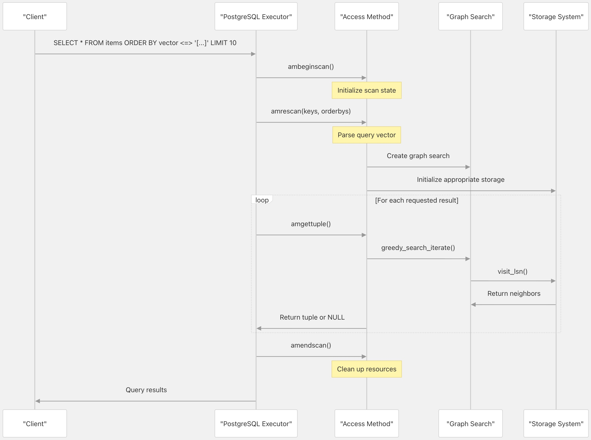
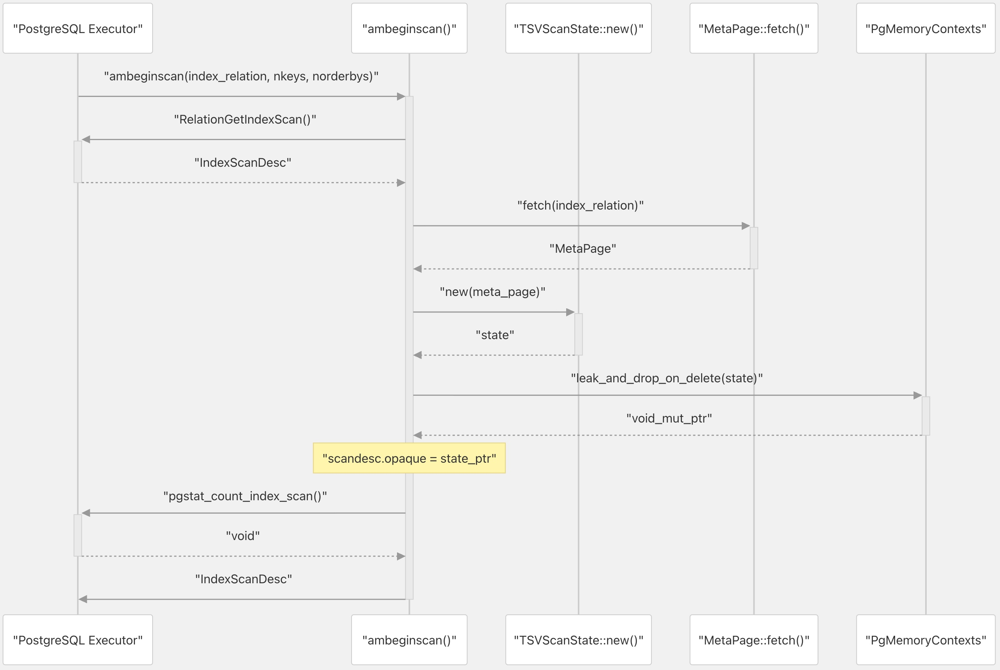
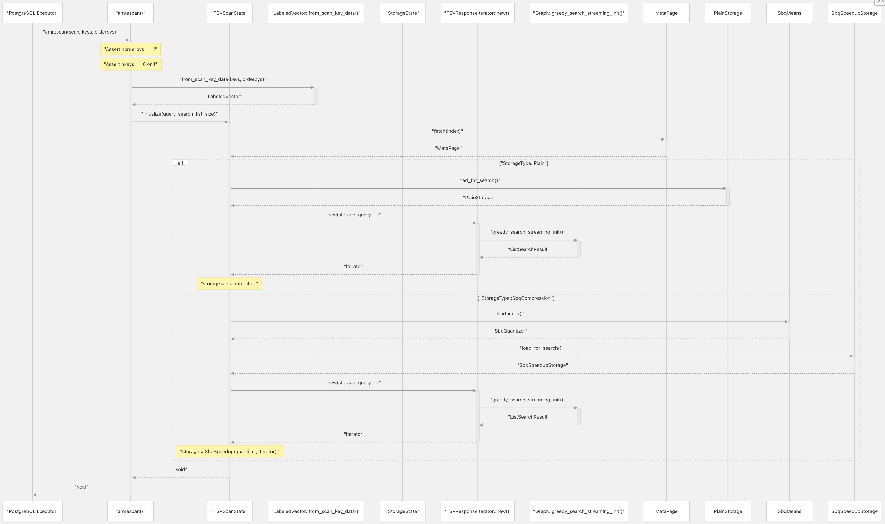
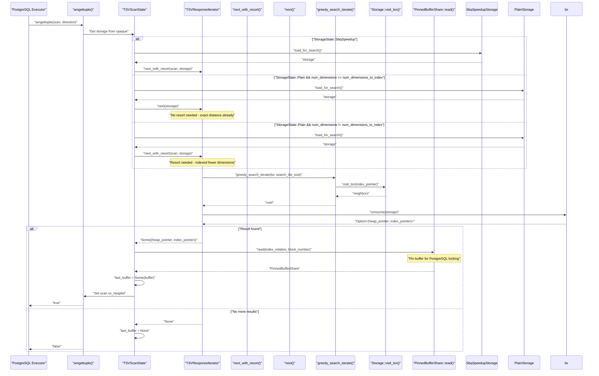
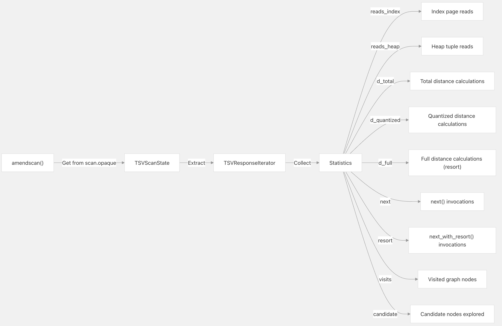
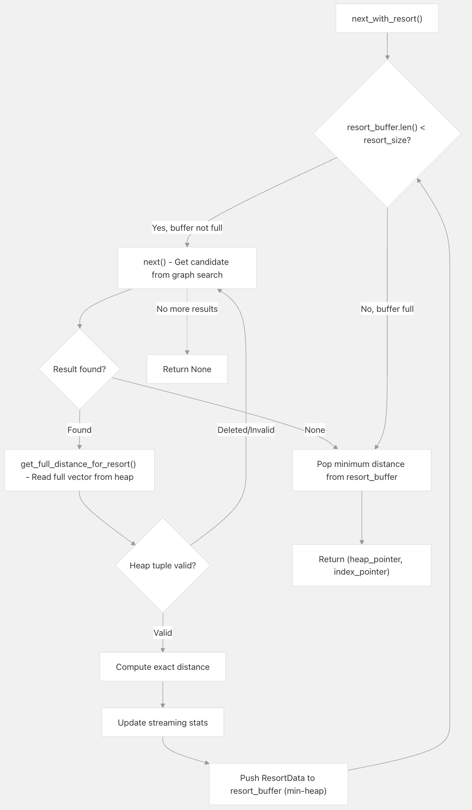

## pgvectorscale 源码学习: 3.3 索引扫描与查询 (Index Scanning and Queries)  
                    
### 作者                    
digoal                    
                    
### 日期                    
2025-11-09                    
                    
### 标签                    
pgvectorscale , 向量数据库 , DiskANN , StreamingDiskANN , 源码学习                    
                    
----                    
                    
## 背景      
本文详细介绍 `pgvectorscale` 如何执行索引扫描 (index scanning)——即高效搜索向量数据 (vector data)，根据向量相似性 (vector similarity) 查找最近邻 (nearest neighbors) 的过程。这是用户在 `PostgreSQL` 中运行带有 `<=>` 操作符 (operator) 的向量相似性查询时所执行的关键操作。  
  
`pgvectorscale` 中的索引扫描使用**基于图的近似最近邻 (ANN) 搜索算法 (graph-based approximate nearest neighbor search algorithm)**，能够高效地在向量空间 (vector space) 中导航。  
  
## PostgreSQL 集成 (PostgreSQL Integration)  
  
扫描功能通过实现以下处理器函数 (handler functions)，与 `PostgreSQL` 的存取方法接口 (access method interface) 集成：  
  
  
  
来源:  
[`src/access_method/scan.rs` 304-452](https://github.com/timescale/pgvectorscale/blob/36271fa5/src/access_method/scan.rs#L304-L452)  
  
接下来详细介绍 `pgvectorscale` 如何通过**索引扫描子系统 (index scanning subsystem)** 执行向量相似性搜索查询 (vector similarity search queries)。当 `PostgreSQL` 运行带有 `<=>`、`<->` 或 `<#>` 操作符 (operators) 的查询以查找与查询向量相似的向量时，将触发扫描过程。  
  
扫描子系统通过四个回调函数 (callback functions)：`ambeginscan`、`amrescan`、`amgettuple` 和 `amendscan`，实现了 `PostgreSQL` 存取方法扫描生命周期 (access method scan lifecycle)。这些回调函数协同工作，以导航 **DiskANN 图结构 (DiskANN graph structure)**，并将结果流式传输 (stream results) 回 `PostgreSQL`。一个关键的优化是**重新排序机制 (resort mechanism)**，它通过重新计算顶级候选 (top candidates) 的精确距离 (exact distances) 来提高准确性。  
  
## 扫描生命周期概述 (**Scan Lifecycle Overview**)  
  
在索引扫描期间，**PostgreSQL** 会调用以下访问方法回调函数:  
  
| 回调函数 (**Callback**) | 目的 (**Purpose**) | 调用时机 (**Invocation**) |  
| :--- | :--- | :--- |  
| `ambeginscan` | 初始化扫描状态 (**Initialize scan state**) | 每次查询开始时调用一次 (**Once per query at scan start**) |  
| `amrescan` | 解析查询参数 (**Parse query parameters**) | 在 `ambeginscan` 之后，每次查询调用一次 (**Once per query after ambeginscan**) |  
| `amgettuple` | 检索下一个结果元组 (**Retrieve next result tuple**) | 重复调用，直到返回所有结果 (**Repeatedly until all results returned**) |  
| `amendscan` | 清理并记录统计信息 (**Clean up and log statistics**) | 每次查询结束时调用一次 (**Once per query at scan end**) |  
  
来源:  
[`src/access_method/scan.rs` 308-332](https://github.com/timescale/pgvectorscale/blob/36271fa5/src/access_method/scan.rs#L308-L332) (ambeginscan)  
[`src/access_method/scan.rs` 335-367](https://github.com/timescale/pgvectorscale/blob/36271fa5/src/access_method/scan.rs#L335-L367) (amrescan)  
[`src/access_method/scan.rs` 369-405](https://github.com/timescale/pgvectorscale/blob/36271fa5/src/access_method/scan.rs#L369-L405) (amgettuple)  
[`src/access_method/scan.rs` 438-456](https://github.com/timescale/pgvectorscale/blob/36271fa5/src/access_method/scan.rs#L438-L456) (amendscan)  
  
## 核心数据结构 (**Core Data Structures**)  
  
扫描过程使用几个关键数据结构来管理状态 (**state**):  
  
### TSVScanState  
  
`TSVScanState` 结构体 (**struct**) 在回调函数调用期间维护扫描级别状态 (**scan-level state**):  
  
```rust  
struct TSVScanState {  
    storage: *mut StorageState,  
    distance_fn: Option<DistanceFn>,  
    meta_page: MetaPage,  
    last_buffer: Option<PinnedBufferShare>,  
}  
```  
  
字段 (**Fields**):  
  
  * `storage`: 指向存储特定状态（**Plain** 或 **SBQ**）的指针 (**Pointer to storage-specific state**)  
  * `distance_fn`: 由运算符类 (**operator class**) 确定的距离函数 (**Distance function**)  
  * `meta_page`: 索引元数据 (**Index metadata**)，包括配置  
  * `last_buffer`: 最近一次 `amgettuple` 调用中固定的缓冲区 (**Pinned buffer**) (PostgreSQL 锁定协议 (**locking protocol**) 所必需)  
  
来源:  
[`src/access_method/scan.rs` 40-55](https://github.com/timescale/pgvectorscale/blob/36271fa5/src/access_method/scan.rs#L40-L55)  
  
### StorageState  
  
`StorageState` 枚举 (**enum**) 用于区分 **Plain** 和 **SBQ** 存储实现 (**storage implementations**):  
  
```rust  
enum StorageState {  
    SbqSpeedup(  
        SbqQuantizer,  
        TSVResponseIterator<SbqSearchDistanceMeasure, SbqSpeedupStorageLsnPrivateData>,  
    ),  
    Plain(TSVResponseIterator<PlainDistanceMeasure, PlainStorageLsnPrivateData>),  
}  
```  
  
每个变体 (**variant**) 包含:  
  
  * 存储特定的量化器 (**quantizer**) 或距离度量 (**distance measure**)  
  * 针对该存储类型参数化 (**parameterized**) 的 `TSVResponseIterator`  
  
来源:  
[`src/access_method/scan.rs` 31-37](https://github.com/timescale/pgvectorscale/blob/36271fa5/src/access_method/scan.rs#L31-L37)  
  
### TSVResponseIterator  
  
`TSVResponseIterator` 管理流式搜索过程 (**streaming search process**) 和可选的重新排序 (**resorting**):  
  
```rust  
struct TSVResponseIterator<QDM, PD> {  
    lsr: ListSearchResult<QDM, PD>,  
    search_list_size: usize,  
    meta_page: MetaPage,  
    quantizer_stats: QuantizerStats,  
    resort_size: usize,  
    resort_buffer: BinaryHeap<ResortData>,  
    streaming_stats: StreamingStats,  
    // Statistics fields...  
}  
```  
  
关键字段 (**Key fields**):  
  
  * `lsr`: `ListSearchResult` 管理图遍历状态 (**graph traversal state**)  
  * `search_list_size`: 搜索期间要维护的候选者数量 (**Number of candidates to maintain during search**)  
  * `resort_buffer`: 用于按精确距离 (**exact distance**) 重新排序结果的最小堆 (**Min-heap**)  
  * `streaming_stats`: 跟踪距离统计信息 (**distance statistics**) 以实现自适应行为 (**adaptive behavior**)  
  
来源:  
[`src/access_method/scan.rs` 162-206](https://github.com/timescale/pgvectorscale/blob/36271fa5/src/access_method/scan.rs#L162-L206)  
  
## 扫描生命周期实现 (**Scan Lifecycle Implementation**)  
  
### ambeginscan: 分配扫描状态 (**Allocate Scan State**)  
  
`ambeginscan` 回调函数分配并初始化 `TSVScanState` 结构体:  
  
Diagram: ambeginscan Execution Flow  
  
  
  
该函数执行以下操作:  
  
1.  调用 `RelationGetIndexScan` 来分配 `IndexScanDesc`  
2.  通过 `MetaPage::fetch` 获取索引元数据 (**index metadata**)  
3.  创建带有空存储指针 (**empty storage pointer**) 的 `TSVScanState`  
4.  将状态泄露到当前内存上下文 (**current memory context**) 中 (将由 **PostgreSQL** 释放)  
5.  增加索引扫描统计信息 (**index scan statistics**)  
6.  返回将状态存储在 `opaque` 字段中的 `IndexScanDesc`  
  
来源:  
[`src/access_method/scan.rs` 308-332](https://github.com/timescale/pgvectorscale/blob/36271fa5/src/access_method/scan.rs#L308-L332)  
  
### amrescan: 解析查询并初始化搜索 (**Parse Query and Initialize Search**)  
  
`amrescan` 回调函数提取查询向量 (**query vector**) 并初始化存储特定的搜索状态 (**storage-specific search state**):  
  
Diagram: amrescan Execution Flow  
  
  
  
该函数执行以下操作:  
  
1.  验证是否恰好提供了 1 个排序键 (**order-by key**) (即查询向量)  
2.  通过 `LabeledVector::from_scan_key_data` 从扫描键 (**scan keys**) 中解析查询向量和可选的标签过滤器 (**label filter**)  
3.  调用 `TSVScanState::initialize`，该函数:  
      * 加载存储后端 (**storage backend**) (`PlainStorage` 或 `SbqSpeedupStorage`)  
      * 为该存储类型创建 `TSVResponseIterator`  
      * 通过 `Graph::greedy_search_streaming_init` 初始化 `ListSearchResult`  
4.  将初始化后的状态存储在 `scan.opaque` 中  
  
来源:  
[`src/access_method/scan.rs` 335-367](https://github.com/timescale/pgvectorscale/blob/36271fa5/src/access_method/scan.rs#L335-L367)  
[`src/access_method/scan.rs` 56-88](https://github.com/timescale/pgvectorscale/blob/36271fa5/src/access_method/scan.rs#L56-L88)  
[`src/access_method/scan.rs` 176-206](https://github.com/timescale/pgvectorscale/blob/36271fa5/src/access_method/scan.rs#L176-L206)  
  
### amgettuple: 检索下一个结果 (**Retrieve Next Result**)  
  
`amgettuple` 回调函数被重复调用，用于将结果流式传输 (**stream results**) 回 **PostgreSQL**:  
  
Diagram: amgettuple Execution Flow  
  

  
该函数执行以下操作:  
  
1.  从 `scan.opaque` 中检索存储特定状态 (**storage-specific state**)  
2.  加载适当的存储后端 (`PlainStorage` 或 `SbqSpeedupStorage`)  
3.  调用 `TSVResponseIterator::next()` 或 `next_with_resort()`，具体取决于:  
      * 对于 **SBQ** 存储，始终使用 `next_with_resort` (量化距离 (**quantized distances**) 需要精炼 (**refinement**))  
      * 如果 `num_dimensions != num_dimensions_to_index`，则对于 **Plain** 存储使用 `next_with_resort` (马特里奥什卡嵌入 (**Matryoshka embeddings**))  
      * 否则使用 `next()` (已是精确距离 (**exact distances**))  
4.  `next` 或 `next_with_resort` 调用:  
      * `Graph::greedy_search_iterate` 以探索图并找到候选者 (**candidates**)  
      * `Storage::visit_lsn` 以从页面 (**pages**) 加载邻居列表 (**neighbor lists**)  
      * `ListSearchResult::consume` 以弹出下一个最近的结果  
5.  如果找到结果:  
      * 将 `scan.xs_heaptid` 设置为堆元组指针 (**heap tuple pointer**)  
      * 固定索引缓冲区 (**Pins index buffer**) (PostgreSQL 锁定协议所必需)  
      * 返回 `true`  
6.  如果没有更多结果，则返回 `false`  
  
来源:  
[`src/access_method/scan.rs` 369-405](https://github.com/timescale/pgvectorscale/blob/36271fa5/src/access_method/scan.rs#L369-L405)  
[`src/access_method/scan.rs` 406-436](https://github.com/timescale/pgvectorscale/blob/36271fa5/src/access_method/scan.rs#L406-L436)  
[`src/access_method/scan.rs` 209-242](https://github.com/timescale/pgvectorscale/blob/36271fa5/src/access_method/scan.rs#L209-L242)  
[`src/access_method/scan.rs` 244-305](https://github.com/timescale/pgvectorscale/blob/36271fa5/src/access_method/scan.rs#L244-L305)  
  
### amendscan: 清理与统计 (**Cleanup and Statistics**)  
  
`amendscan` 回调函数在扫描完成时调用，用于清理资源 (**clean up resources**) 和记录统计信息 (**log statistics**):  
  
Diagram: amendscan Statistics Output  
  
  
  
该函数执行以下操作:  
  
1.  从 `scan.opaque` 中提取 `TSVScanState`  
2.  检索存储特定的迭代器 (**iterator**)  
3.  在 `DEBUG1` 级别记录统计信息，包括:  
      * `reads_index`: 索引页面读取次数 (**Number of index page reads**)  
      * `reads_heap`: 堆元组读取次数 (**Number of heap tuple reads**) (用于重新排序 **resort**)  
      * `d_total`: 总距离比较次数 (**Total distance comparisons**)  
      * `d_quantized`: 量化距离比较次数 (**Quantized distance comparisons**) (仅限 **SBQ**)  
      * `d_full`: 完整距离比较次数 (**Full distance comparisons**) (重新排序 **resort**)  
      * `next`: `next()` 调用次数  
      * `resort`: `next_with_resort()` 调用次数  
      * `visits`: 访问的图节点数 (**Number of graph nodes visited**)  
      * `candidate`: 探索的候选节点数 (**Number of candidate nodes explored**)  
4.  内存清理 (**Memory cleanup**) 由 **PostgreSQL** 自动处理  
  
来源:  
[`src/access_method/scan.rs` 438-456](https://github.com/timescale/pgvectorscale/blob/36271fa5/src/access_method/scan.rs#L438-L456)  
[`src/access_method/scan.rs` 458-476](https://github.com/timescale/pgvectorscale/blob/36271fa5/src/access_method/scan.rs#L458-L476)  
  
## 结果重新排序机制 (**Result Resorting Mechanism**)  
  
重新排序机制通过在将顶级候选者返回给 **PostgreSQL** 之前重新计算它们的精确距离 (**exact distances**) 来提高搜索准确性 (**search accuracy**)。  
  
### 何时使用重新排序 (**When Resorting is Used**)  
  
在两种情况下会调用重新排序:  
  
1.  **SBQ 存储 (Storage)**: 始终使用，因为初始搜索使用的是具有近似距离 (**approximate distances**) 的量化向量 (**quantized vectors**)  
2.  **使用马特里奥什卡嵌入 (Matryoshka Embeddings) 的 Plain 存储 (Storage)**: 当 `num_dimensions != num_dimensions_to_index` 时使用，这意味着只对向量的前缀 (**prefix**) 进行了索引  
  
### 重新排序算法 (**Resorting Algorithm**)  
  
Diagram: next_with_resort() Algorithm  
  
  
  
`next_with_resort` 函数执行以下操作:  
  
1.  通过以下步骤将 `resort_buffer` (最小堆 **min-heap**) 填充至 `resort_size`:  
      * 调用 `next()` 从图搜索 (**graph search**) 中获取下一个候选者 (**candidate**)  
      * 调用 `Storage::get_full_distance_for_resort()` 来:  
          * 从堆元组 (**heap tuple**) 中读取完整向量 (**full vector**)  
          * 使用所有维度 (**dimensions**) 计算精确距离 (**exact distance**)  
      * 跳过已删除/无效的堆元组 (**deleted/invalid heap tuples**)  
      * 将 `ResortData { heap_pointer, index_pointer, distance }` 推送到堆中  
      * 更新流式传输距离统计信息  
2.  一旦**缓冲区满 (buffer full)**，则从**堆 (heap)** 中**弹出 (pops)** 最小距离项 (**minimum distance item**)。  
3.  以**精确距离顺序 (exact distance order)** 将**元组 (tuple)** 返回给 **PostgreSQL**。  
  
来源:  
[`src/access_method/scan.rs` 244-305](https://github.com/timescale/pgvectorscale/blob/36271fa5/src/access_method/scan.rs#L244-L305)  
  
### 重新排序数据结构 (ResortData Structure)  
  
`ResortData` **结构体 (struct)** 代表一个带有其**精确距离 (exact distance)** 的**候选者 (candidate)**：  
  
```rust  
struct ResortData {  
    heap_pointer: HeapPointer,  
    index_pointer: IndexPointer,  
    distance: f32,  
}  
  
impl Ord for ResortData {  
    fn cmp(&self, other: &Self) -> std::cmp::Ordering {  
        // Note: reversed comparison creates min-heap  
        other.distance.total_cmp(&self.distance)  
    }  
}  
```  
  
在 `Ord` 实现中，**反向比较 (reversed comparison)** 从 `BinaryHeap` 创建了一个**最小堆 (min-heap)**，从而允许高效地提取**最近的向量 (closest vectors)**。  
  
来源:  
[`src/access_method/scan.rs` 91-117](https://github.com/timescale/pgvectorscale/blob/36271fa5/src/access_method/scan.rs#L91-L117)  
  
### 流式统计数据 (Streaming Statistics)  
  
`StreamingStats` **结构体 (structure)** 用于在**重新排序 (resorting)** 过程中跟踪**距离分布 (distance distribution)**：  
  
```rust  
struct StreamingStats {  
    count: i32,  
    mean: f32,  
    m2: f32,  // For variance calculation  
    max_distance: f32,  
}  
```  
  
统计数据使用 **Welford 的在线算法 (Welford's online algorithm)** 进行更新，该算法用于计算**平均值 (mean)** 和**方差 (variance)**，从而允许根据距离分布实现**自适应行为 (adaptive behavior)**。  
  
来源:  
[`src/access_method/scan.rs` 119-160](https://github.com/timescale/pgvectorscale/blob/36271fa5/src/access_method/scan.rs#L119-L160)  
  
### 配置参数 (Configuration Parameters)  
  
**重新排序行为 (resorting behavior)** 由两个 **GUC 参数 (GUC parameters)** 控制：  
  
| 参数 (Parameter) | 类型 (Type) | 默认值 (Default) | 描述 (Description) |  
| :--- | :--- | :--- | :--- |  
| `diskann.query_rescore` | `int` | `2` | **重新排序缓冲区大小 (Resort buffer size)** (0 则禁用重新排序) |  
| `diskann.query_search_list_size` | `int` | `100` | 图搜索期间维护的**候选者数量 (Number of candidates)** |  
  
将 `diskann.query_rescore = 0` 设置为**禁用重新排序 (disables resorting)**，这在以下情况下可能适用：  
  
  * 使用**纯存储 (Plain storage)** 且对**全部维度 (full dimensions)** 进行索引时  
  * **优先考虑速度 (Prioritizing speed)** 而非准确性时  
  * 处理**低维向量 (low-dimensional vectors)**，其中**量化误差 (quantization error)** 极小时  
  
来源:  
[`src/access_method/guc.rs` 41-58](https://github.com/timescale/pgvectorscale/blob/36271fa5/src/access_method/guc.rs#L41-L58)  
  
## 扫描期间的距离计算 (Distance Calculations During Scanning)  
  
向量距离使用在索引创建期间指定的**距离函数 (distance function)** (**L2**、**余弦 [Cosine]** 或**内积 [Inner Product]**) 进行计算。扫描过程使用**两种类型**的距离计算：  
  
### 1\. 近似距离 (Approximate Distances) (图遍历 [Graph Traversal])  
  
在**图遍历 (graph traversal)** 期间，距离使用**存储特定的距离度量 (storage-specific distance measures)** 进行计算：  
  
| 存储类型 (Storage Type) | 距离度量 (Distance Measure) | 精度 (Precision) | 用例 (Use Case) |  
| :--- | :--- | :--- | :--- |  
| `PlainStorage` | `PlainDistanceMeasure` | **精确 (Exact)** | 索引中的**全精度向量 (Full-precision vectors)** |  
| `SbqSpeedupStorage` | `SbqSearchDistanceMeasure` | **近似 (Approximate)** | 索引中的**量化向量 (Quantized vectors)** |  
  
这些度量实现了在 `Storage` **特征 (trait)** 中定义的 `NodeDistanceMeasure` 和 `QueryDistanceMeasure` **特征 (traits)**。  
  
来源:  
[`src/access_method/storage.rs` 13-43](https://github.com/timescale/pgvectorscale/blob/36271fa5/src/access_method/storage.rs#L13-L43)  
[`src/access_method/plain/storage.rs` 1-100](https://github.com/timescale/pgvectorscale/blob/36271fa5/src/access_method/plain/storage.rs#L1-L100)  
[`src/access_method/sbq/storage.rs` 1-100](https://github.com/timescale/pgvectorscale/blob/36271fa5/src/access_method/sbq/storage.rs#L1-L100)  
  
### 2\. 精确距离 (Exact Distances) (重新排序 [Resorting])  
  
当**重新排序 (resorting)** 被启用时，**精确距离 (exact distances)** 的计算方式如下：  
  
  * 通过 `Storage::get_full_distance_for_resort()` 从**堆元组 (heap tuple)** 中读取**完整向量 (full vector)**  
  * 使用**所有维度 (all dimensions)** (而不仅仅是索引维度) 计算距离  
  * 使用**精确距离函数 (exact distance function)** (**L2**、**余弦 [Cosine]** 或**内积 [Inner Product]**)  
  
来源:  
[`src/access_method/storage.rs` 74-86](https://github.com/timescale/pgvectorscale/blob/36271fa5/src/access_method/storage.rs#L74-L86)  
  
### 3\. 带有平局处理的距离 (DistanceWithTieBreak)  
  
为了确保**确定性排序 (deterministic ordering)**，`DistanceWithTieBreak` **结构体 (struct)** 使用**平局处理机制 (tie-breaking mechanism)** 封装了距离：  
  
```rust  
pub struct DistanceWithTieBreak {  
    distance: f32,  
    tie_breaker: IndexPointer,  
}  
  
impl Ord for DistanceWithTieBreak {  
    fn cmp(&self, other: &Self) -> std::cmp::Ordering {  
        match self.distance.total_cmp(&other.distance) {  
            std::cmp::Ordering::Equal => self.tie_breaker.cmp(&other.tie_breaker),  
            ord => ord,  
        }  
    }  
}  
```  
  
当两个向量具有**相同的距离 (identical distances)** 时，排序由 `IndexPointer` **比较 (comparison)** 决定，这确保了**跨查询的结果排序一致性 (consistent result ordering across queries)**。  
  
来源:  
[`src/access_method/neighbor_with_distance.rs` 11-95](https://github.com/timescale/pgvectorscale/blob/36271fa5/src/access_method/neighbor_with_distance.rs#L11-L95)  
  
## 扫描期间的标签过滤 (Label Filtering During Scanning)  
  
当查询中通过 `&&` **运算符 (operator)** 提供了**标签过滤器 (label filter)** 时，**扫描过程 (scanning process)** 会在多个层面集成过滤：  
  
### 查询解析 (Query Parsing)  
  
在 `amrescan` 期间，**标签 (Labels)** 会从**扫描键 (scan keys)** 中提取出来：  
  
```rust  
let query = LabeledVector::from_scan_key_data(keys, orderby_keys, &meta_page);  
```  
  
这将创建一个 `LabeledVector`，其中包含**查询向量 (query vector)** 和用于过滤的可选 `LabelSet` **（标签集）**。  
  
来源:  
[`src/access_method/scan.rs` 364](https://github.com/timescale/pgvectorscale/blob/36271fa5/src/access_method/scan.rs#L364-L364)  
[`src/access_method/labels.rs` 1-100](https://github.com/timescale/pgvectorscale/blob/36271fa5/src/access_method/labels.rs#L1-L100)  
  
### 过滤后的图遍历 (Filtered Graph Traversal)  
  
`has_label_filter` **标志 (flag)** 会影响**图遍历 (graph traversal)** 的行为：  
  
```rust  
let has_label_filter = query.labels().is_some_and(|labels| !labels.is_empty());  
graph.greedy_search_iterate(  
    &mut lsr,  
    search_list_size,  
    !has_label_filter,  // early_stop_on_visited  
    None,  
    storage,  
);  
```  
  
当 `has_label_filter` 为 `true` 时：  
  
  * 对已访问节点的**提前停止 (Early stopping)** 被禁用  
  * 搜索会继续探索以找到匹配的**带标签向量 (labeled vectors)**  
  * 只有标签与**查询标签 (query labels)** **重叠 (overlapping)** 的向量才会被添加为**候选者 (candidates)**  
  
来源:  
[`src/access_method/scan.rs` 189](https://github.com/timescale/pgvectorscale/blob/36271fa5/src/access_method/scan.rs#L189-L189)  
[`src/access_method/scan.rs` 218-225](https://github.com/timescale/pgvectorscale/blob/36271fa5/src/access_method/scan.rs#L218-L225)  
  
### 标签检查 (Label Checking)  
  
**标签过滤 (Label filtering)** 是通过 `LabelSet::overlaps()` 在**图搜索 (graph search)** 中实现的：  
  
  * **起始节点 (Start nodes)** 是通过 `StartNodes::get_start_node_for_labels()` 根据匹配的标签来选择的  
  * 在**遍历 (traversal)** 期间，只有具有匹配标签的**邻居 (neighbors)** 才会成为**候选者 (candidates)**  
  * 结果自然只包含满足**标签谓词 (label predicate)** 的向量  
  
这将**向量相似性搜索 (vector similarity search)** 与**元数据过滤 (metadata filtering)** 集成在一个**索引扫描 (index scan)** 操作中。  
  
来源:  
[`src/access_method/graph.rs` 293-296](https://github.com/timescale/pgvectorscale/blob/36271fa5/src/access_method/graph.rs#L293-L296)  
[`src/access_method/labels.rs` 1-200](https://github.com/timescale/pgvectorscale/blob/36271fa5/src/access_method/labels.rs#L1-L200)  
  
## 性能统计与监控 (**Performance Statistics and Monitoring**)  
  
扫描过程会收集在 `amendscan` 期间以 `DEBUG1` 级别记录的详细统计信息 (**detailed statistics**):  
  
### 统计类别 (**Statistics Categories**)  
  
| 统计项 (**Statistic**) | 变量 (**Variable**) | 描述 (**Description**) |  
| :--- | :--- | :--- |  
| 索引读取 (**Index reads**) | `reads_index` | 索引页读取次数 (**Number of index pages read**) |  
| 堆读取 (**Heap reads**) | `reads_heap` | 堆元组读取次数 (**Number of heap tuples read**) (用于重新排序 **resort**) |  
| 总距离 (**Total distances**) | `d_total` | 总距离比较次数 (**Total distance comparisons**) |  
| 量化距离 (**Quantized distances**) | `d_quantized` | 近似距离比较次数 (**Approximate distance comparisons**) (SBQ) |  
| 完整距离 (**Full distances**) | `d_full` | 精确距离比较次数 (**Exact distance comparisons**) (重新排序 **resort**) |  
| Next 调用 (**Next calls**) | `next` | `TSVResponseIterator::next()` 调用次数 |  
| Resort 调用 (**Resort calls**) | `resort` | `next_with_resort()` 调用次数 |  
| 访问节点 (**Visited nodes**) | `visits` | 搜索期间访问的图节点数 (**Graph nodes visited**) |  
| 候选节点 (**Candidate nodes**) | `candidate` | 添加到候选列表的节点数 (**Nodes added to candidate list**) |  
  
log 输出例子:   
```  
DEBUG1:  Query stats - reads_index=245 reads_heap=50 d_total=1523 d_quantized=1523 d_full=50 next=0 resort=50 visits=245 candidate=378  
```  
  
来源:  
[`src/access_method/scan.rs` 458-476](https://github.com/timescale/pgvectorscale/blob/36271fa5/src/access_method/scan.rs#L458-L476)  
  
### 统计信息解读 (**Interpreting Statistics**)  
  
要监控的关键指标 (**Key metrics**) 为:  
  
1.  **reads\_index / visits ratio** (索引读取次数/访问节点数比率): 应接近 1.0 (高效的页面访问 **efficient page access**)  
2.  **d\_total** (总距离): 高值可能表明图连接效率低下 (**inefficient graph connectivity**)  
3.  **reads\_heap** (堆读取次数): 应等于重新排序缓冲区大小 (**resort buffer size**) (启用重新排序时)  
4.  **candidate / visits ratio** (候选节点数/访问节点数比率): 表示图的分支因子 (**graph branching factor**) 和搜索广度 (**search breadth**)  
  
这些统计信息有助于诊断性能问题 (**performance issues**) 并调整索引参数，例如 `num_neighbors` 和 `search_list_size`。  
  
来源:  
[`src/access_method/stats.rs` 1-100](https://github.com/timescale/pgvectorscale/blob/36271fa5/src/access_method/stats.rs#L1-L100)  
  
## 存储实现 (**Storage Implementations**)  
  
索引扫描过程使用两种存储实现 (**storage implementations**):  
  
1.  **Plain Storage (普通存储)**: 存储未压缩向量 (**uncompressed vectors**)，提供精确距离计算 (**exact distance calculations**)，但需要更多内存。  
2.  **SBQ (Statistical Binary Quantization) Storage (统计二值量化存储)**: 使用压缩 (**compression**) 来减少内存使用，代价是初始距离计算的精度 (**precision**) 略有损失，这通过重新排序机制 (**resorting mechanism**) 得到缓解。  
  
存储实现是在索引创建期间选择的，并影响扫描期间向量的访问方式。  
  
来源:  
[`src/access_method/storage.rs` 146-170](https://github.com/timescale/pgvectorscale/blob/36271fa5/src/access_method/storage.rs#L146-L170)  
[`src/access_method/scan.rs` 62-79](https://github.com/timescale/pgvectorscale/blob/36271fa5/src/access_method/scan.rs#L62-L79)  
  
## 结论 (**Conclusion**)  
  
**pgvectorscale** 中的索引扫描子系统旨在高效地在高维向量空间 (**high-dimensional vector spaces**) 中查找近似最近邻 (**approximate nearest neighbors**)。通过将基于图的贪婪搜索算法 (**graph-based greedy search algorithm**) 与结果重新排序 (**result resorting**) 和标签过滤 (**label filtering**) 等优化相结合，它为 **PostgreSQL** 中的向量相似性查询 (**vector similarity queries**) 提供了速度和准确性。  
  
    
#### [PolarDB 学习图谱](https://www.aliyun.com/database/openpolardb/activity "8642f60e04ed0c814bf9cb9677976bd4")
  
  
#### [PostgreSQL 解决方案集合](../201706/20170601_02.md "40cff096e9ed7122c512b35d8561d9c8")
  
  
#### [德哥 / digoal's Github - 公益是一辈子的事.](https://github.com/digoal/blog/blob/master/README.md "22709685feb7cab07d30f30387f0a9ae")
  
  
#### [About 德哥](https://github.com/digoal/blog/blob/master/me/readme.md "a37735981e7704886ffd590565582dd0")
  
  

  
