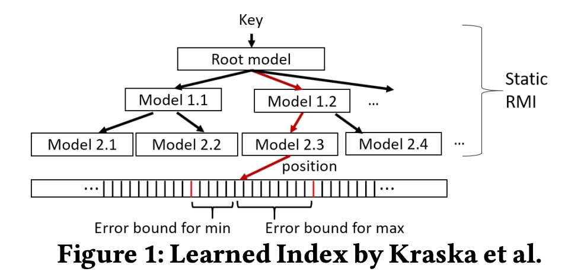
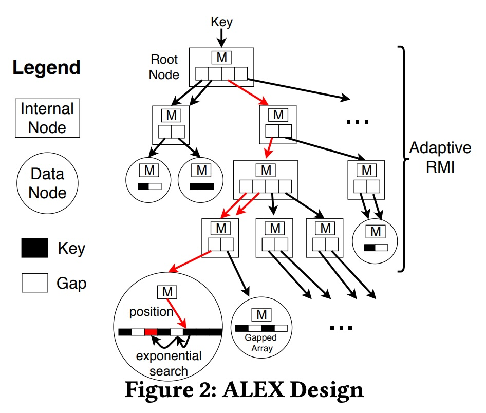
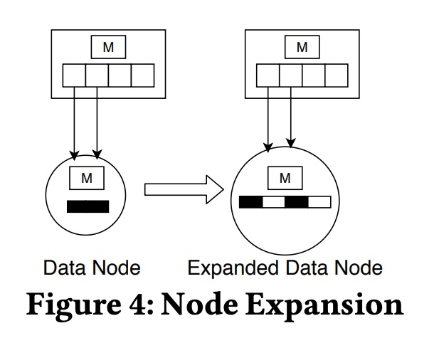
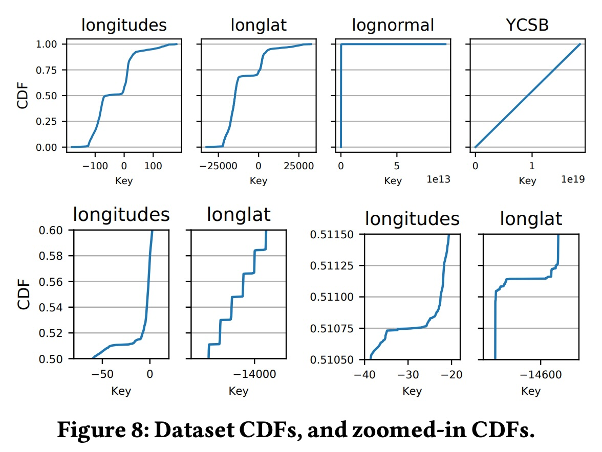
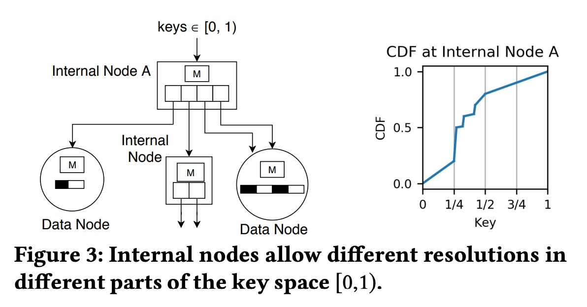
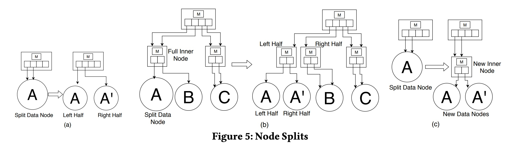
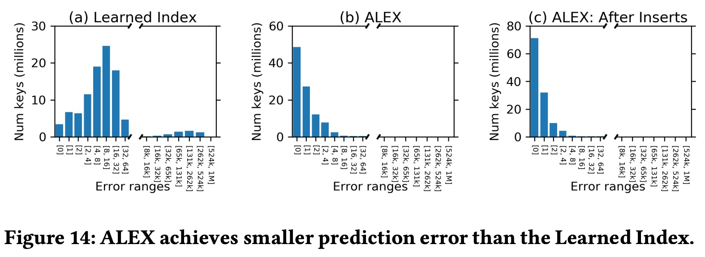
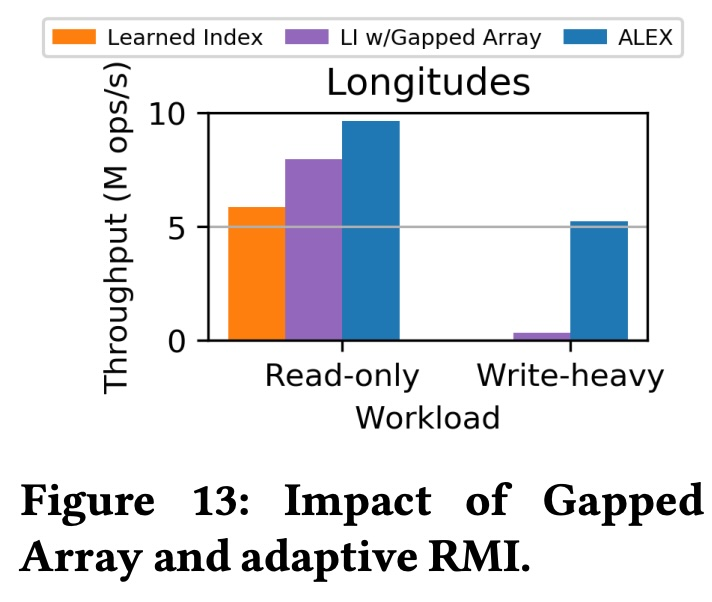
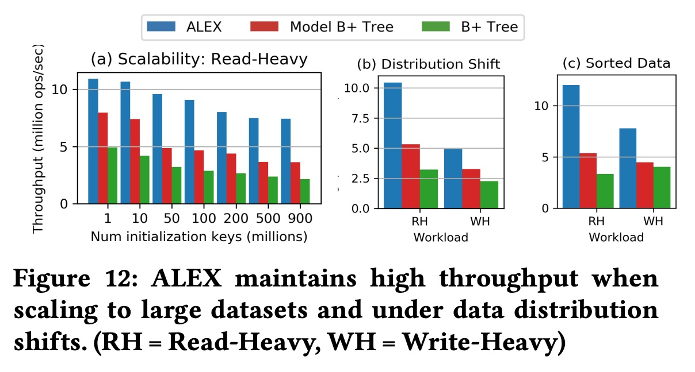

## AI论文解读 | ALEX: An Updatable Adaptive Learned Index
        
### 作者        
digoal        
        
### 日期        
2025-11-10        
        
### 标签        
PostgreSQL , PolarDB , DuckDB , AI , 论文解读        
        
----        
        
## 背景  
      
https://dl.acm.org/doi/pdf/10.1145/3318464.3389711        
  
提示:          
```          
读懂《ALEX: An Updatable Adaptive Learned Index》这篇论文需要提前掌握哪些基础知识, 请使用中文通熟易懂的讲解这些基础知识, 可以引用论文中的图、表或使用Markdown支持的图形(text,mermaid等)增加解释性. 
  
使用中文通熟易懂的解读《ALEX: An Updatable Adaptive Learned Index》这篇论文, 其中的关键内容请着重讲解, 可以引用论文中的图、表或使用Markdown支持的图形(text,mermaid等)增加解释性. 
  
提取《ALEX: An Updatable Adaptive Learned Index》这篇论文中的重要术语, 使用中文对这些术语进行通熟易懂的讲解, 可以引用论文中的图、表或使用Markdown支持的图形(text,mermaid等)增加解释性. 
```     
  
## 1 前置知识 
  
要读懂《ALEX: An Updatable Adaptive Learned Index》这篇论文，你需要对数据库索引、基础数据结构，以及一些入门级的机器学习概念有所了解。

ALEX 的核心思想是 **用机器学习模型（“学习型”）来替代传统的索引结构（如B+树），并使其变得“可更新”和“自适应”** 。

这里有一份为你准备的基础知识清单，我会用通俗的语言和论文中的图表来解释它们。

-----

### 1\. 核心前提：数据库索引与 B+树

这是理解这篇论文**最重要**的基础知识。

  * **什么是索引 (Index)？**

      * **通俗理解：** 索引就像一本书的目录。没有目录，你要找某一页的内容，就得从第一页翻到最后一页（全表扫描）。有了目录，你可以快速定位到章节（数据块），大大加快查找速度。
      * **数据库中：** 索引是一种数据结构，它存储了表中特定列（键，Key）的值和它所对应的行数据的位置。当你执行 `SELECT * WHERE id = 100` 时，索引能帮你快速“跳”到 `id = 100` 的数据那里，而不是一行一行地比较。

  * **什么是 B+树 (B+Tree)？**

      * **是什么：** B+树是几十年来关系型数据库中**最主流、最经典**的索引结构 。
      * **它如何工作：** 它是一种“平衡的”多路搜索树。
          * **查找 (Lookup)：** 从根节点开始，通过比较键值，一层一层往下走，直到找到叶子节点 。
          * **范围查询 (Range Query)：** 它的叶子节点是“排好序”的，并且互相链接（像链表一样） 。这使得查询“所有大于10且小于50的键”变得非常高效。
          * **更新 (Update)：** 它是“动态的”，支持高效的插入、删除操作 。当一个节点满了，它会“分裂” (Split)；当节点太空了，它会“合并” (Merge)，始终保持树的平衡。
      * **论文中的意义：** B+树是 ALEX 要对标和超越的“黄金标准” 。ALEX 在性能上经常吊打 B+树 。

### 2\. 核心概念：“学习型索引” (Learned Index)

ALEX 是对“学习型索引”的改进，所以你必须先懂什么是“学习型索引”。

  * **“学习型索引”是什么？**

      * 这是 ALEX 的作者们在 2018 年提出的一个开创性想法（论文中称为 "Learned Index by Kraska et al." ）。
      * **核心思想：** 索引可以被看作是一个“模型”(model)，这个模型预测一个“键”(Key) 在排好序的数组中的“位置”(Position) 。
      * **举个例子：**
          * **B+树（传统索引）：** 像是在玩“20问”，通过一系列“是/否”问题（“比50大吗？”、“比75大吗？”）来定位数据。
          * **学习型索引（新思想）：** 像是请了一个“专家”，你给他一个键（比如 `key = 70`），他“猜”一个位置（比如 `position = 700`）。如果数据分布很均匀，这个“专家”会猜得非常准。

  * **RMI (Recursive Model Index, 递归模型索引)**

      * 如果数据分布不均匀（比如，1到100之间有很多数，101到1000之间没几个数），一个简单的“专家”就猜不准了 。
      * **解决方案：** RMI，即“模型的层次结构” 。
      * **看下图（论文图1）：**    
          * `Root model`（根模型）像个“总指挥”。
          * 它不直接预测最终位置，而是预测该用“哪个下一步的模型” 。
          * `Model 1.2` 再预测该用 `Model 2.3`。
          * `Model 2.3`（叶子模型）才最终预测出键在数据数组中的位置 `position` 。

     

  * **原始“学习型索引”的致命缺陷**

      * 它只适用于**静态的、只读的**数据 。
      * **为什么？** 它的底层数据存储在一个“紧密排列的数组” (densely packed array) 中 。
      * **想象一下：** 你有一个排好序的数组 `[10, 20, 30, 40]`。现在你想插入 `25`。你必须把 `30` 和 `40` 都往后“挪一位”，变成 `[10, 20, 25, 30, 40]` 。如果这个数组有1亿个元素，插入一个新数据可能导致几千万个元素移动位置，这个成本是“不可接受的” 。

### 3\. ALEX 的核心贡献：如何实现“可更新”

ALEX 要解决的核心问题，就是让学习型索引变得“可更新” (Updatable) 。

  * **Gapped Array (带间隙的数组)**

      * **ALEX 的妙招：** 不用“紧密数组”，而是用“Gapped Array” 。
      * **通俗理解：** 就像在电影院里，不是所有人挤在一起，而是预留了很多“空座位”（Gaps）。
      * **看下图（论文图2和图4）：** 图2  的数据节点 (Data Node) 中，黑色代表键 (Key)，白色代表间隙 (Gap)。      

     

      * **插入操作：**
          * 当插入一个新键时，模型会预测一个位置 。
          * 如果那个位置刚好是“空座位”（Gap），直接放进去就行了，成本极低 。
          * 如果不是，也只需要在“附近”找个空位，挪动少量数据（比如挪到最近的空位） 。
      * **好处：** 通过预留空间（Gaps），ALEX “摊销”了插入时移动数据的成本 。

    **文字示意图：**

    ```text
    紧密数组 (Packed Array): [ 1 | 3 | 5 | 7 | 9 ]
    (插入 '4' 成本很高，'5', '7', '9' 都要移动)

    Gapped Array (ALEX): [ 1 | 3 | _ | 5 | 7 | _ | 9 ]
    (插入 '4'，模型预测在 '3' 和 '5' 之间，直接填入空隙 '_')
    ```

  * **自适应结构 (Adaptive RMI)**

      * ALEX 的 RMI 结构不是固定的，而是“自适应的” 。
      * 当一个 Gapped Array 满了（比如密度超过80% ），ALEX 会触发操作：
        1.  **扩展 (Expansion)：** 把这个数组变得更大，并重新插入所有元素（如图4）。    
        2.  **分裂 (Split)：** 把它拆成两个新的节点，就像 B+树的分裂一样 。
      * ALEX 会用“成本模型” (Cost Models)  来智能地决定是该扩展还是分裂，目标是让未来的查找和插入成本最低 。

### 4\. 其它你需要知道的知识点

  * **机器学习：线性回归 (Linear Regression)**

      * 你不需要懂复杂的神经网络。ALEX 使用的“模型”绝大多数都是最简单的**线性回归** 。
      * **就是初中数学：** $y = ax + b$ 。
      * `x` 是你的键 (Key)，`y` 是预测的位置 (Position)。
      * **优点：** 存储开销极小（只需要存 `a` 和 `b` 两个数），计算极快（一次乘法和一次加法）。

  * **算法：指数搜索 (Exponential Search)**

      * **问题：** 模型的预测 `y` 不可能100%完美。
      * **B+树：** 在一个节点内用“二分查找” (Binary Search) 。
      * **ALEX：** 用“指数搜索” (Exponential Search) 。
      * **为什么？** 二分查找适合在“完全未知”的大范围里找。但 ALEX 的模型已经给了一个“非常接近”的预测位置。指数搜索从这个“预测点”开始，先检查 `+1` 位置，然后 `+2`, `+4`, `+8`... 像涟漪一样向外扩展。如果预测很准（误差很小），指数搜索会比二分查找快得多 。

  * **数据分布：累积分布函数 (CDF)**

      * “学习型索引”本质上是在学习数据的**累积分布函数 (CDF)** 。
      * **通俗理解：** CDF 就是一个函数，它告诉你“小于等于某个键 `x` 的数据占总数据量的百分比”。
      * **看下图（论文图8）：**     
          * **YCSB 数据集：** CDF 是一条完美的直线，说明数据是“均匀分布”的。这种数据用一个 $y=ax+b$ 模型就能完美预测。
          * **longlat 数据集：** CDF 呈“阶梯状”，说明数据分布非常不均匀（“倾斜的”），很难建模 。
          * ALEX 的自适应 RMI 结构（比如论文图3  所示）擅长通过增加更多模型（更深的树）来拟合这些不规则的 CDF。    

     

-----

### 总结

要读懂 ALEX，你的知识储备应该像一个金字塔：

  * **塔基（必须懂）：** **B+树**。它是用来做什么的？它如何实现查找、插入、删除和范围查询？
  * **塔身（核心概念）：** **原始学习型索引**。它“学”的是什么（CDF/位置）？它为什么快（模型预测）？它为什么是“只读”的（紧密数组插入的成本）？
  * **塔尖（ALEX的创新）：** **Gapped Array**。它如何解决“只读”问题（预留空隙）？以及**指数搜索**（如何利用不完美的预测）。

如果你能把 B+树的“节点分裂”和 ALEX 的“Gapped Array 满了之后的分裂/扩展”这两个概念联系起来，你就抓住了这篇论文的精髓。
  
## 2 解读论文 
  
这是一篇非常出色的数据库领域论文。简单来说，《ALEX》这篇论文解决了一个核心问题：**如何让“学习型索引” (Learned Index) 变得实用，即支持数据的插入、删除和更新，同时保持高性能** 。

“学习型索引”是几年前提出的一个革命性想法，它认为索引（比如B+树）本质上是一个“模型”，可以“预测”数据的位置 。这个想法在只读数据上表现惊人，比B+树更快、更小 。但它有一个致命缺陷：一旦你尝试**插入或删除**数据，它的性能就会崩溃 。

ALEX 提出了一种全新的、名为 **“ALEX”** 的索引结构，它既是“学习型”的，又是“可更新”和“自适应”的 。

下面，我将为你通俗地解读这篇论文的关键内容。

---

### 1. 核心问题：为什么“旧”的学习型索引无法更新？

要理解 ALEX 的精妙之处，我们必须先看它要解决的问题。

* **旧的结构（论文图1）：** 原始的“学习型索引”（RMI）本质上是一个“模型的层级结构” 。    
    * 你给它一个键（Key），根模型 (Root model) 会“预测”下一层的哪个模型（比如 Model 1.2）应该处理它 。
    * 最后一层模型（比如 Model 2.3）会直接“预测”这个键在**一个排好序的、紧密排列的数组**中的最终位置 (position) 。

    

* **致命缺陷：** 问题出在那个“紧密排列的数组” (densely packed array) 。
    * **想象一下：** 你有一个100万个元素的有序数组。现在你想在中间插入一个新元素。你必须把后面的50万个元素**全部向后移动一位** 。
    * 这种“线性时间复杂度”的插入操作在数据库中是“不可接受的” 。

ALEX 的目标是：**保留“模型预测”的超高查找效率，同时让“插入”操作变得和B+树一样高效。**

---

### 2. ALEX 的三大核心设计

ALEX 通过几个关键创新，完美地解决了上述问题 。

#### 关键设计一：Gapped Array (带间隙的数组)

这是 ALEX 实现高效更新的**最核心**的结构。

* **是什么：** ALEX 不再使用“紧密数组”，而是在其“数据节点” (Data Node) 中使用“带间隙的数组” 。
* **通俗理解：** 想象一个电影院。
    * **旧索引：** 100个座位，100个人紧挨着坐。想在中间加个人？后面50个人都得起身换座位。
    * **ALEX：** 100个座位，只坐了70个人，中间留了30个“空位”（Gaps）。想在中间加个人？只需要让他坐在附近的“空位”上就行了。
* **ALEX 如何工作：**
    * 如图2所示，数据节点 (Data Node) 中，黑色方块是键 (Key)，白色方块是间隙 (Gap) 。    
    * 当插入一个新键时，模型会预测一个插入位置 。
    * **如果预测位置是间隙：** 直接把键放进去，插入完成 。
    * **如果预测位置已有键：** 只需向“最近的间隙”方向平移少量元素，腾出空间 。
* **好处：** 通过预留空间（Gaps），ALEX 将插入操作的成本 **“平摊”**  (amortizes) 了 。

#### 关键设计二：Adaptive RMI (自适应的模型结构)

数据是动态变化的，模型也必须是动态的。ALEX 的模型层级（RMI）是“自适应”的 。

* **B+树如何适应：** 当一个B+树节点满了，它会“分裂” (Split)。
* **ALEX 如何适应：** 当一个 Gapped Array 变得太满时（ 比如超过80%的“密度” $d_u$ ） ，ALEX 会启动自适应机制 。
* **智能决策 (Cost Models)：** ALEX 不会盲目分裂，它会使用“成本模型” (Cost Models) 来预测哪种操作最划算 。它主要有两个选择：

    1.  **Node Expansion (节点扩展) - 如图4**    
        * **时机：** 当模型预测*依然很准*时（即“预期成本”和“实际成本”相差不大） 。
        * **操作：** 分配一个更大的Gapped Array（比如2倍大），然后把所有元素用模型“重新插入” (model-based inserts) 到新数组中 。

        

    2.  **Node Split (节点分裂) - 如图5**    
        * **时机：** 当模型预测*开始不准*了（数据分布发生变化，导致实际成本飙升） 。
        * **操作：** ALEX 有两种分裂方式：
            * **(a) 横向分裂 (Sideways Split)：** 类似B+树，一个节点分裂成两个（A -> A, A'），父节点更新指针 。
            * **(c) 向下分裂 (Downwards Split)：** **这是ALEX的独创！** 如果一个数据节点A的分布变得太复杂（如图3中非线性的CDF ），它会把自己“升级”成一个新的“内部节点”（New Inner Node），并创建两个新的子数据节点（A, A'） 。这在局部增加了模型的“分辨率”。     

        

#### 关键设计三：Model-based Insertion (基于模型的插入) 与 Exponential Search (指数搜索)

* **基于模型的插入：** 这是 ALEX 保持模型高精度的“秘诀”。当插入一个键时，ALEX 会**强制**将它插入到模型“预测”的位置附近 。这反过来又“训练”了模型，让模型始终能准确反映数据分布。
    * 如图14 (b) 和 (c) 所示，ALEX 的预测误差（Predicted position 和 Actual position 的差距）绝大多数都是 **0** ，而旧的“学习型索引”（图 14a）的误差则要大得多 。    

* **指数搜索：** 既然模型预测这么准（误差几乎为0），ALEX 在查找时就不再使用传统的二分查找。
    * **操作：** 它直接跳到模型“预测”的位置，然后从那里开始“指数搜索” (exponential search)（如图2的放大镜所示） 。    
    * **通俗理解：** 就像你找人，模型告诉你在100号。你先看100号，不对？再看101号，不对？再看102号，不对？再看104号，不对？再看108号... 你以1, 2, 4, 8...的步长向外找。
    * **好处：** 只要模型预测得准（比如误差在8以内），这个速度远快于从头开始的二分查找 。

---

### 3. 实验结果：ALEX 到底有多强？

ALEX 的性能非常惊人，它在“读”和“写”上实现了双重胜利。

* **完胜 B+Tree（读写混合场景）：**
    * **性能：** 在各种读写混合的负载下，ALEX 的吞吐量（每秒操作数）最高可达 B+Tree 的 **4.1倍** 。
    * **空间：** ALEX 的索引大小（不含数据）比 B+Tree 最多小 **2000倍** 。这是因为模型（存几个浮点数）远比 B+Tree 的内部节点（存很多键和指针）要小 。

* **超越“旧”的学习型索引（只读场景）：**
    * 即便是在“旧”的学习型索引最擅长的只读场景，ALEX 的性能也是它的 **2.2倍**，同时空间占用小 **15倍** 。
    * 如图13所示，这得益于 Gapped Array 和 Adaptive RMI 的共同作用 。    

* **鲁棒性 (Robustness)：**
    * ALEX 对数据分布的变化（Distribution Shift）不敏感 。
    * 如图12 (b) 和 (c) 所示，无论是随机插入还是按顺序插入（Append-only，B+树的噩梦），ALEX 都能通过自适应机制保持极高的吞吐量，远超 B+Tree 。    

### 总结

《ALEX》是一篇里程碑式的论文。它没有推翻“学习型索引”，而是 **“治愈”** 了它。

它巧妙地融合了两个世界的优点：
1.  **机器学习世界：** 使用模型来预测位置，实现超高的查找性能和极低的空间占用 。
2.  **数据库世界：** 借鉴了 B+Tree 的“动态调整”思想（如分裂和扩展），并独创了 **Gapped Array** 来实现高效的更新 。

最终，ALEX 向我们证明了，“学习型索引”不只是一个漂亮的“玩具”，而是可以真正应用在**有动态更新需求的、真实的数据库系统**中的实用技术 。
  
## 3 术语 
  
好的，ALEX 是一篇影响力很大的论文，它提出的索引结构既利用了机器学习的优势，又解决了实际数据库中的更新难题。

以下是《ALEX: An Updatable Adaptive Learned Index》这篇论文中的一些关键术语及其通俗讲解，并会引用论文中的图表概念。

-----

### 1\. 学习型索引 (Learned Index)

  * **出处：** 论文摘要  和引言 。

  * **通俗讲解：**
    这是 ALEX 诞生的基础。传统的索引（如 B+Tree）像是一个“路牌”系统，你通过不断比较“大于/小于”来找到数据。

    而“学习型索引”  的核心思想是：**索引可以被看作是一个“模型”** 。

    这个“模型”（比如一个简单的 $y = ax + b$ 线性模型）可以直接“预测”一个键 (Key) 在排好序的数据集中的“位置” (Position) 。如果数据分布有规律，这个模型会猜得非常准，从而跳过 B+Tree 复杂的逐层比较，实现极快的查找速度 。

  * **论文图1 的概念：** 论文中的图1  展示了“旧”的学习型索引（称为 RMI）。它像一个层级管理者：    

      * `Root model`（根模型）不直接预测最终位置，而是预测该由哪个“二层模型”（如 `Model 1.2`）来处理。
      * “二层模型”再预测该由哪个“三层模型”（如 `Model 2.3`）处理。
      * 最后的“叶子模型” (`Model 2.3`) 才最终预测出键在**紧密数组**中的位置 `position`。

### 2\. RMI (Recursive Model Index / 递归模型索引)

  * **出处：** 论文背景  和图1 。

  * **通俗讲解：**
    RMI 是实现“学习型索引”的一种具体结构，即“模型的层级结构” 。

      * **为什么需要 RMI？** 真实世界的数据分布（CDF）往往很复杂（参见论文图8的 `longlat` 数据集 ），一个简单的模型（如一条直线）无法精确拟合所有数据 。    
      * **RMI 如何解决？** RMI 通过“分而治之”来解决。它使用一个根模型来粗略划分数据范围，然后每个子模型负责拟合自己那一小块数据的分布 。
      * **ALEX 的改进：** 原始的 RMI 是“静态的” (Static RMI)，在初始化时就固定了层级和模型数量 。而 ALEX 实现了 **“自适应 RMI” (Adaptive RMI)** ，可以根据数据变化动态地增加或调整模型（例如通过“向下分裂” ）。

### 3\. Gapped Array (带间隙的数组)

  * **出处：** 论文第3.2.1节  和图2 。    

  * **通俗讲解：**
    这是 ALEX **实现“可更新” (Updatable) 的核心法宝**。

      * **原始索引的痛点：** 原始的学习型索引将数据存在一个“紧密排列的数组” (densely packed array) 中 。如果你想在中间插入一个数据，后面所有的数据都必须向后“平移”，这个成本是毁灭性的 。
      * **ALEX 的妙计：** ALEX 在存储数据的叶子节点（Data Node）使用“Gapped Array”。顾名思义，它是一个**在元素之间预留了“空隙” (Gaps) 的数组** 。

    下面的文字图可以帮你理解：

    ```text
    [ 传统紧密数组 ]
    [ 10 | 20 | 30 | 40 | 50 ]
    ( 插入 25, 成本很高: 30, 40, 50 都需要向右平移 )

    [ ALEX 的 Gapped Array ] ( _ 代表 Gap )
    [ 10 | 20 | _ | 30 | 40 | _ | 50 | _ ]
    ( 插入 25, 成本很低: 找到 20 和 30 之间的空隙 _ , 直接填入 )
    ```

      * 这些“间隙”可以“吸收”新的插入 ，从而极大地摊销（Amortize）了插入时移动数据的成本 。

### 4\. Model-based Insertion (基于模型的插入)

  * **出处：** 论文第3.1节  和第4.2节 。

  * **通俗讲解：**
    这个机制保证了 ALEX 的模型在数据不断插入后依然保持“准确”。

      * **做什么？** 当插入一个新键时，ALEX 不会简单地将其插在“正确”的排序位置，而是将其插入到 **“数据节点模型预测它应该在的位置”** 附近 。
      * **为什么这么做？**
        1.  **保持模型准确性：** 这使得数据在物理上的存储位置，始终与模型“期望”的位置保持一致。
        2.  **提升查找性能：** 由于数据总是在模型预测点附近，这使得后续的查找误差极小（如图14所示，ALEX的预测误差大多为0 ），从而让“指数搜索”的效率达到最高 。    

### 5\. Exponential Search (指数搜索)

  * **出处：** 论文第3.1节  和图2 。    

  * **通俗讲解：**
    这是 ALEX 在数据节点内的查找策略，用来修正模型预测的微小误差。

      * **背景：** 模型的预测不可能是100%完美的，它可能预测位置是100，但实际键在102。
      * **传统做法：** B+Tree 在节点内使用“二分查找” (Binary Search) 。
      * **ALEX 的做法：** ALEX 使用“指数搜索” 。它**从模型预测的位置 (position) 开始**：
        1.  检查预测点。
        2.  如果不对，检查 `预测点 ± 1`。
        3.  如果不对，检查 `预测点 ± 2`。
        4.  如果不对，检查 `预测点 ± 4`。
        5.  ...以此类推，按 $1, 2, 4, 8...$ 的步长向外扩展搜索范围 。

    如图2的放大镜所示 ，它从 `position` 开始向两边进行 `exponential search`。

      * **为什么用它？** 因为“基于模型的插入”保证了模型的预测**极其准确**（误差很小） 。在这种“几乎猜对”的情况下，指数搜索比“二分查找”快得多 。

### 6\. Cost Models (成本模型)

  * **出处：** 论文第4.3.4节 。

  * **通俗讲解：**
    这是 ALEX 实现“自适应” (Adaptive) 的大脑。它帮助 ALEX 在数据节点“满”了的时候，做出最明智的决策。

      * **做什么？** 它使用简单的线性模型来“预测”执行不同操作（如查找、插入）的“成本”（即耗时） 。
      * **依据什么？** 它会实时追踪两个关键统计数据：
        1.  平均指数搜索的迭代次数（代表“查找成本”） 。
        2.  平均每次插入要平移的元素数量（代表“插入成本”） 。
      * **如何决策？** 当一个 Gapped Array 满了 ，ALEX 会计算：
          * “如果我扩展 (Expand) 节点，预期的总成本是多少？”
          * “如果我分裂 (Split) 节点，预期的总成本是多少？”
      * 然后，ALEX 会选择那个 **“预期总成本最低”** 的动作（扩展或分裂） 。

### 7\. Node Expansion vs. Node Split (节点扩展 vs. 节点分裂)

这是“成本模型”最终执行的两种核心自适应动作 。

  * **Node Expansion (节点扩展)** 

      * **如图4所示** ，一个数据节点变成一个更大的“Expanded Data Node”。     
      * **操作：** 分配一个更大的 Gapped Array，然后使用模型（可能需要微调）重新插入所有元素 。
      * **何时使用：** 当成本模型发现**当前模型依然很准**（即“实际成本”和“预期成本”偏差不大 ）时。这意味着数据分布没变，只是数据变多了，给更多空间就行。

  * **Node Split (节点分裂)** 

      * **如图5所示** ，一个节点分裂成两个或多个。   
      * **何时使用：** 当成本模型发现**当前模型已经不准了**（即“实际成本”远超“预期成本” ）时。这通常意味着数据分布发生了变化，原有的简单模型已无法拟合，需要“分裂”来用新模型更精细地拟合。
      * **ALEX 的独创 (图5c)：** ALEX 支持“向下分裂” (Splitting down) 。即一个“数据节点” (A) 可以“升级”成一个“内部节点”（New Inner Node），并创建两个新的“子数据节点”（A 和 A'） 。这在 B+Tree 中是没有的 ，它允许 ALEX 动态地增加树的深度，以适应复杂的数据分布 。
  
## 参考        
         
https://dl.acm.org/doi/pdf/10.1145/3318464.3389711    
        
<b> 以上内容基于DeepSeek、Qwen、Gemini及诸多AI生成, 轻微人工调整, 感谢杭州深度求索人工智能、阿里云、Google等公司. </b>        
        
<b> AI 生成的内容请自行辨别正确性, 当然也多了些许踩坑的乐趣, 毕竟冒险是每个男人的天性.  </b>        
    
#### [PolarDB 学习图谱](https://www.aliyun.com/database/openpolardb/activity "8642f60e04ed0c814bf9cb9677976bd4")
  
  
#### [PostgreSQL 解决方案集合](../201706/20170601_02.md "40cff096e9ed7122c512b35d8561d9c8")
  
  
#### [德哥 / digoal's Github - 公益是一辈子的事.](https://github.com/digoal/blog/blob/master/README.md "22709685feb7cab07d30f30387f0a9ae")
  
  
#### [About 德哥](https://github.com/digoal/blog/blob/master/me/readme.md "a37735981e7704886ffd590565582dd0")
  
  

  
