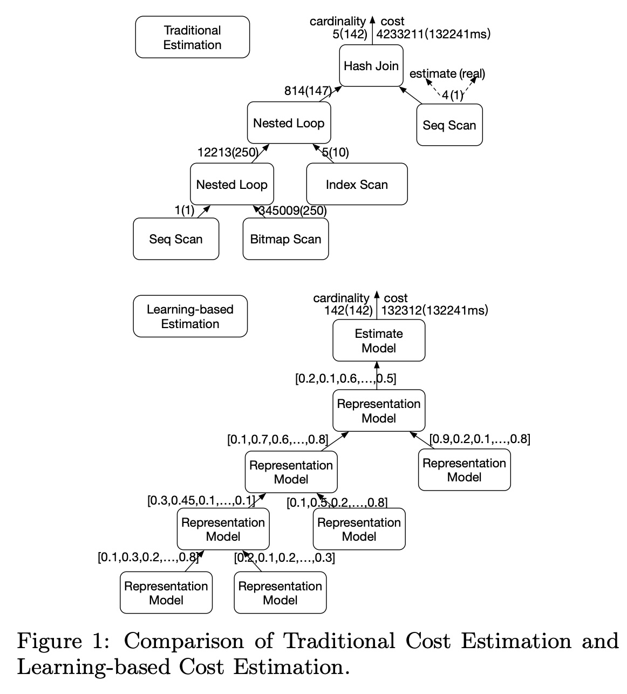
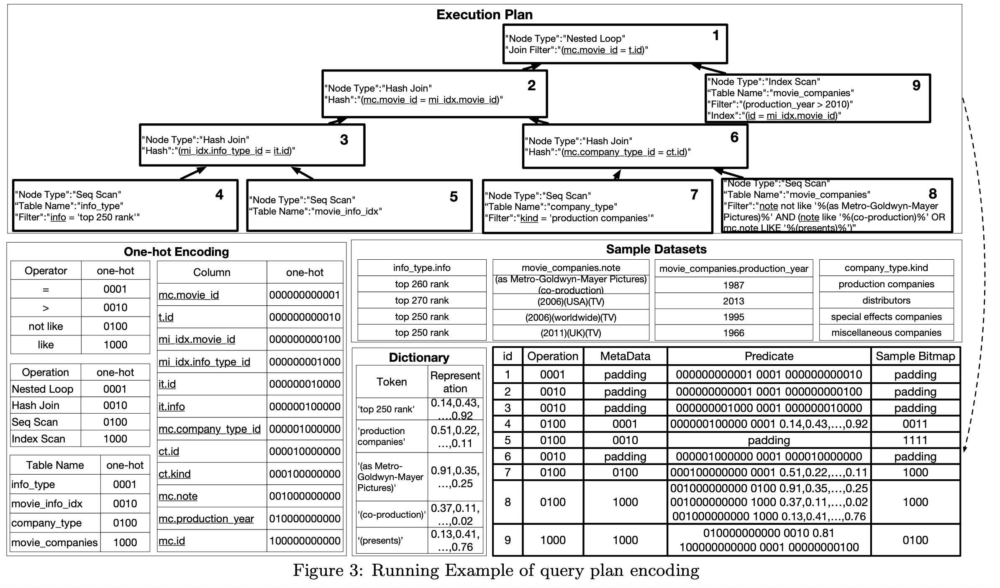
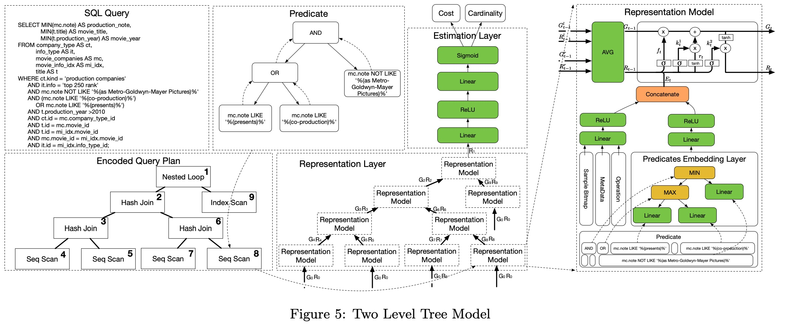
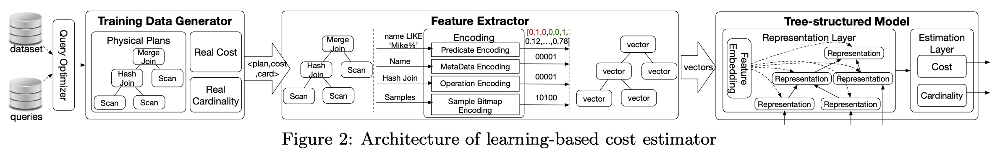
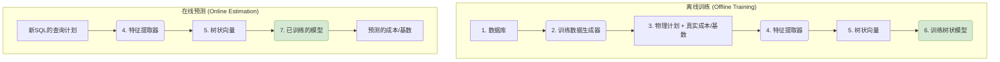
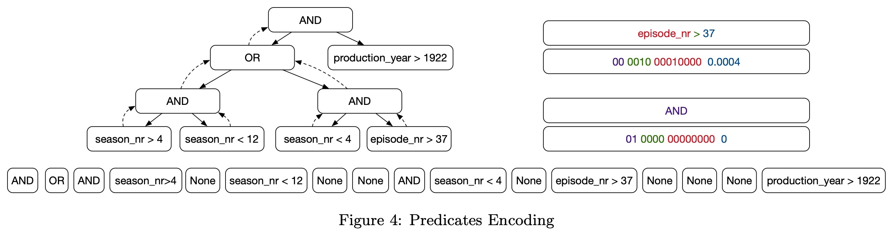
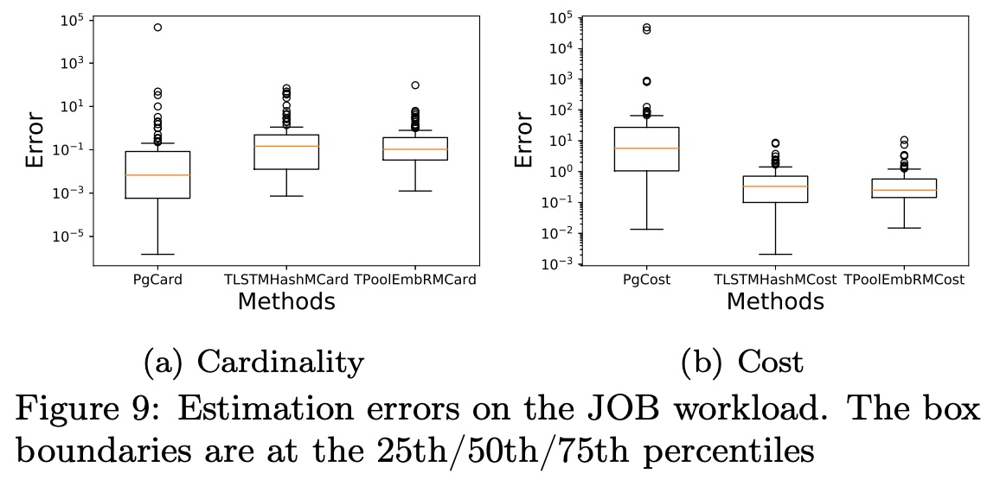
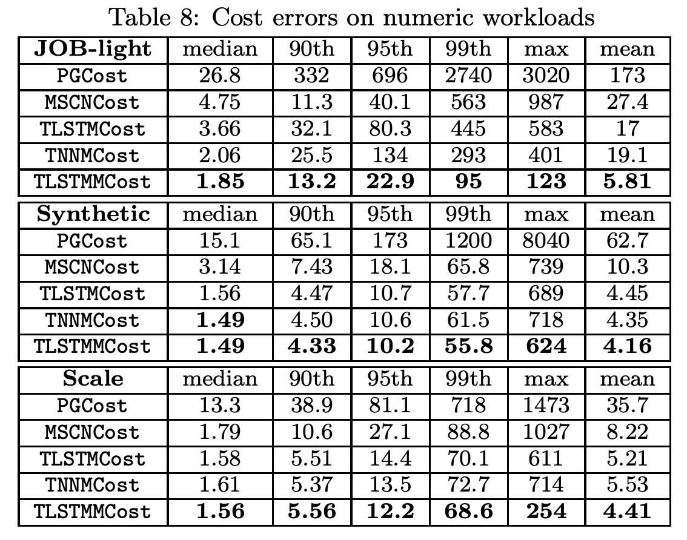

## AI论文解读 | An End-to-End Learning-based Cost Estimator
        
### 作者        
digoal        
        
### 日期        
2025-11-10        
        
### 标签        
PostgreSQL , PolarDB , DuckDB , AI , 论文解读        
        
----        
        
## 背景  
      
https://arxiv.org/pdf/1906.02560        
  
提示:          
```          
读懂《An End-to-End Learning-based Cost Estimator》这篇论文需要提前掌握哪些基础知识, 请使用中文通熟易懂的讲解这些基础知识, 可以引用论文中的图、表或使用Markdown支持的图形(text,mermaid等)增加解释性. 
  
使用中文通熟易懂的解读《An End-to-End Learning-based Cost Estimator》这篇论文, 其中的关键内容请着重讲解, 可以引用论文中的图、表或使用Markdown支持的图形(text,mermaid等)增加解释性. 
  
提取《An End-to-End Learning-based Cost Estimator》这篇论文中的重要术语, 使用中文对这些术语进行通熟易懂的讲解, 可以引用论文中的图、表或使用Markdown支持的图形(text,mermaid等)增加解释性. 
```     
  
## 1 前置知识 
  
理解这篇论文《An End-to-End Learning-based Cost Estimator》  确实需要一些跨学科的知识，它S完美地融合了**数据库系统**和**机器学习**这两个领域。

简单来说，这篇论文在解决一个数据库领域的经典难题：**如何准确估计一条SQL查询会耗费多少资源（成本）和返回多少行数据（基数）** 。传统方法（如使用统计信息）估不准 ，所以作者提出用一套“端到端”的深度学习模型来解决这个问题 。

为了能顺利读懂它，你需要提前掌握以下三大块基础知识：

### 1\. 🤓 数据库核心知识 (领域问题)

这是理解论文“要做什么”的基础。你需要知道数据库是如何执行一条SQL查询的。

  * **查询优化器 (Query Optimizer):**

      * **通俗理解：** 数据库的“大脑”或“导航系统” 。当你发送一条SQL语句（比如一个复杂的多表连接查询）时，数据库并不会马上执行。
      * **作用：** 它会先生成许多种可能的“执行路径”（比如先A表和B表连接，还是先B表和C表连接），然后从中挑选出一个它认为**成本最低**的路径来执行 。

  * **查询执行计划 (Query Execution Plan):**

      * **通俗理解：** 这就是优化器选中的那条“导航路线图” 。
      * **结构：** 它通常是一个**树状结构** 。叶子节点是“扫描”操作（如读取表数据），中间节点是“连接”或“聚合”操作。
      * **论文中的体现：** 论文的 **Figure 1 (左侧)**  和 **Figure 3**  就展示了这种树状计划。这篇论文的核心思想就是构建一个同样是树状的模型来模仿这个计划 。      

    

    ```mermaid
    graph TD
        A[Hash Join] --> B[Nested Loop]
        A --> C[Seq Scan]
        B --> D[Nested Loop]
        B --> E[Index Scan]
        D --> F[Seq Scan]
        D --> G[Bitmap Scan]
    ```

    *这是一个类似Figure 1  的查询计划示例，数据从底部的"Scan"操作流向顶部的"Join"操作。*

  * **成本 (Cost) & 基数 (Cardinality):**

      * **基数：** 指一个操作（比如一次连接） **估计会返回多少行数据** 。
      * **成本：** 指一个操作**估计会花费多少时间**（或CPU、I/O资源）。
      * **关系：** 成本的估算**高度依赖**于基数的估算 。如果基数估算错了（比如少估了100倍），成本模型基本也就全错了，优化器就可能选出一个灾难性的“慢”计划 。

### 2\. 🤖 机器学习基础 (解决方法)

这是理解论文“是怎么做的”的基础。

  * **监督学习 (Supervised Learning):**

      * **通俗理解：** 你给模型一堆“问题”和“标准答案”，让它学习从问题到答案的映射关系。
      * **在论文中：** “问题”就是一个查询计划（Query Plan），“答案”就是这个计划在真实数据库中执行的**真实成本和真实基数** 。模型的目标是学习这个从“计划”到“（成本, 基数）”的映射。

  * **特征提取与编码 (Feature Extraction & Encoding):**

      * **通俗理解：** 机器学习模型只认识数字。我们必须把“查询计划”这个复杂的东西转换成一堆数字（即“向量”）。
      * **在论文中：** 这是论文的重点之一 。
          * **One-hot 编码：** 用来表示离散的操作类型。比如 `Hash Join` 可以表示为 `[0, 0, 1, 0]`，`Seq Scan` 表示为 `[0, 1, 0, 0]`。**Figure 3**  中的表格就展示了这种编码。
          * **Embedding (嵌入)：** 一种更智能的编码方式。论文用它来处理稀疏的特征，尤其是**字符串** 。

  * **端到端学习 (End-to-End Learning):**

      * **通俗理解：** 指模型从最原始的输入（查询计划）直接学习到最终的输出（成本/基数），中间不需要人为干预或设计过多中间步骤。
      * **在论文中：** 这是论文标题的“End-to-End” ，与传统方法（需要DBA手动调整很多参数）形成对比 。

### 3\. 🧠 深度学习与特定模型 (核心技术)

这是理解论文“为什么这样设计模型”的关键。

  * **树状结构模型 (Tree-structured Model):**

      * **通俗理解：** 既然输入（查询计划）是一棵树 ，那么设计一个同样结构的神经网络模型来处理它，效果会最好。
      * **在论文中：** 这是论文的核心创新 。模型会**自底向上**地计算：先计算叶子节点（Scan）的表示，然后把子节点的表示“喂”给父节点（Join），父节点再计算出自己的表示，一层层向上传递，直到根节点 。**Figure 5**  中的 "Representation Layer"  就清晰地展示了这种结构。    

  * **LSTM (长短期记忆网络):**

      * **通俗理解：** 一种特殊的循环神经网络(RNN)，它有“记忆门”，特别擅长处理序列数据和**防止信息丢失**。
      * **在论文中：** LSTM被用在树状模型的每个节点上（作为"Representation Model"）。它的作用是 **“合并”** 来自子节点的信息和当前节点自己的特征。使用LSTM是为了解决在树上传递时可能发生的 **“信息消失”** （梯度消失）问题 ，确保底层的关键信息能传到顶层。

  * **词嵌入 (Word Embedding / word2vec):**

      * **通俗理解：** 一种把“单词”映射为“向量”的技术。它能捕捉单词间的语义关系（比如 "king" - "man" + "woman" ≈ "queen"）。
      * **在论文中：** 这被巧妙地用来处理**字符串谓词**（比如 `name LIKE '%(co-production)%'`）。传统方法很难处理这些。论文把数据中的字符串模式（如 "co-production"）当作“单词”，使用 **skip-gram 模型** (word2vec的一种)  来学习它们的向量表示，从而能更好地泛化到没见过的字符串 。

  * **多任务学习 (Multitask Learning):**

      * **通俗理解：** 让一个模型**同时学习多个相关的任务**，模型会因为“触类旁通”而把两个任务都学得更好。
      * **在论文中：** 模型被设计为**同时**预测**成本**和**基数**这两个目标 。作者认为这两个任务是高度相关的 ，同时学习可以提升模型的泛化能力 。

-----

#### 总结

要读懂这篇论文，你需要：

1.  **懂数据库：** 知道什么是查询计划、成本和基数。
2.  **懂机器学习：** 知道什么是监督学习和特征编码。
3.  **懂深度学习：** 知道为什么用树状模型、LSTM（处理树结构）和词嵌入（处理字符串）。

掌握了这些，你就能明白这篇论文是如何巧妙地用一套树状LSTM网络，来模拟数据库的查询计划执行过程，从而实现高精度的成本和基数预测。

-----

我是否已经把这些基础知识讲清楚了？您想不想要我根据这些知识，详细拆解一下这篇论文的**模型架构** (如 Figure 5 )？
  
## 2 解读论文 
  
这篇论文 **《An End-to-End Learning-based Cost Estimator》**  是一篇结合了**数据库**和**深度学习**的经典论文。它解决的是数据库中一个“老大难”问题：**如何准确估计SQL查询的成本和基数**。

用一个通俗的比喻来说：

> 数据库的**查询优化器** (Query Optimizer) 就像一个“导航系统” 。当你输入一条SQL（你的“目的地”）时，它会生成很多条“执行路径”（比如先A表B表连接，还是先B表C表连接）。
>
> **成本估计** (Cost Estimation) 就是这个导航系统在“预估每条路径要开多久” 。
>
> **基数估计** (Cardinality Estimation) 则是预估“这条路上有多少车（数据行）” 。
>
> 如果预估错了（比如把一条堵死的路估成“畅通”），优化器就会选错路，导致你的SQL查询跑上几小时（即“导航失败”）。

这篇论文的核心贡献，就是**设计了一个“端到端”的深度学习模型，像模仿查询计划的“树状结构”一样，来同时学会预估“路况（基数）”和“时间（成本）”，并且效果远超传统方法** 。

下面我们来详细解读这篇论文的关键内容。

-----

### 1\. 核心问题：为什么传统方法不行？

论文指出现有的方法（包括已有的机器学习方法）有两大缺陷：

1.  **传统方法估不准**：传统优化器（如PostgreSQL）依赖**统计信息和假设**（如数据均匀分布、列与列之间相互独立）。但真实数据往往是相关的（比如 `国家='中国'` 和 `城市='北京'` 强相关），这导致传统方法在多表连接时，基数估算的 **“误差会逐级累积”** ，越往上估得越离谱 。
2.  **现有学习方法有局限**：在作者撰写此文时，一些学习方法（如MSCN）开始展露头角 。但它们也有局限：
      * **只估基数，不估成本**：它们大多只能估计基数，但优化器最终需要的是成本 。
      * **难以处理复杂结构**：它们很难表示复杂的查询结构，尤其是带 `AND`/`OR` 的**复杂谓词**和**字符串**（如 `LIKE '%(co-production)%'`）。

### 2\. 解决方案概览：端到端树状模型

作者提出的新框架（见下图，基于论文 Figure 2 ）包含两个阶段：    



  * **离线训练**：
    1.  首先，**训练数据生成器 (Training Data Generator)** 会生成大量SQL查询 。
    2.  然后在真实数据库中执行它们，获取它们的 **“物理执行计划”** （那棵树）以及 **“真实的成本和基数”** （这就是标准答案）。
    3.  **特征提取器 (Feature Extractor)** 把这棵树“翻译”成模型能懂的数字（向量）。
    4.  最后，用这些“计划向量”和“真实答案”来**训练 (Train)** 我们的“树状模型” 。
  * **在线预测**：
    1.  当优化器拿到一个**新**的查询计划时，它不需要执行。
    2.  它把这个计划丢给**特征提取器**，转换成向量 。
    3.  然后**已训练的模型**会迅速“计算”出这个向量的预估成本和基数，返回给优化器 。

-----

### 3\. 关键技术点 1：特征提取（如何“喂”给模型？）

这是第一个关键。模型不认识 `Hash Join`，它只认识数字。我们必须把查询计划（如 Figure 3 ）中的每个节点转换成向量。    

论文对每个节点提取了四类特征 ：

1.  **Operation (操作)**：这是什么操作？如 `Hash Join`, `Seq Scan`。使用 **One-hot 编码**（如 `Hash Join` = `[0010]`, `Seq Scan` = `[0100]`）。
2.  **MetaData (元数据)**：操作涉及哪些**表**、**列**和**索引** 。同样用 One-hot 或 Bitmap 表示 。
3.  **Predicate (谓词)**：即 `WHERE` 和 `JOIN` 条件。这是最复杂的，比如 `production_year > 2010` 和 `mc.movie_id = mi_idx.movie_id` 。
4.  **Sample Bitmap (采样位图)**：这是个“作弊”但很有效的特征 。它从表中采样几千行数据，然后用一个0/1向量表示“哪些行”满足了当前节点的谓词 。这给了模型一个关于数据分布的直观感受。

**Figure 3** 完美展示了这个过程：左上角是查询计划树，下面的表格（One-hot, Dictionary, Sample Datasets）展示了如何把节点 1 到 9 转换成右下角表格里的纯数字。

-----

### 4\. 关键技术点 2：模型架构（这个“树”怎么搭？）

这是论文的**核心创新**。既然输入（查询计划）是树，作者就设计了一个**同样结构的神经网络**来处理它 。

模型（见 Figure 5 ）分为三层，数据**自底向上**流动：    

 

1.  **Embedding Layer (嵌入层)** 

      * **作用**：把上一步提取的“高维稀疏”特征（比如几千维的One-hot向量）压缩成“低维稠密”的向量（比如128维）。
      * **谓词处理 (TPool)**：对于 `AND`/`OR` 这种复合谓词，作者设计了一个巧妙的 **Min-Max Pooling** 结构（见 Figure 4 ）：    
          * `OR` (或) 操作，在语义上是取“并集”，对应 **Max Pooling**（取最大值）。
          * `AND` (与) 操作，在语义上是取“交集”，对应 **Min Pooling**（取最小值）。
          * 这比用 LSTM 去“猜”语义要更直接有效，这也是 `TPool` 方法的由来 。

2.  **Representation Layer (表示层)** 

      * **作用**：这是模型的“树干”。它**自底向上**学习（子）计划的表示。
      * **结构**：树中的**每个节点**都是一个 **LSTM (长短期记忆网络) 单元** 。
      * **数据流**：一个父节点（如 `Hash Join`）的 LSTM，会接收**三个输入**：
        1.  它**左孩子**的输出向量（如 `Seq Scan` 的表示）。
        2.  它**右孩子**的输出向量（如 `Index Scan` 的表示）。
        3.  它**自己**的特征向量（来自 Embedding Layer）。
      * **为什么用LSTM？**  因为查询计划树可能很深。普通网络在信息向上传递时，底层的叶子节点信息可能早“忘光”了（即**信息消失**）。LSTM 凭借其“记忆门” ( $G_t$ )，可以确保关键信息从叶子一路传递到树根 。

3.  **Estimation Layer (估计层)** 

      * **作用**：当信息汇聚到**根节点**，我们得到了整个计划的最终表示向量 $R_t$ 。
      * **多任务学习 (Multi-task)**：这个 $R_t$ 向量被送入两个**不同**的全连接网络（“输出头”）：
        1.  一个头负责预测 **Cost (成本)** 。
        2.  另一个头负责预测 **Cardinality (基数)** 。
      * **为什么同时学？**  因为成本和基数是**强相关**的 。一起学习（共享 Representation Layer）能迫使模型学到更鲁棒、更通用的特征，两个任务都能做得更好 。

-----

### 5\. 关键技术点 3：字符串嵌入（最难的硬骨头）

如何处理 `note LIKE '%(co-production)%'` 这样的字符串谓词？

  * **难点**：字符串是无限的、离散的 。总不能为“co-production”这个词做个 One-hot，那字典就爆炸了 。
  * **论文的巧思 (Rule-based Embedding)** ：
    1.  **生成规则**：作者不只看查询里的字符串，还去扫描**数据库里的真实数据**和查询里的**模式**（如 `LIKE 'Din%'`）。
    2.  **提取“单词”** ：通过这些规则，从数据中提取出高频的、有意义的子串（如 "co-production", "Din", "presents"）。
    3.  **训练词嵌入 (Word2Vec)**：把这些子串当作“单词”，把一行数据中的多个子串当作一个“句子”，然后扔进 **Skip-gram (Word2Vec) 模型**去训练 。
    4.  **获得向量**：训练完成后，“co-production”就有了一个100维的向量。这个向量**捕捉了它与其他“单词”的共现关系** 。

这样，模型就学会了字符串的“语义”，而不是只看个表面。

-----

### 6\. 实验效果：真的有用吗？

论文在IMDB数据集上进行了详尽的实验，结果非常亮眼：

  * **吊打传统方法**：在所有任务上，学习型方法（MSCN, TLSTM, TPool）都远超 PostgreSQL, MySQL 等传统优化器 。
  * **树模型 \> CNN**：论文的树模型 (TLSTM) 比当时最好的 CNN 模型 (MSCN) 更好，尤其是在复杂的 JOB-light 测试集上 。
  * **TPool (Min-Max) \> TLSTM (谓词)**：使用 Min-Max Pooling (TPool) 来处理谓词，比用 LSTM (TLSTM-EmbRule) 效果更好 。这证明了显式地建模 `AND`/`OR` 语义是更优的。
  * **多任务 \> 单任务**：`TLSTM-Multi` (同时估成本和基数) 比 `TLSTM` (只估成本) 的成本预测误差更低 。
  * **字符串嵌入有效**：在包含字符串的 JOB  workload (Table 9) 上，使用规则嵌入 (TLSTM-EmbRule) 的方法，其误差远低于使用简单哈希 (TLSTM-Hash) 的方法 。

**Figure 9** 的对比图非常直观：    

  * (a) PostgreSQL 的估计成本（点）和真实成本（线）完全对不上，非常离散 。
  * (c) TPool（论文的方法）的估计值（点） **紧密地贴合** 在真实值（线）周围，说明估得非常准 。

### 总结

这篇论文提出了一个真正 **“端到端”** 的、 **“结构感知”** （感知树结构和谓词结构）的成本估计模型。它通过巧妙的 **特征工程** （特别是Sample Bitmap）、创新的**树状LSTM架构**、高效的**谓词编码 (TPool)** 以及新颖的**字符串嵌入**方法，在估计成本和基数这两个相关任务上取得了SOTA（当时的最先进）成果。
  
## 3 术语 
  
好的, 我已经阅读了这篇论文《An End-to-End Learning-based Cost Estimator》。这篇论文的核心是关于如何利用深度学习技术, 更准确地估计数据库查询的“成本”和“基数”, 从而帮助数据库的“查询优化器”做出更好的决策 。

以下是从该论文中提取的关键术语及其通俗易懂的中文讲解：

---

### 1. 查询优化器 (Query Optimizer)

* **它是什么？**
    你可以把查询优化器想象成数据库的“大脑”或“导航系统” 。当你向数据库发送一个 SQL 查询（比如“查找所有年龄大于30且在北京工作的员工”）时, 数据库内部有多种方法去执行这个查询（比如是先过滤“年龄>30”还是先过滤“在北京工作”？）。
* **论文中的解读：**
    查询优化器的核心任务就是为一条 SQL 查询选择一个**最优的查询计划 (optimized query plan)** 。但论文指出, 传统的优化器常常因为“估算不准”而选出次优的计划 。

### 2. 基数估计 (Cardinality Estimation)

* **它是什么？**
    “基数”在数据库里就是指“行数”。基数估计就是**预测一个查询（或查询的某个中间步骤）会返回多少行数据** 。
* **论文中的解读：**
    这是优化器做出决策的命脉 。传统方法（如直方图）很难捕捉多列之间的复杂关系（比如“年龄”和“城市”之间的关系）, 导致估算不准 。
* **举例：**
    * 查询 "年龄 > 30" 可能会返回 1000 行。
    * 查询 "城市 = '北京'" 可能会返回 500 行。
    * 那么 "年龄 > 30 且 城市 = '北京'" 会返回多少行？可能远小于500行。准确估计这个值就是基数估计的难点。

### 3. 成本估计 (Cost Estimation)

* **它是什么？**
    如果说“基数”是估计“有多少活儿”, 那么“成本”就是估计 **“干这些活儿要花多长时间”** （包括 CPU 运算、磁盘读写等）。
* **论文中的解读：**
    优化器会选择估计成本最低的那个查询计划来执行 。论文提到, 以前的机器学习方法大多只能估计基数, 而不能直接估计成本 。这篇论文的模型则可以同时估计成本和基数 。

### 4. 端到端 (End-to-End) 学习

* **它是什么？**
    这是一个机器学习术语, 意思是“从头到尾”。它指一个模型直接从最原始的输入（比如查询计划）直接学习到最终的输出（比如成本）, 中间不需要太多人工干预或拆分成多个步骤。
* **论文中的解读：**
    这篇论文称自己是**第一个基于深度学习的端到端成本估计器** 。它不像传统方法那样需要数据库管理员（DBA）去手动调整参数, 而是让模型自己从数据中学习规律。

### 5. 树状结构模型 (Tree-structured Model)

* **它是什么？**
    一种特殊的神经网络, 其结构被设计成一棵树, 特别适合处理本身就是树状结构的数据。
* **论文中的解读：**
    数据库的**查询计划 (Query Plan) 本身就是一棵树** 。比如在论文的图1 (Figure 1)  中, 顶层是 "Hash Join"（哈希连接）, 它的“孩子”是 "Nested Loop"（嵌套循环）和 "Seq Scan"（顺序扫描）。    
* **工作方式：**
    该模型模仿查询计划的执行方式, 以“自下而上”的方式估计成本/基数 。一个父节点（如 "Hash Join"）的成本, 是基于它子节点（如 "Nested Loop"）的估算结果来计算的 。

### 6. 特征提取与编码 (Feature Extraction and Encoding)

* **它是什么？**
    神经网络只能理解数字。特征提取与编码就是把查询计划中的各种信息（比如操作类型、表名、列名等） **转换成神经网络能处理的数字向量** 。
* **论文中的解读：**
    论文主要编码了四类特征：
    1.  **Operation (操作)**：比如 "Hash Join", "Seq Scan" 等 。
    2.  **Predicate (谓词)**：即 `WHERE` 条件, 比如 `production year > 2010` 。
    3.  **MetaData (元数据)**：涉及的表、列和索引 。
    4.  **Data (数据)**：通过 "样本位图" (Sample Bitmap) 来表示 。

    一个很好的例子是论文图3 (Figure 3)  中的 **One-hot Encoding (独热编码)** ：    
    * `Nested Loop` (嵌套循环) 被编码为 `0001` 
    * `Hash Join` (哈希连接) 被编码为 `0010` 
    * `Seq Scan` (顺序扫描) 被编码为 `0100` 

### 7. 样本位图 (Sample Bitmap)

* **它是什么？**
    一种用于编码数据分布的特征。它是一个固定长度的 0/1 向量 。
* **论文中的解读：**
    这个向量是对数据库中部分“样本数据”的“快照”。向量中的每一位对应一个样本数据 。如果某个样本行**满足**当前节点的查询条件（比如 `info = 'top 250 rank'`）, 对应的位就是 1, 否则是 0 。
* **作用：**
    这能让模型直观地“看到”谓词（Predicate）的过滤效果和数据分布 。

### 8. 字符串嵌入 (String Embedding)

* **它是什么？**
    这是论文解决的一个大难题。对于 `production year > 2010` 这样的数字谓词, 神经网络很容易理解。但对于 `note LIKE '%(co-production)%'` 这样的字符串谓词, 该怎么办？
* **论文中的解读：**
    字符串的值是离散且稀疏的 (sparse and discrete) 。论文设计了一种**基于模式 (pattern-based) 的方法** ：
    1.  **规则生成 (Rule Generation)**：它不直接编码整个字符串, 而是学习提取字符串中的“模式”或“子串”。例如, 从 "Dinos in Kas" 中提取 "Din" 。
    2.  **学习嵌入**：使用类似 word2vec 的 skip-gram 模型  来学习这些子串的向量表示（即“嵌入”）, 这种向量能捕捉到不同字符串共同出现的规律 。

### 9. 最小/最大池化 (Min/Max Pooling)

* **它是什么？**
    一种在神经网络中合并信息的简便操作。
* **论文中的解读：**
    这个技术被巧妙地用在了**谓词编码 (Predicate Encoding)** 上, 用来处理 `AND` 和 `OR` 逻辑 。
    * 对于 `A OR B` (C 或 D)：模型使用**最大池化 (Max Pooling)** 。因为 `OR` 的语义是“取并集”, 结果数量通常接近两者中较大的那个。
    * 对于 `A AND B` (C 且 D)：模型使用**最小池化 (Min Pooling)** 。因为 `AND` 的语义是“取交集”, 结果数量通常接近两者中较小的那个。
    * 如论文图4 (Figure 4)  所示, 这种方式让神经网络的结构与谓词的逻辑树结构保持一致, 完美符合 `AND/OR` 的语义 。     

### 10. 多任务学习 (Multitask Learning)

* **它是什么？**
    让一个模型同时学习多个相关的任务, 并假设这些任务可以“互相帮助”, 提升整体效果。
* **论文中的解读：**
    论文的模型被训练来**同时估计成本 (Cost) 和基数 (Cardinality)** 。这两个任务共享了底层的“嵌入层 (Embedding Layer)”和“表示层 (Representation Layer)” 。
* **好处：**
    论文的实验证明（例如表8  中, `TLSTMMCost` vs `TLSTMCost`）, 这种多任务学习的方式能让模型学到更通用的知识, 从而显著提高成本估计的准确性 。    

---

希望这份讲解能帮助你理解这篇论文的核心技术点。

您是否想让我根据这些术语, 总结一下这篇论文的整体工作流程？
  
## 参考        
         
https://arxiv.org/pdf/1906.02560    
        
<b> 以上内容基于DeepSeek、Qwen、Gemini及诸多AI生成, 轻微人工调整, 感谢杭州深度求索人工智能、阿里云、Google等公司. </b>        
        
<b> AI 生成的内容请自行辨别正确性, 当然也多了些许踩坑的乐趣, 毕竟冒险是每个男人的天性.  </b>        
    
#### [PolarDB 学习图谱](https://www.aliyun.com/database/openpolardb/activity "8642f60e04ed0c814bf9cb9677976bd4")
  
  
#### [PostgreSQL 解决方案集合](../201706/20170601_02.md "40cff096e9ed7122c512b35d8561d9c8")
  
  
#### [德哥 / digoal's Github - 公益是一辈子的事.](https://github.com/digoal/blog/blob/master/README.md "22709685feb7cab07d30f30387f0a9ae")
  
  
#### [About 德哥](https://github.com/digoal/blog/blob/master/me/readme.md "a37735981e7704886ffd590565582dd0")
  
  

  
