## AI论文解读 | Are We Ready For Learned Cardinality Estimation?
        
### 作者        
digoal        
        
### 日期        
2025-11-10        
        
### 标签        
PostgreSQL , PolarDB , DuckDB , AI , 论文解读        
        
----        
        
## 背景  
      
https://arxiv.org/pdf/2012.06743        
  
提示:          
```          
读懂《Are We Ready For Learned Cardinality Estimation?》这篇论文需要提前掌握哪些基础知识, 请使用中文通熟易懂的讲解这些基础知识, 可以引用论文中的图、表或使用Markdown支持的图形(text,mermaid等)增加解释性. 
  
使用中文通熟易懂的解读《Are We Ready For Learned Cardinality Estimation?》这篇论文, 其中的关键内容请着重讲解, 可以引用论文中的图、表或使用Markdown支持的图形(text,mermaid等)增加解释性. 
  
提取《Are We Ready For Learned Cardinality Estimation?》这篇论文中的重要术语, 使用中文对这些术语进行通熟易懂的讲解, 可以引用论文中的图、表或使用Markdown支持的图形(text,mermaid等)增加解释性. 
```     
  
## 1 前置知识 
  
要读懂这篇论文《Are We Ready For Learned Cardinality Estimation?》（我们为“学习化的基数估计”做好准备了吗？），你需要先了解一些数据库和机器学习的基础知识。

这篇论文的核心是在探讨：用机器学习（ML）模型来替代数据库中一个非常古老且核心的组件——**基数估计器**（Cardinality Estimator），到底靠不靠谱，是不是已经可以"商用"了 。

以下是理解这篇论文所需的关键基础知识，我会用通俗的语言为你讲解：

### 🧱 知识模块一：核心问题：什么是数据库查询优化？

想象一下你点外卖，App 会帮你规划一条最省时（成本最低）的送餐路线。数据库在执行一个复杂的查询时，也面临同样的问题。

1.  **查询（Query）:** 你向数据库提出的“请求”，比如 `SELECT * FROM ... WHERE ...`。
2.  **查询计划（Query Plan）:** 数据库可以有多种“计算”这个请求的方法。例如，先过滤A表再关联B表，还是先关联B表再过滤A表。不同的方法（计划）可能导致执行时间相差成百上千倍 。
3.  **查询优化器（Query Optimizer）:** 这就是数据库的“大脑”。它的工作是在所有可能的“查询计划”中，选择一个它**认为**（注意，是认为）成本最低、执行最快的那个。
4.  **基于成本的优化（Cost-Based Optimization）:** 优化器如何“认为”哪个计划好呢？它会给每个计划“估价”（估算成本）。这个“估价”最依赖的因素，就是下一步要讲的“基数估计”。

---

### 🧱 知识模块二：关键任务：什么是基数估计 (CE)？

**基数估计（Cardinality Estimation, CE）** ，就是这篇论文的主角。

* **定义：** CE 的任务是**估计**（猜测）一个查询操作（比如 `WHERE` 过滤条件）会返回**多少行数据**（这个“行数”就是基数）。

举个例子，假设你有一个10亿行数据的用户表，你想执行一个查询：

`SELECT COUNT(*) FROM Users WHERE age > 30 AND city = 'New York';`

在真正执行这个查询前，优化器**必须**猜一下这个查询会命中多少行数据。

* 如果它猜是 **10 行**（一个很小的值），它可能会选择一个“精细”的计划，比如逐个去索引里查找。
* 如果它猜是 **5 亿行**（一个很大的值），它可能会选择一个“粗犷”的计划，比如干脆把整张表扫描一遍。

**CE 的重要性：**
如果这个估计错了（比如真实是10行，你却猜了5亿行），优化器就会选出一个灾难性的、极度缓慢的查询计划 。论文指出，错误的估计可能导致查询**慢上几个数量级**（几百倍甚至几千倍）。

---

### 🧱 知识模块三：传统方法：“老办法”是怎么做的？

这篇论文对比了“新方法”（ML）和“老方法”（Traditional）。你需要知道“老方法”是什么，才能理解“新方法”好在哪里。

1.  **直方图（Histogram）：** 这是最经典的方法 。它就像一个“人口金字塔”，把一列数据（比如 `age`）分成了很多“桶”（bins）。它只知道“20-30岁”这个桶里大概有多少人，但不知道“21岁”和“29岁”的具体区别。
    * **缺点：** 直方图通常假设**列与列之间是相互独立的**。但现实中，`city = 'New York'` 和 `zip_code = '10001'` 显然是高度相关的。传统方法无法捕捉这种相关性，导致估计错误。

2.  **采样（Sampling）：** 就是从10亿行数据里，随机“抓”一小把（比如1%）出来 。根据这一小把数据的情况，去“猜”全体数据的情况。
    * **缺点：** 如果你要查的是一个“稀有事件”（比如 `age > 100`），采样很可能一条也抓不到，从而错误地估计基数为 0。

---

### 🧱 知识模块四：机器学习：“新办法”是怎么做的？

这篇论文的核心，就是用更先进的 ML 模型  来替代上述的“老办法”。论文将这些新方法分成了两大类（可以参考论文中的图1和表1）：  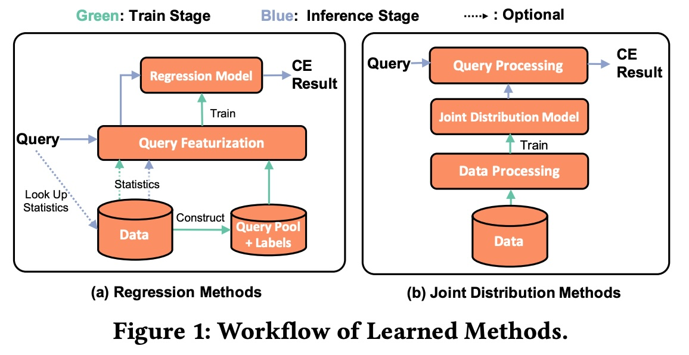  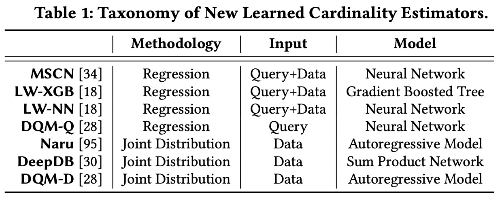  

#### 1. 回归方法 (Regression Methods)

* **也称为：** 查询驱动（Query-Driven）。
* **思路：** 把它当成一个“房价预测”问题。
    * **输入（X）：** 一个查询（Query）的特征，比如 `WHERE` 条件的范围、涉及哪些列等 。
    * **输出（Y）：** 一个数字（基数）。
* **工作流程（见图 1a）：** 
    ```mermaid
    graph LR
        A[查询 Query] --> B(查询特征化);
        B --> C(回归模型 MSCN, LW-XGB等);
        C --> D[CE 结果 Result];
    ```
* **论文中的代表：** MSCN, LW-XGB, LW-NN 。

#### 2. 联合分布方法 (Joint Distribution Methods)

* **也称为：** 数据驱动（Data-Driven）。
* **思路：** 这是一种更“野心勃勃”的方法。它不想“查询一个，估计一个”，它试图**学习整个数据表的联合概率分布** ，即 $P(A_1, A_2, ..., A_n)$ 。
* **比喻：** 它不是在学“怎么估计”，它是在学“怎么**生成**这份数据”。它像是在创造一个“数字孪生”或“合成数据”。一旦它学会了数据的完整样貌（包括所有列之间的复杂相关性），你再问它任何查询的基数，它都能从这个模型中“推算”出来。
* **论文中的代表：** Naru, DeepDB 。

---

### 🧱 知识模块五：评估维度：如何评价这些方法？

这篇论文之所以有价值，在于它建立了一个统一的“考场” 来全方位地“拷问”这些新方法。你需要理解它用了哪些“考题”：

1.  **准确度（Accuracy）：Q-Error**
    * 这是论文中最重要的评估指标 。
    * **公式：** $Q-Error = \frac{\max(\text{估计值}, \text{真实值})}{\min(\text{估计值}, \text{真实值})}$ 。
    * **解读：** Q-Error 越接近 1 越好。如果 Q-Error = 10，意味着你的估计要么高了10倍，要么低了10倍。这个指标对高估和低估的惩罚是对称的 。

2.  **成本（Cost）** 
    * **训练成本（Training Cost）：** 训练这些复杂的 ML 模型需要多长时间？（论文发现，可能需要几分钟甚至几小时，而传统方法只需要几秒钟 ）。
    * **推断成本（Inference Cost）：** 当优化器“问”模型一个查询的基数时，模型回答需要多久？（这个时间必须极短，最好在毫秒级，否则查询优化的时间比执行还慢 ）。

3.  **鲁棒性（Robustness）：静态 vs. 动态环境**
    * **静态环境（Static）：** 数据表万年不变 。
    * **动态环境（Dynamic）：** 这才是现实世界。数据会频繁地“增删改”（Updates）。
    * **拷问：** 当数据发生变化时，这些昂贵的 ML 模型能“跟上”吗？ 它们是需要（缓慢地）完全重新训练，还是可以（快速地）增量更新？这是论文的第二大关注点 。

4.  **可解释性与可预测性（Trustworthiness）**
    * **拷问：** 这些模型是不是“黑盒”（Black-box）？
    * 论文在第6节  提出了一个尖锐的问题：这些模型是否遵守基本的“逻辑”？比如，我把 `WHERE` 条件收紧（例如 `age > 30` 变为 `age > 40`），基数估计值**理应**变小或不变，但论文发现很多 ML 模型连这个都做不到 。这种“反常”的行为在生产环境中是不可接受的 。

### 总结

要读懂这篇文章，你需要带上三副“眼镜”：

1.  **数据库管理员（DBA）的眼镜：** 深刻理解“基数估计”对“查询优化器”的致命重要性。
2.  **数据科学家（ML）的眼镜：** 了解什么是“回归模型”和“概率分布模型”，以及它们如何被应用到“估计”这个任务上。
3.  **系统工程师（Engineer）的眼镜：** 不仅仅看“准确率”（Q-Error），更要残酷地考察“成本”（训练/推断时间）和“动态维护性”（数据更新）。

这篇论文的结论（剧透）是：虽然 ML 方法在**静态**环境下的**准确度**确实更高 ，但它们在高成本 、动态环境下的糟糕表现  以及不可预测的“黑盒”行为  方面，意味着我们离“准备好了”还有很长的路要走 。
  
## 2 解读论文 
  
很高兴为您解读这篇在数据库领域影响力很大的论文——《Are We Ready For Learned Cardinality Estimation?》（我们为“学习化的基数估计”做好准备了吗？）。

这篇论文像一篇“深度质检报告”。当时（2021年）学术界正对“用机器学习（ML）改造数据库”充满热情，而这篇论文则通过一次全面、严苛的“大横评”，冷静地指出了从“学术原型”到“工业落地”之间的巨大鸿沟。

**通俗概括：** 数据库需要“猜”一个查询会返回多少行数据（这叫“基数估计”），猜得准，查询就快；猜不准，查询就可能慢上千倍。

近年的研究说“用AI（机器学习）来猜，比数据库自带的老方法（如直方图）准得多！” 。

这篇论文的作者们则站出来说： **“等等，光准还不够，部署到真实系统里还有很多坑。”**  他们通过实验证明，尽管AI方法（新方法）在特定情况下（静态数据）确实更准 ，但它们**代价高昂**（训练和预测都慢）、**跟不上数据变化**（数据一更新就“抓瞎”），而且像个“黑盒”，行为**不可预测甚至违反逻辑** 。

因此，论文的**核心结论**是：**我们（工业界）还没有为“学习化的基数估计”做好准备。** 

-----

### 论文关键内容深度解读

为了理解这篇论文的贡献，我们需要理解它“拷问”了新方法（AI模型）的哪几个方面：

#### 1\. 核心问题：什么是“基数估计” (CE)？

  * **基数 (Cardinality):** 就是“行数”。
  * **基数估计 (CE):** 数据库在执行一个查询（Query）前，必须先制定一个“执行计划”（Query Plan）。比如是先用索引，还是先全表扫描？
  * **“猜”的重要性：** 优化器（Optimizer）制定计划的**最重要依据**，就是“猜”这一步操作会过滤出多少行数据 。
      * 如果它猜 `WHERE age > 30` 会返回10行，它可能会用索引（精细操作）。
      * 如果它猜会返回1000万行，它可能会用全表扫描（粗犷操作）。
  * **后果：** 这个“猜”一旦错得离谱（比如猜10行但实际是1000万行），优化器就会选出一个灾难性的计划，导致查询比最优计划**慢上几个数量级**（几百几千倍）。

#### 2\. “新AI方法” vs “老传统方法”

这篇论文将“选手”分成了两队（可以参考论文的图1和表1）：      

  * **新方法 (Learned Methods):** 使用先进的机器学习模型。
      * **回归方法 (Regression):** 把查询（Query）当作输入（X），基数当作输出（Y），训练一个回归模型（如MSCN, LW-XGB）。
      * **联合分布方法 (Joint Distribution):** 更激进，它试图学习整个数据表的“联合概率分布”（如Naru, DeepDB），相当于复刻了一个“数字孪生”数据 。
  * **老方法 (Traditional Methods):** 数据库产品（如Postgres, MySQL）和一些经典算法（如直方图、采样）。

#### 3\. “灵魂拷问”之一：静态环境（数据不变时），表现如何？

这是AI方法最擅长的“理想赛道”。

  * **发现1：确实更准 (Accuracy)。**
      * **证据（见表4）：** 论文使用 **Q-Error** 作为核心指标（越接近1越好，Q-Error=10表示估计值和真实值差了10倍）。  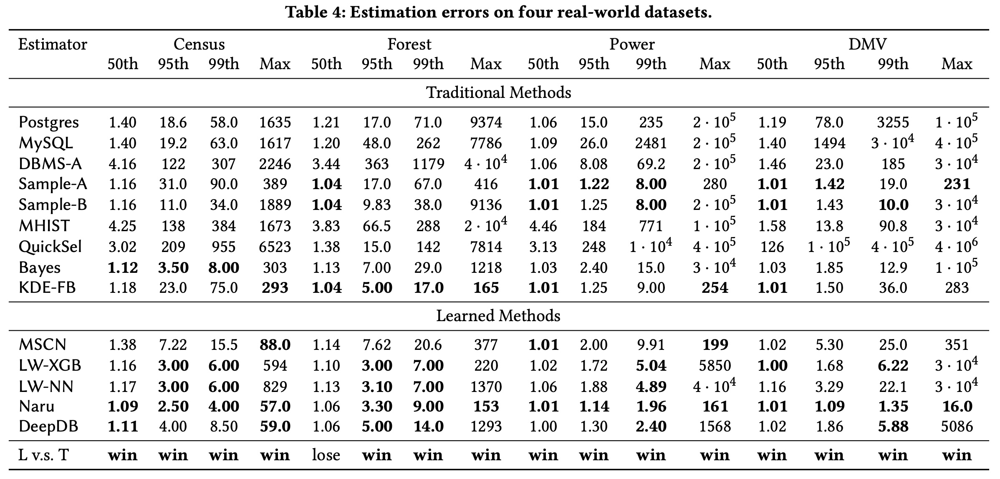  
      * 在所有4个真实数据集上，新方法（特别是Naru） 的误差全面碾压了老方法（包括Postgres, MySQL等）。
  * **发现2：代价高昂 (Cost)。**
      * **证据（见图5）：** 高精度是有代价的。  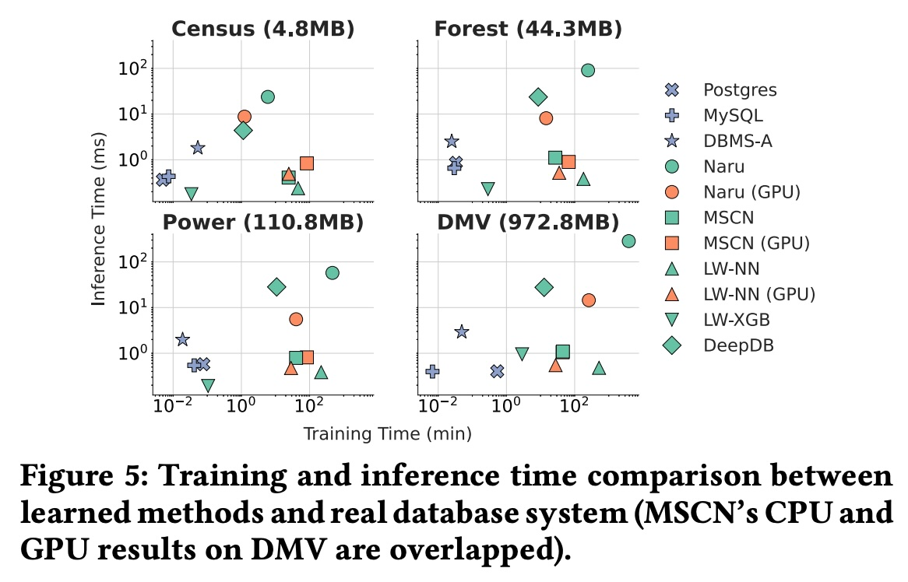  
      * **训练成本 (Training Time):** 老方法（DBMS）收集统计信息（相当于训练） **只需几秒钟** 。而新方法（如Naru）在GPU上训练也需要**几分钟到几小时** 。
      * **推断成本 (Inference Time):** 这是“致命”的。数据库优化器可能在毫秒内调用CE上百次 。
          * 老方法和部分回归模型（LW-XGB）非常快，低于1毫秒 。
          * 但更准的Naru和DeepDB，推断一次需要**5ms到25ms** ，这比老方法慢了**10-100倍**，对于高并发（OLTP）系统来说是**不可接受的** 。


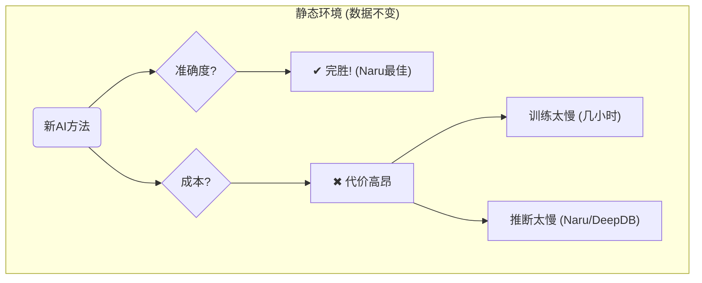

#### 4\. “灵魂拷问”之二：动态环境（数据在变时），表现如何？

这才是真实世界的“残酷赛道”，数据总是在频繁增删改（Updates）。

  * **发现1：完全跟不上 (Cannot Catch Up)。**
      * **证据（见图7）：**  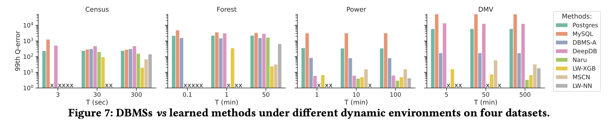  
          * 图7  展示了在不同数据更新周期（T）下的误差。T越小，代表数据更新越频繁。
          * **观察：** 当T很短（如DMV数据集T=5分钟）时，老方法（DBMS）因为更新统计信息极快，所以误差很低且稳定 。
          * 而新方法（如Naru, MSCN） **根本来不及完成一次更新（重新训练）** （在图7中显示为 "x"）。它们只能被迫使用“过时的模型”去估计“最新的数据”，导致误差爆炸 。
  * **发现2：进退两难 (Trade-off)。**
      * **证据（见图8）：** 就算数据更新没那么快，AI方法也面临“两难” 。  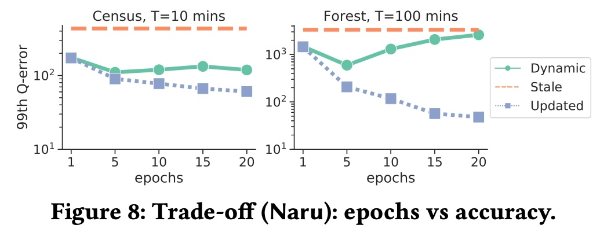  
      * **情景：** 假设模型需要10分钟来更新（训练）。
        1.  在这10分钟内，所有查询只能用 **“旧模型”** ，导致 **误差很大** 。
        2.  10分钟后，用上了 **“新模型”** ，**误差减小**。
      * **悖论：** 如果你为了“新模型”更准，选择训练更久（比如20分钟），那么“用旧模型”的时间就更长，导致总体的平均误差反而可能上升 。


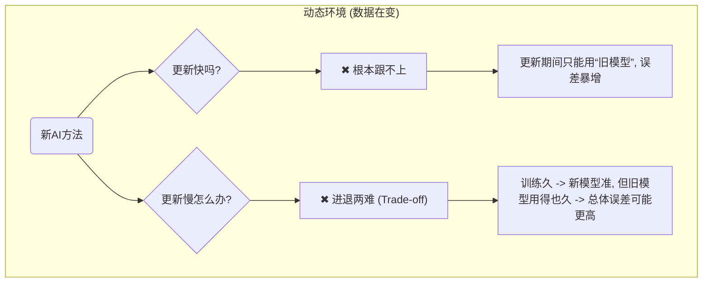

#### 5\. “灵魂拷问”之三：AI模型值得“信任”吗？(黑盒问题)

传统方法（如直方图）虽然不准，但它很简单、透明，你知道它为什么错（比如它假设了列独立）。而AI模型是“黑盒”。

  * **发现1：行为怪异，违反逻辑 (Illogical Behaviours)。**
      * **证据（见表5）：** 作者提出了5条数据库用户“想当然”的逻辑规则 ，结果AI模型纷纷“翻车” 。  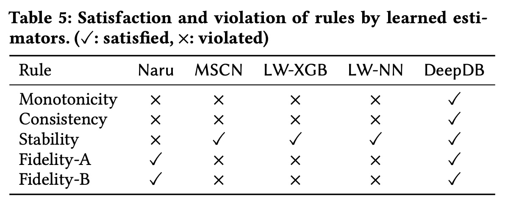  
      * **规则1：单调性 (Monotonicity)。** `WHERE age > 30` 的行数，理应**大于等于** `WHERE age > 30 AND city = '北京'` 的行数。
          * **结果：** MSCN, LW-XGB, LW-NN **全都违反了**！ 它们可能估算出加了条件（`city`）后行数反而变多了 。这对优化器来说是毁灭性的。
      * **规则2：稳定性 (Stability)。** 同一个查询，问多少次都该给同一个答案。
          * **结果：** Naru **违反了** 。因为它在预测时依赖“采样” ，导致同一个查询（真实值1036），Naru 2000次预测的结果在0到5992之间大幅波动（见图12）。  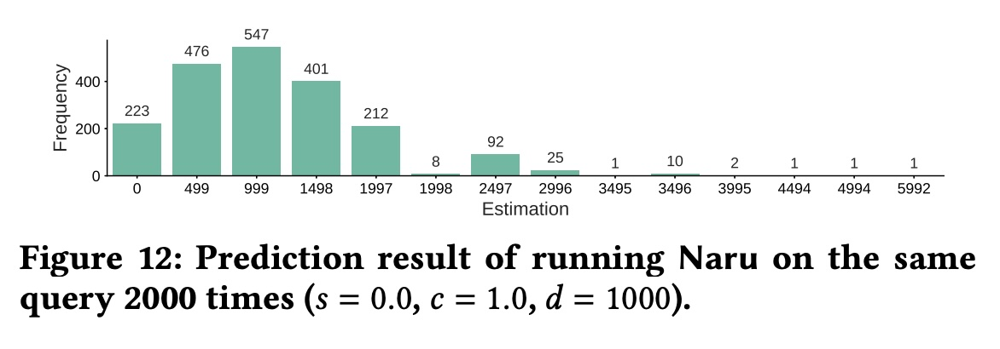  
  * **发现2：在特定数据上集体“翻车”。**
      * **证据（见图10a）：** 所有AI模型在处理“高相关性”数据时（如 `city` 和 `zip_code`）都会表现变差 ，尤其是当数据存在“函数依赖”时，误差会急剧上升 。 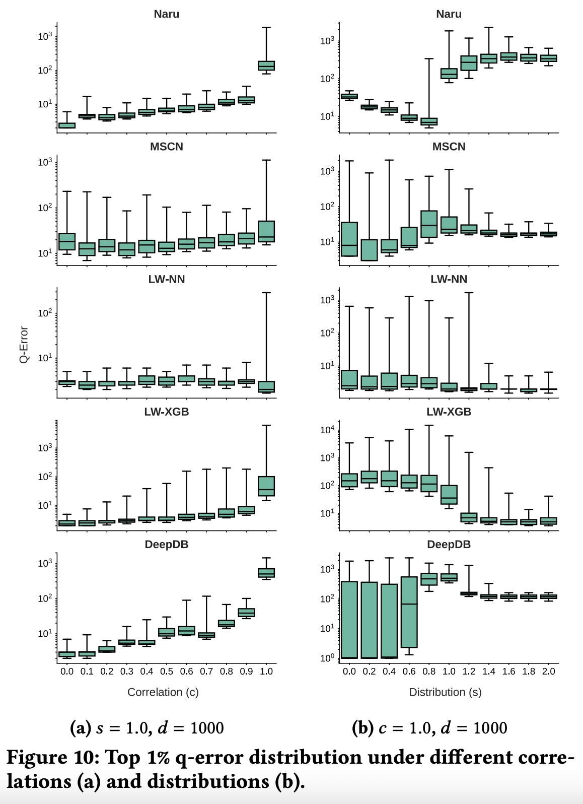  

### 总结：我们学到了什么？

这篇论文的伟大之处在于它定义了衡量一个数据库组件是否“可用”的**多维度标准**：不仅要**准 (Accurate)**，还要**快 (Efficient)**（训练和推断），**稳 (Robust)**（适应数据动态变化），以及**可信 (Trustworthy)**（行为符合逻辑）。

它告诉我们，学术界追求的“高准确度”只是第一步，而工业界真正关心的，是后三者带来的 **“稳定性”和“可预测性”** 。

最终，作者们谦逊地指出了未来的研究方向：

1.  **控制成本：** 如何平衡准确度与训练/推断效率 。
2.  **提高可信度：** 如何让模型变得可解释，并让其行为符合逻辑 。
  
## 3 术语 
  
好的，这篇论文《Are We Ready For Learned Cardinality Estimation?》是数据库（DB）和机器学习（ML）交叉领域的一篇重要“质检报告”。它详细评估了“用AI（学习化模型）来替代数据库核心组件”这件事到底靠不靠谱。

以下是理解这篇论文所必须掌握的关键术语，我将用通俗的语言为您讲解：

### 1\. 基数估计 (Cardinality Estimation, CE)

  * **通俗讲解：** 这是整篇论文的核心。 **“基数”** 就是 **“行数”** 。 **“基数估计”** 就是数据库在真正执行一个查询（Query）之前， **“猜测”** 这个查询会返回多少行数据的过程 。
  * **为什么重要：** 这个“猜测”的准不准，直接决定了数据库“大脑”（查询优化器）选择的执行计划是“天才”还是“灾难” 。一个错误的估计（比如猜10行，实际1000万行）可能会让查询**慢上成百上千倍** 。
  * **论文的讨论点：** 传统的“猜测”方法（如直方图）不准，所以学术界提出用AI模型来“猜”，这被称为 **“学习化的基数估计” (Learned Cardinality Estimation)** 。

### 2\. 查询优化 (Query Optimization)

  * **通俗讲解：** 这是数据库的“大脑”或“导航系统” 。当你输入一个SQL查询时，数据库可以有几十种甚至上万种方法去“算”出结果。
  * **它的工作：** “查询优化器”的唯一工作，就是在所有可能的“执行计划”（Query Plan）中，选择一个它**认为**成本最低、执行最快的那个 。
  * **与CE的关系：** 它“认为”的依据，就来自 **“基数估计”** 。基数估计是查询优化的基石。


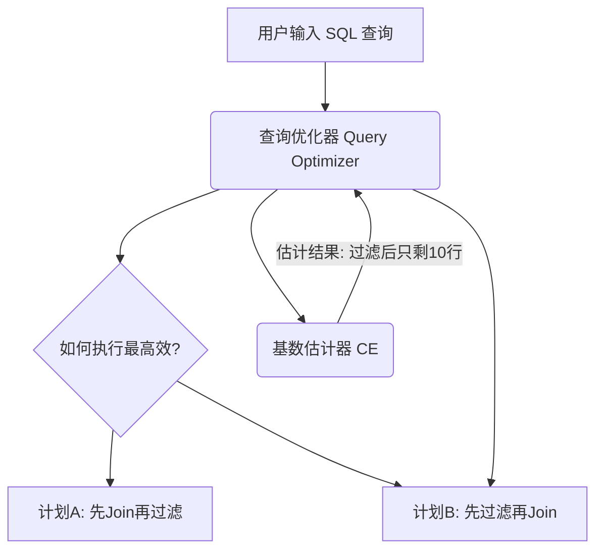

### 3\. 学习化方法 (Learned Methods) 的两大流派

这篇论文将当时先进的AI方法（新方法）分成了两大类 ，并用一张图（图1）清晰地展示了它们的工作流程：    

#### 3.1 回归方法 (Regression Methods) 

  * **也称为：** 查询驱动 (Query-Driven) 。
  * **通俗讲解：** 这种方法把CE当成一个“房价预测”问题。
  * **工作模式：** 它学习的是一个 “查询” 到 “基数” 的直接映射 。
      * **输入 (X)：** 一个查询（Query）的特征，比如 `WHERE age > 30`。
      * **输出 (Y)：** 一个数字（估计的基数）。
  * **论文中的代表：** MSCN, LW-XGB, LW-NN 。

#### 3.2 联合分布方法 (Joint Distribution Methods) 

  * **也称为：** 数据驱动 (Data-Driven) 。
  * **通俗讲解：** 这种方法“野心”更大。它不学习“查询”，它试图学习 **“数据本身”** 。
  * **工作模式：** 它试图构建一个模型来**完整复刻**原始数据表 $P(A_1, A_2, ..., A_n)$ ，相当于创造了一个“数字孪生”。
      * 当查询来时，它在自己这个“孪生数据”上估算结果。
  * **论文中的代表：** Naru, DeepDB 。

### 4\. Q-Error (Q-Error)

  * **通俗讲解：** 这是论文中用来衡量“猜得准不准”的**核心准确度指标** 。
  * **计算公式：**
    $Q-Error = \frac{\max(\text{估计值}, \text{真实值})}{\min(\text{估计值}, \text{真实值})}$ 
  * **如何理解：**
      * Q-Error 越接近 **1** 越好。
      * 假设真实行数是100。
      * 你猜 200 (高了2倍)：Q-Error = 200 / 100 = 2。
      * 你猜 50 (低了2倍)：Q-Error = 100 / 50 = 2。
      * 你猜 1000 (高了10倍)：Q-Error = 1000 / 100 = 10。
  * **论文发现：** AI方法（新方法）在准确度（Q-Error）上确实比传统方法（老方法）好得多 。

### 5\. 静态 vs. 动态环境 (Static vs. Dynamic Environments)

这是论文“拷问”AI模型的关键所在。

  * **静态环境 (Static Environment)：** 一个“理想实验室”，数据表被创建后**永远不变** 。论文发现AI模型在静态环境下表现很好 。
  * **动态环境 (Dynamic Environment)：** 这才是 **“真实世界”** ，数据表会 **频繁地发生“增、删、改” (Updates)** 。
  * **论文的灵魂拷问：** 当数据发生变化时，那些训练成本高昂的AI模型跟得上吗？
  * **论文发现：** **跟不上**。AI模型无法赶上快速的数据更新 。它们要么来不及更新，要么只能用“过时 (Stale)”的模型去猜测新数据，导致误差非常大 。

### 6\. 训练时间 vs. 推断时间 (Training vs. Inference Time)

这是衡量AI模型 **“成本”** 的两个维度。

  * **训练时间 (Training Time)：** 构建模型需要多长时间 。
      * **论文发现：** 传统方法（如Postgres）收集统计信息（相当于训练） **只需几秒** 。而AI模型（如Naru） **需要几分钟甚至几小时** 。
  * **推断时间 (Inference Time)：** “推断”就是“预测”。这是指模型训练好后，当优化器“提问”（给一个查询）时，模型 **“回答”（给出估计值）所需的时间** 。
      * **论文发现：** 这个时间**至关重要**，因为它发生在查询优化的“关键路径”上。传统方法回答极快（1毫秒内） 。但某些AI模型（如Naru, DeepDB）回答一次**需要5-25毫秒** ，这个延迟在真实系统中是**不可接受的** 。

### 7\. 黑盒 (Black-box)

  * **通俗讲解：** 这是指AI模型（特别是神经网络）的工作方式不透明。你只知道输入（查询）和输出（基数），但**不知道它“为什么”会给出这个答案** 。
  * **问题：** 这导致模型缺乏可解释性（Explainability） 和可调试性（Debuggability），甚至会出现“反常识”的行为。

### 8\. 逻辑规则 (Logical Rules) (如: 单调性 Monotonicity)

  * **通俗讲解：** 作者设计了一些“常识”规则来测试AI模型是否“可信” 。
  * **单调性 (Monotonicity) ：** 这是一个最基本的常识。
      * **例子：** “查询 `age > 30`” 的行数，**理应** 大于等于 “查询 `age > 30 AND city = '北京'`” 的行数。因为你增加了约束条件，结果行数只可能变少或不变。
  * **论文发现：** 很多AI模型（如MSCN, LW-XGB, LW-NN） **竟然违反了这条常识！** 。它们可能估算出加了条件后行数反而变多了。这说明它们根本“不理解”查询的逻辑，只是在机械地拟合数据，这是生产系统无法接受的。
  
## 参考        
         
https://arxiv.org/pdf/2012.06743    
        
<b> 以上内容基于DeepSeek、Qwen、Gemini及诸多AI生成, 轻微人工调整, 感谢杭州深度求索人工智能、阿里云、Google等公司. </b>        
        
<b> AI 生成的内容请自行辨别正确性, 当然也多了些许踩坑的乐趣, 毕竟冒险是每个男人的天性.  </b>        
    
#### [PolarDB 学习图谱](https://www.aliyun.com/database/openpolardb/activity "8642f60e04ed0c814bf9cb9677976bd4")
  
  
#### [PostgreSQL 解决方案集合](../201706/20170601_02.md "40cff096e9ed7122c512b35d8561d9c8")
  
  
#### [德哥 / digoal's Github - 公益是一辈子的事.](https://github.com/digoal/blog/blob/master/README.md "22709685feb7cab07d30f30387f0a9ae")
  
  
#### [About 德哥](https://github.com/digoal/blog/blob/master/me/readme.md "a37735981e7704886ffd590565582dd0")
  
  

  
