## AI论文解读 | Spark SQL: Relational Data Processing in Spark
        
### 作者        
digoal        
        
### 日期        
2025-11-10        
        
### 标签        
PostgreSQL , PolarDB , DuckDB , AI , 论文解读        
        
----        
        
## 背景  
      
https://dl.acm.org/doi/pdf/10.1145/2723372.2742797        
  
提示:          
```          
读懂《Spark SQL: Relational Data Processing in Spark》这篇论文需要提前掌握哪些基础知识, 请使用中文通熟易懂的讲解这些基础知识, 可以引用论文中的图、表或使用Markdown支持的图形(text,mermaid等)增加解释性. 
  
使用中文通熟易懂的解读《Spark SQL: Relational Data Processing in Spark》这篇论文, 其中的关键内容请着重讲解, 可以引用论文中的图、表或使用Markdown支持的图形(text,mermaid等)增加解释性. 
  
提取《Spark SQL: Relational Data Processing in Spark》这篇论文中的重要术语, 使用中文对这些术语进行通熟易懂的讲解, 可以引用论文中的图、表或使用Markdown支持的图形(text,mermaid等)增加解释性. 
```     
  
## 1 前置知识 
  
要透彻理解《Spark SQL: Relational Data Processing in Spark》这篇论文，你需要掌握一个跨越数据库、分布式系统和编程语言的知识体系。这篇论文的核心是介绍一个新模块（Spark SQL），它如何将 **关系型数据处理（SQL）** 的优点与 **Spark（一种分布式处理框架）** 的强大编程接口相融合。

以下是你需要储备的基础知识，我会用通俗的语言为你讲解：

### 核心知识图谱

为了更直观地展示这些知识点之间的关系，你可以参考下面的结构图：

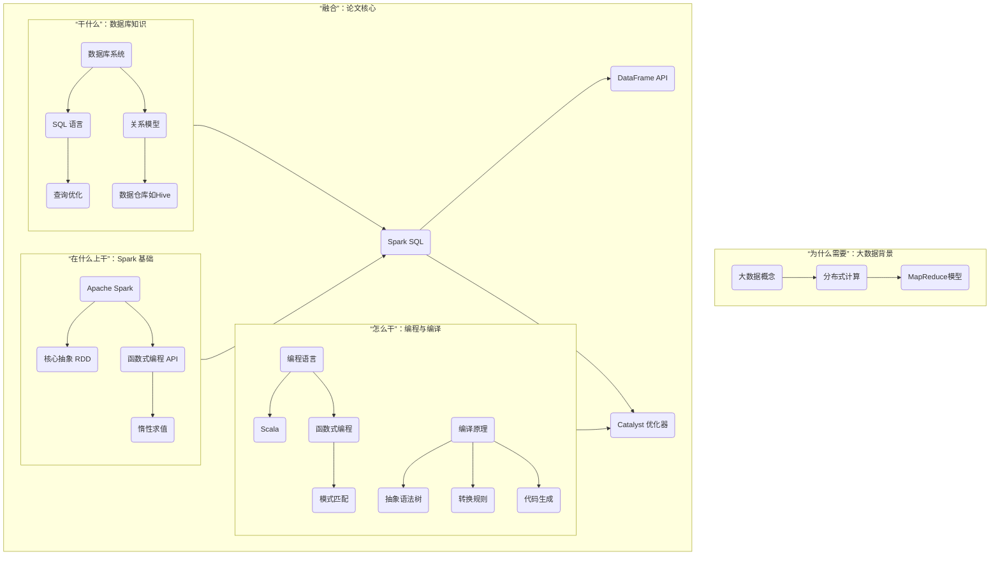

-----

### 1\. 基础背景：大数据与分布式计算

**你需要懂什么？**
你需要知道为什么数据处理会从单机走向集群，以及早期的集群处理模型（如 MapReduce）是什么。

  * **分布式计算 (Distributed Computing):** 简单说，就是“人多力量大”。当一份数据大到一台电脑处理不了时（比如 100TB），我们就把它切成很多小块，分给一个集群（比如 1000 台电脑）去并行处理，最后再把结果汇总起来。
  * **MapReduce:** 这是早期最著名的分布式计算模型。它把一个大任务分为两个阶段：**Map（映射）** 和 **Reduce（规约）** 。
      * **Map 阶段：** 就像你给 1000 个人每人一本书，让他们统计书里“Spark”这个词出现了多少次。
      * **Reduce 阶段：** 你再找 10 个人，每人负责收集 100 个人的统计结果，并把它们加起来。最后你再把这 10 个人的结果加总。
  * **局限性:** 论文提到，MapReduce 这样的系统虽然强大，但编程接口“低阶”且“过程式”。用户必须手动编写 Map 和 Reduce 的具体逻辑，非常繁琐，而且难以优化。

### 2\. 核心领域：数据库与 SQL

**你需要懂什么？**
你需要理解传统数据库是如何工作的，尤其是 SQL 语言及其背后的“魔法”—— 查询优化。

  * **声明式 vs 过程式:**
      * **过程式 (Procedural):** 就像你用 MapReduce，你必须告诉计算机“第一步干啥，第二步干啥”。
      * **声明式 (Declarative):** 就像你用 SQL，你只说“我想要什么”（`SELECT * FROM users WHERE age > 20`），而不用管数据库具体是怎么（是先过滤 `age` 还是先读 `users` 表）拿到这个结果的。
  * **SQL:** 一种声明式查询语言。它的最大好处是让用户从“如何做”中解脱出来，专注于“要什么”。
  * **查询优化 (Query Optimization):** 这是 SQL 的“魔法”所在。你写的 SQL 语句并不会被直接执行。数据库的“优化器”会先把它转换成多种可能的执行计划，然后估算每种计划的成本（比如 IO、CPU 消耗），最后选择一个它认为最快的计划去执行。例如，论文中提到的“谓词下推” 就是一种常见优化，即尽早地过滤数据。
  * **Hive:** 一个构建在 Hadoop 之上的数据仓库系统，它提供了 SQL 接口来查询存储在 HDFS 上的数据。Spark SQL 的前身 Shark 就是基于 Hive 改造的。

### 3\. 关键平台：Apache Spark 基础

**你需要懂什么？**
Spark SQL 是 Spark 的一个模块，你必须先了解 Spark 的核心抽象和运行原理。

  * **RDD (Resilient Distributed Datasets):** 这是 Spark 的核心抽象。你可以把它理解为一个**不可变**的、**分区**的、**可容错**的分布式对象集合。
      * **分布式：** 数据分布在集群的多个节点上。
      * **不可变：** 你不能修改一个 RDD，你只能通过一个 RDD **转换（Transformation）** 出一个新的 RDD（比如 `filter` 操作会生成一个新 RDD）。
      * **容错：** 如果某个节点挂了，RDD 可以通过“血缘关系”（即创建它的转换步骤）被自动重建。
  * **函数式 API:** Spark 提供了像 `map`, `filter`, `reduce` 这样的函数式操作。这比 MapReduce 灵活得多，但也还是“过程式”的——你依然在定义“如何做”。
  * **惰性求值 (Lazy Evaluation):** 这是 Spark 的一个核心特性。当你调用 `filter` 或 `map` 时，Spark **并不会立即执行**。它只是在内部默默地构建一个“计划图”（血缘）。直到你调用一个“行动（Action）”操作（如 `count` 或 `save`）时，Spark 才会真正开始计算。

> **为什么惰性求值很重要？**  
> 因为 Spark 在“真正执行”前，拿到了你**所有**的操作步骤。这给了它优化的空间，比如它可以把多个 `filter` 和 `map` 操作“流水线”式地合并在一起执行，避免产生不必要的中间数据。  

### 4\. 论文精髓：编程与编译原理（Catalyst 优化器）

这是理解这篇论文**最硬核**的部分。Spark SQL 的强大能力源于其高度可扩展的**Catalyst 优化器**。要理解 Catalyst，你需要一些编译原理和函数式编程的知识。

  * **Scala 与函数式编程:** Catalyst 是用 Scala 语言构建的，并大量使用了它的**函数式编程**特性。

  * **核心数据结构：树 (Tree):** Catalyst 的核心数据类型是“树”。无论是你写的 SQL 语句，还是 DataFrame 操作，第一步都会被转换成一个“抽象语法树”（AST）。

    比如论文中 **Figure 2** 就展示了表达式 `x + (1 + 2)` 是如何表示成一棵树的：  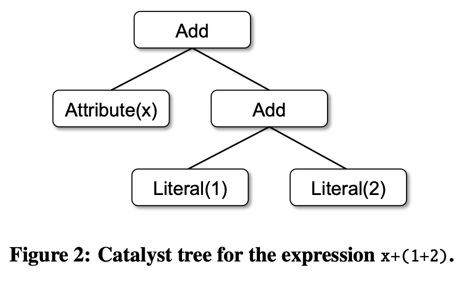  

    ```
         Add
        /   \
    Attribute(x) Add
                /   \
         Literal(1) Literal(2)
    ```

  * **核心操作：规则 (Rule):** Catalyst 的优化过程，就是不断地对这棵树应用一系列“规则”，将树“变换” 成一棵更优的树。

    论文给了一个绝佳的例子：

      * **规则：** `case Add(Literal(c1), Literal(c2)) => Literal(c1+c2)`
      * **含义：** 如果你（用模式匹配）发现树上有一个节点是 `Add`，并且它的左右两个子节点都是`Literal`（常量），那么就把这个 `Add` 节点替换成一个小节点 `Literal`，它的值是 `c1+c2`。
      * **效果：** 上面的树 `x + (1 + 2)` 就会被优化成 `x + 3`。

        ```
             Add
            /   \
        Attribute(x) Literal(3)
        ```

    这就是“常量折叠”，一种最基础的优化。

  * **Catalyst 的工作流程**
    论文中的 **Figure 3** 完美地总结了 Catalyst 的工作流，这是理解论文的关键：  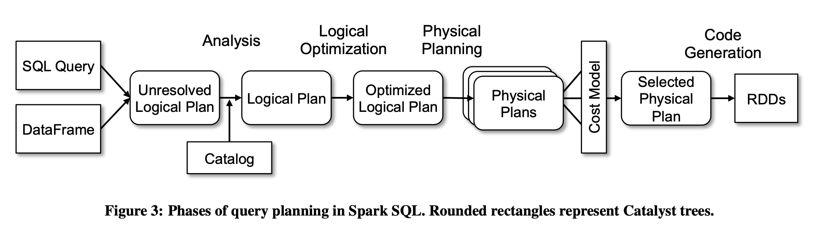  

    *(基于论文 Figure 3 的示意图)*

    1.  **SQL/DataFrame -\> Unresolved Logical Plan (未解析逻辑计划):**
        你写的代码（如 `df.filter("age > 21")`）首先被转换成一棵树。此时，它只知道你想要 `filter` 一个叫 "age" 的列，但它还**不知道** "age" 是什么类型（是整数还是字符串？），甚至**不知道**它是否存在。
    2.  **-\> Logical Plan (逻辑计划):**
        通过查询“元数据”（Catalog），Catalyst 搞清楚了 "age" 是一个整数列。这个过程叫“分析”（Analysis）。
    3.  **-\> Optimized Logical Plan (优化的逻辑计划):**
        Catalyst 在这里应用大量**基于规则的优化**，比如我们上面说的“常量折叠”，还有“谓词下推”（尽早过滤） 等。
    4.  **-\> Physical Plans (物理计划):**
        一个逻辑计划可以有**多种**物理执行方式。比如做 `join`（连接）操作，是该用“广播 Join” 还是“排序合并 Join”？Catalyst 会生成多种可能的物理计划。
    5.  **-\> Selected Physical Plan (被选中的物理计划):**
        Catalyst 会使用**成本模型（Cost Model）** 来估算每种物理计划的开销，然后选出一个它认为最快的。
    6.  **-\> RDDs (代码生成):**
        最后一步是**代码生成 (Code Generation)**。Catalyst 会把最终的物理计划“编译”成高效的 Java 字节码，这些字节码会直接操作 RDD。这一步能大大减少解释执行的开销。

-----

### 总结：你需要掌握的知识点

1.  **分布式：** 为什么需要 MapReduce 和 Spark。
2.  **数据库：** SQL 语言的“声明式”特性，以及“查询优化”的基本概念（如谓词下推）。
3.  **Spark：** RDD 的概念，`map`/`filter` 等转换操作，以及“惰性求值”的核心原理。
4.  **编译原理：** "抽象语法树" (AST) 是什么，以及“基于规则的优化”是如何（比如常量折叠）工作的。
5.  **函数式编程：** 了解 Scala（或任何一种函数式语言）中的“模式匹配” 会极大帮助你理解 Catalyst 的规则是如何工作的。

**一句话总结这篇论文：**

> 论文介绍的 Spark SQL，通过引入 **DataFrame API** 和 **Catalyst 优化器**，成功地将 SQL 的**声明式优化**能力（类似知识点2和4）赋予了 Spark 的**分布式计算引擎**（类似知识点1和3），让 Spark 既能处理复杂分析，又能高效运行 SQL 查询。  

希望这份指南能帮助你攻克这篇经典的论文！你希望我为你深入讲解 Catalyst 的某个特定优化阶段吗？
  
## 2 解读论文 
  
这是一篇对论文《Spark SQL: Relational Data Processing in Spark》的通俗解读。

Spark SQL 是 Apache Spark 中的一个模块 ，它解决了一个在大数据处理中非常棘手的问题：**如何将传统的“关系型处理”（比如 SQL 查询）与“过程化处理”（比如复杂的函数式编程）无缝结合起来**。

-----

### 💡 Spark SQL 解决了什么问题？

在 Spark SQL 出现之前，大数据处理主要有两种范式：

1.  **关系型系统（如 Hive, Impala）:**

      * **优点:** 用户可以通过 SQL 这种“声明式”语言查询数据，系统会自动进行优化 。
      * **缺点:** 很难执行 SQL 无法表达的复杂计算，比如机器学习或图计算 。

2.  **过程化系统（如 Spark RDD, MapReduce）:**

      * **优点:** 提供了强大、灵活的编程接口 ，可以实现几乎任何复杂的算法。
      * **缺点:** 编程门槛高，需要用户手动优化 ，而且系统不了解数据的内部结构，优化能力有限 。

开发者常常被迫在两者之间二选一 。而 Spark SQL 的目标就是搭建一座桥梁，让 Spark 程序员能享受到关系型处理（如声明式查询和优化）的好处 ，同时也让 SQL 用户能调用 Spark 中强大的分析库（如机器学习）。

### 🚀 论文的两大核心贡献

这篇论文介绍了 Spark SQL 实现这一目标的两大“法宝”：

1.  **DataFrame API：** 一个全新的编程接口，它在关系型（SQL）和过程化（Spark代码）处理之间提供了前所未有的紧密集成 。
2.  **Catalyst 优化器：** 一个基于 Scala 语言构建的、高度可扩展的查询优化器 ，它是 Spark SQL 的“大脑”。

-----

### 🔑 关键内容一：DataFrame API（统一的编程接口）

**DataFrame（数据帧）** 是 Spark SQL 最核心的抽象 。

  * **它是什么？** 你可以把它想象成一个 **“带有名称和类型的列（即 Schema）的分布式表格”** 。这很像 R 或 Python Pandas 中的 data frame 概念 。
  * **它有何不同？** 传统的 Spark RDD 只是“Java/Python 对象的集合” ，Spark 并不知道每个对象里面有什么。而 DataFrame 明确地记录了 Schema ，这为后续的优化打开了大门。

#### DataFrame 的“魔法”：惰性求值 (Lazy Evaluation)

这是理解 DataFrame 最关键的一点。当你对一个 DataFrame 执行操作时（比如 `where` 过滤或 `groupBy` 分组），**Spark SQL 并不会立即执行计算** 。

相反，它只是把你的操作构建成一个 **“逻辑计划”（Logical Plan）** 。只有当你真正需要结果时（比如调用 `count()` 计数或 `save()` 保存文件），它才会“触发”执行 。

> **这样做的好处是：** 因为 Spark SQL 拿到了你完整的计算蓝图（逻辑计划），它就有机会在真正执行前，通过 Catalyst 优化器对整个计划进行分析和优化 。

例如，在图 1 中，用户程序（无论是 Java、Scala 还是 Python）和 JDBC/Console 都通过 DataFrame API 或 SQL 与 Spark SQL 交互，而底层的 Catalyst 优化器则负责处理这些请求 。  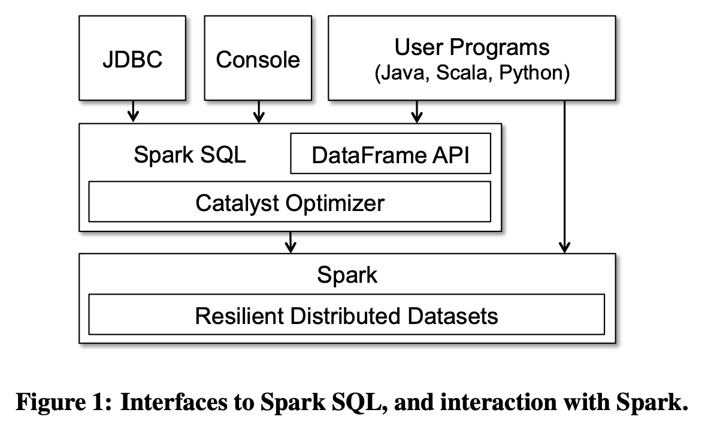  

-----

### 🔑 关键内容二：Catalyst（可扩展的“大脑”）

Catalyst 是 Spark SQL 的查询优化器 。它的设计目标就是 **“可扩展性”** —— 让开发者可以轻松地添加新的优化规则、数据源或数据类型 。

它主要使用 Scala 语言的函数式编程特性（如模式匹配）来构建 。

#### Catalyst 的工作流程（图 3 解读）

当一个 SQL 查询或 DataFrame 计划被提交后，Catalyst 会分四个阶段来处理它 ，这在论文的图 3 中有清晰的展示：    

```text
               [Catalog]
                  ↓
[SQL Query]  → [Unresolved Logical Plan] → Analysis → [Logical Plan]
[DataFrame] ↗                                                 ↓
                                                     Logical Optimization
                                                              ↓
                                                    [Optimized Logical Plan]
                                                              ↓
                                                     Physical Planning
                                                              ↓
                                                    [Physical Plans]
                                                              ↓
                                                    (Cost Model)
                                                              ↓
                                                   [Selected Physical Plan]
                                                              ↓
                                                     Code Generation
                                                              ↓
                                                         [RDDs]
```

*（基于图 3  的流程示意）*

1.  **分析 (Analysis):**

      * **输入:** 一个“未解析的逻辑计划” 。比如，你写了 `SELECT col FROM sales` ，此时系统还不知道 `col` 这一列是否存在，也不知道 `sales` 是哪张表。
      * **工作:** Catalyst 会查询一个叫 **Catalog**（元数据目录）的东西，来查找表和列的信息 ，完成解析，生成一个“逻辑计划” 。

2.  **逻辑优化 (Logical Optimization):**

      * **输入:** 解析后的“逻辑计划” 。
      * **工作:** 应用一系列 **基于规则（Rule-based）** 的优化 。比如，我们都熟悉的“谓词下推”（Predicate Pushdown） （即尽早过滤数据）就在这一步完成。

3.  **物理计划 (Physical Planning):**

      * **输入:** 优化后的“逻辑计划” 。
      * **工作:** 生成一个或多个 **“物理计划”** 。例如，对于一个 join 操作，物理计划可能会考虑是使用“广播 Join”（Broadcast Join）还是“排序合并 Join” 。
      * **决策:** Catalyst 会使用 **“成本模型”（Cost Model）** 来估算每个物理计划的执行成本 ，然后选择一个最优的“物理计划” 。

4.  **代码生成 (Code Generation):**

      * **输入:** 选中的“物理计划” 。
      * **工作:** 这是 Spark SQL 性能卓越的关键。Catalyst 不会逐行“解释”执行计划，而是将查询的许多部分**编译成 Java 字节码** 。
      * **好处:** 这种方式消除了大量的虚函数调用和分支判断 ，其性能（如图 4 所示）可以接近甚至达到手动调优的代码 。  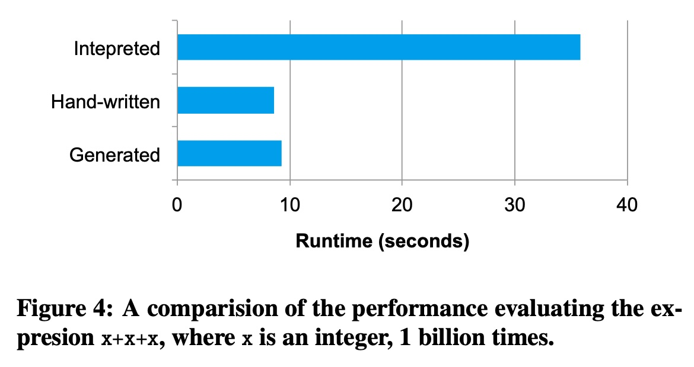  

-----

### 🌟 Spark SQL 的强大应用（基于 Catalyst）

得益于 Catalyst 的可扩展性，Spark SQL 轻松构建了许多强大的功能：

1.  **JSON 模式推断 (Schema Inference):**

      * 在处理半结构化的 JSON 数据时，你不需要手动定义 Schema 。Spark SQL 可以自动扫描一遍数据（或采样），推断出数据的结构（如图 5 和图 6 所示），让你能立即用 SQL 查询 JSON 。 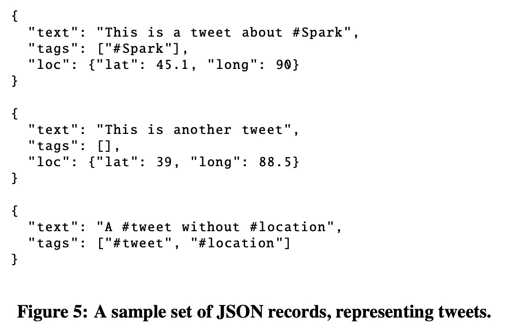  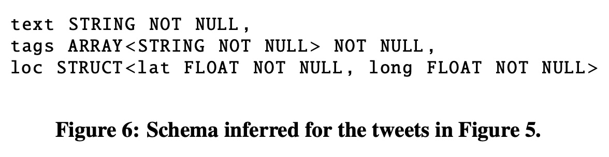  

2.  **机器学习集成 (ML Integration):**

      * Spark 的机器学习库 (MLlib) 使用 DataFrame 作为其“ML Pipeline”（机器学习流水线）API 的核心数据结构 。
      * 如图 7 所示，一个 ML 流水线（如：文本分词 → TF-IDF 特征提取 → 逻辑回归）中的每一步，都是在 DataFrame 中添加新的列（如 `words` 列、`features` 列）。这极大地简化了特征工程和模型训练的流程。  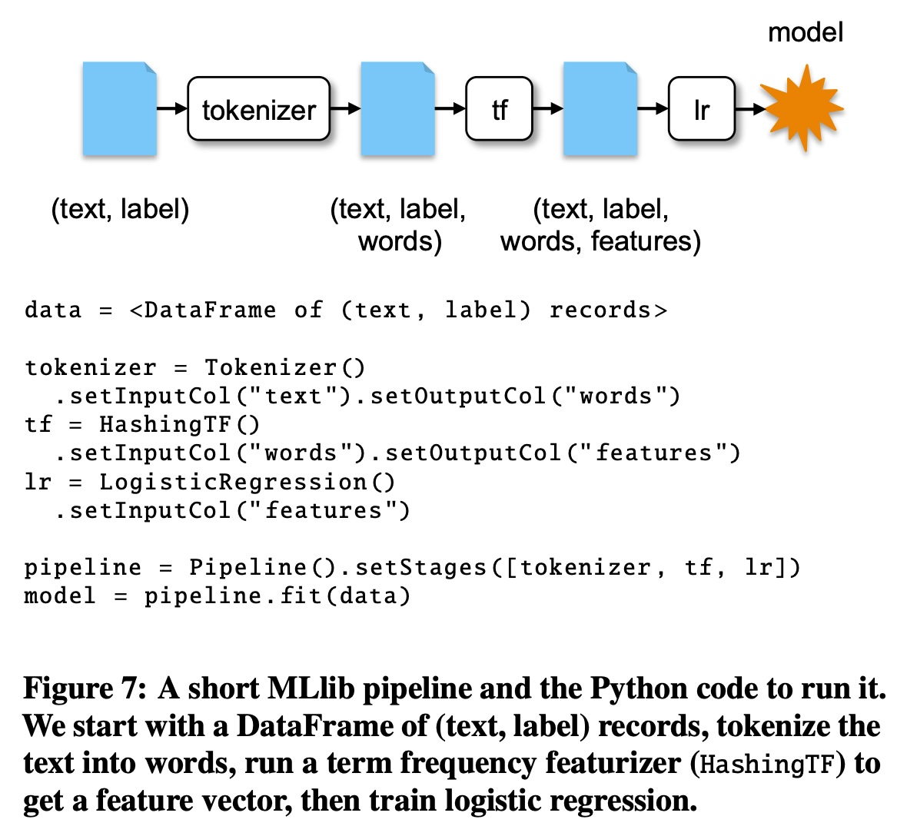  

3.  **查询联邦 (Query Federation):**

      * 通过可扩展的“数据源”API ，Spark SQL 可以在**一个查询里处理来自不同数据源的数据** 。
      * 例如，你可以将一个存在 MySQL 里的 `users` 表  和一个存在 HDFS 上的 `logs.json` 文件  进行 Join 查询 。Catalyst 还会智能地将过滤条件（如 `registrationDate > "2015-01-01"`）下推到 MySQL 数据库中执行，以减少数据传输 。

### 📊 性能评估（它真的快吗？）

论文通过一系列实验证明了 Spark SQL 的高效：

  * **对比 SQL 引擎 (图 8):** 在 SQL 查询上，Spark SQL 显著快于它的前身 Shark （主要归功于代码生成 ），并且与专用的 C++ 引擎 Impala 性能相当 。  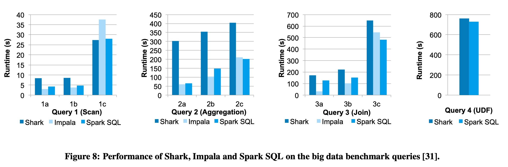  
  * **对比原生 Spark (图 9):** 对于同一个聚合任务，使用 DataFrame API 的代码比**手写的 Python RDD 代码快 12 倍** ，比**手写的 Scala RDD 代码快 2 倍** 。这是因为 Catalyst 进行了代码生成，避免了大量对象分配和解释器开销 。 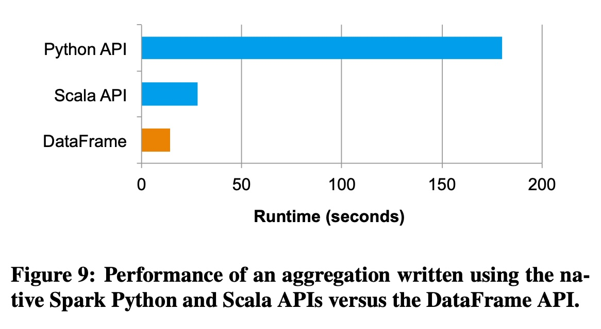  
  * **对比混合流水线 (图 10):** 对于一个“先 SQL 过滤，再 Spark 代码词频统计”的任务，使用 DataFrame API 的**一体化流水线比“先运行 Hive，再运行 Spark”的传统两阶段方法快 2 倍** 。因为它避免了将中间结果写入 HDFS 的昂贵开销 。  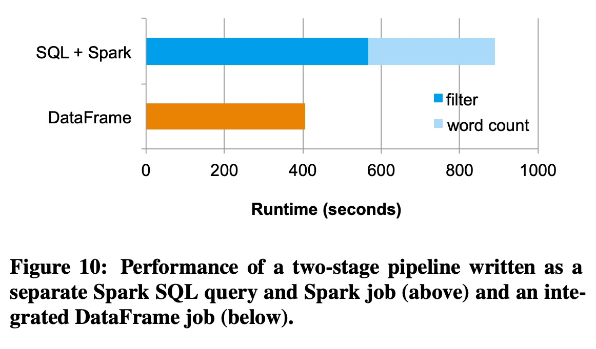  

### 总结

《Spark SQL》这篇论文的核心贡献在于，它展示了一种通过 **“DataFrame API”** 和 **“可扩展的 Catalyst 优化器”**  相结合的方式，成功地统一了关系型（SQL）和过程化（编程）两种大数据处理模型。

这不仅让 Spark 变得更易用、更强大，也为（当时）大数据系统的发展指明了一个重要方向：**融合与优化**。
  
## 3 术语 
  
根据《Spark SQL: Relational Data Processing in Spark》这篇论文，以下是其中一些最重要术语的通俗讲解。

-----

### 🚀 核心概念

#### 1\. Spark SQL

  * **这是什么？** 它是 Apache Spark 上的一个模块 。
  * **通俗讲解：** Spark SQL 的目标是让 Spark 既能处理“关系型”数据（像操作数据库一样，使用 SQL 或结构化 API），也能处理“过程化”数据（像传统的 Spark 编程一样，进行复杂的函数计算）。它是在 Spark 早期项目 Shark 的经验基础上构建的 。

#### 2\. RDD (Resilient Distributed Datasets - 弹性分布式数据集)

  * **这是什么？** 它是 Spark 原生的、最基础的编程抽象 。
  * **通俗讲解：** 你可以把 RDD 想象成一个分布在集群上、 **“不透明”的 Java 或 Python 对象集合** 。
  * **局限性：** “不透明”是关键。Spark 引擎并不知道 RDD 里面对象的具体结构（Schema）。比如，当你对一个 `RDD[User]` 对象使用 `filter` 函数时，Spark 只知道你在调用一个函数，但**无法理解函数内部的逻辑**（比如 `user.age < 20`）。这导致 Spark 很难自动优化你的代码。

#### 3\. DataFrame (数据帧)

  * **这是什么？** 这是 Spark SQL 提供的**核心编程接口** ，也是对 RDD 的一个重要进化。
  * **通俗讲解：** 如果说 RDD 是“不透明的”对象集合，那么 DataFrame 就是一个 **“透明的”、带有 Schema（列名和类型）的分布式“表格”** 。这非常类似于 R 或 Python Pandas 中的 data frame 概念 。
  * **关键优势：** 因为 DataFrame “知道”自己的结构（Schema），所以 Spark SQL 可以查看你的操作（比如 `df.where("age < 20")`），理解其**语义**，然后利用 Catalyst 优化器自动进行优化（比如自动下推过滤器）。
  * **惰性求值 (Lazy Evaluation)：** 你对 DataFrame 的所有操作（如 `where`, `groupBy`）并不会立即执行 。相反，它们只是在构建一个“逻辑计划”。只有当你执行一个“输出操作”（比如 `count()` 或 `save()`）时，Spark SQL 才会把整个计划交给 Catalyst 优化器，优化后再执行 。

-----

### 🧠 核心引擎：Catalyst 优化器

#### 4\. Catalyst Optimizer (Catalyst 优化器)

  * **这是什么？** 它是 Spark SQL 的“大脑”，一个新颖的、**高度可扩展**的查询优化器 。
  * **通俗讲解：** Catalyst 的工作就是把你写的 SQL 或 DataFrame API 代码，转变成一个在集群上高效执行的物理计划。
  * **构建方式：** 它巧妙地利用了 Scala 语言的函数式编程特性（特别是**模式匹配**）来构建 。
  * **核心数据结构：** 在 Catalyst 内部，你所有的查询、表达式、逻辑计划和物理计划，都被表示为一种数据结构：**树 (Tree)** 。
  * **核心机制：** 优化过程就是通过一系列**规则 (Rules)** 来转换这些树 。一条规则就是一个函数，它会“匹配”树中特定的模式，然后将其转换为一个更优化的新树 。

#### 5\. Catalyst 的查询处理阶段

Catalyst 将查询优化的过程分为了四个主要阶段，如下图（基于论文图3）所示：    

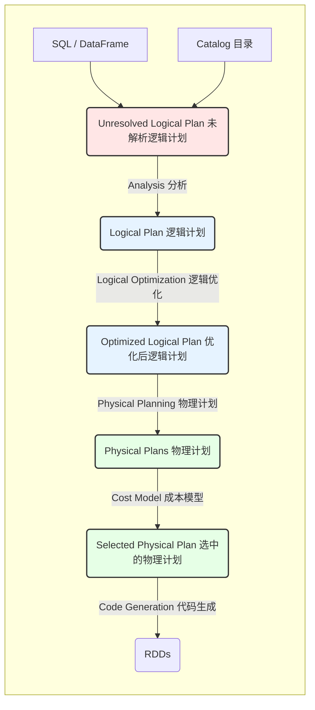

  * **1. 分析 (Analysis):**

      * **输入：** “未解析的逻辑计划” 。比如，你写了 `SELECT col FROM sales`，此时系统还不知道 `col` 这一列是否存在，也不知道 `sales` 是哪张表 。
      * **工作：** Catalyst 会查询一个叫 **Catalog（目录）** 的元数据管理器，来找出表、列名及其类型，完成解析 。如果找不到（比如你拼错了列名），在这一步就会报错。
      * **输出：** “逻辑计划”。

  * **2. 逻辑优化 (Logical Optimization):**

      * **输入：** “逻辑计划”。
      * **工作：** 应用一系列基于**规则**的优化 。最经典的例子就是**谓词下推 (Predicate Pushdown)** 。

    > 比如，你写了 `T1.join(T2).where(T1.value > 10)`。
    > Catalyst 会自动将其优化为 `T1.where(T1.value > 10).join(T2)`。
    > 这样就可以在 Join 之前就过滤掉 T1 中的大量数据，极大提高效率。

  * **3. 物理计划 (Physical Planning):**

      * **输入：** “优化后的逻辑计划”。
      * **工作：** 生成一个或多个可执行的“物理计划” 。例如，对于一个 Join 操作，逻辑上都是“Join”，但物理上可以是“广播 Join”、“排序合并 Join”等不同算法 。
      * **决策：** Catalyst 会使用一个**成本模型 (Cost Model)** 来估算每个物理计划的执行成本（比如根据表的大小），然后选择一个最优的物理计划 。

  * **4. 代码生成 (Code Generation):**

      * **输入：** “选中的物理计划”。
      * **工作：** 这是 Spark SQL 的性能“杀手锏” 。
      * **通俗讲解：** 传统的数据库会“解释执行”查询计划，即一行一行地评估。而 Spark SQL（特别是针对CPU密集型的内存计算）会把查询树的许多部分**直接编译成Java字节码**来运行 。这消除了大量虚函数调用和分支判断，其性能（如论文图4所示）可以接近手动编写的程序 。    

-----

### 🔌 关键特性与扩展点

#### 6\. Quasiquotes (准引用)

  * **这是什么？** 这是 Catalyst 用于“代码生成”阶段的一项 Scala 语言特性 。
  * **通俗讲解：** Quasiquotes 允许开发者在运行时，以一种类型安全的方式，**像“拼接字符串”一样方便地“拼接”和构造代码（抽象语法树）** 。这使得 Catalyst 在生成用于执行查询的Java字节码时变得极其简单和灵活 。

#### 7\. Data Sources API (数据源接口)

  * **这是什么？** 这是 Catalyst 的一个**公共扩展点** 。
  * **通俗讲解：** 它允许任何人（包括第三方开发者）为 Spark SQL 添加对新数据格式的支持 。
  * **例子：** 无论是 Parquet 、CSV 、JSON ，还是 Avro  和 JDBC（连接外部数据库），它们在 Spark SQL 中都一视同仁，都实现了这个接口。
  * **优化：** 该接口允许数据源实现**优化下推**。例如，`PrunedFilteredScan` 接口允许 Spark SQL 告诉数据源：“我只需要 ‘name’ 和 ‘age’ 这两列（**Pruned**，列裁剪），并且只想要 ‘age \> 30’ 的行（**Filter**，谓词过滤）” 。如果数据源（比如 Parquet 或数据库）很“聪明”，它就可以只返回Spark所需的最少量数据。

#### 8\. Schema Inference (模式推断)

  * **这是什么？** 一项为 JSON 这类半结构化数据设计的便捷功能 。
  * **通俗讲解：** 在处理 JSON 数据时，你**不需要手动定义它复杂的嵌套结构（Schema）** 。
  * **工作方式：** Spark SQL 可以自动扫描一遍数据（或数据样本），分析所有字段，然后为你推断出一个统一的 Schema 。
  * **例子：** 论文的图5和图6展示了这一点 。
      * **输入 (图5):** 几个 JSON 记录，其中一个 `loc.lat` 是 45.1 (浮点数)，另一个是 39 (整数) 。    
      * **推断 (图6):** Spark SQL 会智能地将该字段的类型推断为 `FLOAT`（浮点数），因为这是能同时兼容两个值的“最具体超类型” 。   
  
## 参考        
         
https://dl.acm.org/doi/pdf/10.1145/2723372.2742797    
        
<b> 以上内容基于DeepSeek、Qwen、Gemini及诸多AI生成, 轻微人工调整, 感谢杭州深度求索人工智能、阿里云、Google等公司. </b>        
        
<b> AI 生成的内容请自行辨别正确性, 当然也多了些许踩坑的乐趣, 毕竟冒险是每个男人的天性.  </b>        
    
#### [PolarDB 学习图谱](https://www.aliyun.com/database/openpolardb/activity "8642f60e04ed0c814bf9cb9677976bd4")
  
  
#### [PostgreSQL 解决方案集合](../201706/20170601_02.md "40cff096e9ed7122c512b35d8561d9c8")
  
  
#### [德哥 / digoal's Github - 公益是一辈子的事.](https://github.com/digoal/blog/blob/master/README.md "22709685feb7cab07d30f30387f0a9ae")
  
  
#### [About 德哥](https://github.com/digoal/blog/blob/master/me/readme.md "a37735981e7704886ffd590565582dd0")
  
  

  
