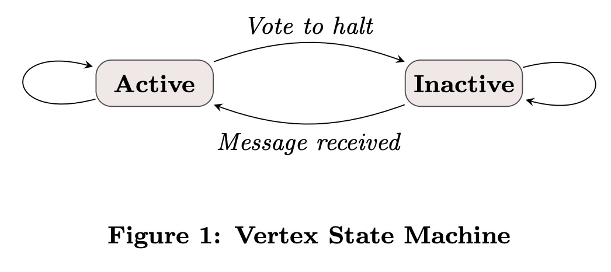
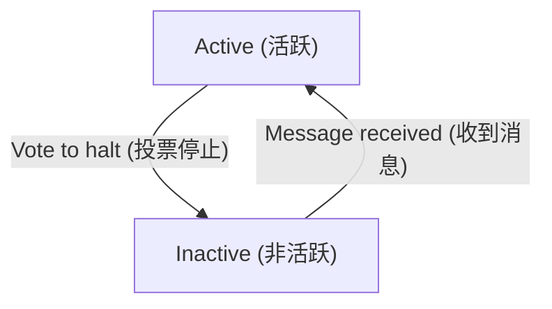
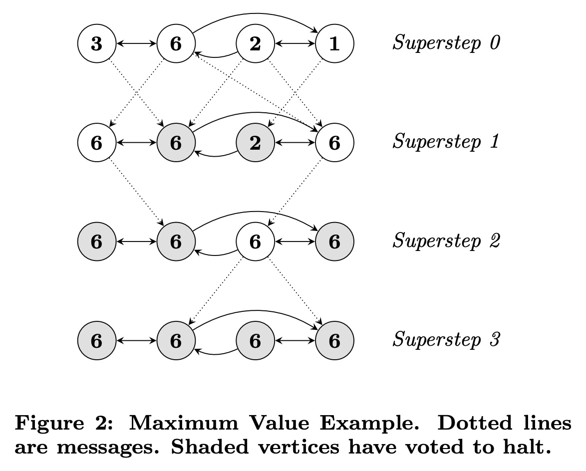
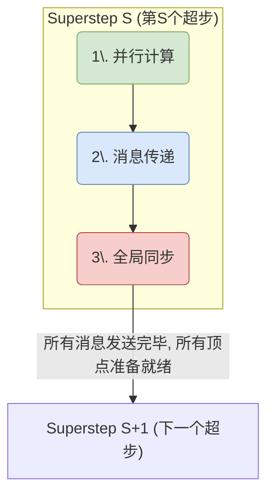
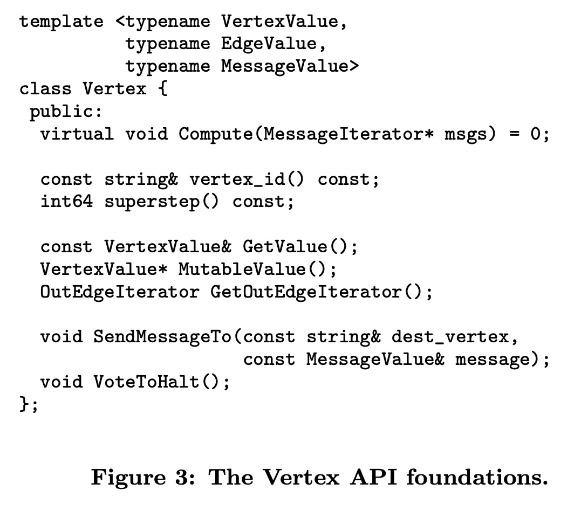
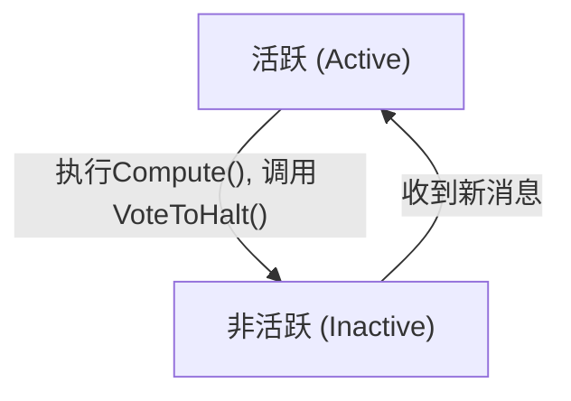
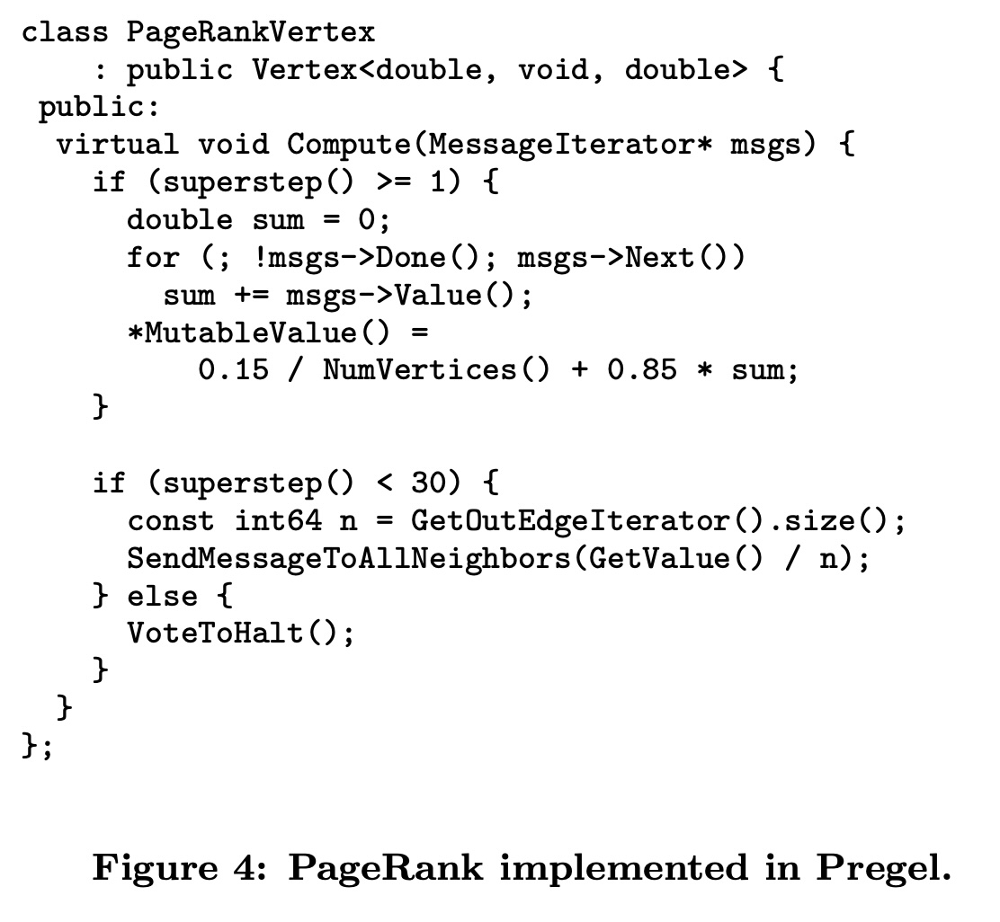

## AI论文解读 | Pregel: A System for Large-Scale Graph Processing
        
### 作者        
digoal        
        
### 日期        
2025-11-10        
        
### 标签        
PostgreSQL , PolarDB , DuckDB , AI , 论文解读        
        
----        
        
## 背景  
      
https://web.cs.ucdavis.edu/~amenta/f15/pregel.pdf        
  
提示:          
```          
读懂《Pregel: A System for Large-Scale Graph Processing》这篇论文需要提前掌握哪些基础知识, 请使用中文通熟易懂的讲解这些基础知识, 可以引用论文中的图、表或使用Markdown支持的图形(text,mermaid等)增加解释性. 
  
使用中文通熟易懂的解读《Pregel: A System for Large-Scale Graph Processing》这篇论文, 其中的关键内容请着重讲解, 可以引用论文中的图、表或使用Markdown支持的图形(text,mermaid等)增加解释性. 
  
提取《Pregel: A System for Large-Scale Graph Processing》这篇论文中的重要术语, 使用中文对这些术语进行通熟易懂的讲解, 可以引用论文中的图、表或使用Markdown支持的图形(text,mermaid等)增加解释性. 
```     
  
## 1 前置知识 
  
要读懂《Pregel: A System for Large-Scale Graph Processing》这篇论文，你需要对几个关键领域的知识有基本的了解。Pregel 是一个由 Google 开发的，用于处理海量图（Graph）数据的计算框架 。

你可以把它想象成一个“**图计算领域的 MapReduce**”。MapReduce 擅长处理批量数据，而 Pregel 擅长处理节点之间关系复杂、需要多轮迭代计算的图数据 。

以下是你需要提前掌握的基础知识，我会尽量用通俗的语言来解释：

### 1\. 基础知识一：什么是“图”？ (图论基础)

你不需要成为图论专家，但至少要知道图的基本构成：

  * **顶点 (Vertex):** 就是图中的“点”，比如社交网络中的“用户”，网页图中的“网页” 。
  * **边 (Edge):** 就是连接顶点的“线”，比如用户之间的“好友关系”，网页之间的“链接” 。
  * **有向图 (Directed Graph):** 论文中提到 Pregel 的输入是“有向图” 。这意味着边是有方向的，比如微博上的“关注”（我关注你，不等于你关注我）。
  * **图处理 (Graph Processing):** 指的是在图上进行的计算。论文中提到了几个经典例子 ：
      * **最短路径 (Shortest Paths):** 比如地图导航，找到从 A 点到 B 点的最短路线 。
      * **PageRank:** 网页排名算法，计算网页的重要性 。
      * **聚类 (Clustering):** 把关系紧密的节点（比如社交网络中经常互动的人）划分到同一个群组 。

### 2\. 基础知识二：为什么需要“大规模”系统？ (分布式系统)

当图变得非常巨大时，一台计算机是无法处理的。

  * **规模问题:** 论文提到，图的规模可达“数十亿个顶点”和“数万亿条边” 。你的电脑内存肯定放不下。
  * **分布式集群:** 解决方案是使用“数千台普通计算机”组成的集群 。Pregel 就是一个能在这种集群上运行的框架。
  * **Master/Worker 架构:** 这是分布式系统最常见的架构。Pregel 也使用这种架构 。
      * **Master (主节点):** 负责协调任务，论文中提到 Master 负责协调所有 Worker 的活动 。
      * **Worker (工作节点):** 负责干活，每个 Worker 负责图的一部分（称为分区，Partition）。
  * **容错 (Fault-Tolerance):** 当你用几千台电脑时，总有几台会“挂掉”。系统必须有能力在不中断计算的情况下处理这种失败。Pregel 使用“检查点 (Checkpointing)”机制来实现容错 。

### 3\. 基础知识三：Pregel 的核心计算模型

这是理解这篇论文最关键的部分。Pregel 的计算模型受到 **BSP (Bulk Synchronous Parallel, 批量同步并行) 模型** 的启发 。

#### 什么是 BSP 模型？

你可以把 BSP 理解为一种“**回合制**”的并行计算。所有计算被分解为一系列的“**超步 (Supersteps)**” 。

一个“超步”包含三个阶段：

1.  **并行计算:** 每个计算单元（在 Pregel 中就是“顶点”）独立运行自己的计算 。
2.  **消息通信:** 计算单元之间互相发送消息 。
3.  **全局同步:** 等待所有计算单元都完成计算和消息发送后，才一起进入下一个“超步” 。

#### Pregel 的 "以顶点为中心" (Vertex-Centric) 思想

Pregel 最大的特点是它要求你“**像一个顶点一样思考**” 。

你只需要编写一个函数（论文中称为 `Compute()` 方法 ），这个函数会在**每个**顶点上执行。

在这个函数里，一个顶点能做的事情很固定 ：

1.  **接收消息:** 接收在**上一个**超步 (S-1) 中其他顶点发给它的消息。
2.  **修改状态:** 修改自己的值（比如更新自己的 PageRank 值或最短路径距离）。
3.  **发送消息:** 向其他顶点（通常是它的邻居）发送消息，这些消息将在**下一个**超步 (S+1) 中被接收。
4.  **投票停止 (Vote to Halt):** 如果一个顶点觉得自己的计算完成了，它就“投票停止” 。

#### 算法如何结束？

这是一个非常巧妙的设计。一个顶点一旦投票停止，它就进入“**非活跃 (Inactive)**”状态 。

  * 如果一个非活跃的顶点收到了新的消息，它会在下一个超步被自动唤醒，变为“**活跃 (Active)**”状态 。
  * 当**所有**顶点都处于“非活跃”状态，并且系统中没有在途的消息时，整个计算就终止了 。

论文中的 **图 1 (Figure 1)**  完美地展示了这个状态机：    



*参考论文中的 Figure 1: Vertex State Machine*

#### 一个简单的例子：找最大值

为了帮你理解，可以看论文中 **图 2 (Figure 2)**  的例子：计算图中所有节点的最大值。    

1.  **Superstep 0:**  每个顶点（比如值为 3, 6, 2, 1）将自己的值发给所有邻居。
2.  **Superstep 1:**  顶点 3 收到邻居的 6，发现 6 \> 3，于是把自己的值更新为 6，并把 6 发给它的邻居。顶点 1 收到 2 和 6，把自己的值更新为 6。顶点 2 和 6 发现收到的值不比自己大，不更新，也不发送消息（并投票停止）。
3.  **Superstep 2:**  顶点 2 收到来自顶点 1（现在是6）的消息，更新自己为 6。
4.  **Superstep 3:**  没有顶点再收到更新的消息，所有顶点都投票停止，算法结束。

### 总结

要读懂 Pregel，你需要带着以下几个问题去阅读：

1.  **图论:** 它在解决什么图问题？（如 PageRank, 最短路径 ）
2.  **分布式:** 它如何将一个巨大的图拆分到几千台机器上？（分区 ）
3.  **并行模型:** “超步 (Superstep)” 是如何工作的？ 
4.  **编程模型:** “以顶点为中心 (Vertex-Centric)” 到底是什么意思？（`Compute()` 函数 ）
5.  **核心机制:** 消息是如何发送和接收的？  算法是如何停止的？（Vote to Halt ）

掌握了这些基础知识，你就能更容易地理解 Pregel 的设计思想和它为什么能高效地处理大规模图计算了。

-----

您是想让我详细解释其中某个知识点（比如 BSP 模型或“以顶点为中心”的思想），还是想了解 Pregel 如何具体实现 PageRank 算法呢？
  
## 2 解读论文 
  
这是一篇开创性的论文，它介绍了一个专门为“**大规模图处理**”而设计的计算框架——**Pregel** 。

你可以这样理解：在 Pregel 出现之前，如果你想处理海量的图数据（比如整个互联网的网页链接，或者几十亿人的社交网络 ），你可能需要使用像 MapReduce 这样的通用框架 。但这就像用一把普通的锤子去拧螺丝，非常别扭且效率低下 。

Pregel 的核心贡献在于，它提出了一个 **“以顶点为中心”(Vertex-Centric)** 的编程模型 ，让程序员可以“**像一个顶点一样思考**”。你只需要编写一小段逻辑（“我这个顶点该做什么”），Pregel 框架就会帮你处理掉所有棘手的分布式问题，比如数据分布、并行执行、消息通信和容错 。

下面，我们来详细解读 Pregel 的关键内容。

### 1\. 核心思想：BSP 与“超步”(Supersteps)

Pregel 的计算模型受到了**BSP (Bulk Synchronous Parallel, 批量同步并行)** 模型的启发 。

它把整个计算过程分解为一系列的 **“超步”(Supersteps)** 。你可以把“超步”想象成游戏中的“回合”。在一个回合（超步）中，所有玩家（顶点）同时行动，然后大家一起等待回合结束，再进入下一个回合。

一个“超步”的流程如下：



1.  **并行计算 (Compute):** 框架会为**每个活跃的顶点**调用一次你编写的 `Compute()` 函数 。在这个函数里，顶点可以读取它在 *上一个* 超步 (S-1) 收到的消息 。
2.  **消息传递 (Message Passing):** 在 `Compute()` 函数中，顶点可以决定给其他顶点发送消息 。
3.  **全局同步 (Synchronization):** 当所有顶点都完成了自己的计算和消息发送后，系统会进行一次全局同步 。

最关键的一点是：**一个顶点在超步 S 发送的消息，只能在超步 S+1 被接收** 。

这种“回合制”的设计极大地简化了编程：程序员不需要处理复杂的并发、死锁或数据竞争问题 ，因为在一个超步内，所有顶点都是独立执行的。

### 2\. 关键机制一：“以顶点为中心”的编程 (API)

Pregel 要求程序员继承一个 `Vertex` 类，并实现核心的 `Compute()` 方法 。

在 `Compute()` 函数内部，一个顶点能做的事情非常明确（参考论文中的 Figure 3 ）：    

  * `GetValue()` / `MutableValue()`: 读取或修改**自己**的“状态值”（比如 PageRank 值）。
  * `GetOutEdgeIterator()`: 遍历**自己**的所有“出边”，知道自己的邻居是谁 。
  * `SendMessageTo(dest_vertex, message)`: 向任何顶点（不一定是邻居）发送一条消息 。
  * `superstep()`: 知道当前是第几个“超步”（回合）。
  * `VoteToHalt()`: **投票停止**（这是算法结束的关键，下面会详讲）。

你只需要站“一个顶点”的角度去思考：“我收到一些消息，根据这些消息和我的当前状态，我应该更新我的状态，并给我的邻居们发什么新消息？”

### 3\. 关键机制二：算法如何停止？(Vote to Halt)

这是 Pregel 设计中非常精妙的一点。算法是如何知道自己已经计算完成的？

Pregel 使用了一个“**投票停止 (Vote to Halt)**”机制 。

  * **状态机:** 每个顶点都有两种状态： **“活跃”(Active)** 和 **“非活跃”(Inactive)** 。
  * **启动:** 在超步 0，所有顶点默认都是“活跃”的 。
  * **运行:** 只有“活跃”的顶点才会在当前超步执行 `Compute()` 函数 。
  * **投票:** 当一个顶点认为自己没事可做了（比如，它的值已经收敛），它可以在 `Compute()` 结束时调用 `VoteToHalt()`，让自己在*下一个*超步变为“非活跃”状态 。
  * **唤醒:** 如果一个“非活跃”的顶点**收到了消息**，它会自动在*下一个*超步被唤醒，变回“活跃”状态 。
  * **终止:** 当**所有**顶点都处于“非活跃”状态，**并且**系统中没有任何在途消息时，整个算法就终止了 。

我们可以用论文中的 **Figure 1**  来清晰地展示这个状态流转：    



> *基于论文 Figure 1 的状态机示意图*

### 4\. 实例解读：PageRank (论文 Figure 4)

我们来看看论文中 PageRank 算法的实现（见 Figure 4 ），这能最好地展示 Pregel 的思想：    

```cpp
// 这是一个简化的 C++ 风格伪代码
class PageRankVertex : public Vertex<double, void, double> {
  // Vertex<顶点值类型, 边值类型, 消息类型>
  
  virtual void Compute(MessageIterator* msgs) {
    
    // 1. (Superstep >= 1) 接收消息, 计算新的PageRank值
    if (superstep() >= 1) {
      double sum = 0;
      for (; !msgs->Done(); msgs->Next()) { // 遍历所有收到的消息
        sum += msgs->Value(); // 把收到的PR贡献值加起来
      }
      *MutableValue() = 0.15 / NumVertices() + 0.85 * sum; // 更新自己的值
    }

    // 2. (Superstep < 30) 发送消息
    if (superstep() < 30) {
      const int64 n = GetOutEdgeIterator().size(); // 获取邻居数量
      SendMessageToAllNeighbors(GetValue() / n); // 把自己的PR值平分给所有邻居
    } 
    // 3. (Superstep >= 30) 停止
    else {
      VoteToHalt(); // 30轮后, 投票停止
    }
  }
};
```

*（代码解读基于）*

这个例子清晰地展现了“超步”模型：

  * **Superstep 0:** 所有顶点都是活跃的，它们执行 `Compute()`。此时 `superstep() < 30` ，它们会把自己的初始值（比如 `1 / NumVertices()` ）发送给邻居。它们**不会**进入 `superstep() >= 1` 的逻辑，因为它们还没收到消息。
  * **Superstep 1:** 所有顶点都收到了来自邻居的消息，因此它们都是“活跃”的。它们会执行 `superstep() >= 1` 的逻辑，计算新的 PageRank 值 。然后，它们再次执行 `superstep() < 30` 的逻辑，把**新**的 PageRank 值发给邻居 。
  * **...**
  * **Superstep 30:** 顶点们最后一次计算和更新自己的值（因为它们收到了 Superstep 29 发送的消息）。然后，它们进入 `else` 逻辑，调用 `VoteToHalt()` 。
  * **Superstep 31:** 所有顶点都处于“非活跃”状态，并且（因为 Superstep 30 没有发送任何消息）系统中没有在途消息。算法终止 。

### 5\. 关键优化：Combiners 与 Aggregators

#### 1\. Combiners (合并器)

  * **问题：** 假设一个顶点 A 有 1000 个邻居，这 1000 个邻居都要在超步 S 给 A 发送一个消息（比如，在“求和”算法中都发送数字 1）。这会导致 A 在超步 S+1 收到 1000 条消息，网络和缓冲压力巨大 。
  * **解决：** Pregel 允许用户定义一个 `Combiner` 。系统可以在消息发送前（或接收后）自动将发往**同一顶点**的消息进行合并 。
  * **例子：** 对于求和，系统可以将这 1000 条 `1` 的消息合并为一条 `1000` 的消息。这要求操作必须满足**交换律和结合律** 。在最短路径算法中，使用 Combiner（只保留最短的距离）可以减少超过四倍的消息量 。

#### 2\. Aggregators (聚合器)

  * **问题：** 顶点都是“各自为战”的，它们如何知道一些“全局”信息？比如：
    1.  图中总共有多少条边？
    2.  算法是否已经收敛了（比如，所有顶点的值在上一个超步的变化总和小于某个阈值）？
  * **解决：** `Aggregator` (聚合器) 是一个全局通信、监控和数据的机制 。
  * **流程：**
    1.  **超步 S:** 每个顶点都可以给一个 Aggregator “喂”一个值 。
    2.  **同步阶段:** 系统使用一个“归约操作”（如 Sum, Min, Max）将所有值合并为一个全局值 。
    3.  **超步 S+1:** **所有**顶点都可以读取到这个全局的聚合结果 。

### 6\. 架构与容错

  * **架构:** Pregel 采用经典的 **Master/Worker** 架构 。
      * **Master:** 负责协调。它不处理图数据，而是告诉所有 Worker 何时开始一个超步，何时结束 。它还负责聚合 Aggregator 的值 。
      * **Worker:** 负责具体的计算。每个 Worker 分配到图的一部分（称为“分区”，Partition）。Worker 负责维护其分区内所有顶点的状态，并执行 `Compute()` 函数 。
  * **容错 (关键特性):** 在上千台机器的集群中，机器故障是常态 。Pregel 必须能处理故障。
      * **机制：Checkpointing (检查点)** 。
      * **流程：** Master 会定期（比如每几个超步）指示所有 Worker 把它们当前的状态（所有顶点的的值、边的值、消息队列）保存到持久化存储上 。
      * **恢复：** 当一个或多个 Worker 挂掉后 ，Master 会检测到，并让所有 Worker 从**最近的一次有效检查点**统一恢复状态，然后重新开始计算 。

### 总结

Pregel 的核心贡献是提供了一个**抽象层**。它成功地将图算法的 **“并行逻辑”** （程序员写的 `Compute()`）与 **“分布式实现”** （框架处理的通信、同步、容错）分离开来。

通过“以顶点为中心”和“超步”模型，它极大地降低了编写大规模、容错的并行图算法的难度，让程序员可以专注于算法本身，而不是底层的系统复杂性 。
  
## 3 术语 
  
好的，这是对《Pregel: A System for Large-Scale Graph Processing》论文中关键术语的提取和通俗讲解。

### 1\. 核心计算模型

#### 📍 Superstep (超步)

  * **通俗讲解：** 这是 Pregel 计算的“**回合**” 。Pregel 的整个计算过程被分解为一系列同步进行的“超步”（或称为迭代） 。
  * **工作流程：** 在一个“超步”中，框架会为每个活跃的顶点调用一次计算函数（`Compute`），顶点可以并行地处理消息、更新自己的状态，并为**下一个**超步发送消息 。当所有顶点都完成了，系统会进行一次“全局同步”，然后再一起进入下一个“超步” 。
  * **示意图：**
    ```mermaid
    graph TD
        subgraph "Superstep S (第S回合)"
            A(1\. 并行计算) -- "所有顶点独立执行Compute()" --> B(2\. 消息传递);
            B -- "顶点向其他顶点发消息" --> C(3\. 全局同步);
        end
        C -- "同步点(Barrier)" --> D["Superstep S+1 (第S+1回合)"];
        style A fill:#D5E8D4,stroke:#82B366
        style B fill:#DAE8FC,stroke:#6C8EBF
        style C fill:#F8CECC,stroke:#B85450
    ```

#### 📍 Vertex-Centric (以顶点为中心)

  * **通俗讲解：** 这是一种编程范式，也是 Pregel 的核心思想 。你不需要从全局视角编写程序，而是只需要“**像一个顶点一样思考**” 。
  * **具体做法：** 程序员只需要编写一个在**单个顶点**上执行的函数（即 `Compute` 函数） 。在这个函数里，你定义一个顶点如何“接收消息、修改自身状态、并向邻居发送消息” 。Pregel 框架会负责在整个图的**所有**顶点上并行执行这个逻辑 。

#### 📍 `Compute()` 函数

  * **通俗讲解：** 这是 Pregel 程序员需要编写的**唯一核心函数** 。
  * **职责：** 这个函数定义了单个顶点在单个“超步”内的所有行为 。它可以读取上一个超步发给该顶点的消息 ，修改顶点的内部值或其出边的值 ，以及向其他顶点发送消息（这些消息将在下一个超步被送达） 。

### 2\. 算法流程与终止

#### 📍 Vote to Halt (投票停止)

  * **通俗讲解：** 这是 Pregel 中算法的“**刹车机制**” 。当一个顶点认为自己的计算已经完成（比如，它的值已经收敛，不需要再更新了），它就可以调用 `VoteToHalt()` 来“投票”让自己进入“非活跃”状态 。

#### 📍 Active / Inactive State (活跃 / 非活跃状态)

  * **通俗讲解：** 这是顶点的两种状态，用来控制计算是否继续 。
      * **Active (活跃):** 只有活跃的顶点才会在当前的“超步”中执行 `Compute()` 函数 。
      * **Inactive (非活跃):** 投票停止的顶点会进入此状态 。
  * **唤醒机制 (关键)：** 一个“非活跃”的顶点并不会永久休眠。**如果它在后续的超步中收到了其他顶点发来的消息**，它会在下一个超步自动被唤醒，重新变为“活跃”状态 。
  * **算法终止：** 当**所有**顶点都处于“非活跃”状态，**并且**系统中没有任何“在途消息”时，Pregel 框架就知道整个计算完成了，算法终止 。
  * **图示 (参考论文 Figure 1)：**    
    > *论文中的图1 (Figure 1) 完美地展示了这个状态机*
    ```mermaid
    graph TD
        A["Active (活跃)"] -- "执行Compute(), 调用 VoteToHalt()" --> B["Inactive (非活跃)"];
        B -- "收到新消息 (Message received)" --> A;
    ```

### 3\. 系统架构与容错

#### 📍 Master/Worker (主/从架构)

  * **通俗讲解：** Pregel 是一个分布式系统，它包含一个“**总指挥**”（Master）和一群“**干活的**”（Workers） 。
      * **Master：** 负责协调所有 Worker 的活动 。比如，它告诉所有 Worker：“开始超步 S！”，等所有 Worker 都报告完成后，它再宣布：“好，现在开始超步 S+1！”。Master 还负责管理容错和聚合器（见下文） 。
      * **Worker：** 实际执行计算的节点 。每个 Worker 负责管理图的一部分（称为分区） 。

#### 📍 Partitions (分区)

  * **通俗讲解：** 因为图非常大，一台机器放不下，所以 Pregel 会把图“**切**”成很多块，每一块就是一个“分区” 。
  * **分配：** Master 会把这些“分区”分配给不同的 Worker 机器 。一个 Worker 可以负责一个或多个分区 。Pregel 默认使用哈希函数（`hash(ID) mod N`）来决定一个顶点属于哪个分区 。

#### 📍 Checkpointing (检查点)

  * **通俗讲解：** 这是 Pregel 的“**存档**”机制，用于实现容错 。
  * **流程：** 在某个“超步”开始时，Master 会命令所有 Worker 把它们当前负责的分区的状态（包括所有顶点的值、边的值和收到的消息）保存到持久化存储（比如 GFS 或 Bigtable）上 。
  * **恢复：** 如果某个 Worker 机器在计算过程中“挂了”，Master 会检测到 。然后，Master 会让所有可用的 Worker 从 **最近的一次“存档”** 中恢复数据，并重新执行后续的“超步” 。这样就避免了从头开始计算，保证了计算的可靠性 。

### 4\. 优化与高级功能

#### 📍 Combiner (合并器)

  * **通俗讲解：** 一种用于减少网络消息量的**优化技巧** 。
  * **场景：** 想象一下，在计算“最短路径”时，一个顶点 V 可能同时收到 100 个邻居发来的“距离”消息。但 V 真正关心的只是这些消息中的“**最小值**” 。
  * **作用：** 用户可以定义一个 `Combiner`（比如 `Min` 函数）。系统会在消息发送前（或在接收端缓冲时）自动运行它 。它会把发往同一个顶点的 100 条“距离”消息合并成**一条**（只包含最小值的）消息 。这要求操作必须满足交换律和结合律 。
  * **效果：** 论文提到，在某些算法（如单源最短路径）上，使用 Combiner 可以将消息流量减少四倍以上 。

#### 📍 Aggregator (聚合器)

  * **通俗讲解：** 一种“**全局广播**”或“**全局统计**”的工具 。
  * **场景：** 在“以顶点为中心”的模型中，每个顶点都是“近视眼”，它只知道自己和邻居。如果我们需要知道一些全局信息（比如“全图总共有多少条边？”或“所有顶点的 PageRank 值是否都已收敛？”）怎么办？
  * **作用：**
    1.  **超步 S：** 每个顶点都可以向一个 Aggregator 提供一个值（比如，顶点 A 报告“我的边数是 5”） 。
    2.  **同步阶段：** Master 会使用一个归约操作（如 Sum, Max, Min）把所有 Worker 提交的值汇总成一个**全局值**（比如，Sum=“全图总边数”） 。
    3.  **超步 S+1：** **所有**顶点都可以读取到这个全局的聚合结果 。

#### 📍 Topology Mutations (拓扑变异)

  * **通俗讲解：** 允许算法在运行中**修改图的结构** 。
  * **功能：** 在 `Compute()` 函数中，顶点可以发出请求来“增加”或“删除”顶点和边 。
  * **应用：** 这对于某些算法很有用，比如聚类算法，它可能想把一个“簇”合并成一个新顶点 ；或者最小生成树算法，它可能想删除所有非树的边 。这些修改请求会在下一个超步中生效 。
  
## 参考        
         
https://web.cs.ucdavis.edu/~amenta/f15/pregel.pdf    
        
<b> 以上内容基于DeepSeek、Qwen、Gemini及诸多AI生成, 轻微人工调整, 感谢杭州深度求索人工智能、阿里云、Google等公司. </b>        
        
<b> AI 生成的内容请自行辨别正确性, 当然也多了些许踩坑的乐趣, 毕竟冒险是每个男人的天性.  </b>        
    
#### [PolarDB 学习图谱](https://www.aliyun.com/database/openpolardb/activity "8642f60e04ed0c814bf9cb9677976bd4")
  
  
#### [PostgreSQL 解决方案集合](../201706/20170601_02.md "40cff096e9ed7122c512b35d8561d9c8")
  
  
#### [德哥 / digoal's Github - 公益是一辈子的事.](https://github.com/digoal/blog/blob/master/README.md "22709685feb7cab07d30f30387f0a9ae")
  
  
#### [About 德哥](https://github.com/digoal/blog/blob/master/me/readme.md "a37735981e7704886ffd590565582dd0")
  
  

  
