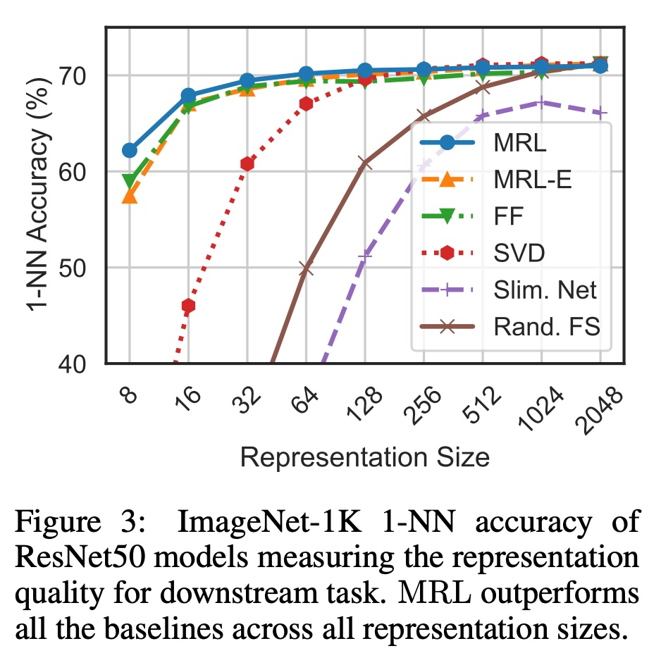
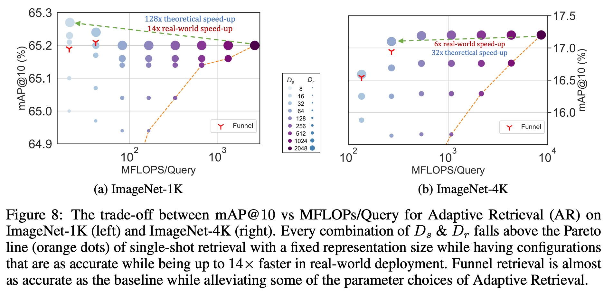
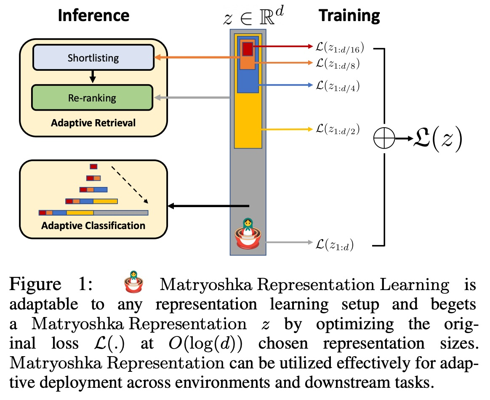
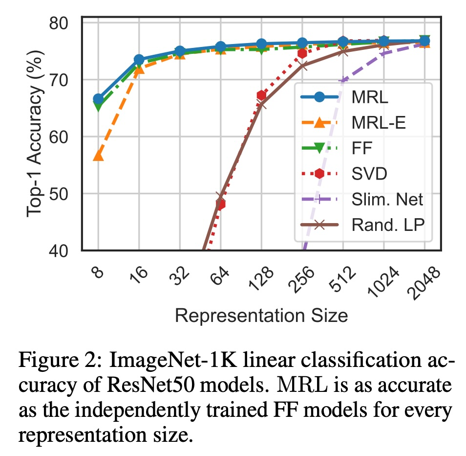
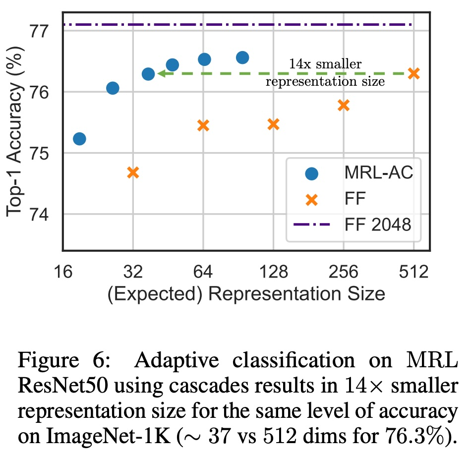

## AI论文解读 | Matryoshka Representation Learning
        
### 作者        
digoal        
        
### 日期        
2025-11-10        
        
### 标签        
PostgreSQL , PolarDB , DuckDB , AI , 论文解读        
        
----        
        
## 背景  
      
https://arxiv.org/pdf/2205.13147        
  
提示:          
```          
读懂《Matryoshka Representation Learning》这篇论文需要提前掌握哪些基础知识, 请使用中文通熟易懂的讲解这些基础知识, 可以引用论文中的图、表或使用Markdown支持的图形(text,mermaid等)增加解释性. 
  
使用中文通熟易懂的解读《Matryoshka Representation Learning》这篇论文, 其中的关键内容请着重讲解, 可以引用论文中的图、表或使用Markdown支持的图形(text,mermaid等)增加解释性. 
  
提取《Matryoshka Representation Learning》这篇论文中的重要术语, 使用中文对这些术语进行通熟易懂的讲解, 可以引用论文中的图、表或使用Markdown支持的图形(text,mermaid等)增加解释性. 
```     
  
## 1 前置知识 
  
要读懂《Matryoshka Representation Learning》（Matryoshka，即俄罗斯套娃）这篇论文 ，你需要提前了解一些机器学习和深度学习的基础概念。这篇论文的核心思想非常巧妙，它提出了一种方法，让一个神经网络模型学习到的“表征”（embedding，或称嵌入）像套娃一样，层层嵌套，但每一层都是一个完整、可用的“小套娃” 。

这篇论文的标题“Matryoshka” (套娃) 就是一个绝佳的比喻 。想象一个高维度的表征（比如2048维）是一个大套娃。这篇论文的方法能确保当你只取出它的前128维时，你得到的不是一个“残缺”的娃娃，而是另一个完整、小巧、但依然精致的“套娃”。

以下是理解这篇论文所需的核心基础知识，我会用通俗的语言为你讲解：

### 1. 什么是“表征学习” (Representation Learning)?

这是最核心的概念。在AI领域，“表征”或“嵌入”(Embedding) 指的是**将复杂的数据（如图片、文字）转换成一个由数字组成的向量（Vector）** 。

* **目的：** 这个数字向量（比如 `[0.1, -0.5, 1.2, ...]`) 就像是数据在“语义地图”上的坐标。它的神奇之处在于：
    * **语义相近，坐标也相近。** 比如，“猫”的图片和“狗”的图片所对应的向量，在空间中的距离会比“猫”和“汽车”的向量距离更近。
* **如何得到：** 我们使用深度学习模型（如ResNet 、BERT ）来“学习”这个映射关系。

这篇论文要解决的，就是如何学到**更高效、更灵活**的表征向量 。

---

### 2. 为什么需要“灵活”的表征？(论文要解决的问题)

传统的表征是“刚性”的 。比如，一个模型被训练用来产生2048维的表征。

* **问题：** 不同的下游任务（downstream tasks）有不同的计算资源限制 。
    * **场景A (云端服务器)：** 资源充足，可以使用高精度、高维度的2048维表征，效果最好。
    * **场景B (手机App)：** 资源有限，存储和计算2048维向量太慢、太耗电。你可能只想要一个128维的表征。

* **传统做法的困境：**
    1.  **训练多个模型：** 为场景A训练一个2048维的模型，再为场景B单独训练一个128维的模型 。这非常昂贵且难以维护。
    2.  **事后压缩 (SVD)：** 先训练一个2048维的模型，然后用数学方法（如SVD，一种降维技术）硬把它“压缩”到128维 。
    3.  **信息弥散：** 神经网络在训练时，倾向于将信息“分散”到所有2048个维度上 。如果你粗暴地只取前128维（如论文中的 `Rand. LP` 基线 ），效果会非常差。

* **MRL的目标：** 训练**一个**模型，它输出一个2048维的向量。这个向量的前128维 *本身* 就是一个高质量的128维表征；前64维 *本身* 也是一个高质量的64维表征，以此类推 。这样，服务器可以用完整的2048维，手机App可以只加载并使用前128维，实现“一套算法，多端部署” 。

---

### 3. 如何评判表征的好坏？(核心下游任务)

要证明你的“表征”学得好，你得用它来做点事。这篇论文主要做了两个任务：

#### 任务1：图像分类 (Classification)

* **1-NN (1-Nearest Neighbor) 分类 ：** 这是最直观的评判标准。“物以类聚”。
    * **做法：** 把所有训练集图片（比如130万张 ）都转换成表征向量，存入一个数据库。
    * **测试：** 来一张新的“猫”图片，把它也转换成向量。然后去数据库里找，跟它“坐标”最接近（1-NN）的向量是谁？如果那个最接近的向量来自一张“猫”的图片，就算分类正确。
    * **看图：** 论文的 **图3** 展示的就是1-NN准确率。MRL（蓝线）在所有维度上基本都持平或优于独立训练的FF模型（绿线），并且远胜SVD（红点线）。    

#### 任务2：大规模检索 (Retrieval)

这是MRL的“杀手级应用”。想象一下“以图搜图” 。

* **mAP@10 (Top-10平均精度) ：** 这是一个检索任务的黄金指标。
    * **含义：** 你搜一张“狗”的图片，系统返回了10张最像的图片。这个指标衡量的是：“这10张图片里有多少*真正*是狗，并且它们排得有多靠前？”
* **自适应检索 (Adaptive Retrieval) ：** 这是MRL的精髓。面对一个130万张图片的海量数据库，如果直接用2048维表征去挨个对比，会慢得离谱（即论文中的`O(dN)` ）。
    * **MRL的做法（两阶段）：**
        1.  **粗筛 (Shortlisting)：** 用MRL表征的**前16维**（非常小，计算超快），从130万张图片中快速筛选出最像的200个候选者 。
        2.  **精排 (Re-ranking)：** **只**在这200个候选者中，使用MRL表征的**全部2048维**（非常准），进行精确排序，最后返回最好的10个结果。

    这个“先粗筛再精排”的流程，使得MRL在达到与2048维全量搜索几乎相同精度（mAP）的同时，实现了高达**14倍**的真实世界（wall-clock）搜索速度提升 。**图8** 完美展示了这一成果。    

---

### 4. MRL是如何训练的？(核心技术点)

理解了MRL的目标，它的训练方法就水到渠成了。

* **标准训练：** 模型的损失函数 (Loss) 只在最后完整的 $d$ 维表征上计算。
    * `总损失 = Loss(d 维表征)`
* **MRL 训练：** MRL的核心贡献  是修改了损失函数。它在**多个**嵌套的维度上都计算损失，然后加总 。
    * `总损失 = c1 * Loss(8 维) + c2 * Loss(16 维) + ... + c_k * Loss(d 维)` 
    * **图1** 的右侧“Training”部分清晰地画出了这个过程： $\mathcal{L}(z)$ 是由 $\mathcal{L}(z_{1:d/16})$ 、 $\mathcal{L}(z_{1:d/8})$ ... $\mathcal{L}(z_{1:d})$ 这一系列不同维度的损失 $\bigoplus$ (相加) 得到的 。    

* **效果：** 这种训练方式**迫使**模型把最重要的信息“塞”到最前面的维度里。因为模型知道，它在只有8维的情况下也必须单独接受“考试”（计算Loss）。这从根本上改变了信息的分布，实现了“由粗到精” (coarse-to-fine) 的表征 。

---

### 总结：你需要掌握的知识点

1.  **表征学习 (Embedding)：** 知道AI模型如何把图片/文字变成数字向量，以及为什么“距离近=意义近”。
2.  **下游任务 (Downstream Tasks)：**
    * **分类 (Classification)：** 至少要懂 1-NN (k-NN) 的概念 。
    * **检索 (Retrieval)：** 明白“以图搜图”的原理，以及 mAP@10 是用来衡量搜索结果好坏的指标 。
3.  **计算成本 (Computational Cost)：** 理解为什么高维度（如2048维）的向量在存储和搜索时是“昂贵”的 。
4.  **基线方法 (Baselines)：**
    * **SVD (降维)：** 知道这是一种事后压缩技术，以及 MRL 论文证明了它的效果不好 (见图2/3 )。      
    * **FF (Fixed Feature)：** 知道“独立训练”  是MRL的主要比较对象。
5.  **损失函数 (Loss Function)：** 明白训练AI模型就是为了最小化一个“损失函数”（即“错误程度”），而MRL的创新点就是设计了一个“多维度同时考核”的复合损失函数 。

如果你掌握了以上5点，你就能完全理解这篇论文的 **“是什么”（What）** 、 **“为什么”（Why）** 以及 **“怎么做”（How）** 了。

---

希望这篇MRL的学习指南对你有帮助！你是否想了解更多关于MRL中“自适应检索”的具体实现细节？
  
## 2 解读论文 
  
好的，这是一篇非常巧妙且实用的论文。我来为你详细解读一下《Matryoshka Representation Learning》（MRL，可直译为“套娃表征学习”）的核心内容。

### 论文的核心思想：造一个“AI套娃”

这篇论文的标题“Matryoshka”（俄罗斯套娃）是理解它的关键。

**问题背景：**
在AI中，我们经常需要将数据（如图片、文字）转换成一个“表征”（Embedding），也就是一个由数字组成的向量，比如一个2048维的向量。

  * **问题在于：** 这个向量的维度（容量）是“刚性”的 (fixed-capacity) 。
      * **场景A（云端服务器）：** 算力强，你希望用2048维的高精度向量，追求最好的效果。
      * **场景B（手机/边缘设备）：** 算力弱，你可能只想要一个128维的轻量级向量，追求最快的速度。
  * **传统做法：** 你必须训练两个独立的模型（一个2048维，一个128维），或者训练一个大模型然后用SVD等技术进行“事后压缩”。但这既昂贵又会损失精度 。

**MRL的解决方案：**
MRL提出了一种方法，**只训练一个模型**，但它产出的那个2048维向量就像一个“套娃”：

  * **大套娃：** 完整的2048维向量，精度最高。
  * **中套娃：** 你只取它的**前512维**，这512维本身就是一个完整、高质量的512维表征。
  * **小套娃：** 你只取它的**前128维**，这128维也是一个完整、高质量的128维表征。
  * ...
  * **迷你套娃：** 甚至只取它的**前8维**，依然能用。

**关键点：** MRL能确保这些“子向量”（sub-vectors）的质量和“独立训练”出来的同维度向量一样好，甚至更好 。这让你能在一个模型上，根据不同的算力限制（computational constraints），灵活地“按需取用”。

```text
一个MRL向量 (z)，维度为d=2048:
[=====z_1:128=====|=============z_129:512=============|=============================z_513:2048==============================]
  |                  |                                 |
  └ 小套娃 (128维)   └ 中套娃 (512维)                  └ 大套娃 (2048维)
    (用于手机)         (用于平板)                        (用于服务器)
```

-----

### MRL 是如何训练的？(核心技术)

MRL的实现“出奇的简单” (minimally modifies) 。它的魔法在于修改了**损失函数**。

**传统训练：**
模型只在最后完整的2048维上计算一次“错误程度”（损失 Loss）。
`总损失 = Loss(z_2048)`

**MRL训练 (见图1)：**    
MRL不只“考”你2048维，它会在多个嵌套的维度上**同时“考试”** 。
`总损失 = Loss(z_1:8) + Loss(z_1:16) + Loss(z_1:32) + ... + Loss(z_1:2048)`
  
## 3 术语 
  
这是对《Matryoshka Representation Learning》论文中关键术语的中文解读，希望能帮你更通俗地理解这篇论文的核心思想。

### 1\. Matryoshka Representation Learning (MRL) - 套娃表征学习

  * **中文讲解：**
    这是论文的核心术语，"Matryoshka" 指的就是“俄罗斯套娃” 。它是一种新颖的AI训练方法，能让模型学习到的“表征”（Embedding，即一组代表数据的数字向量）像套娃一样， **大套娃（高维度）里嵌套着小套娃（低维度）** 。

    这个方法的核心在于，你训练出的一个高维向量（比如2048维），当你只取用它的**前 $m$ 维**（比如前16维、前128维）时，这 $m$ 维本身就是一个**完整且高质量**的低维表征 。

    这解决了“灵活性”问题：一个模型就能同时满足高算力（用全部2048维）和低算力（只用前128维）等不同下游任务的需求 。

  * **图示解释 (参考图1)：**
    MRL的训练方式（Training）就是它能实现“套娃”效果的原因。它在多个维度上（ 如 $d/16$ , $d/8$ , ... , $d$ ）同时计算损失函数 $\mathcal{L}$ 。

    ```mermaid
    graph TD
        subgraph "传统训练"
            A(输入) --> B(模型) --> C("z_d [d维]") --> D["Loss(z_d)"]
        end
        subgraph "MRL 训练"
            X(输入) --> Y(模型) --> Z("z_d [d维]")
            Z -- "取前 d/8 维" --> L1["Loss(z_1:d/8)"]
            Z -- "取前 d/4 维" --> L2["Loss(z_1:d/4)"]
            Z -- "取前 d/2 维" --> L3["Loss(z_1:d/2)"]
            Z -- "取全部 d 维" --> L4["Loss(z_1:d)"]
            L1 --> TotalLoss(总损失)
            L2 --> TotalLoss
            L3 --> TotalLoss
            L4 --> TotalLoss
        end
    ```

### 2\. 由粗到精 (Coarse-to-fine)

  * **中文讲解：**
    这是MRL表征的核心特性。因为MRL在训练时强制模型用最少的维度（如8维）也要能完成任务，所以模型被迫把最重要、最**粗粒度** (Coarse) 的信息（比如“这是个动物”）塞到向量的最前面 。

    随着维度的增加，向量会不断补充**更精细** (fine) 的信息（比如“这是只狗”、“这是只哈士奇”） 。这就实现了“由粗到精”的信息编码。

### 3\. FF (Fixed Feature) - 固定特征

  * **中文讲解：**
    这是MRL在实验中的主要**比较基准 (Baseline)** 。"FF-k" 指的是“独立训练一个k维的表征模型” 。

      * **FF-2048：** 独立训练一个输出2048维的模型。
      * **FF-128：** 独立训练一个输出128维的模型。

    论文中的**图2**和**图3**展示了，MRL模型（蓝线）在几乎所有维度上，都达到了与“独立训练的FF模型”（绿线）相同甚至更好的准确率 。这证明了MRL用**一个模型**就胜过了N个独立训练的模型。      

### 4\. 自适应分类 (Adaptive Classification - AC)

  * **中文讲解：**
    这是MRL的第一个重要应用 。它利用MRL“由粗到精”的特性，实现了一种高效的“级联” (Cascades) 预测 。

    **流程如下：**

    1.  **第一步：** 先用最便宜的“小套娃”（如8维表征）进行预测 。
    2.  **第二步：** 检查预测的“置信度”（即模型有多自信） 。
    3.  **决策：**
          * 如果置信度**高**（比如模型99%肯定这是猫），就直接输出结果。
          * 如果置信度**低**（模型很纠结），就“升级”到下一个“套娃”（如16维、32维），用更精细的表征重新预测，直到置信度足够高或用到最高维度为止 。

    论文中的**图6**显示，MRL-AC（蓝点）能用**平均约37维**的代价，达到与FF-512（黄叉）几乎相同的准确率，实现了高达14倍的表征压缩 。    

### 5\. 自适应检索 (Adaptive Retrieval - AR)

  * **中文讲解：**
    这是MRL的第二个，也是“杀手级”应用，用于大规模搜索（如以图搜图） 。它是一种两阶段搜索策略，完美利用了MRL的套娃特性 。

    假设你要在100万张图片中搜索：

    1.  **粗筛 (Shortlisting)：** 使用MRL的*极低维度*表征（例如 $D_s = 16$ 维） ，它计算极快。用它从100万张图中快速筛选出最像的200个候选者（ $K=200$ ） 。
    2.  **精排 (Re-ranking)：** *仅* 在这200个候选者上，使用MRL的*完整高维度*表征（例如 $D_r = 2048$ 维） ，进行精确排序，最后返回Top-10结果。

  * **效果 (参考图8)：**    
    这种“先粗筛再精排”的方法，使得MRL-AR在保持与2048维全量搜索几乎相同精度（mAP@10）的同时，获得了巨大的速度提升。论文在ImageNet-1K上的实验显示，MRL-AR的**真实世界速度提升了14倍** 。

### 6\. MRL-E (Efficient MRL) - 高效MRL

  * **中文讲解：**
    这是MRL的一个变体 。

      * **MRL (标准版)：** 在训练时，每个嵌套维度（8维, 16维...）都需要一个*独立*的分类器（ $W^{(m)}$ ） 。
      * **MRL-E (高效版)：** 为了节省内存，MRL-E让所有维度的分类器**共享权重**（即“权重捆绑”，weight-tying） 。

    如**图2**所示，MRL-E（橙色三角线）的性能相比MRL（蓝线）只有非常轻微的下降，但大大减少了内存占用 。    

### 7\. 嵌套损失 (Nested Losses)

  * **中文讲解：**
    这是对MRL训练方法的统称。指的就是图1中，将来自不同嵌套维度（ $m \in \mathcal{M}$ ）的损失 $c_m \cdot \mathcal{L}(...)$ 全部加起来  作为总损失的这种做法。这是实现“套娃”效果的根本原因。    
  
## 参考        
         
https://arxiv.org/pdf/2205.13147    
        
<b> 以上内容基于DeepSeek、Qwen、Gemini及诸多AI生成, 轻微人工调整, 感谢杭州深度求索人工智能、阿里云、Google等公司. </b>        
        
<b> AI 生成的内容请自行辨别正确性, 当然也多了些许踩坑的乐趣, 毕竟冒险是每个男人的天性.  </b>        
    
#### [PolarDB 学习图谱](https://www.aliyun.com/database/openpolardb/activity "8642f60e04ed0c814bf9cb9677976bd4")
  
  
#### [PostgreSQL 解决方案集合](../201706/20170601_02.md "40cff096e9ed7122c512b35d8561d9c8")
  
  
#### [德哥 / digoal's Github - 公益是一辈子的事.](https://github.com/digoal/blog/blob/master/README.md "22709685feb7cab07d30f30387f0a9ae")
  
  
#### [About 德哥](https://github.com/digoal/blog/blob/master/me/readme.md "a37735981e7704886ffd590565582dd0")
  
  

  
