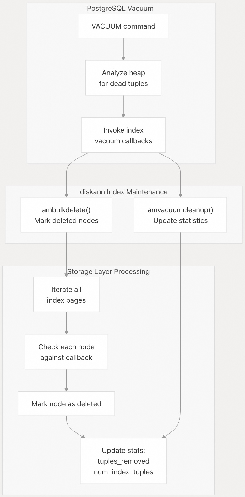
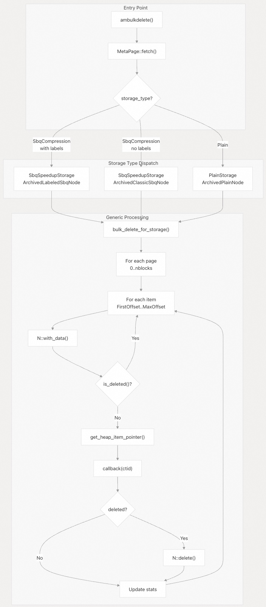
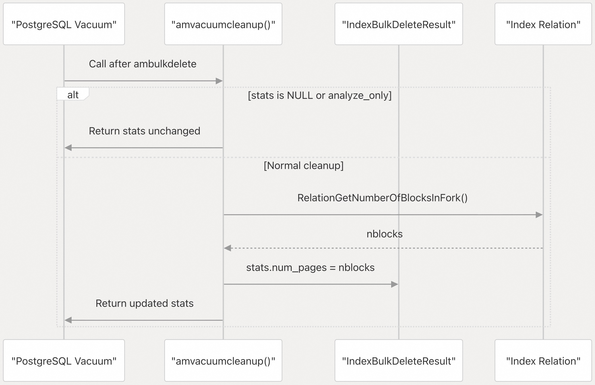
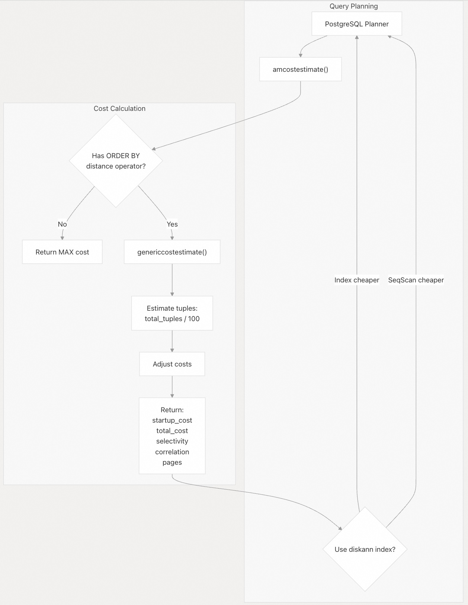
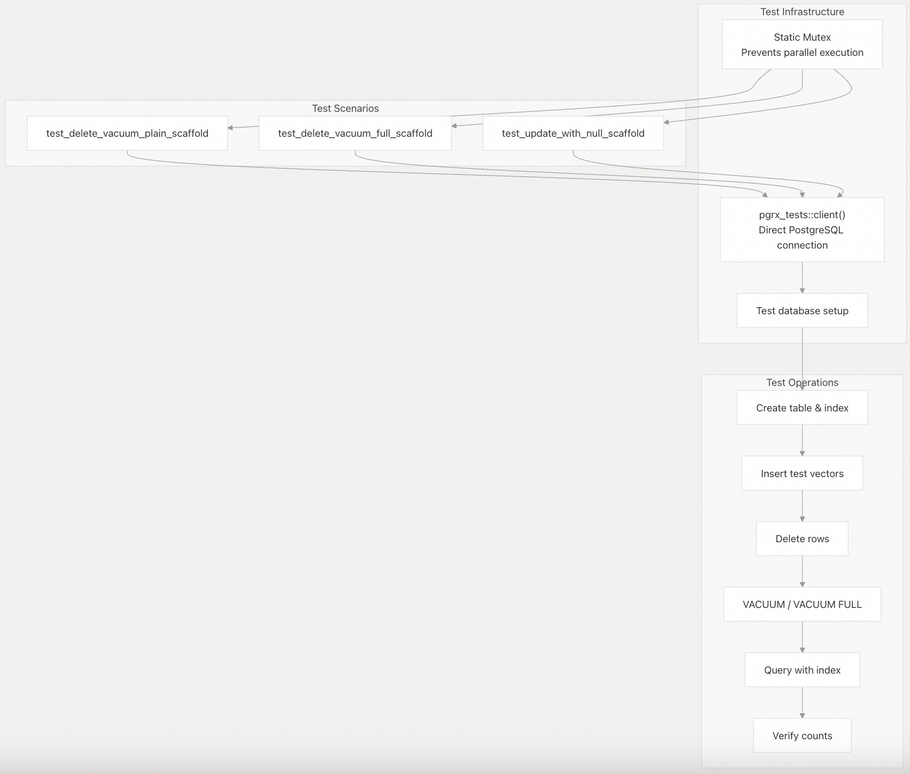
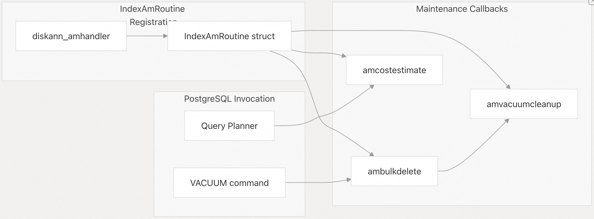
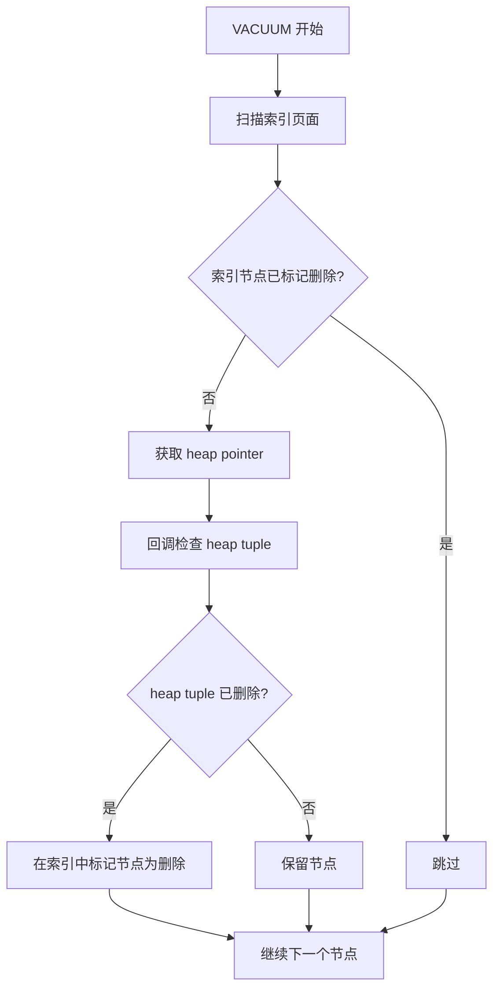

## pgvectorscale 源码学习: 3.4 索引维护与清理（Index Maintenance and Vacuum）  
  
### 作者  
digoal  
  
### 日期  
2025-11-10  
  
### 标签  
pgvectorscale , 向量数据库 , DiskANN , StreamingDiskANN , 源码学习  
  
----  
  
## 背景  
本文介绍 `StreamingDiskANN index`（StreamingDiskANN 索引）的索引维护操作，特别是**清理（`vacuum`）操作和成本估算（`cost estimation`）**。这些操作对于数据修改后维持索引健康至关重要，并能帮助 PostgreSQL 的 **查询规划器（`query planner`）** 对索引使用做出明智的决策。  
  
### 目的与范围（Purpose and Scope）  
  
索引维护涵盖了两个主要的 PostgreSQL **访问方法（`access method`）** 回调：  
  
  * **`ambulkdelete`**: 在清理（`vacuum`）操作期间，标记索引中已删除的**元组（`tuples`）**。  
  * **`amvacuumcleanup`**: 执行清理（`vacuum`）后的收尾工作和统计信息更新。  
  * **`amcostestimate`**: 为 **查询规划器（`query planner`）** 提供成本估算，以决定是否使用索引。  
  
这些回调将 `DiskANN` 索引与 PostgreSQL 的标准维护基础设施集成，实现了对已删除数据的自动清理和高效的查询规划。  
  
### 清理操作概述（Vacuum Operations Overview）  
  
PostgreSQL 的 `VACUUM` 命令会识别 **堆表（`heap tables`）中的死亡元组（`dead tuples`）** ，并通知索引标记相应的索引条目为已删除。`DiskANN` 访问方法通过两个协同工作的回调函数来实现这一点，以维持索引的一致性。  
  
  
  
**清理操作流程（Vacuum Operation Flow）**  
  
来源: [`pgvectorscale/src/access_method/vacuum.rs` 24-78](https://github.com/timescale/pgvectorscale/blob/36271fa5/pgvectorscale/src/access_method/vacuum.rs#L24-L78)  
  
当 PostgreSQL 在堆表（`heap table`）中检测到死亡元组（`dead tuples`）时，清理（`vacuum`）过程就开始了。对于每个可能已删除的元组，系统会调用索引的 **`ambulkdelete`** 回调函数，并传入一个用于判断堆元组（`heap tuple`）是否确实已删除的回调函数。  
  
### `ambulkdelete` 回调函数  
  
**`ambulkdelete`** 函数是清理（`vacuum`）实现的核心。它扫描所有索引页面，针对每个 **节点（`node`）** 调用清理（`vacuum`）回调函数进行检查，以确定是否应将其标记为已删除。  
  
#### 实现架构（Implementation Architecture）  
  
**`ambulkdelete` 函数架构**  
  
  
  
来源: [`pgvectorscale/src/access_method/vacuum.rs` 24-78](https://github.com/timescale/pgvectorscale/blob/36271fa5/pgvectorscale/src/access_method/vacuum.rs#L24-L78) [`pgvectorscale/src/access_method/vacuum.rs` 80-136](https://github.com/timescale/pgvectorscale/blob/36271fa5/pgvectorscale/src/access_method/vacuum.rs#L80-L136)  
  
#### 存储类型路由（Storage Type Routing）  
  
`ambulkdelete` 函数首先从索引元数据中确定 **存储类型（`storage type`）** ，然后将任务分派给具有正确存储和节点类型的通用处理函数：  
  
| 存储类型（Storage Type） | 节点类型（Node Type） | 用例（Use Case） |  
| :--- | :--- | :--- |  
| `SbqCompression` with labels | `ArchivedLabeledSbqNode` | 带有**标签过滤（`label filtering`）的内存优化存储 |  
| `SbqCompression` without labels | `ArchivedClassicSbqNode` | 不带标签的内存优化存储 |  
| `Plain` | `ArchivedPlainNode` | 未压缩的全精度存储（`full-precision storage`）** |  
  
这种设计利用 Rust 的 **`trait`（特性）** 系统提供了一个适用于所有存储类型的通用实现。  
  
来源: [`pgvectorscale/src/access_method/vacuum.rs` 46-76](https://github.com/timescale/pgvectorscale/blob/36271fa5/pgvectorscale/src/access_method/vacuum.rs#L46-L76)  
  
#### 页面扫描过程（Page Scanning Process）  
  
`bulk_delete_for_storage` 函数执行实际的删除标记工作：  
  
1.  **页面迭代（Page Iteration）**: 扫描索引中从块 0 到 `nblocks-1` 的所有块。  
2.  **页面类型过滤（Page Type Filtering）**: 只处理与存储类型页面类型匹配的页面（例如，`PLAIN_NODE` 或 `SBQ_NODE`）。  
3.  **清理延迟点（Vacuum Delay Points）**: 调用 `pg_sys::vacuum_delay_point()` 以防止在长时间的清理操作中独占系统资源。  
4.  **项迭代（Item Iteration）**: 对于页面上的每个项（从 `FirstOffsetNumber` 到 `MaxOffsetNumber`）：  
      * 使用 `PageGetItem` 和 `PageGetItemId` 检索**节点数据（`node data`）**。  
      * 通过 `N::is_deleted()` 检查是否已删除。  
      * 如果未删除，提取堆 **`ItemPointer`（项指针）**。  
      * 调用回调函数检查堆元组（`heap tuple`）是否已删除。  
      * 如果已删除，调用 `N::delete()` 来标记该节点。  
      * 更新统计信息计数器。  
5.  **页面提交（Page Commit）**: 如果发生了任何修改，提交页面更改。  
  
来源: [`pgvectorscale/src/access_method/vacuum.rs` 80-136](https://github.com/timescale/pgvectorscale/blob/36271fa5/pgvectorscale/src/access_method/vacuum.rs#L80-L136)  
  
#### 关键实现细节（Key Implementation Details）  
  
**清理延迟集成（Vacuum Delay Integration）**: 代码包含针对 PostgreSQL 18 修改后的 `vacuum_delay_point` API 的特定版本处理：  
  
```rust  
#[cfg(feature = "pg18")]  
unsafe { pg_sys::vacuum_delay_point(false) };  
#[cfg(not(feature = "pg18"))]  
unsafe { pg_sys::vacuum_delay_point() };  
```  
  
这确保了清理过程会周期性地 **让出（`yield`）** CPU 时间，防止它阻塞其他数据库操作。  
  
**统计信息跟踪（Statistics Tracking）**: 该函数在 **`IndexBulkDeleteResult`（索引批量删除结果）** 中维护两个关键统计信息：  
  
  * `tuples_removed`: 本次清理（`vacuum`）期间标记为已删除的元组计数。  
  * `num_index_tuples`: 剩余有效元组计数。  
  
来源: [`pgvectorscale/src/access_method/vacuum.rs` 94-101](https://github.com/timescale/pgvectorscale/blob/36271fa5/pgvectorscale/src/access_method/vacuum.rs#L94-L101) [`pgvectorscale/src/access_method/vacuum.rs` 122-129](https://github.com/timescale/pgvectorscale/blob/36271fa5/pgvectorscale/src/access_method/vacuum.rs#L122-L129)  
  
#### 节点删除机制（Node Deletion Mechanism）  
  
**`NodeVacuum` 特性（`trait`）**（由每个节点类型实现）提供了两个关键方法：  
  
  * `is_deleted()`: 检查节点是否已被标记为已删除。  
  * `delete()`: 标记节点为已删除。  
  
当一个节点被删除时，指向它的 **图边（`graph edges`）** 会失效，但 `DiskANN` 算法会优雅地处理这种情况，在 **遍历（`traversal`）** 过程中跳过已删除的节点。图结构不需要立即重新平衡。  
  
来源: [`pgvectorscale/src/access_method/vacuum.rs` 21](https://github.com/timescale/pgvectorscale/blob/36271fa5/pgvectorscale/src/access_method/vacuum.rs#L21-L21)  
  
### `amvacuumcleanup` 回调函数  
  
**`amvacuumcleanup`** 函数在 `ambulkdelete` 完成后被调用，以执行最后的收尾工作和更新索引统计信息。  
  
  
  
**`amvacuumcleanup` 序列图（Sequence Diagram）**  
  
来源: [`pgvectorscale/src/access_method/vacuum.rs` 138-157](https://github.com/timescale/pgvectorscale/blob/36271fa5/pgvectorscale/src/access_method/vacuum.rs#L138-L157)  
  
#### 函数逻辑（Function Logic）  
  
`amvacuumcleanup` 的实现虽然简洁但很重要：  
  
1.  **提前退出条件（Early Exit Conditions）**: 在以下情况立即返回：  
      * `stats` 指针为 `NULL`（未发生批量删除）。  
      * `analyze_only` 标志被设置（`ANALYZE` 命令，而非 `VACUUM`）。  
2.  **页面计数更新（Page Count Update）**: 使用 `RelationGetNumberOfBlocksInFork` 将 `stats.num_pages` 更新为索引中当前的块数。  
3.  **统计信息返回（Statistics Return）**: 将更新后的统计信息结构返回给 PostgreSQL。  
  
这种轻量级的实现是足够的，因为 `DiskANN` 索引在清理（`vacuum`）后不需要复杂的重组或页面整合。已删除的节点保留在原位但被标记为无效，图结构在搜索过程中会自然地绕过它们。  
  
来源: [`pgvectorscale/src/access_method/vacuum.rs` 138-157](https://github.com/timescale/pgvectorscale/blob/36271fa5/pgvectorscale/src/access_method/vacuum.rs#L138-L157)  
  
### 查询规划的成本估算（Cost Estimation for Query Planning）  
  
**`amcostestimate`** 函数帮助 PostgreSQL 的**查询规划器（`query planner`）决定是使用 `DiskANN` 索引还是执行顺序扫描（`sequential scan`）**。  
  
  
  
**成本估算流程（Cost Estimation Flow）**  
  
来源: [`pgvectorscale/src/access_method/cost_estimate.rs` 6-50](https://github.com/timescale/pgvectorscale/blob/36271fa5/pgvectorscale/src/access_method/cost_estimate.rs#L6-L50)  
  
#### 实现细节（Implementation Details）  
  
成本估算函数执行以下步骤：  
  
1.  **操作符验证（Operator Validation）**: 检查是否存在 `path->indexorderbys`。`DiskANN` 索引要求 **`ORDER BY`（排序子句）** 中包含一个距离操作符（`<->`、`<=>` 或 `<#>`）。缺少此条件时，索引将无法使用：  
      * 将所有成本设置为 `f64::MAX`。  
      * 在 PostgreSQL 18+ 上，设置 `disabled_nodes = 2` 以强烈阻止使用。  
2.  **元组估算（Tuple Estimation）**: 估算将被检查的元组数量为 `total_index_tuples / 100`。该 **启发式（`heuristic`）** 方法假设由于图搜索的 **近似（`approximate`）** 特性，索引将检查大约 1% 的向量。  
3.  **通用成本计算（Generic Cost Calculation）**: 调用 PostgreSQL 的 `genericcostestimate()`，根据元组估算计算标准索引成本。  
4.  **成本返回（Cost Return）**: 返回计算出的成本：  
      * `index_startup_cost`: 启动扫描的成本。  
      * `index_total_cost`: 总成本，包括所有元组的获取。  
      * `index_selectivity`: 估计的选择性。  
      * `index_correlation`: 与物理排序的相关性。  
      * `index_pages`: 估计访问的页面数。  
  
来源: [`pgvectorscale/src/access_method/cost_estimate.rs` 16-49](https://github.com/timescale/pgvectorscale/blob/36271fa5/pgvectorscale/src/access_method/cost_estimate.rs#L16-L49)  
  
#### 成本模型限制（Cost Model Limitations）  
  
当前的实现使用一个简单的启发式方法（`total_tuples / 100`）来估算被检查的元组数量。代码中指出这需要改进（参见第 36 行和 42 行的 `TODO` 注释）。一个更复杂的模型将考虑：  
  
  * `search_list_size` 参数。  
  * 图中的邻居数量。  
  * **`LIMIT`（限制子句）** 值。  
  * 是否使用了**标签过滤（`label filtering`）**。  
  
来源: [`pgvectorscale/src/access_method/cost_estimate.rs` 1-50](https://github.com/timescale/pgvectorscale/blob/36271fa5/pgvectorscale/src/access_method/cost_estimate.rs#L1-L50)  
  
### 清理测试与验证（Vacuum Testing and Verification）  
  
清理（`vacuum`）实现包含了全面的测试，用于验证其在不同场景下的正确行为。  
  
#### 测试结构（Test Structure）  
  
  
  
**清理测试结构（Vacuum Test Structure）**  
  
来源: [`pgvectorscale/src/access_method/vacuum.rs` 159-465](https://github.com/timescale/pgvectorscale/blob/36271fa5/pgvectorscale/src/access_method/vacuum.rs#L159-L465)  
  
#### 测试覆盖（Test Coverage）  
  
测试套件涵盖了三个关键场景：  
  
| 测试函数（Test Function） | 目的（Purpose） | 关键操作（Key Operations） |  
| :--- | :--- | :--- |  
| `test_delete_vacuum_plain_scaffold` | 验证基本清理（`vacuum`）功能 | 创建索引，删除行，执行 `VACUUM`，验证计数保持正确 |  
| `test_delete_vacuum_full_scaffold` | 测试 `VACUUM FULL` 行为 | 创建索引，删除所有行，插入新行，执行 `VACUUM FULL`，验证 |  
| `test_update_with_null_scaffold` | 测试带有 `NULL` 值的 **HOT 更新（`HOT updates`）** | 插入 `NULL` 嵌入向量，跨事务更新为实际值，验证索引一致性 |  
  
来源: [`pgvectorscale/src/access_method/vacuum.rs` 169-271](https://github.com/timescale/pgvectorscale/blob/36271fa5/pgvectorscale/src/access_method/vacuum.rs#L169-L271) [`pgvectorscale/src/access_method/vacuum.rs` 278-372](https://github.com/timescale/pgvectorscale/blob/36271fa5/pgvectorscale/src/access_method/vacuum.rs#L278-L372) [`pgvectorscale/src/access_method/vacuum.rs` 378-458](https://github.com/timescale/pgvectorscale/blob/36271fa5/pgvectorscale/src/access_method/vacuum.rs#L378-L458)  
  
#### 为什么测试使用直接客户端（Why Tests Use Direct Clients）  
  
清理（`vacuum`）测试不能使用标准的 **`PGRX` 测试框架（`test framework`）**（`pg_test` 宏），因为：  
  
1.  **事务限制（Transaction Limitations）**: `VACUUM` 不能在事务内部运行，但 `PGRX` 测试默认在回滚事务中运行。  
2.  **多事务要求（Multi-Transaction Requirements）**: 一些测试需要提交多个事务以触发特定的 PostgreSQL 行为（例如，**HOT 更新（`HOT updates`）**）。  
  
为了解决这个问题，测试采取了以下措施：  
  
  * 使用静态互斥锁来防止并行执行。  
  * 调用 `pgrx_tests::run_test()` 来启动测试数据库。  
  * 使用 `pgrx_tests::client()` 来获取直接的 PostgreSQL 连接。  
  * 在 **`SPI`/事务上下文（`transaction context`）** 之外执行 SQL 命令。  
  
来源: [`pgvectorscale/src/access_method/vacuum.rs` 176-186](https://github.com/timescale/pgvectorscale/blob/36271fa5/pgvectorscale/src/access_method/vacuum.rs#L176-L186) [`pgvectorscale/src/access_method/vacuum.rs` 165-166](https://github.com/timescale/pgvectorscale/blob/36271fa5/pgvectorscale/src/access_method/vacuum.rs#L165-L166)  
  
#### HOT 更新测试（HOT Updates Test）  
  
`test_update_with_null_scaffold` 测试特别值得注意，因为它验证了对 **Heap-Only Tuple（堆上元组，`HOT`）** 更新的处理：  
  
1.  创建一个带有 `NULL` 嵌入列的表。  
2.  插入 1000 行带有 `NULL` 嵌入向量的数据。  
3.  在一个带有提交的循环中，将每行数据从 `NULL` 更新为随机向量。  
4.  在所有更新之后创建 `DiskANN` 索引。  
5.  验证索引可以成功查询。  
  
该模式测试了索引是否正确处理了在没有清理（`vacuum`）的情况下，由多次更新创建的复杂元组链。  
  
来源: [`pgvectorscale/src/access_method/vacuum.rs` 378-458](https://github.com/timescale/pgvectorscale/blob/36271fa5/pgvectorscale/src/access_method/vacuum.rs#L378-L458)  
  
### 与 PostgreSQL 基础设施的集成（Integration with PostgreSQL Infrastructure）  
  
清理（`vacuum`）和成本估算回调函数通过由 `diskann_amhandler` 填充的 **`IndexAmRoutine`（索引访问方法例程）** 结构，与 PostgreSQL 的访问方法基础设施无缝集成：  
  
  
  
**访问方法集成（Access Method Integration）**  
  
来源: [`pgvectorscale/src/access_method/vacuum.rs` 1-19](https://github.com/timescale/pgvectorscale/blob/36271fa5/pgvectorscale/src/access_method/vacuum.rs#L1-L19)  
  
这些回调函数在扩展初始化期间注册，并在以下情况由 PostgreSQL 自动调用：  
  
  * 对带有 `DiskANN` 索引的表执行了 `VACUUM` 命令时。  
  * 查询规划器评估是否应对带有 **`ORDER BY` 距离子句（`distance clause`）** 的查询使用该索引时。  
  
这种紧密的集成确保了 `DiskANN` 索引参与到 PostgreSQL 的标准维护生命周期中，而无需数据库管理员进行特殊处理。  
  
### 总结（Summary）  
  
`DiskANN` 索引维护系统提供了：  
  
1.  **高效的清理操作（Efficient Vacuum Operations）**: `ambulkdelete` 回调函数标记已删除的节点，而无需图结构重组；`amvacuumcleanup` 更新统计信息。  
2.  **存储类型抽象（Storage Type Abstraction）**: 通用实现通过基于 **特性（`trait`）** 的调度，适用于 **`Plain`（普通）** 和 **`SBQ`** 两种存储类型。  
3.  **查询规划集成（Query Planning Integration）**: `amcostestimate` 回调函数使 **查询规划器（`query planner`）** 能够对索引使用做出明智的决策。  
4.  **PostgreSQL 版本兼容性（Version Compatibility）**: 处理了 PostgreSQL 13-18 版本之间的 API 差异。  
5.  **全面的测试（Comprehensive Testing）**: 测试套件验证了标准清理（`vacuum`）、`VACUUM FULL` 和 **HOT 更新（`HOT update`）** 场景的正确行为。  
  
该实现平衡了简洁性与正确性：已删除的节点保留在索引中但被标记为无效，允许图搜索算法在没有昂贵重组的情况下自然地跳过它们。  
  
来源: [`pgvectorscale/src/access_method/vacuum.rs`](https://github.com/timescale/pgvectorscale/blob/36271fa5/pgvectorscale/src/access_method/vacuum.rs) [`pgvectorscale/src/access_method/cost_estimate.rs`](https://github.com/timescale/pgvectorscale/blob/36271fa5/pgvectorscale/src/access_method/cost_estimate.rs)  
  
# 附录1: 关于 pgvectorscale 的 StreamingDiskANN 索引在 VACUUM 操作期间的行为  
问题: PostgreSQL的垃圾回收应该是先扫描heap table并清理dead tuple, 被清理的tuple_ids(block_id,item_id)存储下来, 然后再扫描索引, 根据tuple_ids清理索引的无效引用. 既然如此, 为什么还需要回表检查heap tuple is deleted?  
  
以上描述的 PostgreSQL 标准 VACUUM 流程是正确的, 但 pgvectorscale 的实现有所不同。   
  
在 `ambulkdelete` 函数中, pgvectorscale **直接扫描索引页面**, 对每个索引条目调用 PostgreSQL 提供的回调函数来检查对应的 heap tuple 是否已被删除。    
  
关键代码 `vacuum.rs` 流程:   
  
1. **扫描索引页面**:遍历所有索引块 (line 87-91)   
  
2. **获取 heap pointer**:从索引节点中提取 heap tuple 的位置 (line 116)    
  
3. **回调检查**:调用 PostgreSQL 的 callback 函数检查该 heap tuple 是否已删除 (line 122)    
  
4. **标记删除**:如果已删除,在索引中标记该节点为已删除 (line 123-126)   
  
**为什么需要回表检查?**  
  
因为 pgvectorscale 采用的是**索引驱动的 VACUUM 方式**, 而不是您描述的"先扫描 heap 再扫描索引"的方式。PostgreSQL 的 `IndexBulkDeleteCallback` 回调函数会访问 heap table 来确定 tuple 是否真的被删除了。这是 PostgreSQL 索引访问方法 API 的标准做法。   
  
在查询时,代码也会检查 `InvalidOffsetNumber` 来跳过已删除的 tuple.   
  
## Notes  
  
pgvectorscale 的 VACUUM 实现遵循 PostgreSQL 的索引访问方法标准接口。`ambulkdelete` 和 `amvacuumcleanup` 是 PostgreSQL 要求实现的回调函数。 测试代码验证了 VACUUM 后索引能正确处理已删除的 tuple。    
  
# 附录2: pgvectorscale 中索引节点如何存储删除状态  
问题: 如果是索引驱动的垃圾回收, 前提条件是索引里的item有标记为删除的信息, 而PostgreSQL标准的设计中, 只有heap tuple有这个状态位.   
  
您的理解是正确的 - PostgreSQL 标准设计中, 删除标记确实存在于 heap tuple 中。但 pgvectorscale 的索引节点**也有自己的删除标记**。    
  
### 索引节点的删除标记  
  
每个索引节点都实现了 `ArchivedData` trait, 其中包含 `is_deleted()` 方法:   
```rust  
pub trait ArchivedData {  
    fn is_deleted(&self) -> bool;  
    fn get_heap_item_pointer(&self) -> HeapPointer;  
    fn get_index_pointer_to_neighbors(&self) -> Vec<ItemPointer>;  
}  
```  
  
`NodeVacuum` trait 提供了 `delete()` 方法来标记节点为已删除:   
```rust  
pub trait NodeVacuum: ArchivedData {  
    fn with_data(data: &mut [u8]) -> Pin<&mut Self>;  
    fn delete(self: Pin<&mut Self>);  
}  
```  
  
### VACUUM 流程详解  
  
在 vacuum.rs `ambulkdelete` 中的完整流程是:  
  
1. **检查索引节点是否已标记删除** (line 112-114): 如果节点已经被标记为删除, 直接跳过    
  
2. **获取 heap pointer** (line 116): 从索引节点提取对应的 heap tuple 位置   
  
3. **回调检查 heap tuple** (line 122): 调用 PostgreSQL 的回调函数检查 heap tuple 是否已被 VACUUM 删除    
  
4. **标记索引节点为删除** (line 123-126): 如果 heap tuple 已删除, 在**索引中**标记该节点为已删除    
  
### 为什么需要索引中的删除标记?  
  
因为在查询时, 索引扫描需要快速跳过已删除的节点, 而不是每次都回表检查。查询代码会检查 `InvalidOffsetNumber` (这是删除标记的表现形式):   
  
### 工作流程总结  
  

  
所以 pgvectorscale 的设计是: **索引节点有自己的删除标记, VACUUM 通过回表检查 heap tuple 状态后, 在索引中设置这个标记**。 这样后续查询就可以直接通过索引中的标记跳过已删除节点,无需每次都回表。  
  
## Notes  
  
这种设计在 `NodeVacuum` trait 的实现中体现, 不同的存储类型 (`PlainStorage`, `SbqSpeedupStorage`) 都实现了这个 trait。 测试代码验证了删除和 VACUUM 后索引能正确处理已删除的 tuple。  
    
#### [PolarDB 学习图谱](https://www.aliyun.com/database/openpolardb/activity "8642f60e04ed0c814bf9cb9677976bd4")
  
  
#### [PostgreSQL 解决方案集合](../201706/20170601_02.md "40cff096e9ed7122c512b35d8561d9c8")
  
  
#### [德哥 / digoal's Github - 公益是一辈子的事.](https://github.com/digoal/blog/blob/master/README.md "22709685feb7cab07d30f30387f0a9ae")
  
  
#### [About 德哥](https://github.com/digoal/blog/blob/master/me/readme.md "a37735981e7704886ffd590565582dd0")
  
  

  
