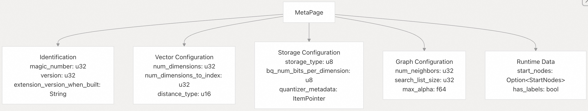
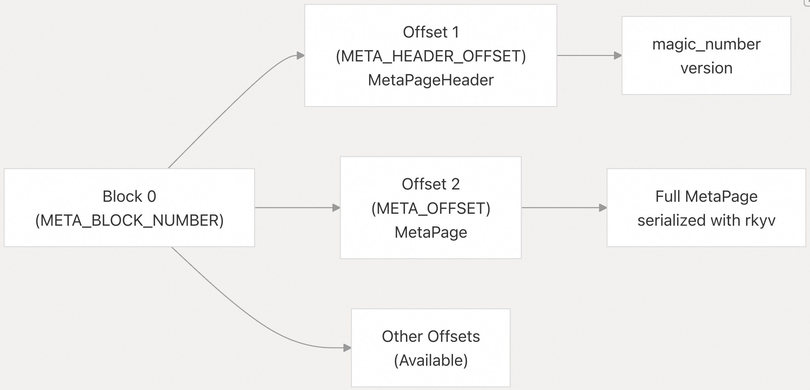
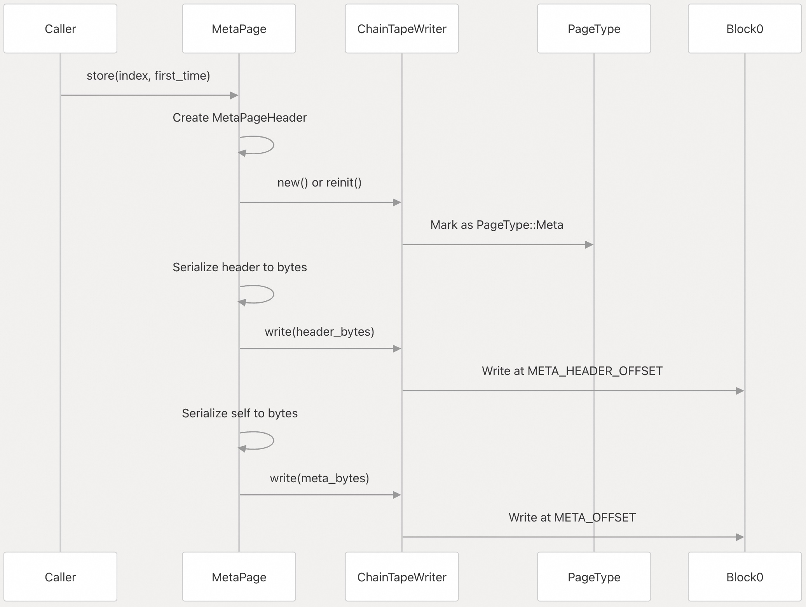
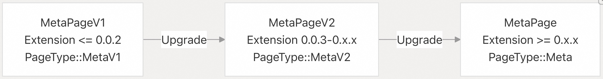
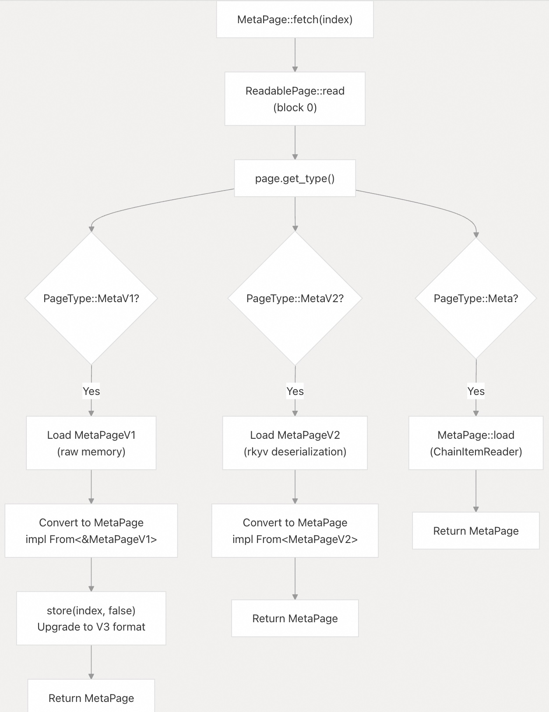
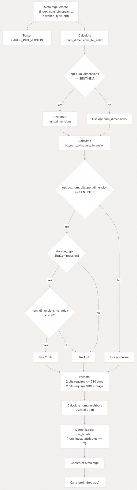
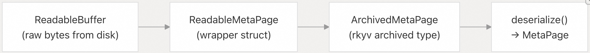
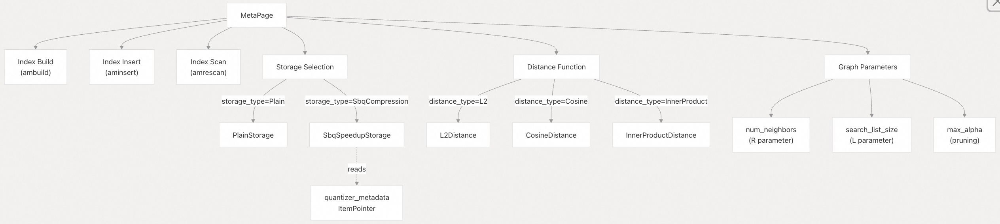

## pgvectorscale 源码学习: 3.5 索引元数据（Index Metadata）   
    
### 作者    
digoal    
    
### 日期    
2025-11-10    
    
### 标签    
pgvectorscale , 向量数据库 , DiskANN , StreamingDiskANN , 源码学习    
    
----    
    
## 背景    
索引元数据（index metadata）系统管理 **StreamingDiskANN** 索引的配置和结构信息。本文档描述了 `MetaPage` 结构体（struct）、元数据版本控制策略（metadata versioning strategy）、向后兼容机制（backward compatibility mechanisms），以及索引配置如何在磁盘上存储和检索。  
  
## MetaPage 结构体（MetaPage Structure）  
  
`MetaPage` 结构体存储所有索引范围内的配置和结构信息。此元数据在索引的整个生命周期内持久存在，并控制着索引行为的基本方面。  
  
  
  
**来源：** [`pgvectorscale/src/access_method/meta_page.rs` 179-210](https://github.com/timescale/pgvectorscale/blob/36271fa5/pgvectorscale/src/access_method/meta_page.rs#L179-L210)  
  
### 字段描述（Field Descriptions）  
  
| 字段（Field） | 类型（Type） | 目的（Purpose） |  
| :--- | :--- | :--- |  
| `magic_number` | `u32` | 索引标识常数 `TSV_MAGIC_NUMBER` (768756476) |  
| `version` | `u32` | 元数据格式版本，当前为 `TSV_VERSION` (3) |  
| `extension_version_when_built` | `String` | 构建时来自 `CARGO_PKG_VERSION` 的语义版本（Semantic version） |  
| `distance_type` | `u16` | 距离指标的枚举值（L2、余弦 **cosine**、内积 **inner product**） |  
| `num_dimensions` | `u32` | 输入向量的总维度（Total dimensions） |  
| `num_dimensions_to_index` | `u32` | 实际被索引的维度（支持 Matryoshka 嵌入 **embeddings**） |  
| `bq_num_bits_per_dimension` | `u8` | **SBQ** 压缩中每维度的位数（1 或 2） |  
| `storage_type` | `u8` | 枚举值：`Plain`（普通存储）或 `SbqCompression`（SBQ 压缩存储） |  
| `num_neighbors` | `u32` | 每个图节点的最大出边数（R 参数） |  
| `search_list_size` | `u32` | 索引构建期间的搜索列表大小（L 参数） |  
| `max_alpha` | `f64` | 鲁棒剪枝算法（robust pruning algorithm）的 Alpha 参数 |  
| `start_nodes` | `Option<StartNodes>` | 图搜索的入口点（Entry points） |  
| `quantizer_metadata` | `ItemPointer` | 指向 `SbqQuantizer` 均值（means）的指针（如果使用 **SBQ**） |  
| `has_labels` | `bool` | 索引是否包含标签过滤支持（label filtering support） |  
  
**来源：** [`pgvectorscale/src/access_method/meta_page.rs` 179-210](https://github.com/timescale/pgvectorscale/blob/36271fa5/pgvectorscale/src/access_method/meta_page.rs#L179-L210)  
  
## 元数据存储布局（Metadata Storage Layout）  
  
元数据存储在索引关系（index relation）的 **block 0** 上，采用 **header-and-body**（头部和主体）模式，以便未来格式演进。  
  
  
  
**来源：** [`pgvectorscale/src/access_method/meta_page.rs` 26-28](https://github.com/timescale/pgvectorscale/blob/36271fa5/pgvectorscale/src/access_method/meta_page.rs#L26-L28)  
  
### 存储常数（Storage Constants）  
  
元数据使用固定的块和偏移量位置：  
  
  * **`META_BLOCK_NUMBER`**: `0` - 元数据始终位于第一个块（block）上  
  * **`META_HEADER_OFFSET`**: `1` - 第一个项槽（item slot）包含 `MetaPageHeader`  
  * **`META_OFFSET`**: `2` - 第二个项槽包含完整的 `MetaPage`  
  
**来源：** [`pgvectorscale/src/access_method/meta_page.rs` 26-28](https://github.com/timescale/pgvectorscale/blob/36271fa5/pgvectorscale/src/access_method/meta_page.rs#L26-L28)  
  
### 序列化策略（Serialization Strategy）  
  
元数据使用 **rkyv** 进行零拷贝序列化（zero-copy serialization），提供了：  
  
1.  **头部分离（Header Separation）**：`MetaPageHeader` 仅包含魔数（magic number）和版本（version），允许在完全反序列化（deserialization）之前检测版本。  
2.  **链式存储（Chained Storage）**：使用 `ChainTapeWriter` 和 `ChainItemReader` 来写入/读取序列化字节。  
3.  **原子更新（Atomic Updates）**：`store()` 方法可以重新初始化 **block 0** 来更新元数据。  
  
  
  
**来源：** [`pgvectorscale/src/access_method/meta_page.rs` 359-384](https://github.com/timescale/pgvectorscale/blob/36271fa5/pgvectorscale/src/access_method/meta_page.rs#L359-L384)  
  
## 元数据版本控制（Metadata Versioning）  
  
该扩展通过版本化的元数据格式和明确的升级路径来保持向后兼容性（backward compatibility）。  
  
### 版本历史（Version History）  
  
  
  
**来源：** [`pgvectorscale/src/access_method/meta_page.rs` 29-162](https://github.com/timescale/pgvectorscale/blob/36271fa5/pgvectorscale/src/access_method/meta_page.rs#L29-L162)  
  
### MetaPageV1 格式  
  
最初的元数据格式使用 **C 风格的内存布局**，没有序列化（serialization）：  
  
| 特性（Feature） | V1 行为（V1 Behavior） |  
| :--- | :--- |  
| 存储（Storage） | 页面内容中的直接结构体（Direct struct in page contents） |  
| 序列化（Serialization） | 无（原始内存 **raw memory**） |  
| 量化（Quantization） | `use_pq` 标志用于 **Product Quantization (PQ)** |  
| 标签（Labels） | 不支持 |  
| 距离（Distance） | 始终为 **L2**（假定） |  
| 维度（Dimensions） | 单个 `num_dimensions` 字段 |  
  
**关键限制（Key Limitation）**：**Product Quantization (PQ)** 已被移除，因此带有 `use_pq=true` 的 **V1** 索引无法升级，需要重建。  
  
**来源：** [`pgvectorscale/src/access_method/meta_page.rs` 29-91](https://github.com/timescale/pgvectorscale/blob/36271fa5/pgvectorscale/src/access_method/meta_page.rs#L29-L91)  
  
### MetaPageV2 格式  
  
引入了 **rkyv** 序列化和额外的配置：  
  
| 特性（Feature） | V2 新增（V2 Addition） |  
| :--- | :--- |  
| 序列化（Serialization） | 基于 **rkyv**，带有 `Archive` 特性（trait） |  
| 头部（Header） | 用于版本检测的独立 `MetaPageHeader` |  
| 距离类型（Distance Type） | 显式 `distance_type` 字段 |  
| 扩展版本（Extension Version） | `extension_version_when_built` 字符串 |  
| 维度（Dimensions） | 为 Matryoshka 添加了 `num_dimensions_to_index` |  
| SBQ | `bq_num_bits_per_dimension` 字段 |  
| 标签（Labels） | 在 V2 中尚不支持 |  
  
**来源：** [`pgvectorscale/src/access_method/meta_page.rs` 93-162](https://github.com/timescale/pgvectorscale/blob/36271fa5/pgvectorscale/src/access_method/meta_page.rs#L93-L162)  
  
### 当前 MetaPage 格式（V3）  
  
当前版本新增了：  
  
| 特性（Feature） | 当前实现（Current Implementation） |  
| :--- | :--- |  
| 标签（Labels） | `has_labels` 布尔标志 |  
| 起始节点（Start Nodes） | `Option<StartNodes>` 用于每标签的入口点（per-label entry points） |  
| 版本（Version） | `TSV_VERSION` 常数 = 3 |  
  
**来源：** [`pgvectorscale/src/access_method/meta_page.rs` 179-210](https://github.com/timescale/pgvectorscale/blob/36271fa5/pgvectorscale/src/access_method/meta_page.rs#L179-L210)  
  
## 向后兼容性（Backward Compatibility）  
  
`fetch()` 方法通过检测页面类型并在中间表示（intermediate representations）之间进行转换，实现了从旧元数据格式的**透明升级（transparent upgrade）**。  
  
  
  
**来源：** [`pgvectorscale/src/access_method/meta_page.rs` 399-419](https://github.com/timescale/pgvectorscale/blob/36271fa5/pgvectorscale/src/access_method/meta_page.rs#L399-L419)  
  
### 转换规则（Conversion Rules）  
  
#### V1 到当前版本  
  
```  
MetaPageV1 → MetaPage  
- 检查 use_pq 标志（如果为 true 则报错，PQ 已不再支持）  
- 设置 distance_type 为 L2（V1 中唯一的类型）  
- 设置 num_dimensions_to_index = num_dimensions  
- 设置 bq_num_bits_per_dimension = 1（默认值）  
- 设置 storage_type 为 Plain  
- 将 init_ids 转换为 StartNodes  
- 设置 has_labels = false  
- 设置 quantizer_metadata 为无效指针  
- 设置 extension_version_when_built = "0.0.2"  
```  
  
**来源：** [`pgvectorscale/src/access_method/meta_page.rs` 63-91](https://github.com/timescale/pgvectorscale/blob/36271fa5/pgvectorscale/src/access_method/meta_page.rs#L63-L91)  
  
#### V2 到当前版本  
  
```  
MetaPageV2 → MetaPage  
- 直接复制所有通用字段（common fields）  
- 将 init_ids 转换为 StartNodes 包装器（wrapper）  
- 设置 has_labels = false（在 V3 中新增）  
```  
  
**来源：** [`pgvectorscale/src/access_method/meta_page.rs` 141-162](https://github.com/timescale/pgvectorscale/blob/36271fa5/pgvectorscale/src/access_method/meta_page.rs#L141-L162)  
  
## 元数据创建（Metadata Creation）  
  
`create()` 方法为新索引初始化元数据，根据索引选项（index options）计算适当的默认值。  
  
### 创建流程（Creation Flow）  
  
  
  
**来源：** [`pgvectorscale/src/access_method/meta_page.rs` 298-357](https://github.com/timescale/pgvectorscale/blob/36271fa5/pgvectorscale/src/access_method/meta_page.rs#L298-L357)  
  
### 默认值计算（Default Value Calculation）  
  
`num_neighbors` 字段使用 **哨兵值（sentinel values）** 来区分用户指定值和默认值：  
  
```  
if opt.num_neighbors == NUM_NEIGHBORS_DEFAULT_SENTINEL:  
    num_neighbors = 50  # default for both Plain and SbqCompression  
else:  
    num_neighbors = opt.num_neighbors  
```  
  
**来源：** [`pgvectorscale/src/access_method/meta_page.rs` 284-294](https://github.com/timescale/pgvectorscale/blob/36271fa5/pgvectorscale/src/access_method/meta_page.rs#L284-L294)  
  
### 验证规则（Validation Rules）  
  
创建过程强制执行这些约束：  
  
| 约束（Constraint） | 错误条件（Error Condition） |  
| :--- | :--- |  
| SBQ 维度限制 | `bq_num_bits_per_dimension > 1 && num_dimensions_to_index > 930` |  
| SBQ 存储要求 | `bq_num_bits_per_dimension > 1 && storage_type != SbqCompression` |  
  
**来源：** [`pgvectorscale/src/access_method/meta_page.rs` 325-334](https://github.com/timescale/pgvectorscale/blob/36271fa5/pgvectorscale/src/access_method/meta_page.rs#L325-L334)  
  
## 元数据访问方法（Metadata Access Methods）  
  
`MetaPage` 结构体提供访问器方法（accessor methods），用于安全地检索配置值。  
  
### Getter 方法（Getter Methods）  
  
| 方法（Method） | 返回类型（Return Type） | 目的（Purpose） |  
| :--- | :--- | :--- |  
| `get_num_dimensions()` | `u32` | 向量总维度（Total vector dimensions） |  
| `get_num_dimensions_to_index()` | `u32` | 索引维度（支持 Matryoshka） |  
| `get_bq_num_bits_per_dimension()` | `u8` | SBQ 量化位数（quantization bits） |  
| `get_num_neighbors()` | `u32` | 每个节点的最大邻居数（Max neighbors per node） |  
| `get_search_list_size_for_build()` | `u32` | 构建时的搜索列表大小 |  
| `get_max_alpha()` | `f64` | 鲁棒剪枝 **alpha** 参数 |  
| `get_distance_function()` | `DistanceFn` | 已解析的距离函数指针 |  
| `get_distance_type()` | `DistanceType` | 距离指标枚举（Distance metric enum） |  
| `get_storage_type()` | `StorageType` | 存储实现枚举（Storage implementation enum） |  
| `has_labels()` | `bool` | 标签过滤是否启用 |  
| `get_start_nodes()` | `Option<&StartNodes>` | 图入口点的引用 |  
| `get_quantizer_metadata_pointer()` | `Option<IndexPointer>` | SBQ 均值指针（如果使用 SBQ） |  
  
**来源：** [`pgvectorscale/src/access_method/meta_page.rs` 212-282](https://github.com/timescale/pgvectorscale/blob/36271fa5/pgvectorscale/src/access_method/meta_page.rs#L212-L282)  
  
### 计算值（Computed Values）  
  
有些方法计算派生值（derived values）：  
  
```rust  
// During build, allow extra neighbors for flexibility  
pub fn get_max_neighbors_during_build(&self) -> usize {  
    ((self.get_num_neighbors() as f64) * GRAPH_SLACK_FACTOR).ceil() as usize  
}  
// where GRAPH_SLACK_FACTOR = 1.3  
```  
  
**来源：** [`pgvectorscale/src/access_method/meta_page.rs` 253-255](https://github.com/timescale/pgvectorscale/blob/36271fa5/pgvectorscale/src/access_method/meta_page.rs#L253-L255)  
  
### 量化器指针解析（Quantizer Pointer Resolution）  
  
`get_quantizer_metadata_pointer()` 方法对于 **Plain** 存储返回 `None`，确保类型安全（type safety）：  
  
```rust  
if storage_type == StorageType::Plain:  
    return None  
else:  # SbqCompression  
    if quantizer_metadata.is_valid():  
        return Some(quantizer_metadata)  
    else:  
        return None  
```  
  
**来源：** [`pgvectorscale/src/access_method/meta_page.rs` 273-282](https://github.com/timescale/pgvectorscale/blob/36271fa5/pgvectorscale/src/access_method/meta_page.rs#L273-L282)  
  
## 序列化基础设施（Serialization Infrastructure）  
  
元数据系统使用自定义的 **derive** 宏进行序列化，这些宏与 **rkyv** 框架集成。  
  
### Derive 宏（Derive Macros）  
  
`MetaPage` 结构体使用以下过程宏（procedural macros）：  
  
```rust  
#[derive(Clone, Debug, PartialEq, Archive, Deserialize, Serialize, Readable, Writeable)]  
#[archive(check_bytes)]  
pub struct MetaPage { ... }  
```  
  
**来源：** [`pgvectorscale/src/access_method/meta_page.rs` 179](https://github.com/timescale/pgvectorscale/blob/36271fa5/pgvectorscale/src/access_method/meta_page.rs#L179-L179)  
  
### Readable 宏（Readable Macro）  
  
生成 `ReadableMetaPage` 包装器（wrapper），提供对已归档数据（archived data）的零拷贝访问：  
  
  
  
生成的函数：  
  
  * `with_readable_buffer(rb: ReadableBuffer) -> ReadableMetaPage`  
  * `get_archived_node() -> &ArchivedMetaPage` - 零拷贝访问  
  * `get_owned_page() -> ReadablePage` - 转移页面所有权  
  
**来源：** [`pgvectorscale/pgvectorscale_derive/src/lib.rs` 20-55](https://github.com/timescale/pgvectorscale/blob/36271fa5/pgvectorscale_derive/src/lib.rs#L20-L55)  
  
### Writeable 宏（Writeable Macro）  
  
生成 `WritableMetaPage` 包装器，用于原地修改（in-place modification）：  
  
生成的函数：  
  
  * `modify<S: StatsNodeModify>(index, pointer, stats) -> WritableMetaPage`  
  * `get_archived_node() -> Pin<&mut ArchivedMetaPage>` - 可变的归档访问  
  * `write<S: StatsNodeWrite>(tape, stats) -> ItemPointer` - 序列化并写入  
  * `serialize_to_vec() -> AlignedVec` - 获取序列化字节  
  * `commit()` - 提交修改  
  
**来源：** [`pgvectorscale/pgvectorscale_derive/src/lib.rs` 58-107](https://github.com/timescale/pgvectorscale/blob/36271fa5/pgvectorscale_derive/src/lib.rs#L58-L107)  
  
## 与索引操作的集成（Integration with Index Operations）  
  
元数据影响多个索引子系统：  
  
  
  
**来源：** [`pgvectorscale/src/access_method/meta_page.rs` 212-282](https://github.com/timescale/pgvectorscale/blob/36271fa5/pgvectorscale/src/access_method/meta_page.rs#L212-L282)  
  
### 索引构建用途（Index Build Usage）  
  
在 `ambuild` 期间，元数据提供：  
  
  * 用于验证和量化器训练的**向量维度（Vector dimensions）**  
  * **存储类型（Storage type）** 以选择 `PlainStorage` 或 `SbqSpeedupStorage`  
  * 用于图构建的**图参数（Graph parameters）**（`num_neighbors`、`search_list_size`、`max_alpha`）  
  * 用于邻居距离计算的**距离函数（Distance function）**  
  
构建完成后，`ambuild` 会更新：  
  
  * 通过 `set_start_nodes()` 更新 `start_nodes`  
  * 通过 `set_quantizer_metadata_pointer()` 更新 `quantizer_metadata`（如果使用 SBQ）  
  
**来源：** [`pgvectorscale/src/access_method/meta_page.rs` 269-271](https://github.com/timescale/pgvectorscale/blob/36271fa5/pgvectorscale/src/access_method/meta_page.rs#L269-L271) [`pgvectorscale/src/access_method/meta_page.rs` 421-423](https://github.com/timescale/pgvectorscale/blob/36271fa5/pgvectorscale/src/access_method/meta_page.rs#L421-L423)  
  
### 索引扫描用途（Index Scan Usage）  
  
在 `amrescan` 期间，元数据提供：  
  
  * **存储类型（Storage type）** 以实例化正确的存储实现  
  * 用于查询时距离计算的**距离函数**  
  * 作为图搜索入口点的**起始节点（Start nodes）**  
  * **量化器指针（Quantizer pointer）** 以加载 SBQ 均值（如果需要）  
  * 用于查询向量验证的**维度**  
  
**来源：** [`pgvectorscale/src/access_method/meta_page.rs` 241-247](https://github.com/timescale/pgvectorscale/blob/36271fa5/pgvectorscale/src/access_method/meta_page.rs#L241-L247) [`pgvectorscale/src/access_method/meta_page.rs` 273-282](https://github.com/timescale/pgvectorscale/blob/36271fa5/pgvectorscale/src/access_method/meta_page.rs#L273-L282)  
  
## 总结（Summary）  
  
索引元数据系统提供：  
  
1.  **集中式配置（Centralized Configuration）**：索引参数的单一事实来源（Single source of truth）  
2.  **版本化格式（Versioned Format）**：具有向后兼容性的显式版本控制  
3.  **类型安全（Type Safety）**：用于距离指标和存储类型的 Rust 枚举  
4.  **升级路径（Upgrade Path）**：从旧格式的透明转换  
5.  **高效序列化（Efficient Serialization）**：rkyv 实现零拷贝反序列化  
6.  **固定位置（Fixed Location）**：始终位于 block 0 以实现快速访问  
  
`MetaPage` 结构体将索引创建选项（来自 `TSVIndexOptions`）与运行时行为（runtime behavior）连接起来，确保所有索引操作的配置一致性。  
  
**来源：** [`pgvectorscale/src/access_method/meta_page.rs` 1-424](https://github.com/timescale/pgvectorscale/blob/36271fa5/pgvectorscale/src/access_method/meta_page.rs#L1-L424)  
  
# 附录: Matryoshka Embedding 支持  
Matryoshka embedding 是一种特殊的向量嵌入技术,其中向量的前 N 个维度包含了大部分语义信息。pgvectorscale 通过 `num_dimensions` 索引参数支持这种嵌入模型 。  
  
## 工作原理  
  
在创建索引时,您可以指定 `num_dimensions` 参数来只索引向量的前 N 个维度, 而不是全部维度 。这个参数存储在索引的元数据中 。  
  
索引构建时会使用 `num_dimensions_to_index` 字段来确定实际索引的维度数 。  
  
## 使用示例  
  
```sql  
-- 为 1536 维向量创建索引,但只索引前 512 维  
  
CREATE INDEX document_embedding_idx ON document_embedding  
USING diskann (embedding vector_l2_ops)  
WITH (  
    storage_layout = 'plain',  
    num_dimensions = 512  
);  
```   
  
## 参数配置  
  
| 参数 | 默认值 | 说明 |  
|------|--------|------|  
| `num_dimensions` | 0 (所有维度) | 要索引的维度数量 |  
  
当设置为 0 时,索引会使用向量的全部维度 。  
  
## Notes  
  
Matryoshka embedding 的优势在于可以通过只索引部分维度来减少索引大小和提高查询速度, 同时保持较好的准确性。这对于高维向量(如 768 维或更高)特别有用。元数据结构中同时存储了原始向量的总维度数 (`num_dimensions`) 和实际索引的维度数 (`num_dimensions_to_index`), 以支持这种灵活性 。  
      
#### [PolarDB 学习图谱](https://www.aliyun.com/database/openpolardb/activity "8642f60e04ed0c814bf9cb9677976bd4")
  
  
#### [PostgreSQL 解决方案集合](../201706/20170601_02.md "40cff096e9ed7122c512b35d8561d9c8")
  
  
#### [德哥 / digoal's Github - 公益是一辈子的事.](https://github.com/digoal/blog/blob/master/README.md "22709685feb7cab07d30f30387f0a9ae")
  
  
#### [About 德哥](https://github.com/digoal/blog/blob/master/me/readme.md "a37735981e7704886ffd590565582dd0")
  
  

  
