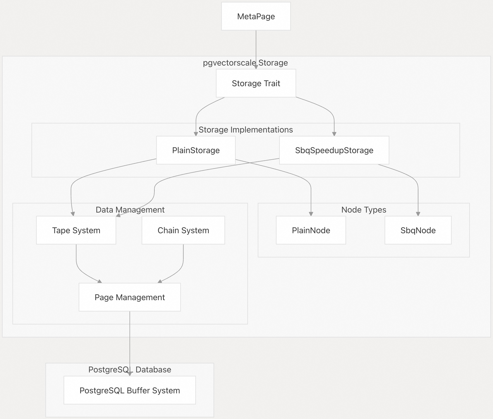
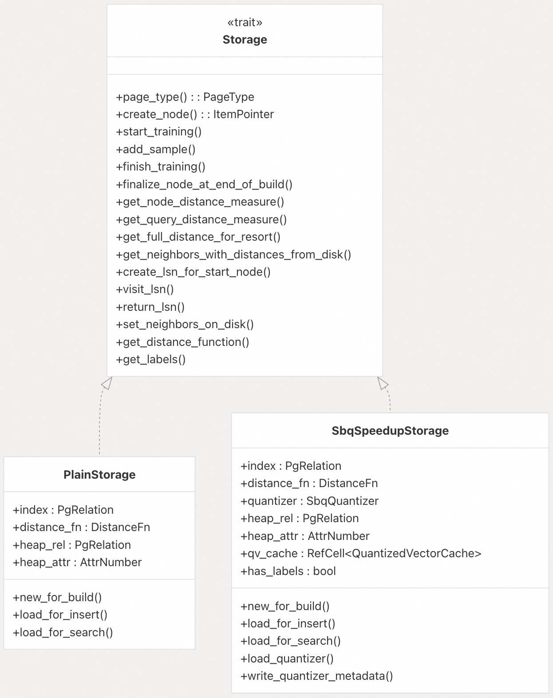
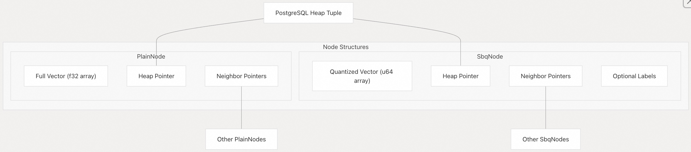

## pgvectorscale 源码学习: 4 存储系统（Storage System）   
      
### 作者      
digoal      
      
### 日期      
2025-11-10      
      
### 标签      
pgvectorscale , 向量数据库 , DiskANN , StreamingDiskANN , 源码学习      
      
----      
      
## 背景      
`pgvectorscale` 中的存储系统（Storage System）为在 **PostgreSQL** 中高效存储和检索**高维向量数据**（high-dimensional vector data）提供了基础。本文将介绍存储子系统的架构、其实现，以及它如何与 **PostgreSQL** 的**缓冲区管理系统**（buffer management system）进行接口交互。  
  
## 存储架构概览（Storage Architecture Overview）  
  
`pgvectorscale` 的存储子系统围绕**基于特质/接口的架构**（trait-based architecture）设计，允许实现多种存储方式。这种抽象能够在内存使用、查询性能（query performance）和准确性（accuracy）之间进行不同的权衡。  
  
  
  
来源: [`pgvectorscale/src/access_method/plain_storage.rs` 25-74](https://github.com/timescale/pgvectorscale/blob/36271fa5/pgvectorscale/src/access_method/plain_storage.rs#L25-L74) [`pgvectorscale/src/access_method/sbq.rs` 424-492](https://github.com/timescale/pgvectorscale/blob/36271fa5/pgvectorscale/src/access_method/sbq.rs#L424-L492)  
  
## 存储特质（Storage Trait）  
  
**存储特质**（Storage trait）定义了所有存储实现必须履行的接口。它负责在**索引构建**（index building）和**查询**（querying）期间处理向量存储、检索和距离计算。  
  
**Storage trait** 的主要职责包括：  
  
  * 创建和持久化向量节点（vector nodes）  
  * 管理**节点训练**（node training）以实现优化存储（特别是针对 `SBQ`）  
  * 计算向量之间的距离  
  * 在搜索操作期间检索向量数据  
  * 更新图结构中的**节点连接**（node connections）  
  
  
  
来源: [`pgvectorscale/src/access_method/plain_storage.rs` 163-382](https://github.com/timescale/pgvectorscale/blob/36271fa5/pgvectorscale/src/access_method/plain_storage.rs#L163-L382) [`pgvectorscale/src/access_method/sbq.rs` 621-845](https://github.com/timescale/pgvectorscale/blob/36271fa5/pgvectorscale/src/access_method/sbq.rs#L621-L845)  
  
## 存储实现（Storage Implementations）  
  
`pgvectorscale` 提供了两种具有不同性能特征的存储实现：  
  
### PlainStorage（纯存储）  
  
`PlainStorage` 是未压缩的存储实现，它以其原始形式存储向量数据。  
  
**主要特点:**  
  
  * 存储完整的向量值，不进行压缩。  
  * 为距离计算提供高**准确性**（accuracy）。  
  * 每个向量比压缩存储使用更多的内存。  
  * 实现更简单，采用直接的向量比较。  
  * **不支持标签过滤**（label filtering）。  
  * 适用于较小的向量或对准确性要求极高的场景。  
  
  
  
```sql  
CREATE INDEX ON vectors USING diskann (vector_column) WITH (storage_layout = 'plain');  
```  
  
来源: [`pgvectorscale/src/access_method/plain_storage.rs` 25-74](https://github.com/timescale/pgvectorscale/blob/36271fa5/pgvectorscale/src/access_method/plain_storage.rs#L25-L74) [`pgvectorscale/src/access_method/plain_storage.rs` 163-382](https://github.com/timescale/pgvectorscale/blob/36271fa5/pgvectorscale/src/access_method/plain_storage.rs#L163-L382)  
  
### SbqSpeedupStorage（内存优化）  
  
`SbqSpeedupStorage` 实现了**统计二值量化**（Statistical Binary Quantization），以压缩向量，显著减少内存使用。  
  
**主要特点:**  
  
  * 使用**二值量化**（binary quantization）压缩向量。  
  * 需要一个**训练阶段**（training phase）来构建量化参数。  
  * 维护一个**量化向量缓存**（cache of quantized vectors）以提高性能。  
  * 支持**标签过滤**（label filtering），用于元数据-向量联合查询。  
  * 每个向量使用的内存显著减少。  
  * 以牺牲少量准确性（accuracy）为代价换取内存效率。  
  * 大多数用例的默认选择。  
  
  
  
```sql  
CREATE INDEX ON vectors USING diskann (vector_column) WITH (storage_layout = 'memory_optimized');  
```  
  
来源: [`pgvectorscale/src/access_method/sbq.rs` 424-492](https://github.com/timescale/pgvectorscale/blob/36271fa5/pgvectorscale/src/access_method/sbq.rs#L424-L492) [`pgvectorscale/src/access_method/sbq.rs` 621-845](https://github.com/timescale/pgvectorscale/blob/36271fa5/pgvectorscale/src/access_method/sbq.rs#L621-L845)  
  
## 向量量化（Vector Quantization）  
  
**SBQ**（Statistical Binary Quantization，统计二值量化）压缩技术是内存优化存储实现的核心。它将浮点向量（floating-point vectors）转换为**二进制表示**（binary representations），同时保留距离关系。  
  
  
  
来源: [`pgvectorscale/src/access_method/sbq.rs` 140-296](https://github.com/timescale/pgvectorscale/blob/36271fa5/pgvectorscale/src/access_method/sbq.rs#L140-L296) [`pgvectorscale/src/access_method/sbq.rs` 621-665](https://github.com/timescale/pgvectorscale/blob/36271fa5/pgvectorscale/src/access_method/sbq.rs#L621-L665)  
  
### 量化过程（Quantization Process）  
  
对于 **SBQ** 存储，量化过程（quantization process）的工作方式如下：  
  
1.  **训练阶段（Training phase）**: 收集有关向量数据集的统计信息  
      * 计算每个维度的**均值**（mean）和**方差**（variance）。  
      * 确定最佳的量化参数。  
2.  **量化阶段（Quantization phase）**: 将每个向量转换为二进制表示  
      * 对于 **1 比特量化**（1-bit quantization）：每个维度根据与均值的比较被编码为 0 或 1。  
      * 对于多比特量化（multi-bit quantization）：更多比特根据统计分布提供更精细的表示。  
3.  **距离计算（Distance calculation）**: 使用二进制表示进行优化距离计算  
      * 使用 **异或操作**（`XOR` operations）进行快速距离计算。  
      * 返回原始距离度量（distance metric）的近似值。  
  
来源: [`pgvectorscale/src/access_method/sbq.rs` 140-296](https://github.com/timescale/pgvectorscale/blob/36271fa5/pgvectorscale/src/access_method/sbq.rs#L140-L296) [`pgvectorscale/src/access_method/sbq.rs` 298-345](https://github.com/timescale/pgvectorscale/blob/36271fa5/pgvectorscale/src/access_method/sbq.rs#L298-L345)  
  
## 节点类型和结构（Node Types and Structure）  
  
存储系统为每种存储实现定义了专门的节点类型：  
  
### PlainNode（纯节点）  
  
`PlainNode` 存储未压缩的向量数据：  
  
  * 包含作为浮点数组（floating-point arrays）的完整向量值。  
  * 存储对**邻居节点**（neighbor nodes）的引用。  
  * 维护与相应**堆元组**（heap tuple）的链接。  
  
### SbqNode（Sbq 节点）  
  
`SbqNode` 存储压缩后的向量数据：  
  
  * 包含**二值量化**后的向量表示。  
  * 可选地包含用于过滤的**标签信息**（label information）。  
  * 存储对邻居节点的引用。  
  * 维护与相应**堆元组**（heap tuple）的链接。  
  
这两种节点类型都使用与 **PostgreSQL** 缓冲区系统集成的自定义**序列化机制**（serialization mechanism）持久化到磁盘。  
  
  
  
来源: [`pgvectorscale/src/access_method/plain_storage.rs` 90-137](https://github.com/timescale/pgvectorscale/blob/36271fa5/pgvectorscale/src/access_method/plain_storage.rs#L90-L137) [`pgvectorscale/src/access_method/sbq.rs` 347-378](https://github.com/timescale/pgvectorscale/blob/36271fa5/pgvectorscale/src/access_method/sbq.rs#L347-L378)  
  
## 持久化层（Persistence Layer）  
  
存储系统与 **PostgreSQL** 的**缓冲区管理器**（buffer manager）集成，以将向量数据持久化到磁盘。这种集成通过以下几种抽象进行处理：  
  
### 页面管理（Page Management）  
  
两种存储实现都使用自定义的**页面管理系统**（page management system）来组织磁盘上的数据：  
  
  * 为不同的数据（节点、元信息、`SBQ` 元数据）定义专门的页面类型。  
  * 通过 **PostgreSQL** 的**缓冲区管理器**处理页面的读取和写入。  
  * 实现节点数据的序列化和反序列化。  
  
### 磁带系统（Tape System）  
  
“**磁带**”（Tape）抽象提供了一个更简单的接口来**顺序写入**（writing data sequentially）数据：  
  
  * 抽象掉页面管理的细节。  
  * 处理节点不适合单个页面时的**溢出**（overflow）。  
  * 根据需要自动分配新页面。  
  
### 项指针和导航（ItemPointer and Navigation）  
  
节点使用 **PostgreSQL** 的 **项指针**（`ItemPointer`）系统相互引用：  
  
  * 是**块编号**（block number）和**块内偏移量**（offset within the block）的组合。  
  * 允许高效地**遍历图结构**（traversal of the graph structure）。  
  * 用于图导航和引用**堆元组**（heap tuples）。  
  
来源: [`pgvectorscale/src/access_method/meta_page.rs` 362-384](https://github.com/timescale/pgvectorscale/blob/36271fa5/pgvectorscale/src/access_method/meta_page.rs#L362-L384) [`pgvectorscale/src/access_method/sbq.rs` 475-503](https://github.com/timescale/pgvectorscale/blob/36271fa5/pgvectorscale/src/access_method/sbq.rs#L475-L503)  
  
## 存储类型选择（Storage Type Selection）  
  
存储类型在创建索引时通过 `storage_layout` 参数确定：  
  
```sql  
-- Plain storage (uncompressed)  
CREATE INDEX ON vectors USING diskann (vector_column) WITH (storage_layout = 'plain');  
  
-- SBQ storage (compressed, default)  
CREATE INDEX ON vectors USING diskann (vector_column) WITH (storage_layout = 'memory_optimized');  
```  
  
选择结果存储在索引的**元数据页**（MetaPage）中，并决定了在索引的整个生命周期中使用的存储实现。  
  
`MetaPage` 类存储了有关存储系统的配置：  
  
| 参数 (Parameter) | 描述 (Description) | 默认值 (Default Value) |  
| :--- | :--- | :--- |  
| `storage_type` | 存储实现（Plain 或 SBQ） | SBQ |  
| `num_dimensions` | 向量维度总数（Total vector dimensions） | 来自输入向量 |  
| `num_dimensions_to_index` | 索引中使用的维度数 | 与 `num_dimensions` 相同 |  
| `bq_num_bits_per_dimension` | `SBQ` 每维度的比特数 | 1（维度 `<900` 时为 2） |  
| `has_labels` | 是否启用标签过滤 | False |  
  
来源: [`pgvectorscale/src/access_method/meta_page.rs` 212-227](https://github.com/timescale/pgvectorscale/blob/36271fa5/pgvectorscale/src/access_method/meta_page.rs#L212-L227) [`pgvectorscale/src/access_method/meta_page.rs` 298-357](https://github.com/timescale/pgvectorscale/blob/36271fa5/pgvectorscale/src/access_method/meta_page.rs#L298-L357)  
  
## 性能考量（Performance Considerations）  
  
存储实现的选择涉及到内存使用、查询性能和准确性之间的权衡：  
  
### PlainStorage（纯存储）  
  
  * **优点（Advantages）**: 较高的准确性，更简单的实现。  
  * **缺点（Disadvantages）**: 较高的内存使用，不支持标签过滤。  
  * **推荐用于**: 较小的向量，或内存不受限制的用例。  
  
### SbqSpeedupStorage（Sbq 加速存储）  
  
  * **优点（Advantages）**: 较低的内存使用（对于 1 比特量化，通常减少 32 倍），支持标签过滤。  
  * **缺点（Disadvantages）**: 准确性略有下降，实现更复杂。  
  * **推荐用于**: 大多数生产用例，特别是大型向量。  
  
### 配置参数（Configuration Parameters）  
  
影响存储性能的关键配置参数：  
  
| 参数 (Parameter) | 描述 (Description) | 影响 (Impact) |  
| :--- | :--- | :--- |  
| `storage_layout` | 在 `plain` 和 `memory_optimized` 之间选择 | 决定整体内存使用量 |  
| `bq_num_bits_per_dimension` | `SBQ` 中每维度的比特数（1-3） | 值越高，准确性提高，但内存成本增加 |  
| `num_dimensions` | 要索引的维度数 | 维度越少，存储空间越小 |  
  
来源: [`pgvectorscale/src/access_method/meta_page.rs` 283-335](https://github.com/timescale/pgvectorscale/blob/36271fa5/pgvectorscale/src/access_method/meta_page.rs#L283-L335) [`pgvectorscale/src/access_method/sbq.rs` 140-215](https://github.com/timescale/pgvectorscale/blob/36271fa5/pgvectorscale/src/access_method/sbq.rs#L140-L215)  
  
## 与搜索系统的集成（Integration with Search System）  
  
存储系统在**相似性搜索**（similarity searches）中起着至关重要的作用：  
  
1.  搜索算法在**遍历图**（traverses the graph）时从存储中请求向量。  
2.  存储实现提供优化的距离计算。  
3.  搜索维护一个已访问节点列表以避免重复访问。  
4.  对于**基于标签的过滤**（label-based filtering），存储系统会过滤掉不匹配标签标准的节点。  
  
确切的节点检索和距离计算过程在 `PlainStorage` 和 `SbqSpeedupStorage` 之间存在显著差异，后者利用压缩向量上的**二进制操作**（binary operations）来提高效率。  
  
来源: [`pgvectorscale/src/access_method/plain_storage.rs` 278-356](https://github.com/timescale/pgvectorscale/blob/36271fa5/pgvectorscale/src/access_method/plain_storage.rs#L278-L356) [`pgvectorscale/src/access_method/sbq.rs` 783-792](https://github.com/timescale/pgvectorscale/blob/36271fa5/pgvectorscale/src/access_method/sbq.rs#L783-L792)  
  
## 总结（Summary）  
  
`pgvectorscale` 存储系统提供了一个灵活、可扩展的框架，用于在 **PostgreSQL** 中存储和查询高维向量数据。通过其**基于特质/接口的架构**（trait-based architecture），它提供了不同的存储实现，允许用户根据其特定用例选择内存效率和查询准确性之间的正确平衡。  
  
使用**统计二值量化**（Statistical Binary Quantization）的默认 `memory_optimized`（内存优化）存储布局，为大多数应用程序提供了出色的效率和性能平衡，而 `plain`（纯）存储选项则为内存限制不那么重要的场景提供了最大准确性。  
      
#### [PolarDB 学习图谱](https://www.aliyun.com/database/openpolardb/activity "8642f60e04ed0c814bf9cb9677976bd4")
  
  
#### [PostgreSQL 解决方案集合](../201706/20170601_02.md "40cff096e9ed7122c512b35d8561d9c8")
  
  
#### [德哥 / digoal's Github - 公益是一辈子的事.](https://github.com/digoal/blog/blob/master/README.md "22709685feb7cab07d30f30387f0a9ae")
  
  
#### [About 德哥](https://github.com/digoal/blog/blob/master/me/readme.md "a37735981e7704886ffd590565582dd0")
  
  

  
