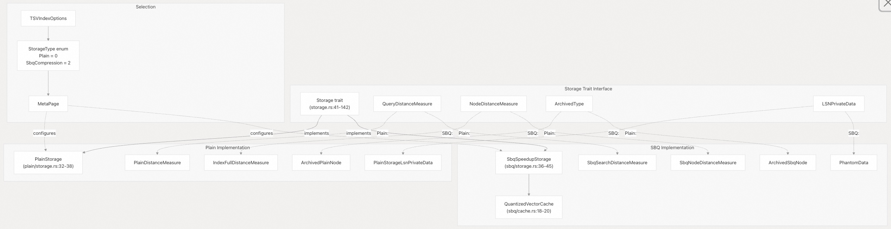
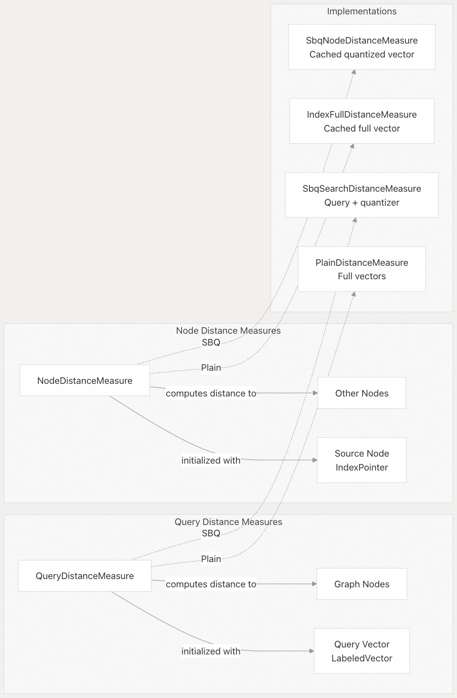
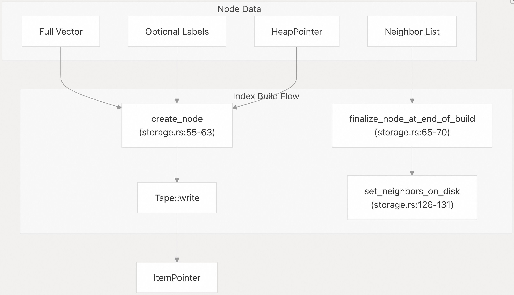
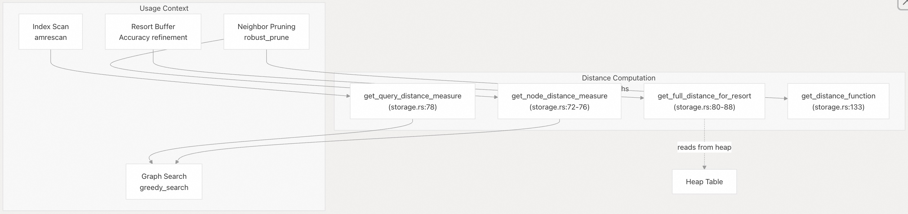
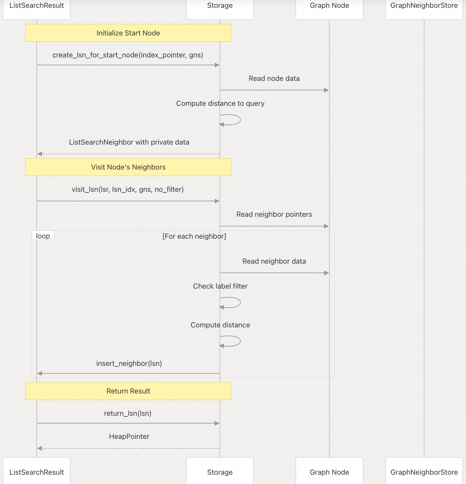
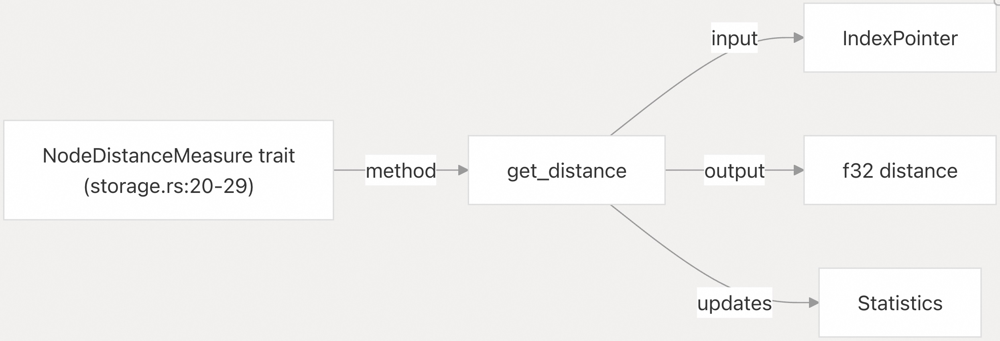
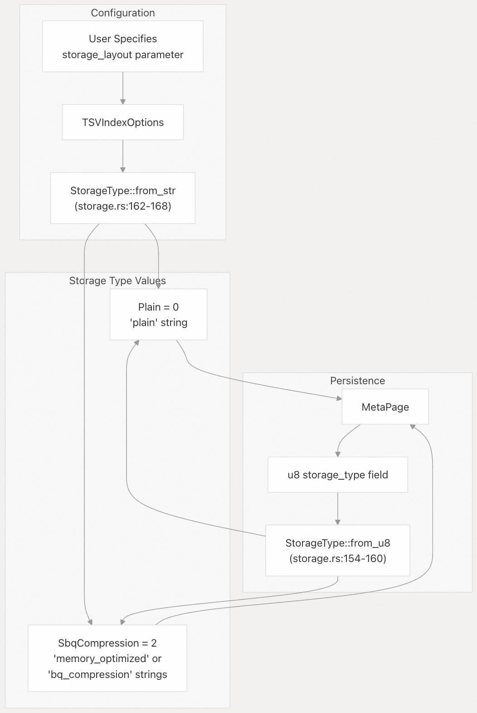
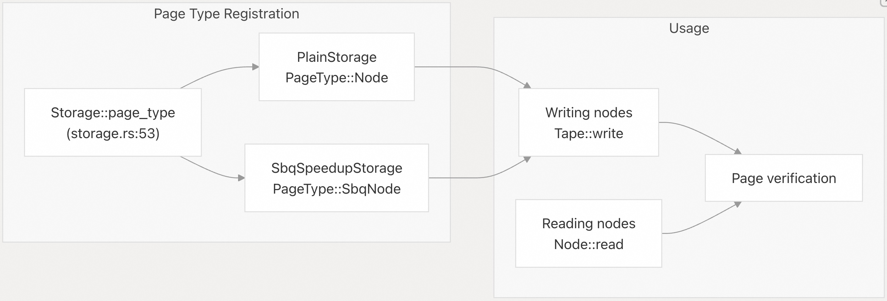

## pgvectorscale 源码学习: 4.1 存储特性与抽象（Storage Trait and Abstractions）    
        
### 作者        
digoal        
        
### 日期        
2025-11-10        
        
### 标签        
pgvectorscale , 向量数据库 , DiskANN , StreamingDiskANN , 源码学习        
        
----        
        
## 背景        
本文分享 `Storage` 特性（trait），它定义了 `pgvectorscale` 中向量存储实现（vector storage implementations）的抽象层（abstraction layer）。该特性使得不同的存储策略（storage strategies）可以在索引的整个生命周期中互换使用，包括从构建到查询的各个阶段。本文涵盖了特性接口（trait interface）、关联类型（associated types）和核心方法（core methods）。  
  
## 存储特性架构（Storage Trait Architecture）  
  
`Storage` 特性提供了一个通用接口（generic interface），允许 DiskANN 索引（index）在不修改图算法（graph algorithms）或访问方法回调（access method callbacks）的情况下，使用不同的向量存储和压缩策略。  
  
  
  
来源:  
[`pgvectorscale/src/access_method/storage.rs` 41-169](https://github.com/timescale/pgvectorscale/blob/36271fa5/pgvectorscale/src/access_method/storage.rs#L41-L169)  
[`pgvectorscale/src/access_method/plain/storage.rs` 32-82](https://github.com/timescale/pgvectorscale/blob/36271fa5/pgvectorscale/src/access_method/plain/storage.rs#L32-L82)  
[`pgvectorscale/src/access_method/sbq/storage.rs` 36-123](https://github.com/timescale/pgvectorscale/blob/36271fa5/pgvectorscale/src/access_method/sbq/storage.rs#L36-L123)  
  
## 存储特性定义（Storage Trait Definition）  
  
`Storage` 特性定义在 [`storage.rs` 41-142](https://github.com/timescale/pgvectorscale/blob/36271fa5/storage.rs#L41-L142)，是所有存储实现的主要抽象（primary abstraction）。  
  
### 关联类型（Associated Types）  
  
该特性定义了四种关联类型，允许实现自定义其内部数据结构：  
  
| 关联类型（Associated Type） | 目的（Purpose） | `PlainStorage` 类型 | `SbqSpeedupStorage` 类型 |  
| :--- | :--- | :--- | :--- |  
| `QueryDistanceMeasure` | 维护计算查询向量（query vector）和图节点（graph nodes）之间距离的状态 | `PlainDistanceMeasure` | `SbqSearchDistanceMeasure` |  
| `NodeDistanceMeasure<'a>` | 维护计算两个图节点之间距离的状态 | `IndexFullDistanceMeasure<'a>` | `SbqNodeDistanceMeasure<'a>` |  
| `ArchivedType<'b>` | 表示节点的磁盘格式（on-disk format），包括邻居指针（neighbor pointers） | `ArchivedPlainNode` | `ArchivedSbqNode<'b>` |  
| `LSNPrivateData` | 在图遍历（graph traversal）期间附加到搜索邻居的存储特定数据 | `PlainStorageLsnPrivateData` | `PhantomData<bool>` |  
  
来源:  
[`pgvectorscale/src/access_method/storage.rs` 42-51](https://github.com/timescale/pgvectorscale/blob/36271fa5/pgvectorscale/src/access_method/storage.rs#L42-L51)  
[`pgvectorscale/src/access_method/plain/storage.rs` 112-122](https://github.com/timescale/pgvectorscale/blob/36271fa5/pgvectorscale/src/access_method/plain/storage.rs#L112-L122)  
[`pgvectorscale/src/access_method/sbq/storage.rs` 237-247](https://github.com/timescale/pgvectorscale/blob/36271fa5/pgvectorscale/src/access_method/sbq/storage.rs#L237-L247)  
  
### 距离度量类型（Distance Measure Types）  
  
距离度量类型（Distance measure types）管理高效距离计算所需的状态：  
  
  
  
来源:  
[`pgvectorscale/src/access_method/storage.rs` 20-44](https://github.com/timescale/pgvectorscale/blob/36271fa5/pgvectorscale/src/access_method/storage.rs#L20-L44)  
  
## 核心存储方法（Core Storage Methods）  
  
`Storage` 特性方法按其在索引生命周期中的作用进行分组：  
  
### 节点创建与持久化（Node Creation and Persistence）  
  
  
  
| 方法（Method） | 目的（Purpose） | 参数（Parameters） | 返回值（Return） |  
| :--- | :--- | :--- | :--- |  
| `create_node` | 在构建或插入期间创建索引中的新节点 | `full_vector`, `labels`, `heap_pointer`, `meta_page`, `tape` | `ItemPointer` |  
| `finalize_node_at_end_of_build` | 在图构建完成后写入邻居关系 | `index_pointer`, `neighbors` | `void`（空） |  
| `set_neighbors_on_disk` | 更新现有节点的邻居列表 | `index_pointer`, `neighbors` | `void`（空） |  
| `get_neighbors_with_distances_from_disk` | 检索带有计算距离的邻居列表 | `neighbors_of` | `Vec<NeighborWithDistance>` |  
  
来源:  
[`pgvectorscale/src/access_method/storage.rs` 55-131](https://github.com/timescale/pgvectorscale/blob/36271fa5/pgvectorscale/src/access_method/storage.rs#L55-L131)  
[`pgvectorscale/src/access_method/plain/storage.rs` 128-321](https://github.com/timescale/pgvectorscale/blob/36271fa5/pgvectorscale/src/access_method/plain/storage.rs#L128-L321)  
[`pgvectorscale/src/access_method/sbq/storage.rs` 253-437](https://github.com/timescale/pgvectorscale/blob/36271fa5/pgvectorscale/src/access_method/sbq/storage.rs#L253-L437)  
  
### 距离计算方法（Distance Computation Methods）  
  
距离计算是关键的性能路径（critical performance path），因此该特性为不同场景提供了专门的方法：  
  
  
  
| 方法（Method） | 目的（Purpose） | 使用时机（When Used） |  
| :--- | :--- | :--- |  
| `get_query_distance_measure` | 初始化查询向量的距离计算状态 | 在扫描开始时（`amrescan`） |  
| `get_node_distance_measure` | 初始化特定节点的距离计算状态 | 在邻居修剪（neighbor pruning）和比较期间 |  
| `get_full_distance_for_resort` | 通过从堆（heap）中读取完整向量来计算精确距离 | 在重排（resort）细化以提高准确性期间 |  
| `get_distance_function` | 返回原始距离函数（L2、余弦（cosine）、内积（inner product）） | 用于不带状态的直接距离计算 |  
  
来源:  
[`pgvectorscale/src/access_method/storage.rs` 72-133](https://github.com/timescale/pgvectorscale/blob/36271fa5/pgvectorscale/src/access_method/storage.rs#L72-L133)  
[`pgvectorscale/src/access_method/plain/storage.rs` 165-198](https://github.com/timescale/pgvectorscale/blob/36271fa5/pgvectorscale/src/access_method/plain/storage.rs#L165-L198)  
[`pgvectorscale/src/access_method/sbq/storage.rs` 292-328](https://github.com/timescale/pgvectorscale/blob/36271fa5/pgvectorscale/src/access_method/sbq/storage.rs#L292-L328)  
  
### 图搜索集成（Graph Search Integration）  
  
存储特性为与 DiskANN 图搜索算法（graph search algorithm）的集成提供了专门的方法：  
  
  
  
| 方法（Method） | 目的（Purpose） | 详情（Details） |  
| :--- | :--- | :--- |  
| `create_lsn_for_start_node` | 为搜索起始点创建 `ListSearchNeighbor` | 如果节点已被处理则返回 `None`（处理多个标签（labels）） |  
| `visit_lsn` | 访问节点的邻居并将其添加到搜索结果 | 如果配置了标签过滤（label filtering）则应用 |  
| `return_lsn` | 从搜索邻居中提取堆指针（heap pointer） | 用于将 `TID` 返回给 `PostgreSQL` |  
  
`LSNPrivateData` 关联类型允许存储实现用每个搜索邻居来缓存数据。`PlainStorage` 缓存堆指针和邻居列表（[`plain/storage.rs` 85-110](https://github.com/timescale/pgvectorscale/blob/36271fa5/plain/storage.rs#L85-L110)），而 `SbqSpeedupStorage` 使用 `PhantomData`，因为它按需检索数据（[`sbq/storage.rs` 461](https://github.com/timescale/pgvectorscale/blob/36271fa5/sbq/storage.rs#L461-L461)）。  
  
来源:  
[`pgvectorscale/src/access_method/storage.rs` 90-116](https://github.com/timescale/pgvectorscale/blob/36271fa5/pgvectorscale/src/access_method/storage.rs#L90-L116)  
[`pgvectorscale/src/access_method/plain/storage.rs` 223-307](https://github.com/timescale/pgvectorscale/blob/36271fa5/pgvectorscale/src/access_method/plain/storage.rs#L223-L307)  
[`pgvectorscale/src/access_method/sbq/storage.rs` 125-415](https://github.com/timescale/pgvectorscale/blob/36271fa5/pgvectorscale/src/access_method/sbq/storage.rs#L125-L415)  
  
### 标签管理（Label Management）  
  
该特性提供了用于处理基于标签的过滤（label-based filtering）的方法：  
  
| 方法（Method） | 签名（Signature） | 目的（Purpose） |  
| :--- | :--- | :--- |  
| `get_labels` | `fn get_labels(index_pointer, stats) -> Option<LabelSet>` | 检索特定节点的标签集（label set） |  
| `get_has_labels` | `fn get_has_labels() -> bool` | 返回此存储实例是否支持标签 |  
  
`PlainStorage` 不支持标签，并始终返回 `None` 和 `false`（[`plain/storage.rs` 327-337](https://github.com/timescale/pgvectorscale/blob/36271fa5/plain/storage.rs#L327-L337)）。`SbqSpeedupStorage` 在配置后支持标签（[`sbq/storage.rs` 443-458](https://github.com/timescale/pgvectorscale/blob/36271fa5/sbq/storage.rs#L443-L458)）。  
  
来源:  
[`pgvectorscale/src/access_method/storage.rs` 135-141](https://github.com/timescale/pgvectorscale/blob/36271fa5/pgvectorscale/src/access_method/storage.rs#L135-L141)  
[`pgvectorscale/src/access_method/plain/storage.rs` 327-337](https://github.com/timescale/pgvectorscale/blob/36271fa5/pgvectorscale/src/access_method/plain/storage.rs#L327-L337)  
[`pgvectorscale/src/access_method/sbq/storage.rs` 443-458](https://github.com/timescale/pgvectorscale/blob/36271fa5/pgvectorscale/src/access_method/sbq/storage.rs#L443-L458)  
  
## 相关特性（Related Traits）  
  
存储系统定义了与 `Storage` 协同工作的其他特性：  
  
### NodeDistanceMeasure 特性  
  
  
  
`NodeDistanceMeasure` 特性（[`storage.rs` 20-29](https://github.com/timescale/pgvectorscale/blob/36271fa5/storage.rs#L20-L29)）定义了一个方法：  
  
  * `get_distance`: 计算用于初始化距离度量的节点与由 `IndexPointer` 指定的另一个节点之间的距离  
  
此特性用于邻居修剪（neighbor pruning）期间，以高效地比较多个节点对之间的距离，而无需重新读取源节点。  
  
来源:  
[`pgvectorscale/src/access_method/storage.rs` 20-29](https://github.com/timescale/pgvectorscale/blob/36271fa5/pgvectorscale/src/access_method/storage.rs#L20-L29)  
  
### ArchivedData 特性  
  
`ArchivedData` 特性（[`storage.rs` 30-34](https://github.com/timescale/pgvectorscale/blob/36271fa5/storage.rs#L30-L34)）提供了从归档（on-disk）节点表示中访问数据的方法：  
  
| 方法（Method） | 返回类型（Return Type） | 目的（Purpose） |  
| :--- | :--- | :--- |  
| `is_deleted` | `bool` | 检查节点是否标记为已删除 |  
| `get_heap_item_pointer` | `HeapPointer` | 返回对应堆元组的指针 |  
| `get_index_pointer_to_neighbors` | `Vec<ItemPointer>` | 返回邻居指针列表 |  
  
来源:  
[`pgvectorscale/src/access_method/storage.rs` 30-34](https://github.com/timescale/pgvectorscale/blob/36271fa5/pgvectorscale/src/access_method/storage.rs#L30-L34)  
  
### NodeVacuum 特性  
  
`NodeVacuum` 特性（[`storage.rs` 36-39](https://github.com/timescale/pgvectorscale/blob/36271fa5/storage.rs#L36-L39)）扩展了 `ArchivedData`，增加了用于 `VACUUM` 操作的方法：  
  
| 方法（Method） | 目的（Purpose） |  
| :--- | :--- |  
| `with_data` | 从原始字节创建固定的可变引用（pinned mutable reference） |  
| `delete` | 将节点标记为已删除 |  
  
来源:  
[`pgvectorscale/src/access_method/storage.rs` 36-39](https://github.com/timescale/pgvectorscale/blob/36271fa5/storage.rs#L36-L39)  
  
## 存储类型选择（Storage Type Selection）  
  
系统使用 `StorageType` 枚举（enum）在存储实现之间进行选择：  
  
  
  
### StorageType 枚举  
  
`StorageType` 枚举（[`storage.rs` 144-169](https://github.com/timescale/pgvectorscale/blob/36271fa5/storage.rs#L144-L169)）定义了可用的存储策略：  
  
| 变体（Variant） | 数值（Numeric Value） | 字符串表示（String Representations） | 描述（Description） |  
| :--- | :--- | :--- | :--- |  
| `Plain` | 0 | `"plain"` | 全精度向量存储（Full-precision vector storage） |  
| `SbqCompression` | 2 | `"memory_optimized"`, `"bq_compression"` | 带有压缩的统计二值量化（Statistical Binary Quantization） |  
  
**注意：** 数值 1 曾用于已弃用的存储类型（请参阅 [`storage.rs` 147](https://github.com/timescale/pgvectorscale/blob/36271fa5/storage.rs#L147-L147) 中的注释）。  
  
默认存储类型由 `DEFAULT_STORAGE_TYPE_STR = "memory_optimized"` 定义（[`storage.rs` 151](https://github.com/timescale/pgvectorscale/blob/36271fa5/storage.rs#L151-L151)）。  
  
来源:  
[`pgvectorscale/src/access_method/storage.rs` 144-169](https://github.com/timescale/pgvectorscale/blob/36271fa5/storage.rs#L144-L169)  
  
## 存储生命周期（Storage Lifecycle）  
  
下表显示了在索引生命周期的不同阶段，存储实现是如何实例化的：  
  
| 生命周期阶段（Lifecycle Stage） | `PlainStorage` 构造函数 | `SbqSpeedupStorage` 构造函数 |  
| :--- | :--- | :--- |  
| 索引构建（Index Build） | `PlainStorage::new_for_build`（[`plain/storage.rs` 41-53](https://github.com/timescale/pgvectorscale/blob/36271fa5/plain/storage.rs#L41-L53)） | `SbqSpeedupStorage::new_for_build`（[`sbq/storage.rs` 53-74](https://github.com/timescale/pgvectorscale/blob/36271fa5/sbq/storage.rs#L53-L74)） |  
| 索引插入（Index Insert） | `PlainStorage::load_for_insert`（[`plain/storage.rs` 55-67](https://github.com/timescale/pgvectorscale/blob/36271fa5/plain/storage.rs#L55-L67)） | `SbqSpeedupStorage::load_for_insert`（[`sbq/storage.rs` 84-104](https://github.com/timescale/pgvectorscale/blob/36271fa5/sbq/storage.rs#L84-L104)） |  
| 索引搜索（Index Search） | `PlainStorage::load_for_search`（[`plain/storage.rs` 69-81](https://github.com/timescale/pgvectorscale/blob/36271fa5/plain/storage.rs#L69-L81)） | `SbqSpeedupStorage::load_for_search`（[`sbq/storage.rs` 106-123](https://github.com/timescale/pgvectorscale/blob/36271fa5/sbq/storage.rs#L106-L123)） |  
  
所有构造函数都需要：  
  
  * 索引关系（Index relation）（`&PgRelation`）  
  * 堆关系（Heap relation）（`&PgRelation`）  
  * 元数据页（MetaPage）（`&MetaPage`）  
  
`SBQ` 构造函数还会从索引中加载 `SbqQuantizer`，并为构建和插入操作初始化 `QuantizedVectorCache`（但在搜索时保持为 `None`）。  
  
来源:  
[`pgvectorscale/src/access_method/plain/storage.rs` 41-82](https://github.com/timescale/pgvectorscale/blob/36271fa5/pgvectorscale/src/access_method/plain/storage.rs#L41-L82)  
[`pgvectorscale/src/access_method/sbq/storage.rs` 53-123](https://github.com/timescale/pgvectorscale/blob/36271fa5/pgvectorscale/src/access_method/sbq/storage.rs#L53-L123)  
  
## PageType 区分（PageType Differentiation）  
  
每个存储实现都使用不同的 `PageType` 标识符来标记包含其节点的页面：  
  
  
  
  * `PlainStorage`: `PageType::Node`（[`plain/storage.rs` 124-126](https://github.com/timescale/pgvectorscale/blob/36271fa5/plain/storage.rs#L124-L126)）  
  * `SbqSpeedupStorage`: `PageType::SbqNode`（[`sbq/storage.rs` 249-251](https://github.com/timescale/pgvectorscale/blob/36271fa5/sbq/storage.rs#L249-L251)）  
  
这种区分允许系统验证页面是否使用正确的存储实现读取，并防止数据损坏。  
  
来源:  
[`pgvectorscale/src/access_method/storage.rs` 53](https://github.com/timescale/pgvectorscale/blob/36271fa5/pgvectorscale/src/access_method/storage.rs#L53-L53)  
[`pgvectorscale/src/access_method/plain/storage.rs` 124-126](https://github.com/timescale/pgvectorscale/blob/36271fa5/pgvectorscale/src/access_method/plain/storage.rs#L124-L126)  
[`pgvectorscale/src/access_method/sbq/storage.rs` 249-251](https://github.com/timescale/pgvectorscale/blob/36271fa5/pgvectorscale/src/access_method/sbq/storage.rs#L249-L251)  
  
      
#### [PolarDB 学习图谱](https://www.aliyun.com/database/openpolardb/activity "8642f60e04ed0c814bf9cb9677976bd4")
  
  
#### [PostgreSQL 解决方案集合](../201706/20170601_02.md "40cff096e9ed7122c512b35d8561d9c8")
  
  
#### [德哥 / digoal's Github - 公益是一辈子的事.](https://github.com/digoal/blog/blob/master/README.md "22709685feb7cab07d30f30387f0a9ae")
  
  
#### [About 德哥](https://github.com/digoal/blog/blob/master/me/readme.md "a37735981e7704886ffd590565582dd0")
  
  

  
