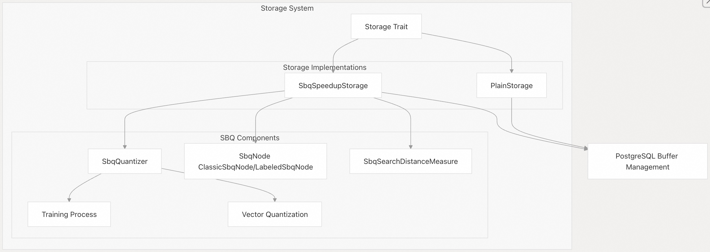
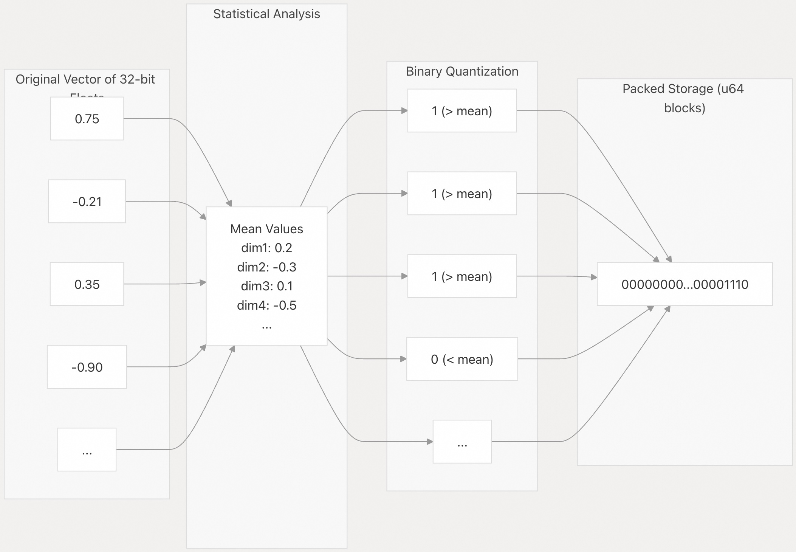
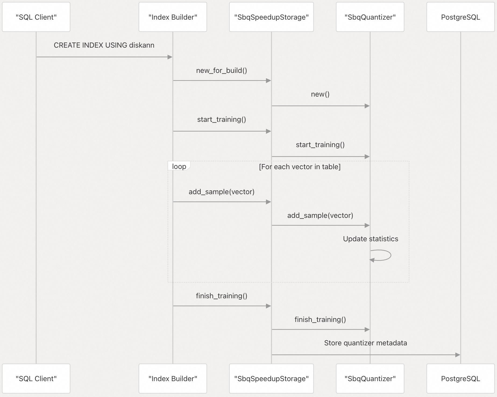
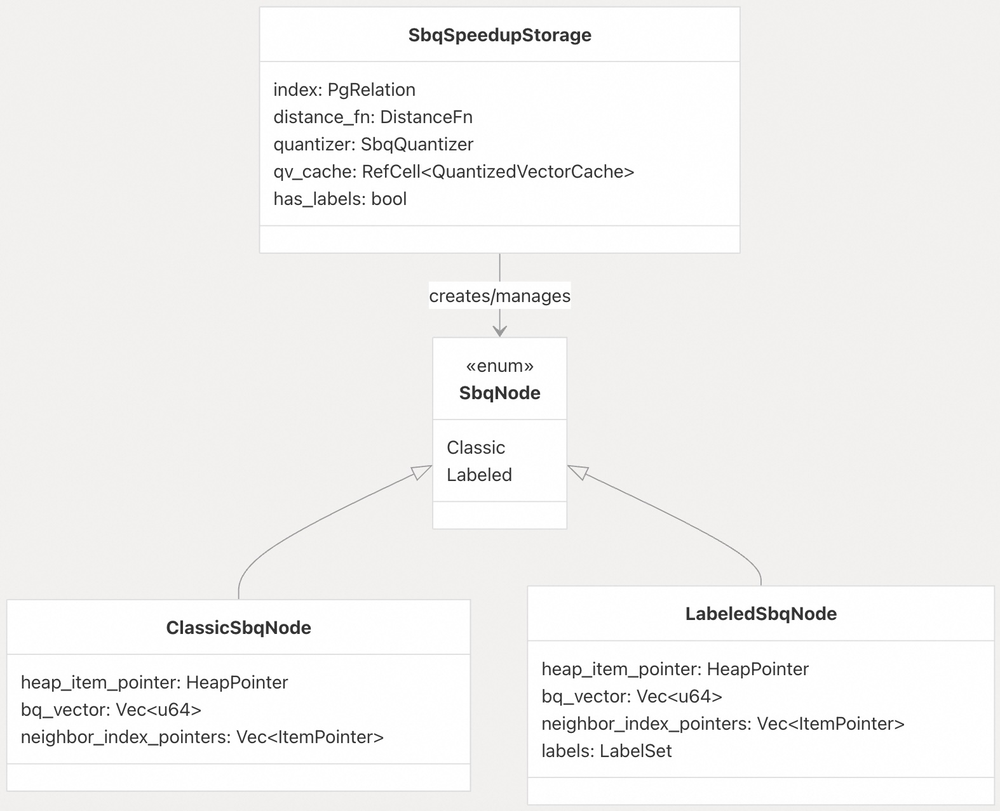
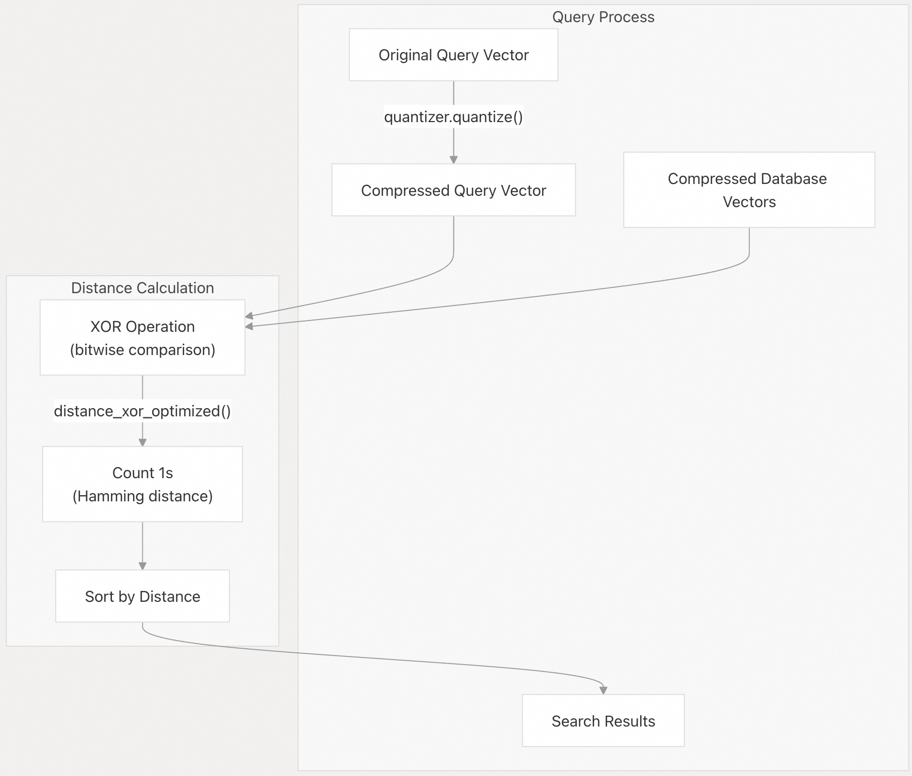

## pgvectorscale 源码学习: 4.2 SBQ 压缩（SBQ Compression）   
          
### 作者          
digoal          
          
### 日期          
2025-11-10          
          
### 标签          
pgvectorscale , 向量数据库 , DiskANN , StreamingDiskANN , 源码学习          
          
----          
          
## 背景          
本文介绍 **pgvectorscale** 中的 **统计二值量化（Statistical Binary Quantization, SBQ）** 压缩技术。该技术显著减少了向量数据（vector data）的内存占用（memory footprint），同时保持了搜索质量。SBQ 作为 **StreamingDiskANN** 索引的一种内存优化存储选项得以实现。  
  
## 概述（Overview）  
  
统计二值量化（Statistical Binary Quantization, SBQ）是一种向量压缩技术，它将高维浮点向量（high-dimensional floating-point vectors）转换为紧凑的二值表示（compact binary representations）。它的工作原理是在索引创建期间分析向量的统计属性，然后使用更少的位（通常每个维度 1 位）对每个维度进行编码。  
  
SBQ 压缩的主要优势包括：  
  
  * 显著减少内存使用（对于 1 位量化，可减少高达 97%）。  
  * 通过 **XOR 位操作（XOR bit operations）** 加快距离计算。  
  * 提高大型向量集合的 **缓存效率（cache efficiency）**。  
  * 在大多数应用中，对搜索精度（search accuracy）的损失最小。  
  
  
  
来源:  
  
  * [`pgvectorscale/src/access_method/sbq.rs` 424-432](https://github.com/timescale/pgvectorscale/blob/36271fa5/pgvectorscale/src/access_method/sbq.rs#L424-L432)  
  * [`pgvectorscale/src/access_method/plain_storage.rs` 25-31](https://github.com/timescale/pgvectorscale/blob/36271fa5/pgvectorscale/src/access_method/plain_storage.rs#L25-L31)  
  
## SBQ 压缩的工作原理（How SBQ Compression Works）  
  
SBQ 分两个阶段运行：索引创建期间的训练阶段（training phase）和每个向量的量化阶段（quantization phase）。  
  
### 训练阶段（Training Phase）  
  
在训练阶段，系统会：  
  
1.  分析向量样本，计算每个维度的统计度量。  
2.  计算每个维度的**平均值（mean）**（用于 1 位量化）。  
3.  此外，还会计算多位量化的**方差/标准差（variance/standard deviation）**。  
4.  将这些统计数据作为 **元数据（metadata）** 存储起来，用于量化过程。  
  
训练过程使用 **在线算法（online algorithm）** 对数据进行单次遍历来计算统计数据，这使得即使对于大型数据集也具有高效率。  
  
### 量化过程（Quantization Process）  
  
对于每个向量维度，SBQ 应用以下逻辑：  
  
#### 1 位量化（1-Bit Quantization, 默认）  
  
  * 如果值高于该维度的平均值（mean），则存储 1。  
  * 如果值低于该维度的平均值（mean），则存储 0。  
  
这种二值编码提供了向量相对于数据集 **质心（centroid）** 位置的紧凑表示。  
  
#### 多位量化（Multi-Bit Quantization, 可选）  
  
为了获得更高的精度，SBQ 可以为每个维度使用更多位：  
  
1.  计算 **z-分数（z-score）**：(值 - 平均值) / 标准差。  
2.  将 z-分数范围（通常为 -2 到 +2）划分为 $2^n$ 个区域。  
3.  用 $n$ 位对值所属的区域进行编码。  
  
  
  
来源:  
  
  * [`pgvectorscale/src/access_method/sbq.rs` 140-296](https://github.com/timescale/pgvectorscale/blob/36271fa5/pgvectorscale/src/access_method/sbq.rs#L140-L296)  
  * [`pgvectorscale/src/access_method/sbq.rs` 187-237](https://github.com/timescale/pgvectorscale/blob/36271fa5/pgvectorscale/src/access_method/sbq.rs#L187-L237)  
  
## SBQ 量化器实现（SBQ Quantizer Implementation）  
  
`SbqQuantizer` 类管理训练和量化过程。它维护：  
  
  * 每个维度的统计数据（平均值 `mean` 和可选的方差 `variance`）。  
  * 每个维度位数等配置设置。  
  * 用于训练和向量量化的方法。  
  
在索引创建期间，量化器（quantizer）被初始化并在输入向量上进行训练。生成的统计模型存储在索引的元数据页（metadata pages）中。  
  
  
  
来源:  
  
  * [`pgvectorscale/src/access_method/sbq.rs` 140-296](https://github.com/timescale/pgvectorscale/blob/36271fa5/pgvectorscale/src/access_method/sbq.rs#L140-L296)  
  * [`pgvectorscale/src/access_method/sbq.rs` 654-665](https://github.com/timescale/pgvectorscale/blob/36271fa5/pgvectorscale/src/access_method/sbq.rs#L654-L665)  
  
## 存储结构（Storage Structure）  
  
SBQ 压缩的向量存储在 `ClassicSbqNode`（不带标签）或 `LabeledSbqNode`（带标签）结构中。这些结构使用 PostgreSQL 的缓冲区管理系统（buffer management system）序列化到磁盘。  
  
### 节点结构（Node Structure）  
  
每个 SBQ 节点包含：  
  
  * 指向堆中原始元组的指针（`heap_item_pointer`）。  
  * 存储为 `u64` 值数组的二值量化向量（`bq_vector`）。  
  * 指向图中邻居节点的引用（`neighbor_index_pointers`）。  
  * 可选的用于过滤搜索的标签信息（在 `LabeledSbqNode` 中）。  
  
  
  
来源:  
  
  * [`pgvectorscale/src/access_method/sbq_node.rs` 20-120](https://github.com/timescale/pgvectorscale/blob/36271fa5/pgvectorscale/src/access_method/sbq_node.rs#L20-L120)  
  * [`pgvectorscale/src/access_method/sbq.rs` 424-432](https://github.com/timescale/pgvectorscale/blob/36271fa5/pgvectorscale/src/access_method/sbq.rs#L424-L432)  
  
## 使用 SBQ 进行距离计算（Distance Calculation with SBQ）  
  
SBQ 压缩的一个主要优势是使用位操作（bit operations）而非浮点算术（floating-point arithmetic）进行高效的距离计算。  
  
### 基于 XOR 的距离测量（XOR-Based Distance Measurement）  
  
两个 SBQ 压缩向量之间的距离计算方法如下：  
  
1.  对向量执行 **按位 XOR（bitwise XOR）** 操作。  
2.  计算结果中 1 的数量（即**汉明距离（Hamming distance）**）。  
3.  使用此计数作为距离度量（distance metric）。  
  
这种方法比传统的基于浮点的距离计算快得多，特别是对于高维向量。  
  
  
  
`SbqSearchDistanceMeasure` 中的实现首先量化查询向量（query vector），然后使用 XOR 操作高效地计算与存储向量的距离。  
  
来源:  
  
  * [`pgvectorscale/src/access_method/sbq.rs` 298-346](https://github.com/timescale/pgvectorscale/blob/36271fa5/pgvectorscale/src/access_method/sbq.rs#L298-L346)  
  * [`pgvectorscale/src/access_method/sbq.rs` 369-377](https://github.com/timescale/pgvectorscale/blob/36271fa5/pgvectorscale/src/access_method/sbq.rs#L369-L377)  
  
## 内存效率和缓存（Memory Efficiency and Caching）  
  
为了提高查询期间的性能，SBQ 实现了量化向量的缓存：  
  
  * `QuantizedVectorCache` 存储最近访问的向量表示。  
  * 这避免了重复从磁盘读取和解压缩向量。  
  * 该缓存机制在图遍历（graph traversal）期间特别有效，因为许多节点会被多次访问。  
  
结合紧凑的表示形式，这种缓存机制显著提高了搜索性能。  
  
来源:  
  
  * [`pgvectorscale/src/access_method/sbq.rs` 380-422](https://github.com/timescale/pgvectorscale/blob/36271fa5/pgvectorscale/src/access_method/sbq.rs#L380-L422)  
  
## 配置和使用（Configuration and Usage）  
  
SBQ 压缩是 **pgvectorscale** 中的默认存储布局（storage layout），并通过 `storage_layout` 参数激活。  
  
### 使用 SBQ 压缩创建索引（Creating an Index with SBQ Compression）  
  
```sql  
CREATE INDEX vector_idx ON items USING diskann (vector_column)  
WITH (storage_layout = 'memory_optimized');  
```  
  
### 配置每个维度的位数（Configuring Bits Per Dimension）  
  
您可以使用 `bq_num_bits_per_dimension` 参数调整每个维度使用的位数：  
  
```sql  
CREATE INDEX vector_idx ON items USING diskann (vector_column)  
WITH (  
    storage_layout = 'memory_optimized',  
    bq_num_bits_per_dimension = 2  
);  
```  
  
较高的值会以增加存储空间为代价提供更好的近似效果。  
  
### 带有标签过滤（With Label Filtering）  
  
SBQ 压缩支持带有标签的向量以进行过滤搜索（filtered search）：  
  
```sql  
CREATE INDEX vector_idx ON items USING diskann (vector_column)  
WITH (  
    storage_layout = 'memory_optimized',  
    label_dimension = 'category_column'  
);  
```  
  
## 性能特性（Performance Characteristics）  
  
### 内存使用对比（Memory Usage Comparison）  
  
下表显示了与 32 位浮点（floating-point）向量相比的内存减少情况：  
  
| 每个维度的位数（Bits Per Dimension） | 内存减少（Memory Reduction） | 压缩比（Compression Ratio） |  
| :--- | :--- | :--- |  
| 1 | \~97% | 32:1 |  
| 2 | \~94% | 16:1 |  
| 3 | \~91% | 10.7:1 |  
| 4 | \~88% | 8:1 |  
  
### 性能与精度权衡（Performance vs. Accuracy Trade-off）  
  
增加每个维度的位数会提高搜索精度，但会降低性能优势：  
  
| 配置（Configuration） | 内存使用（Memory Usage） | 搜索速度（Search Speed） | 召回质量（Recall Quality） |  
| :--- | :--- | :--- | :--- |  
| 1-bit (默认) | 最低 | 最快 | 良好 |  
| 2-bit | 低 | 快 | 较好 |  
| 3-bit | 中 | 中 | 非常好 |  
| 4-bit | 较高 | 较慢 | 优秀 |  
| Plain storage（普通存储） | 最高 | 最慢 | 最佳 |  
  
对于大多数应用，默认的 1 位量化在内存效率、搜索速度和精度之间提供了出色的平衡。  
  
来源:  
  
  * [`pgvectorscale/src/access_method/sbq.rs` 148-159](https://github.com/timescale/pgvectorscale/blob/36271fa5/pgvectorscale/src/access_method/sbq.rs#L148-L159)  
  * [`pgvectorscale/src/access_method/sbq.rs` 172-180](https://github.com/timescale/pgvectorscale/blob/36271fa5/pgvectorscale/src/access_method/sbq.rs#L172-L180)  
  
## 实现细节（Implementation Details）  
  
SBQ 使用 **Rust** 实现，具有以下关键组件：  
  
1.  `SbqQuantizer` - 处理训练和量化。  
2.  `SbqNode` - 存储量化向量和邻居信息。  
3.  `SbqSearchDistanceMeasure` - 计算量化向量之间的距离。  
4.  `SbqSpeedupStorage` - 管理 SBQ 压缩数据的持久化和检索。  
  
该实现使用 **rkyv** 进行序列化，并采用自定义的内存高效存储结构。  
  
来源:  
  
  * [`pgvectorscale/src/access_method/sbq.rs`](https://github.com/timescale/pgvectorscale/blob/36271fa5/pgvectorscale/src/access_method/sbq.rs)  
  * [`pgvectorscale/src/access_method/sbq_node.rs`](https://github.com/timescale/pgvectorscale/blob/36271fa5/pgvectorscale/src/access_method/sbq_node.rs)  
  * [`pgvectorscale_derive/src/lib.rs`](https://github.com/timescale/pgvectorscale/blob/36271fa5/pgvectorscale_derive/src/lib.rs)  
  
        
#### [PolarDB 学习图谱](https://www.aliyun.com/database/openpolardb/activity "8642f60e04ed0c814bf9cb9677976bd4")
  
  
#### [PostgreSQL 解决方案集合](../201706/20170601_02.md "40cff096e9ed7122c512b35d8561d9c8")
  
  
#### [德哥 / digoal's Github - 公益是一辈子的事.](https://github.com/digoal/blog/blob/master/README.md "22709685feb7cab07d30f30387f0a9ae")
  
  
#### [About 德哥](https://github.com/digoal/blog/blob/master/me/readme.md "a37735981e7704886ffd590565582dd0")
  
  

  
