## pgvectorscale 源码学习: 4.3 纯存储 (Plain Storage)  
            
### 作者            
digoal            
            
### 日期            
2025-11-10            
            
### 标签            
pgvectorscale , 向量数据库 , DiskANN , StreamingDiskANN , 源码学习            
            
----            
            
## 背景            
纯存储 (`Plain Storage`) 是 `pgvectorscale` 中两种存储实现之一，用于确定**向量数据** (`vector data`) 如何持久化到磁盘。本文介绍 `PlainStorage` 的实现，它存储**全精度、未压缩向量** (`full-precision, uncompressed vectors`)。当**索引选项** (`index option`) `storage_layout` 设置为 `"plain"` 时，将选择纯存储 (`Plain Storage`)。  
  
**来源:**  
[`pgvectorscale/src/access_method/storage.rs` 144-169](https://github.com/timescale/pgvectorscale/blob/36271fa5/pgvectorscale/src/access_method/storage.rs#L144-L169)  
[`pgvectorscale/src/access_method/plain/storage.rs` 1-339](https://github.com/timescale/pgvectorscale/blob/36271fa5/pgvectorscale/src/access_method/plain/storage.rs#L1-L339)  
  
-----  
  
## 概述 (Overview)  
  
`PlainStorage` 是直接的存储实现，以全精度存储向量，不进行任何**压缩** (`compression`) 或量化 (`quantization`)。索引中的每个节点 (`node`) 都包含完整的向量数据 (`vector data`) 以及元数据 (`metadata`)，包括**堆指针** (`heap pointer`) 和**邻居列表** (`neighbor list`)。  
  
### 关键特性 (Key Characteristics)  
  
| 特性 (Characteristic) | 值 (Value) |  
| :--- | :--- |  
| **存储类型枚举** (`Storage Type Enum`) | `StorageType::Plain = 0` |  
| **页面类型** (`Page Type`) | `PageType::Node` |  
| **压缩** (`Compression`) | 无 (`None`) |  
| **内存使用** (`Memory Usage`) | 高（完全 `f32` 精度） |  
| **搜索精度** (`Search Accuracy`) | 精确（无近似） |  
| **标签支持** (`Label Support`) | 无 (`No`) |  
  
**来源:**  
[`pgvectorscale/src/access_method/storage.rs` 144-149](https://github.com/timescale/pgvectorscale/blob/36271fa5/pgvectorscale/src/access_method/storage.rs#L144-L149)  
[`pgvectorscale/src/access_method/plain/storage.rs` 124-126](https://github.com/timescale/pgvectorscale/blob/36271fa5/pgvectorscale/src/access_method/plain/storage.rs#L124-L126)  
  
-----  
  
## `PlainStorage` 结构 (PlainStorage Structure)  
  
### 核心结构定义 (Core Structure Definition)  
  
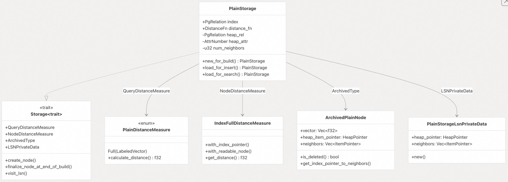  
  
`PlainStorage` 结构体持有**索引关系** (`index relation`) 和**堆关系** (`heap relation`) 的引用，使其能够在重排序 (`resort`) 操作期间从堆 (`heap`) 中读取完整的向量。`distance_fn` 字段存储在索引创建时选择的距离度量（L2、余弦或内积 (`L2, cosine, or inner product`)）。  
  
**来源:**  
[`pgvectorscale/src/access_method/plain/storage.rs` 32-38](https://github.com/timescale/pgvectorscale/blob/36271fa5/pgvectorscale/src/access_method/plain/storage.rs#L32-L38)  
[`pgvectorscale/src/access_method/plain/storage.rs` 85-110](https://github.com/timescale/pgvectorscale/blob/36271fa5/pgvectorscale/src/access_method/plain/storage.rs#L85-L110)  
  
### 生命周期方法 (Lifecycle Methods)  
  
`PlainStorage` 有三个工厂方法 (`factory methods`)，对应于索引操作的不同阶段：  
  
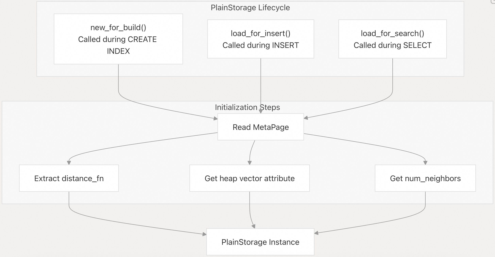  
  
| 方法名称 | 用途 |  
| :--- | :--- |  
| `new_for_build` | 索引构建 (`index build`) |  
| `new_for_search` | 索引搜索 (`index search`) |  
| `new_for_maintenance` | 维护（例如：`VACUUM`） |  
  
这三个方法执行相似的初始化，从 **MetaPage** (元数据页) 中加载配置，包括：  
  
  * **距离函数** (`distance function`) (`get_distance_function()`)  
  * 来自堆的**向量属性编号** (`vector attribute number`) (`get_index_vector_attribute()`)  
  * 每个节点的邻居数量 (`num_neighbors`) (`get_num_neighbors()`)  
  
**来源:**  
[`pgvectorscale/src/access_method/plain/storage.rs` 40-82](https://github.com/timescale/pgvectorscale/blob/36271fa5/pgvectorscale/src/access_method/plain/storage.rs#L40-L82)  
  
-----  
  
## 存储特质 (`Storage Trait`) 实现 (Storage Trait Implementation)  
  
`PlainStorage` 通过定义四个**关联类型** (`associated types`) 并实现用于节点操作 (`node operations`) 的众多方法，来实现 `Storage` **特质** (`trait`)。  
  
### 关联类型 (Associated Types)  
  
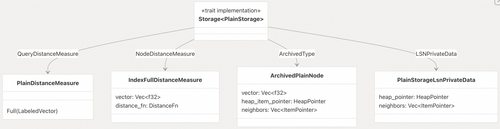  
  
| 关联类型 (Associated Type) | 纯存储类型 (Plain Storage Type) | 目的 (Purpose) |  
| :--- | :--- | :--- |  
| `QueryDistanceMeasure` | `PlainDistanceMeasure` | 比较查询向量 (`query vector`) 与索引节点 (`index nodes`) |  
| `NodeDistanceMeasure` | `IndexFullDistanceMeasure` | 比较两个索引节点 (`index nodes`) |  
| `ArchivedType` | `ArchivedPlainNode` | 表示磁盘上的序列化节点 (`serialized node`) |  
| `LSNPrivateData` | `PlainStorageLsnPrivateData` | **列表搜索邻居** (`list search neighbors`) 的缓存数据 |  
  
**来源:**  
[`pgvectorscale/src/access_method/plain/storage.rs` 112-122](https://github.com/timescale/pgvectorscale/blob/36271fa5/pgvectorscale/src/access_method/plain/storage.rs#L112-L122)  
  
-----  
  
## 节点创建与定型 (Node Creation and Finalization)  
  
### 创建新节点 (Creating a New Node)  
  
`create_node` 方法在索引构建 (`index build`) 和插入 (`insert`) 操作期间调用，以向索引中添加一个新向量：  
  
  
  
该方法：  
  
1.  创建一个包含完整向量的 `PlainNode`  
2.  将其写入**磁带（顺序页面写入器）** (`tape (sequential page writer)`)  
3.  返回一个标识节点位置的**项指针** (`ItemPointer`)  
  
请注意，`labels` 被忽略，因为纯存储 (`Plain Storage`) 不支持**标签过滤** (`label filtering`)。向量被克隆到节点结构中。  
  
**来源:**  
[`pgvectorscale/src/access_method/plain/storage.rs` 128-141](https://github.com/timescale/pgvectorscale/blob/36271fa5/pgvectorscale/src/access_method/plain/storage.rs#L128-L141)  
  
### 邻居定型 (Finalizing Neighbors)  
  
在索引构建结束时，必须将**邻居列表** (`neighbor lists`) 写回磁盘。`finalize_node_at_end_of_build` 方法处理此过程：  
  
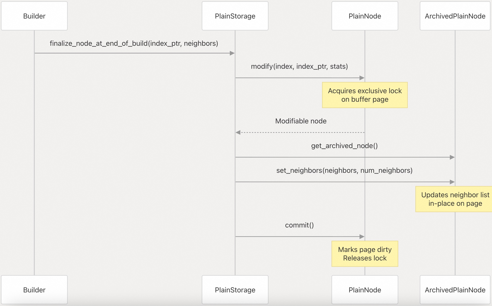  
  
此方法：  
  
1.  使用 `PlainNode::modify()` 打开节点进行修改  
2.  使用 `set_neighbors()` 更新邻居列表  
3.  提交更改，将**缓冲区页面** (`buffer page`) 标记为脏 (`dirty`)  
  
**来源:**  
[`pgvectorscale/src/access_method/plain/storage.rs` 143-155](https://github.com/timescale/pgvectorscale/blob/36271fa5/pgvectorscale/src/access_method/plain/storage.rs#L143-L155)  
  
-----  
  
## 距离度量 (Distance Measurement)  
  
纯存储 (`Plain Storage`) 提供两种距离度量机制，对应于两个**关联类型** (`associated types`)。  
  
### 查询距离度量 (Query Distance Measure)  
  
`PlainDistanceMeasure` 是一个枚举 (`enum`)，含有一个 `Full(LabeledVector)` 变体，用于持有查询向量 (`query vector`)：  
  
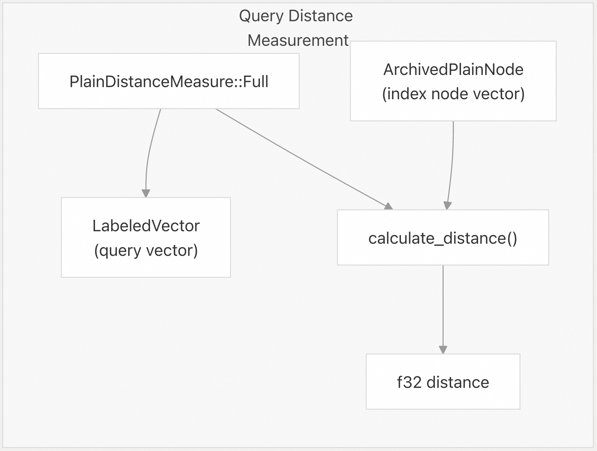  
  
`get_query_distance_measure` 方法将查询向量包装在枚举中：  
  
```rust  
fn get_query_distance_measure(&self, query: LabeledVector) -> PlainDistanceMeasure {  
    PlainDistanceMeasure::Full(query)  
}  
```  
  
**来源:**  
[`pgvectorscale/src/access_method/plain/storage.rs` 165-167](https://github.com/timescale/pgvectorscale/blob/36271fa5/pgvectorscale/src/access_method/plain/storage.rs#L165-L167)  
  
### 节点距离度量 (Node Distance Measure)  
  
`IndexFullDistanceMeasure` 比较一个引用节点 (`reference node`) 与索引中的其他节点。它由 `get_node_distance_measure` 创建：  
  
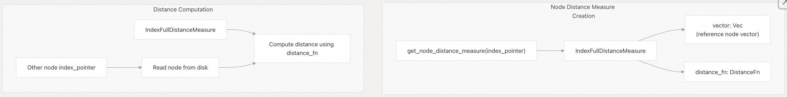  
  
这用于**邻居剪枝** (`neighbor pruning`) 操作期间，必须计算两个索引节点之间的距离。  
  
**来源:**  
[`pgvectorscale/src/access_method/plain/storage.rs` 157-163](https://github.com/timescale/pgvectorscale/blob/36271fa5/pgvectorscale/src/access_method/plain/storage.rs#L157-L163)  
  
-----  
  
## 列表搜索集成 (List Search Integration)  
  
在**贪婪搜索算法** (`greedy search algorithm`) 的图遍历 (`graph traversal`) 过程中，纯存储 (`Plain Storage`) 提供专门的方法来管理搜索状态 (`search state`)。  
  
### 列表搜索邻居私有数据 (List Search Neighbor Private Data)  
  
`PlainStorageLsnPrivateData` 缓存了在搜索过程中被访问的节点信息：  
  
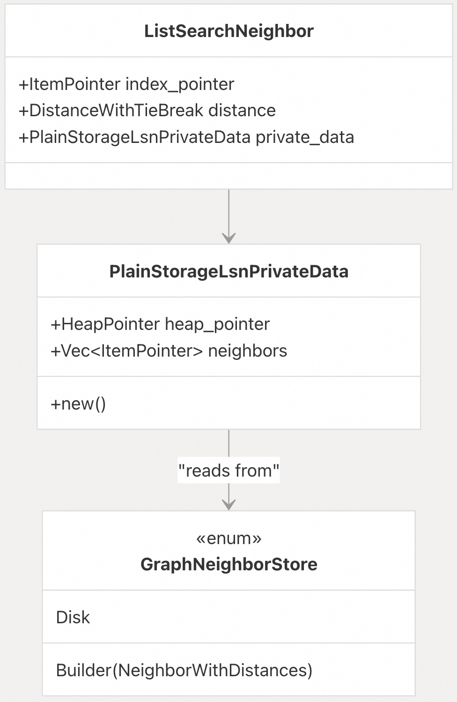  
  
`new()` 方法加载**堆指针** (`heap pointer`) 和**邻居列表** (`neighbor list`)，其逻辑根据图邻居 (`graph neighbors`) 是在磁盘上存储还是在构建期间存储在内存中而有所不同：  
  
  * **磁盘模式** (`Disk mode`)：从 `ArchivedPlainNode::get_index_pointer_to_neighbors()` 读取邻居  
  * **构建器模式** (`Builder mode`)：从内存中的 `GraphNeighborStore::Builder` 读取邻居  
  
**来源:**  
[`pgvectorscale/src/access_method/plain/storage.rs` 85-110](https://github.com/timescale/pgvectorscale/blob/36271fa5/pgvectorscale/src/access_method/plain/storage.rs#L85-L110)  
  
### 创建起始节点列表搜索邻居 (`Creating Start Node LSN`)  
  
`create_lsn_for_start_node` 方法从起始节点 (`start node`) 初始化搜索：  
  
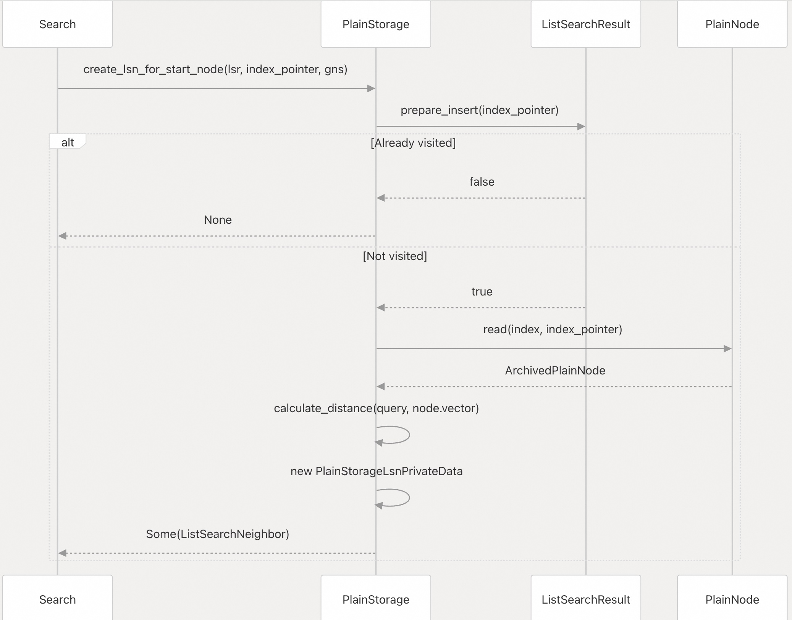  
  
此方法：  
  
1.  检查节点是否已处理  
2.  从磁盘读取节点  
3.  计算到查询的距离  
4.  使用缓存的私有数据创建 `ListSearchNeighbor`  
  
**来源:**  
[`pgvectorscale/src/access_method/plain/storage.rs` 223-252](https://github.com/timescale/pgvectorscale/blob/36271fa5/pgvectorscale/src/access_method/plain/storage.rs#L223-L252)  
  
### 访问邻居 (Visiting Neighbors)  
  
`visit_lsn` 方法通过访问节点的邻居来扩展**搜索前沿** (`search frontier`)：  
  
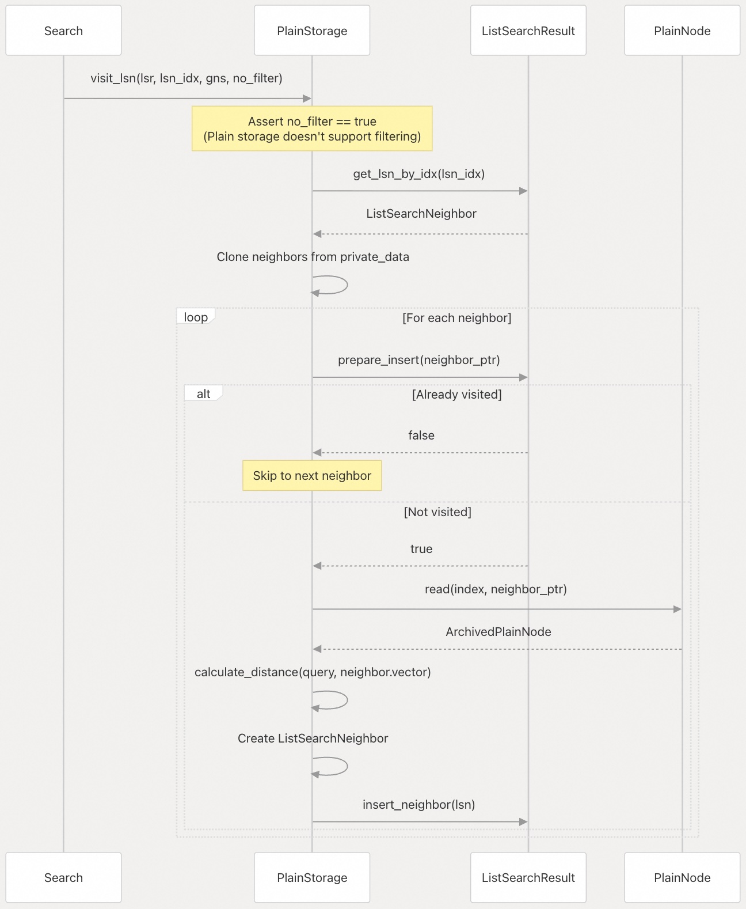  
  
要点：  
  
  * 断言 `no_filter == true`，因为纯存储 (`Plain Storage`) 不支持**标签过滤** (`label filtering`)  
  * 克隆邻居列表，以避免与 `lsr` 发生借用问题  
  * 对于每个未访问的邻居，读取它、计算距离并添加到**候选集合** (`candidate set`)  
  
**来源:**  
[`pgvectorscale/src/access_method/plain/storage.rs` 254-299](https://github.com/timescale/pgvectorscale/blob/36271fa5/pgvectorscale/src/access_method/plain/storage.rs#L254-L299)  
  
-----  
  
## 重排序机制 (Resort Mechanism)  
  
`get_full_distance_for_resort` 方法在索引使用比完整向量更少的维度时，能够提高搜索精度：  
  
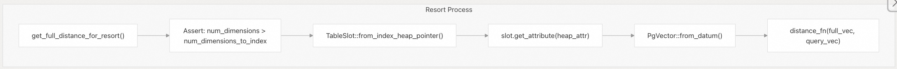  
  
此方法：  
  
1.  断言仅当维度不同时才需要**重排序** (`resort`)  
2.  使用 `TableSlot` 从**堆表** (`heap table`) 读取完整向量  
3.  将**向量属性** (`vector attribute`) 提取为**数据项** (`Datum`)  
4.  转换为具有完整维度的 `PgVector`  
5.  使用所有维度计算**精确距离** (`exact distance`)  
  
这仅在启用**俄罗斯套娃嵌入支持** (`Matryoshka embedding support`) 时调用（索引使用的维度少于存储的向量）。  
  
**来源:**  
[`pgvectorscale/src/access_method/plain/storage.rs` 169-198](https://github.com/timescale/pgvectorscale/blob/36271fa5/pgvectorscale/src/access_method/plain/storage.rs#L169-L198)  
  
-----  
  
## 邻居操作 (Neighbor Operations)  
  
纯存储 (`Plain Storage`) 实现了在磁盘上读取和写入邻居列表的方法。  
  
### 读取带距离的邻居 (Reading Neighbors with Distances)  
  
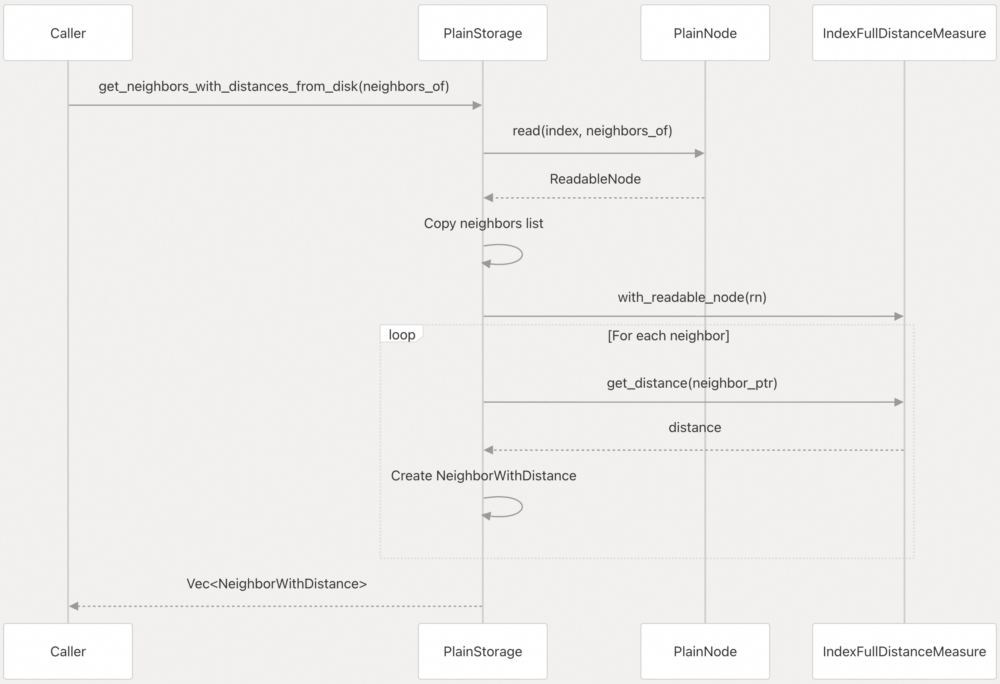  
  
此方法：  
  
1.  读取**引用节点** (`reference node`)  
2.  从中创建一个距离度量 (`distance measure`)  
3.  对于每个邻居，计算距离  
4.  返回带有距离注释的邻居  
  
**注意**：该实现对每个邻居节点读取两次（一次显式读取，一次在 `get_distance` 中），这被标记为待优化项。  
  
**来源:**  
[`pgvectorscale/src/access_method/plain/storage.rs` 200-219](https://github.com/timescale/pgvectorscale/blob/36271fa5/pgvectorscale/src/access_method/plain/storage.rs#L200-L219)  
  
### 写入磁盘上的邻居 (Writing Neighbors to Disk)  
  
`set_neighbors_on_disk` 方法更新节点的邻居列表：  
  
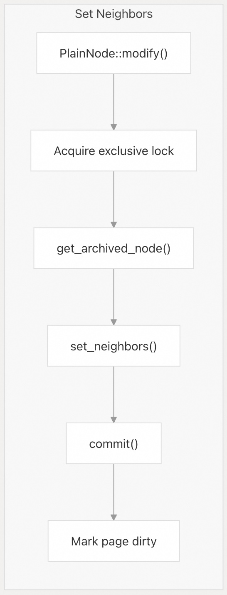  
  
这用于**剪枝操作** (`pruning operations`) 和**索引维护** (`index maintenance`) 期间，以更新**图结构** (`graph structure`)。  
  
**来源:**  
[`pgvectorscale/src/access_method/plain/storage.rs` 309-321](https://github.com/timescale/pgvectorscale/blob/36271fa5/pgvectorscale/src/access_method/plain/storage.rs#L309-L321)  
  
-----  
  
## 标签支持 (Label Support)  
  
纯存储 (`Plain Storage`) 不支持**基于标签的过滤** (`label-based filtering`)：  
  
```rust  
fn get_labels<S: StatsNodeRead>(  
    &self,  
    _index_pointer: IndexPointer,  
    _stats: &mut S,  
) -> Option<LabelSet> {  
    None  
}  
  
fn get_has_labels(&self) -> bool {  
    false  
}  
```  
  
`visit_lsn` 方法断言 `no_filter == true`，确保在使用纯存储 (`Plain Storage`) 时不会尝试标签过滤 (`label filtering`)。  
  
对于标签过滤支持，请使用 SBQ 存储实现。有关更多信息，请参阅 [基于标签的过滤 (Label-Based Filtering)](/timescale/pgvectorscale/7-label-based-filtering)。  
  
**来源:**  
[`pgvectorscale/src/access_method/plain/storage.rs` 327-338](https://github.com/timescale/pgvectorscale/blob/36271fa5/pgvectorscale/src/access_method/plain/storage.rs#L327-L338)  
[`pgvectorscale/src/access_method/plain/storage.rs` 261-261](https://github.com/timescale/pgvectorscale/blob/36271fa5/pgvectorscale/src/access_method/plain/storage.rs#L261-L261)  
  
-----  
  
## 比较：纯存储 (`Plain`) 与 SBQ 存储 (Comparison: Plain vs SBQ Storage)  
  
| 特性 (Feature) | 纯存储 (Plain Storage) | SBQ 存储 (SBQ Storage) |  
| :--- | :--- | :--- |  
| **页面类型** (`Page Type`) | `PageType::Node` | `PageType::SbqNode` |  
| **向量存储** (`Vector Storage`) | 全 `f32` 精度 (`Full f32 precision`) | 量化二进制代码 (`Quantized binary codes`) |  
| **内存使用** (`Memory Usage`) | 每个维度约 4 字节 | 每个维度约 1 位（8 倍压缩） |  
| **距离计算** (`Distance Computation`) | 精确浮点 (`Exact floating point`) | 基于异或 (`XOR-based`) 的近似 (`Approximate`) |  
| **标签支持** (`Label Support`) | 否 (`No`) | 是 (`Yes`) |  
| **重排序支持** (`Resort Support`) | 是（针对俄罗斯套娃 (`Matryoshka`)） | 是（来自堆的完整向量） |  
| **缓存** (`Cache`) | 无 (`None`) | `QuantizedVectorCache` 用于量化向量 (`quantized vectors`) |  
| **列表搜索邻居私有数据** (`LSN Private Data`) | `heap_pointer + neighbors` | `PhantomData`（无缓存数据） |  
| **需要训练** (`Training Required`) | 否 (`No`) | 是（`SbqQuantizer` 训练） |  
| **推荐用于** (`Recommended For`) | 低维向量、精确搜索 | 高维向量、内存受限 |  
  
**来源:**  
[`pgvectorscale/src/access_method/plain/storage.rs` 1-339](https://github.com/timescale/pgvectorscale/blob/36271fa5/pgvectorscale/src/access_method/plain/storage.rs#L1-L339)  
[`pgvectorscale/src/access_method/sbq/storage.rs` 1-462](https://github.com/timescale/pgvectorscale/blob/36271fa5/pgvectorscale/src/access_method/sbq/storage.rs#L1-L462)  
  
-----  
  
## 存储类型选择 (Storage Type Selection)  
  
存储类型由 `storage_layout` 索引选项确定：  
  
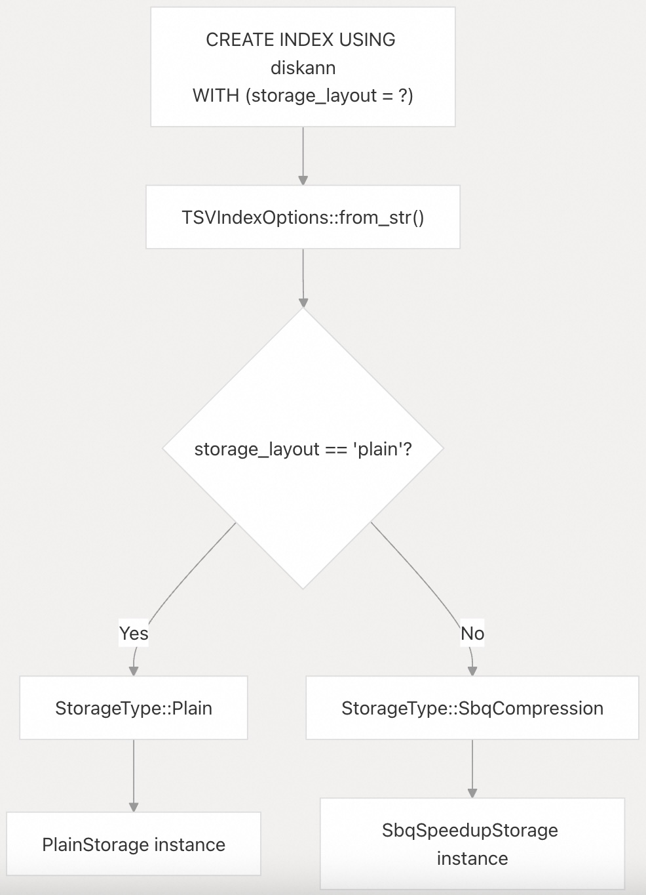  
  
默认值为 `"memory_optimized"`，它映射到 `StorageType::SbqCompression`。要显式使用纯存储 (`Plain Storage`)：  
  
```sql  
CREATE INDEX ON items USING diskann (embedding)  
WITH (storage_layout = 'plain');  
```  
  
**来源:**  
[`pgvectorscale/src/access_method/storage.rs` 151-169](https://github.com/timescale/pgvectorscale/blob/36271fa5/pgvectorscale/src/access_method/storage.rs#L151-L169)  
  
-----  
  
## 相关实现文件 (Related Implementation Files)  
  
纯存储 (`Plain Storage`) 实现涉及 `plain` 模块中的多个文件：  
  
| 文件 (File) | 目的 (Purpose) |  
| :--- | :--- |  
| `plain/storage.rs` | 主要的 `PlainStorage` 结构体和 `Storage` **特质** (`trait`) 实现 |  
| `plain/node.rs` | `PlainNode` 和 `ArchivedPlainNode` 结构体 |  
| `plain/distance_measure.rs` | `PlainDistanceMeasure` 和 `IndexFullDistanceMeasure` |  
  
**来源:**  
[`pgvectorscale/src/access_method/plain/storage.rs` 1-339](https://github.com/timescale/pgvectorscale/blob/36271fa5/pgvectorscale/src/access_method/plain/storage.rs#L1-L339)  
    
#### [PolarDB 学习图谱](https://www.aliyun.com/database/openpolardb/activity "8642f60e04ed0c814bf9cb9677976bd4")
  
  
#### [PostgreSQL 解决方案集合](../201706/20170601_02.md "40cff096e9ed7122c512b35d8561d9c8")
  
  
#### [德哥 / digoal's Github - 公益是一辈子的事.](https://github.com/digoal/blog/blob/master/README.md "22709685feb7cab07d30f30387f0a9ae")
  
  
#### [About 德哥](https://github.com/digoal/blog/blob/master/me/readme.md "a37735981e7704886ffd590565582dd0")
  
  

  
