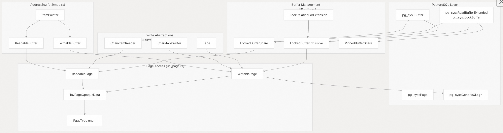
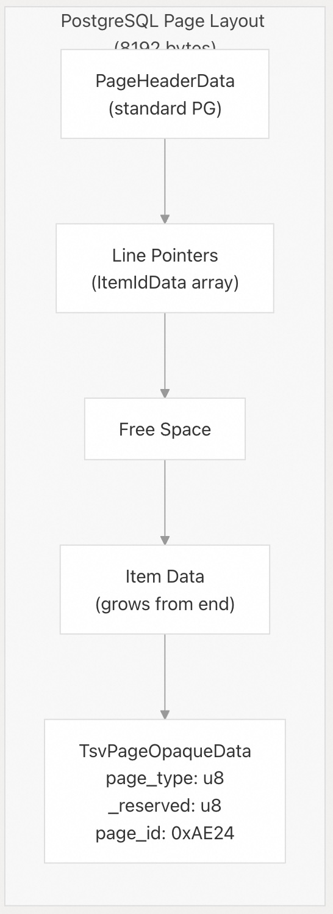
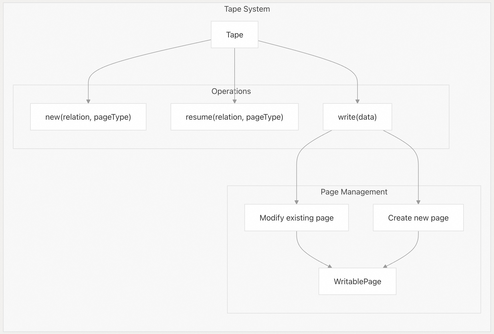
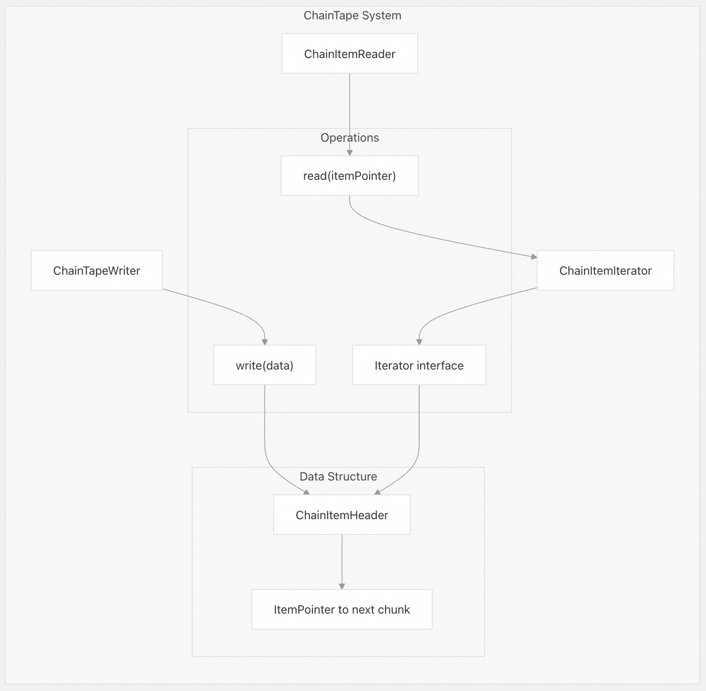
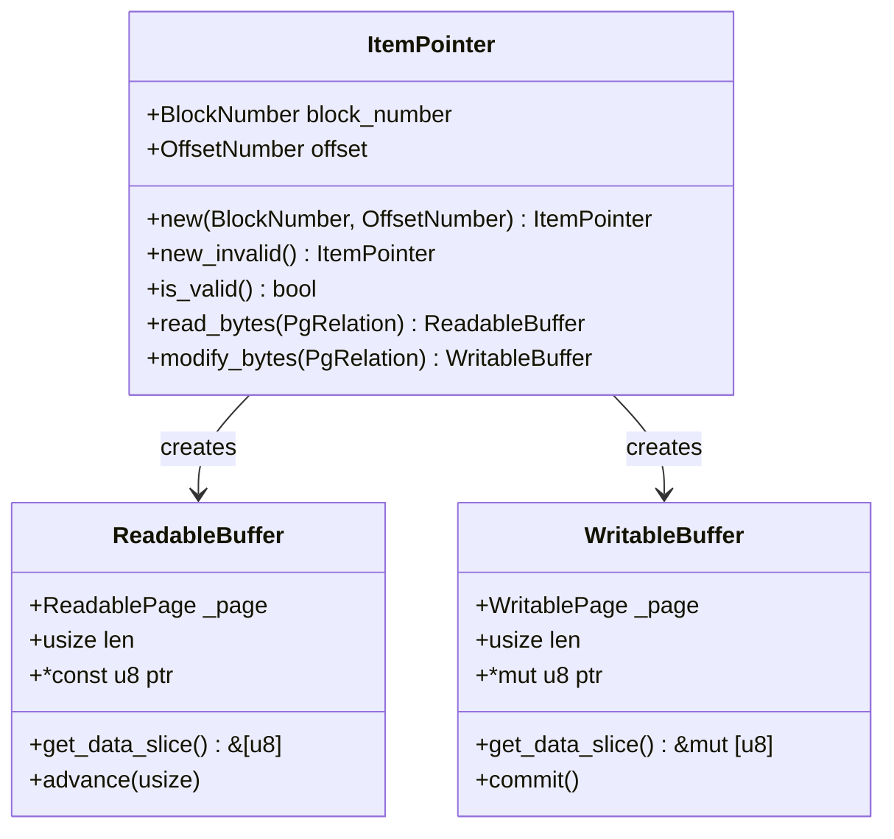
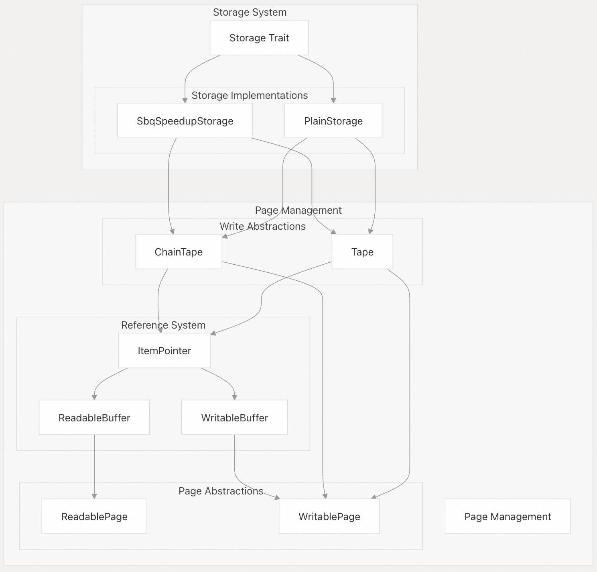

## pgvectorscale 源码学习: 4.4 页面管理 (Page Management)  
              
### 作者              
digoal              
              
### 日期              
2025-11-10              
              
### 标签              
pgvectorscale , 向量数据库 , DiskANN , StreamingDiskANN , 源码学习              
              
----              
              
## 背景              
本文介绍 pgvectorscale 中用于在 PostgreSQL 中存储**向量数据 (vector data)** 和**图结构 (graph structures)** 的**低层页面管理系统 (low-level page management system)**。该系统提供了用于写入**顺序数据 (sequential data)** 的抽象（`Tape` - 磁带），跨页面链接大项目（`ChainTape` - 链式磁带），以及通过适当的**锁定 (locking)** 和 **WAL 集成 (WAL integration)** 安全地访问页面。  
  
**页面管理 (page management)** 层实现在 [`pgvectorscale/src/util/`](https://github.com/timescale/pgvectorscale/blob/36271fa5/pgvectorscale/src/util/) 中，包含以下部分：  
  
  * **页面抽象 (Page abstractions)**：用于 **WAL 记录 (WAL-logged)** 页面访问的 `WritablePage`（可写页面）和 `ReadablePage`（可读页面）。  
  * **缓冲区管理 (Buffer management)**：**RAII 保护的缓冲区锁 (RAII-guarded buffer locks)**（`LockedBufferExclusive` - 独占锁定缓冲区，`LockedBufferShare` - 共享锁定缓冲区）。  
  * **写入工具 (Write utilities)**：用于顺序写入的 `Tape`（磁带），用于多页面项目的 `ChainTape`（链式磁带）。  
  * **寻址 (Addressing)**：用于引用数据位置的 `ItemPointer`（项目指针）。  
  
-----  
  
## 架构概览 (Architecture Overview)  
  
**页面管理系统 (page management system)** 提供了对 **PostgreSQL 缓冲区管理器 (PostgreSQL's buffer manager)** 的分层抽象：  
  
  
  
来源: [`pgvectorscale/src/util/mod.rs` 1-15](https://github.com/timescale/pgvectorscale/blob/36271fa5/pgvectorscale/src/util/mod.rs#L1-L15) [`pgvectorscale/src/util/page.rs` 1-21](https://github.com/timescale/pgvectorscale/blob/36271fa5/pgvectorscale/src/util/page.rs#L1-L21) [`pgvectorscale/src/util/buffer.rs` 1-20](https://github.com/timescale/pgvectorscale/blob/36271fa5/pgvectorscale/src/util/buffer.rs#L1-L20)  
  
-----  
  
## 页面结构与布局 (Page Structure and Layout)  
  
**PostgreSQL 页面 (PostgreSQL pages)** 是 8KB 的**块 (blocks)**（`BLCKSZ`），具有标准**头部 (header)**、**行指针数组 (line pointer array)**、**空闲空间 (free space)** 和可选的**特殊区域 (special area)**。pgvectorscale 使用特殊区域来存储 `TsvPageOpaqueData`（TsvPage 不透明数据）：  
  
  
  
`TsvPageOpaqueData` **结构体 (struct)** [`pgvectorscale/src/util/page.rs` 67-71](https://github.com/timescale/pgvectorscale/blob/36271fa5/pgvectorscale/src/util/page.rs#L67-L71) 包含：  
  
  * `page_type: u8` - 标识**页面类型 (page type)**（参见 `PageType` **枚举 (enum)**）  
  * `_reserved: u8` - **保留字节 (Reserved byte)** 供将来使用  
  * `page_id: u16` - 用于验证的**魔术数字 (Magic number)** `TSV_PAGE_ID = 0xAE24`  
  
页面类型验证发生在 [`pgvectorscale/src/util/page.rs` 98-101](https://github.com/timescale/pgvectorscale/blob/36271fa5/pgvectorscale/src/util/page.rs#L98-L101) 中，使用**魔术数字 (magic number)** 来确保页面属于 pgvectorscale。  
  
来源: [`pgvectorscale/src/util/page.rs` 23-102](https://github.com/timescale/pgvectorscale/blob/36271fa5/pgvectorscale/src/util/page.rs#L23-L102)  
  
-----  
  
## 页面类型 (Page Types)  
  
`PageType` **枚举 (enum)** [`pgvectorscale/src/util/page.rs` 28-38](https://github.com/timescale/pgvectorscale/blob/36271fa5/pgvectorscale/src/util/page.rs#L28-L38) 标识了不同的专用页面类型：  
  
| PageType (页面类型) | Value (值) | Purpose (用途) | Chained (是否链式) |  
| :--- | :--- | :--- | :--- |  
| `MetaV1` (元数据 V1) | 0 | 原始元数据格式（已弃用 **deprecated**） | 否 |  
| `Node` (节点) | 1 | PlainStorage 向量节点 | 否 |  
| `PqQuantizerDef` (PQ 量化器定义) | 2 | **乘积量化 (Product quantization)** 定义 | 否 |  
| `PqQuantizerVector` (PQ 量化器向量) | 3 | **乘积量化 (Product quantization)** 向量 | 否 |  
| `SbqMeansV1` (SBQ 均值 V1) | 4 | 原始 SBQ 均值（已弃用 **deprecated**） | 否 |  
| `SbqNode` (SBQ 节点) | 5 | SbqSpeedupStorage **量化节点 (quantized nodes)** | 否 |  
| `MetaV2` (元数据 V2) | 6 | 更新的元数据格式（已弃用 **deprecated**） | 否 |  
| `SbqMeans` (SBQ 均值) | 7 | 当前 SBQ **量化器均值 (quantizer means)** | 是 |  
| `Meta` (元数据) | 8 | 当前元数据格式 | 是 |  
  
`is_chained()` **方法 (method)** [`pgvectorscale/src/util/page.rs` 59-61](https://github.com/timescale/pgvectorscale/blob/36271fa5/pgvectorscale/src/util/page.rs#L59-L61) 对于 `SbqMeans` 和 `Meta` 页面类型返回 `true`，这些类型通过 `ChainTape`（链式磁带）支持**多页面存储 (multi-page storage)**。**非链式 (Non-chained)** 类型使用 `Tape`（磁带）进行**顺序写入 (sequential writes)**。  
  
来源: [`pgvectorscale/src/util/page.rs` 28-62](https://github.com/timescale/pgvectorscale/blob/36271fa5/pgvectorscale/src/util/page.rs#L28-L62)  
  
-----  
  
## 缓冲区管理 (Buffer Management)  
  
**缓冲区管理系统 (buffer management system)** [`pgvectorscale/src/util/buffer.rs`](https://github.com/timescale/pgvectorscale/blob/36271fa5/pgvectorscale/src/util/buffer.rs) 提供了围绕 PostgreSQL 缓冲区操作的 **RAII 风格的包装器 (RAII-style wrappers)**，具有**自动锁管理 (automatic lock management)** 功能：  
  
| Type (类型) | Lock Mode (锁定模式) | Use Case (用例) | Drop Behavior (释放行为) |  
| :--- | :--- | :--- | :--- |  
| `LockedBufferExclusive` (独占锁定缓冲区) | **Exclusive** (独占) | 写入/修改页面 | **Unlocks buffer** (解锁缓冲区) |  
| `LockedBufferShare` (共享锁定缓冲区) | **Shared** (共享) | 读取页面 | **Unlocks buffer** (解锁缓冲区) |  
| `PinnedBufferShare` (共享固定缓冲区) | None (**pinned only** - 仅固定) | 索引扫描 | **Unpins buffer** (解除固定缓冲区) |  
| `LockRelationForExtension` (关系扩展锁) | **Relation extension lock** (关系扩展锁) | 创建新页面 | **Unlocks relation** (解锁关系) |  
  
### LockedBufferExclusive (独占锁定缓冲区)  
  
用于修改页面时的**独占访问 (exclusive access)**。关键方法：  
  
  * `new(relation)` [`pgvectorscale/src/util/buffer.rs` 42-54](https://github.com/timescale/pgvectorscale/blob/36271fa5/pgvectorscale/src/util/buffer.rs#L42-L54) - 使用新页面**扩展关系 (Extends relation)**  
  * `read(relation, block)` [`pgvectorscale/src/util/buffer.rs` 56-63](https://github.com/timescale/pgvectorscale/blob/36271fa5/pgvectorscale/src/util/buffer.rs#L56-L63) - 锁定现有页面进行修改  
  * `read_for_cleanup(relation, block)` [`pgvectorscale/src/util/buffer.rs` 65-77](https://github.com/timescale/pgvectorscale/blob/36271fa5/pgvectorscale/src/util/buffer.rs#L65-L77) - 用于 **vacuum**（清理）操作的特殊锁定模式  
  
`new()` 方法需要 `LockRelationForExtension` [`pgvectorscale/src/util/buffer.rs` 27-40](https://github.com/timescale/pgvectorscale/blob/36271fa5/pgvectorscale/src/util/buffer.rs#L27-L40) 来**序列化 (serialize)** 跨后端的关系扩展。  
  
### LockedBufferShare (共享锁定缓冲区)  
  
用于**共享读取访问 (shared read access)**。通过 `read(relation, block)` [`pgvectorscale/src/util/buffer.rs` 157-164](https://github.com/timescale/pgvectorscale/blob/36271fa5/pgvectorscale/src/util/buffer.rs#L157-L164) 创建，它使用 `BUFFER_LOCK_SHARE` 获取**共享锁 (shared lock)**。  
  
### PinnedBufferShare (共享固定缓冲区)  
  
在**索引扫描 (index scans)** 期间使用，此时会返回来自同一页面的多个**元组 (tuples)**。通过 `read(relation, block)` [`pgvectorscale/src/util/buffer.rs` 208-215](https://github.com/timescale/pgvectorscale/blob/36271fa5/pgvectorscale/src/util/buffer.rs#L208-L215) 创建，它**固定 (pins)** 缓冲区而不锁定，允许**并发访问 (concurrent access)**。在 `amgettuple` 中使用，以满足 PostgreSQL 要求在返回**堆元组 (heap tuples)** 时索引缓冲区保持固定的要求。  
  
来源: [`pgvectorscale/src/util/buffer.rs` 10-238](https://github.com/timescale/pgvectorscale/blob/36271fa5/pgvectorscale/src/util/buffer.rs#L10-L238)  
  
-----  
  
## WritablePage（可写页面）和 ReadablePage（可读页面）  
  
这些抽象 [`pgvectorscale/src/util/page.rs`](https://github.com/timescale/pgvectorscale/blob/36271fa5/pgvectorscale/src/util/page.rs) 提供了安全、**WAL 记录 (WAL-logged)** 的页面访问：  
  
### WritablePage (可写页面)  
  
`WritablePage` [`pgvectorscale/src/util/page.rs` 16-21](https://github.com/timescale/pgvectorscale/blob/36271fa5/pgvectorscale/src/util/page.rs#L16-L21) 通过**自动 WAL 日志记录 (automatic WAL logging)** 管理写入操作：  
  
**创建方法 (Creation Methods)：**  
  
  * `new(relation, page_type)` [`pgvectorscale/src/util/page.rs` 110-125](https://github.com/timescale/pgvectorscale/blob/36271fa5/pgvectorscale/src/util/page.rs#L110-L125) - 创建新页面，扩展关系  
  * `modify(relation, block)` [`pgvectorscale/src/util/page.rs` 138-141](https://github.com/timescale/pgvectorscale/blob/36271fa5/pgvectorscale/src/util/page.rs#L138-L141) - 修改现有页面  
  * `cleanup(relation, block)` [`pgvectorscale/src/util/page.rs` 166-169](https://github.com/timescale/pgvectorscale/blob/36271fa5/pgvectorscale/src/util/page.rs#L166-L169) - **Vacuum**（清理）清理操作  
  
**关键方法 (Key Methods)：**  
  
  * `add_item(data)` / `add_item_unchecked(data)` [`pgvectorscale/src/util/page.rs` 143-163](https://github.com/timescale/pgvectorscale/blob/36271fa5/pgvectorscale/src/util/page.rs#L143-L163) - 通过 `PageAddItemExtended` 向页面添加项目  
  * `reinit(page_type)` [`pgvectorscale/src/util/page.rs` 127-136](https://github.com/timescale/pgvectorscale/blob/36271fa5/pgvectorscale/src/util/page.rs#L127-L136) - 使用新类型**重新初始化 (Reinitializes)** 页面  
  * `get_aligned_free_space()` [`pgvectorscale/src/util/page.rs` 201-204](https://github.com/timescale/pgvectorscale/blob/36271fa5/pgvectorscale/src/util/page.rs#L201-L204) - 返回 **8 字节对齐 (8-byte aligned)** 的**空闲空间 (free space)**  
  * `commit()` [`pgvectorscale/src/util/page.rs` 227-233](https://github.com/timescale/pgvectorscale/blob/36271fa5/pgvectorscale/src/util/page.rs#L227-L233) - 标记为 **dirty**（脏），完成 **WAL 日志记录 (WAL logging)**  
  
**WAL 集成 (WAL Integration)：**  
构造函数使用 `GenericXLogRegisterBuffer()` 注册缓冲区。所有修改都会被记录日志。如果未调用 `commit()`，则 `Drop` **实现 (implementation)** [`pgvectorscale/src/util/page.rs` 236-245](https://github.com/timescale/pgvectorscale/blob/36271fa5/pgvectorscale/src/util/page.rs#L236-L245) 会调用 `GenericXLogAbort()`（通用 XLog 终止），提供**自动回滚 (automatic rollback)**。  
  
### ReadablePage (可读页面)  
  
`ReadablePage` [`pgvectorscale/src/util/page.rs` 254-257](https://github.com/timescale/pgvectorscale/blob/36271fa5/pgvectorscale/src/util/page.rs#L254-L257) 提供**只读访问 (read-only access)**：  
  
**创建 (Creation)：**  
  
  * `read(relation, block)` [`pgvectorscale/src/util/page.rs` 261-265](https://github.com/timescale/pgvectorscale/blob/36271fa5/pgvectorscale/src/util/page.rs#L261-L265) - 使用共享锁读取页面  
  
**关键方法 (Key Methods)：**  
  
  * `get_item_unchecked(offset)` [`pgvectorscale/src/util/page.rs` 277-289](https://github.com/timescale/pgvectorscale/blob/36271fa5/pgvectorscale/src/util/page.rs#L277-L289) - 返回**偏移量 (offset)** 处项目的 `ReadableBuffer`  
  * `get_type()` [`pgvectorscale/src/util/page.rs` 267-270](https://github.com/timescale/pgvectorscale/blob/36271fa5/pgvectorscale/src/util/page.rs#L267-L270) - 返回页面的 `PageType`  
  
来源: [`pgvectorscale/src/util/page.rs` 16-297](https://github.com/timescale/pgvectorscale/blob/36271fa5/pgvectorscale/src/util/page.rs#L16-L297)  
  
-----  
  
## 磁带系统 (Tape System)  
  
`Tape`（磁带）**抽象 (abstraction)** 为适合单个页面的数据提供了一种简单的**顺序写入机制 (sequential writing mechanism)**。它通过在需要时自动分配新页面来创建一个“无限”的**磁带状结构 (tape-like structure)**。  
  
  
  
关键操作有：  
  
  * `Tape::new()`: 创建从新页面开始的新磁带  
  * `Tape::resume()`: 从指定类型的最后一页恢复磁带  
  * `Tape::write()`: 将数据写入磁带，并在需要时自动创建新页面  
  
来源: [`src/util/tape.rs` 1-74](https://github.com/timescale/pgvectorscale/blob/36271fa5/src/util/tape.rs#L1-L74)  
  
-----  
  
## 链式磁带系统 (Chain Tape System)  
  
对于可能不适合单个页面的数据，pgvectorscale 提供了 `ChainTape`（链式磁带）系统。它建立在基本 `Tape` 概念的基础上，但增加了**跨多个页面链接数据 (chain data across multiple pages)** 的能力。  
  
  
  
写入大数据时：  
  
1.  数据被拆分成适合页面的**块 (chunks)**  
2.  每个块都存储一个包含指向下一个块的**指针 (pointer)** 的**头部 (header)**  
3.  最后一个块具有一个**无效指针 (invalid pointer)** 来标记链的末尾  
  
读取时：  
  
1.  从提供的**项目指针 (item pointer)** 开始  
2.  读取块并跟随下一个指针  
3.  继续直到到达无效指针  
  
来源: [`src/util/chain.rs` 1-185](https://github.com/timescale/pgvectorscale/blob/36271fa5/src/util/chain.rs#L1-L185)  
  
-----  
  
## 项目指针 (Item Pointers)  
  
`ItemPointer` **结构体 (struct)** 是 pgvectorscale 中用于定位页面内数据的**基本引用机制 (fundamental reference mechanism)**：  
  

  
一个 `ItemPointer` 由以下部分组成：  
  
  * `block_number`（**块编号**）：标识关系内的页面  
  * `offset`（**偏移量**）：标识页面内的项目  
  
关键操作：  
  
  * `read_bytes()`: 从指向的位置读取数据  
  * `modify_bytes()`: 修改指向位置的数据  
  * `is_valid()`: 检查指针是否有效  
  
来源: [`src/util/mod.rs` 16-174](https://github.com/timescale/pgvectorscale/blob/36271fa5/src/util/mod.rs#L16-L174)  
  
-----  
  
## 与存储实现的集成 (Integration with Storage Implementations)  
  
**页面管理系统 (page management system)** 是 pgvectorscale 中**更高级存储实现 (higher-level storage implementations)** 的基础。`Tape`（磁带）和 `ChainTape`（链式磁带）**抽象 (abstractions)** 对于实现不同的**存储策略 (storage strategies)** 尤为重要：  
  
  
  
来源: [`src/util/mod.rs` 1-15](https://github.com/timescale/pgvectorscale/blob/36271fa5/src/util/mod.rs#L1-L15) [`src/util/tape.rs` 1-10](https://github.com/timescale/pgvectorscale/blob/36271fa5/src/util/tape.rs#L1-L10) [`src/util/chain.rs` 1-15](https://github.com/timescale/pgvectorscale/blob/36271fa5/src/util/chain.rs#L1-L15)  
  
-----  
  
## 实现细节 (Implementation Details)  
  
### 页面类型验证 (Page Type Validation)  
  
**页面管理系统 (page management system)** 使用一个**魔术数字 (magic number)**（`TSV_PAGE_ID`）来验证属于 pgvectorscale 的页面。每个页面末尾的**特殊区域 (special area)** 包含此**标识符 (identifier)** 以及页面类型信息。  
  
```  
TsvPageOpaqueData {  
    page_type: u8,     // PageType enum value (PageType 枚举值)  
    _reserved: u8,     // Reserved for future use (为将来使用而保留)  
    page_id: u16,      // Magic ID (TSV_PAGE_ID) (魔术 ID)  
}  
```  
  
来源: [`src/util/page.rs` 64-102](https://github.com/timescale/pgvectorscale/blob/36271fa5/src/util/page.rs#L64-L102)  
  
### WAL 日志记录 (WAL Logging)  
  
pgvectorscale 中的所有**写入操作 (write operations)** 都使用 PostgreSQL 的**通用 WAL 机制 (generic WAL mechanism)** 进行了适当的 **WAL 记录 (WAL-logged)**。`WritablePage` **实现 (implementation)** 自动处理此过程：  
  
1.  使用 `GenericXLogStart()` 启动 **WAL 日志记录 (WAL logging)**  
2.  使用 `GenericXLogRegisterBuffer()`（通用 XLog 注册缓冲区）注册缓冲区  
3.  修改页面内容  
4.  使用 `GenericXLogFinish()` 完成更改**提交 (Commit)**  
5.  或在需要时使用 `GenericXLogAbort()`（通用 XLog 终止）**中止 (abort)** 更改  
  
来源: [`src/util/page.rs` 105-136](https://github.com/timescale/pgvectorscale/blob/36271fa5/src/util/page.rs#L105-L136) [`src/util/page.rs` 225-245](https://github.com/timescale/pgvectorscale/blob/36271fa5/src/util/page.rs#L225-L245)  
  
### 内存安全 (Memory Safety)  
  
**页面管理系统 (page management system)** 采用 **RAII 原则 (RAII principles)** 设计，以确保适当的**资源处理 (resource handling)**。所有**缓冲区锁 (buffer locks)** 在相应对象超出作用域时都会**自动释放 (automatically released)**：  
  
  * `LockedBufferExclusive`（独占锁定缓冲区）：在**释放 (dropped)** 时自动**解锁 (unlocks)** 并**释放 (releases)** 缓冲区  
  * `LockedBufferShare`（共享锁定缓冲区）：在**释放 (dropped)** 时自动**解锁 (unlocks)** 并**释放 (releases)** 缓冲区  
  * `WritablePage`（可写页面）：在**释放 (dropped)** 时自动**中止 (aborts)** 未提交的更改  
  
来源: [`src/util/buffer.rs` 119-137](https://github.com/timescale/pgvectorscale/blob/36271fa5/src/util/buffer.rs#L119-L137) [`src/util/buffer.rs` 175-186](https://github.com/timescale/pgvectorscale/blob/36271fa5/src/util/buffer.rs#L175-L186) [`src/util/page.rs` 236-245](https://github.com/timescale/pgvectorscale/blob/36271fa5/src/util/page.rs#L236-L245)  
    
#### [PolarDB 学习图谱](https://www.aliyun.com/database/openpolardb/activity "8642f60e04ed0c814bf9cb9677976bd4")
  
  
#### [PostgreSQL 解决方案集合](../201706/20170601_02.md "40cff096e9ed7122c512b35d8561d9c8")
  
  
#### [德哥 / digoal's Github - 公益是一辈子的事.](https://github.com/digoal/blog/blob/master/README.md "22709685feb7cab07d30f30387f0a9ae")
  
  
#### [About 德哥](https://github.com/digoal/blog/blob/master/me/readme.md "a37735981e7704886ffd590565582dd0")
  
  

  
